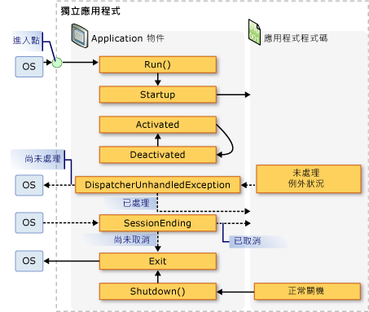
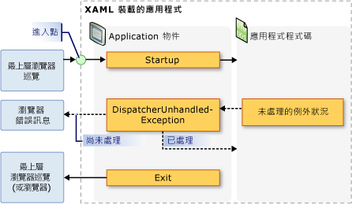

# <a name="application-management-overview"></a>應用程式管理概觀
所有應用程式通常會共用一組適用於應用程式實作和管理的通用功能。 本主題提供中的功能概觀<xref:System.Windows.Application>類別來建立及管理應用程式。  

## <a name="the-application-class"></a>Application 類別  
 在 WPF 中，應用程式範圍的常見功能封裝在<xref:System.Windows.Application>類別。 <xref:System.Windows.Application>類別包括下列功能：  
  
-   追蹤應用程式存留期並與其互動。  
  
-   擷取及處理命令列參數。  
  
-   偵測及回應未處理的例外狀況。  
  
-   共用應用程式範圍的屬性和資源。  
  
-   管理獨立應用程式中的視窗。  
  
-   追蹤及管理瀏覽。  
  
<a name="The_Application_Class"></a>   
## <a name="how-to-perform-common-tasks-using-the-application-class"></a>如何使用 Application 類別執行一般工作  
 如果您不感興趣的詳細資料的所有<xref:System.Windows.Application>類別下, 表列出一些常見工作的<xref:System.Windows.Application>，以及如何完成這些工作。 您可以檢視相關的 API 和主題，來尋找詳細資訊和範例程式碼。  
  
|工作|方法|  
|----------|--------------|  
|取得代表目前應用程式的物件|請使用 <xref:System.Windows.Application.Current%2A?displayProperty=nameWithType> 屬性。|  
|將啟動畫面新增至應用程式|請參閱[WPF 應用程式中加入啟動顯示畫面](how-to-add-a-splash-screen-to-a-wpf-application.md)。|  
|啟動應用程式|請使用 <xref:System.Windows.Application.Run%2A?displayProperty=nameWithType> 方法。|  
|停止應用程式|使用<xref:System.Windows.Application.Shutdown%2A>方法的<xref:System.Windows.Application.Current%2A?displayProperty=nameWithType>物件。|  
|從命令列取得引數|處理<xref:System.Windows.Application.Startup?displayProperty=nameWithType>事件，並使用<xref:System.Windows.StartupEventArgs.Args%2A?displayProperty=nameWithType>屬性。 如需範例，請參閱<xref:System.Windows.Application.Startup?displayProperty=nameWithType>事件。|  
|取得及設定應用程式結束代碼|設定<xref:System.Windows.ExitEventArgs.ApplicationExitCode%2A?displayProperty=nameWithType>中的屬性<xref:System.Windows.Application.Exit?displayProperty=nameWithType>事件處理常式或呼叫<xref:System.Windows.Application.Shutdown%2A>方法並傳入整數。|  
|偵測及回應未處理的例外狀況|處理<xref:System.Windows.Application.DispatcherUnhandledException>事件。|  
|取得及設定應用程式範圍的資源|請使用 <xref:System.Windows.Application.Resources%2A?displayProperty=nameWithType> 屬性。|  
|使用應用程式範圍的資源字典|請參閱[使用應用程式範圍的資源字典](how-to-use-an-application-scope-resource-dictionary.md)。|  
|取得及設定應用程式範圍的屬性|請使用 <xref:System.Windows.Application.Properties%2A?displayProperty=nameWithType> 屬性。|  
|取得及儲存應用程式的狀態|請參閱[保存和還原應用程式範圍的屬性，在應用程式工作階段之間](persist-and-restore-application-scope-properties.md)。|  
|管理非程式碼資料檔案，包括資源檔、內容檔案和來源網站檔案。|請參閱[WPF 應用程式資源、 內容和資料檔案](wpf-application-resource-content-and-data-files.md)。|  
|管理獨立應用程式中的視窗|請參閱 [WPF 視窗概觀](wpf-windows-overview.md)。|  
|追蹤及管理瀏覽|請參閱[巡覽概觀](navigation-overview.md)。|  
  
<a name="The_Application_Definition"></a>   
## <a name="the-application-definition"></a>應用程式定義  
 若要利用的功能<xref:System.Windows.Application>類別，您必須實作應用程式定義。 WPF 應用程式定義是類別，衍生自<xref:System.Windows.Application>和已使用特殊的 MSBuild 設定。  

### <a name="implementing-an-application-definition"></a>實作應用程式定義  
 使用標記和程式碼後置實作典型的 WPF 應用程式定義。 這可讓您使用標記，以宣告方式設定應用程式屬性、資源和註冊事件，同時在程式碼後置中，處理事件及實作應用程式特定行為。  
  
 下列範例示範如何使用標記和程式碼後置，來實作應用程式定義：  
  
 [!code-xaml[ApplicationSnippets#ApplicationXAML](~/samples/snippets/csharp/VS_Snippets_Wpf/ApplicationSnippets/CSharp/App.xaml#applicationxaml)]  
  
 [!code-csharp[ApplicationSnippets#ApplicationCODEBEHIND](~/samples/snippets/csharp/VS_Snippets_Wpf/ApplicationSnippets/CSharp/App.xaml.cs#applicationcodebehind)]
 [!code-vb[ApplicationSnippets#ApplicationCODEBEHIND](~/samples/snippets/visualbasic/VS_Snippets_Wpf/ApplicationSnippets/visualbasic/application.xaml.vb#applicationcodebehind)]  
  
 若要搭配使用標記檔案和程式碼後置檔案，下列情況必須成立：  
  
- 在標記中，`Application`元素必須包含`x:Class`屬性。 應用程式建置時是否存在`x:Class`標記中的檔案時，MSBuild 會建立`partial`類別衍生自<xref:System.Windows.Application>，並具有所指定的名稱`x:Class`屬性。 這需要 XAML 結構描述的 XML 命名空間宣告 (`xmlns:x="http://schemas.microsoft.com/winfx/2006/xaml"`)。
  
-   類別必須是在程式碼後置`partial`類別所指定的同名`x:Class`標記中的屬性，而且必須衍生自<xref:System.Windows.Application>。 這可讓程式碼後置檔案相關聯`partial`建置應用程式時，會將標記檔案產生的類別 (請參閱 <<c2> [ 建置 WPF 應用程式](building-a-wpf-application-wpf.md))。  
  
> [!NOTE]
>  當您建立新的 WPF 應用程式專案或 WPF 瀏覽器應用程式專案使用 Visual Studio 時，應用程式定義預設會包含，並使用標記和程式碼後置定義。  
  
 此程式碼是實作應用程式定義的最低需求。 不過，其他的 MSBuild 設定需要對應用程式定義，再建置及執行應用程式。  
  
### <a name="configuring-the-application-definition-for-msbuild"></a>設定 MSBuild 的應用程式定義  
 獨立應用程式和 XAML 瀏覽器應用程式 (Xbap) 需要某種程度的基礎結構的實作，才能執行。 此基礎結構的最重要部分是進入點。 當使用者啟動應用程式時，作業系統會呼叫進入點，這是用於啟動應用程式的已知函式。  
  
 傳統上，開發人員必須自行撰寫這段程式碼的一部分或全部 (視使用技術而定)。 不過，WPF 產生這個程式碼，當您的應用程式定義的標記檔案設定為 MSBuild`ApplicationDefinition`項目，如下列 MSBuild 專案檔中所示：  
  
```xml  
<Project   
  DefaultTargets="Build"  
                        xmlns="http://schemas.microsoft.com/developer/msbuild/2003">  
  ...  
  <ApplicationDefinition Include="App.xaml" />  
  <Compile Include="App.xaml.cs" />  
  ...  
</Project>  
```  
  
 因為程式碼後置檔案包含程式碼，就會標示為 MSBuild`Compile`項目，因此在正常。  
  
 這些 MSBuild 標記和程式碼後置檔案的組態應用程式定義的應用程式時，MSBuild 產生如下所示的程式碼會：  
  
 [!code-csharp[auto-generated-code](~/samples/snippets/csharp/VS_Snippets_Wpf/AppDefAugSnippets/CSharp/App.cs)]
 [!code-vb[auto-generated-code](~/samples/snippets/visualbasic/VS_Snippets_Wpf/AppDefAugSnippets/VisualBasic/App.vb)]  
  
 產生的程式碼可增強您的應用程式定義額外的基礎結構程式碼，其中包括進入點方法開頭`Main`。 <xref:System.STAThreadAttribute>屬性會套用至`Main`表示 WPF 應用程式的主要 UI 執行緒為 STA 執行緒，所需的 WPF 應用程式的方法。 呼叫時，`Main`建立的新執行個體`App`再呼叫`InitializeComponent`標記中實作方法，以註冊事件，並設定屬性。 因為`InitializeComponent`產生，您不需要明確地呼叫`InitializeComponent`從應用程式定義一樣<xref:System.Windows.Controls.Page>和<xref:System.Windows.Window>實作。 最後，<xref:System.Windows.Application.Run%2A>呼叫方法來啟動應用程式。  
  
<a name="Getting_the_Current_Application"></a>   
## <a name="getting-the-current-application"></a>取得目前的應用程式  
 因為的功能<xref:System.Windows.Application>整個應用程式可共用的類別，則只有一個執行個體<xref:System.Windows.Application>每個類別<xref:System.AppDomain>。 若要強制執行此項目，<xref:System.Windows.Application>類別會實作為單一類別 (請參閱[中實作 Singleton C# ](https://go.microsoft.com/fwlink/?LinkId=100567))，這會建立本身的單一執行個體，並提供共用存取權與`static`<xref:System.Windows.Application.Current%2A>屬性。  
  
 下列程式碼示範如何取得的參考<xref:System.Windows.Application>目前的物件<xref:System.AppDomain>。  
  
 [!code-csharp[ApplicationManagementOverviewSnippets#GetCurrentAppCODE](~/samples/snippets/csharp/VS_Snippets_Wpf/ApplicationManagementOverviewSnippets/CSharp/MainWindow.xaml.cs#getcurrentappcode)]
 [!code-vb[ApplicationManagementOverviewSnippets#GetCurrentAppCODE](~/samples/snippets/visualbasic/VS_Snippets_Wpf/ApplicationManagementOverviewSnippets/VisualBasic/MainWindow.xaml.vb#getcurrentappcode)]  
  
 <xref:System.Windows.Application.Current%2A> 傳回的執行個體的參考<xref:System.Windows.Application>類別。 如果您想要參考您<xref:System.Windows.Application>衍生的類別，您必須將轉換的值<xref:System.Windows.Application.Current%2A>屬性，如下列範例所示。  
  
 [!code-csharp[ApplicationManagementOverviewSnippets#GetSTCurrentAppCODE](~/samples/snippets/csharp/VS_Snippets_Wpf/ApplicationManagementOverviewSnippets/CSharp/MainWindow.xaml.cs#getstcurrentappcode)]
 [!code-vb[ApplicationManagementOverviewSnippets#GetSTCurrentAppCODE](~/samples/snippets/visualbasic/VS_Snippets_Wpf/ApplicationManagementOverviewSnippets/VisualBasic/MainWindow.xaml.vb#getstcurrentappcode)]  
  
 您可以檢查的值<xref:System.Windows.Application.Current%2A>存留期內隨時<xref:System.Windows.Application>物件。 不過，您應該要小心。 在後<xref:System.Windows.Application>具現化類別，有一段期間的狀態<xref:System.Windows.Application>物件不一致。 在這段期間，<xref:System.Windows.Application>正在執行的各種初始化工作所需的程式碼，若要執行，包括建立應用程式基礎結構、 設定屬性，以及註冊事件。 如果您嘗試使用<xref:System.Windows.Application>物件在此期間，您的程式碼可能會有非預期的結果，特別是當它取決於各種<xref:System.Windows.Application>所設定的屬性。  
  
 當<xref:System.Windows.Application>完成其初始化工作，會真正開始其存留期。  
  
<a name="Application_Lifetime"></a>   
## <a name="application-lifetime"></a>應用程式存留期  
 WPF 應用程式的存留期由多個所引發的事件標記<xref:System.Windows.Application>，讓您知道您的應用程式啟動時，經過啟用和停用，並已關閉。  

<a name="Splash_Screen"></a>   
### <a name="splash-screen"></a>啟動顯示畫面  
 從開始[!INCLUDE[net_v35SP1_short](../../../../includes/net-v35sp1-short-md.md)]，您可以指定要在啟動視窗中，使用的影像或*啟動顯示畫面*。 <xref:System.Windows.SplashScreen>類別可讓您輕鬆地在載入您的應用程式時顯示啟動視窗。 <xref:System.Windows.SplashScreen>  視窗建立後之前, 所示<xref:System.Windows.Application.Run%2A>呼叫。 如需詳細資訊，請參閱 <<c0> [ 應用程式啟動時間](../advanced/application-startup-time.md)並[WPF 應用程式中加入啟動顯示畫面](how-to-add-a-splash-screen-to-a-wpf-application.md)。  
  
<a name="Starting_an_Application"></a>   
### <a name="starting-an-application"></a>啟動應用程式  
 之後<xref:System.Windows.Application.Run%2A>稱為和初始化應用程式、 應用程式已準備好執行。 當以表示目前<xref:System.Windows.Application.Startup>就會引發事件：  
  
[!code-csharp[Startup-event](~/samples/snippets/csharp/VS_Snippets_Wpf/ApplicationStartupSnippets/CSharp/App.xaml.cs?range=3-11,31-33)]
[!code-vb[Startup-event](~/samples/snippets/visualbasic/VS_Snippets_Wpf/ApplicationStartupSnippets/visualbasic/application.xaml.vb?range=5-11,30-32)]
  
 此時在應用程式的存留期，最常見的做法是顯示 UI。  
  
<a name="Showing_a_User_Interface"></a>
### <a name="showing-a-user-interface"></a>顯示使用者介面  
 大部分的獨立 Windows 應用程式開啟<xref:System.Windows.Window>何時開始執行。 <xref:System.Windows.Application.Startup>事件處理常式是一個位置，從中您可以執行這項操作，如下列程式碼所示。  
  
 [!code-xaml[AppShowWindowHardSnippets#StartupEventMARKUP](~/samples/snippets/csharp/VS_Snippets_Wpf/AppShowWindowHardSnippets/CSharp/App.xaml#startupeventmarkup)]  
  
 [!code-csharp[AppShowWindowHardSnippets#StartupEventCODEBEHIND](~/samples/snippets/csharp/VS_Snippets_Wpf/AppShowWindowHardSnippets/CSharp/App.xaml.cs#startupeventcodebehind)]
 [!code-vb[AppShowWindowHardSnippets#StartupEventCODEBEHIND](~/samples/snippets/visualbasic/VS_Snippets_Wpf/AppShowWindowHardSnippets/VisualBasic/Application.xaml.vb#startupeventcodebehind)]  
  
> [!NOTE]
>  第一個<xref:System.Windows.Window>来具現化在獨立的應用程式預設會成為主應用程式視窗。 這<xref:System.Windows.Window>所參考物件<xref:System.Windows.Application.MainWindow%2A?displayProperty=nameWithType>屬性。 值<xref:System.Windows.Application.MainWindow%2A>如果第一個以外的其他視窗 屬性也可以以程式設計方式變更具現化<xref:System.Windows.Window>應該在主視窗。  
  
 當第一次啟動 XBAP 時，它會最有可能瀏覽至<xref:System.Windows.Controls.Page>。 如下列程式碼所示。  
  
 [!code-xaml[XBAPAppStartupSnippets#StartupXBAPMARKUP](~/samples/snippets/csharp/VS_Snippets_Wpf/XBAPAppStartupSnippets/CSharp/App.xaml#startupxbapmarkup)]  
  
 [!code-csharp[XBAPAppStartupSnippets#StartupXBAPCODEBEHIND](~/samples/snippets/csharp/VS_Snippets_Wpf/XBAPAppStartupSnippets/CSharp/App.xaml.cs#startupxbapcodebehind)]
 [!code-vb[XBAPAppStartupSnippets#StartupXBAPCODEBEHIND](~/samples/snippets/visualbasic/VS_Snippets_Wpf/XBAPAppStartupSnippets/VisualBasic/Application.xaml.vb#startupxbapcodebehind)]  
  
 如果您處理<xref:System.Windows.Application.Startup>只開啟<xref:System.Windows.Window>或瀏覽至<xref:System.Windows.Controls.Page>，您可以設定`StartupUri`改為標記中的屬性。  
  
 下列範例示範如何使用<xref:System.Windows.Application.StartupUri%2A>從獨立應用程式，來開啟<xref:System.Windows.Window>。  
  
 [!code-xaml[ApplicationManagementOverviewSnippets#OverviewStartupUriMARKUP](~/samples/snippets/csharp/VS_Snippets_Wpf/ApplicationManagementOverviewSnippets/CSharp/App.xaml#overviewstartupurimarkup)]  
  
 下列範例示範如何使用<xref:System.Windows.Application.StartupUri%2A>從 瀏覽至 XBAP <xref:System.Windows.Controls.Page>。  
  
 [!code-xaml[PageSnippets#XBAPStartupUriMARKUP](~/samples/snippets/csharp/VS_Snippets_Wpf/PageSnippets/CSharp/App.xaml#xbapstartupurimarkup)]  
  
 此標記與前述用來開啟視窗的程式碼有相同的效果。  
  
> [!NOTE]
>  如需有關瀏覽的詳細資訊，請參閱[巡覽概觀](navigation-overview.md)。  
  
 您需要處理<xref:System.Windows.Application.Startup>事件，以開啟<xref:System.Windows.Window>如果您需要具現化使用非預設建構函式，或您要設定其屬性或訂閱其事件之前顯示，您需要處理的任何命令列引數，啟動應用程式時所提供。  
  
<a name="Processing_Command_Line_Arguments"></a>   
### <a name="processing-command-line-arguments"></a>處理命令列引數  
 在 Windows，可以從命令提示字元或桌面啟動獨立應用程式。 在這兩種情況下，都會將命令列引數傳遞至應用程式。 下列範例顯示以單一命令列引數 "/StartMinimized" 啟動的應用程式：  
  
 `wpfapplication.exe /StartMinimized`  
  
 應用程式在初始化期間，WPF 從作業系統擷取命令列引數，並將它們傳遞至<xref:System.Windows.Application.Startup>透過事件處理常式<xref:System.Windows.StartupEventArgs.Args%2A>屬性<xref:System.Windows.StartupEventArgs>參數。 您可以使用如下的程式碼擷取及儲存命令列引數。  
  
 [!code-xaml[ApplicationStartupSnippets#HandleStartupXAML](~/samples/snippets/csharp/VS_Snippets_Wpf/ApplicationStartupSnippets/CSharp/App.xaml#handlestartupxaml)]  
  
 [!code-csharp[ApplicationStartupSnippets#HandleStartupCODEBEHIND](~/samples/snippets/csharp/VS_Snippets_Wpf/ApplicationStartupSnippets/CSharp/App.xaml.cs#handlestartupcodebehind)]
 [!code-vb[ApplicationStartupSnippets#HandleStartupCODEBEHIND](~/samples/snippets/visualbasic/VS_Snippets_Wpf/ApplicationStartupSnippets/visualbasic/application.xaml.vb#handlestartupcodebehind)]  
  
 程式碼會處理<xref:System.Windows.Application.Startup>若要檢查是否 **/StartMinimized**提供的命令列引數; 如果是的話，它會開啟主視窗<xref:System.Windows.WindowState>的<xref:System.Windows.WindowState.Minimized>。 請注意，因為<xref:System.Windows.Window.WindowState%2A>屬性必須設定以程式設計的方式，主要<xref:System.Windows.Window>必須在程式碼中明確地開啟。  
  
 Xbap 無法擷取及處理命令列引數，因為它們使用 ClickOnce 部署來啟動 (請參閱[部署 WPF 應用程式](deploying-a-wpf-application-wpf.md))。 不過，它們可以透過用來啟動的 URL 擷取及處理查詢字串參數。  
  
<a name="Application_Activation_and_Deactivation"></a>   
### <a name="application-activation-and-deactivation"></a>應用程式啟用和停用  
 Windows 可讓使用者應用程式之間切換。 最常見的做法是使用 ALT+TAB 按鍵組合。 應用程式可以只切換是否顯示<xref:System.Windows.Window>，使用者可以選取。 目前所選<xref:System.Windows.Window>已*作用中視窗*(也稱為*前景視窗*)，而且<xref:System.Windows.Window>接收使用者輸入。 用於作用中視窗的應用程式*作用中的應用程式*(或*前景應用程式*)。 在下列情況中，應用程式會變成使用中應用程式：  
  
-   它已啟動並顯示<xref:System.Windows.Window>。  
  
-   使用者從另一個應用程式切換選取<xref:System.Windows.Window>應用程式中。  
  
 您可以偵測應用程式何時變成作用中處理<xref:System.Windows.Application.Activated?displayProperty=nameWithType>事件。  
  
 同樣地，在下列情況中，應用程式會變成非使用中：  
  
-   使用者從目前的應用程式切換至另一個應用程式。  
  
-   應用程式關閉時。  
  
 您可以偵測應用程式何時變成非使用中處理<xref:System.Windows.Application.Deactivated?displayProperty=nameWithType>事件。  
  
 下列程式碼示範如何處理<xref:System.Windows.Application.Activated>和<xref:System.Windows.Application.Deactivated>事件，以判斷是否為作用中應用程式。  
  
 [!code-xaml[ApplicationActivationSnippets#DetectActivationStateXAML](~/samples/snippets/csharp/VS_Snippets_Wpf/ApplicationActivationSnippets/CSharp/App.xaml#detectactivationstatexaml)]  
  
 [!code-csharp[ApplicationActivationSnippets#DetectActivationStateCODEBEHIND](~/samples/snippets/csharp/VS_Snippets_Wpf/ApplicationActivationSnippets/CSharp/App.xaml.cs#detectactivationstatecodebehind)]
 [!code-vb[ApplicationActivationSnippets#DetectActivationStateCODEBEHIND](~/samples/snippets/visualbasic/VS_Snippets_Wpf/ApplicationActivationSnippets/visualbasic/application.xaml.vb#detectactivationstatecodebehind)]  
  
 A<xref:System.Windows.Window>也可以啟用和停用。 如需詳細資訊，請參閱 <xref:System.Windows.Window.Activated?displayProperty=nameWithType> 和 <xref:System.Windows.Window.Deactivated?displayProperty=nameWithType>。  
  
> [!NOTE]
>  既不<xref:System.Windows.Application.Activated?displayProperty=nameWithType>也不<xref:System.Windows.Application.Deactivated?displayProperty=nameWithType>Xbap，就會引發。  
  
<a name="Application_Shutdown"></a>   
### <a name="application-shutdown"></a>應用程式關閉  
 應用程式一旦關閉，其存留期間便告結束，而應用程式關閉的可能原因包括：  
  
-   在使用者關閉每個<xref:System.Windows.Window>。  
  
-   使用者關閉主<xref:System.Windows.Window>。  
  
-   使用者透過登出或關機結束 Windows 工作階段。  
  
-   已符合應用程式特定條件。  
  
 若要可協助您管理應用程式關閉<xref:System.Windows.Application>提供<xref:System.Windows.Application.Shutdown%2A>方法，<xref:System.Windows.Application.ShutdownMode%2A>屬性，而<xref:System.Windows.Application.SessionEnding>和<xref:System.Windows.Application.Exit>事件。  
  
> [!NOTE]
>  <xref:System.Windows.Application.Shutdown%2A> 只可以從包含的應用程式呼叫<xref:System.Security.Permissions.UIPermission>。 獨立 WPF 應用程式一定會具有這個使用權限。 不過，在網際網路區域部分信任安全性沙箱中執行的 Xbap 則否。  
  
#### <a name="shutdown-mode"></a>程式關閉模式  
 大多數應用程式會在所有視窗關閉或主視窗關閉時一併關閉。 不過有時候，應用程式關閉的時機可能是由其他應用程式特定條件決定。 您可以指定在其下您的應用程式將會關閉設定的條件<xref:System.Windows.Application.ShutdownMode%2A>具有下列其中一種<xref:System.Windows.ShutdownMode>列舉值：  
  
-   <xref:System.Windows.ShutdownMode.OnLastWindowClose>  
  
-   <xref:System.Windows.ShutdownMode.OnMainWindowClose>  
  
-   <xref:System.Windows.ShutdownMode.OnExplicitShutdown>  
  
 預設值<xref:System.Windows.Application.ShutdownMode%2A>是<xref:System.Windows.ShutdownMode.OnLastWindowClose>，也就是說，應用程式會自動關閉應用程式的最後一個視窗由使用者關閉時。 不過，如果您的應用程式，應關閉主視窗關閉時，WPF 會自動執行，如果您設定<xref:System.Windows.Application.ShutdownMode%2A>至<xref:System.Windows.ShutdownMode.OnMainWindowClose>。 這在下列範例中顯示。  
  
 [!code-xaml[ApplicationShutdownModeSnippets#OnMainWindowCloseMARKUP](~/samples/snippets/csharp/VS_Snippets_Wpf/ApplicationShutdownModeSnippets/CS/Page1.xaml#onmainwindowclosemarkup)]  
  
 當您有應用程式特定關閉條件時，您會設定<xref:System.Windows.Application.ShutdownMode%2A>至<xref:System.Windows.ShutdownMode.OnExplicitShutdown>。 在此情況下，您必須負責藉由明確呼叫關閉應用程式<xref:System.Windows.Application.Shutdown%2A>方法; 否則您的應用程式會繼續執行，即使所有視窗都已都關閉。 請注意，<xref:System.Windows.Application.Shutdown%2A>隱含地呼叫時<xref:System.Windows.Application.ShutdownMode%2A>是<xref:System.Windows.ShutdownMode.OnLastWindowClose>或<xref:System.Windows.ShutdownMode.OnMainWindowClose>。  
  
> [!NOTE]
>  <xref:System.Windows.Application.ShutdownMode%2A> 可以設定從 XBAP，但會忽略它;XBAP 一律關閉瀏覽器或關閉瀏覽器裝載 XBAP 時，它巡覽以外的位置時。 如需詳細資訊，請參閱[覽概觀](navigation-overview.md)。  
  
#### <a name="session-ending"></a>工作階段結束  
 所描述的關閉條件<xref:System.Windows.Application.ShutdownMode%2A>屬性專屬於應用程式。 不過在某些情況下，應用程式可能會因為外部狀況而關閉。 最常見的外部狀況發生於當使用者結束 Windows 工作階段，透過下列動作：  
  
-   登出  
  
-   關機  
  
-   重新啟動  
  
-   休眠  
  
 若要偵測 Windows 工作階段結束時，您可以處理<xref:System.Windows.Application.SessionEnding>事件，如下列範例所示。  
  
 [!code-xaml[ApplicationSessionEndingSnippets#HandlingSessionEndingXAML](~/samples/snippets/csharp/VS_Snippets_Wpf/ApplicationSessionEndingSnippets/CSharp/App.xaml#handlingsessionendingxaml)]  
  
 [!code-csharp[ApplicationSessionEndingSnippets#HandlingSessionEndingCODEBEHIND](~/samples/snippets/csharp/VS_Snippets_Wpf/ApplicationSessionEndingSnippets/CSharp/App.xaml.cs#handlingsessionendingcodebehind)]
 [!code-vb[ApplicationSessionEndingSnippets#HandlingSessionEndingCODEBEHIND](~/samples/snippets/visualbasic/VS_Snippets_Wpf/ApplicationSessionEndingSnippets/visualbasic/application.xaml.vb#handlingsessionendingcodebehind)]  
  
 在此範例中，程式碼會檢查<xref:System.Windows.SessionEndingCancelEventArgs.ReasonSessionEnding%2A>屬性來判斷 Windows 工作階段結束的方式。 接著，它會使用這個值對使用者顯示確認訊息。 如果使用者不想結束工作階段，程式碼會設定<xref:System.ComponentModel.CancelEventArgs.Cancel%2A>至`true`以避免結束 Windows 工作階段。  
  
> [!NOTE]
>  <xref:System.Windows.Application.SessionEnding> 不會引發 Xbap。

#### <a name="exit"></a>結束  
 當應用程式關閉時，可能需要執行一些最終處理作業，例如保存應用程式狀態。 這些情況下，您可以處理<xref:System.Windows.Application.Exit>事件，做為`App_Exit`事件處理常式會在下列範例中。 它定義為中的事件處理常式*App.xaml*檔案。 它的實作會以醒目提示*App.xaml.cs*並*Application.xaml.vb*檔案。
  
[!code-xaml[Defining-the-Exit-event-handler](~/samples/snippets/csharp/VS_Snippets_Wpf/HOWTOApplicationModelSnippets/CSharp/App.xaml?highlight=1-7)]  
  
 [!code-csharp[Handling-the-Exit-event](~/samples/snippets/csharp/VS_Snippets_Wpf/HOWTOApplicationModelSnippets/CSharp/App.xaml.cs?highlight=42-55)]
 [!code-vb[Handling-the-Exit-event](~/samples/snippets/visualbasic/VS_Snippets_Wpf/HOWTOApplicationModelSnippets/visualbasic/application.xaml.vb?highlight=34-45)]  
  
 完整的範例，請參閱[保存和還原應用程式領域屬性跨應用程式工作階段](persist-and-restore-application-scope-properties.md)。  
  
 <xref:System.Windows.Application.Exit> 獨立應用程式，Xbap 可以處理。 Xbap，<xref:System.Windows.Application.Exit>會在下列情況中引發：  
  
-   XBAP 已巡覽以外的位置。  
  
-   在  [!INCLUDE[TLA2#tla_ie7](../../../../includes/tla2sharptla-ie7-md.md)]，當裝載 XBAP [] 索引標籤已關閉。  
  
-   關閉瀏覽器時。  
  
#### <a name="exit-code"></a>結束代碼  
 應用程式大部分是由作業系統啟動，以回應使用者要求。 不過，應用程式可由另一個應用程式啟動，以執行某項特定工作。 關閉已啟動的應用程式時，正在啟動的應用程式可能需要知道已啟動之應用程式的關閉條件。 在這些情況下，Windows 會讓應用程式在關閉傳回的應用程式結束代碼。 根據預設，WPF 應用程式會傳回結束代碼值為 0。  
  
> [!NOTE]
>  當您從 Visual Studio 偵錯時，應用程式結束代碼會顯示在**輸出**視窗應用程式關閉時，訊息看起來如下所示：  
>   
>  `The program '[5340] AWPFApp.vshost.exe: Managed' has exited with code 0 (0x0).`  
>   
>  您開啟**輸出**按一下視窗**輸出**上**檢視**功能表。  
  
 若要變更的結束代碼，您可以呼叫<xref:System.Windows.Application.Shutdown%28System.Int32%29>多載，它會接受整數引數作為結束代碼：  
  
 [!code-csharp[ApplicationExitSnippets#AppExitCODE](~/samples/snippets/csharp/VS_Snippets_Wpf/ApplicationExitSnippets/CSharp/MainWindow.xaml.cs#appexitcode)]
 [!code-vb[ApplicationExitSnippets#AppExitCODE](~/samples/snippets/visualbasic/VS_Snippets_Wpf/ApplicationExitSnippets/visualbasic/mainwindow.xaml.vb#appexitcode)]  
  
 您可以偵測的結束代碼值，並變更它，藉由處理<xref:System.Windows.Application.Exit>事件。 <xref:System.Windows.Application.Exit>傳遞事件處理常式<xref:System.Windows.ExitEventArgs>可結束程式碼存取<xref:System.Windows.ExitEventArgs.ApplicationExitCode%2A>屬性。 如需詳細資訊，請參閱<xref:System.Windows.Application.Exit>。  
  
> [!NOTE]
>  您可以在獨立應用程式和 Xbap 設定結束代碼。 不過，會忽略 Xbap 的結束代碼值。  
  
<a name="Unhandled_Exceptions"></a>   
### <a name="unhandled-exceptions"></a>未處理的例外狀況  
 有時候，應用程式可能會在異常情況下關閉，例如擲回非預期的例外狀況時。 在此情況下，應用程式可能沒有可偵測及處理例外狀況的程式碼。 這種類型的例外狀況是未處理的例外狀況；在應用程式關閉之前，會顯示與下圖所示類似的通知。  
  
   
  
 從使用者體驗的觀點來看，應用程式最好能夠藉由執行下列部分或所有動作，來避免此預設行為：  
  
-   顯示方便使用的資訊。  
  
-   嘗試繼續執行應用程式。  
  
-   記錄詳細，Windows 事件記錄檔中的開發人員易用的例外狀況資訊。  
  
 實作這項支援取決於能夠偵測未處理的例外狀況，這是什麼<xref:System.Windows.Application.DispatcherUnhandledException>都會引發事件。  
  
[!code-xaml[detecting-unhandled-exceptions](~/samples/snippets/csharp/VS_Snippets_Wpf/ApplicationDispatcherUnhandledExceptionSnippets/CSharp/App.xaml#handledispatcherunhandledexceptionxaml)]  
  
[!code-csharp[code-to-detect-unhandled-exceptions](~/samples/snippets/csharp/VS_Snippets_Wpf/ApplicationDispatcherUnhandledExceptionSnippets/CSharp/App.xaml.cs)]
[!code-vb[code-to-detect-unhandled-exceptions](~/samples/snippets/visualbasic/VS_Snippets_Wpf/ApplicationDispatcherUnhandledExceptionSnippets/visualbasic/application.xaml.vb)]  
  
 <xref:System.Windows.Application.DispatcherUnhandledException>傳遞事件處理常式<xref:System.Windows.Threading.DispatcherUnhandledExceptionEventArgs>參數，其中包含未處理的例外狀況，包括本身的例外狀況的相關內容資訊 (<xref:System.Windows.Threading.DispatcherUnhandledExceptionEventArgs.Exception%2A?displayProperty=nameWithType>)。 您可以使用這項資訊來判斷如何處理例外狀況。  
  
 當您處理<xref:System.Windows.Application.DispatcherUnhandledException>，您應該設定<xref:System.Windows.Threading.DispatcherUnhandledExceptionEventArgs.Handled%2A?displayProperty=nameWithType>屬性設`true`; 否則 WPF 仍會考慮要視為未處理的例外狀況，並還原成先前所述的預設行為。 如果引發未處理的例外狀況以及<xref:System.Windows.Application.DispatcherUnhandledException>無法處理事件，或處理事件及<xref:System.Windows.Threading.DispatcherUnhandledExceptionEventArgs.Handled%2A>設定為`false`，應用程式立即關閉。 此外，沒有其他<xref:System.Windows.Application>引發事件。 因此，您需要處理<xref:System.Windows.Application.DispatcherUnhandledException>如果應用程式的應用程式關閉之前，必須執行的程式碼。  
  
 雖然應用程式可能因為未處理的例外狀況而關閉，但是應用程式通常是為了回應使用者的要求而關閉 (如下節所述)。  
  
<a name="Application_Lifetime_Events"></a>   
### <a name="application-lifetime-events"></a>應用程式存留期事件  
 獨立應用程式和 Xbap 沒有完全相同的存留期。 下圖說明獨立應用程式存留期內的主要事件，並顯示這些事件的引發順序。  
  
   
  
 同樣地下, 圖說明重要的事件存留期間的 XBAP，並顯示它們的引發的順序。  
  
   
  
## <a name="see-also"></a>另請參閱

- <xref:System.Windows.Application>
- [WPF 視窗概觀](wpf-windows-overview.md)
- [巡覽概觀](navigation-overview.md)
- [WPF 應用程式資源、內容和資料檔案](wpf-application-resource-content-and-data-files.md)
- [WPF 中的 Pack URI](pack-uris-in-wpf.md)
- [應用程式模型：HOW TO 主題](https://docs.microsoft.com/previous-versions/dotnet/netframework-4.0/ms749013(v=vs.100))
- [應用程式開發](index.md)
