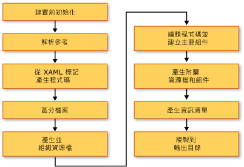

# <a name="building-a-wpf-application-wpf"></a>建置 WPF 應用程式 (WPF)
Windows Presentation Foundation (WPF) 應用程式可以建置為[!INCLUDE[dnprdnshort](../../../../includes/dnprdnshort-md.md)]可執行檔 (.exe)、 程式庫 (.dll) 或這兩種類型的組件的組合。 本主題介紹如何建置 [!INCLUDE[TLA2#tla_wpf](../../../../includes/tla2sharptla-wpf-md.md)] 應用程式，並說明建置流程中的主要步驟。  
  
  
<a name="Building_a_WPF_Application_using_Command_Line"></a>   
## <a name="building-a-wpf-application"></a>建置 WPF 應用程式  
 WPF 應用程式可透過下列方式編譯：  
  
-   命令列。 應用程式只能包含程式碼 (沒有 XAML) 和一個應用程式定義檔。 如需詳細資訊，請參閱[使用 csc.exe 建置命令列](~/docs/csharp/language-reference/compiler-options/command-line-building-with-csc-exe.md)或[從命令列建置 (Visual Basic)](~/docs/visual-basic/reference/command-line-compiler/building-from-the-command-line.md)。  
  
-   Microsoft Build Engine (MSBuild)。 除了程式碼和 XAML 檔案，應用程式還必須包含 MSBuild 專案檔。 如需詳細資訊，請參閱＜MSBuild＞。  
  
-   Visual Studio。 Visual Studio 是整合式開發環境，可使用 MSBuild 編譯 WPF 應用程式，並包含用於建立 UI 的視覺化設計工具。 如需詳細資訊，請參閱 < [Visual Studio 中的應用程式開發](https://msdn.microsoft.com/library/97490c1b-a247-41fb-8f2c-bc4c201eff68)並[在 Visual Studio 中設計 XAML](/visualstudio/designers/designing-xaml-in-visual-studio)。  
  
<a name="The_Windows_Presentation_Foundation_Build_Pipeline"></a>   
## <a name="wpf-build-pipeline"></a>WPF 組建管線  
 建置 [!INCLUDE[TLA2#tla_wpf](../../../../includes/tla2sharptla-wpf-md.md)] 專案時，會叫用特定語言和特定 [!INCLUDE[TLA2#tla_wpf](../../../../includes/tla2sharptla-wpf-md.md)] 之目標的組合。 執行這些目標的程序稱為組建管線，下圖說明主要步驟。  
  
   
  
<a name="Pre_Build_Initializations"></a>   
### <a name="pre-build-initializations"></a>建置前初始化  
 建置之前，[!INCLUDE[TLA2#tla_msbuild](../../../../includes/tla2sharptla-msbuild-md.md)] 會判斷重要工具和程式庫的位置，包括：  
  
-   .NET Framework。  
  
-   [!INCLUDE[TLA2#tla_wcsdk](../../../../includes/tla2sharptla-wcsdk-md.md)] 目錄。  
  
-   [!INCLUDE[TLA2#tla_wpf](../../../../includes/tla2sharptla-wpf-md.md)] 參考組件的位置。  
  
-   組件搜尋路徑的屬性。  
  
 [!INCLUDE[TLA2#tla_msbuild](../../../../includes/tla2sharptla-msbuild-md.md)] 搜尋組件的第一個位置是參考組件目錄 (%ProgramFiles%\Reference Assemblies\Microsoft\Framework\v3.0\\)。 在此步驟期間，建置流程也會初始化各種屬性和項目群組，並執行任何必要的清除工作。  
  
<a name="Resolving_references"></a>   
### <a name="resolving-references"></a>解析參考  
 建置流程會找出並繫結建置應用程式專案所需的組件。 此邏輯包含在 `ResolveAssemblyReference` 工作中。 在專案檔中宣告為 `Reference` 的所有組件會連同有關系統上已安裝組件之搜尋路徑和中繼資料的資訊，一起提供給工作。 此工作會尋找組件，然後使用已安裝組件的中繼資料，篩選出不需要顯示在輸出資訊清單中的核心 [!INCLUDE[TLA2#tla_wpf](../../../../includes/tla2sharptla-wpf-md.md)] 組件。 這樣做是為了避免在 ClickOnce 資訊清單中出現多餘的資訊。 例如，由於 PresentationFramework.dll 可以視為代表建置的應用程式上，也可[!INCLUDE[TLA2#tla_wpf](../../../../includes/tla2sharptla-wpf-md.md)]，而且因為[!INCLUDE[TLA2#tla_wpf](../../../../includes/tla2sharptla-wpf-md.md)]存在於.NET Framework 之每部電腦上的相同位置的組件安裝，則不需要包含資訊清單中的所有.NET Framework 參考組件上的所有資訊。  
  
<a name="Markup_Compilation___Pass_1"></a>   
### <a name="markup-compilationpass-1"></a>標記編譯 - 第一階段  
 在此步驟中，[!INCLUDE[TLA2#tla_xaml](../../../../includes/tla2sharptla-xaml-md.md)] 檔案會經過剖析及編譯，讓執行階段不需要花時間剖析 [!INCLUDE[TLA2#tla_xml](../../../../includes/tla2sharptla-xml-md.md)] 和驗證屬性值。 已編譯的 [!INCLUDE[TLA2#tla_xaml](../../../../includes/tla2sharptla-xaml-md.md)] 檔案會預先語彙基元化，因此在執行階段將它載入時，應該會比載入 [!INCLUDE[TLA2#tla_xaml](../../../../includes/tla2sharptla-xaml-md.md)] 檔案更快。  
  
 在此步驟期間，以 `Page` 組建項目表示的每個 [!INCLUDE[TLA2#tla_xaml](../../../../includes/tla2sharptla-xaml-md.md)] 檔案會發生下列活動：  
  
1.  標記編譯器會剖析 [!INCLUDE[TLA2#tla_xaml](../../../../includes/tla2sharptla-xaml-md.md)] 檔案。  
  
2.  建立該 [!INCLUDE[TLA2#tla_xaml](../../../../includes/tla2sharptla-xaml-md.md)] 的編譯表示，並複製到 obj\Release 資料夾。  
  
3.  建立新部分類別的 CodeDOM 表示，並複製到 obj\Release 資料夾。  
  
 此外，每個 [!INCLUDE[TLA2#tla_xaml](../../../../includes/tla2sharptla-xaml-md.md)] 檔案會產生特定語言的程式碼檔。 例如，在 Visual Basic 專案中的 Page1.xaml 頁面，就會產生 Page1.g.vb;C# 專案中的 Page1.xaml 頁面，就會產生 Page1.g.cs。 檔案名稱中的 ".g" 表示檔案是產生的程式碼，其具有標記檔案最上層項目 (例如 `Page` 或 `Window`) 的部分類別宣告。 類別以宣告`partial`C# 中的修飾詞 (`Extends` Visual Basic 中) 表示類別在其他地方的另一個宣告，通常是在程式碼後置檔案 page1.xaml.cs。  
  
 部分類別擴充從適當的基底類別 (例如<xref:System.Windows.Controls.Page>頁面)，並會實作<xref:System.Windows.Markup.IComponentConnector?displayProperty=nameWithType>介面。 <xref:System.Windows.Markup.IComponentConnector>介面具有方法，以初始化元件，並連線名稱和其內容中的項目上的事件。 因此，產生的程式碼檔具有如下的方法實作：  
  
```csharp  
public void InitializeComponent() {  
    if (_contentLoaded) {  
        return;  
    }  
    _contentLoaded = true;  
    System.Uri resourceLocater =   
        new System.Uri(  
            "window1.xaml",   
            System.UriKind.RelativeOrAbsolute);  
    System.Windows.Application.LoadComponent(this, resourceLocater);  
}  
```  
  
```vb  
Public Sub InitializeComponent() _  
  
    If _contentLoaded Then  
        Return  
    End If  
  
    _contentLoaded = True  
    Dim resourceLocater As System.Uri = _  
        New System.Uri("mainwindow.xaml", System.UriKind.Relative)  
  
    System.Windows.Application.LoadComponent(Me, resourceLocater)  
  
End Sub  
```  
  
 根據預設，標記編譯執行所在的相同<xref:System.AppDomain>做為[!INCLUDE[TLA2#tla_msbuild](../../../../includes/tla2sharptla-msbuild-md.md)]引擎。 這會大幅提升效能。 您可以使用 `AlwaysCompileMarkupFilesInSeparateDomain` 屬性來切換此行為。 這樣做的好處，卸載所有參考組件，藉由卸載個別<xref:System.AppDomain>。  
  
<a name="Pass_2_of_Markup_Compilation"></a>   
### <a name="markup-compilationpass-2"></a>標記編譯 - 第二階段  
 並非所有 [!INCLUDE[TLA2#tla_xaml](../../../../includes/tla2sharptla-xaml-md.md)] 頁面都會在第一階段的標記編譯進行編譯。 已在本機定義類型參考 (相同專案中任何地方之程式碼中所定義的類型參考) 的 [!INCLUDE[TLA2#tla_xaml](../../../../includes/tla2sharptla-xaml-md.md)] 檔案就不是在此時編譯。 這是因為這些本機定義的類型只存在於來源中，而且尚未經過編譯。 為了判斷此情況，剖析器會使用牽涉到在標記檔案中尋找 `x:Name` 等項目的啟發方式。 找到這類執行個體之後，就會將標記檔案的編譯延後到程式碼檔編譯完成，在那之後，第二階段的標記編譯才會處理這些檔案。  
  
<a name="File_Classification"></a>   
### <a name="file-classification"></a>檔案分類  
 建置流程會根據作為目標位置的應用程式組件，將輸出檔案放在不同的資源群組中。 在一般未當地語系化的應用程式中，所有標記為 `Resource` 的資料檔案會放在主組件 (可執行檔或程式庫) 中。 當專案中已設定 `UICulture` 時，所有編譯的 [!INCLUDE[TLA2#tla_xaml](../../../../includes/tla2sharptla-xaml-md.md)] 檔案和特別標記為特定語言的資源會放在附屬資源組件中。 此外，所有非語言相關的資源會放在主組件中。 在建置流程的這個步驟中，會做出判斷。  
  
 專案檔中的 `ApplicationDefinition`、`Page` 和 `Resource` 建置動作可以用 `Localizable` 中繼資料 (可接受的值為 `true` 和 `false`) 增強，該中繼資料會指出檔案為特定語言或非語言相關。  
  
<a name="Core_Compilation"></a>   
### <a name="core-compilation"></a>核心編譯  
 核心編譯步驟牽涉到程式碼檔的編譯。 這是由特定語言之目標檔案 Microsoft.CSharp.targets 和 Microsoft.VisualBasic.targets 的邏輯進行協調。 如果啟發方式判斷標記編譯器的單一階段即已足夠，則會產生主組件。 不過，如果專案中有一或多個 [!INCLUDE[TLA2#tla_xaml](../../../../includes/tla2sharptla-xaml-md.md)] 檔案參考本機定義的類型，則會產生暫存 .dll 檔案，因此最終的應用程式組件可能會在標記編譯的第二階段完成之後建立。  
  
<a name="Manifest_generation"></a>   
### <a name="manifest-generation"></a>資訊清單產生  
 在建置流程結束，而且所有應用程式組件和內容檔案準備就緒之後，就會產生應用程式的 [!INCLUDE[TLA2#tla_clickonce](../../../../includes/tla2sharptla-clickonce-md.md)] 資訊清單。  
  
 部署資訊清單檔會描述部署模型︰目前的版本、更新行為，以及發行者身分識別和數位簽章。 此資訊清單預期是由處理部署的系統管理員所撰寫。 副檔名為 .xbap (若是 [!INCLUDE[TLA#tla_xbap#plural](../../../../includes/tlasharptla-xbapsharpplural-md.md)]) 和 .application (若是已安裝的應用程式)。 前者是由 `HostInBrowser` 專案屬性所指定，因此資訊清單會將應用程式識別為由瀏覽器裝載。  
  
 應用程式資訊清單 (.exe.manifest 檔案) 會描述應用程式組件和相依程式庫，並列出應用程式所需的權限。 此檔案預期是由應用程式開發人員所撰寫。 為了啟動 [!INCLUDE[TLA2#tla_clickonce](../../../../includes/tla2sharptla-clickonce-md.md)] 應用程式，使用者會開啟應用程式的部署資訊清單檔。  
  
 若是 [!INCLUDE[TLA2#tla_xbap#plural](../../../../includes/tla2sharptla-xbapsharpplural-md.md)]，一律會建立這些資訊清單檔。 若是已安裝的應用程式，除非將專案檔中的 `GenerateManifests` 屬性指定為 `true` 值，否則不會建立這些檔案。  
  
 [!INCLUDE[TLA2#tla_xbap#plural](../../../../includes/tla2sharptla-xbapsharpplural-md.md)] 取得兩個額外的權限，比那些指派給一般網際網路區域應用程式的權限：<xref:System.Security.Permissions.WebBrowserPermission>和<xref:System.Security.Permissions.MediaPermission>。 [!INCLUDE[TLA2#tla_wpf](../../../../includes/tla2sharptla-wpf-md.md)] 建置系統會在應用程式資訊清單中宣告這些權限。  
  
<a name="Incremental_Build_Support"></a>   
## <a name="incremental-build-support"></a>累加建置支援  
 [!INCLUDE[TLA2#tla_wpf](../../../../includes/tla2sharptla-wpf-md.md)] 建置系統提供累加建置支援。 該系統對於偵測標記或程式碼中所做的變更相當明確，而且只會編譯受變更影響的成品。 累加建置機制使用下列檔案：  
  
-   $(*組件名稱*)_MarkupCompiler.Cache 檔案，用於維護目前的編譯器狀態。  
  
-   $(*組件名稱*)_MarkupCompiler.lref 檔案，用於快取具有本機定義之類型參考的 [!INCLUDE[TLA2#tla_xaml](../../../../includes/tla2sharptla-xaml-md.md)] 檔案。  
  
 以下是管理累加建置的一組規則：  
  
-   檔案是建置系統偵測變更的最小單位。 因此對於程式碼檔，建置系統無法得知是否變更類型或是否新增程式碼。 同樣的情況也適用於專案檔。  
  
-   累加建置機制必須認定 [!INCLUDE[TLA2#tla_xaml](../../../../includes/tla2sharptla-xaml-md.md)] 頁面有定義類別或使用其他類別。  
  
-   如果 `Reference` 項目變更，則會重新編譯所有頁面。  
  
-   如果程式碼檔變更，則會重新編譯所有具有本機定義之類型參考的頁面。  
  
-   如果 [!INCLUDE[TLA2#tla_xaml](../../../../includes/tla2sharptla-xaml-md.md)] 檔案變更：  
  
    -   如果 [!INCLUDE[TLA2#tla_xaml](../../../../includes/tla2sharptla-xaml-md.md)] 在專案中宣告為 `Page`：如果 [!INCLUDE[TLA2#tla_xaml](../../../../includes/tla2sharptla-xaml-md.md)] 沒有本機定義的類型參考，請重新編譯該 [!INCLUDE[TLA2#tla_xaml](../../../../includes/tla2sharptla-xaml-md.md)]，再加上所有具有本機參考的 [!INCLUDE[TLA2#tla_xaml](../../../../includes/tla2sharptla-xaml-md.md)] 頁面；如果 [!INCLUDE[TLA2#tla_xaml](../../../../includes/tla2sharptla-xaml-md.md)] 有本機參考，請重新編譯所有具有本機參考的 [!INCLUDE[TLA2#tla_xaml](../../../../includes/tla2sharptla-xaml-md.md)] 頁面。  
  
    -   如果[!INCLUDE[TLA2#tla_xaml](../../../../includes/tla2sharptla-xaml-md.md)]宣告為`ApplicationDefinition`專案中： 重新編譯所有[!INCLUDE[TLA2#tla_xaml](../../../../includes/tla2sharptla-xaml-md.md)]頁面 (原因： 每個[!INCLUDE[TLA2#tla_xaml](../../../../includes/tla2sharptla-xaml-md.md)]具有參考<xref:System.Windows.Application>可能已變更的型別)。  
  
-   如果專案檔將程式碼檔宣告為應用程式定義，而不是 [!INCLUDE[TLA2#tla_xaml](../../../../includes/tla2sharptla-xaml-md.md)] 檔案：  
  
    -   檢查專案檔中的 `ApplicationClassName` 值是否已變更 (是否有新的應用程式類型)。 如果是，請重新編譯整個應用程式。  
  
    -   否則，請重新編譯所有具有本機參考的 [!INCLUDE[TLA2#tla_xaml](../../../../includes/tla2sharptla-xaml-md.md)] 頁面。  
  
-   如果專案檔變更︰請套用所有前述規則，並查看哪些項目需要重新編譯。 對下列屬性的變更會觸發完整的重新編譯：`AssemblyName`、`IntermediateOutputPath`、`RootNamespace` 和 `HostInBrowser`。  
  
 以下是可能發生的重新編譯情節：  
  
-   重新編譯整個應用程式。  
  
-   只重新編譯具有本機定義之類型參考的 [!INCLUDE[TLA2#tla_xaml](../../../../includes/tla2sharptla-xaml-md.md)] 檔案。  
  
-   不重新編譯任何項目 (如果專案中沒有任何變更)。  
  
## <a name="see-also"></a>另請參閱  
 [部署 WPF 應用程式](../../../../docs/framework/wpf/app-development/deploying-a-wpf-application-wpf.md)  
 [WPF MSBuild 參考](/visualstudio/msbuild/wpf-msbuild-reference)  
 [WPF 中的 Pack URI](../../../../docs/framework/wpf/app-development/pack-uris-in-wpf.md)  
 [WPF 應用程式資源、內容和資料檔案](../../../../docs/framework/wpf/app-development/wpf-application-resource-content-and-data-files.md)
