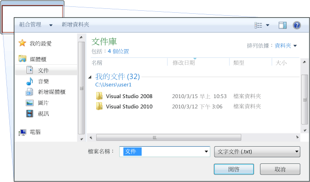
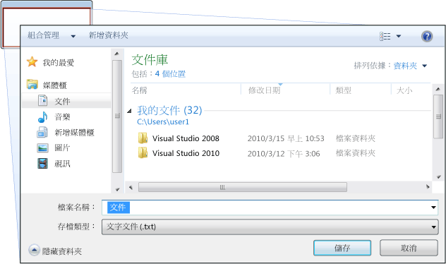
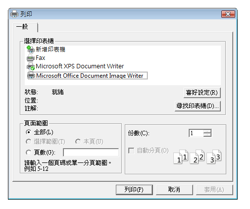
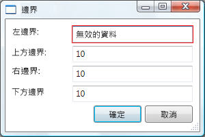
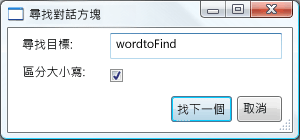

# 對話方塊概觀Dialog Boxes Overview
獨立應用程式通常具有主視窗，同時會顯示主要資料的應用程式運作，並公開的功能來處理該資料透過[!INCLUDE[TLA#tla_ui](../../../../includes/tlasharptla-ui-md.md)]機制類似功能表列、 工具列和狀態列。Standalone applications typically have a main window that both displays the main data over which the application operates and exposes the functionality to process that data through [!INCLUDE[TLA#tla_ui](../../../../includes/tlasharptla-ui-md.md)] mechanisms like menu bars, tool bars, and status bars. 重要的應用程式還可能顯示其他視窗來執行下列動作：A non-trivial application may also display additional windows to do the following:  
  
-   對使用者顯示特定資訊。Display specific information to users.  
  
-   向使用者收集資訊。Gather information from users.  
  
-   顯示並收集資訊。Both display and gather information.  
  
 這些類型的視窗稱為*對話方塊*，而且有兩種類型： 強制回應和非強制回應。These types of windows are known as *dialog boxes*, and there are two types: modal and modeless.  
  
 A*強制回應*函式需要使用者繼續從其他資料時，對話方塊會顯示函式。A *modal* dialog box is displayed by a function when the function needs additional data from a user to continue. 由於該函式需要透過強制回應對話方塊收集資料，因此當強制回應對話方塊保持開啟時，也可以防止使用者在應用程式中啟動其他視窗。Because the function depends on the modal dialog box to gather data, the modal dialog box also prevents a user from activating other windows in the application while it remains open. 在大部分情況下，強制回應對話方塊可讓使用者藉由按下 [已完成的強制回應對話方塊時發出通知**確定**或**取消**] 按鈕。In most cases, a modal dialog box allows a user to signal when they have finished with the modal dialog box by pressing either an **OK** or **Cancel** button. 按下**確定**按鈕表示使用者已輸入的資料，而且想要繼續處理該資料的函式。Pressing the **OK** button indicates that a user has entered data and wants the function to continue processing with that data. 按下**取消**按鈕表示使用者想要停止執行的函式。Pressing the **Cancel** button indicates that a user wants to stop the function from executing altogether. 強制回應對話方塊的最常見範例為開啟、儲存及列印資料。The most common examples of modal dialog boxes are shown to open, save, and print data.  
  
 A*非強制回應*對話方塊中，相反地，不會防止使用者啟動其他視窗開啟時。A *modeless* dialog box, on the other hand, does not prevent a user from activating other windows while it is open. 例如，如果使用者想要尋找出現在文件中的特定字組，主視窗通常會開啟對話方塊，詢問使用者要尋找哪個字組。For example, if a user wants to find occurrences of a particular word in a document, a main window will often open a dialog box to ask a user what word they are looking for. 不過，由於尋找字組並不會防止使用者編輯文件，因此對話方塊不需要是強制回應。Since finding a word doesn't prevent a user from editing the document, however, the dialog box doesn't need to be modal. 非強制回應對話方塊至少提供**關閉**按鈕來關閉對話方塊，並可能會提供其他按鈕來執行特定的功能，例如**找下一個**按鈕來尋找下一個的比對文字搜尋的尋找的準則。A modeless dialog box at least provides a **Close** button to close the dialog box, and may provide additional buttons to execute specific functions, such as a **Find Next** button to find the next word that matches the find criteria of a word search.  
  
 Windows Presentation Foundation (WPF) 可讓您建立數種類型的對話方塊中，包括訊息方塊中，通用對話方塊和自訂對話方塊。Windows Presentation Foundation (WPF) allows you to create several types of dialog boxes, including message boxes, common dialog boxes, and custom dialog boxes. 本主題將討論每個，而[對話方塊範例](http://go.microsoft.com/fwlink/?LinkID=159984)提供相符的範例。This topic discusses each, and the [Dialog Box Sample](http://go.microsoft.com/fwlink/?LinkID=159984) provides matching examples.  
  
 
  
   
## 訊息方塊Message Boxes  
 A*訊息方塊*是可用來顯示文字資訊，並允許使用者使用按鈕進行決策的對話方塊。A *message box* is a dialog box that can be used to display textual information and to allow users to make decisions with buttons. 下圖所示的訊息方塊顯示文字資訊、提出問題，並提供使用者三個按鈕來回答問題。The following figure shows a message box that displays textual information, asks a question, and provides the user with three buttons to answer the question.  
  
   
  
 若要建立訊息方塊，您使用<xref:System.Windows.MessageBox>類別。To create a message box, you use the <xref:System.Windows.MessageBox> class. <xref:System.Windows.MessageBox> 可讓您設定訊息方塊文字、 標題、 圖示和按鈕，使用下列程式碼。<xref:System.Windows.MessageBox> lets you configure the message box text, title, icon, and buttons, using code like the following.  
  
 [!code-csharp[DialogBoxesOverviewSnippets#MsgBoxConfigureCODEBEHIND](../../../../samples/snippets/csharp/VS_Snippets_Wpf/DialogBoxesOverviewSnippets/CSharp/Window1.xaml.cs#msgboxconfigurecodebehind)]
 [!code-vb[DialogBoxesOverviewSnippets#MsgBoxConfigureCODEBEHIND](../../../../samples/snippets/visualbasic/VS_Snippets_Wpf/DialogBoxesOverviewSnippets/VisualBasic/window1.xaml.vb#msgboxconfigurecodebehind)]  
  
 若要顯示的訊息方塊，請呼叫`static`<xref:System.Windows.MessageBox.Show%2A>方法，如下列程式碼所示。To show a message box, you call the `static`<xref:System.Windows.MessageBox.Show%2A> method, as demonstrated in the following code.  
  
 [!code-csharp[DialogBoxesOverviewSnippets#MsgBoxShowCODEBEHIND](../../../../samples/snippets/csharp/VS_Snippets_Wpf/DialogBoxesOverviewSnippets/CSharp/Window1.xaml.cs#msgboxshowcodebehind)]
 [!code-vb[DialogBoxesOverviewSnippets#MsgBoxShowCODEBEHIND](../../../../samples/snippets/visualbasic/VS_Snippets_Wpf/DialogBoxesOverviewSnippets/VisualBasic/window1.xaml.vb#msgboxshowcodebehind)]  
  
 當顯示訊息方塊的程式碼必須偵測及處理使用者的決定時 (按下哪個按鈕)，程式碼可以查看訊息方塊結果，如下列程式碼所示。When code that shows a message box needs to detect and process the user's decision (which button was pressed), the code can inspect the message box result, as shown in the following code.  
  
 [!code-csharp[DialogBoxesOverviewSnippets#MsgBoxShowAndResultCODEBEHIND1](../../../../samples/snippets/csharp/VS_Snippets_Wpf/DialogBoxesOverviewSnippets/CSharp/Window1.xaml.cs#msgboxshowandresultcodebehind1)]
 [!code-vb[DialogBoxesOverviewSnippets#MsgBoxShowAndResultCODEBEHIND1](../../../../samples/snippets/visualbasic/VS_Snippets_Wpf/DialogBoxesOverviewSnippets/VisualBasic/window1.xaml.vb#msgboxshowandresultcodebehind1)]  
  
 如需有關如何使用訊息方塊的詳細資訊，請參閱<xref:System.Windows.MessageBox>， [MessageBox 範例](http://go.microsoft.com/fwlink/?LinkID=160023)，和[對話方塊範例](http://go.microsoft.com/fwlink/?LinkID=159984)。For more information on using message boxes, see <xref:System.Windows.MessageBox>, [MessageBox Sample](http://go.microsoft.com/fwlink/?LinkID=160023), and [Dialog Box Sample](http://go.microsoft.com/fwlink/?LinkID=159984).  
  
 雖然<xref:System.Windows.MessageBox>可能提供較簡單的對話方塊方塊使用者體驗，使用的優點<xref:System.Windows.MessageBox>是，視窗會顯示由部分信任安全性沙箱中執行的應用程式的唯一類型 (請參閱[安全性](../../../../docs/framework/wpf/security-wpf.md))，例如[!INCLUDE[TLA#tla_xbap#plural](../../../../includes/tlasharptla-xbapsharpplural-md.md)]。Although <xref:System.Windows.MessageBox> may offer a simple dialog box user experience, the advantage of using <xref:System.Windows.MessageBox> is that is the only type of window that can be shown by applications that run within a partial trust security sandbox (see [Security](../../../../docs/framework/wpf/security-wpf.md)), such as [!INCLUDE[TLA#tla_xbap#plural](../../../../includes/tlasharptla-xbapsharpplural-md.md)].  
  
 大多數對話方塊所顯示及收集的資料會比訊息方塊的結果更複雜，包括文字、選取範圍 (核取方塊)、互斥選取範圍 (選項按鈕)，以及清單選取範圍 (清單方塊、下拉式方塊、下拉式清單方塊)。Most dialog boxes display and gather more complex data than the result of a message box, including text, selection (check boxes), mutually exclusive selection (radio buttons), and list selection (list boxes, combo boxes, drop-down list boxes). 對於這些 Windows Presentation Foundation (WPF) 提供數個通用對話方塊，並可讓您建立您自己的對話方塊中，雖然任一個的使用受到以完全信任執行的應用程式。For these, Windows Presentation Foundation (WPF) provides several common dialog boxes and allows you to create your own dialog boxes, although the use of either is limited to applications running with full trust.  
  
   
## 通用對話方塊Common Dialog Boxes  
 [!INCLUDE[TLA#tla_mswin](../../../../includes/tlasharptla-mswin-md.md)] 實作所有應用程式通用之各種可重複使用的對話方塊，包括用於開啟檔案、儲存檔案和列印的對話方塊。 implements a variety of reusable dialog boxes that are common to all applications, including dialog boxes for opening files, saving files, and printing. 由於這些對話方塊是由作業系統實作，因此可在作業系統上執行的所有應用程式之間共用，以協助確保使用者體驗的一致性；當使用者在一個應用程式中熟悉如何使用某個作業系統提供的對話方塊時，就不需要了解如何在其他應用程式中使用該對話方塊。Since these dialog boxes are implemented by the operating system, they can be shared among all the applications that run on the operating system, which helps user experience consistency; when users are familiar with the use of an operating system-provided dialog box in one application, they don't need to learn how to use that dialog box in other applications. 因為這些對話方塊的所有應用程式可以使用，因為它們可以協助提供一致的使用者體驗，其稱為*通用對話方塊*。Because these dialog boxes are available to all applications and because they help provide a consistent user experience, they are known as *common dialog boxes*.  
  
 Windows Presentation Foundation (WPF) 封裝開啟檔案、 儲存檔案，並列印通用對話方塊和其公開為 managed 的類別，供您使用獨立應用程式中。Windows Presentation Foundation (WPF) encapsulates the open file, save file, and print common dialog boxes and exposes them as managed classes for you to use in standalone applications. 本主題提供每個對話方塊的簡短概觀。This topic provides a brief overview of each.  
  
   
### 開啟檔案對話方塊Open File Dialog  
 如下圖所示，檔案開啟功能使用 [開啟檔案] 對話方塊，來擷取要開啟之檔案的名稱。The open file dialog box, shown in the following figure, is used by file opening functionality to retrieve the name of a file to open.  
  
   
  
 常見的開啟檔案對話方塊會實作為<xref:Microsoft.Win32.OpenFileDialog>類別，且其位於<xref:Microsoft.Win32>命名空間。The common open file dialog box is implemented as the <xref:Microsoft.Win32.OpenFileDialog> class and is located in the <xref:Microsoft.Win32> namespace. 下列程式碼示範如何建立、設定及顯示一個對話方塊，以及如何處理結果。The following code shows how to create, configure, and show one, and how to process the result.  
  
 [!code-csharp[DialogBoxesOverviewSnippets#OpenFileDialogBoxCODEBEHIND](../../../../samples/snippets/csharp/VS_Snippets_Wpf/DialogBoxesOverviewSnippets/CSharp/Window1.xaml.cs#openfiledialogboxcodebehind)]
 [!code-vb[DialogBoxesOverviewSnippets#OpenFileDialogBoxCODEBEHIND](../../../../samples/snippets/visualbasic/VS_Snippets_Wpf/DialogBoxesOverviewSnippets/VisualBasic/window1.xaml.vb#openfiledialogboxcodebehind)]  
  
 如需 [開啟檔案] 對話方塊的詳細資訊，請參閱<xref:Microsoft.Win32.OpenFileDialog?displayProperty=nameWithType>。For more information on the open file dialog box, see <xref:Microsoft.Win32.OpenFileDialog?displayProperty=nameWithType>.  
  
> [!NOTE]
>  <xref:Microsoft.Win32.OpenFileDialog> 可以用來安全地擷取檔案名稱，以部分信任執行的應用程式 (請參閱[安全性](../../../../docs/framework/wpf/security-wpf.md))。<xref:Microsoft.Win32.OpenFileDialog> can be used to safely retrieve file names by applications running with partial trust (see [Security](../../../../docs/framework/wpf/security-wpf.md)).  
  
   
### 儲存檔案對話方塊Save File Dialog Box  
 如下圖所示，檔案儲存功能使用 [儲存檔案] 對話方塊，來擷取要儲存之檔案的名稱。The save file dialog box, shown in the following figure, is used by file saving functionality to retrieve the name of a file to save.  
  
   
  
 儲存檔案 對話方塊的一般會實作為<xref:Microsoft.Win32.SaveFileDialog>類別，且其位於<xref:Microsoft.Win32>命名空間。The common save file dialog box is implemented as the <xref:Microsoft.Win32.SaveFileDialog> class, and is located in the <xref:Microsoft.Win32> namespace. 下列程式碼示範如何建立、設定及顯示一個對話方塊，以及如何處理結果。The following code shows how to create, configure, and show one, and how to process the result.  
  
 [!code-csharp[DialogBoxesOverviewSnippets#SaveFileDialogBoxCODEBEHIND](../../../../samples/snippets/csharp/VS_Snippets_Wpf/DialogBoxesOverviewSnippets/CSharp/Window1.xaml.cs#savefiledialogboxcodebehind)]
 [!code-vb[DialogBoxesOverviewSnippets#SaveFileDialogBoxCODEBEHIND](../../../../samples/snippets/visualbasic/VS_Snippets_Wpf/DialogBoxesOverviewSnippets/VisualBasic/window1.xaml.vb#savefiledialogboxcodebehind)]  
  
 如需詳細資訊，在儲存檔案 對話方塊，請參閱<xref:Microsoft.Win32.SaveFileDialog?displayProperty=nameWithType>。For more information on the save file dialog box, see <xref:Microsoft.Win32.SaveFileDialog?displayProperty=nameWithType>.  
  
   
### 列印對話方塊Print Dialog Box  
 如下圖所示，列印功能使用 [列印] 對話方塊，來選擇及設定使用者想要列印資料的目標印表機。The print dialog box, shown in the following figure, is used by printing functionality to choose and configure the printer that a user would like to print data to.  
  
   
  
 通用列印對話方塊會實作為<xref:System.Windows.Controls.PrintDialog>類別，且其位於<xref:System.Windows.Controls>命名空間。The common print dialog box is implemented as the <xref:System.Windows.Controls.PrintDialog> class, and is located in the <xref:System.Windows.Controls> namespace. 下列程式碼示範如何建立、設定及顯示一個對話方塊。The following code shows how to create, configure, and show one.  
  
 [!code-csharp[DialogBoxesOverviewSnippets#PrintDialogBoxCODEBEHIND](../../../../samples/snippets/csharp/VS_Snippets_Wpf/DialogBoxesOverviewSnippets/CSharp/Window1.xaml.cs#printdialogboxcodebehind)]
 [!code-vb[DialogBoxesOverviewSnippets#PrintDialogBoxCODEBEHIND](../../../../samples/snippets/visualbasic/VS_Snippets_Wpf/DialogBoxesOverviewSnippets/VisualBasic/window1.xaml.vb#printdialogboxcodebehind)]  
  
 如需有關 [列印] 對話方塊的詳細資訊，請參閱<xref:System.Windows.Controls.PrintDialog?displayProperty=nameWithType>。For more information on the print dialog box, see <xref:System.Windows.Controls.PrintDialog?displayProperty=nameWithType>. 如列印中詳細討論[!INCLUDE[TLA2#tla_wpf](../../../../includes/tla2sharptla-wpf-md.md)]，請參閱[列印概觀](../../../../docs/framework/wpf/advanced/printing-overview.md)。For detailed discussion of printing in [!INCLUDE[TLA2#tla_wpf](../../../../includes/tla2sharptla-wpf-md.md)], see [Printing Overview](../../../../docs/framework/wpf/advanced/printing-overview.md).  
  
   
## 自訂對話方塊Custom Dialog Boxes  
 雖然通用對話方塊很有用，而且應該盡可能使用，但這類對話方塊並不支援定義域專屬對話方塊的需求。While common dialog boxes are useful, and should be used when possible, they do not support the requirements of domain-specific dialog boxes. 在此情況下，您必須建立自己的對話方塊。In these cases, you need to create your own dialog boxes. 如稍後所示，對話方塊是具有特殊行為的視窗。As we'll see, a dialog box is a window with special behaviors. <xref:System.Windows.Window> 實作這些行為，因此，您使用<xref:System.Windows.Window>建立自訂強制回應和非強制回應對話方塊。<xref:System.Windows.Window> implements those behaviors and, consequently, you use <xref:System.Windows.Window> to create custom modal and modeless dialog boxes.  
  
   
### 建立自訂強制回應對話方塊Creating a Modal Custom Dialog Box  
 本主題示範如何使用<xref:System.Windows.Window>建立一般的強制回應對話方塊方塊實作中，使用`Margins`對話方塊中，做為範例 (請參閱[對話方塊範例](http://go.microsoft.com/fwlink/?LinkID=159984))。This topic shows how to use <xref:System.Windows.Window> to create a typical modal dialog box implementation, using the `Margins` dialog box as an example (see [Dialog Box Sample](http://go.microsoft.com/fwlink/?LinkID=159984)). `Margins`對話方塊會顯示在下圖中。The `Margins` dialog box is shown in the following figure.  
  
   
  
#### 設定強制回應對話方塊Configuring a Modal Dialog Box  
 一般對話方塊的使用者介面包括：The user interface for a typical dialog box includes the following:  
  
-   收集想要的資料所需的各種控制項。The various controls that are required to gather the desired data.  
  
-   顯示**確定**按鈕，使用者按一下以關閉對話方塊，返回函式，並繼續處理。Showing an **OK** button that users click to close the dialog box, return to the function, and continue processing.  
  
-   顯示**取消**按鈕讓使用者按一下以關閉對話方塊，並停止進一步處理的函式。Showing a **Cancel** button that users click to close the dialog box and stop the function from further processing.  
  
-   顯示**關閉**標題列中的按鈕。Showing a **Close** button in the title bar.  
  
-   顯示圖示。Showing an icon.  
  
-   顯示**最小化**，**最大化**，和**還原**按鈕。Showing **Minimize**, **Maximize**, and **Restore** buttons.  
  
-   顯示**系統**功能表來最小化、 最大化、 還原及關閉對話方塊。Showing a **System** menu to minimize, maximize, restore, and close the dialog box.  
  
-   在開啟對話方塊的視窗上方和中央開啟。Opening above and in the center of the window that opened the dialog box.  
  
-   對話方塊的大小應該盡可能可供調整，以防止對話方塊過小，並提供使用者實用的預設大小，您必須分別設定預設大小和大小下限。Dialog boxes should be resizable where possible so, to prevent the dialog box from being too small, and to provide the user with a useful default size, you need to set both default and a minimum dimensions respectively.  
  
-   按 ESC 鍵應該設定為鍵盤快速鍵，讓**取消**按的按鈕。Pressing the ESC key should be configured as a keyboard shortcut that causes the **Cancel** button to be pressed. 這藉由設定<xref:System.Windows.Controls.Button.IsCancel%2A>屬性**取消**按鈕`true`。This is achieved by setting the <xref:System.Windows.Controls.Button.IsCancel%2A> property of the **Cancel** button to `true`.  
  
-   按下 ENTER （或傳回） 的索引鍵應設定為鍵盤快速鍵，讓**確定**按的按鈕。Pressing the ENTER (or RETURN) key should be configured as a keyboard shortcut that causes the **OK** button to be pressed. 這藉由設定<xref:System.Windows.Controls.Button.IsDefault%2A>屬性**確定**按鈕`true`。This is achieved by setting the <xref:System.Windows.Controls.Button.IsDefault%2A> property of the **OK** button `true`.  
  
 下列程式碼示範這項設定。The following code demonstrates this configuration.  
  
 [!code-xaml[DialogBoxSample#MarginsDialogBoxMainBitsMARKUP1](../../../../samples/snippets/csharp/VS_Snippets_Wpf/DialogBoxSample/CSharp/MarginsDialogBox.xaml#marginsdialogboxmainbitsmarkup1)]  
[!code-xaml[DialogBoxSample#MarginsDialogBoxMainBitsMARKUP2](../../../../samples/snippets/csharp/VS_Snippets_Wpf/DialogBoxSample/CSharp/MarginsDialogBox.xaml#marginsdialogboxmainbitsmarkup2)]  
  
 [!code-csharp[DialogBoxSample#MarginsDialogBoxMainBitsCODEBEHIND1](../../../../samples/snippets/csharp/VS_Snippets_Wpf/DialogBoxSample/CSharp/MarginsDialogBox.xaml.cs#marginsdialogboxmainbitscodebehind1)]
 [!code-vb[DialogBoxSample#MarginsDialogBoxMainBitsCODEBEHIND1](../../../../samples/snippets/visualbasic/VS_Snippets_Wpf/DialogBoxSample/VisualBasic/MarginsDialogBox.xaml.vb#marginsdialogboxmainbitscodebehind1)]  
[!code-csharp[DialogBoxSample#MarginsDialogBoxMainBitsCODEBEHIND2](../../../../samples/snippets/csharp/VS_Snippets_Wpf/DialogBoxSample/CSharp/MarginsDialogBox.xaml.cs#marginsdialogboxmainbitscodebehind2)]
[!code-vb[DialogBoxSample#MarginsDialogBoxMainBitsCODEBEHIND2](../../../../samples/snippets/visualbasic/VS_Snippets_Wpf/DialogBoxSample/VisualBasic/MarginsDialogBox.xaml.vb#marginsdialogboxmainbitscodebehind2)]  
  
 對話方塊的使用者體驗也會延伸至開啟對話方塊之視窗的功能表列。The user experience for a dialog box also extends into the menu bar of the window that opens the dialog box. 當功能表項目所執行的函式需要透過對話方塊進行使用者互動才能繼續時，該函式的功能表項目會在其標頭中顯示省略符號，如下所示。When a menu item runs a function that requires user interaction through a dialog box before the function can continue, the menu item for the function will have an ellipsis in its header, as shown here.  
  
 [!code-xaml[DialogBoxSample#MainWindowMarginsDialogBoxMenuItemMARKUP1](../../../../samples/snippets/csharp/VS_Snippets_Wpf/DialogBoxSample/CSharp/MainWindow.xaml#mainwindowmarginsdialogboxmenuitemmarkup1)]  
[!code-xaml[DialogBoxSample#MainWindowMarginsDialogBoxMenuItemMARKUP2](../../../../samples/snippets/csharp/VS_Snippets_Wpf/DialogBoxSample/CSharp/MainWindow.xaml#mainwindowmarginsdialogboxmenuitemmarkup2)]  
  
 當功能表項目所執行的函式顯示不需要使用者互動的對話方塊時 (例如 [關於] 對話方塊)，則不需要省略符號。When a menu item runs a function that displays a dialog box which does not require user interaction, such as an About dialog box, an ellipsis is not required.  
  
#### 開啟強制回應對話方塊Opening a Modal Dialog Box  
 對話方塊通常是使用者選取功能表項目以執行定義域專屬函式所顯示的結果，例如在文書處理器中設定文件的邊界。A dialog box is typically shown as a result of a user selecting a menu item to perform a domain-specific function, such as setting the margins of a document in a word processor. 將視窗顯示為對話方塊類似於顯示標準視窗，不過需要進行額外的對話方塊專屬設定。Showing a window as a dialog box is similar to showing a normal window, although it requires additional dialog box-specific configuration. 具現化、設定及開啟對話方塊的整個過程如下列程式碼所示。The entire process of instantiating, configuring, and opening a dialog box is shown in the following code.  
  
 [!code-csharp[DialogBoxSample#OpenMarginsDialogCODEBEHIND1](../../../../samples/snippets/csharp/VS_Snippets_Wpf/DialogBoxSample/CSharp/MainWindow.xaml.cs#openmarginsdialogcodebehind1)]
 [!code-vb[DialogBoxSample#OpenMarginsDialogCODEBEHIND1](../../../../samples/snippets/visualbasic/VS_Snippets_Wpf/DialogBoxSample/VisualBasic/MainWindow.xaml.vb#openmarginsdialogcodebehind1)]  
[!code-csharp[DialogBoxSample#OpenMarginsDialogCODEBEHIND2](../../../../samples/snippets/csharp/VS_Snippets_Wpf/DialogBoxSample/CSharp/MainWindow.xaml.cs#openmarginsdialogcodebehind2)]
[!code-vb[DialogBoxSample#OpenMarginsDialogCODEBEHIND2](../../../../samples/snippets/visualbasic/VS_Snippets_Wpf/DialogBoxSample/VisualBasic/MainWindow.xaml.vb#openmarginsdialogcodebehind2)]  
[!code-csharp[DialogBoxSample#OpenMarginsDialogCODEBEHIND3](../../../../samples/snippets/csharp/VS_Snippets_Wpf/DialogBoxSample/CSharp/MainWindow.xaml.cs#openmarginsdialogcodebehind3)]
[!code-vb[DialogBoxSample#OpenMarginsDialogCODEBEHIND3](../../../../samples/snippets/visualbasic/VS_Snippets_Wpf/DialogBoxSample/VisualBasic/MainWindow.xaml.vb#openmarginsdialogcodebehind3)]  
[!code-csharp[DialogBoxSample#OpenMarginsDialogCODEBEHIND4](../../../../samples/snippets/csharp/VS_Snippets_Wpf/DialogBoxSample/CSharp/MainWindow.xaml.cs#openmarginsdialogcodebehind4)]
[!code-vb[DialogBoxSample#OpenMarginsDialogCODEBEHIND4](../../../../samples/snippets/visualbasic/VS_Snippets_Wpf/DialogBoxSample/VisualBasic/MainWindow.xaml.vb#openmarginsdialogcodebehind4)]  
  
 這裡的程式碼會將預設資訊 (目前邊界) 傳遞給對話方塊。Here, the code is passing default information (the current margins) to the dialog box. 它也會設定<xref:System.Windows.Window.Owner%2A?displayProperty=nameWithType>屬性會顯示對話方塊視窗的參考。It is also setting the <xref:System.Windows.Window.Owner%2A?displayProperty=nameWithType> property with a reference to the window that is showing the dialog box. 一般情況下，您應該一律設定對話方塊的擁有者，以提供視窗與狀態相關行為通用於所有對話方塊 (請參閱[WPF Windows 概觀](../../../../docs/framework/wpf/app-development/wpf-windows-overview.md)如需詳細資訊)。In general, you should always set the owner for a dialog box to provide window state-related behaviors that are common to all dialog boxes (see [WPF Windows Overview](../../../../docs/framework/wpf/app-development/wpf-windows-overview.md) for more information).  
  
> [!NOTE]
>  您必須提供擁有者，以支援[!INCLUDE[TLA#tla_ui](../../../../includes/tlasharptla-ui-md.md)]自動化對話方塊 (請參閱[UI 自動化概觀](../../../../docs/framework/ui-automation/ui-automation-overview.md))。You must provide an owner to support [!INCLUDE[TLA#tla_ui](../../../../includes/tlasharptla-ui-md.md)] automation for dialog boxes (see [UI Automation Overview](../../../../docs/framework/ui-automation/ui-automation-overview.md)).  
  
 對話方塊中設定之後，它會顯示為強制回應藉由呼叫<xref:System.Windows.Window.ShowDialog%2A>方法。After the dialog box is configured, it is shown modally by calling the <xref:System.Windows.Window.ShowDialog%2A> method.  
  
#### 驗證使用者提供的資料Validating User-Provided Data  
 在開啟對話方塊且使用者提供所需資料之後，對話方塊會基於下列原因負責確保提供的資料有效：When a dialog box is opened and the user provides the required data, a dialog box is responsible for ensuring that the provided data is valid for the following reasons:  
  
-   從安全性的觀點來看，應該驗證所有輸入。From a security perspective, all input should be validated.  
  
-   從定義域專屬的觀點來看，資料驗證可以防止程式碼處理錯誤的資料，這可能會擲回例外狀況。From a domain-specific perspective, data validation prevents erroneous data from being processed by the code, which could potentially throw exceptions.  
  
-   從使用者體驗的觀點來看，對話方塊可藉由對使用者顯示哪些輸入的資料無效來協助使用者。From a user-experience perspective, a dialog box can help users by showing them which data they have entered is invalid.  
  
-   從效能的觀點來看，多層式應用程式中的資料驗證可以減少用戶層與應用程式層之間的來回行程次數，特別是當應用程式是由 Web 服務或伺服器架構資料庫組成時。From a performance perspective, data validation in a multi-tier application can reduce the number of round trips between the client and the application tiers, particularly when the application is composed of Web services or server-based databases.  
  
 若要驗證繫結的控制項中[!INCLUDE[TLA2#tla_wpf](../../../../includes/tla2sharptla-wpf-md.md)]，您需要定義驗證規則並將它與繫結產生關聯。To validate a bound control in [!INCLUDE[TLA2#tla_wpf](../../../../includes/tla2sharptla-wpf-md.md)], you need to define a validation rule and associate it with the binding. 驗證規則是自訂的類別衍生自<xref:System.Windows.Controls.ValidationRule>。A validation rule is a custom class that derives from <xref:System.Windows.Controls.ValidationRule>. 下列範例示範驗證規則， `MarginValidationRule`，繫結的值是用來檢查<xref:System.Double>，並且在指定範圍內。The following example shows a validation rule, `MarginValidationRule`, which checks that a bound value is a <xref:System.Double> and is within a specified range.  
  
 [!code-csharp[DialogBoxSample#MarginValidationRuleCODE](../../../../samples/snippets/csharp/VS_Snippets_Wpf/DialogBoxSample/CSharp/MarginValidationRule.cs#marginvalidationrulecode)]
 [!code-vb[DialogBoxSample#MarginValidationRuleCODE](../../../../samples/snippets/visualbasic/VS_Snippets_Wpf/DialogBoxSample/VisualBasic/MarginValidationRule.vb#marginvalidationrulecode)]  
  
 在這段程式碼，驗證規則的驗證邏輯會實作覆寫<xref:System.Windows.Controls.ValidationRule.Validate%2A>方法，它會驗證資料，並傳回適當<xref:System.Windows.Controls.ValidationResult>。In this code, the validation logic of a validation rule is implemented by overriding the <xref:System.Windows.Controls.ValidationRule.Validate%2A> method, which validates the data and returns an appropriate <xref:System.Windows.Controls.ValidationResult>.  
  
 若要建立驗證規則與繫結控制項的關聯，您可以使用下列標記。To associate the validation rule with the bound control, you use the following markup.  
  
 [!code-xaml[DialogBoxSample#MarginsValidationMARKUP1](../../../../samples/snippets/csharp/VS_Snippets_Wpf/DialogBoxSample/CSharp/MarginsDialogBox.xaml#marginsvalidationmarkup1)]  
[!code-xaml[DialogBoxSample#MarginsValidationMARKUP2](../../../../samples/snippets/csharp/VS_Snippets_Wpf/DialogBoxSample/CSharp/MarginsDialogBox.xaml#marginsvalidationmarkup2)]  
[!code-xaml[DialogBoxSample#MarginsValidationMARKUP3](../../../../samples/snippets/csharp/VS_Snippets_Wpf/DialogBoxSample/CSharp/MarginsDialogBox.xaml#marginsvalidationmarkup3)]  
  
 一旦驗證規則產生關聯之後,[!INCLUDE[TLA2#tla_wpf](../../../../includes/tla2sharptla-wpf-md.md)]將時會自動套用其繫結控制項中輸入的資料。Once the validation rule is associated, [!INCLUDE[TLA2#tla_wpf](../../../../includes/tla2sharptla-wpf-md.md)] will automatically apply it when data is entered into the bound control. 當控制項包含無效的資料，[!INCLUDE[TLA2#tla_wpf](../../../../includes/tla2sharptla-wpf-md.md)]如下圖所示，將會顯示無效的控制，紅色框線。When a control contains invalid data, [!INCLUDE[TLA2#tla_wpf](../../../../includes/tla2sharptla-wpf-md.md)] will display a red border around the invalid control, as shown in the following figure.  
  
   
  
 在使用者輸入有效的資料之前，[!INCLUDE[TLA2#tla_wpf](../../../../includes/tla2sharptla-wpf-md.md)] 不會將使用者侷限在無效的控制項。[!INCLUDE[TLA2#tla_wpf](../../../../includes/tla2sharptla-wpf-md.md)] does not restrict a user to the invalid control until they have entered valid data. 這是很好的對話方塊行為；使用者應該能夠自由地巡覽對話方塊中的控制項，而不論資料是否有效。This is good behavior for a dialog box; a user should be able to freely navigate the controls in a dialog box whether or not data is valid. 不過，這表示使用者可以輸入無效的資料，然後按**確定** 按鈕。However, this means a user can enter invalid data and press the **OK** button. 基於這個理由，您的程式碼也需要驗證 對話方塊中的所有控制項方塊時**確定**處理按下按鍵時<xref:System.Windows.Controls.Primitives.ButtonBase.Click>事件。For this reason, your code also needs to validate all controls in a dialog box when the **OK** button is pressed by handling the <xref:System.Windows.Controls.Primitives.ButtonBase.Click> event.  
  
 [!code-csharp[DialogBoxSample#MarginsDialogBoxValidationCODEBEHIND1](../../../../samples/snippets/csharp/VS_Snippets_Wpf/DialogBoxSample/CSharp/MarginsDialogBox.xaml.cs#marginsdialogboxvalidationcodebehind1)]
 [!code-vb[DialogBoxSample#MarginsDialogBoxValidationCODEBEHIND1](../../../../samples/snippets/visualbasic/VS_Snippets_Wpf/DialogBoxSample/VisualBasic/MarginsDialogBox.xaml.vb#marginsdialogboxvalidationcodebehind1)]  
[!code-csharp[DialogBoxSample#MarginsDialogBoxValidationCODEBEHIND2](../../../../samples/snippets/csharp/VS_Snippets_Wpf/DialogBoxSample/CSharp/MarginsDialogBox.xaml.cs#marginsdialogboxvalidationcodebehind2)]
[!code-vb[DialogBoxSample#MarginsDialogBoxValidationCODEBEHIND2](../../../../samples/snippets/visualbasic/VS_Snippets_Wpf/DialogBoxSample/VisualBasic/MarginsDialogBox.xaml.vb#marginsdialogboxvalidationcodebehind2)]  
[!code-csharp[DialogBoxSample#MarginsDialogBoxValidationCODEBEHIND3](../../../../samples/snippets/csharp/VS_Snippets_Wpf/DialogBoxSample/CSharp/MarginsDialogBox.xaml.cs#marginsdialogboxvalidationcodebehind3)]
[!code-vb[DialogBoxSample#MarginsDialogBoxValidationCODEBEHIND3](../../../../samples/snippets/visualbasic/VS_Snippets_Wpf/DialogBoxSample/VisualBasic/MarginsDialogBox.xaml.vb#marginsdialogboxvalidationcodebehind3)]  
  
 這段程式碼會列舉在視窗上的所有相依性物件和任何無效時 (傳回<xref:System.Windows.Controls.Validation.GetHasError%2A>，無效的控制項取得焦點，`IsValid`方法會傳回`false`，和視窗會被視為無效。This code enumerates all dependency objects on a window and, if any are invalid (as returned by <xref:System.Windows.Controls.Validation.GetHasError%2A>, the invalid control gets the focus, the `IsValid` method returns `false`, and the window is considered invalid.  
  
 一旦對話方塊有效，就可以安全地將它關閉並傳回。Once a dialog box is valid, it can safely close and return. 在傳回過程中，必須將結果傳回呼叫函式。As part of the return process, it needs to return a result to the calling function.  
  
#### 設定強制回應對話方塊結果Setting the Modal Dialog Result  
 開啟對話方塊方塊中，使用<xref:System.Windows.Window.ShowDialog%2A>基本上就像是呼叫的方法： 對話方塊方塊使用開啟的程式碼<xref:System.Windows.Window.ShowDialog%2A>等待，直到<xref:System.Windows.Window.ShowDialog%2A>傳回。Opening a dialog box using <xref:System.Windows.Window.ShowDialog%2A> is fundamentally like calling a method: the code that opened the dialog box using <xref:System.Windows.Window.ShowDialog%2A> waits until <xref:System.Windows.Window.ShowDialog%2A> returns. 當<xref:System.Windows.Window.ShowDialog%2A>傳回、 程式碼需要呼叫它來決定是否要繼續處理還是停止處理，根據使用者按下**確定**按鈕或**取消** 按鈕。When <xref:System.Windows.Window.ShowDialog%2A> returns, the code that called it needs to decide whether to continue processing or stop processing, based on whether the user pressed the **OK** button or the **Cancel** button. 若要簡化這項決策，對話方塊需要傳回使用者的選擇為<xref:System.Boolean>從傳回的值<xref:System.Windows.Window.ShowDialog%2A>方法。To facilitate this decision, the dialog box needs to return the user's choice as a <xref:System.Boolean> value that is returned from the <xref:System.Windows.Window.ShowDialog%2A> method.  
  
 當**確定**按一下按鈕時，<xref:System.Windows.Window.ShowDialog%2A>應該傳回`true`。When the **OK** button is clicked, <xref:System.Windows.Window.ShowDialog%2A> should return `true`. 這藉由設定<xref:System.Windows.Window.DialogResult%2A>屬性對話方塊的方塊時**確定**按鈕。This is achieved by setting the <xref:System.Windows.Window.DialogResult%2A> property of the dialog box when the **OK** button is clicked.  
  
 [!code-csharp[DialogBoxSample#MarginsDialogBoxOKResultSetCODEBEHIND1](../../../../samples/snippets/csharp/VS_Snippets_Wpf/DialogBoxSample/CSharp/MarginsDialogBox.xaml.cs#marginsdialogboxokresultsetcodebehind1)]
 [!code-vb[DialogBoxSample#MarginsDialogBoxOKResultSetCODEBEHIND1](../../../../samples/snippets/visualbasic/VS_Snippets_Wpf/DialogBoxSample/VisualBasic/MarginsDialogBox.xaml.vb#marginsdialogboxokresultsetcodebehind1)]  
[!code-csharp[DialogBoxSample#MarginsDialogBoxOKResultSetCODEBEHIND2](../../../../samples/snippets/csharp/VS_Snippets_Wpf/DialogBoxSample/CSharp/MarginsDialogBox.xaml.cs#marginsdialogboxokresultsetcodebehind2)]
[!code-vb[DialogBoxSample#MarginsDialogBoxOKResultSetCODEBEHIND2](../../../../samples/snippets/visualbasic/VS_Snippets_Wpf/DialogBoxSample/VisualBasic/MarginsDialogBox.xaml.vb#marginsdialogboxokresultsetcodebehind2)]  
[!code-csharp[DialogBoxSample#MarginsDialogBoxOKResultSetCODEBEHIND3](../../../../samples/snippets/csharp/VS_Snippets_Wpf/DialogBoxSample/CSharp/MarginsDialogBox.xaml.cs#marginsdialogboxokresultsetcodebehind3)]
[!code-vb[DialogBoxSample#MarginsDialogBoxOKResultSetCODEBEHIND3](../../../../samples/snippets/visualbasic/VS_Snippets_Wpf/DialogBoxSample/VisualBasic/MarginsDialogBox.xaml.vb#marginsdialogboxokresultsetcodebehind3)]  
[!code-csharp[DialogBoxSample#MarginsDialogBoxOKResultSetCODEBEHIND4](../../../../samples/snippets/csharp/VS_Snippets_Wpf/DialogBoxSample/CSharp/MarginsDialogBox.xaml.cs#marginsdialogboxokresultsetcodebehind4)]
[!code-vb[DialogBoxSample#MarginsDialogBoxOKResultSetCODEBEHIND4](../../../../samples/snippets/visualbasic/VS_Snippets_Wpf/DialogBoxSample/VisualBasic/MarginsDialogBox.xaml.vb#marginsdialogboxokresultsetcodebehind4)]  
  
 請注意，<xref:System.Windows.Window.DialogResult%2A>屬性也會使視窗關閉自動，這可免除需要明確地呼叫<xref:System.Windows.Window.Close%2A>。Note that setting the <xref:System.Windows.Window.DialogResult%2A> property also causes the window to close automatically, which alleviates the need to explicitly call <xref:System.Windows.Window.Close%2A>.  
  
 當**取消**按一下按鈕時，<xref:System.Windows.Window.ShowDialog%2A>應該傳回`false`，如此也必須設定<xref:System.Windows.Window.DialogResult%2A>屬性。When the **Cancel** button is clicked, <xref:System.Windows.Window.ShowDialog%2A> should return `false`, which also requires setting the <xref:System.Windows.Window.DialogResult%2A> property.  
  
 [!code-csharp[DialogBoxSample#MarginsDialogBoxCancelResultSetCODEBEHIND1](../../../../samples/snippets/csharp/VS_Snippets_Wpf/DialogBoxSample/CSharp/MarginsDialogBox.xaml.cs#marginsdialogboxcancelresultsetcodebehind1)]
 [!code-vb[DialogBoxSample#MarginsDialogBoxCancelResultSetCODEBEHIND1](../../../../samples/snippets/visualbasic/VS_Snippets_Wpf/DialogBoxSample/VisualBasic/MarginsDialogBox.xaml.vb#marginsdialogboxcancelresultsetcodebehind1)]  
[!code-csharp[DialogBoxSample#MarginsDialogBoxCancelResultSetCODEBEHIND2](../../../../samples/snippets/csharp/VS_Snippets_Wpf/DialogBoxSample/CSharp/MarginsDialogBox.xaml.cs#marginsdialogboxcancelresultsetcodebehind2)]
[!code-vb[DialogBoxSample#MarginsDialogBoxCancelResultSetCODEBEHIND2](../../../../samples/snippets/visualbasic/VS_Snippets_Wpf/DialogBoxSample/VisualBasic/MarginsDialogBox.xaml.vb#marginsdialogboxcancelresultsetcodebehind2)]  
[!code-csharp[DialogBoxSample#MarginsDialogBoxCancelResultSetCODEBEHIND3](../../../../samples/snippets/csharp/VS_Snippets_Wpf/DialogBoxSample/CSharp/MarginsDialogBox.xaml.cs#marginsdialogboxcancelresultsetcodebehind3)]
[!code-vb[DialogBoxSample#MarginsDialogBoxCancelResultSetCODEBEHIND3](../../../../samples/snippets/visualbasic/VS_Snippets_Wpf/DialogBoxSample/VisualBasic/MarginsDialogBox.xaml.vb#marginsdialogboxcancelresultsetcodebehind3)]  
  
 當按鈕的<xref:System.Windows.Controls.Button.IsCancel%2A>屬性設定為`true`且使用者按下 **取消**按鈕或 ESC 鍵<xref:System.Windows.Window.DialogResult%2A>會自動設為`false`。When a button's <xref:System.Windows.Controls.Button.IsCancel%2A> property is set to `true` and the user presses either the **Cancel** button or the ESC key, <xref:System.Windows.Window.DialogResult%2A> is automatically set to `false`. 下列標記具有相同的效果上述程式碼，而不需要處理<xref:System.Windows.Controls.Primitives.ButtonBase.Click>事件。The following markup has the same effect as the preceding code, without the need to handle the <xref:System.Windows.Controls.Primitives.ButtonBase.Click> event.  
  
 [!code-xaml[DialogBoxSample#MarginsDialogDefaultCancelMARKUP](../../../../samples/snippets/csharp/VS_Snippets_Wpf/DialogBoxSample/CSharp/MarginsDialogBox.xaml#marginsdialogdefaultcancelmarkup)]  
  
 對話方塊會自動傳回`false`當使用者按下**關閉**按鈕標題列中，或選擇**關閉**功能表項目從**系統**功能表。A dialog box automatically returns `false` when a user presses the **Close** button in the title bar or chooses the **Close** menu item from the **System** menu.  
  
#### 處理從強制回應對話方塊傳回的資料Processing Data Returned from a Modal Dialog Box  
 當<xref:System.Windows.Window.DialogResult%2A>設定的對話方塊中，開啟它的函式可以藉由檢查取得對話方塊結果<xref:System.Windows.Window.DialogResult%2A>屬性時<xref:System.Windows.Window.ShowDialog%2A>傳回。When <xref:System.Windows.Window.DialogResult%2A> is set by a dialog box, the function that opened it can get the dialog box result by inspecting the <xref:System.Windows.Window.DialogResult%2A> property when <xref:System.Windows.Window.ShowDialog%2A> returns.  
  
 [!code-csharp[DialogBoxSample#OpenMarginsDialogProcessReturnCODEBEHIND1](../../../../samples/snippets/csharp/VS_Snippets_Wpf/DialogBoxSample/CSharp/MainWindow.xaml.cs#openmarginsdialogprocessreturncodebehind1)]
 [!code-vb[DialogBoxSample#OpenMarginsDialogProcessReturnCODEBEHIND1](../../../../samples/snippets/visualbasic/VS_Snippets_Wpf/DialogBoxSample/VisualBasic/MainWindow.xaml.vb#openmarginsdialogprocessreturncodebehind1)]  
[!code-csharp[DialogBoxSample#OpenMarginsDialogProcessReturnCODEBEHIND2](../../../../samples/snippets/csharp/VS_Snippets_Wpf/DialogBoxSample/CSharp/MainWindow.xaml.cs#openmarginsdialogprocessreturncodebehind2)]
[!code-vb[DialogBoxSample#OpenMarginsDialogProcessReturnCODEBEHIND2](../../../../samples/snippets/visualbasic/VS_Snippets_Wpf/DialogBoxSample/VisualBasic/MainWindow.xaml.vb#openmarginsdialogprocessreturncodebehind2)]  
[!code-csharp[DialogBoxSample#OpenMarginsDialogProcessReturnCODEBEHIND3](../../../../samples/snippets/csharp/VS_Snippets_Wpf/DialogBoxSample/CSharp/MainWindow.xaml.cs#openmarginsdialogprocessreturncodebehind3)]
[!code-vb[DialogBoxSample#OpenMarginsDialogProcessReturnCODEBEHIND3](../../../../samples/snippets/visualbasic/VS_Snippets_Wpf/DialogBoxSample/VisualBasic/MainWindow.xaml.vb#openmarginsdialogprocessreturncodebehind3)]  
[!code-csharp[DialogBoxSample#OpenMarginsDialogProcessReturnCODEBEHIND4](../../../../samples/snippets/csharp/VS_Snippets_Wpf/DialogBoxSample/CSharp/MainWindow.xaml.cs#openmarginsdialogprocessreturncodebehind4)]
[!code-vb[DialogBoxSample#OpenMarginsDialogProcessReturnCODEBEHIND4](../../../../samples/snippets/visualbasic/VS_Snippets_Wpf/DialogBoxSample/VisualBasic/MainWindow.xaml.vb#openmarginsdialogprocessreturncodebehind4)]  
  
 如果對話方塊結果`true`，函式使用該值做為提示來擷取及處理使用者所提供的資料。If the dialog result is `true`, the function uses that as a cue to retrieve and process the data provided by the user.  
  
> [!NOTE]
>  之後<xref:System.Windows.Window.ShowDialog%2A>已傳回，無法重新開啟對話方塊。After <xref:System.Windows.Window.ShowDialog%2A> has returned, a dialog box cannot be reopened. 您必須改為建立新的執行個體。Instead, you need to create a new instance.  
  
 如果對話方塊結果`false`，函式應該適當地結束處理。If the dialog result is `false`, the function should end processing appropriately.  
  
   
### 建立自訂非強制回應對話方塊Creating a Modeless Custom Dialog Box  
 非強制回應對話方塊 (例如下圖所示的 [尋找] 對話方塊) 與強制回應對話方塊具有相同的基本外觀。A modeless dialog box, such as the Find Dialog Box shown in the following figure, has the same fundamental appearance as the modal dialog box.  
  
   
  
 不過，其行為稍有不同，如下列各節中所述。However, the behavior is slightly different, as described in the following sections.  
  
#### 開啟非強制回應對話方塊Opening a Modeless Dialog Box  
 非強制回應對話方塊開啟藉由呼叫<xref:System.Windows.Window.Show%2A>方法。A modeless dialog box is opened by calling the <xref:System.Windows.Window.Show%2A> method.  
  
 [!code-xaml[DialogBoxSample#OpenFindDialogMARKUP1](../../../../samples/snippets/csharp/VS_Snippets_Wpf/DialogBoxSample/CSharp/MainWindow.xaml#openfinddialogmarkup1)]  
  
 [!code-csharp[DialogBoxSample#OpenFindDialogCODEBEHIND1](../../../../samples/snippets/csharp/VS_Snippets_Wpf/DialogBoxSample/CSharp/MainWindow.xaml.cs#openfinddialogcodebehind1)]
 [!code-vb[DialogBoxSample#OpenFindDialogCODEBEHIND1](../../../../samples/snippets/visualbasic/VS_Snippets_Wpf/DialogBoxSample/VisualBasic/MainWindow.xaml.vb#openfinddialogcodebehind1)]  
[!code-csharp[DialogBoxSample#OpenFindDialogCODEBEHIND2](../../../../samples/snippets/csharp/VS_Snippets_Wpf/DialogBoxSample/CSharp/MainWindow.xaml.cs#openfinddialogcodebehind2)]
[!code-vb[DialogBoxSample#OpenFindDialogCODEBEHIND2](../../../../samples/snippets/visualbasic/VS_Snippets_Wpf/DialogBoxSample/VisualBasic/MainWindow.xaml.vb#openfinddialogcodebehind2)]  
[!code-csharp[DialogBoxSample#OpenFindDialogCODEBEHIND3](../../../../samples/snippets/csharp/VS_Snippets_Wpf/DialogBoxSample/CSharp/MainWindow.xaml.cs#openfinddialogcodebehind3)]
[!code-vb[DialogBoxSample#OpenFindDialogCODEBEHIND3](../../../../samples/snippets/visualbasic/VS_Snippets_Wpf/DialogBoxSample/VisualBasic/MainWindow.xaml.vb#openfinddialogcodebehind3)]  
  
 不同於<xref:System.Windows.Window.ShowDialog%2A>，<xref:System.Windows.Window.Show%2A>會立即傳回。Unlike <xref:System.Windows.Window.ShowDialog%2A>, <xref:System.Windows.Window.Show%2A> returns immediately. 因此，呼叫視窗無法得知非強制回應對話方塊何時關閉，因此不會知道何時要檢查對話方塊結果，或從對話方塊取得資料以進一步處理。Consequently, the calling window cannot tell when the modeless dialog box is closed and, therefore, does not know when to check for a dialog box result or get data from the dialog box for further processing. 相反地，對話方塊必須建立其他方式，以將資料傳回呼叫視窗進行處理。Instead, the dialog box needs to create an alternative way to return data to the calling window for processing.  
  
#### 處理從非強制回應對話方塊傳回的資料Processing Data Returned from a Modeless Dialog Box  
 在此範例中，`FindDialogBox`可能會傳回一或多個尋找結果到主視窗中，根據不含任何特定的頻率所搜尋的文字。In this example, the `FindDialogBox` may return one or more find results to the main window, depending on the text being searched for without any specific frequency. 如同強制回應對話方塊，非強制回應對話方塊可以透過屬性傳回結果。As with a modal dialog box, a modeless dialog box can return results using properties. 不過，主控對話方塊的視窗必須知道何時要查看這些屬性。However, the window that owns the dialog box needs to know when to check those properties. 其中一個做法是，讓對話方塊實作每次找到文字時所引發的事件。One way to enable this is for the dialog box to implement an event that is raised whenever text is found. `FindDialogBox` 實作`TextFoundEvent`基於此目的，會先需要委派。`FindDialogBox` implements the `TextFoundEvent` for this purpose, which first requires a delegate.  
  
 [!code-csharp[DialogBoxSample#TextFoundEventHandlerCODE](../../../../samples/snippets/csharp/VS_Snippets_Wpf/DialogBoxSample/CSharp/TextFoundEventHandler.cs#textfoundeventhandlercode)]
 [!code-vb[DialogBoxSample#TextFoundEventHandlerCODE](../../../../samples/snippets/visualbasic/VS_Snippets_Wpf/DialogBoxSample/VisualBasic/TextFoundEventHandler.vb#textfoundeventhandlercode)]  
  
 使用`TextFoundEventHandler`委派，`FindDialogBox`實作`TextFoundEvent`。Using the `TextFoundEventHandler` delegate, `FindDialogBox` implements the `TextFoundEvent`.  
  
 [!code-csharp[DialogBoxSample#TextFoundEventCODEBEHIND1](../../../../samples/snippets/csharp/VS_Snippets_Wpf/DialogBoxSample/CSharp/FindDialogBox.xaml.cs#textfoundeventcodebehind1)]
 [!code-vb[DialogBoxSample#TextFoundEventCODEBEHIND1](../../../../samples/snippets/visualbasic/VS_Snippets_Wpf/DialogBoxSample/VisualBasic/FindDialogBox.xaml.vb#textfoundeventcodebehind1)]  
[!code-csharp[DialogBoxSample#TextFoundEventCODEBEHIND2](../../../../samples/snippets/csharp/VS_Snippets_Wpf/DialogBoxSample/CSharp/FindDialogBox.xaml.cs#textfoundeventcodebehind2)]
[!code-vb[DialogBoxSample#TextFoundEventCODEBEHIND2](../../../../samples/snippets/visualbasic/VS_Snippets_Wpf/DialogBoxSample/VisualBasic/FindDialogBox.xaml.vb#textfoundeventcodebehind2)]  
  
 因此，`Find`可以引發事件時找到搜尋結果。Consequently, `Find` can raise the event when a search result is found.  
  
 [!code-csharp[DialogBoxSample#TextFoundEventRaiseCODEBEHIND1](../../../../samples/snippets/csharp/VS_Snippets_Wpf/DialogBoxSample/CSharp/FindDialogBox.xaml.cs#textfoundeventraisecodebehind1)]
 [!code-vb[DialogBoxSample#TextFoundEventRaiseCODEBEHIND1](../../../../samples/snippets/visualbasic/VS_Snippets_Wpf/DialogBoxSample/VisualBasic/FindDialogBox.xaml.vb#textfoundeventraisecodebehind1)]  
[!code-csharp[DialogBoxSample#TextFoundEventRaiseCODEBEHIND2](../../../../samples/snippets/csharp/VS_Snippets_Wpf/DialogBoxSample/CSharp/FindDialogBox.xaml.cs#textfoundeventraisecodebehind2)]
[!code-vb[DialogBoxSample#TextFoundEventRaiseCODEBEHIND2](../../../../samples/snippets/visualbasic/VS_Snippets_Wpf/DialogBoxSample/VisualBasic/FindDialogBox.xaml.vb#textfoundeventraisecodebehind2)]  
[!code-csharp[DialogBoxSample#TextFoundEventRaiseCODEBEHIND3](../../../../samples/snippets/csharp/VS_Snippets_Wpf/DialogBoxSample/CSharp/FindDialogBox.xaml.cs#textfoundeventraisecodebehind3)]
[!code-vb[DialogBoxSample#TextFoundEventRaiseCODEBEHIND3](../../../../samples/snippets/visualbasic/VS_Snippets_Wpf/DialogBoxSample/VisualBasic/FindDialogBox.xaml.vb#textfoundeventraisecodebehind3)]  
[!code-csharp[DialogBoxSample#TextFoundEventRaiseCODEBEHIND4](../../../../samples/snippets/csharp/VS_Snippets_Wpf/DialogBoxSample/CSharp/FindDialogBox.xaml.cs#textfoundeventraisecodebehind4)]
[!code-vb[DialogBoxSample#TextFoundEventRaiseCODEBEHIND4](../../../../samples/snippets/visualbasic/VS_Snippets_Wpf/DialogBoxSample/VisualBasic/FindDialogBox.xaml.vb#textfoundeventraisecodebehind4)]  
[!code-csharp[DialogBoxSample#TextFoundEventRaiseCODEBEHIND5](../../../../samples/snippets/csharp/VS_Snippets_Wpf/DialogBoxSample/CSharp/FindDialogBox.xaml.cs#textfoundeventraisecodebehind5)]
[!code-vb[DialogBoxSample#TextFoundEventRaiseCODEBEHIND5](../../../../samples/snippets/visualbasic/VS_Snippets_Wpf/DialogBoxSample/VisualBasic/FindDialogBox.xaml.vb#textfoundeventraisecodebehind5)]  
  
 主控視窗接著需要註冊及處理此事件。The owner window then needs to register with and handle this event.  
  
 [!code-csharp[DialogBoxSample#OpenFindDialogResultCODEBEHIND1](../../../../samples/snippets/csharp/VS_Snippets_Wpf/DialogBoxSample/CSharp/MainWindow.xaml.cs#openfinddialogresultcodebehind1)]
 [!code-vb[DialogBoxSample#OpenFindDialogResultCODEBEHIND1](../../../../samples/snippets/visualbasic/VS_Snippets_Wpf/DialogBoxSample/VisualBasic/MainWindow.xaml.vb#openfinddialogresultcodebehind1)]  
[!code-csharp[DialogBoxSample#OpenFindDialogResultCODEBEHIND2](../../../../samples/snippets/csharp/VS_Snippets_Wpf/DialogBoxSample/CSharp/MainWindow.xaml.cs#openfinddialogresultcodebehind2)]
[!code-vb[DialogBoxSample#OpenFindDialogResultCODEBEHIND2](../../../../samples/snippets/visualbasic/VS_Snippets_Wpf/DialogBoxSample/VisualBasic/MainWindow.xaml.vb#openfinddialogresultcodebehind2)]  
  
#### 關閉非強制回應對話方塊Closing a Modeless Dialog Box  
 因為<xref:System.Windows.Window.DialogResult%2A>不需要設定，可以關閉非強制回應對話方塊，使用系統提供的機制，包括下列：Because <xref:System.Windows.Window.DialogResult%2A> does not need to be set, a modeless dialog can be closed using system provide mechanisms, including the following:  
  
-   按一下**關閉**標題列中的按鈕。Clicking the **Close** button in the title bar.  
  
-   按下 ALT+F4。Pressing ALT+F4.  
  
-   選擇**關閉**從**系統**功能表。Choosing **Close** from the **System** menu.  
  
 或者，您的程式碼可以呼叫<xref:System.Windows.Window.Close%2A>時**關閉**按鈕。Alternatively, your code can call <xref:System.Windows.Window.Close%2A> when the **Close** button is clicked.  
  
 [!code-csharp[DialogBoxSample#FindDialogCloseCODEBEHIND1](../../../../samples/snippets/csharp/VS_Snippets_Wpf/DialogBoxSample/CSharp/FindDialogBox.xaml.cs#finddialogclosecodebehind1)]
 [!code-vb[DialogBoxSample#FindDialogCloseCODEBEHIND1](../../../../samples/snippets/visualbasic/VS_Snippets_Wpf/DialogBoxSample/VisualBasic/FindDialogBox.xaml.vb#finddialogclosecodebehind1)]  
[!code-csharp[DialogBoxSample#FindDialogCloseCODEBEHIND2](../../../../samples/snippets/csharp/VS_Snippets_Wpf/DialogBoxSample/CSharp/FindDialogBox.xaml.cs#finddialogclosecodebehind2)]
[!code-vb[DialogBoxSample#FindDialogCloseCODEBEHIND2](../../../../samples/snippets/visualbasic/VS_Snippets_Wpf/DialogBoxSample/VisualBasic/FindDialogBox.xaml.vb#finddialogclosecodebehind2)]  
  
## 另請參閱See Also  
 [快顯功能表概觀Popup Overview](../../../../docs/framework/wpf/controls/popup-overview.md)  
 [對話方塊範例Dialog Box Sample](http://go.microsoft.com/fwlink/?LinkID=159984)  
 [ColorPicker Custom Control Sample](http://go.microsoft.com/fwlink/?LinkID=159977) (ColorPicker 自訂控制項範例)[ColorPicker Custom Control Sample](http://go.microsoft.com/fwlink/?LinkID=159977)
