# 巡覽概觀
[!INCLUDE[TLA#tla_wpf](../../../../includes/tlasharptla-wpf-md.md)] 支援瀏覽器式的巡覽，這種巡覽可用在兩種類型的應用程式中：獨立應用程式與 [!INCLUDE[TLA#tla_xbap#plural](../../../../includes/tlasharptla-xbapsharpplural-md.md)]。為了封裝巡覽內容，[!INCLUDE[TLA2#tla_wpf](../../../../includes/tla2sharptla-wpf-md.md)] 提供 <xref:System.Windows.Controls.Page> 類別。  您可以透過宣告的方式使用 <xref:System.Windows.Documents.Hyperlink>，或是透過程式設計的方式使用 <xref:System.Windows.Navigation.NavigationService> 在 <xref:System.Windows.Controls.Page> 之間巡覽。[!INCLUDE[TLA2#tla_wpf](../../../../includes/tla2sharptla-wpf-md.md)] 會使用日誌記住瀏覽過的頁面，並且瀏覽回該頁面。  
  
 <xref:System.Windows.Controls.Page>、<xref:System.Windows.Documents.Hyperlink>、<xref:System.Windows.Navigation.NavigationService> 和日誌形成 [!INCLUDE[TLA2#tla_wpf](../../../../includes/tla2sharptla-wpf-md.md)] 所提供巡覽支援的核心。  本概觀會先詳細瀏覽這些功能後，才會涵蓋進階的巡覽支援，包括巡覽鬆散[!INCLUDE[TLA#tla_xaml](../../../../includes/tlasharptla-xaml-md.md)] 檔案、[!INCLUDE[TLA#tla_html](../../../../includes/tlasharptla-html-md.md)] 檔案和物件。  
  
> [!NOTE]
>  本主題中的「瀏覽器」一詞僅代表可以裝載 [!INCLUDE[TLA2#tla_wpf](../../../../includes/tla2sharptla-wpf-md.md)] 應用程式的瀏覽器，目前包含 [!INCLUDE[TLA#tla_ie](../../../../includes/tlasharptla-ie-md.md)] 和 Firefox。  當中特定的 [!INCLUDE[TLA2#tla_wpf](../../../../includes/tla2sharptla-wpf-md.md)] 功能僅會受到特定瀏覽器的支援，即所指出的瀏覽器版本。  
  
   
  
   
## 在 WPF 應用程式中巡覽  
 本主題提供 [!INCLUDE[TLA2#tla_wpf](../../../../includes/tla2sharptla-wpf-md.md)] 中主要巡覽功能的概觀。  這些功能都有提供給獨立應用程式和 [!INCLUDE[TLA2#tla_xbap#plural](../../../../includes/tla2sharptla-xbapsharpplural-md.md)]，雖然本主題是在 [!INCLUDE[TLA2#tla_xbap](../../../../includes/tla2sharptla-xbap-md.md)] 內容中展示這些功能。  
  
> [!NOTE]
>  本主題並不會討論如何建置和部署 [!INCLUDE[TLA2#tla_xbap#plural](../../../../includes/tla2sharptla-xbapsharpplural-md.md)]。  如需 [!INCLUDE[TLA2#tla_xbap#plural](../../../../includes/tla2sharptla-xbapsharpplural-md.md)] 的詳細資訊，請參閱 [WPF XAML 瀏覽器應用程式概觀](../../../../docs/framework/wpf/app-development/wpf-xaml-browser-applications-overview.md)。  
  
 本節說明和示範下列方面的巡覽：  
  
-   [實作頁面](#CreatingAXAMLPage)  
  
-   [設定起始頁](#Configuring_a_Start_Page)  
  
-   [設定裝載視窗的標題、寬度和高度](#ConfiguringAXAMLPage)  
  
-   [超連結巡覽](#NavigatingBetweenXAMLPages)  
  
-   [片段巡覽](#FragmentNavigation)  
  
-   [巡覽服務](#NavigationService)  
  
-   [使用巡覽服務以程式設計方式進行巡覽](#Programmatic_Navigation_with_the_Navigation_Service)  
  
-   [巡覽存留期](#Navigation_Lifetime)  
  
-   [以日誌記住巡覽](#NavigationHistory)  
  
-   [頁面存留期和日誌](#PageLifetime)  
  
-   [以巡覽記錄保留內容狀態](#RetainingContentStateWithNavigationHistory)  
  
-   [Cookie](#Cookies)  
  
-   [結構化巡覽](#Structured_Navigation)  
  
   
### 實作頁面  
 在 [!INCLUDE[TLA2#tla_wpf](../../../../includes/tla2sharptla-wpf-md.md)] 中，您可以巡覽數種內容類型，包括 [!INCLUDE[TLA2#tla_winfx](../../../../includes/tla2sharptla-winfx-md.md)] 物件、自訂物件、列舉值、使用者控制項、[!INCLUDE[TLA2#tla_xaml](../../../../includes/tla2sharptla-xaml-md.md)] 檔案和 [!INCLUDE[TLA#tla_html](../../../../includes/tlasharptla-html-md.md)] 檔案。  然而，您會發現最常用而方便的封裝內容方式是使用 <xref:System.Windows.Controls.Page>。  再者，<xref:System.Windows.Controls.Page> 會實作巡覽專用的功能，以加強其外觀和簡化開發過程。  
  
 使用 <xref:System.Windows.Controls.Page>，您可以宣告方式實作 [!INCLUDE[TLA2#tla_xaml](../../../../includes/tla2sharptla-xaml-md.md)] 內容的可巡覽頁面，方法是使用類似下列的標記：  
  
 [!code-xml[NavigationOverviewSnippets#Page1XAML](../../../../samples/snippets/csharp/VS_Snippets_Wpf/NavigationOverviewSnippets/CSharp/Page1.xaml#page1xaml)]  
  
 在 [!INCLUDE[TLA2#tla_xaml](../../../../includes/tla2sharptla-xaml-md.md)] 標記中實作的 <xref:System.Windows.Controls.Page>，是以 `Page` 做為根項目並需要 [!INCLUDE[TLA2#tla_wpf](../../../../includes/tla2sharptla-wpf-md.md)] [!INCLUDE[TLA#tla_xml](../../../../includes/tlasharptla-xml-md.md)] 命名空間宣告。  `Page` 項目包含您要巡覽並顯示的內容。  您可以藉由設定 `Page.Content` 屬性項目以加入內容，如下列標記所示。  
  
 [!code-xml[NavigationOverviewSnippets#Page2XAML](../../../../samples/snippets/csharp/VS_Snippets_Wpf/NavigationOverviewSnippets/CSharp/Page2.xaml#page2xaml)]  
  
 `Page.Content` 只可以包含一個子項目，在前述範例中的內容是單一字串 "Hello, Page\!"。 實際上，您常常會使用配置控制項做為子項目 \(請參閱[配置](../../../../docs/framework/wpf/advanced/layout.md)\)，以包含和撰寫內容。  
  
 `Page` 項目的子項目會視為是 <xref:System.Windows.Controls.Page> 的內容，因此，您不需要使用明確的 `Page.Content` 宣告。  下列標記是前述範例的宣告式對等用法。  
  
 [!code-xml[NavigationOverviewSnippets#Page3XAML](../../../../samples/snippets/csharp/VS_Snippets_Wpf/NavigationOverviewSnippets/CSharp/Page3.xaml#page3xaml)]  
  
 在這個情況下，`Page.Content` 會使用 `Page` 項目的子項目自動設定。  如需詳細資訊，請參閱 [WPF 內容模型](../../../../docs/framework/wpf/controls/wpf-content-model.md)。  
  
 僅含標記的 <xref:System.Windows.Controls.Page> 對於顯示內容非常有用。  然而，<xref:System.Windows.Controls.Page> 也可以顯示讓使用者與頁面互動的控制項，並可以藉由處理事件和呼叫應用程式邏輯來回應使用者互動。  互動式 <xref:System.Windows.Controls.Page> 的實作方式是藉由使用標記和程式碼後置的結合，如下列範例所示。  
  
 [!code-xml[XBAPAppDefSnippets#HomePageMARKUP](../../../../samples/snippets/csharp/VS_Snippets_Wpf/XBAPAppDefSnippets/CSharp/HomePage.xaml#homepagemarkup)]  
  
 [!code-csharp[XBAPAppDefSnippets#HomePageCODEBEHIND](../../../../samples/snippets/csharp/VS_Snippets_Wpf/XBAPAppDefSnippets/CSharp/HomePage.xaml.cs#homepagecodebehind)]
 [!code-vb[XBAPAppDefSnippets#HomePageCODEBEHIND](../../../../samples/snippets/visualbasic/VS_Snippets_Wpf/XBAPAppDefSnippets/VisualBasic/HomePage.xaml.vb#homepagecodebehind)]  
  
 若要讓標記檔案和程式碼後置的檔案一起運作，需要下列組態：  
  
-   標記中的 `Page` 項目必須包含 `x:Class` 屬性。  建置應用程式時，標記檔案中若存在 `x:Class` 會造成 [!INCLUDE[TLA#tla_msbuild](../../../../includes/tlasharptla-msbuild-md.md)] 建立衍生自 <xref:System.Windows.Controls.Page> 的 `partial` 類別，並具有 `x:Class` 屬性所指定的名稱。  這需要加入 [!INCLUDE[TLA2#tla_xaml](../../../../includes/tla2sharptla-xaml-md.md)] 結構描述的 [!INCLUDE[TLA2#tla_xml](../../../../includes/tla2sharptla-xml-md.md)] 命名空間宣告 \(`xmlns:x="http://schemas.microsoft.com/winfx/2006/xaml"`\)。  產生的 `partial` 類別所實作的 `InitializeComponent`，是在註冊事件和設定標記所實作的屬性時呼叫的。  
  
-   程式碼後置中的類別必須是 `partial` 類別，並具有標記中 `x:Class` 屬性所指定的相同名稱，且必須衍生自 <xref:System.Windows.Controls.Page>。  允許程式碼後置的檔案與 `partial` 類別產生關聯，這個類別是在建置應用程式時根據標記產生的 \(請參閱[建置 WPF 應用程式](../../../../docs/framework/wpf/app-development/building-a-wpf-application-wpf.md)\)。  
  
-   在程式碼後置的情況下，<xref:System.Windows.Controls.Page> 類別必須實作呼叫 `InitializeComponent` 方法的建構函式。  `InitializeComponent` 是由標記檔產生的 `partial` 類別實作，用來註冊事件以及設定標記中定義的屬性。  
  
> [!NOTE]
>  當您使用 [!INCLUDE[TLA#tla_visualstu](../../../../includes/tlasharptla-visualstu-md.md)] 在專案中加入新的 <xref:System.Windows.Controls.Page> 時，<xref:System.Windows.Controls.Page> 是同時使用標記和程式碼後置實作的，且包含必要的組態以建立標記和程式碼後置的檔案間的關聯 \(如此處所述\)。  
  
 只要您具有 <xref:System.Windows.Controls.Page>，就可以巡覽該頁面。  若要指定應用程式可以巡覽的第一個 <xref:System.Windows.Controls.Page>，您需要設定起始 <xref:System.Windows.Controls.Page>。  
  
   
### 設定起始頁  
 [!INCLUDE[TLA2#tla_xbap#plural](../../../../includes/tla2sharptla-xbapsharpplural-md.md)] 需要在瀏覽器中裝載部分的應用程式基礎結構。  [!INCLUDE[TLA2#tla_wpf](../../../../includes/tla2sharptla-wpf-md.md)] 中的 <xref:System.Windows.Application> 類別是用於建立必要應用程式基礎結構的應用程式定義的一部分 \(請參閱[應用程式管理概觀](../../../../docs/framework/wpf/app-development/application-management-overview.md)\)。  
  
 應用程式定義通常是同時使用標記和程式碼後置來實作的，其中標記檔案是設定做為 [!INCLUDE[TLA2#tla_msbuild](../../../../includes/tla2sharptla-msbuild-md.md)] `ApplicationDefinition` 項目。下列是 [!INCLUDE[TLA2#tla_xbap](../../../../includes/tla2sharptla-xbap-md.md)] 的應用程式定義。  
  
 [!code-xml[XBAPAppDefSnippets#XBAPApplicationDefinitionMARKUP](../../../../samples/snippets/csharp/VS_Snippets_Wpf/XBAPAppDefSnippets/CSharp/App.xaml#xbapapplicationdefinitionmarkup)]  
  
 [!code-csharp[XBAPAppDefSnippets#XBAPApplicationDefinitionCODEBEHIND](../../../../samples/snippets/csharp/VS_Snippets_Wpf/XBAPAppDefSnippets/CSharp/App.xaml.cs#xbapapplicationdefinitioncodebehind)]
 [!code-vb[XBAPAppDefSnippets#XBAPApplicationDefinitionCODEBEHIND](../../../../samples/snippets/visualbasic/VS_Snippets_Wpf/XBAPAppDefSnippets/VisualBasic/Application.xaml.vb#xbapapplicationdefinitioncodebehind)]  
  
 [!INCLUDE[TLA2#tla_xbap](../../../../includes/tla2sharptla-xbap-md.md)] 可以使用其應用程式定義指定起始 <xref:System.Windows.Controls.Page>，該頁面是在啟動 [!INCLUDE[TLA2#tla_xbap](../../../../includes/tla2sharptla-xbap-md.md)] 時自動載入的 <xref:System.Windows.Controls.Page>。  藉由設定 <xref:System.Windows.Application.StartupUri%2A> 屬性搭配所要 <xref:System.Windows.Controls.Page> 的 [!INCLUDE[TLA#tla_uri](../../../../includes/tlasharptla-uri-md.md)] 即可以完成這項作業。  
  
> [!NOTE]
>  在大多數情況下，<xref:System.Windows.Controls.Page> 不是會編譯到應用程式中，就是會以應用程式部署。  在這些情況下，用來識別 <xref:System.Windows.Controls.Page> 的 [!INCLUDE[TLA2#tla_uri](../../../../includes/tla2sharptla-uri-md.md)] 是一個封裝 [!INCLUDE[TLA2#tla_uri](../../../../includes/tla2sharptla-uri-md.md)]，也就是符合「*封裝*」\(Pack\) 結構描述的 [!INCLUDE[TLA2#tla_uri](../../../../includes/tla2sharptla-uri-md.md)]。  在 [WPF 中的 Pack URI](../../../../docs/framework/wpf/app-development/pack-uris-in-wpf.md) 中會進一步討論封裝 [!INCLUDE[TLA2#tla_uri#plural](../../../../includes/tla2sharptla-urisharpplural-md.md)]。您也可以使用下面描述的 http 結構描述巡覽內容。  
  
 您可以宣告方式在標記中設定 <xref:System.Windows.Application.StartupUri%2A>，如下列範例所示。  
  
 [!code-xml[NavigationOverviewSnippets#XBAPApplicationDefinitionMARKUP](../../../../samples/snippets/csharp/VS_Snippets_Wpf/NavigationOverviewSnippets/CSharp/App.xaml#xbapapplicationdefinitionmarkup)]  
  
 這個範例中的 `StartupUri` 屬性是使用用於識別 HomePage.xaml 的相對封裝 [!INCLUDE[TLA2#tla_uri](../../../../includes/tla2sharptla-uri-md.md)] 來設定的。  啟動 [!INCLUDE[TLA2#tla_xbap](../../../../includes/tla2sharptla-xbap-md.md)] 時，會自動巡覽並顯示 HomePage.xaml。  下圖可以示範這項作業，其中顯示的 [!INCLUDE[TLA2#tla_xbap](../../../../includes/tla2sharptla-xbap-md.md)] 是從 Web 伺服器啟動的。  
  
 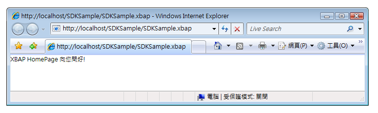  
  
> [!NOTE]
>  如需 [!INCLUDE[TLA2#tla_xbap#plural](../../../../includes/tla2sharptla-xbapsharpplural-md.md)] 開發和部署的詳細資訊，請參閱 [WPF XAML 瀏覽器應用程式概觀](../../../../docs/framework/wpf/app-development/wpf-xaml-browser-applications-overview.md)和[部署 WPF 應用程式](../../../../docs/framework/wpf/app-development/deploying-a-wpf-application-wpf.md)。  
  
   
### 設定裝載視窗的標題、寬度和高度  
 從上圖中您可能注意到一件事：瀏覽器和索引標籤面板的標題都是 [!INCLUDE[TLA2#tla_xbap](../../../../includes/tla2sharptla-xbap-md.md)] 的 [!INCLUDE[TLA2#tla_uri](../../../../includes/tla2sharptla-uri-md.md)]。  除了過長之外，這個標題既不具吸引力也不具資訊性。  基於這個原因，<xref:System.Windows.Controls.Page> 提供您藉由設定 <xref:System.Windows.Controls.Page.WindowTitle%2A> 屬性來變更標題的方式。  再者，您也可以藉由設定 <xref:System.Windows.Controls.Page.WindowWidth%2A> 和 <xref:System.Windows.Controls.Page.WindowHeight%2A>，分別設定瀏覽器視窗的寬度和高度。  
  
 <xref:System.Windows.Controls.Page.WindowTitle%2A>、<xref:System.Windows.Controls.Page.WindowWidth%2A> 和 <xref:System.Windows.Controls.Page.WindowHeight%2A> 可以在標記中以宣告方式設定，如下列範例所示。  
  
 [!code-xml[NavigationOverviewSnippets#HomePageMARKUP](../../../../samples/snippets/csharp/VS_Snippets_Wpf/NavigationOverviewSnippets/CSharp/HomePage.xaml#homepagemarkup)]  
  
 下圖顯示結果。  
  
   
  
   
### 超連結巡覽  
 一般的 [!INCLUDE[TLA2#tla_xbap](../../../../includes/tla2sharptla-xbap-md.md)] 包含數個頁面。  從某一頁面巡覽至另一頁面的最簡單方式是使用 <xref:System.Windows.Documents.Hyperlink>。  您可以宣告方式將 <xref:System.Windows.Documents.Hyperlink> 加入到 <xref:System.Windows.Controls.Page> 中，方法是使用 `Hyperlink` 項目，如下列標記所示。  
  
 [!code-xml[NavigationOverviewSnippets#HyperlinkXAML1](../../../../samples/snippets/csharp/VS_Snippets_Wpf/NavigationOverviewSnippets/CSharp/PageWithHyperlink.xaml#hyperlinkxaml1)]  
[!code-xml[NavigationOverviewSnippets#HyperlinkXAML2](../../../../samples/snippets/csharp/VS_Snippets_Wpf/NavigationOverviewSnippets/CSharp/PageWithHyperlink.xaml#hyperlinkxaml2)]  
[!code-xml[NavigationOverviewSnippets#HyperlinkXAML3](../../../../samples/snippets/csharp/VS_Snippets_Wpf/NavigationOverviewSnippets/CSharp/PageWithHyperlink.xaml#hyperlinkxaml3)]  
  
 `Hyperlink` 項目需要下列項目：  
  
-   要巡覽的 <xref:System.Windows.Controls.Page> 的封裝 [!INCLUDE[TLA2#tla_uri](../../../../includes/tla2sharptla-uri-md.md)]，如 `NavigateUri` 屬性所指定。  
  
-   使用者用以啟始巡覽所按下的內容，例如文字和影像 \(如需 `Hyperlink` 項目可以包含的內容，請參閱 <xref:System.Windows.Documents.Hyperlink>\)。  
  
 下圖顯示的 [!INCLUDE[TLA2#tla_xbap](../../../../includes/tla2sharptla-xbap-md.md)]，其 <xref:System.Windows.Controls.Page> 具有 <xref:System.Windows.Documents.Hyperlink>。  
  
 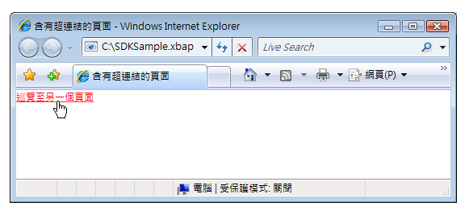  
  
 如您所預料的，按下 <xref:System.Windows.Documents.Hyperlink> 會讓 [!INCLUDE[TLA2#tla_xbap](../../../../includes/tla2sharptla-xbap-md.md)] 巡覽到由 `NavigateUri` 屬性所識別的 <xref:System.Windows.Controls.Page>。  此外，[!INCLUDE[TLA2#tla_xbap](../../../../includes/tla2sharptla-xbap-md.md)] 會在 [!INCLUDE[TLA2#tla_ie](../../../../includes/tla2sharptla-ie-md.md)] 中的 \[最近存取的頁面\] 清單中，加入前述 <xref:System.Windows.Controls.Page> 的項目。  請參考下圖中的示範。  
  
 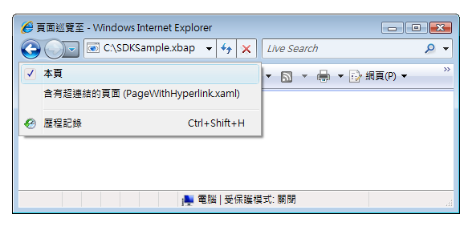  
  
 就像支援從某一個 <xref:System.Windows.Controls.Page> 巡覽至另一個頁面一樣，<xref:System.Windows.Documents.Hyperlink> 也支援片段巡覽。  
  
   
### 片段巡覽  
 「*片段巡覽*」\(Fragment Navigation\) 是對目前 <xref:System.Windows.Controls.Page> 或另一個 <xref:System.Windows.Controls.Page> 中內容片段的巡覽。  [!INCLUDE[TLA2#tla_wpf](../../../../includes/tla2sharptla-wpf-md.md)] 中的內容片段是具名項目所包含的內容。  具名項目是設定有 `Name` 屬性的項目。  下列標記顯示包含內容片段的具名 `TextBlock` 項目。  
  
 [!code-xml[NavigationOverviewSnippets#PageWithContentFragmentsMARKUP1](../../../../samples/snippets/csharp/VS_Snippets_Wpf/NavigationOverviewSnippets/CSharp/PageWithFragments.xaml#pagewithcontentfragmentsmarkup1)]  
[!code-xml[NavigationOverviewSnippets#PageWithContentFragmentsMARKUP2](../../../../samples/snippets/csharp/VS_Snippets_Wpf/NavigationOverviewSnippets/CSharp/PageWithFragments.xaml#pagewithcontentfragmentsmarkup2)]  
[!code-xml[NavigationOverviewSnippets#PageWithContentFragmentsMARKUP3](../../../../samples/snippets/csharp/VS_Snippets_Wpf/NavigationOverviewSnippets/CSharp/PageWithFragments.xaml#pagewithcontentfragmentsmarkup3)]  
  
 為了讓 <xref:System.Windows.Documents.Hyperlink> 巡覽內容片段，`NavigateUri` 屬性必須包含下列：  
  
-   具有要巡覽內容片段的 <xref:System.Windows.Controls.Page> 的 [!INCLUDE[TLA2#tla_uri](../../../../includes/tla2sharptla-uri-md.md)]。  
  
-   "\#" 字元。  
  
-   包含內容片段的 <xref:System.Windows.Controls.Page> 上的項目名稱。  
  
 片段 [!INCLUDE[TLA2#tla_uri](../../../../includes/tla2sharptla-uri-md.md)] 的格式如下。  
  
 *PageURI* `#` *ElementName*  
  
 下列範例顯示設定為巡覽內容片段的 `Hyperlink`。  
  
 [!code-xml[NavigationOverviewSnippets#PageThatNavigatesXAML1](../../../../samples/snippets/csharp/VS_Snippets_Wpf/NavigationOverviewSnippets/CSharp/PageThatNavigatesToFragment.xaml#pagethatnavigatesxaml1)]  
[!code-xml[NavigationOverviewSnippets#PageThatNavigatesXAML2](../../../../samples/snippets/csharp/VS_Snippets_Wpf/NavigationOverviewSnippets/CSharp/PageThatNavigatesToFragment.xaml#pagethatnavigatesxaml2)]  
[!code-xml[NavigationOverviewSnippets#PageThatNavigatesXAML3](../../../../samples/snippets/csharp/VS_Snippets_Wpf/NavigationOverviewSnippets/CSharp/PageThatNavigatesToFragment.xaml#pagethatnavigatesxaml3)]  
  
> [!NOTE]
>  本節描述 [!INCLUDE[TLA2#tla_wpf](../../../../includes/tla2sharptla-wpf-md.md)] 中的預設片段巡覽實作。  [!INCLUDE[TLA2#tla_wpf](../../../../includes/tla2sharptla-wpf-md.md)] 也讓您可以實作自己的片段巡覽結構描述，該結構描述有部分需要處理 <xref:System.Windows.Navigation.NavigationService.FragmentNavigation?displayProperty=fullName> 事件。  
  
> [!IMPORTANT]
>  只要鬆散 [!INCLUDE[TLA2#tla_xaml](../../../../includes/tla2sharptla-xaml-md.md)] 頁面 \(以 `Page` 做為根項目的僅含標記 [!INCLUDE[TLA2#tla_xaml](../../../../includes/tla2sharptla-xaml-md.md)] 檔案\) 可以透過 [!INCLUDE[TLA2#tla_http](../../../../includes/tla2sharptla-http-md.md)] 瀏覽，您就可以巡覽該頁面中的片段。  
>   
>  然而，鬆散 [!INCLUDE[TLA2#tla_xaml](../../../../includes/tla2sharptla-xaml-md.md)] 頁面可以巡覽自己的片段。  
  
   
### 巡覽服務  
 雖然 <xref:System.Windows.Documents.Hyperlink> 允許使用者對特定 <xref:System.Windows.Controls.Page> 啟動巡覽，但找出和下載頁面的工作是由 <xref:System.Windows.Navigation.NavigationService> 類別執行的。  基本上，<xref:System.Windows.Navigation.NavigationService> 提供用於代表用戶端程式碼來處理巡覽要求的能力，例如 <xref:System.Windows.Documents.Hyperlink>。  此外，<xref:System.Windows.Navigation.NavigationService> 會實作對於追蹤和影響巡覽要求的高階支援。  
  
 按下 <xref:System.Windows.Documents.Hyperlink> 時，[!INCLUDE[TLA2#tla_wpf](../../../../includes/tla2sharptla-wpf-md.md)] 會呼叫 <xref:System.Windows.Navigation.NavigationService.Navigate%2A?displayProperty=fullName>，以在指定封裝 [!INCLUDE[TLA2#tla_uri](../../../../includes/tla2sharptla-uri-md.md)] 中找出並下載 <xref:System.Windows.Controls.Page>。  下載的 <xref:System.Windows.Controls.Page> 會轉換成物件的樹狀結構，其根物件是下載的 <xref:System.Windows.Controls.Page> 的執行個體。  根 <xref:System.Windows.Controls.Page> 物件的參考是儲存在 <xref:System.Windows.Navigation.NavigationService.Content%2A?displayProperty=fullName> 屬性中。  巡覽過內容的封裝 [!INCLUDE[TLA2#tla_uri](../../../../includes/tla2sharptla-uri-md.md)] 是儲存在 <xref:System.Windows.Navigation.NavigationService.Source%2A?displayProperty=fullName> 屬性中，而 <xref:System.Windows.Navigation.NavigationService.CurrentSource%2A?displayProperty=fullName> 會儲存最近一次巡覽的頁面的封裝 [!INCLUDE[TLA2#tla_uri](../../../../includes/tla2sharptla-uri-md.md)]。  
  
> [!NOTE]
>  [!INCLUDE[TLA2#tla_wpf](../../../../includes/tla2sharptla-wpf-md.md)] 應用程式具有一個以上目前作用中的 <xref:System.Windows.Navigation.NavigationService> 是有可能的事。  如需詳細資訊，請參閱本主題稍後的[巡覽裝載](#Navigation_Hosts)。  
  
   
### 使用巡覽服務以程式設計方式進行巡覽  
 當巡覽是使用 <xref:System.Windows.Documents.Hyperlink> 在標記中以宣告方式實作的，您就不需要知道 <xref:System.Windows.Navigation.NavigationService>，因為 <xref:System.Windows.Documents.Hyperlink> 會代表您使用 <xref:System.Windows.Navigation.NavigationService>。  這表示，只要 <xref:System.Windows.Documents.Hyperlink> 的直接或間接父代 \(Parent\) 為巡覽裝載 \(請參閱[巡覽裝載](#Navigation_Hosts)\)，<xref:System.Windows.Documents.Hyperlink> 就能尋找並使用巡覽裝載的裝載服務以處理巡覽要求。  
  
 然而，在有些情況下您需要直接使用 <xref:System.Windows.Navigation.NavigationService>，包括下列情況：  
  
-   當您需要使用非預設建構函式具現化 <xref:System.Windows.Controls.Page> 時。  
  
-   當您在巡覽 <xref:System.Windows.Controls.Page> 前需要先對其設定屬性。  
  
-   當要巡覽的 <xref:System.Windows.Controls.Page> 只可以在執行階段決定時。  
  
 在這些情況下，您需要撰寫程式碼，藉由呼叫 <xref:System.Windows.Navigation.NavigationService> 物件的 <xref:System.Windows.Navigation.NavigationService.Navigate%2A> 方法，以程式設計方式具現化巡覽。  這需要取得 <xref:System.Windows.Navigation.NavigationService> 的參考。  
  
#### 取得 NavigationService 的參考  
 基於[巡覽裝載](#Navigation_Hosts)一節中涵蓋的原因，[!INCLUDE[TLA2#tla_wpf](../../../../includes/tla2sharptla-wpf-md.md)] 應用程式可以具有一個以上的 <xref:System.Windows.Navigation.NavigationService>。  這表示您的程式碼需要有找出 <xref:System.Windows.Navigation.NavigationService> \(通常是當初巡覽至目前 <xref:System.Windows.Controls.Page> 的 <xref:System.Windows.Navigation.NavigationService>\) 的方式。藉由呼叫 `static` <xref:System.Windows.Navigation.NavigationService.GetNavigationService%2A?displayProperty=fullName> 方法，您可以取得 <xref:System.Windows.Navigation.NavigationService> 的參考。  若要取得巡覽過特定 <xref:System.Windows.Controls.Page> 的 <xref:System.Windows.Navigation.NavigationService>，您要將 <xref:System.Windows.Controls.Page> 的參考傳遞為 <xref:System.Windows.Navigation.NavigationService.GetNavigationService%2A> 方法的引數。  下列程式碼顯示如何取得目前 <xref:System.Windows.Controls.Page> 的 <xref:System.Windows.Navigation.NavigationService>。  
  
 [!code-csharp[NavigationOverviewSnippets#GetNSCODEBEHIND1](../../../../samples/snippets/csharp/VS_Snippets_Wpf/NavigationOverviewSnippets/CSharp/GetNSPage.xaml.cs#getnscodebehind1)]  
[!code-csharp[NavigationOverviewSnippets#GetNSCODEBEHIND2](../../../../samples/snippets/csharp/VS_Snippets_Wpf/NavigationOverviewSnippets/CSharp/GetNSPage.xaml.cs#getnscodebehind2)]
[!code-vb[NavigationOverviewSnippets#GetNSCODEBEHIND2](../../../../samples/snippets/visualbasic/VS_Snippets_Wpf/NavigationOverviewSnippets/VisualBasic/GetNSPage.xaml.vb#getnscodebehind2)]  
  
 做為供 <xref:System.Windows.Controls.Page> 尋找 <xref:System.Windows.Navigation.NavigationService> 的捷徑，<xref:System.Windows.Controls.Page> 會實作 <xref:System.Windows.Controls.Page.NavigationService%2A> 屬性。  這在下列範例中顯示。  
  
 [!code-csharp[NavigationOverviewSnippets#GetNSShortcutCODEBEHIND1](../../../../samples/snippets/csharp/VS_Snippets_Wpf/NavigationOverviewSnippets/CSharp/GetNSPageShortCut.xaml.cs#getnsshortcutcodebehind1)]  
[!code-csharp[NavigationOverviewSnippets#GetNSShortcutCODEBEHIND2](../../../../samples/snippets/csharp/VS_Snippets_Wpf/NavigationOverviewSnippets/CSharp/GetNSPageShortCut.xaml.cs#getnsshortcutcodebehind2)]
[!code-vb[NavigationOverviewSnippets#GetNSShortcutCODEBEHIND2](../../../../samples/snippets/visualbasic/VS_Snippets_Wpf/NavigationOverviewSnippets/VisualBasic/GetNSPageShortCut.xaml.vb#getnsshortcutcodebehind2)]  
  
> [!NOTE]
>  <xref:System.Windows.Controls.Page> 只有在 <xref:System.Windows.Controls.Page> 引發 <xref:System.Windows.FrameworkElement.Loaded> 事件時，才可以取得其 <xref:System.Windows.Navigation.NavigationService> 的參考。  
  
#### 以程式設計方式巡覽頁面物件  
 下列範例顯示如何使用 <xref:System.Windows.Navigation.NavigationService>，以程式設計方式巡覽至 <xref:System.Windows.Controls.Page>。  因為要巡覽的 <xref:System.Windows.Controls.Page> 只可以使用單一的非預設建構函式來具現化，所以使用程式設計方式巡覽是必要的。  下列標記和程式碼顯示具有非預設建構函式的 <xref:System.Windows.Controls.Page>。  
  
 [!code-xml[NavigationOverviewSnippets#PageWithNonDefaultConstructorXAML](../../../../samples/snippets/csharp/VS_Snippets_Wpf/NavigationOverviewSnippets/CSharp/PageWithNonDefaultConstructor.xaml#pagewithnondefaultconstructorxaml)]  
  
 [!code-csharp[NavigationOverviewSnippets#PageWithNonDefaultConstructorCODEBEHIND](../../../../samples/snippets/csharp/VS_Snippets_Wpf/NavigationOverviewSnippets/CSharp/PageWithNonDefaultConstructor.xaml.cs#pagewithnondefaultconstructorcodebehind)]
 [!code-vb[NavigationOverviewSnippets#PageWithNonDefaultConstructorCODEBEHIND](../../../../samples/snippets/visualbasic/VS_Snippets_Wpf/NavigationOverviewSnippets/VisualBasic/PageWithNonDefaultConstructor.xaml.vb#pagewithnondefaultconstructorcodebehind)]  
  
 下列標記和程式碼顯示的 <xref:System.Windows.Controls.Page> 會巡覽至具有非預設建構函式的 <xref:System.Windows.Controls.Page>。  
  
 [!code-xml[NavigationOverviewSnippets#NSNavigationPageXAML](../../../../samples/snippets/csharp/VS_Snippets_Wpf/NavigationOverviewSnippets/CSharp/NSNavigationPage.xaml#nsnavigationpagexaml)]  
  
 [!code-csharp[NavigationOverviewSnippets#NSNavigationPageCODEBEHIND](../../../../samples/snippets/csharp/VS_Snippets_Wpf/NavigationOverviewSnippets/CSharp/NSNavigationPage.xaml.cs#nsnavigationpagecodebehind)]
 [!code-vb[NavigationOverviewSnippets#NSNavigationPageCODEBEHIND](../../../../samples/snippets/visualbasic/VS_Snippets_Wpf/NavigationOverviewSnippets/VisualBasic/NSNavigationPage.xaml.vb#nsnavigationpagecodebehind)]  
  
 按下此 <xref:System.Windows.Controls.Page> 上的 <xref:System.Windows.Documents.Hyperlink> 時，會透過使用非預設的建構函式並呼叫 <xref:System.Windows.Navigation.NavigationService.Navigate%2A?displayProperty=fullName> 方法執行個體化要巡覽的 <xref:System.Windows.Controls.Page> 來初始化巡覽。  <xref:System.Windows.Navigation.NavigationService.Navigate%2A> 接受 <xref:System.Windows.Navigation.NavigationService> 將巡覽之物件的參考，但不接受 Pack [!INCLUDE[TLA2#tla_uri](../../../../includes/tla2sharptla-uri-md.md)]。  
  
#### 使用 Pack URI 以程式設計方式進行巡覽  
 如果需要以程式設計方式建構封裝 [!INCLUDE[TLA2#tla_uri](../../../../includes/tla2sharptla-uri-md.md)] \(舉例來說，當只能在執行階段決定封裝 [!INCLUDE[TLA2#tla_uri](../../../../includes/tla2sharptla-uri-md.md)] 時\)，可以使用 <xref:System.Windows.Navigation.NavigationService.Navigate%2A?displayProperty=fullName> 方法。  這在下列範例中顯示。  
  
 [!code-xml[NavigationOverviewSnippets#NSUriNavigationPageXAML](../../../../samples/snippets/csharp/VS_Snippets_Wpf/NavigationOverviewSnippets/CSharp/NSUriNavigationPage.xaml#nsurinavigationpagexaml)]  
  
 [!code-csharp[NavigationOverviewSnippets#NSUriNavigationPageCODEBEHIND](../../../../samples/snippets/csharp/VS_Snippets_Wpf/NavigationOverviewSnippets/CSharp/NSUriNavigationPage.xaml.cs#nsurinavigationpagecodebehind)]
 [!code-vb[NavigationOverviewSnippets#NSUriNavigationPageCODEBEHIND](../../../../samples/snippets/visualbasic/VS_Snippets_Wpf/NavigationOverviewSnippets/VisualBasic/NSUriNavigationPage.xaml.vb#nsurinavigationpagecodebehind)]  
  
#### 重新整理目前頁面  
 當 <xref:System.Windows.Controls.Page> 所具有的封裝 [!INCLUDE[TLA2#tla_uri](../../../../includes/tla2sharptla-uri-md.md)]，與儲存在 <xref:System.Windows.Navigation.NavigationService.Source%2A?displayProperty=fullName> 屬性中的封裝 [!INCLUDE[TLA2#tla_uri](../../../../includes/tla2sharptla-uri-md.md)] 相同時，就不會下載該頁面。  若要強制 [!INCLUDE[TLA2#tla_wpf](../../../../includes/tla2sharptla-wpf-md.md)] 再次下載目前的頁面，您可以呼叫 <xref:System.Windows.Navigation.NavigationService.Refresh%2A?displayProperty=fullName> 方法，如下列範例所示。  
  
 [!code-xml[NavigationOverviewSnippets#NSRefreshNavigationPageXAML1](../../../../samples/snippets/csharp/VS_Snippets_Wpf/NavigationOverviewSnippets/CSharp/NSRefreshNavigationPage.xaml#nsrefreshnavigationpagexaml1)]  
  
 [!code-csharp[NavigationOverviewSnippets#NSRefreshNavigationPageCODEBEHIND1](../../../../samples/snippets/csharp/VS_Snippets_Wpf/NavigationOverviewSnippets/CSharp/NSRefreshNavigationPage.xaml.cs#nsrefreshnavigationpagecodebehind1)]
 [!code-vb[NavigationOverviewSnippets#NSRefreshNavigationPageCODEBEHIND1](../../../../samples/snippets/visualbasic/VS_Snippets_Wpf/NavigationOverviewSnippets/VisualBasic/NSRefreshNavigationPage.xaml.vb#nsrefreshnavigationpagecodebehind1)]  
[!code-csharp[NavigationOverviewSnippets#NSRefreshNavigationPageCODEBEHIND2](../../../../samples/snippets/csharp/VS_Snippets_Wpf/NavigationOverviewSnippets/CSharp/NSRefreshNavigationPage.xaml.cs#nsrefreshnavigationpagecodebehind2)]
[!code-vb[NavigationOverviewSnippets#NSRefreshNavigationPageCODEBEHIND2](../../../../samples/snippets/visualbasic/VS_Snippets_Wpf/NavigationOverviewSnippets/VisualBasic/NSRefreshNavigationPage.xaml.vb#nsrefreshnavigationpagecodebehind2)]  
  
   
### 巡覽存留期  
 如您所見，啟始巡覽有許多種方式。  啟始巡覽後，若巡覽仍在進行中，您可以使用下列 <xref:System.Windows.Navigation.NavigationService> 所實作的事件，追蹤和影響巡覽：  
  
-   <xref:System.Windows.Navigation.NavigationService.Navigating>.  在要求新的巡覽時發生。  可以用於取消巡覽。  
  
-   <xref:System.Windows.Navigation.NavigationService.NavigationProgress>.  在下載期間定期發生，以提供巡覽進度資訊。  
  
-   <xref:System.Windows.Navigation.NavigationService.Navigated>.  在已找到並下載頁面時發生。  
  
-   <xref:System.Windows.Navigation.NavigationService.NavigationStopped>.  在停止巡覽時 \(藉由呼叫 <xref:System.Windows.Navigation.NavigationService.StopLoading%2A>\) 發生，或是目前巡覽仍在進行中的同時要求新的巡覽時發生。  
  
-   <xref:System.Windows.Navigation.NavigationService.NavigationFailed>.  在巡覽所要求的內容時，如果引發錯誤，就會發生。  
  
-   <xref:System.Windows.Navigation.NavigationService.LoadCompleted>.  在已載入和剖析巡覽過的內容，並開始轉譯時發生。  
  
-   <xref:System.Windows.Navigation.NavigationService.FragmentNavigation>.  在開始巡覽內容片段時發生，發生的情況如下：  
  
    -   如果所要片段在目前內容中，會立即發生。  
  
    -   如果所要片段在其他內容中，會於載入來源內容後發生。  
  
 巡覽事件的引發順序如下圖所示。  
  
 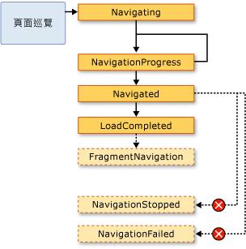  
  
 一般而言，<xref:System.Windows.Controls.Page> 不會關注這些事件。  而是應用程式比較傾向於關注這些事件，基於這個原因，這些事件也可以由 <xref:System.Windows.Application> 類別所引發：  
  
-   <xref:System.Windows.Application.Navigating?displayProperty=fullName>  
  
-   <xref:System.Windows.Application.NavigationProgress?displayProperty=fullName>  
  
-   <xref:System.Windows.Application.Navigated?displayProperty=fullName>  
  
-   <xref:System.Windows.Application.NavigationFailed?displayProperty=fullName>  
  
-   <xref:System.Windows.Application.NavigationStopped?displayProperty=fullName>  
  
-   <xref:System.Windows.Application.LoadCompleted?displayProperty=fullName>  
  
-   <xref:System.Windows.Application.FragmentNavigation?displayProperty=fullName>  
  
 每當 <xref:System.Windows.Navigation.NavigationService> 引發事件時，<xref:System.Windows.Application> 類別就會引發對應的事件。  <xref:System.Windows.Controls.Frame> 和 <xref:System.Windows.Navigation.NavigationWindow> 會提供相同的事件在各自的範圍內偵測巡覽。  
  
 在某些情況下，<xref:System.Windows.Controls.Page> 可能會對這些事件有興趣。  舉例來說，<xref:System.Windows.Controls.Page> 可能會處理 <xref:System.Windows.Navigation.NavigationService.Navigating?displayProperty=fullName> 事件，以決定是否要取消本身以外的巡覽。  這在下列範例中顯示。  
  
 [!code-xml[NavigationOverviewSnippets#CancelNavigationPageXAML](../../../../samples/snippets/csharp/VS_Snippets_Wpf/NavigationOverviewSnippets/CSharp/CancelNavigationPage.xaml#cancelnavigationpagexaml)]  
  
 [!code-csharp[NavigationOverviewSnippets#CancelNavigationPageCODEBEHIND](../../../../samples/snippets/csharp/VS_Snippets_Wpf/NavigationOverviewSnippets/CSharp/CancelNavigationPage.xaml.cs#cancelnavigationpagecodebehind)]
 [!code-vb[NavigationOverviewSnippets#CancelNavigationPageCODEBEHIND](../../../../samples/snippets/visualbasic/VS_Snippets_Wpf/NavigationOverviewSnippets/VisualBasic/CancelNavigationPage.xaml.vb#cancelnavigationpagecodebehind)]  
  
 如果使用 <xref:System.Windows.Controls.Page> 的巡覽事件來註冊處理常式，如前述範例所進行的，則也必須移除註冊事件處理常式。  如果沒有這麼做，在 [!INCLUDE[TLA2#tla_wpf](../../../../includes/tla2sharptla-wpf-md.md)] 巡覽如何使用日誌記住 <xref:System.Windows.Controls.Page> 巡覽方面可能會有些副作用。  
  
   
### 以日誌記住巡覽  
 [!INCLUDE[TLA2#tla_wpf](../../../../includes/tla2sharptla-wpf-md.md)] 使用兩個堆疊記住您巡覽過的頁面：上一頁堆疊和下一頁堆疊。  當您從目前 <xref:System.Windows.Controls.Page> 巡覽到新的 <xref:System.Windows.Controls.Page>，或是前往現有的 <xref:System.Windows.Controls.Page> 時，就會將目前的 <xref:System.Windows.Controls.Page> 加入到「*上一頁堆疊*」\(Back Stack\)。  當您從目前 <xref:System.Windows.Controls.Page> 巡覽回先前的 <xref:System.Windows.Controls.Page> 時，就會將目前的 <xref:System.Windows.Controls.Page> 加入到「*下一頁堆疊*」\(Forward Stack\)。  上一頁堆疊、下一頁堆疊和管理這兩個堆疊的功能，統稱為日誌。  上一頁堆疊和下一頁堆疊中的每個項目都是 <xref:System.Windows.Navigation.JournalEntry> 類別的執行個體，稱為「*日誌項目*」\(Journal Entry\)。  
  
#### 從 Internet Explorer 巡覽日誌  
 在概念上來說，日誌運作的方式與 [!INCLUDE[TLA2#tla_ie](../../../../includes/tla2sharptla-ie-md.md)] 中的 \[**上一頁**\] 和 \[**下一頁**\] 按鈕運作方式相同。  下圖中顯示這些項目。  
  
   
  
 對於由 [!INCLUDE[TLA2#tla_ie](../../../../includes/tla2sharptla-ie-md.md)] 所裝載的 [!INCLUDE[TLA2#tla_xbap#plural](../../../../includes/tla2sharptla-xbapsharpplural-md.md)]，[!INCLUDE[TLA2#tla_wpf](../../../../includes/tla2sharptla-wpf-md.md)] 會將日誌整合到 [!INCLUDE[TLA2#tla_ie](../../../../includes/tla2sharptla-ie-md.md)] 的巡覽 [!INCLUDE[TLA2#tla_ui](../../../../includes/tla2sharptla-ui-md.md)] 中。  這樣可以讓使用者藉由使用 [!INCLUDE[TLA2#tla_ie](../../../../includes/tla2sharptla-ie-md.md)] 中的 \[**上一頁**\]、\[**下一頁**\] 和 \[**最近存取的頁面**\] 按鈕，巡覽 [!INCLUDE[TLA2#tla_xbap](../../../../includes/tla2sharptla-xbap-md.md)] 中的頁面。在 [!INCLUDE[TLA2#tla_ie6](../../../../includes/tla2sharptla-ie6-md.md)] 中，並沒有以與 [!INCLUDE[TLA2#tla_ie7](../../../../includes/tla2sharptla-ie7-md.md)] 或 Internet Explorer 8 相同的方式整合日誌。  而是 [!INCLUDE[TLA2#tla_wpf](../../../../includes/tla2sharptla-wpf-md.md)] 會改為轉譯替代的巡覽 [!INCLUDE[TLA2#tla_ui](../../../../includes/tla2sharptla-ui-md.md)]。  
  
> [!IMPORTANT]
>  在 [!INCLUDE[TLA2#tla_ie](../../../../includes/tla2sharptla-ie-md.md)] 中，當使用者的巡覽動作是離開或回到 [!INCLUDE[TLA2#tla_xbap](../../../../includes/tla2sharptla-xbap-md.md)]，只有不在作用中的頁面日誌項目會保留在日誌中。  如需讓頁面保持作用中的討論，請參閱本主題稍後的[頁面存留期和日誌](#PageLifetime)。  
  
 根據預設，出現在 [!INCLUDE[TLA2#tla_ie](../../../../includes/tla2sharptla-ie-md.md)] 中 \[**最近存取的頁面**\] 清單的每個 <xref:System.Windows.Controls.Page> 的文字，是 <xref:System.Windows.Controls.Page> 的 [!INCLUDE[TLA2#tla_uri](../../../../includes/tla2sharptla-uri-md.md)]。  在許多情況下，這對使用者而言沒有特別的意義。  幸運的是，您可以使用下列其中一個選項變更文字：  
  
1.  附加的 `JournalEntry.Name` 屬性值。  
  
2.  `Page.Title` 屬性值。  
  
3.  `Page.WindowTitle` 屬性值和目前 <xref:System.Windows.Controls.Page> 的 [!INCLUDE[TLA2#tla_uri](../../../../includes/tla2sharptla-uri-md.md)]。  
  
4.  目前 <xref:System.Windows.Controls.Page> 的 [!INCLUDE[TLA2#tla_uri](../../../../includes/tla2sharptla-uri-md.md)] \(預設值\)  
  
 所列出選項的順序符合找出文字的優先順序。  舉例來說，如果有設定 `JournalEntry.Name`，就會忽略其他值。  
  
 下列範例使用 `Page.Title` 屬性變更出現在日誌項目的文字。  
  
 [!code-xml[NavigationOverviewSnippets#PageTitleMARKUP1](../../../../samples/snippets/csharp/VS_Snippets_Wpf/NavigationOverviewSnippets/CSharp/PageWithTitle.xaml#pagetitlemarkup1)]  
[!code-xml[NavigationOverviewSnippets#PageTitleMARKUP2](../../../../samples/snippets/csharp/VS_Snippets_Wpf/NavigationOverviewSnippets/CSharp/PageWithTitle.xaml#pagetitlemarkup2)]  
  
 [!code-csharp[NavigationOverviewSnippets#PageTitleCODEBEHIND1](../../../../samples/snippets/csharp/VS_Snippets_Wpf/NavigationOverviewSnippets/CSharp/PageWithTitle.xaml.cs#pagetitlecodebehind1)]
 [!code-vb[NavigationOverviewSnippets#PageTitleCODEBEHIND1](../../../../samples/snippets/visualbasic/VS_Snippets_Wpf/NavigationOverviewSnippets/VisualBasic/PageWithTitle.xaml.vb#pagetitlecodebehind1)]  
[!code-csharp[NavigationOverviewSnippets#PageTitleCODEBEHIND2](../../../../samples/snippets/csharp/VS_Snippets_Wpf/NavigationOverviewSnippets/CSharp/PageWithTitle.xaml.cs#pagetitlecodebehind2)]
[!code-vb[NavigationOverviewSnippets#PageTitleCODEBEHIND2](../../../../samples/snippets/visualbasic/VS_Snippets_Wpf/NavigationOverviewSnippets/VisualBasic/PageWithTitle.xaml.vb#pagetitlecodebehind2)]  
  
#### 使用 WPF 巡覽日誌  
 雖然使用者可以藉由使用 [!INCLUDE[TLA2#tla_ie](../../../../includes/tla2sharptla-ie-md.md)] 中的 \[**上一頁**\]、\[**下一頁**\] 和 \[**最近存取的頁面**\] 巡覽日誌，您也可以使用 [!INCLUDE[TLA2#tla_wpf](../../../../includes/tla2sharptla-wpf-md.md)] 所提供的宣告式和程式設計機制來巡覽日誌。  這樣做的一個原因是可以在頁面中提供自訂巡覽 [!INCLUDE[TLA2#tla_ui#plural](../../../../includes/tla2sharptla-uisharpplural-md.md)]。  
  
 藉由使用 <xref:System.Windows.Input.NavigationCommands> 所公開的巡覽命令，您可以宣告方式加入日誌巡覽支援。  下列範例示範如何使用 `BrowseBack` 巡覽命令。  
  
 [!code-xml[NavigationOverviewSnippets#NavigationCommandsPageXAML1](../../../../samples/snippets/csharp/VS_Snippets_Wpf/NavigationOverviewSnippets/CSharp/NavigationCommandsPage.xaml#navigationcommandspagexaml1)]  
[!code-xml[NavigationOverviewSnippets#NavigationCommandsPageXAML2](../../../../samples/snippets/csharp/VS_Snippets_Wpf/NavigationOverviewSnippets/CSharp/NavigationCommandsPage.xaml#navigationcommandspagexaml2)]  
[!code-xml[NavigationOverviewSnippets#NavigationCommandsPageXAML3](../../../../samples/snippets/csharp/VS_Snippets_Wpf/NavigationOverviewSnippets/CSharp/NavigationCommandsPage.xaml#navigationcommandspagexaml3)]  
[!code-xml[NavigationOverviewSnippets#NavigationCommandsPageXAML4](../../../../samples/snippets/csharp/VS_Snippets_Wpf/NavigationOverviewSnippets/CSharp/NavigationCommandsPage.xaml#navigationcommandspagexaml4)]  
  
 藉由使用下列其中一個 <xref:System.Windows.Navigation.NavigationService> 類別成員，您可以程式設計方式巡覽日誌。  
  
-   <xref:System.Windows.Navigation.NavigationService.GoBack%2A>  
  
-   <xref:System.Windows.Navigation.NavigationService.GoForward%2A>  
  
-   <xref:System.Windows.Navigation.NavigationService.CanGoBack%2A>  
  
-   <xref:System.Windows.Navigation.NavigationService.CanGoForward%2A>  
  
 如本主題稍後[以巡覽記錄保留內容狀態](#RetainingContentStateWithNavigationHistory)所述，日誌也可以程式設計方式操控。  
  
   
### 頁面存留期和日誌  
 請考慮 [!INCLUDE[TLA2#tla_xbap](../../../../includes/tla2sharptla-xbap-md.md)] 的許多頁面包含豐富型內容 \(包含圖形、動畫和媒體\) 的情況。  這類頁面的記憶體耗用量可能十分龐大，特別是在使用視訊和音訊媒體時。  由於日誌會記住巡覽過的頁面，這樣的 [!INCLUDE[TLA2#tla_xbap](../../../../includes/tla2sharptla-xbap-md.md)] 會迅速耗用掉大量可觀的記憶體。  
  
 基於這個原因，日誌的預設行為是在每個日誌項目中存放 <xref:System.Windows.Controls.Page> 中繼資料，而非存放 <xref:System.Windows.Controls.Page> 物件的參考。  當巡覽日誌項目時，其 <xref:System.Windows.Controls.Page> 中繼資料是用於建立指定 <xref:System.Windows.Controls.Page> 的新執行個體。  因此，每個巡覽的 <xref:System.Windows.Controls.Page> 的存留期可由下圖說明。  
  
 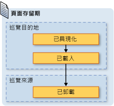  
  
 雖然使用預設日誌行為可以節省記憶體的耗用量，然而針對每個頁面的轉譯效能則會降低，重新具現化 <xref:System.Windows.Controls.Page> 可能會很耗時，特別是在有許多內容時。  如果需要在日誌中保留 <xref:System.Windows.Controls.Page> 執行個體，您可以引用兩種技巧來達成目的。  首先，您可以藉由呼叫 <xref:System.Windows.Navigation.NavigationService.Navigate%2A?displayProperty=fullName> 方法，以程式設計方式巡覽 <xref:System.Windows.Controls.Page> 物件。  
  
 第二，藉由將 <xref:System.Windows.Controls.Page.KeepAlive%2A> 屬性設定為 `true` \(預設值是 `false`\)，您可以指定 [!INCLUDE[TLA2#tla_wpf](../../../../includes/tla2sharptla-wpf-md.md)] 在日誌中保留 <xref:System.Windows.Controls.Page> 的執行個體。  如下列範例所示，您可以宣告方式在標記中設定 <xref:System.Windows.Controls.Page.KeepAlive%2A>。  
  
 [!code-xml[NavigationOverviewSnippets#KeepAlivePageXAML](../../../../samples/snippets/csharp/VS_Snippets_Wpf/NavigationOverviewSnippets/CSharp/KeepAlivePage.xaml#keepalivepagexaml)]  
  
 保留作用中的 <xref:System.Windows.Controls.Page> 存留期，與沒有保留作用中的存留期有些微的不同。  第一次巡覽到保留作用中的 <xref:System.Windows.Controls.Page> 時，它的具現化方式就如同沒有保留作用中的 <xref:System.Windows.Controls.Page> 一樣。  然而，因為 <xref:System.Windows.Controls.Page> 的執行個體保留在日誌中，只要繼續保留於日誌內，就不會再次具現化。  因此，如果 <xref:System.Windows.Controls.Page> 需要在每次巡覽 <xref:System.Windows.Controls.Page> 時呼叫初始化邏輯，就應該將其從建構函式移動到 <xref:System.Windows.FrameworkElement.Loaded> 事件的處理常式。  如下圖所示，在每次的巡覽進入或離開 <xref:System.Windows.Controls.Page> 時，仍會對應引發 <xref:System.Windows.FrameworkElement.Loaded> 和 <xref:System.Windows.FrameworkElement.Unloaded> 事件。  
  
   
  
 當 <xref:System.Windows.Controls.Page> 沒有保留作用中時，不應該進行下列任一項作業：  
  
-   儲存頁面參考，或當中任何部分的參考。  
  
-   以非頁面實作的事件註冊事件處理常式。  
  
 進行上述任一作業將會建立參考，強制 <xref:System.Windows.Controls.Page> 保留在記憶體中，即使從日誌中移除頁面也一樣。  
  
 一般而言，您應該會傾向於預設的 <xref:System.Windows.Controls.Page> 行為，不要讓 <xref:System.Windows.Controls.Page> 保留作用中。  然而，這會有下節所討論的狀態含意。  
  
   
### 以巡覽記錄保留內容狀態  
 如果 <xref:System.Windows.Controls.Page> 沒有保留作用中，而頁面的控制項會向使用者收集資料，那麼當使用者離開 <xref:System.Windows.Controls.Page> 後又巡覽回該頁面時，對資料會有什麼影響？  從使用者經驗的觀點來看，使用者會預期看到先前所輸入的資料。  不巧的是，因為 <xref:System.Windows.Controls.Page> 的新執行個體會隨著每次巡覽而建立，收集過資料的控制項會重新具現化，而資料就會遺失。  
  
 所幸，日誌提供的支援可以跨不同 <xref:System.Windows.Controls.Page> 巡覽記住資料，包含控制項的資料。  特別是每個 <xref:System.Windows.Controls.Page> 的日誌項目，會做為關聯 <xref:System.Windows.Controls.Page> 狀態的暫存容器。  下列步驟概略說明巡覽 <xref:System.Windows.Controls.Page> 時如何使用這項支援：  
  
1.  目前 <xref:System.Windows.Controls.Page> 的項目會加入到日誌中。  
  
2.  <xref:System.Windows.Controls.Page> 的狀態會隨著該頁面的日誌項目儲存，而加入到上一頁堆疊。  
  
3.  要巡覽的新 <xref:System.Windows.Controls.Page>。  
  
 當巡覽回頁面 <xref:System.Windows.Controls.Page> 時，藉由使用日誌，會發生下列步驟：  
  
1.  具現化 <xref:System.Windows.Controls.Page> \(上一頁堆疊的最上層日誌項目\)。  
  
2.  以伴隨 <xref:System.Windows.Controls.Page> 日誌項目而儲存的狀態重新整理 <xref:System.Windows.Controls.Page>。  
  
3.  巡覽回 <xref:System.Windows.Controls.Page>。  
  
 在 <xref:System.Windows.Controls.Page> 上使用下列控制項時，[!INCLUDE[TLA2#tla_wpf](../../../../includes/tla2sharptla-wpf-md.md)] 會自動使用這項支援：  
  
-   <xref:System.Windows.Controls.CheckBox>  
  
-   <xref:System.Windows.Controls.ComboBox>  
  
-   <xref:System.Windows.Controls.Expander>  
  
-   <xref:System.Windows.Controls.Frame>  
  
-   <xref:System.Windows.Controls.ListBox>  
  
-   <xref:System.Windows.Controls.ListBoxItem>  
  
-   <xref:System.Windows.Controls.MenuItem>  
  
-   <xref:System.Windows.Controls.ProgressBar>  
  
-   <xref:System.Windows.Controls.RadioButton>  
  
-   <xref:System.Windows.Controls.Slider>  
  
-   <xref:System.Windows.Controls.TabControl>  
  
-   <xref:System.Windows.Controls.TabItem>  
  
-   <xref:System.Windows.Controls.TextBox>  
  
 如果 <xref:System.Windows.Controls.Page> 有使用這些控制項，就會跨不同 <xref:System.Windows.Controls.Page> 巡覽記住當中輸入的資料，如下圖中的 \[**Favorite Color**\] <xref:System.Windows.Controls.ListBox> 所示範。  
  
   
  
 當 <xref:System.Windows.Controls.Page> 具有前述清單以外的控制項時，或是當狀態是儲存在自訂物件中時，您需要撰寫程式碼讓日誌跨不同的 <xref:System.Windows.Controls.Page> 巡覽記住狀態。  
  
 如果您需要跨不同 <xref:System.Windows.Controls.Page> 巡覽記住小片段的狀態，您可以使用以 <xref:System.Windows.FrameworkPropertyMetadata.Journal%2A?displayProperty=fullName> 中繼資料旗標設定的相依性屬性 \(請參閱 <xref:System.Windows.DependencyProperty>\)。  
  
 如果 <xref:System.Windows.Controls.Page> 需要跨不同巡覽記住的狀態，是由多個資料片段組成的，您會發現將狀態封裝到單一類別並實作 <xref:System.Windows.Navigation.IProvideCustomContentState> 介面，所要撰寫的程式碼會較為精簡  
  
 如果您需要巡覽單一 <xref:System.Windows.Controls.Page> 的各種狀態，而不要巡覽 <xref:System.Windows.Controls.Page> 本身，則可以使用 <xref:System.Windows.Navigation.IProvideCustomContentState> 和 <xref:System.Windows.Navigation.NavigationService.AddBackEntry%2A?displayProperty=fullName>。  
  
   
### Cookie  
 [!INCLUDE[TLA2#tla_wpf](../../../../includes/tla2sharptla-wpf-md.md)] 應用程式可以儲存資料的另一個方式是使用 Cookie，Cookie 是藉由使用 <xref:System.Windows.Application.SetCookie%2A> 和 <xref:System.Windows.Application.GetCookie%2A> 方法建立、更新和刪除的。  您在 [!INCLUDE[TLA2#tla_wpf](../../../../includes/tla2sharptla-wpf-md.md)] 中可以建立的 Cookie，與其他類型 Web 應用程式所使用的 Cookie 是相同的。Cookie 是用戶端電腦的應用程式在應用程式工作階段期間或跨應用程式工作階段時，所儲存的任意資料片段。  Cookie 資料通常會採用下列格式的名稱 \/ 值配對組型式。  
  
 *Name* `=` *Value*  
  
 當傳遞資料給 <xref:System.Windows.Application.SetCookie%2A> 時，會伴隨著應該要設定 Cookie 的位置 <xref:System.Uri>，Cookie 是在記憶體中建立的，而且只適用於目前應用程式工作階段的持續期間。  這類型的 Cookie 稱為「*工作階段 Cookie*」\(Session Cookie\)。  
  
 若要跨應用程式工作階段儲存 Cookie，必須使用下列格式在 Cookie 中加入到期日。  
  
 *NAME* `=` *VALUE* `; expires=DAY, DD-MMM-YYYY HH:MM:SS GMT`  
  
 具有到期日的 Cookie 在過期前，是儲存在目前 [!INCLUDE[TLA#tla_mswin](../../../../includes/tlasharptla-mswin-md.md)] 安裝的 \[Temporary Internet Files\] 資料夾。  這樣的 Cookie 稱為「*持續性 Cookie*」\(Persistent Cookie\)，因為它會跨不同應用程式工作階段持續存在。  
  
 藉由呼叫 <xref:System.Windows.Application.GetCookie%2A> 方法，並傳遞位置的 <xref:System.Uri> \(當中的 Cookie 是以 <xref:System.Windows.Application.SetCookie%2A> 方法設定的\)，您可以擷取工作階段和持續性 Cookie。  
  
 下列是 [!INCLUDE[TLA2#tla_wpf](../../../../includes/tla2sharptla-wpf-md.md)] 中支援 Cookie 的部分方式：  
  
-   [!INCLUDE[TLA2#tla_wpf](../../../../includes/tla2sharptla-wpf-md.md)] 獨立應用程式和 [!INCLUDE[TLA2#tla_xbap#plural](../../../../includes/tla2sharptla-xbapsharpplural-md.md)] 可以建立和管理 Cookie。  
  
-   由 [!INCLUDE[TLA2#tla_xbap](../../../../includes/tla2sharptla-xbap-md.md)] 建立的 Cookie 可以從瀏覽器存取。  
  
-   來自相同網域的 [!INCLUDE[TLA2#tla_xbap#plural](../../../../includes/tla2sharptla-xbapsharpplural-md.md)] 可以建立和共用 Cookie。  
  
-   來自相同網域的 [!INCLUDE[TLA2#tla_xbap#plural](../../../../includes/tla2sharptla-xbapsharpplural-md.md)] 和 [!INCLUDE[TLA2#tla_html](../../../../includes/tla2sharptla-html-md.md)] 頁面可以建立和共用 Cookie。  
  
-   Cookie 是在 [!INCLUDE[TLA2#tla_xbap#plural](../../../../includes/tla2sharptla-xbapsharpplural-md.md)] 和鬆散 [!INCLUDE[TLA2#tla_xaml](../../../../includes/tla2sharptla-xaml-md.md)] 頁面提出 Web 要求時分派的。  
  
-   最上層 [!INCLUDE[TLA2#tla_xbap#plural](../../../../includes/tla2sharptla-xbapsharpplural-md.md)] 和 IFRAMES 中裝載的 [!INCLUDE[TLA2#tla_xbap#plural](../../../../includes/tla2sharptla-xbapsharpplural-md.md)] 都可以存取 Cookie。  
  
-   在所有支援的瀏覽器中，[!INCLUDE[TLA2#tla_wpf](../../../../includes/tla2sharptla-wpf-md.md)] 中的 Cookie 支援都是相同的。  
  
-   在 [!INCLUDE[TLA2#tla_ie](../../../../includes/tla2sharptla-ie-md.md)] 中，有關 Cookie 的 P3P 原則是受到 [!INCLUDE[TLA2#tla_wpf](../../../../includes/tla2sharptla-wpf-md.md)] 承認的，特別是有關第一方或是協力廠商的 [!INCLUDE[TLA2#tla_xbap#plural](../../../../includes/tla2sharptla-xbapsharpplural-md.md)] 方面。  
  
   
### 結構化巡覽  
 如果需要從一個 <xref:System.Windows.Controls.Page> 傳遞資料到另一個頁面，可以將資料當做引數傳遞給 <xref:System.Windows.Controls.Page> 的非預設建構函式。  請注意，在使用這個技巧時，必須讓 <xref:System.Windows.Controls.Page> 保留作用中，如果沒有的話，下一次巡覽 <xref:System.Windows.Controls.Page> 時，[!INCLUDE[TLA2#tla_wpf](../../../../includes/tla2sharptla-wpf-md.md)] 會使用預設建構函式重新具現化 <xref:System.Windows.Controls.Page>。  
  
 或者，<xref:System.Windows.Controls.Page> 可以實作使用需要傳遞的資料設定的屬性。  然而，當 <xref:System.Windows.Controls.Page> 需要將資料傳遞回巡覽的來源 <xref:System.Windows.Controls.Page> 時，事情就變的有些複雜。  問題在於巡覽本身的支援機制，並不保證在巡覽 <xref:System.Windows.Controls.Page> 後會返回該頁面。  基本上，巡覽不支援呼叫 \/ 返回語意。  為了解決這個問題，[!INCLUDE[TLA2#tla_wpf](../../../../includes/tla2sharptla-wpf-md.md)] 提供的 <xref:System.Windows.Navigation.PageFunction%601> 類別可以用來確保 <xref:System.Windows.Controls.Page> 的返回方式是可預測的結構化型式。  如需詳細資訊，請參閱 [結構化巡覽概觀](../../../../docs/framework/wpf/app-development/structured-navigation-overview.md)。  
  
   
## NavigationWindow 類別  
 目前為止，您已經見過巡覽服務的整個範圍，這些是您最可能用來建置具有可巡覽內容的應用程式的巡覽服務。  這些服務已在 [!INCLUDE[TLA2#tla_xbap#plural](../../../../includes/tla2sharptla-xbapsharpplural-md.md)] 的內容中討論，不過不限於 [!INCLUDE[TLA2#tla_xbap#plural](../../../../includes/tla2sharptla-xbapsharpplural-md.md)]。  現代的作業系統和 [!INCLUDE[TLA2#tla_mswin](../../../../includes/tla2sharptla-mswin-md.md)] 應用程式會利用現今使用者的瀏覽器經驗，將瀏覽器式的巡覽併入獨立應用程式。常見的範例包括：  
  
-   **文字同義字**：巡覽文字選擇。  
  
-   **檔案總管**：巡覽檔案和資料夾。  
  
-   **精靈**：將複雜的工作細分到可以在其間巡覽的多個頁面。  用於處理新增和移除 [!INCLUDE[TLA2#tla_mswin](../../../../includes/tla2sharptla-mswin-md.md)] 功能的 Windows 元件精靈，即是一個範例。  
  
 若要將瀏覽器式的巡覽併入獨立應用程式，可以使用 <xref:System.Windows.Navigation.NavigationWindow> 類別。  <xref:System.Windows.Navigation.NavigationWindow> 衍生自 <xref:System.Windows.Window>，並會使用與 [!INCLUDE[TLA2#tla_xbap#plural](../../../../includes/tla2sharptla-xbapsharpplural-md.md)] 所提供的相同巡覽支援擴充該類別。您可以使用 <xref:System.Windows.Navigation.NavigationWindow> 做為獨立應用程式的主視窗，或是做為對話方塊這類的次要視窗。  
  
 若要實作 <xref:System.Windows.Navigation.NavigationWindow>，就如同 [!INCLUDE[TLA2#tla_wpf](../../../../includes/tla2sharptla-wpf-md.md)] \(<xref:System.Windows.Window>、<xref:System.Windows.Controls.Page> 等等\) 中大部分的最上層類別一樣，您可以使用標記和程式碼後置的組合。  這在下列範例中顯示。  
  
 [!code-xml[IntroToNavNavigationWindowSnippets#NavigationWindowMARKUP](../../../../samples/snippets/csharp/VS_Snippets_Wpf/IntroToNavNavigationWindowSnippets/CSharp/MainWindow.xaml#navigationwindowmarkup)]  
  
 [!code-csharp[IntroToNavNavigationWindowSnippets#NavigationWindowCODEBEHIND](../../../../samples/snippets/csharp/VS_Snippets_Wpf/IntroToNavNavigationWindowSnippets/CSharp/MainWindow.xaml.cs#navigationwindowcodebehind)]
 [!code-vb[IntroToNavNavigationWindowSnippets#NavigationWindowCODEBEHIND](../../../../samples/snippets/visualbasic/VS_Snippets_Wpf/IntroToNavNavigationWindowSnippets/VisualBasic/MainWindow.xaml.vb#navigationwindowcodebehind)]  
  
 這個程式碼建立的 <xref:System.Windows.Navigation.NavigationWindow> 會在開啟 <xref:System.Windows.Navigation.NavigationWindow> 時自動巡覽到 <xref:System.Windows.Controls.Page> \(HomePage.xaml\)。  如果 <xref:System.Windows.Navigation.NavigationWindow> 是主應用程式視窗，您可以使用 `StartupUri` 屬性進行啟動。  顯示在下列標記中。  
  
 [!code-xml[IntroToNavNavigationWindowSnippets#AppLaunchNavWindow](../../../../samples/snippets/csharp/VS_Snippets_Wpf/IntroToNavNavigationWindowSnippets/CSharp/App.xaml#applaunchnavwindow)]  
  
 下圖顯示的 <xref:System.Windows.Navigation.NavigationWindow> 是做為獨立應用程式的主視窗。  
  
   
  
 您可以從圖中看到 <xref:System.Windows.Navigation.NavigationWindow> 的標題，即使前述範例的 <xref:System.Windows.Navigation.NavigationWindow> 實作程式碼中並沒有設定該標題。  而這個標題是改為使用 <xref:System.Windows.Controls.Page.WindowTitle%2A> 屬性設定的，如下列程式碼所示。  
  
 [!code-xml[IntroToNavNavigationWindowSnippets#HomePageMARKUP1](../../../../samples/snippets/csharp/VS_Snippets_Wpf/IntroToNavNavigationWindowSnippets/CSharp/HomePage.xaml#homepagemarkup1)]  
[!code-xml[IntroToNavNavigationWindowSnippets#HomePageMARKUP2](../../../../samples/snippets/csharp/VS_Snippets_Wpf/IntroToNavNavigationWindowSnippets/CSharp/HomePage.xaml#homepagemarkup2)]  
  
 設定 <xref:System.Windows.Controls.Page.WindowWidth%2A> 和 <xref:System.Windows.Controls.Page.WindowHeight%2A> 屬性也會影響 <xref:System.Windows.Navigation.NavigationWindow>。  
  
 通常，當需要自訂 <xref:System.Windows.Navigation.NavigationWindow> 的行為或外觀時，您會實作自己的視窗。  如果不需要自訂行為或外觀，則可以使用簡捷的方式。  如果將 <xref:System.Windows.Controls.Page> 的封裝 [!INCLUDE[TLA2#tla_uri](../../../../includes/tla2sharptla-uri-md.md)] 指定做為獨立應用程式中的 <xref:System.Windows.Application.StartupUri%2A>，<xref:System.Windows.Application> 會自動建立 <xref:System.Windows.Navigation.NavigationWindow> 以裝載 <xref:System.Windows.Controls.Page>。  下列標記顯示如何做到這點。  
  
 [!code-xml[IntroToNavNavigationWindowSnippets#AppLaunchPage](../../../../samples/snippets/csharp/VS_Snippets_Wpf/IntroToNavNavigationWindowSnippets/CSharp/AnotherApp.xaml#applaunchpage)]  
  
 如果要讓對話方塊這類的次要應用程式視窗做為 <xref:System.Windows.Navigation.NavigationWindow>，可以使用下列範例的程式碼開啟次要視窗。  
  
 [!code-csharp[IntroToNavNavigationWindowSnippets#CreateNWDialogBox](../../../../samples/snippets/csharp/VS_Snippets_Wpf/IntroToNavNavigationWindowSnippets/CSharp/DialogOwnerWindow.xaml.cs#createnwdialogbox)]
 [!code-vb[IntroToNavNavigationWindowSnippets#CreateNWDialogBox](../../../../samples/snippets/visualbasic/VS_Snippets_Wpf/IntroToNavNavigationWindowSnippets/VisualBasic/DialogOwnerWindow.xaml.vb#createnwdialogbox)]  
  
 下圖顯示結果。  
  
   
  
 如您所見，<xref:System.Windows.Navigation.NavigationWindow> 會顯示 [!INCLUDE[TLA2#tla_ie](../../../../includes/tla2sharptla-ie-md.md)] 樣式的 \[**上一頁**\] 和 \[**下一頁**\] 按鈕，讓使用者巡覽日誌。  這些按鈕會提供相同的使用者經驗，如下圖所示。  
  
   
  
 如果頁面提供自己的日誌巡覽支援和 UI，您可以隱藏 <xref:System.Windows.Navigation.NavigationWindow> 所顯示的 \[**上一頁**\] 和 \[**下一頁**\] 按鈕，方法是藉由將 <xref:System.Windows.Navigation.NavigationWindow.ShowsNavigationUI%2A> 屬性值設定為 `false`。  
  
 或者，您可以使用 [!INCLUDE[TLA2#tla_wpf](../../../../includes/tla2sharptla-wpf-md.md)] 中的自訂支援，取代 <xref:System.Windows.Navigation.NavigationWindow> 本身的 [!INCLUDE[TLA2#tla_ui](../../../../includes/tla2sharptla-ui-md.md)]。  
  
   
## Frame 類別  
 瀏覽器和 <xref:System.Windows.Navigation.NavigationWindow> 都是能夠裝載可巡覽內容的視窗。  在有些情況下，應用程式的內容不需要由整個視窗裝載。  而這類的內容可以由其他內容裝載。  您可以使用 <xref:System.Windows.Controls.Frame> 類別將可巡覽的內容插入其他內容。  <xref:System.Windows.Controls.Frame> 會提供與 <xref:System.Windows.Navigation.NavigationWindow> 和 [!INCLUDE[TLA2#tla_xbap#plural](../../../../includes/tla2sharptla-xbapsharpplural-md.md)] 相同的支援。  
  
 下列範例顯示如何藉由使用 `Frame` 項目，將 <xref:System.Windows.Controls.Frame> 以宣告方式加入 <xref:System.Windows.Controls.Page>。  
  
 [!code-xml[NavigationOverviewSnippets#FrameHostPageXAML1](../../../../samples/snippets/csharp/VS_Snippets_Wpf/NavigationOverviewSnippets/CSharp/FrameHostPage.xaml#framehostpagexaml1)]  
[!code-xml[NavigationOverviewSnippets#FrameHostPageXAML2](../../../../samples/snippets/csharp/VS_Snippets_Wpf/NavigationOverviewSnippets/CSharp/FrameHostPage.xaml#framehostpagexaml2)]  
[!code-xml[NavigationOverviewSnippets#FrameHostPageXAML3](../../../../samples/snippets/csharp/VS_Snippets_Wpf/NavigationOverviewSnippets/CSharp/FrameHostPage.xaml#framehostpagexaml3)]  
  
 這個標記會使用 <xref:System.Windows.Controls.Frame> 一開始要巡覽的 <xref:System.Windows.Controls.Page> 的封裝 [!INCLUDE[TLA2#tla_uri](../../../../includes/tla2sharptla-uri-md.md)]，設定 `Frame` 項目的 `Source` 屬性。  下圖顯示的 [!INCLUDE[TLA2#tla_xbap](../../../../includes/tla2sharptla-xbap-md.md)] 具有 <xref:System.Windows.Controls.Page>，其中包含的 <xref:System.Windows.Controls.Frame> 已在數種頁面間巡覽過。  
  
 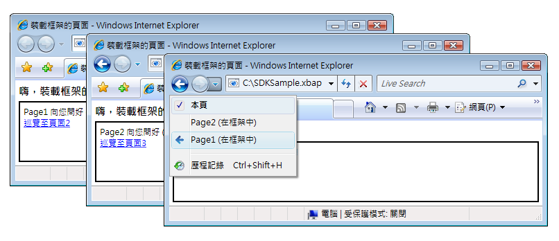  
  
 您不是只能夠在 <xref:System.Windows.Controls.Page> 內容中使用 <xref:System.Windows.Controls.Frame>。  將 <xref:System.Windows.Controls.Frame> 裝載在 <xref:System.Windows.Window> 內容中也是很常見的。  
  
 根據預設，<xref:System.Windows.Controls.Frame> 在沒有其他日誌的情況下只會使用自己的日誌。  如果 <xref:System.Windows.Controls.Frame> 是 <xref:System.Windows.Navigation.NavigationWindow> 或 [!INCLUDE[TLA2#tla_xbap](../../../../includes/tla2sharptla-xbap-md.md)] 中裝載的部分內容，<xref:System.Windows.Controls.Frame> 會使用屬於 <xref:System.Windows.Navigation.NavigationWindow> 或 [!INCLUDE[TLA2#tla_xbap](../../../../includes/tla2sharptla-xbap-md.md)] 的日誌。雖然有時候，<xref:System.Windows.Controls.Frame> 可能需要負責自己的日誌。  這樣做的一個原因，是讓日誌可以在 <xref:System.Windows.Controls.Frame> 裝載的頁面內巡覽。  這可以由下圖說明。  
  
   
  
 在這個案例中，您可以設定 <xref:System.Windows.Controls.Frame> 使用自己的日誌，方法是將 <xref:System.Windows.Controls.Frame> 的 <xref:System.Windows.Controls.Frame.JournalOwnership%2A> 屬性設定為 <xref:System.Windows.Navigation.JournalOwnership>。  顯示在下列標記中。  
  
 [!code-xml[NavigationOverviewSnippets#FrameHostPageOwnJournalXAML1](../../../../samples/snippets/csharp/VS_Snippets_Wpf/NavigationOverviewSnippets/CSharp/FrameHostPageOwnJournal.xaml#framehostpageownjournalxaml1)]  
[!code-xml[NavigationOverviewSnippets#FrameHostPageOwnJournalXAML2](../../../../samples/snippets/csharp/VS_Snippets_Wpf/NavigationOverviewSnippets/CSharp/FrameHostPageOwnJournal.xaml#framehostpageownjournalxaml2)]  
[!code-xml[NavigationOverviewSnippets#FrameHostPageOwnJournalXAML3](../../../../samples/snippets/csharp/VS_Snippets_Wpf/NavigationOverviewSnippets/CSharp/FrameHostPageOwnJournal.xaml#framehostpageownjournalxaml3)]  
  
 下圖說明在使用自己日誌的 <xref:System.Windows.Controls.Frame> 內巡覽的作用方式。  
  
 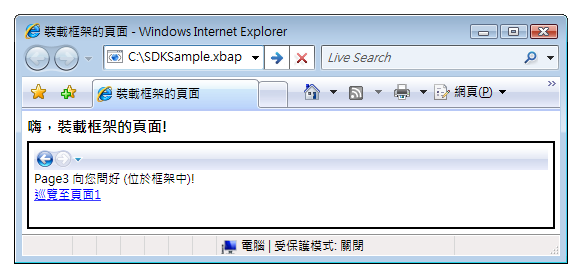  
  
 請注意，日誌項目是由 <xref:System.Windows.Controls.Frame> 中的巡覽 [!INCLUDE[TLA2#tla_ui](../../../../includes/tla2sharptla-ui-md.md)] 顯示的，而非 [!INCLUDE[TLA2#tla_ie](../../../../includes/tla2sharptla-ie-md.md)]。  
  
> [!NOTE]
>  如果 <xref:System.Windows.Controls.Frame> 是裝載在 <xref:System.Windows.Window> 中內容的一部分，<xref:System.Windows.Controls.Frame> 會使用自己的日誌，因而顯示自己的巡覽 [!INCLUDE[TLA2#tla_ui](../../../../includes/tla2sharptla-ui-md.md)]。  
  
 如果您的使用者經驗需要 <xref:System.Windows.Controls.Frame> 提供自己的日誌，而不用顯示巡覽 [!INCLUDE[TLA2#tla_ui](../../../../includes/tla2sharptla-ui-md.md)]，您可以隱藏巡覽 [!INCLUDE[TLA2#tla_ui](../../../../includes/tla2sharptla-ui-md.md)]，方法是將 <xref:System.Windows.Controls.Frame.NavigationUIVisibility%2A> 設定為 <xref:System.Windows.Visibility>。  顯示在下列標記中。  
  
 [!code-xml[NavigationOverviewSnippets#FrameHostPageHidesUIXAML1](../../../../samples/snippets/csharp/VS_Snippets_Wpf/NavigationOverviewSnippets/CSharp/FrameHostPageOwnHiddenJournal.xaml#framehostpagehidesuixaml1)]  
[!code-xml[NavigationOverviewSnippets#FrameHostPageHidesUIXAML2](../../../../samples/snippets/csharp/VS_Snippets_Wpf/NavigationOverviewSnippets/CSharp/FrameHostPageOwnHiddenJournal.xaml#framehostpagehidesuixaml2)]  
[!code-xml[NavigationOverviewSnippets#FrameHostPageHidesUIXAML3](../../../../samples/snippets/csharp/VS_Snippets_Wpf/NavigationOverviewSnippets/CSharp/FrameHostPageOwnHiddenJournal.xaml#framehostpagehidesuixaml3)]  
  
   
## 巡覽裝載  
 <xref:System.Windows.Controls.Frame> 和 <xref:System.Windows.Navigation.NavigationWindow> 是稱為巡覽裝載的類別。  「*巡覽裝載*」\(Navigation Host\) 是可以巡覽和顯示內容的類別。  為了達成這點，每個巡覽裝載會使用自己的 <xref:System.Windows.Navigation.NavigationService> 和日誌。  下圖顯示巡覽裝載的基本建構。  
  
   
  
 基本上，這樣可以讓 <xref:System.Windows.Navigation.NavigationWindow> 和 <xref:System.Windows.Controls.Frame> 提供的巡覽支援，與 [!INCLUDE[TLA2#tla_xbap](../../../../includes/tla2sharptla-xbap-md.md)] 裝載於瀏覽器中時相同。  
  
 除了使用 <xref:System.Windows.Navigation.NavigationService> 和日誌外，巡覽裝載實作的成員與 <xref:System.Windows.Navigation.NavigationService> 實作的相同。  這可以由下圖說明。  
  
 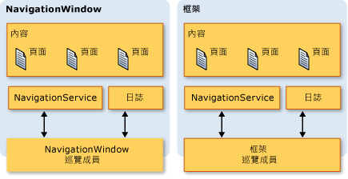  
  
 這樣可以讓您直接針對它們設計巡覽支援的程式。  如果您需要對裝載於 <xref:System.Windows.Window> 中的 <xref:System.Windows.Controls.Frame> 提供自訂巡覽 [!INCLUDE[TLA2#tla_ui](../../../../includes/tla2sharptla-ui-md.md)]，就可以考慮這點。再者，這兩種類型都實作額外的巡覽相關成員，包括 `BackStack` \(<xref:System.Windows.Navigation.NavigationWindow.BackStack%2A?displayProperty=fullName>、<xref:System.Windows.Controls.Frame.BackStack%2A?displayProperty=fullName>\) 和 `ForwardStack` \(<xref:System.Windows.Navigation.NavigationWindow.ForwardStack%2A?displayProperty=fullName>、<xref:System.Windows.Controls.Frame.ForwardStack%2A?displayProperty=fullName>\)，分別可以讓您列舉上一頁堆疊和下一頁堆疊的日誌項目。  
  
 如先前所述，應用程式內可以存在一個以上的日誌。  下圖提供發生這個情況的時機的範例。  
  
   
  
   
## 巡覽 XAML 頁面以外的內容  
 本主題前前後後已經使用 <xref:System.Windows.Controls.Page> 和封裝 [!INCLUDE[TLA2#tla_xbap#plural](../../../../includes/tla2sharptla-xbapsharpplural-md.md)]，來示範 [!INCLUDE[TLA2#tla_wpf](../../../../includes/tla2sharptla-wpf-md.md)] 的各種巡覽功能。  然而，編譯到應用程式中的 <xref:System.Windows.Controls.Page> 並不是唯一可以巡覽的內容類型，而封裝 [!INCLUDE[TLA2#tla_xbap#plural](../../../../includes/tla2sharptla-xbapsharpplural-md.md)] 也不是識別內容的唯一方式。  
  
 如本節所示範，您也可以巡覽鬆散 [!INCLUDE[TLA2#tla_xaml](../../../../includes/tla2sharptla-xaml-md.md)] 檔案、[!INCLUDE[TLA2#tla_html](../../../../includes/tla2sharptla-html-md.md)] 檔案和物件。  
  
   
### 巡覽鬆散 XAML 檔案  
 鬆散 [!INCLUDE[TLA2#tla_xaml](../../../../includes/tla2sharptla-xaml-md.md)] 檔案是具有下列特性的檔案：  
  
-   只包含 [!INCLUDE[TLA2#tla_xaml](../../../../includes/tla2sharptla-xaml-md.md)] \(也就是沒有程式碼\)。  
  
-   具有適當的命名空間宣告。  
  
-   具有 .xaml 名稱副檔名。  
  
 舉例來說，請考慮下列儲存為鬆散 [!INCLUDE[TLA2#tla_xaml](../../../../includes/tla2sharptla-xaml-md.md)] 檔案 Person.xaml 的內容。  
  
 [!code-xml[NavigationOverviewSnippets#LooseXAML](../../../../samples/snippets/csharp/VS_Snippets_Wpf/NavigationOverviewSnippets/CSharp/Person.xaml#loosexaml)]  
  
 當您按兩下檔案時，瀏覽器會開啟並進行巡覽，以顯示內容。  請參考下圖中的示範。  
  
 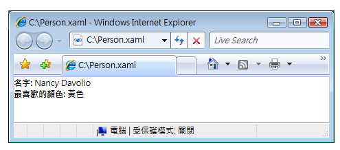  
  
 您可以顯示下列位置的鬆散 [!INCLUDE[TLA2#tla_xaml](../../../../includes/tla2sharptla-xaml-md.md)] 檔案：  
  
-   本機電腦、內部網路或網際網路上的網站。  
  
-   [!INCLUDE[TLA#tla_unc](../../../../includes/tlasharptla-unc-md.md)] 檔案共用。  
  
-   本機磁碟。  
  
 鬆散 [!INCLUDE[TLA2#tla_xaml](../../../../includes/tla2sharptla-xaml-md.md)] 檔案可以加入到瀏覽器的我的最愛中，或是加入做為瀏覽器的首頁。  
  
> [!NOTE]
>  如需發行和啟動鬆散 [!INCLUDE[TLA2#tla_xaml](../../../../includes/tla2sharptla-xaml-md.md)] 頁面的詳細資訊，請參閱[部署 WPF 應用程式](../../../../docs/framework/wpf/app-development/deploying-a-wpf-application-wpf.md)。  
  
 有關鬆散 [!INCLUDE[TLA2#tla_xaml](../../../../includes/tla2sharptla-xaml-md.md)] 方面的一個限制是，裝載的內容在部分信任下執行時必須是安全的。  舉例來說，`Window` 不能是鬆散 [!INCLUDE[TLA2#tla_xaml](../../../../includes/tla2sharptla-xaml-md.md)] 檔案的根項目。  如需詳細資訊，請參閱 [WPF 部分信任安全性](../../../../docs/framework/wpf/wpf-partial-trust-security.md)。  
  
   
### 使用框架巡覽 HTML 檔案  
 您可能會預期，您也可以巡覽 [!INCLUDE[TLA2#tla_html](../../../../includes/tla2sharptla-html-md.md)]。  您只需要提供使用 http 結構描述的 [!INCLUDE[TLA2#tla_uri](../../../../includes/tla2sharptla-uri-md.md)] 即可。  舉例來說，下列 [!INCLUDE[TLA2#tla_xaml](../../../../includes/tla2sharptla-xaml-md.md)] 顯示的 <xref:System.Windows.Controls.Frame> 會巡覽到 [!INCLUDE[TLA2#tla_html](../../../../includes/tla2sharptla-html-md.md)] 頁面。  
  
 [!code-xml[NavigationOverviewSnippets#FrameHtmlNavMARKUP](../../../../samples/snippets/csharp/VS_Snippets_Wpf/NavigationOverviewSnippets/CSharp/FrameHTMLNavPage.xaml#framehtmlnavmarkup)]  
  
 巡覽 [!INCLUDE[TLA2#tla_html](../../../../includes/tla2sharptla-html-md.md)] 需要特殊權限。  舉例來說，如果 [!INCLUDE[TLA2#tla_xbap](../../../../includes/tla2sharptla-xbap-md.md)] 是執行於網際網路區域部分信任安全性沙箱中，您就不能進行巡覽。如需詳細資訊，請參閱 [WPF 部分信任安全性](../../../../docs/framework/wpf/wpf-partial-trust-security.md)。  
  
   
### 使用 WebBrowser 控制項巡覽 HTML 檔案  
 <xref:System.Windows.Controls.WebBrowser> 控制項支援 [!INCLUDE[TLA2#tla_html](../../../../includes/tla2sharptla-html-md.md)] 文件裝載、巡覽和指令碼\/Managed 程式碼互通性。  如需 <xref:System.Windows.Controls.WebBrowser> 控制項的詳細資訊，請參閱 <xref:System.Windows.Controls.WebBrowser>。  
  
 像 <xref:System.Windows.Controls.Frame> 一樣，使用 <xref:System.Windows.Controls.WebBrowser> 巡覽 [!INCLUDE[TLA2#tla_html](../../../../includes/tla2sharptla-html-md.md)] 需要特別的使用權限。  例如，透過部分信任的應用程式，您只能巡覽至位於來源網站的 [!INCLUDE[TLA2#tla_html](../../../../includes/tla2sharptla-html-md.md)]。  如需詳細資訊，請參閱 [WPF 部分信任安全性](../../../../docs/framework/wpf/wpf-partial-trust-security.md)。  
  
   
### 巡覽自訂物件  
 如果您的資料是儲存為自訂物件，顯示該資料的一個方式是建立 <xref:System.Windows.Controls.Page>，而將其內容繫結到這些物件 \(請參閱[資料繫結概觀](../../../../docs/framework/wpf/data/data-binding-overview.md)\)。  如果您不需要建立整個頁面，而只要顯示物件，則可以改為直接巡覽物件。  
  
 請參閱下列程式碼所實作的 `Person` 類別。  
  
 [!code-csharp[NavigateToObjectSnippets#PersonClassCODE](../../../../samples/snippets/csharp/VS_Snippets_Wpf/NavigateToObjectSnippets/CSharp/Person.cs#personclasscode)]
 [!code-vb[NavigateToObjectSnippets#PersonClassCODE](../../../../samples/snippets/visualbasic/VS_Snippets_Wpf/NavigateToObjectSnippets/VisualBasic/Person.vb#personclasscode)]  
  
 若要巡覽該類別，可以呼叫 <xref:System.Windows.Navigation.NavigationWindow.Navigate%2A?displayProperty=fullName> 方法，如下列程式碼所示範。  
  
 [!code-xml[NavigateToObjectSnippets#PageThatNavsToObject1](../../../../samples/snippets/csharp/VS_Snippets_Wpf/NavigateToObjectSnippets/CSharp/HomePage.xaml#pagethatnavstoobject1)]  
[!code-xml[NavigateToObjectSnippets#PageThatNavsToObject2](../../../../samples/snippets/csharp/VS_Snippets_Wpf/NavigateToObjectSnippets/CSharp/HomePage.xaml#pagethatnavstoobject2)]  
[!code-xml[NavigateToObjectSnippets#PageThatNavsToObject3](../../../../samples/snippets/csharp/VS_Snippets_Wpf/NavigateToObjectSnippets/CSharp/HomePage.xaml#pagethatnavstoobject3)]  
  
 [!code-csharp[NavigateToObjectSnippets#PageThatNavsToObjectCODEBEHIND](../../../../samples/snippets/csharp/VS_Snippets_Wpf/NavigateToObjectSnippets/CSharp/HomePage.xaml.cs#pagethatnavstoobjectcodebehind)]
 [!code-vb[NavigateToObjectSnippets#PageThatNavsToObjectCODEBEHIND](../../../../samples/snippets/visualbasic/VS_Snippets_Wpf/NavigateToObjectSnippets/VisualBasic/HomePage.xaml.vb#pagethatnavstoobjectcodebehind)]  
  
 下圖顯示結果。  
  
 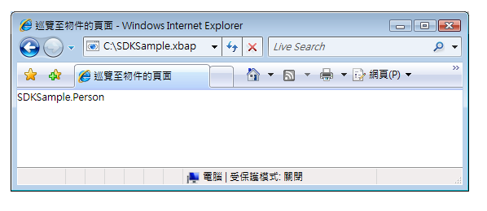  
  
 從這張圖，您看不到任何有用的項目顯示出來。  事實上，顯示的值是 \[**Person**\] 物件 `ToString` 方法的傳回值。根據預設，這是 [!INCLUDE[TLA2#tla_wpf](../../../../includes/tla2sharptla-wpf-md.md)] 可以用來表示物件的唯一值。  您可以覆寫 `ToString` 方法以傳回更多有意義的資訊，雖然這仍然僅是一個字串值。  您可以使用一個技巧來利用 [!INCLUDE[TLA2#tla_wpf](../../../../includes/tla2sharptla-wpf-md.md)] 的展示功能，就是使用資料樣板。  您可以實作 [!INCLUDE[TLA2#tla_wpf](../../../../includes/tla2sharptla-wpf-md.md)] 可以用來與特定型別物件建立關聯的資料樣板。  下列程式碼顯示 `Person` 物件的資料樣板。  
  
 [!code-xml[NavigateToObjectSnippets#DataTemplateMARKUP](../../../../samples/snippets/csharp/VS_Snippets_Wpf/NavigateToObjectSnippets/CSharp/App.xaml#datatemplatemarkup)]  
  
 這裡的資料樣板是藉由在 `DataType` 屬性中使用 `x:Type` 標記延伸，來與 `Person` 型別建立關聯。  資料樣板接著會繫結 `TextBlock` 項目 \(請參閱 <xref:System.Windows.Controls.TextBlock>\) 到 `Person` 類別的屬性。  下圖顯示 `Person` 物件的更新外觀。  
  
 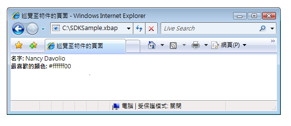  
  
 這個技巧的優點在於，因為能夠重複使用資料樣板在應用程式的任何地方一致地顯示物件，而獲得的一致性。  
  
 如需資料範本的詳細資訊，請參閱[資料範本化概觀](../../../../docs/framework/wpf/data/data-templating-overview.md)。  
  
   
## 安全性  
 [!INCLUDE[TLA2#tla_wpf](../../../../includes/tla2sharptla-wpf-md.md)] 巡覽支援可以跨網際網路巡覽 [!INCLUDE[TLA2#tla_xbap#plural](../../../../includes/tla2sharptla-xbapsharpplural-md.md)]，進而讓應用程式裝載協力廠商內容。  為了保護應用程式和使用者免於傷害性行為，[!INCLUDE[TLA2#tla_wpf](../../../../includes/tla2sharptla-wpf-md.md)] 提供各種安全性功能，相關討論位於 [安全性](../../../../docs/framework/wpf/security-wpf.md)和 [WPF 部分信任安全性](../../../../docs/framework/wpf/wpf-partial-trust-security.md)。  
  
## 請參閱  
 <xref:System.Windows.Application.SetCookie%2A>   
 <xref:System.Windows.Application.GetCookie%2A>   
 [應用程式管理概觀](../../../../docs/framework/wpf/app-development/application-management-overview.md)   
 [WPF 中的 Pack URI](../../../../docs/framework/wpf/app-development/pack-uris-in-wpf.md)   
 [結構化巡覽概觀](../../../../docs/framework/wpf/app-development/structured-navigation-overview.md)   
 [巡覽拓撲概觀](../../../../docs/framework/wpf/app-development/navigation-topologies-overview.md)   
 [HOW TO 主題](../../../../docs/framework/wpf/app-development/navigation-how-to-topics.md)   
 [部署 WPF 應用程式](../../../../docs/framework/wpf/app-development/deploying-a-wpf-application-wpf.md)