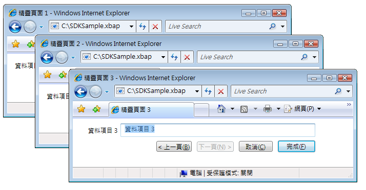
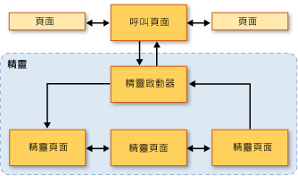
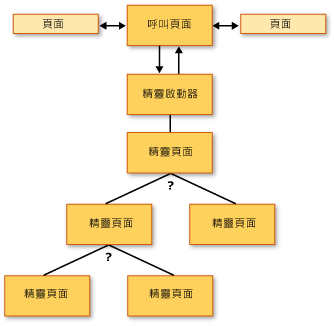
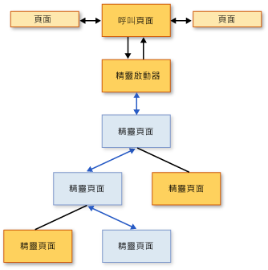
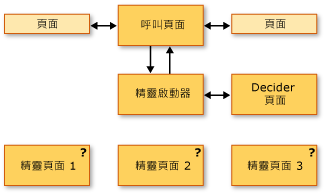
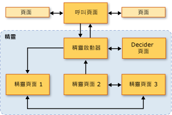

# 巡覽拓撲概觀
 本概觀介紹中瀏覽拓撲[!INCLUDE[TLA2#tla_wpf](../../../../includes/tla2sharptla-wpf-md.md)]。 並接著說明三種常見的巡覽拓撲及其範例。  
  
> [!NOTE]
>  閱讀本主題之前，您應該熟悉在結構化之導覽的概念[!INCLUDE[TLA2#tla_wpf](../../../../includes/tla2sharptla-wpf-md.md)]頁面函式的使用。 如需這兩個主題的詳細資訊，請參閱[結構化的巡覽概觀](../../../../docs/framework/wpf/app-development/structured-navigation-overview.md)。  
  
 此主題包括下列章節：  
  
-   [巡覽拓撲](#Navigation_Topologies)  
  
-   [結構化巡覽拓撲](#Structured_Navigation_Topologies)  
  
-   [透過固定線性拓撲進行巡覽](#Navigation_over_a_Fixed_Linear_Topology)  
  
-   [透過固定的階層式拓撲進行動態巡覽](#Dynamic_Navigation_over_a_Fixed_Hierarchical_Topology)  
  
-   [透過動態產生的拓撲進行巡覽](#Navigation_over_a_Dynamically_Generated_Topology)  
  
   
## 巡覽拓撲  
 在[!INCLUDE[TLA2#tla_wpf](../../../../includes/tla2sharptla-wpf-md.md)]，瀏覽通常包含的頁數 (<xref:System.Windows.Controls.Page>) 的超連結 (<xref:System.Windows.Documents.Hyperlink>)，瀏覽至其他頁面，按下時。 瀏覽至的頁面所識別的[!INCLUDE[TLA#tla_uri#plural](../../../../includes/tlasharptla-urisharpplural-md.md)](請參閱[WPF 中的組件 Uri](../../../../docs/framework/wpf/app-development/pack-uris-in-wpf.md))。 請考慮下列簡單的範例，其中顯示超連結的網頁和[!INCLUDE[TLA#tla_uri#plural](../../../../includes/tlasharptla-urisharpplural-md.md)]:  
  
 [!code-xaml[NavigationTopologiesOverviewSnippets#Page1](../../../../samples/snippets/csharp/VS_Snippets_Wpf/NavigationTopologiesOverviewSnippets/CS/Page1.xaml#page1)]  
  
 [!code-xaml[NavigationTopologiesOverviewSnippets#Page2](../../../../samples/snippets/csharp/VS_Snippets_Wpf/NavigationTopologiesOverviewSnippets/CS/Page2.xaml#page2)]  
  
 這些頁面會排列在*瀏覽拓撲*其結構取決於如何您在頁面之間巡覽。 這種特定巡覽拓撲適合簡單的案例，不過巡覽可能需要更複雜的拓撲，其中有些只能在應用程式執行時定義。  
  
 本主題涵蓋三種常見的巡覽拓撲：*固定線性*，*固定階層式*，和*動態產生*。 以具有範例示範每個瀏覽拓撲[!INCLUDE[TLA2#tla_ui](../../../../includes/tla2sharptla-ui-md.md)]類似下圖所示：  
  
   
  
   
## 結構化巡覽拓撲  
 巡覽拓撲有下列兩種廣泛的類型：  
  
-   **固定拓撲**：在編譯時期定義，且不會在執行階段變更。 固定拓撲適用於以線性或階層式順序的固定順序來瀏覽頁面。  
  
-   **動態拓撲**：根據從使用者、應用程式，或系統收集而得的輸入，在執行階段定義。 如果要以不同的順序瀏覽頁面，動態拓撲就十分實用。  
  
 雖然您可以使用頁面來建立巡覽拓撲，但本範例會使用頁面函式來提供額外的支援，藉此簡化透過拓撲頁面傳遞和傳回資料的支援。  
  
   
## 透過固定線性拓撲進行巡覽  
 固定線性拓撲類似於含有一個或多個精靈頁面，並以固定順序巡覽的精靈結構。 下圖顯示具有固定線性拓撲的精靈的高階結構與流程。  
  
   
  
 透過固定線性拓撲進行巡覽的一般行為包括以下：  
  
-   從呼叫頁面巡覽至啟動器頁面，其可初始化精靈，並巡覽至精靈的第一頁。 啟動器頁面 ( [!INCLUDE[TLA2#tla_ui](../../../../includes/tla2sharptla-ui-md.md)]-小於<xref:System.Windows.Navigation.PageFunction%601>) 不是必要項目，因為呼叫頁面可以直接呼叫第一個精靈頁面。 不過，如果精靈的初始化作業特別複雜，則可以使用啟動程式頁面來簡化這項作業。  
  
-   使用者可以利用 [向後] 和 [向前] 按鈕 (或超連結)，在頁面之間巡覽。  
  
-   使用者可以利用日誌，在頁面之間巡覽。  
  
-   使用者可以按 [取消] 按鈕，取消任何精靈頁面中的精靈。  
  
-   使用者可以按 [結束] 按鈕，接受最後一個精靈頁面中的精靈。  
  
-   如果取消精靈，精靈會傳回適當的結果，但不會傳回任何資料。  
  
-   如果使用者接受精靈，精靈會傳回適當的結果，並傳回它所收集的資料。  
  
-   完成精靈時 (已接受或取消)，即會從日誌中移除精靈所含的頁面。 這可將精靈的每個執行個體隔離，以避免潛在的資料或狀態異常。  
  
   
## 透過固定的階層式拓撲進行動態巡覽  
 在某些應用程式中，頁面可以巡覽至兩個以上的其他頁面，如下圖所示。  
  
   
  
 這個結構稱為固定的階層式拓撲，而周遊階層的順序通常是在執行階段由應用程式或使用者決定。 階層中每個可巡覽至兩個以上其他頁面的頁面，皆會在執行階段收集必要資料以判斷可巡覽至哪些頁面。 下圖擇一說明上圖可能的巡覽順序。  
  
   
  
 雖然固定階層式結構中的頁面巡覽順序是在執行階段決定，但使用者體驗仍和固定線性拓撲的使用者體驗相同：  
  
-   從呼叫頁面巡覽至啟動器頁面，其可初始化精靈，並巡覽至精靈的第一頁。 啟動器頁面 ( [!INCLUDE[TLA2#tla_ui](../../../../includes/tla2sharptla-ui-md.md)]-小於<xref:System.Windows.Navigation.PageFunction%601>) 不是必要項目，因為呼叫頁面可以直接呼叫第一個精靈頁面。 不過，如果精靈的初始化作業特別複雜，則可以使用啟動程式頁面來簡化這項作業。  
  
-   使用者可以利用 [向後] 和 [向前] 按鈕 (或超連結)，在頁面之間巡覽。  
  
-   使用者可以利用日誌，在頁面之間巡覽。  
  
-   如果使用者向後巡覽日誌，即可變更巡覽順序。  
  
-   使用者可以按 [取消] 按鈕，取消任何精靈頁面中的精靈。  
  
-   使用者可以按 [結束] 按鈕，接受最後一個精靈頁面中的精靈。  
  
-   如果取消精靈，精靈會傳回適當的結果，但不會傳回任何資料。  
  
-   如果使用者接受精靈，精靈會傳回適當的結果，並傳回它所收集的資料。  
  
-   完成精靈時 (已接受或取消)，即會從日誌中移除精靈所含的頁面。 這可將精靈的每個執行個體隔離，以避免潛在的資料或狀態異常。  
  
   
## 透過動態產生的拓撲進行巡覽  
 在某些應用程式中，兩個以上頁面的巡覽順序只能在執行階段由使用者、應用程式或外部資料決定。 下圖說明尚未決定巡覽順序的一組頁面。  
  
   
  
 下圖說明已在執行階段由使用者選擇的巡覽順序。  
  
   
  
 巡覽順序也稱為動態產生的拓撲。 對使用者來說，即使使用另一種巡覽拓撲，其使用者體驗和上一個拓撲是一樣的：  
  
-   從呼叫頁面巡覽至啟動器頁面，其可初始化精靈，並巡覽至精靈的第一頁。 啟動器頁面 ( [!INCLUDE[TLA2#tla_ui](../../../../includes/tla2sharptla-ui-md.md)]-小於<xref:System.Windows.Navigation.PageFunction%601>) 不是必要項目，因為呼叫頁面可以直接呼叫第一個精靈頁面。 不過，如果精靈的初始化作業特別複雜，則可以使用啟動程式頁面來簡化這項作業。  
  
-   使用者可以利用 [向後] 和 [向前] 按鈕 (或超連結)，在頁面之間巡覽。  
  
-   使用者可以利用日誌，在頁面之間巡覽。  
  
-   使用者可以按 [取消] 按鈕，取消任何精靈頁面中的精靈。  
  
-   使用者可以按 [結束] 按鈕，接受最後一個精靈頁面中的精靈。  
  
-   如果取消精靈，精靈會傳回適當的結果，但不會傳回任何資料。  
  
-   如果使用者接受精靈，精靈會傳回適當的結果，並傳回它所收集的資料。  
  
-   完成精靈時 (已接受或取消)，即會從日誌中移除精靈所含的頁面。 這可將精靈的每個執行個體隔離，以避免潛在的資料或狀態異常。  
  
## 另請參閱  
 <xref:System.Windows.Controls.Page>  
 <xref:System.Windows.Navigation.PageFunction%601>  
 <xref:System.Windows.Navigation.NavigationService>  
 [結構化巡覽概觀](../../../../docs/framework/wpf/app-development/structured-navigation-overview.md)
