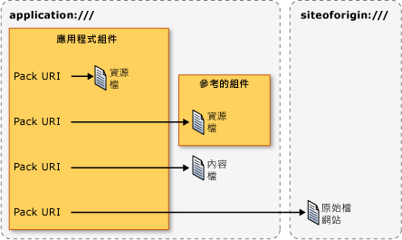

# <a name="pack-uris-in-wpf"></a>WPF 中的 Pack URI
在 Windows Presentation Foundation (WPF) 中，[!INCLUDE[TLA#tla_uri#plural](../../../../includes/tlasharptla-urisharpplural-md.md)]用來識別和載入檔案，在許多方面，包括下列：  
  
-   指定[!INCLUDE[TLA#tla_ui](../../../../includes/tlasharptla-ui-md.md)]以顯示應用程式第一次啟動時。  
  
-   載入影像。  
  
-   巡覽至頁面。  
  
-   載入不可執行的資料檔案。  
  
 此外，[!INCLUDE[TLA2#tla_uri#plural](../../../../includes/tla2sharptla-urisharpplural-md.md)]可用來識別和載入檔案，從各種不同的位置，包括下列：  
  
-   目前的組件。  
  
-   所參考的組件。  
  
-   與組件相對的位置。  
  
-   應用程式的來源網站。  
  
 若要提供一致的機制來識別並從這些位置載入這些類型的檔案[!INCLUDE[TLA2#tla_wpf](../../../../includes/tla2sharptla-wpf-md.md)]運用的擴充性*pack URI 配置*。 本主題提供配置的概觀，說明如何建構套件[!INCLUDE[TLA2#tla_uri#plural](../../../../includes/tla2sharptla-urisharpplural-md.md)]各種案例中，討論 absolute 和 relative[!INCLUDE[TLA2#tla_uri#plural](../../../../includes/tla2sharptla-urisharpplural-md.md)]並[!INCLUDE[TLA2#tla_uri](../../../../includes/tla2sharptla-uri-md.md)]解析度，顯示如何使用組件之前[!INCLUDE[TLA2#tla_uri#plural](../../../../includes/tla2sharptla-urisharpplural-md.md)]從這兩個標記與程式碼。  
  
  
<a name="The_Pack_URI_Scheme"></a>   
## <a name="the-pack-uri-scheme"></a>套件 URI 配置  
 組件[!INCLUDE[TLA2#tla_uri](../../../../includes/tla2sharptla-uri-md.md)]配置由[Open Packaging Conventions](https://go.microsoft.com/fwlink/?LinkID=71255) (OPC) 規格，描述來組織及識別內容的模型。 此模型中的索引鍵的項目是套件和組件，其中*封裝*是一個邏輯容器，其中一個或多個邏輯*組件*。 下圖說明這個概念。  
  
   
  
 若要識別組件，OPC 規格會利用的擴充性 RFC 2396 (統一資源識別元 (URI):泛型語法） 來定義套件[!INCLUDE[TLA2#tla_uri](../../../../includes/tla2sharptla-uri-md.md)]配置。  
  
 所指定的配置[!INCLUDE[TLA2#tla_uri](../../../../includes/tla2sharptla-uri-md.md)]由它的前置詞; 定義 http、 ftp 和 file 是已知範例。 組件[!INCLUDE[TLA2#tla_uri](../../../../includes/tla2sharptla-uri-md.md)]配置使用"pack"作為其配置，並包含兩個元件： 授權和路徑。 以下是組件的格式[!INCLUDE[TLA2#tla_uri](../../../../includes/tla2sharptla-uri-md.md)]。  
  
 pack://*authority*/*path*
  
 *授權單位*指定類型的封裝，包含組件，而*路徑*指定在封裝內某個組件的位置。  
  
 下圖說明這個概念︰  
  
   
  
 套件和組件與應用程式和檔案類似，其中應用程式 (套件) 可以包括一或多個檔案 (組件)，包括︰  
  
-   編譯為本機組件的資源檔。  
  
-   編譯為所參考組件的資源檔。  
  
-   編譯為參考組件的資源檔。  
  
-   內容檔。  
  
-   來源網站檔案。  
  
 若要存取這些類型的檔案，[!INCLUDE[TLA2#tla_wpf](../../../../includes/tla2sharptla-wpf-md.md)]支援兩種授權： 應用程式: / / 和 siteoforigin:///: / /。 application:/// 授權識別在編譯時期已知的應用程式資料檔，包括資源檔和內容檔。 siteoforigin:/// 授權識別來源網站檔案。 下圖顯示每個授權的範圍。  
  
   
  
> [!NOTE]
>  組件的授權元件[!INCLUDE[TLA2#tla_uri](../../../../includes/tla2sharptla-uri-md.md)]是內嵌[!INCLUDE[TLA2#tla_uri](../../../../includes/tla2sharptla-uri-md.md)]，指向封裝，而且必須符合 RFC 2396。 此外，"/" 字元必須取代為 "," 字元，而且必須逸出 "%" 和 "?" 這類保留字元。 如需詳細資料，請參閱 OPC。  
  
 下列各節說明如何建構套件[!INCLUDE[TLA2#tla_uri#plural](../../../../includes/tla2sharptla-urisharpplural-md.md)]搭配適當的路徑中使用這兩個授權，用來識別資源、 內容和來源網站檔案。  
  
<a name="Resource_File_Pack_URIs___Local_Assembly"></a>   
## <a name="resource-file-pack-uris"></a>資源檔套件 URI  
 資源檔會設定為[!INCLUDE[TLA2#tla_msbuild](../../../../includes/tla2sharptla-msbuild-md.md)]`Resource`項目，並編譯成組件。 [!INCLUDE[TLA2#tla_wpf](../../../../includes/tla2sharptla-wpf-md.md)] 支援的組件建構[!INCLUDE[TLA2#tla_uri#plural](../../../../includes/tla2sharptla-urisharpplural-md.md)]，可用來識別資源檔編譯為本機組件或編譯成組件參考的本機組件。  
  
<a name="Local_Assembly_Resource_File"></a>   
### <a name="local-assembly-resource-file"></a>本機組件資源檔  
 組件[!INCLUDE[TLA2#tla_uri](../../../../includes/tla2sharptla-uri-md.md)]資源檔編譯為本機組件會使用下列授權和路徑：  
  
-   **授權**：application:///。  
  
-   **路徑**:資源檔，包括其相對於本機組件專案資料夾根的路徑名稱。  
  
 下列範例示範此組件[!INCLUDE[TLA2#tla_uri](../../../../includes/tla2sharptla-uri-md.md)]針對[!INCLUDE[TLA2#tla_xaml](../../../../includes/tla2sharptla-xaml-md.md)]位於本機組件專案資料夾的根目錄中的資源檔。  
  
 `pack://application:,,,/ResourceFile.xaml`  
  
 下列範例示範此組件[!INCLUDE[TLA2#tla_uri](../../../../includes/tla2sharptla-uri-md.md)]針對[!INCLUDE[TLA2#tla_xaml](../../../../includes/tla2sharptla-xaml-md.md)]位於本機組件專案資料夾的子資料夾中的資源檔。  
  
 `pack://application:,,,/Subfolder/ResourceFile.xaml`  
  
<a name="Resource_File_Pack_URIs___Referenced_Assembly"></a>   
### <a name="referenced-assembly-resource-file"></a>所參考的組件資源檔  
 組件[!INCLUDE[TLA2#tla_uri](../../../../includes/tla2sharptla-uri-md.md)]資源檔編譯為參考的組件會使用下列授權和路徑：  
  
-   **授權**：application:///。  
  
-   **路徑**:資源檔編譯為參考的組件的名稱。 路徑必須符合下列格式：  
  
     *AssemblyShortName*{*;Version*]{*;PublicKey*];component/*Path*  
  
    -   **AssemblyShortName**：所參考組件的簡短名稱。  
  
    -   **;Version** [選擇性]：包含資源檔之參考組件的版本。 這是在載入具有相同簡短名稱的兩個以上參考組件時使用。  
  
    -   **;PublicKey** [選擇性]：用來簽署參考組件的公開金鑰。 這是在載入具有相同簡短名稱的兩個以上參考組件時使用。  
  
    -   **;component**︰指定從本機組件參考所參考的組件。  
  
    -   **/Path**︰相對於所參考組件專案資料夾根之資源檔的名稱，包括其路徑。  
  
 下列範例示範此組件[!INCLUDE[TLA2#tla_uri](../../../../includes/tla2sharptla-uri-md.md)]針對[!INCLUDE[TLA2#tla_xaml](../../../../includes/tla2sharptla-xaml-md.md)]位於參考組件的專案資料夾的根目錄中的資源檔。  
  
 `pack://application:,,,/ReferencedAssembly;component/ResourceFile.xaml`  
  
 下列範例示範此組件[!INCLUDE[TLA2#tla_uri](../../../../includes/tla2sharptla-uri-md.md)]針對[!INCLUDE[TLA2#tla_xaml](../../../../includes/tla2sharptla-xaml-md.md)]位於參考組件的專案資料夾的子資料夾中的資源檔。  
  
 `pack://application:,,,/ReferencedAssembly;component/Subfolder/ResourceFile.xaml`  
  
 下列範例示範此組件[!INCLUDE[TLA2#tla_uri](../../../../includes/tla2sharptla-uri-md.md)]針對[!INCLUDE[TLA2#tla_xaml](../../../../includes/tla2sharptla-xaml-md.md)]位於根資料夾的參考、 版本特定組件的專案資料夾中的資源檔。  
  
 `pack://application:,,,/ReferencedAssembly;v1.0.0.1;component/ResourceFile.xaml`  
  
 請注意，此組件[!INCLUDE[TLA2#tla_uri](../../../../includes/tla2sharptla-uri-md.md)]參考的組件資源檔的語法只能搭配應用程式: / / 授權單位。 例如，下列不支援[!INCLUDE[TLA2#tla_wpf](../../../../includes/tla2sharptla-wpf-md.md)]。  
  
 `pack://siteoforigin:,,,/SomeAssembly;component/ResourceFile.xaml`  
  
<a name="Content_File_Pack_URIs"></a>   
## <a name="content-file-pack-uris"></a>內容檔套件 URI  
 組件[!INCLUDE[TLA2#tla_uri](../../../../includes/tla2sharptla-uri-md.md)]內容檔案會使用下列授權和路徑：  
  
-   **授權**：application:///。  
  
-   **路徑**:內容檔，包括其相對於應用程式的主要可執行組件的檔案系統位置的路徑名稱。  
  
 下列範例示範此組件[!INCLUDE[TLA2#tla_uri](../../../../includes/tla2sharptla-uri-md.md)]針對[!INCLUDE[TLA2#tla_xaml](../../../../includes/tla2sharptla-xaml-md.md)]位於與可執行組件相同的資料夾中的內容檔案。  
  
 `pack://application:,,,/ContentFile.xaml`  
  
 下列範例示範此組件[!INCLUDE[TLA2#tla_uri](../../../../includes/tla2sharptla-uri-md.md)]針對[!INCLUDE[TLA2#tla_xaml](../../../../includes/tla2sharptla-xaml-md.md)]位於相對於應用程式的可執行組件的子資料夾的內容檔案。  
  
 `pack://application:,,,/Subfolder/ContentFile.xaml`  
  
> [!NOTE]
>  無法巡覽至 [!INCLUDE[TLA2#tla_html](../../../../includes/tla2sharptla-html-md.md)] 內容檔。 [!INCLUDE[TLA2#tla_uri](../../../../includes/tla2sharptla-uri-md.md)]配置只支援巡覽至[!INCLUDE[TLA2#tla_html](../../../../includes/tla2sharptla-html-md.md)]位於來源網站上的檔案。  
  
<a name="The_siteoforigin_____Authority"></a>   
## <a name="site-of-origin-pack-uris"></a>來源網站套件 URI  
 組件[!INCLUDE[TLA2#tla_uri](../../../../includes/tla2sharptla-uri-md.md)]的來源站台的檔案會使用下列授權和路徑：  
  
-   **授權**：siteoforigin:///。  
  
-   **路徑**:站台的來源檔案，包括其相對於從中啟動可執行組件位置的路徑名稱。  
  
 下列範例示範此組件[!INCLUDE[TLA2#tla_uri](../../../../includes/tla2sharptla-uri-md.md)]針對[!INCLUDE[TLA2#tla_xaml](../../../../includes/tla2sharptla-xaml-md.md)]來源網站檔，儲存在從中啟動可執行組件的位置。  
  
 `pack://siteoforigin:,,,/SiteOfOriginFile.xaml`  
  
 下列範例示範此組件[!INCLUDE[TLA2#tla_uri](../../../../includes/tla2sharptla-uri-md.md)]針對[!INCLUDE[TLA2#tla_xaml](../../../../includes/tla2sharptla-xaml-md.md)]來源網站檔，儲存在相對於從中啟動應用程式的可執行組件位置的子資料夾中。  
  
 `pack://siteoforigin:,,,/Subfolder/SiteOfOriginFile.xaml`  
  
<a name="Page_Files"></a>   
## <a name="page-files"></a>分頁檔  
 [!INCLUDE[TLA2#tla_xaml](../../../../includes/tla2sharptla-xaml-md.md)] 設定為的檔案[!INCLUDE[TLA2#tla_msbuild](../../../../includes/tla2sharptla-msbuild-md.md)]`Page`項目時，會編譯成組件上，做為資源檔相同的方式。 因此， [!INCLUDE[TLA2#tla_msbuild](../../../../includes/tla2sharptla-msbuild-md.md)] `Page`項目可以使用組件識別[!INCLUDE[TLA2#tla_uri#plural](../../../../includes/tla2sharptla-urisharpplural-md.md)]資源檔。  
  
 型別[!INCLUDE[TLA2#tla_xaml](../../../../includes/tla2sharptla-xaml-md.md)]通常會設定為的檔案[!INCLUDE[TLA2#tla_msbuild](../../../../includes/tla2sharptla-msbuild-md.md)]`Page`項目具有下列作為其根項目其中之一：  
  
-   <xref:System.Windows.Window?displayProperty=nameWithType>  
  
-   <xref:System.Windows.Controls.Page?displayProperty=nameWithType>  
  
-   <xref:System.Windows.Navigation.PageFunction%601?displayProperty=nameWithType>  
  
-   <xref:System.Windows.ResourceDictionary?displayProperty=nameWithType>  
  
-   <xref:System.Windows.Documents.FlowDocument?displayProperty=nameWithType>  
  
-   <xref:System.Windows.Controls.UserControl?displayProperty=nameWithType>  
  
<a name="Absolute_vs_Relative_Pack_URIs"></a>   
## <a name="absolute-vs-relative-pack-uris"></a>絕對與相對套件 URI  
 完整的組件[!INCLUDE[TLA2#tla_uri](../../../../includes/tla2sharptla-uri-md.md)]包含配置、 授權和路徑，而且它會視為絕對套件[!INCLUDE[TLA2#tla_uri](../../../../includes/tla2sharptla-uri-md.md)]。 為開發人員簡化[!INCLUDE[TLA2#tla_xaml](../../../../includes/tla2sharptla-xaml-md.md)]項目通常可讓您設定適當的屬性，使用相對套件[!INCLUDE[TLA2#tla_uri](../../../../includes/tla2sharptla-uri-md.md)]，這只包括路徑。  
  
 例如，請考慮下列絕對套件[!INCLUDE[TLA2#tla_uri](../../../../includes/tla2sharptla-uri-md.md)]的本機組件中的資源檔。  
  
 `pack://application:,,,/ResourceFile.xaml`  
  
 相對套件[!INCLUDE[TLA2#tla_uri](../../../../includes/tla2sharptla-uri-md.md)]參考這個資源檔會是如下所示。  
  
 `/ResourceFile.xaml`  
  
> [!NOTE]
>  因為來源網站檔不是組件相關聯的只會參考它們使用絕對套件[!INCLUDE[TLA2#tla_uri#plural](../../../../includes/tla2sharptla-urisharpplural-md.md)]。  
  
 根據預設，相對套件[!INCLUDE[TLA2#tla_uri](../../../../includes/tla2sharptla-uri-md.md)]會被視為相對於包含參考的程式碼之標記的位置。 如果使用前置反斜線，不過，相對套件[!INCLUDE[TLA2#tla_uri](../../../../includes/tla2sharptla-uri-md.md)]參考則視為相對於應用程式的根目錄。 例如，請考慮下列專案結構。  
  
 `App.xaml`  
  
 `Page2.xaml`  
  
 `\SubFolder`  
  
 `+ Page1.xaml`  
  
 `+ Page2.xaml`  
  
 如果 Page1.xaml 包含[!INCLUDE[TLA2#tla_uri](../../../../includes/tla2sharptla-uri-md.md)]參考*根*\SubFolder\Page2.xaml，該參考可以使用下列相對套件[!INCLUDE[TLA2#tla_uri](../../../../includes/tla2sharptla-uri-md.md)]。  
  
 `Page2.xaml`  
  
 如果 Page1.xaml 包含[!INCLUDE[TLA2#tla_uri](../../../../includes/tla2sharptla-uri-md.md)]參考*根*\Page2.xaml，該參考可以使用下列相對套件[!INCLUDE[TLA2#tla_uri](../../../../includes/tla2sharptla-uri-md.md)]。  
  
 `/Page2.xaml`  
  
<a name="Pack_URI_Resolution"></a>   
## <a name="pack-uri-resolution"></a>套件 URI 解析  
 組件的格式[!INCLUDE[TLA2#tla_uri#plural](../../../../includes/tla2sharptla-urisharpplural-md.md)]可讓組件[!INCLUDE[TLA2#tla_uri#plural](../../../../includes/tla2sharptla-urisharpplural-md.md)]不同類型的檔案看起來都相同。 例如，請考慮下列絕對套件[!INCLUDE[TLA2#tla_uri](../../../../includes/tla2sharptla-uri-md.md)]。  
  
 `pack://application:,,,/ResourceOrContentFile.xaml`  
  
 這個絕對套件[!INCLUDE[TLA2#tla_uri](../../../../includes/tla2sharptla-uri-md.md)]無法參考本機組件中的任一個的資源檔或內容檔案。 這也適用於下列相對[!INCLUDE[TLA2#tla_uri](../../../../includes/tla2sharptla-uri-md.md)]。  
  
 `/ResourceOrContentFile.xaml`  
  
 若要判斷的檔案類型的組件[!INCLUDE[TLA2#tla_uri](../../../../includes/tla2sharptla-uri-md.md)]指的是，[!INCLUDE[TLA2#tla_wpf](../../../../includes/tla2sharptla-wpf-md.md)]解析[!INCLUDE[TLA2#tla_uri#plural](../../../../includes/tla2sharptla-urisharpplural-md.md)]本機的組件和內容的檔案，使用下列啟發學習法中的資源檔：  
  
1.  探查組件中繼資料，如<xref:System.Windows.Resources.AssemblyAssociatedContentFileAttribute>屬性符合套件[!INCLUDE[TLA2#tla_uri](../../../../includes/tla2sharptla-uri-md.md)]。  
  
2.  如果<xref:System.Windows.Resources.AssemblyAssociatedContentFileAttribute>發現屬性時，組件的路徑[!INCLUDE[TLA2#tla_uri](../../../../includes/tla2sharptla-uri-md.md)]所參考的內容檔案。  
  
3.  如果<xref:System.Windows.Resources.AssemblyAssociatedContentFileAttribute>找不到屬性、 探查設定資源檔編譯為本機組件。  
  
4.  如果符合的組件路徑的資源檔[!INCLUDE[TLA2#tla_uri](../../../../includes/tla2sharptla-uri-md.md)]找到，則組件的路徑[!INCLUDE[TLA2#tla_uri](../../../../includes/tla2sharptla-uri-md.md)]參考資源檔。  
  
5.  如果找不到時，在內部建立<xref:System.Uri>無效。  
  
 [!INCLUDE[TLA2#tla_uri](../../../../includes/tla2sharptla-uri-md.md)] 解析不適用於[!INCLUDE[TLA2#tla_uri#plural](../../../../includes/tla2sharptla-urisharpplural-md.md)]，請參考下列：  
  
-   參考的組件中的內容檔： 這些檔案類型不支援[!INCLUDE[TLA2#tla_wpf](../../../../includes/tla2sharptla-wpf-md.md)]。  
  
-   參考組件中的內嵌檔案：[!INCLUDE[TLA2#tla_uri#plural](../../../../includes/tla2sharptla-urisharpplural-md.md)]可識別它們是唯一的因為它們包含參考的組件名稱和`;component`後置詞。  
  
-   來源網站檔案：[!INCLUDE[TLA2#tla_uri#plural](../../../../includes/tla2sharptla-urisharpplural-md.md)]可識別它們是唯一的因為它們是由組件的唯一檔案[!INCLUDE[TLA2#tla_uri#plural](../../../../includes/tla2sharptla-urisharpplural-md.md)]包含 siteoforigin:///: / / 授權單位。  
  
 組件的一個簡化[!INCLUDE[TLA2#tla_uri](../../../../includes/tla2sharptla-uri-md.md)]解析可讓您允許適用於程式碼是無關的資源和內容檔的位置。 例如，如果您有會重新設定為內容檔，將組件的本機組件中的資源檔[!INCLUDE[TLA2#tla_uri](../../../../includes/tla2sharptla-uri-md.md)]的資源保持不變，如同使用組件的程式碼[!INCLUDE[TLA2#tla_uri](../../../../includes/tla2sharptla-uri-md.md)]。  
  
<a name="Programming_with_Pack_URIs"></a>   
## <a name="programming-with-pack-uris"></a>使用套件 URI 的程式設計  
 許多[!INCLUDE[TLA2#tla_wpf](../../../../includes/tla2sharptla-wpf-md.md)]類別會實作可以使用組件設定的屬性[!INCLUDE[TLA2#tla_uri#plural](../../../../includes/tla2sharptla-urisharpplural-md.md)]，包括：  
  
-   <xref:System.Windows.Application.StartupUri%2A?displayProperty=nameWithType>  
  
-   <xref:System.Windows.Controls.Frame.Source%2A?displayProperty=nameWithType>  
  
-   <xref:System.Windows.Navigation.NavigationWindow.Source%2A?displayProperty=nameWithType>  
  
-   <xref:System.Windows.Documents.Hyperlink.NavigateUri%2A?displayProperty=nameWithType>  
  
-   <xref:System.Windows.Window.Icon%2A?displayProperty=nameWithType>  
  
-   <xref:System.Windows.Controls.Image.Source%2A?displayProperty=nameWithType>  
  
 可以透過標記和程式碼來設定這些屬性。 本節示範兩者的基本建構，並顯示常見案例的範例。  
  
<a name="Using_Pack_URIs_in_Markup"></a>   
### <a name="using-pack-uris-in-markup"></a>透過標記使用套件 URI  
 組件[!INCLUDE[TLA2#tla_uri](../../../../includes/tla2sharptla-uri-md.md)]標記中設定具有組件之屬性的項目，來指定[!INCLUDE[TLA2#tla_uri](../../../../includes/tla2sharptla-uri-md.md)]。 例如:   
  
 `<element attribute="pack://application:,,,/File.xaml" />`  
  
 表 1 說明的各種絕對套件[!INCLUDE[TLA2#tla_uri#plural](../../../../includes/tla2sharptla-urisharpplural-md.md)]，您可以指定在標記中。  
  
 表 1:標記的絕對套件 Uri  
  
|檔案|絕對套件 [!INCLUDE[TLA2#tla_uri](../../../../includes/tla2sharptla-uri-md.md)]|  
|----------|-------------------------------------------------------------------------------------------------------------------------|  
|資源檔 - 本機組件|`"pack://application:,,,/ResourceFile.xaml"`|  
|子資料夾中的資源檔 - 本機組件|`"pack://application:,,,/Subfolder/ResourceFile.xaml"`|  
|資源檔 - 參考組件|`"pack://application:,,,/ReferencedAssembly;component/ResourceFile.xaml"`|  
|參考組件之子資料夾中的資源檔|`"pack://application:,,,/ReferencedAssembly;component/Subfolder/ResourceFile.xaml"`|  
|版本化參考組件中的資源檔|`"pack://application:,,,/ReferencedAssembly;v1.0.0.0;component/ResourceFile.xaml"`|  
|內容檔|`"pack://application:,,,/ContentFile.xaml"`|  
|子資料夾中的內容檔|`"pack://application:,,,/Subfolder/ContentFile.xaml"`|  
|來源網站檔案|`"pack://siteoforigin:,,,/SOOFile.xaml"`|  
|子資料夾中的來源網站檔案|`"pack://siteoforigin:,,,/Subfolder/SOOFile.xaml"`|  
  
 表 2 說明的各種相對套件[!INCLUDE[TLA2#tla_uri#plural](../../../../includes/tla2sharptla-urisharpplural-md.md)]，您可以指定在標記中。  
  
 表 2:在標記中的相對套件 Uri  
  
|檔案|相對套件 [!INCLUDE[TLA2#tla_uri](../../../../includes/tla2sharptla-uri-md.md)]|  
|----------|-------------------------------------------------------------------------------------------------------------------------|  
|本機組件中的資源檔|`"/ResourceFile.xaml"`|  
|本機組件子資料夾中的資源檔|`"/Subfolder/ResourceFile.xaml"`|  
|參考組件中的資源檔|`"/ReferencedAssembly;component/ResourceFile.xaml"`|  
|參考組件之子資料夾中的資源檔|`"/ReferencedAssembly;component/Subfolder/ResourceFile.xaml"`|  
|內容檔|`"/ContentFile.xaml"`|  
|子資料夾中的內容檔|`"/Subfolder/ContentFile.xaml"`|  
  
<a name="Using_Pack_URIs_in_Code"></a>   
### <a name="using-pack-uris-in-code"></a>透過程式碼使用套件 URI  
 指定的組件[!INCLUDE[TLA2#tla_uri](../../../../includes/tla2sharptla-uri-md.md)]具現化的程式碼中<xref:System.Uri>類別，並傳遞此組件[!INCLUDE[TLA2#tla_uri](../../../../includes/tla2sharptla-uri-md.md)]做為建構函式的參數。 這點在下列範例中示範。  
  
```csharp  
Uri uri = new Uri("pack://application:,,,/File.xaml");  
```  
  
 根據預設，<xref:System.Uri>類別會將套件[!INCLUDE[TLA2#tla_uri#plural](../../../../includes/tla2sharptla-urisharpplural-md.md)]為絕對。 執行個體時，因此，引發例外狀況<xref:System.Uri>類別建立相對 pack [!INCLUDE[TLA2#tla_uri](../../../../includes/tla2sharptla-uri-md.md)]。  
  
```csharp  
Uri uri = new Uri("/File.xaml");  
```  
  
 幸好<xref:System.Uri.%23ctor%28System.String%2CSystem.UriKind%29>多載<xref:System.Uri>類別建構函式接受類型參數的<xref:System.UriKind>可讓您指定是否為組件[!INCLUDE[TLA2#tla_uri](../../../../includes/tla2sharptla-uri-md.md)]是絕對或相對。  
  
```csharp  
// Absolute URI (default)  
Uri absoluteUri = new Uri("pack://application:,,,/File.xaml", UriKind.Absolute);  
// Relative URI  
Uri relativeUri = new Uri("/File.xaml",   
                        UriKind.Relative);  
```  
  
 您應該只指定<xref:System.UriKind.Absolute>或<xref:System.UriKind.Relative>會確定所提供的套件[!INCLUDE[TLA2#tla_uri](../../../../includes/tla2sharptla-uri-md.md)]是其中一種。 如果您不知道組件的型別[!INCLUDE[TLA2#tla_uri](../../../../includes/tla2sharptla-uri-md.md)]，使用，例如當使用者輸入組件[!INCLUDE[TLA2#tla_uri](../../../../includes/tla2sharptla-uri-md.md)]在執行階段，使用<xref:System.UriKind.RelativeOrAbsolute>改。  
  
```csharp  
// Relative or Absolute URI provided by user via a text box  
TextBox userProvidedUriTextBox = new TextBox();  
Uri uri = new Uri(userProvidedUriTextBox.Text, UriKind.RelativeOrAbsolute);  
```  
  
 表 3 說明的各種相對套件[!INCLUDE[TLA2#tla_uri#plural](../../../../includes/tla2sharptla-urisharpplural-md.md)]您可以指定在程式碼中使用<xref:System.Uri?displayProperty=nameWithType>。  
  
 表 3:在程式碼中的絕對套件 Uri  
  
|檔案|絕對套件 [!INCLUDE[TLA2#tla_uri](../../../../includes/tla2sharptla-uri-md.md)]|  
|----------|-------------------------------------------------------------------------------------------------------------------------|  
|資源檔 - 本機組件|`Uri uri = new Uri("pack://application:,,,/ResourceFile.xaml", UriKind.Absolute);`|  
|子資料夾中的資源檔 - 本機組件|`Uri uri = new Uri("pack://application:,,,/Subfolder/ResourceFile.xaml", UriKind.Absolute);`|  
|資源檔 - 參考組件|`Uri uri = new Uri("pack://application:,,,/ReferencedAssembly;component/ResourceFile.xaml", UriKind.Absolute);`|  
|參考組件之子資料夾中的資源檔|`Uri uri = new Uri("pack://application:,,,/ReferencedAssembly;component/Subfolder/ResourceFile.xaml", UriKind.Absolute);`|  
|版本化參考組件中的資源檔|`Uri uri = new Uri("pack://application:,,,/ReferencedAssembly;v1.0.0.0;component/ResourceFile.xaml", UriKind.Absolute);`|  
|內容檔|`Uri uri = new Uri("pack://application:,,,/ContentFile.xaml", UriKind.Absolute);`|  
|子資料夾中的內容檔|`Uri uri = new Uri("pack://application:,,,/Subfolder/ContentFile.xaml", UriKind.Absolute);`|  
|來源網站檔案|`Uri uri = new Uri("pack://siteoforigin:,,,/SOOFile.xaml", UriKind.Absolute);`|  
|子資料夾中的來源網站檔案|`Uri uri = new Uri("pack://siteoforigin:,,,/Subfolder/SOOFile.xaml", UriKind.Absolute);`|  
  
 表 4 說明的各種相對套件[!INCLUDE[TLA2#tla_uri#plural](../../../../includes/tla2sharptla-urisharpplural-md.md)]您可以指定在程式碼中使用<xref:System.Uri?displayProperty=nameWithType>。  
  
 表 4:在程式碼中的相對套件 Uri  
  
|檔案|相對套件 [!INCLUDE[TLA2#tla_uri](../../../../includes/tla2sharptla-uri-md.md)]|  
|----------|-------------------------------------------------------------------------------------------------------------------------|  
|資源檔 - 本機組件|`Uri uri = new Uri("/ResourceFile.xaml", UriKind.Relative);`|  
|子資料夾中的資源檔 - 本機組件|`Uri uri = new Uri("/Subfolder/ResourceFile.xaml", UriKind.Relative);`|  
|資源檔 - 參考組件|`Uri uri = new Uri("/ReferencedAssembly;component/ResourceFile.xaml", UriKind.Relative);`|  
|子資料夾中的資源檔 - 參考組件|`Uri uri = new Uri("/ReferencedAssembly;component/Subfolder/ResourceFile.xaml", UriKind.Relative);`|  
|內容檔|`Uri uri = new Uri("/ContentFile.xaml", UriKind.Relative);`|  
|子資料夾中的內容檔|`Uri uri = new Uri("/Subfolder/ContentFile.xaml", UriKind.Relative);`|  
  
<a name="Common_Pack_URI_Scenarios"></a>   
### <a name="common-pack-uri-scenarios"></a>常見套件 URI 案例  
 前幾節討論如何建構套件[!INCLUDE[TLA2#tla_uri#plural](../../../../includes/tla2sharptla-urisharpplural-md.md)]來識別資源、 內容和來源網站檔案。 在  [!INCLUDE[TLA2#tla_wpf](../../../../includes/tla2sharptla-wpf-md.md)]、 各種不同的方式，使用這些建構，以及下列各節涵蓋數個常見的使用方式。  
  
<a name="Specifying_the_UI_to_Show_when_an_Application_Starts"></a>   
#### <a name="specifying-the-ui-to-show-when-an-application-starts"></a>指定要在啟動應用程式時顯示的 UI  
 <xref:System.Windows.Application.StartupUri%2A> 指定第一個[!INCLUDE[TLA2#tla_ui](../../../../includes/tla2sharptla-ui-md.md)]以顯示何時[!INCLUDE[TLA2#tla_wpf](../../../../includes/tla2sharptla-wpf-md.md)]啟動應用程式。 對於獨立應用程式，[!INCLUDE[TLA2#tla_ui](../../../../includes/tla2sharptla-ui-md.md)]可以是視窗，如下列範例所示。  
  
 [!code-xaml[PackURIOverviewSnippets#StartupUriWindow](~/samples/snippets/csharp/VS_Snippets_Wpf/PackURIOverviewSnippets/CS/Copy of App.xaml#startupuriwindow)]  
  
 獨立應用程式和[!INCLUDE[TLA#tla_xbap#plural](../../../../includes/tlasharptla-xbapsharpplural-md.md)]也可以指定頁面做為初始 UI，如下列範例所示。  
  
 [!code-xaml[PackURIOverviewSnippets#StartupUriPage](~/samples/snippets/csharp/VS_Snippets_Wpf/PackURIOverviewSnippets/CS/App.xaml#startupuripage)]  
  
 如果應用程式是獨立的應用程式，並使用指定的頁面<xref:System.Windows.Application.StartupUri%2A>，[!INCLUDE[TLA2#tla_wpf](../../../../includes/tla2sharptla-wpf-md.md)]開啟<xref:System.Windows.Navigation.NavigationWindow>裝載網頁。 針對[!INCLUDE[TLA2#tla_xbap#plural](../../../../includes/tla2sharptla-xbapsharpplural-md.md)]，頁面會顯示在主瀏覽器。  
  
<a name="Navigating_to_a_Page"></a>   
#### <a name="navigating-to-a-page"></a>巡覽至頁面  
 下列範例示範如何巡覽至頁面。  
  
 [!code-xaml[NavigationOverviewSnippets#HyperlinkXAML1](~/samples/snippets/csharp/VS_Snippets_Wpf/NavigationOverviewSnippets/CSharp/PageWithHyperlink.xaml#hyperlinkxaml1)]  
[!code-xaml[NavigationOverviewSnippets#HyperlinkXAML2](~/samples/snippets/csharp/VS_Snippets_Wpf/NavigationOverviewSnippets/CSharp/PageWithHyperlink.xaml#hyperlinkxaml2)]  
[!code-xaml[NavigationOverviewSnippets#HyperlinkXAML3](~/samples/snippets/csharp/VS_Snippets_Wpf/NavigationOverviewSnippets/CSharp/PageWithHyperlink.xaml#hyperlinkxaml3)]  
  
 如需有關的各種方式，巡覽[!INCLUDE[TLA2#tla_wpf](../../../../includes/tla2sharptla-wpf-md.md)]，請參閱 <<c2> [ 瀏覽概觀](navigation-overview.md)。  
  
<a name="Specifying_a_Window_Icon"></a>   
#### <a name="specifying-a-window-icon"></a>指定視窗圖示  
 下列範例示範如何使用 URI 來指定視窗的圖示。  
  
 [!code-xaml[WindowIconSnippets#WindowIconSetXAML](~/samples/snippets/xaml/VS_Snippets_Wpf/WindowIconSnippets/XAML/MainWindow.xaml#windowiconsetxaml)]  
  
 如需詳細資訊，請參閱<xref:System.Windows.Window.Icon%2A>。  
  
<a name="Loading_Image__Audio__and_Video_Files"></a>   
#### <a name="loading-image-audio-and-video-files"></a>載入影像、音訊和視訊檔案  
 [!INCLUDE[TLA2#tla_wpf](../../../../includes/tla2sharptla-wpf-md.md)] 可讓應用程式使用各種不同的媒體類型，當然也可以識別和載入組件[!INCLUDE[TLA2#tla_uri#plural](../../../../includes/tla2sharptla-urisharpplural-md.md)]，如下列範例所示。  
  
 [!code-xaml[MediaPlayerVideoSample#VideoPackURIAtSOO](~/samples/snippets/csharp/VS_Snippets_Wpf/MediaPlayerVideoSample/CS/HomePage.xaml#videopackuriatsoo)]  
  
 [!code-xaml[MediaPlayerAudioSample#AudioPackURIAtSOO](~/samples/snippets/csharp/VS_Snippets_Wpf/MediaPlayerAudioSample/CS/HomePage.xaml#audiopackuriatsoo)]  
  
 [!code-xaml[ImageSample#ImagePackURIContent](~/samples/snippets/csharp/VS_Snippets_Wpf/ImageSample/CS/HomePage.xaml#imagepackuricontent)]  
  
 如需有關使用媒體內容的詳細資訊，請參閱 <<c0> [ 圖形和多媒體](../graphics-multimedia/index.md)。  
  
<a name="Loading_a_Resource_Dictionary_from_the_Site_of_Origin"></a>   
#### <a name="loading-a-resource-dictionary-from-the-site-of-origin"></a>從來源網站載入資源字典  
 資源字典 (<xref:System.Windows.ResourceDictionary>) 可用來支援應用程式佈景主題。 建立和管理主題的一種方法是將多個主題建立為位在應用程式來源網站的資源字典。 這樣可新增和更新主題，而不需要重新編譯和重新部署應用程式的。 這些資源字典可以識別和使用組件載入[!INCLUDE[TLA2#tla_uri#plural](../../../../includes/tla2sharptla-urisharpplural-md.md)]，這下列範例所示。  
  
 [!code-xaml[ResourceDictionarySnippets#ResourceDictionaryPackURI](~/samples/snippets/csharp/VS_Snippets_Wpf/ResourceDictionarySnippets/CS/App.xaml#resourcedictionarypackuri)]  
  
 如需在佈景主題的概觀[!INCLUDE[TLA2#tla_wpf](../../../../includes/tla2sharptla-wpf-md.md)]，請參閱 <<c2> [ 樣式和範本化](../controls/styling-and-templating.md)。  
  
## <a name="see-also"></a>另請參閱
- [WPF 應用程式資源、內容和資料檔案](wpf-application-resource-content-and-data-files.md)
