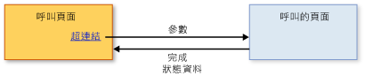

# 結構化巡覽概觀Structured Navigation Overview
可由裝載的內容[!INCLUDE[TLA#tla_xbap](../../../../includes/tlasharptla-xbap-md.md)]，則<xref:System.Windows.Controls.Frame>，或<xref:System.Windows.Navigation.NavigationWindow>是可由組件識別的頁面所組成[!INCLUDE[TLA#tla_uri#plural](../../../../includes/tlasharptla-urisharpplural-md.md)]和超連結巡覽至。Content that can be hosted by an [!INCLUDE[TLA#tla_xbap](../../../../includes/tlasharptla-xbap-md.md)], a <xref:System.Windows.Controls.Frame>, or a <xref:System.Windows.Navigation.NavigationWindow> is composed of pages that can be identified by pack [!INCLUDE[TLA#tla_uri#plural](../../../../includes/tlasharptla-urisharpplural-md.md)] and navigated to by hyperlinks. 頁面的結構及其可被巡覽的方式，如超連結所定義，稱之為巡覽拓撲。The structure of pages and the ways in which they can be navigated, as defined by hyperlinks, is known as a navigation topology. 這種拓撲適合各種不同的應用程式類型，尤其是巡覽文件的應用程式。Such a topology suits a variety of application types, particularly those that navigate through documents. 針對這類應用程式，使用者可以從一頁巡覽到另一頁，頁面彼此間不需要了解。For such applications, the user can navigate from one page to another page without either page needing to know anything about the other.  
  
 不過，其他類型的應用程式有需要知道被巡覽的頁面。However, other types of applications have pages that do need to know when they have been navigated between. 例如，假設人力資源應用程式有列出組織中所有員工的頁面：「員工清單」頁面。For example, consider a human resources application that has one page to list all the employees in an organization—the "List Employees" page. 此頁面也允許使用者按一下超連結新增新進員工。This page could also allow users to add a new employee by clicking a hyperlink. 按一下時，頁面會巡覽至「新增員工」頁面，收集新進員工的詳細資料，並傳回「員工清單」頁面建立新的員工以及更新清單。When clicked, the page navigates to an "Add an Employee" page to gather the new employee's details and return them to the "List Employees" page to create the new employee and update the list. 這種巡覽樣式類似於呼叫方法執行一些處理並傳回值，稱之為結構化程式設計。This style of navigation is similar to calling a method to perform some processing and return a value, which is known as structured programming. 因此，這種巡覽稱之為「結構化巡覽」。As such, this style of navigation is known as *structured navigation*.  
  
 <xref:System.Windows.Controls.Page>類別不實作結構化巡覽的支援。The <xref:System.Windows.Controls.Page> class doesn't implement support for structured navigation. 相反地，<xref:System.Windows.Navigation.PageFunction%601>類別衍生自<xref:System.Windows.Controls.Page>並將它擴充與結構化巡覽所需的基本建構。Instead, the <xref:System.Windows.Navigation.PageFunction%601> class derives from <xref:System.Windows.Controls.Page> and extends it with the basic constructs required for structured navigation. 本主題說明如何建立使用結構化的巡覽<xref:System.Windows.Navigation.PageFunction%601>。This topic shows how to establish structured navigation using <xref:System.Windows.Navigation.PageFunction%601>.  
  
 
  
   
## 結構化巡覽Structured Navigation  
 當一個頁面在結構化巡覽中呼叫另一個頁面時，需要下列部分或全部行為︰When one page calls another page in a structured navigation, some or all of the following behaviors are required:  
  
-   呼叫端頁面會巡覽至呼叫的頁面，並選擇性地傳遞被呼叫頁面所需的參數。The calling page navigates to the called page, optionally passing parameters required by the called page.  
  
-   當使用者用完呼叫端頁面時，呼叫的頁面會選擇性特別傳回給呼叫端頁面︰The called page, when a user has completed using the calling page, returns specifically to the calling page, optionally:  
  
    -   傳回狀態資訊，說明如何完成呼叫端頁面 (例如，使用者按下 [確定] 按鈕或 [取消] 按鈕)。Returning state information that describes how the calling page was completed (for example, whether a user pressed an OK button or a Cancel button).  
  
    -   傳回收集的使用者資料 (例如，新進員工的詳細資料)。Returning that data that was collected from the user (for example, new employee details).  
  
-   當呼叫端頁面傳回被呼叫的頁面時，巡覽記錄會移除呼叫的頁面，隔離呼叫頁面中的各個執行個體。When the calling page returns to the called page, the called page is removed from navigation history to isolate one instance of a called page from another.  
  
 下圖說明這些行為。These behaviors are illustrated by the following figure.  
  
   
  
 您可以使用來實作這些行為<xref:System.Windows.Navigation.PageFunction%601>作為呼叫的頁面。You can implement these behaviors by using a <xref:System.Windows.Navigation.PageFunction%601> as the called page.  
  
   
## 有 PageFunction 的結構化巡覽Structured Navigation with PageFunction  
 本主題說明如何實作涉及單一的結構化巡覽基本機制<xref:System.Windows.Navigation.PageFunction%601>。This topic shows how to implement the basic mechanics of structured navigation involving a single <xref:System.Windows.Navigation.PageFunction%601>. 在此範例中，<xref:System.Windows.Controls.Page>呼叫<xref:System.Windows.Navigation.PageFunction%601>若要取得<xref:System.String>來自使用者的值，並將它傳回。In this sample, a <xref:System.Windows.Controls.Page> calls a <xref:System.Windows.Navigation.PageFunction%601> to get a <xref:System.String> value from the user and return it.  
  
### 建立呼叫端頁面Creating a Calling Page  
 呼叫頁面<xref:System.Windows.Navigation.PageFunction%601>可以是<xref:System.Windows.Controls.Page>或<xref:System.Windows.Navigation.PageFunction%601>。The page that calls a <xref:System.Windows.Navigation.PageFunction%601> can be either a <xref:System.Windows.Controls.Page> or a <xref:System.Windows.Navigation.PageFunction%601>. 在此範例中，它是<xref:System.Windows.Controls.Page>，如下列程式碼所示。In this example, it is a <xref:System.Windows.Controls.Page>, as shown in the following code.  
  
 [!code-xaml[StructuredNavigationSample#CallingPageDefaultMARKUP1](~/samples/snippets/csharp/VS_Snippets_Wpf/StructuredNavigationSample/CSharp/CallingPage.xaml#callingpagedefaultmarkup1)]  
[!code-xaml[StructuredNavigationSample#CallingPageDefaultMARKUP2](~/samples/snippets/csharp/VS_Snippets_Wpf/StructuredNavigationSample/CSharp/CallingPage.xaml#callingpagedefaultmarkup2)]  
  
 [!code-csharp[StructuredNavigationSample#CallingPageDefaultCODEBEHIND1](~/samples/snippets/csharp/VS_Snippets_Wpf/StructuredNavigationSample/CSharp/CallingPage.xaml.cs#callingpagedefaultcodebehind1)]
 [!code-vb[StructuredNavigationSample#CallingPageDefaultCODEBEHIND1](~/samples/snippets/visualbasic/VS_Snippets_Wpf/StructuredNavigationSample/VisualBasic/CallingPage.xaml.vb#callingpagedefaultcodebehind1)]  
[!code-csharp[StructuredNavigationSample#CallingPageDefaultCODEBEHIND2](~/samples/snippets/csharp/VS_Snippets_Wpf/StructuredNavigationSample/CSharp/CallingPage.xaml.cs#callingpagedefaultcodebehind2)]
[!code-vb[StructuredNavigationSample#CallingPageDefaultCODEBEHIND2](~/samples/snippets/visualbasic/VS_Snippets_Wpf/StructuredNavigationSample/VisualBasic/CallingPage.xaml.vb#callingpagedefaultcodebehind2)]  
[!code-csharp[StructuredNavigationSample#CallingPageDefaultCODEBEHIND3](~/samples/snippets/csharp/VS_Snippets_Wpf/StructuredNavigationSample/CSharp/CallingPage.xaml.cs#callingpagedefaultcodebehind3)]
[!code-vb[StructuredNavigationSample#CallingPageDefaultCODEBEHIND3](~/samples/snippets/visualbasic/VS_Snippets_Wpf/StructuredNavigationSample/VisualBasic/CallingPage.xaml.vb#callingpagedefaultcodebehind3)]  
  
### 建立呼叫頁面函式Creating a Page Function to Call  
 因為呼叫端頁面可以用呼叫的頁面，來收集，並將資料傳回來自使用者的<xref:System.Windows.Navigation.PageFunction%601>會實作成泛型類別，其型別引數會指定呼叫的頁面將會傳回值的型別。Because the calling page can use the called page to collect and return data from the user, <xref:System.Windows.Navigation.PageFunction%601> is implemented as a generic class whose type argument specifies the type of the value that the called page will return. 下列程式碼示範被呼叫的初始實作頁面上，使用<xref:System.Windows.Navigation.PageFunction%601>，以傳回<xref:System.String>。The following code shows the initial implementation of the called page, using a <xref:System.Windows.Navigation.PageFunction%601>, which returns a <xref:System.String>.  
  
 [!code-xaml[StructuredNavigationSample#CalledPageFunctionMARKUP](~/samples/snippets/csharp/VS_Snippets_Wpf/StructuredNavigationSample/CSharp/CalledPageFunction.xaml#calledpagefunctionmarkup)]  
  
 [!code-csharp[StructuredNavigationSample#CalledPageFunctionCODEBEHIND1](~/samples/snippets/csharp/VS_Snippets_Wpf/StructuredNavigationSample/CSharp/CalledPageFunction.xaml.cs#calledpagefunctioncodebehind1)]
 [!code-vb[StructuredNavigationSample#CalledPageFunctionCODEBEHIND1](~/samples/snippets/visualbasic/VS_Snippets_Wpf/StructuredNavigationSample/VisualBasic/CalledPageFunction.xaml.vb#calledpagefunctioncodebehind1)]  
[!code-csharp[StructuredNavigationSample#CalledPageFunctionCODEBEHIND2](~/samples/snippets/csharp/VS_Snippets_Wpf/StructuredNavigationSample/CSharp/CalledPageFunction.xaml.cs#calledpagefunctioncodebehind2)]
[!code-vb[StructuredNavigationSample#CalledPageFunctionCODEBEHIND2](~/samples/snippets/visualbasic/VS_Snippets_Wpf/StructuredNavigationSample/VisualBasic/CalledPageFunction.xaml.vb#calledpagefunctioncodebehind2)]  
  
 Deklarace<xref:System.Windows.Navigation.PageFunction%601>類似於宣告<xref:System.Windows.Controls.Page>加上型別引數。The declaration of a <xref:System.Windows.Navigation.PageFunction%601> is similar to the declaration of a <xref:System.Windows.Controls.Page> with the addition of the type arguments. 如您在程式碼範例中所見，使用 `x:TypeArguments` 屬性的 [!INCLUDE[TLA2#tla_xaml](../../../../includes/tla2sharptla-xaml-md.md)] 標記和使用標準泛型型別引數語法的程式碼後置，兩者都指定型別引數。As you can see from the code example, the type arguments are specified in both [!INCLUDE[TLA2#tla_xaml](../../../../includes/tla2sharptla-xaml-md.md)] markup, using the `x:TypeArguments` attribute, and code-behind, using standard generic type argument syntax.  
  
 您不必只使用 [!INCLUDE[dnprdnshort](../../../../includes/dnprdnshort-md.md)] 類別作為型別引數。You don't have to use only [!INCLUDE[dnprdnshort](../../../../includes/dnprdnshort-md.md)] classes as type arguments. A<xref:System.Windows.Navigation.PageFunction%601>可能呼叫來收集抽象化為自訂類型的定義域專屬資料。A <xref:System.Windows.Navigation.PageFunction%601> could be called to gather domain-specific data that is abstracted as a custom type. 下列程式碼示範如何使用自訂類型的型別引數作為<xref:System.Windows.Navigation.PageFunction%601>。The following code shows how to use a custom type as a type argument for a <xref:System.Windows.Navigation.PageFunction%601>.  
  
 [!code-csharp[CustomTypePageFunctionSnippets#CustomTypeCODE1](~/samples/snippets/csharp/VS_Snippets_Wpf/CustomTypePageFunctionSnippets/CSharp/CustomType.cs#customtypecode1)]
 [!code-vb[CustomTypePageFunctionSnippets#CustomTypeCODE1](~/samples/snippets/visualbasic/VS_Snippets_Wpf/CustomTypePageFunctionSnippets/VisualBasic/CustomType.vb#customtypecode1)]  
[!code-csharp[CustomTypePageFunctionSnippets#CustomTypeCODE2](~/samples/snippets/csharp/VS_Snippets_Wpf/CustomTypePageFunctionSnippets/CSharp/CustomType.cs#customtypecode2)]
[!code-vb[CustomTypePageFunctionSnippets#CustomTypeCODE2](~/samples/snippets/visualbasic/VS_Snippets_Wpf/CustomTypePageFunctionSnippets/VisualBasic/CustomType.vb#customtypecode2)]  
  
 [!code-xaml[CustomTypePageFunctionSnippets#CustomTypePageFunctionMARKUP1](~/samples/snippets/csharp/VS_Snippets_Wpf/CustomTypePageFunctionSnippets/CSharp/CustomTypePageFunction.xaml#customtypepagefunctionmarkup1)]  
[!code-xaml[CustomTypePageFunctionSnippets#CustomTypePageFunctionMARKUP2](~/samples/snippets/csharp/VS_Snippets_Wpf/CustomTypePageFunctionSnippets/CSharp/CustomTypePageFunction.xaml#customtypepagefunctionmarkup2)]  
  
 [!code-csharp[CustomTypePageFunctionSnippets#CustomTypePageFunctionCODEBEHIND1](~/samples/snippets/csharp/VS_Snippets_Wpf/CustomTypePageFunctionSnippets/CSharp/CustomTypePageFunction.xaml.cs#customtypepagefunctioncodebehind1)]
 [!code-vb[CustomTypePageFunctionSnippets#CustomTypePageFunctionCODEBEHIND1](~/samples/snippets/visualbasic/VS_Snippets_Wpf/CustomTypePageFunctionSnippets/VisualBasic/CustomTypePageFunction.xaml.vb#customtypepagefunctioncodebehind1)]  
[!code-csharp[CustomTypePageFunctionSnippets#CustomTypePageFunctionCODEBEHIND2](~/samples/snippets/csharp/VS_Snippets_Wpf/CustomTypePageFunctionSnippets/CSharp/CustomTypePageFunction.xaml.cs#customtypepagefunctioncodebehind2)]
[!code-vb[CustomTypePageFunctionSnippets#CustomTypePageFunctionCODEBEHIND2](~/samples/snippets/visualbasic/VS_Snippets_Wpf/CustomTypePageFunctionSnippets/VisualBasic/CustomTypePageFunction.xaml.vb#customtypepagefunctioncodebehind2)]  
  
 類型引數<xref:System.Windows.Navigation.PageFunction%601>呼叫端頁面和被呼叫的頁面上，下列各節會討論之間的通訊提供基礎。The type arguments for the <xref:System.Windows.Navigation.PageFunction%601> provide the foundation for the communication between a calling page and the called page, which are discussed in the following sections.  
  
 如您所見，識別以宣告的型別<xref:System.Windows.Navigation.PageFunction%601>扮演重要的角色，在傳回的資料<xref:System.Windows.Navigation.PageFunction%601>呼叫端頁面。As you'll see, the type that is identified with the declaration of a <xref:System.Windows.Navigation.PageFunction%601> plays an important role in returning data from a <xref:System.Windows.Navigation.PageFunction%601> to the calling page.  
  
### 呼叫 PageFunction 並傳遞參數Calling a PageFunction and Passing Parameters  
 若要呼叫的頁面上，呼叫端頁面必須具現化呼叫的頁面，並瀏覽至該使用<xref:System.Windows.Navigation.NavigationService.Navigate%2A>方法。To call a page, the calling page must instantiate the called page and navigate to it using the <xref:System.Windows.Navigation.NavigationService.Navigate%2A> method. 這可讓呼叫端頁面將初始資料傳遞至呼叫的頁面，例如由呼叫的頁面所收集之資料的預設值。This allows the calling page to pass initial data to the called page, such as default values for the data being gathered by the called page.  
  
 下列程式碼示範具有非預設建構函式的被呼叫頁面，接受來自呼叫端頁面的參數。The following code shows the called page with a non-default constructor to accept parameters from the calling page.  
  
 [!code-csharp[StructuredNavigationSample#AcceptsInitialDataCODEBEHIND1](~/samples/snippets/csharp/VS_Snippets_Wpf/StructuredNavigationSample/CSharp/CalledPageFunction.xaml.cs#acceptsinitialdatacodebehind1)]
 [!code-vb[StructuredNavigationSample#AcceptsInitialDataCODEBEHIND1](~/samples/snippets/visualbasic/VS_Snippets_Wpf/StructuredNavigationSample/VisualBasic/CalledPageFunction.xaml.vb#acceptsinitialdatacodebehind1)]  
[!code-csharp[StructuredNavigationSample#AcceptsInitialDataCODEBEHIND2](~/samples/snippets/csharp/VS_Snippets_Wpf/StructuredNavigationSample/CSharp/CalledPageFunction.xaml.cs#acceptsinitialdatacodebehind2)]
[!code-vb[StructuredNavigationSample#AcceptsInitialDataCODEBEHIND2](~/samples/snippets/visualbasic/VS_Snippets_Wpf/StructuredNavigationSample/VisualBasic/CalledPageFunction.xaml.vb#acceptsinitialdatacodebehind2)]  
[!code-csharp[StructuredNavigationSample#AcceptsInitialDataCODEBEHIND3](~/samples/snippets/csharp/VS_Snippets_Wpf/StructuredNavigationSample/CSharp/CalledPageFunction.xaml.cs#acceptsinitialdatacodebehind3)]
[!code-vb[StructuredNavigationSample#AcceptsInitialDataCODEBEHIND3](~/samples/snippets/visualbasic/VS_Snippets_Wpf/StructuredNavigationSample/VisualBasic/CalledPageFunction.xaml.vb#acceptsinitialdatacodebehind3)]  
[!code-csharp[StructuredNavigationSample#AcceptsInitialDataCODEBEHIND4](~/samples/snippets/csharp/VS_Snippets_Wpf/StructuredNavigationSample/CSharp/CalledPageFunction.xaml.cs#acceptsinitialdatacodebehind4)]
[!code-vb[StructuredNavigationSample#AcceptsInitialDataCODEBEHIND4](~/samples/snippets/visualbasic/VS_Snippets_Wpf/StructuredNavigationSample/VisualBasic/CalledPageFunction.xaml.vb#acceptsinitialdatacodebehind4)]  
  
 下列程式碼會顯示呼叫端頁面處理<xref:System.Windows.Documents.Hyperlink.Click>事件的<xref:System.Windows.Documents.Hyperlink>具現化呼叫的頁面，並將它傳遞初始字串值。The following code shows the calling page handling the <xref:System.Windows.Documents.Hyperlink.Click> event of the <xref:System.Windows.Documents.Hyperlink> to instantiate the called page and pass it an initial string value.  
  
 [!code-xaml[StructuredNavigationSample#PassingDataMARKUP2](~/samples/snippets/csharp/VS_Snippets_Wpf/StructuredNavigationSample/CSharp/CallingPage.xaml#passingdatamarkup2)]  
[!code-csharp[StructuredNavigationSample#PassingDataCODEBEHIND1](~/samples/snippets/csharp/VS_Snippets_Wpf/StructuredNavigationSample/CSharp/CallingPage.xaml.cs#passingdatacodebehind1)]
[!code-vb[StructuredNavigationSample#PassingDataCODEBEHIND1](~/samples/snippets/visualbasic/VS_Snippets_Wpf/StructuredNavigationSample/VisualBasic/CallingPage.xaml.vb#passingdatacodebehind1)]  
[!code-csharp[StructuredNavigationSample#PassingDataCODEBEHIND2](~/samples/snippets/csharp/VS_Snippets_Wpf/StructuredNavigationSample/CSharp/CallingPage.xaml.cs#passingdatacodebehind2)]
[!code-vb[StructuredNavigationSample#PassingDataCODEBEHIND2](~/samples/snippets/visualbasic/VS_Snippets_Wpf/StructuredNavigationSample/VisualBasic/CallingPage.xaml.vb#passingdatacodebehind2)]  
[!code-csharp[StructuredNavigationSample#PassingDataCODEBEHIND3](~/samples/snippets/csharp/VS_Snippets_Wpf/StructuredNavigationSample/CSharp/CallingPage.xaml.cs#passingdatacodebehind3)]
[!code-vb[StructuredNavigationSample#PassingDataCODEBEHIND3](~/samples/snippets/visualbasic/VS_Snippets_Wpf/StructuredNavigationSample/VisualBasic/CallingPage.xaml.vb#passingdatacodebehind3)]  
  
 您不需要將參數傳遞給呼叫的頁面。You are not required to pass parameters to the called page. 您反而可以執行下列作業︰Instead, you could do the following:  
  
-   從呼叫端頁面︰From the calling page:  
  
    1.  具現化被呼叫<xref:System.Windows.Navigation.PageFunction%601>使用預設建構函式。Instantiate the called <xref:System.Windows.Navigation.PageFunction%601> using the default constructor.  
  
    2.  存放區中的參數<xref:System.Windows.Application.Properties%2A>。Store the parameters in <xref:System.Windows.Application.Properties%2A>.  
  
    3.  瀏覽至 被呼叫<xref:System.Windows.Navigation.PageFunction%601>。Navigate to the called <xref:System.Windows.Navigation.PageFunction%601>.  
  
-   從被呼叫<xref:System.Windows.Navigation.PageFunction%601>:From the called <xref:System.Windows.Navigation.PageFunction%601>:  
  
    -   擷取並使用儲存在參數<xref:System.Windows.Application.Properties%2A>。Retrieve and use the parameters stored in <xref:System.Windows.Application.Properties%2A>.  
  
 但是，您很快就會發現，您還是需要使用程式碼來具現化並巡覽至呼叫的頁面，才能收集呼叫的頁面所傳回的資料。But, as you'll see shortly, you'll still need use code to instantiate and navigate to the called page to collect the data returned by the called page. 基於這個理由，<xref:System.Windows.Navigation.PageFunction%601>需求保持運作; 否則下次您瀏覽至<xref:System.Windows.Navigation.PageFunction%601>，[!INCLUDE[TLA2#tla_wpf](../../../../includes/tla2sharptla-wpf-md.md)]具現化<xref:System.Windows.Navigation.PageFunction%601>使用預設建構函式。For this reason, the <xref:System.Windows.Navigation.PageFunction%601> needs to be kept alive; otherwise, the next time you navigate to the <xref:System.Windows.Navigation.PageFunction%601>, [!INCLUDE[TLA2#tla_wpf](../../../../includes/tla2sharptla-wpf-md.md)] instantiates the <xref:System.Windows.Navigation.PageFunction%601> using the default constructor.  
  
 但在呼叫的頁面傳回之前，它需要傳回呼叫端頁面可擷取的資料。Before the called page can return, however, it needs to return data that can be retrieved by the calling page.  
  
### 將工作的工作結果和工作資料傳回給呼叫端頁面Returning Task Result and Task Data from a Task to a Calling Page  
 使用者用完呼叫的頁面時，如本例所示，按 [確定] 或 [取消] 按鈕，必須傳回呼叫的頁面。Once the user has finished using the called page, signified in this example by pressing either the OK or Cancel buttons, the called page needs to return. 因為呼叫端頁面使用了被呼叫頁面來收集使用者資料，所以呼叫端頁面需要兩種類型的資訊︰Since the calling page used the called page to collect data from the user, the calling page requires two types of information:  
  
1.  使用者是否取消了呼叫的頁面 (本例中為按下 [確定] 按鈕或 [取消] 按鈕)。Whether the user canceled the called page (by pressing either the OK button or the Cancel button in this example). 這可讓呼叫端頁面決定是否要處理呼叫端頁面收集的使用者資料。This allows the calling page to determine whether to process the data that the calling page gathered from the user.  
  
2.  使用者提供的資料。The data that was provided by the user.  
  
 要傳回資訊，請<xref:System.Windows.Navigation.PageFunction%601>實作<xref:System.Windows.Navigation.PageFunction%601.OnReturn%2A>方法。To return information, <xref:System.Windows.Navigation.PageFunction%601> implements the <xref:System.Windows.Navigation.PageFunction%601.OnReturn%2A> method. 下列程式碼示範如何呼叫它。The following code shows how to call it.  
  
 [!code-csharp[StructuredNavigationSample#ReturnCODEBEHIND1](~/samples/snippets/csharp/VS_Snippets_Wpf/StructuredNavigationSample/CSharp/CalledPageFunction.xaml.cs#returncodebehind1)]
 [!code-vb[StructuredNavigationSample#ReturnCODEBEHIND1](~/samples/snippets/visualbasic/VS_Snippets_Wpf/StructuredNavigationSample/VisualBasic/CalledPageFunction.xaml.vb#returncodebehind1)]  
[!code-csharp[StructuredNavigationSample#ReturnCODEBEHIND2](~/samples/snippets/csharp/VS_Snippets_Wpf/StructuredNavigationSample/CSharp/CalledPageFunction.xaml.cs#returncodebehind2)]
[!code-vb[StructuredNavigationSample#ReturnCODEBEHIND2](~/samples/snippets/visualbasic/VS_Snippets_Wpf/StructuredNavigationSample/VisualBasic/CalledPageFunction.xaml.vb#returncodebehind2)]  
  
 在本例中，如果使用者按下 [取消] 按鈕，`null` 值就會傳回呼叫端頁面。In this example, if a user presses the Cancel button, a value of `null` is returned to the calling page. 如果改按下 [確定] 按鈕，則傳回使用者提供的字串值。If the OK button is pressed instead, the string value provided by the user is returned. <xref:System.Windows.Navigation.PageFunction%601.OnReturn%2A> 是`protected virtual`您呼叫以將資料傳回呼叫端頁面的方法。<xref:System.Windows.Navigation.PageFunction%601.OnReturn%2A> is a `protected virtual` method that you call to return your data to the calling page. 您的資料必須封裝在執行個體的泛型<xref:System.Windows.Navigation.ReturnEventArgs%601>型別，其類型引數指定的型別值<xref:System.Windows.Navigation.ReturnEventArgs%601.Result%2A>傳回。Your data needs to be packaged in an instance of the generic <xref:System.Windows.Navigation.ReturnEventArgs%601> type, whose type argument specifies the type of value that <xref:System.Windows.Navigation.ReturnEventArgs%601.Result%2A> returns. 如此一來，當您宣告<xref:System.Windows.Navigation.PageFunction%601>與特定的型別引數，即表示，<xref:System.Windows.Navigation.PageFunction%601>會傳回型別引數所指定類型的執行個體。In this way, when you declare a <xref:System.Windows.Navigation.PageFunction%601> with a particular type argument, you are stating that a <xref:System.Windows.Navigation.PageFunction%601> will return an instance of the type that is specified by the type argument. 在此範例中，型別引數，因此傳回的值屬於類型<xref:System.String>。In this example, the type argument and, consequently, the return value is of type <xref:System.String>.  
  
 當<xref:System.Windows.Navigation.PageFunction%601.OnReturn%2A>呼叫時，呼叫端頁面需要某種方式接收的傳回值<xref:System.Windows.Navigation.PageFunction%601>。When <xref:System.Windows.Navigation.PageFunction%601.OnReturn%2A> is called, the calling page needs some way of receiving the return value of the <xref:System.Windows.Navigation.PageFunction%601>. 基於這個理由，<xref:System.Windows.Navigation.PageFunction%601>實作<xref:System.Windows.Navigation.PageFunction%601.Return>呼叫頁來處理事件。For this reason, <xref:System.Windows.Navigation.PageFunction%601> implements the <xref:System.Windows.Navigation.PageFunction%601.Return> event for calling pages to handle. 當<xref:System.Windows.Navigation.PageFunction%601.OnReturn%2A>呼叫時，<xref:System.Windows.Navigation.PageFunction%601.Return>就會引發，讓呼叫端頁面可以向<xref:System.Windows.Navigation.PageFunction%601.Return>来接收通知。When <xref:System.Windows.Navigation.PageFunction%601.OnReturn%2A> is called, <xref:System.Windows.Navigation.PageFunction%601.Return> is raised, so the calling page can register with <xref:System.Windows.Navigation.PageFunction%601.Return> to receive the notification.  
  
 [!code-csharp[StructuredNavigationSample#ProcessResultCODEBEHIND1](~/samples/snippets/csharp/VS_Snippets_Wpf/StructuredNavigationSample/CSharp/CallingPage.xaml.cs#processresultcodebehind1)]
 [!code-vb[StructuredNavigationSample#ProcessResultCODEBEHIND1](~/samples/snippets/visualbasic/VS_Snippets_Wpf/StructuredNavigationSample/VisualBasic/CallingPage.xaml.vb#processresultcodebehind1)]  
[!code-csharp[StructuredNavigationSample#ProcessResultCODEBEHIND2](~/samples/snippets/csharp/VS_Snippets_Wpf/StructuredNavigationSample/CSharp/CallingPage.xaml.cs#processresultcodebehind2)]
[!code-vb[StructuredNavigationSample#ProcessResultCODEBEHIND2](~/samples/snippets/visualbasic/VS_Snippets_Wpf/StructuredNavigationSample/VisualBasic/CallingPage.xaml.vb#processresultcodebehind2)]  
  
### 工作完成時移除工作頁面Removing Task Pages When a Task Completes  
 當傳回呼叫的頁面，而使用者未取消呼叫的頁面時，呼叫端頁面會處理使用者提供以及呼叫的頁面所傳回的資料。When a called page returns, and the user didn't cancel the called page, the calling page will process the data that was provided by the user and also returned from the called page. 以此方式擷取的資料通常是獨立的活動。當被呼叫頁面傳回時，呼叫端頁面需要建立並巡覽至新的呼叫端頁面，以擷取更多資料。Data acquisition in this way is usually an isolated activity; when the called page returns, the calling page needs to create and navigate to a new calling page to capture more data.  
  
 不過，除非從日誌移除呼叫的頁面，否則使用者就能夠巡覽回到呼叫端頁面的上一個執行個體。However, unless a called page is removed from the journal, a user will be able to navigate back to a previous instance of the calling page. 是否<xref:System.Windows.Navigation.PageFunction%601>會保留在日誌取決<xref:System.Windows.Navigation.PageFunctionBase.RemoveFromJournal%2A>屬性。Whether a <xref:System.Windows.Navigation.PageFunction%601> is retained in the journal is determined by the <xref:System.Windows.Navigation.PageFunctionBase.RemoveFromJournal%2A> property. 根據預設，頁面函式會自動移除何時<xref:System.Windows.Navigation.PageFunction%601.OnReturn%2A>稱為，因為<xref:System.Windows.Navigation.PageFunctionBase.RemoveFromJournal%2A>設定為`true`。By default, a page function is automatically removed when <xref:System.Windows.Navigation.PageFunction%601.OnReturn%2A> is called because <xref:System.Windows.Navigation.PageFunctionBase.RemoveFromJournal%2A> is set to `true`. 若要在之後的巡覽記錄中保留頁面函式<xref:System.Windows.Navigation.PageFunction%601.OnReturn%2A>呼叫時，設定<xref:System.Windows.Navigation.PageFunctionBase.RemoveFromJournal%2A>至`false`。To keep a page function in navigation history after <xref:System.Windows.Navigation.PageFunction%601.OnReturn%2A> is called, set <xref:System.Windows.Navigation.PageFunctionBase.RemoveFromJournal%2A> to `false`.  
  
   
## 其他類型的結構化巡覽Other Types of Structured Navigation  
 本主題說明最基本的用法<xref:System.Windows.Navigation.PageFunction%601>以支援呼叫/傳回結構化巡覽。This topic illustrates the most basic use of a <xref:System.Windows.Navigation.PageFunction%601> to support call/return structured navigation. 此基礎讓您能夠建立更複雜的結構化巡覽類型。This foundation provides you with the ability to create more complex types of structured navigation.  
  
 例如，呼叫端頁面有時候需要多個頁面來收集足夠的使用者資料，或執行工作。For example, sometimes multiple pages are required by a calling page to gather enough data from a user or to perform a task. 使用多個頁面稱之為「精靈」。The use of multiple pages is referred to as a "wizard".  
  
 在其他情況下，應用程式可能會令相依於結構化巡覽的複雜巡覽拓撲有效運作。In other cases, applications may have complex navigation topologies that depend on structured navigation to operate effectively. 如需詳細資訊，請參閱[巡覽拓撲概觀](navigation-topologies-overview.md)。For more information, see [Navigation Topologies Overview](navigation-topologies-overview.md).  
  
## 另請參閱See also
- <xref:System.Windows.Navigation.PageFunction%601>
- <xref:System.Windows.Navigation.NavigationService>
- [巡覽拓撲概觀Navigation Topologies Overview](navigation-topologies-overview.md)
