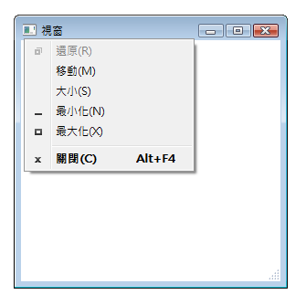
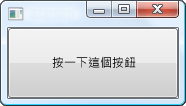
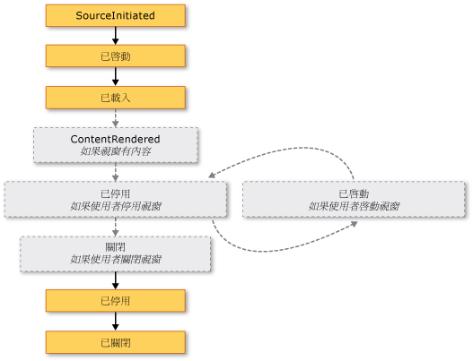
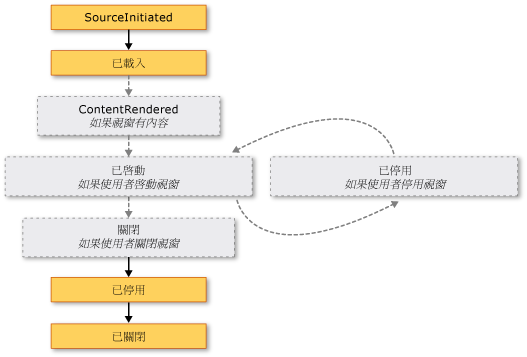

# <a name="wpf-windows-overview"></a>WPF 視窗概觀
使用者是透過視窗與 [!INCLUDE[TLA#tla_wpf](../../../../includes/tlasharptla-wpf-md.md)] 獨立應用程式互動。 視窗的主要用途是裝載內容，以視覺化方式檢視資料，並讓使用者可以與資料互動。 獨立[!INCLUDE[TLA2#tla_wpf](../../../../includes/tla2sharptla-wpf-md.md)]應用程式使用，提供它們自己的視窗<xref:System.Windows.Window>類別。 本主題將介紹<xref:System.Windows.Window>之前涵蓋建立和管理 windows 獨立應用程式中的基本概念。  
  
> [!NOTE]
>  瀏覽器裝載[!INCLUDE[TLA2#tla_wpf](../../../../includes/tla2sharptla-wpf-md.md)]應用程式，包括[!INCLUDE[TLA#tla_xbap#plural](../../../../includes/tlasharptla-xbapsharpplural-md.md)]和鬆散[!INCLUDE[TLA#tla_xaml](../../../../includes/tlasharptla-xaml-md.md)]頁面，不會提供自己的視窗。 相反地，它們會裝載在 windows 所提供[!INCLUDE[TLA#tla_iegeneric](../../../../includes/tlasharptla-iegeneric-md.md)]。 請參閱[WPF XAML 瀏覽器應用程式概觀](../../../../docs/framework/wpf/app-development/wpf-xaml-browser-applications-overview.md)。  
  
  
<a name="TheWindowClass"></a>   
## <a name="the-window-class"></a>Window 類別  
 下圖說明視窗的組成部分。  
  
   
  
 視窗分為兩個區域︰非工作區和工作區。  
  
 *非工作區*的視窗由實作[!INCLUDE[TLA2#tla_wpf](../../../../includes/tla2sharptla-wpf-md.md)]並包含通用於大多數的視窗，其中包括下列視窗的組件：  
  
-   框線。  
  
-   標題列。  
  
-   圖示。  
  
-   [最小化]、[最大化] 和 [還原] 按鈕。  
  
-   [關閉] 按鈕。  
  
-   [系統] 功能表，具有允許使用者最小化、最大化、還原、移動、調整大小和關閉視窗的功能表項目。  
  
 *用戶端區域*視窗的視窗之非工作區內的區域，且可由開發人員來新增應用程式特定的內容，例如功能表列、 工具列和控制項。  
  
 在[!INCLUDE[TLA2#tla_wpf](../../../../includes/tla2sharptla-wpf-md.md)]，視窗由封裝<xref:System.Windows.Window>類別用來執行下列動作：  
  
-   顯示視窗。  
  
-   設定視窗的大小、位置和外觀。  
  
-   裝載應用程式特定內容。  
  
-   管理視窗的存留期。  
  
<a name="DefiningAWindow"></a>   
## <a name="implementing-a-window"></a>實作視窗  
 典型視窗的實作包含外觀和行為，其中*外觀*定義使用者在視窗的外觀和*行為*定義視窗的功能與使用者互動的方式使用它。 在[!INCLUDE[TLA2#tla_wpf](../../../../includes/tla2sharptla-wpf-md.md)]、 您可以實作的外觀和行為視窗使用的是程式碼或[!INCLUDE[TLA2#tla_xaml](../../../../includes/tla2sharptla-xaml-md.md)]標記。  
  
 一般情況下，不過，視窗的外觀使用實作[!INCLUDE[TLA2#tla_xaml](../../../../includes/tla2sharptla-xaml-md.md)]標記和其行為使用實作程式碼後置，如下列範例所示。  
  
 [!code-xaml[WindowsOverviewSnippets#MarkupAndCodeBehindWindowMARKUP](../../../../samples/snippets/csharp/VS_Snippets_Wpf/WindowsOverviewSnippets/CSharp/MarkupAndCodeBehindWindow.xaml#markupandcodebehindwindowmarkup)]  
  
 [!code-csharp[WindowsOverviewSnippets#MarkupAndCodeBehindWindowCODEBEHIND](../../../../samples/snippets/csharp/VS_Snippets_Wpf/WindowsOverviewSnippets/CSharp/MarkupAndCodeBehindWindow.xaml.cs#markupandcodebehindwindowcodebehind)]
 [!code-vb[WindowsOverviewSnippets#MarkupAndCodeBehindWindowCODEBEHIND](../../../../samples/snippets/visualbasic/VS_Snippets_Wpf/WindowsOverviewSnippets/VisualBasic/MarkupAndCodeBehindWindow.xaml.vb#markupandcodebehindwindowcodebehind)]  
  
 若要啟用[!INCLUDE[TLA2#tla_xaml](../../../../includes/tla2sharptla-xaml-md.md)]標記檔案和程式碼後置檔案，以搭配使用，需要下列憑證：  
  
-   在標記中，`Window`元素必須包含`x:Class`屬性。 應用程式建置的時，是否存在`x:Class`標記中的檔案會導致[!INCLUDE[TLA#tla_msbuild](../../../../includes/tlasharptla-msbuild-md.md)]建立`partial`類別衍生自<xref:System.Windows.Window>且具有所指定名稱`x:Class`屬性。 這需要加入[!INCLUDE[TLA2#tla_xml](../../../../includes/tla2sharptla-xml-md.md)]的命名空間宣告[!INCLUDE[TLA2#tla_xaml](../../../../includes/tla2sharptla-xaml-md.md)]結構描述 ( `xmlns:x="http://schemas.microsoft.com/winfx/2006/xaml"` )。 產生`partial`類別會實作`InitializeComponent`方法，呼叫以註冊事件，並設定會在標記中實作的屬性。  
  
-   在程式碼後置類別必須是`partial`類別具有相同名稱的指定`x:Class`屬性標記，並必須衍生自<xref:System.Windows.Window>。 這可讓相關聯的程式碼後置檔案`partial`建置應用程式時，所產生的標記檔案類別 (請參閱[建置 WPF 應用程式](../../../../docs/framework/wpf/app-development/building-a-wpf-application-wpf.md))。  
  
-   在程式碼後置<xref:System.Windows.Window>類別必須實作的建構函式呼叫`InitializeComponent`方法。 `InitializeComponent`實作標記所產生檔案的`partial`類別，以註冊事件，並設定標記中定義的屬性。  
  
> [!NOTE]
>  當您新增新<xref:System.Windows.Window>至您的專案使用[!INCLUDE[TLA#tla_visualstu](../../../../includes/tlasharptla-visualstu-md.md)]、<xref:System.Windows.Window>使用標記和程式碼後置實作，並包含必要的設定，以建立做為標記和程式碼後置檔案之間的關聯此處所述。  
  
 這項設定的位置，您可以專注於定義中的視窗外觀[!INCLUDE[TLA2#tla_xaml](../../../../includes/tla2sharptla-xaml-md.md)]標記和程式碼後置中實作其行為。 下列範例顯示一個按鈕，在中實作包含視窗[!INCLUDE[TLA2#tla_xaml](../../../../includes/tla2sharptla-xaml-md.md)]標記和按鈕的事件處理常式<xref:System.Windows.Controls.Primitives.ButtonBase.Click>實作程式碼後置中的事件。  
  
 [!code-xaml[WindowsOverviewWindowWithButtonSnippets#MarkupAndCodeBehindWindowMARKUP](../../../../samples/snippets/csharp/VS_Snippets_Wpf/WindowsOverviewWindowWithButtonSnippets/CSharp/MarkupAndCodeBehindWindow.xaml#markupandcodebehindwindowmarkup)]  
  
 [!code-csharp[WindowsOverviewWindowWithButtonSnippets#MarkupAndCodeBehindWindowCODEBEHIND](../../../../samples/snippets/csharp/VS_Snippets_Wpf/WindowsOverviewWindowWithButtonSnippets/CSharp/MarkupAndCodeBehindWindow.xaml.cs#markupandcodebehindwindowcodebehind)]
 [!code-vb[WindowsOverviewWindowWithButtonSnippets#MarkupAndCodeBehindWindowCODEBEHIND](../../../../samples/snippets/visualbasic/VS_Snippets_Wpf/WindowsOverviewWindowWithButtonSnippets/VisualBasic/MarkupAndCodeBehindWindow.xaml.vb#markupandcodebehindwindowcodebehind)]  
  
<a name="ConfiguringWindowForMSBuild"></a>   
## <a name="configuring-a-window-definition-for-msbuild"></a>設定 MSBuild 的視窗定義  
 實作您的視窗的方式設定的方式會決定[!INCLUDE[TLA2#tla_msbuild](../../../../includes/tla2sharptla-msbuild-md.md)]。 使用這兩個定義的視窗[!INCLUDE[TLA2#tla_xaml](../../../../includes/tla2sharptla-xaml-md.md)]標記和程式碼後置：  
  
-   [!INCLUDE[TLA2#tla_xaml](../../../../includes/tla2sharptla-xaml-md.md)]標記檔案會設定為[!INCLUDE[TLA2#tla_msbuild](../../../../includes/tla2sharptla-msbuild-md.md)]`Page`項目。  
  
-   程式碼後置檔案會設定為[!INCLUDE[TLA2#tla_msbuild](../../../../includes/tla2sharptla-msbuild-md.md)]`Compile`項目。  
  
 這會顯示下列[!INCLUDE[TLA2#tla_msbuild](../../../../includes/tla2sharptla-msbuild-md.md)]專案檔。  
  
```xml  
<Project ...  
                xmlns="http://schemas.microsoft.com/developer/msbuild/2003">  
    ...  
    <Page Include="MarkupAndCodeBehindWindow.xaml" />  
    <Compile Include=" MarkupAndCodeBehindWindow.xaml.cs" />  
    ...  
</Project>  
```  
  
 如需建置[!INCLUDE[TLA2#tla_wpf](../../../../includes/tla2sharptla-wpf-md.md)]應用程式，請參閱[建置 WPF 應用程式](../../../../docs/framework/wpf/app-development/building-a-wpf-application-wpf.md)。  
  
<a name="WindowLifetime"></a>   
## <a name="window-lifetime"></a>視窗存留期  
 如同任何類別，視窗有存留期，會在它一開始具現化時開始，在那之後它會被開啟、啟動和停用，並最終關閉。  
  
  
<a name="Opening_a_Window"></a>   
### <a name="opening-a-window"></a>開啟視窗  
 若要開啟視窗，您要先建立它的執行個體，如下列範例中示範。  
  
 [!code-xaml[WindowsOverviewStartupEventSnippets#AppMARKUP](../../../../samples/snippets/csharp/VS_Snippets_Wpf/WindowsOverviewStartupEventSnippets/CSharp/App.xaml#appmarkup)]  
  
 [!code-csharp[WindowsOverviewStartupEventSnippets#AppCODEBEHIND](../../../../samples/snippets/csharp/VS_Snippets_Wpf/WindowsOverviewStartupEventSnippets/CSharp/App.xaml.cs#appcodebehind)]  
  
 在此範例中，`MarkupAndCodeBehindWindow`具現化應用程式啟動時，發生於當<xref:System.Windows.Application.Startup>就會引發事件。  
  
 具現化一個視窗時，它的參考會自動加入至受 windows 清單<xref:System.Windows.Application>物件 (請參閱<xref:System.Windows.Application.Windows%2A?displayProperty=nameWithType>)。 此外，第一個視窗来具現化，根據預設，設定<xref:System.Windows.Application>做為主要應用程式視窗 (請參閱<xref:System.Windows.Application.MainWindow%2A?displayProperty=nameWithType>)。  
  
 藉由呼叫最後開啟的視窗<xref:System.Windows.Window.Show%2A>方法; 在下圖中顯示結果。  
  
   
  
 開啟的視窗，藉由呼叫<xref:System.Windows.Window.Show%2A>是強制回應視窗，這表示該應用程式會在允許使用者啟用 其他視窗相同的應用程式中的模式。  
  
> [!NOTE]
>  <xref:System.Windows.Window.ShowDialog%2A>呼叫以強制回應方式開啟例如對話方塊視窗。 請參閱[對話方塊概觀](../../../../docs/framework/wpf/app-development/dialog-boxes-overview.md)如需詳細資訊。  
  
 當<xref:System.Windows.Window.Show%2A>是呼叫，視窗執行初始化工作後，它會顯示建立基礎結構，讓它能夠接收使用者輸入。 當初始化視窗時，<xref:System.Windows.Window.SourceInitialized>就會引發事件，並顯示視窗。  
  
 快捷<xref:System.Windows.Application.StartupUri%2A>可以設定以指定應用程式啟動時自動開啟的第一個視窗。  
  
 [!code-xaml[WindowsOverviewSnippets#ApplicationStartupUriMARKUP](../../../../samples/snippets/csharp/VS_Snippets_Wpf/WindowsOverviewSnippets/CSharp/App.xaml#applicationstartupurimarkup)]  
  
 應用程式啟動時，值所指定視窗<xref:System.Windows.Application.StartupUri%2A>開啟 modelessly; 就內部而言，開啟視窗的方式呼叫其<xref:System.Windows.Window.Show%2A>方法。  
  
<a name="Ownership"></a>   
#### <a name="window-ownership"></a>視窗擁有權  
 開啟的視窗，使用<xref:System.Windows.Window.Show%2A>方法並沒有隱含關聯性與建立它的視窗，使用者可以彼此獨立，這表示其中一個視窗可以執行下列其中一個視窗與互動：  
  
-   涵蓋的其他 (除非其中一個視窗有其<xref:System.Windows.Window.Topmost%2A>屬性設定為`true`)。  
  
-   最小化、最大化和還原而不會影響對方。  
  
 某些視窗需要與開啟它們的視窗有關聯性。 例如，[!INCLUDE[TLA#tla_ide](../../../../includes/tlasharptla-ide-md.md)]應用程式可能會開啟屬性視窗和工具視窗的典型的行為是要彌補建立它們的視窗。 此外，這類視窗應該一律與建立它們的視窗一致地關閉、最小化、最大化和還原。 藉由一個視窗，可以建立這類關聯性*自己*另一個，並達成設定<xref:System.Windows.Window.Owner%2A>屬性*擁有視窗*參考*擁有者視窗*。 這在下列範例中顯示。  
  
 [!code-csharp[WindowOwnerOwnedWindowsSnippets#SetWindowOwnerCODE](../../../../samples/snippets/csharp/VS_Snippets_Wpf/WindowOwnerOwnedWindowsSnippets/CSharp/MainWindow.xaml.cs#setwindowownercode)]
 [!code-vb[WindowOwnerOwnedWindowsSnippets#SetWindowOwnerCODE](../../../../samples/snippets/visualbasic/VS_Snippets_Wpf/WindowOwnerOwnedWindowsSnippets/visualbasic/mainwindow.xaml.vb#setwindowownercode)]  
  
 建立擁有權之後︰  
  
-   擁有的視窗可以藉由檢查的值參考其擁有者視窗其<xref:System.Windows.Window.Owner%2A>屬性。  
  
-   主控視窗可以探索其擁有藉由檢查的值的所有 windows 其<xref:System.Windows.Window.OwnedWindows%2A>屬性。  
  
<a name="Preventing"></a>   
#### <a name="preventing-window-activation"></a>避免視窗啟動  
 在有些案例中，視窗不應該在顯示時啟動，例如網際網路 messenger 樣式應用程式的交談視窗或電子郵件應用程式的通知視窗。  
  
 如果您的應用程式不應該在顯示時啟動的視窗，您可以設定其<xref:System.Windows.Window.ShowActivated%2A>屬性`false`之前先呼叫<xref:System.Windows.Window.Show%2A>第一次的方法。 因此：  
  
-   未啟動視窗。  
  
-   視窗的<xref:System.Windows.Window.Activated>不會引發事件。  
  
-   目前已啟動的視窗會保持已啟動。  
  
 不過，當使用者按一下工作區或非工作區來啟動它時，視窗將會啟動。 在此情況下：  
  
-   視窗已啟動。  
  
-   視窗的<xref:System.Windows.Window.Activated>就會引發事件。  
  
-   先前已啟動的視窗已停用。  
  
-   視窗的<xref:System.Windows.Window.Deactivated>和<xref:System.Windows.Window.Activated>如預期般回應使用者動作，後續引發事件。  
  
<a name="Window_Activation"></a>   
### <a name="window-activation"></a>視窗啟動  
 當第一次開啟一個視窗時，它會變成作用中視窗 (除非它顯示<xref:System.Windows.Window.ShowActivated%2A>設`false`)。 *作用中視窗*是目前是否擷取使用者輸入，例如按鍵及滑鼠的視窗。 當視窗成為使用中時，會引發<xref:System.Windows.Window.Activated>事件。  
  
> [!NOTE]
>  當第一次開啟一個視窗時，<xref:System.Windows.FrameworkElement.Loaded>和<xref:System.Windows.Window.ContentRendered>之後才會引發事件<xref:System.Windows.Window.Activated>就會引發事件。 這一點，視窗也可以有效地被視為時開啟<xref:System.Windows.Window.ContentRendered>，就會引發。  
  
 視窗成為使用中之後，使用者可以在相同應用程式中啟動另一個視窗，或啟動另一個應用程式。 當發生這種情況時，目前作用中視窗會變成停用，並引發<xref:System.Windows.Window.Deactivated>事件。 同樣地，當使用者選取目前已停用的視窗、 視窗再次變成作用中和<xref:System.Windows.Window.Activated>，就會引發。  
  
 若要處理的一個常見原因<xref:System.Windows.Window.Activated>和<xref:System.Windows.Window.Deactivated>是啟用和停用只能執行時視窗是作用中的功能。 例如，某些視窗顯示需要使用者持續輸入和注意的互動式內容，包括遊戲和視訊播放程式。 下列範例是簡化的視訊播放器，示範如何處理<xref:System.Windows.Window.Activated>和<xref:System.Windows.Window.Deactivated>來實作此行為。  
  
 [!code-xaml[WindowsOverviewSnippets#ActivationDeactivationMARKUP](../../../../samples/snippets/csharp/VS_Snippets_Wpf/WindowsOverviewSnippets/CSharp/CustomMediaPlayerWindow.xaml#activationdeactivationmarkup)]  
  
 [!code-csharp[WindowsOverviewSnippets#ActivationDeactivationCODEBEHIND](../../../../samples/snippets/csharp/VS_Snippets_Wpf/WindowsOverviewSnippets/CSharp/CustomMediaPlayerWindow.xaml.cs#activationdeactivationcodebehind)]
 [!code-vb[WindowsOverviewSnippets#ActivationDeactivationCODEBEHIND](../../../../samples/snippets/visualbasic/VS_Snippets_Wpf/WindowsOverviewSnippets/VisualBasic/CustomMediaPlayerWindow.xaml.vb#activationdeactivationcodebehind)]  
  
 當視窗已停用時，其他應用程式類型仍然可能會在背景中執行程式碼。 例如，當使用者使用其他應用程式時，郵件用戶端可能會繼續輪詢郵件伺服器。 這類應用程式在主視窗已停用時，通常會提供不同或其他行為。 對於郵件程式，這可能表示同時將新的郵件項目加入收件匣，並將通知圖示加入系統匣。 當郵件視窗不是作用中，您可以判斷藉由檢查時，需要只會顯示通知圖示<xref:System.Windows.Window.IsActive%2A>屬性。  
  
 如果背景工作完成時，視窗可能會想要更緊急通知使用者，藉由呼叫<xref:System.Windows.Window.Activate%2A>方法。 如果在使用者互動與另一個應用程式啟動時<xref:System.Windows.Window.Activate%2A>呼叫時，視窗的工作列按鈕會閃爍。 如果使用者在目前的應用程式互動，則呼叫<xref:System.Windows.Window.Activate%2A>會將視窗帶到前景。  
  
> [!NOTE]
>  您可以處理應用程式範圍啟用使用<xref:System.Windows.Application.Activated?displayProperty=nameWithType>和<xref:System.Windows.Application.Deactivated?displayProperty=nameWithType>事件。  
  
<a name="Closing_a_Window"></a>   
### <a name="closing-a-window"></a>關閉視窗  
 視窗的存留期在使用者關閉它時開始進入尾聲。 視窗可以使用非工作區中的項目關閉，包括下列項目︰  
  
-   **關閉**的項目**系統**功能表。  
  
-   按下 ALT+F4。  
  
-   按下**關閉** 按鈕。  
  
 您可以提供其他機制讓工作區關閉視窗，較常見的包括下列各項︰  
  
-   **結束**中的項目**檔案**功能表上，通常是針對主應用程式視窗。  
  
-   A**關閉**中的項目**檔案**功能表上，通常位於次要應用程式視窗。  
  
-   A**取消**按鈕，通常強制回應對話方塊。  
  
-   A**關閉**按鈕，通常非強制回應對話方塊。  
  
 若要關閉視窗，以回應其中一種自訂的機制，您必須呼叫<xref:System.Windows.Window.Close%2A>方法。 下列範例會實作能夠藉由選擇關閉視窗**結束**上**檔案**功能表。  
  
 [!code-xaml[WindowsOverviewSnippets#WindowWithFileExitMARKUP](../../../../samples/snippets/csharp/VS_Snippets_Wpf/WindowsOverviewSnippets/CSharp/WindowWithFileExit.xaml#windowwithfileexitmarkup)]  
  
 [!code-csharp[WindowsOverviewSnippets#WindowWithFileExitCODEBEHIND](../../../../samples/snippets/csharp/VS_Snippets_Wpf/WindowsOverviewSnippets/CSharp/WindowWithFileExit.xaml.cs#windowwithfileexitcodebehind)]
 [!code-vb[WindowsOverviewSnippets#WindowWithFileExitCODEBEHIND](../../../../samples/snippets/visualbasic/VS_Snippets_Wpf/WindowsOverviewSnippets/VisualBasic/WindowWithFileExit.xaml.vb#windowwithfileexitcodebehind)]  
  
 當視窗關閉時，會引發兩個事件：<xref:System.Windows.Window.Closing>和<xref:System.Windows.Window.Closed>。  
  
 <xref:System.Windows.Window.Closing>關閉視窗，並提供的機制，可以避免關閉由哪一個視窗之前引發。 防止視窗關閉的一個常見原因，是視窗內容包含已修改的資料。 在此情況下，<xref:System.Windows.Window.Closing>可以處理事件，以判斷是否資料已變更，而且如果是，要詢問使用者是否要繼續關閉視窗而不儲存資料，或取消關閉視窗。 下列範例示範處理的關鍵層面<xref:System.Windows.Window.Closing>。  
  
 [!code-csharp[WindowClosingSnippets](../../../../samples/snippets/csharp/VS_Snippets_Wpf/WindowClosingSnippets/CSharp/DataWindow.xaml.cs)]
 [!code-vb[WindowClosingSnippets](../../../../samples/snippets/visualbasic/VS_Snippets_Wpf/WindowClosingSnippets/visualbasic/datawindow.xaml.vb)]  
 
  
 <xref:System.Windows.Window.Closing>傳遞事件處理常式<xref:System.ComponentModel.CancelEventArgs>，它會實作`Boolean`<xref:System.ComponentModel.CancelEventArgs.Cancel%2A>屬性設為`true`防止關閉視窗。  
  
 如果<xref:System.Windows.Window.Closing>未處理，或處理，但不是會取消，將會關閉視窗。 只要視窗實際關閉之前， <xref:System.Windows.Window.Closed> ，就會引發。 此時無法防止視窗關閉。  
  
> [!NOTE]
>  若要關閉自動在主要應用程式視窗關閉時可以設定應用程式 (請參閱<xref:System.Windows.Application.MainWindow%2A>) 或最後一個視窗關閉。 如需詳細資訊，請參閱 <xref:System.Windows.Application.ShutdownMode%2A>。  
  
 雖然可以明確關閉視窗，透過用戶端和用戶端區域中提供的機制，視窗也可以隱含地關閉結果中的應用程式其他部分的行為或[!INCLUDE[TLA#tla_mswin](../../../../includes/tlasharptla-mswin-md.md)]，包括下列：  
  
-   使用者登出或關機[!INCLUDE[TLA2#tla_mswin](../../../../includes/tla2sharptla-mswin-md.md)]。  
  
-   關閉視窗的擁有者 (請參閱<xref:System.Windows.Window.Owner%2A>)。  
  
-   主應用程式視窗已關閉和<xref:System.Windows.Application.ShutdownMode%2A>是<xref:System.Windows.ShutdownMode.OnMainWindowClose>。  
  
-   呼叫 <xref:System.Windows.Application.Shutdown%2A>。  
  
> [!NOTE]
>  在關閉之後就無法重新開啟視窗。  
  
<a name="Window_Lifetime_Events"></a>   
### <a name="window-lifetime-events"></a>視窗存留期事件  
 下圖顯示在視窗存留期的主體事件順序。  
  
   
  
 下圖顯示的主體的事件順序的視窗會顯示為沒有啟用的存留期間 (<xref:System.Windows.Window.ShowActivated%2A>設`false`顯示視窗之前)。  
  
   
  
<a name="WindowLocation"></a>   
## <a name="window-location"></a>視窗位置  
 視窗開啟時，它會有相對於桌面的 x 和 y 維度位置。 此位置可以決定藉由檢查<xref:System.Windows.Window.Left%2A>和<xref:System.Windows.Window.Top%2A>屬性，分別。 您可以設定這些屬性，以變更視窗的位置。  
  
 您也可以指定的初始位置<xref:System.Windows.Window>第一次出現時藉由設定<xref:System.Windows.Window.WindowStartupLocation%2A>具有下列其中一種屬性<xref:System.Windows.WindowStartupLocation>列舉值：  
  
-   <xref:System.Windows.WindowStartupLocation.CenterOwner> (預設值)  
  
-   <xref:System.Windows.WindowStartupLocation.CenterScreen>  
  
-   <xref:System.Windows.WindowStartupLocation.Manual>  
  
 如果啟動位置指定為<xref:System.Windows.WindowStartupLocation.Manual>，而<xref:System.Windows.Window.Left%2A>和<xref:System.Windows.Window.Top%2A>沒有設定屬性，<xref:System.Windows.Window>會詢問[!INCLUDE[TLA2#tla_mswin](../../../../includes/tla2sharptla-mswin-md.md)]中出現的位置。  
  
<a name="Topmost_Windows_and_Z_Order"></a>   
### <a name="topmost-windows-and-z-order"></a>最上層視窗和疊置順序  
 除了有 x 和 y 位置，視窗也有 z 維度的位置，這決定了它相對於其他視窗的垂直位置。 這稱為視窗的疊置順序，並且有兩種類型︰一般疊置順序和最上層疊置順序。 在視窗的位置*一般疊置順序*取決於它是否目前作用中。 根據預設，視窗位於一般疊置順序。 在 視窗位置*最上層的疊置順序*也取決於它是否目前作用中。 此外，最上層疊置順序的視窗一定會位於一般疊置順序的視窗之上。 視窗位於最上層的疊置順序藉由設定其<xref:System.Windows.Window.Topmost%2A>屬性`true`。  
  
 [!code-xaml[WindowsOverviewSnippets#TopmostWindowMARKUP1](../../../../samples/snippets/csharp/VS_Snippets_Wpf/WindowsOverviewSnippets/CSharp/TopmostWindow.xaml#topmostwindowmarkup1)]  
[!code-xaml[WindowsOverviewSnippets#TopmostWindowMARKUP2](../../../../samples/snippets/csharp/VS_Snippets_Wpf/WindowsOverviewSnippets/CSharp/TopmostWindow.xaml#topmostwindowmarkup2)]  
  
 在每個疊置順序內，目前使用中視窗會顯示在相同疊置順序中的所有其他視窗之上。  
  
<a name="WindowSize"></a>   
## <a name="window-size"></a>視窗大小  
 除了桌面的位置，視窗有數個屬性，包括各種 width 和 height 屬性所決定的大小和<xref:System.Windows.Window.SizeToContent%2A>。  
  
 <xref:System.Windows.FrameworkElement.MinWidth%2A><xref:System.Windows.FrameworkElement.Width%2A>，和<xref:System.Windows.FrameworkElement.MaxWidth%2A>用來管理視窗可能會在其生命週期，而且都已設定為下列範例所示的寬度的範圍。  
  
 [!code-xaml[WindowsOverviewSnippets#WidthWindowMARKUP1](../../../../samples/snippets/csharp/VS_Snippets_Wpf/WindowsOverviewSnippets/CSharp/WidthWindow.xaml#widthwindowmarkup1)]  
[!code-xaml[WindowsOverviewSnippets#WidthWindowMARKUP2](../../../../samples/snippets/csharp/VS_Snippets_Wpf/WindowsOverviewSnippets/CSharp/WidthWindow.xaml#widthwindowmarkup2)]  
  
 視窗高度受<xref:System.Windows.FrameworkElement.MinHeight%2A>， <xref:System.Windows.FrameworkElement.Height%2A>，和<xref:System.Windows.FrameworkElement.MaxHeight%2A>，且已設定，如下列範例所示。  
  
 [!code-xaml[WindowsOverviewSnippets#HeightWindowMARKUP1](../../../../samples/snippets/csharp/VS_Snippets_Wpf/WindowsOverviewSnippets/CSharp/HeightWindow.xaml#heightwindowmarkup1)]  
[!code-xaml[WindowsOverviewSnippets#HeightWindowMARKUP2](../../../../samples/snippets/csharp/VS_Snippets_Wpf/WindowsOverviewSnippets/CSharp/HeightWindow.xaml#heightwindowmarkup2)]  
  
 因為各種寬度值和高度值都各指定一個範圍，所以可調整大小視窗的高度與寬度可能會是個別維度的指定範圍內的任何位置。 若要偵測其目前的寬度和高度，檢查<xref:System.Windows.FrameworkElement.ActualWidth%2A>和<xref:System.Windows.FrameworkElement.ActualHeight%2A>分別。  
  
 如果您想要您的視窗的高度與寬度調整成視窗大小的大小的內容，您可以使用<xref:System.Windows.Window.SizeToContent%2A>屬性，具有下列值：  
  
-   <xref:System.Windows.SizeToContent.Manual>. 無效果 (預設值)。  
  
-   <xref:System.Windows.SizeToContent.Width>. 調整成視窗具有相同的效果與將兩者設定中的內容寬度<xref:System.Windows.FrameworkElement.MinWidth%2A>和<xref:System.Windows.FrameworkElement.MaxWidth%2A>內容的寬度。  
  
-   <xref:System.Windows.SizeToContent.Height>. 調整成內容的高度，具有相同的效果與將兩者設定<xref:System.Windows.FrameworkElement.MinHeight%2A>和<xref:System.Windows.FrameworkElement.MaxHeight%2A>內容的高度。  
  
-   <xref:System.Windows.SizeToContent.WidthAndHeight>. 調整成內容的寬度和高度，具有相同的效果與將兩者設定<xref:System.Windows.FrameworkElement.MinHeight%2A>和<xref:System.Windows.FrameworkElement.MaxHeight%2A>內容，以及設定高度<xref:System.Windows.FrameworkElement.MinWidth%2A>和<xref:System.Windows.FrameworkElement.MaxWidth%2A>內容的寬度。  
  
 下列範例顯示自動調整垂直和水平大小以符合其內容的視窗，第一次顯示時的樣子。  
  
 [!code-xaml[WindowsOverviewSnippets#SizeToContentWindowMARKUP1](../../../../samples/snippets/csharp/VS_Snippets_Wpf/WindowsOverviewSnippets/CSharp/SizeToContentWindow.xaml#sizetocontentwindowmarkup1)]  
[!code-xaml[WindowsOverviewSnippets#SizeToContentWindowMARKUP2](../../../../samples/snippets/csharp/VS_Snippets_Wpf/WindowsOverviewSnippets/CSharp/SizeToContentWindow.xaml#sizetocontentwindowmarkup2)]  
  
 下列範例示範如何設定<xref:System.Windows.Window.SizeToContent%2A>指定視窗會調整大小以符合其內容的程式碼中的屬性。
  
 [!code-csharp[HOWTOWindowManagementSnippets#SetWindowSizeToContentPropertyCODE](../../../../samples/snippets/csharp/VS_Snippets_Wpf/HOWTOWindowManagementSnippets/CSharp/MainWindow.xaml.cs#setwindowsizetocontentpropertycode)]
 [!code-vb[HOWTOWindowManagementSnippets#SetWindowSizeToContentPropertyCODE](../../../../samples/snippets/visualbasic/VS_Snippets_Wpf/HOWTOWindowManagementSnippets/visualbasic/mainwindow.xaml.vb#setwindowsizetocontentpropertycode)]  
  
<a name="OrderOfPrecedence"></a>   
## <a name="order-of-precedence-for-sizing-properties"></a>調整大小屬性優先順序  
 基本上，視窗的各種大小屬性會合併起來定義可調整大小的視窗的寬度和高度範圍。 若要確保能維持有效的範圍，<xref:System.Windows.Window>評估使用下列優先順序之訂單的大小屬性的值。  
  
 **針對高度屬性：**  
  
1.  <xref:System.Windows.FrameworkElement.MinHeight%2A?displayProperty=nameWithType> >  
  
2.  <xref:System.Windows.FrameworkElement.MaxHeight%2A?displayProperty=nameWithType> >  
  
3.  <xref:System.Windows.SizeToContent.Height?displayProperty=nameWithType>/<xref:System.Windows.SizeToContent.WidthAndHeight?displayProperty=nameWithType> >  
  
4.  <xref:System.Windows.FrameworkElement.Height%2A?displayProperty=nameWithType>  
  
 **針對寬度屬性：**  
  
1.  <xref:System.Windows.FrameworkElement.MinWidth%2A?displayProperty=nameWithType> >  
  
2.  <xref:System.Windows.FrameworkElement.MaxWidth%2A?displayProperty=nameWithType> >  
  
3.  <xref:System.Windows.SizeToContent.Width?displayProperty=nameWithType>/<xref:System.Windows.SizeToContent.WidthAndHeight?displayProperty=nameWithType> >  
  
4.  <xref:System.Windows.FrameworkElement.Width%2A?displayProperty=nameWithType>  
  
 優先順序也可以判斷視窗的大小，它最大化時，管理與<xref:System.Windows.Window.WindowState%2A>屬性。  
  
<a name="WindowState"></a>   
## <a name="window-state"></a>視窗狀態  
 在可調整大小的視窗存留期中，它可以有三種狀態︰標準、最小化及最大化。 與視窗*正常*狀態是在視窗的預設狀態。 這種狀態的視窗可以讓使用者移動並使用調整大小底框或框線調整其大小，如果它可調整大小。  
  
 與視窗*最小化*其工作列按鈕來摺疊狀態，如果<xref:System.Windows.Window.ShowInTaskbar%2A>設為`true`; 否則它摺疊的最小的可能大小，它可以是和本身基底位址至桌面的左下角。 最小化視窗的類型都無法使用框線或調整大小底框來調整大小，雖然未顯示在工作列中的最小化視窗可以在桌面拖曳。  
  
 與視窗*最大化*狀態會展開，以最大大小可能造成，才會大可達其<xref:System.Windows.FrameworkElement.MaxWidth%2A>， <xref:System.Windows.FrameworkElement.MaxHeight%2A>，和<xref:System.Windows.Window.SizeToContent%2A>屬性指定。 就像最小化的視窗，最大化的視窗無法使用調整大小底框或藉由拖曳框線來調整大小。  
  
> [!NOTE]
>  值<xref:System.Windows.Window.Top%2A>， <xref:System.Windows.Window.Left%2A>， <xref:System.Windows.FrameworkElement.Width%2A>，和<xref:System.Windows.FrameworkElement.Height%2A>視窗的內容一律代表的值的一般狀態，即使目前最大化或最小化視窗。  
  
 您可以設定視窗的狀態設定其<xref:System.Windows.Window.WindowState%2A>屬性，可以有下列其中一種<xref:System.Windows.WindowState>列舉值：  
  
-   <xref:System.Windows.WindowState.Normal> (預設值)  
  
-   <xref:System.Windows.WindowState.Maximized>  
  
-   <xref:System.Windows.WindowState.Minimized>  
  
 下列範例示範如何建立在開啟時會顯示為最大化的視窗。  
  
 [!code-xaml[WindowsOverviewSnippets#WindowStateWindowMARKUP1](../../../../samples/snippets/csharp/VS_Snippets_Wpf/WindowsOverviewSnippets/CSharp/WindowStateWindow.xaml#windowstatewindowmarkup1)]  
[!code-xaml[WindowsOverviewSnippets#WindowStateWindowMARKUP2](../../../../samples/snippets/csharp/VS_Snippets_Wpf/WindowsOverviewSnippets/CSharp/WindowStateWindow.xaml#windowstatewindowmarkup2)]  
  
 一般情況下，您應該設定<xref:System.Windows.Window.WindowState%2A>設定視窗的初始狀態。 可調整大小的視窗顯示後，使用者可以按下視窗標題列上的最小化、最大化和還原按鈕，以變更視窗狀態。  
  
<a name="WindowAppearance"></a>   
## <a name="window-appearance"></a>視窗外觀  
 您可以新增視窗特定的內容，例如按鈕、標籤和文字方塊，來變更視窗工作區的外觀。 若要設定的非工作區，<xref:System.Windows.Window>提供數個屬性，其中包括<xref:System.Windows.Window.Icon%2A>設定視窗的圖示和<xref:System.Windows.Window.Title%2A>若要設定其標題。  
  
 您也可以藉由設定視窗的調整大小模式、視窗樣式，以及它是否顯示為桌面工作列上的按鈕，變更非工作區框線的外觀和行為。  
  
  
<a name="Resize_Mode"></a>   
### <a name="resize-mode"></a>調整大小模式  
 取決於<xref:System.Windows.Window.WindowStyle%2A>屬性，您可以控制如何 （和 if） 的使用者可以調整視窗大小。 視窗樣式的選擇會影響是否使用者可以拖曳調整大小視窗框線的滑鼠是否**最小化**，**最大化**，和**調整**按鈕會出現在非工作區中，而且如果它們沒有出現，請他們是否已啟用。  
  
 您可以設定視窗調整大小時藉由設定其<xref:System.Windows.Window.ResizeMode%2A>屬性，它可以是下列其中一種<xref:System.Windows.ResizeMode>列舉值：  
  
-   <xref:System.Windows.ResizeMode.NoResize>  
  
-   <xref:System.Windows.ResizeMode.CanMinimize>  
  
-   <xref:System.Windows.ResizeMode.CanResize> (預設值)  
  
-   <xref:System.Windows.ResizeMode.CanResizeWithGrip>  
  
 如同<xref:System.Windows.Window.WindowStyle%2A>，視窗的調整大小模式不太可能變更在其生命週期，這表示，您很可能是設定它從[!INCLUDE[TLA2#tla_xaml](../../../../includes/tla2sharptla-xaml-md.md)]標記。  
  
 [!code-xaml[WindowsOverviewSnippets#ResizeModeWindowMARKUP1](../../../../samples/snippets/csharp/VS_Snippets_Wpf/WindowsOverviewSnippets/CSharp/ResizeModeWindow.xaml#resizemodewindowmarkup1)]  
[!code-xaml[WindowsOverviewSnippets#ResizeModeWindowMARKUP2](../../../../samples/snippets/csharp/VS_Snippets_Wpf/WindowsOverviewSnippets/CSharp/ResizeModeWindow.xaml#resizemodewindowmarkup2)]  
  
 請注意，您可以偵測是否視窗最大化，最小化，或藉由檢查還原<xref:System.Windows.Window.WindowState%2A>屬性。  
  
<a name="Window_Style"></a>   
### <a name="window-style"></a>視窗樣式  
 從視窗非工作區公開的框線適用於大部分的應用程式。 不過，有一些情況下需要不同型別的框線，或是完全不需要框線，視視窗的型別而定。  
  
 若要控制何種框線視窗取得時，設定其<xref:System.Windows.Window.WindowStyle%2A>具有下列值的其中一個屬性<xref:System.Windows.WindowStyle>列舉型別：  
  
-   <xref:System.Windows.WindowStyle.None>  
  
-   <xref:System.Windows.WindowStyle.SingleBorderWindow> (預設值)  
  
-   <xref:System.Windows.WindowStyle.ThreeDBorderWindow>  
  
-   <xref:System.Windows.WindowStyle.ToolWindow>  
  
 下圖說明這些視窗樣式的效果。  
  
   
  
 您可以設定<xref:System.Windows.Window.WindowStyle%2A>使用[!INCLUDE[TLA2#tla_xaml](../../../../includes/tla2sharptla-xaml-md.md)]標記或程式碼，因為它是不太可能變更視窗的存留期間，您將很可能是設定它使用[!INCLUDE[TLA2#tla_xaml](../../../../includes/tla2sharptla-xaml-md.md)]標記。  
  
 [!code-xaml[WindowsOverviewSnippets#WindowStyleWindowMARKUP1](../../../../samples/snippets/csharp/VS_Snippets_Wpf/WindowsOverviewSnippets/CSharp/WindowStyleWindow.xaml#windowstylewindowmarkup1)]  
[!code-xaml[WindowsOverviewSnippets#WindowStyleWindowMARKUP2](../../../../samples/snippets/csharp/VS_Snippets_Wpf/WindowsOverviewSnippets/CSharp/WindowStyleWindow.xaml#windowstylewindowmarkup2)]  
  
#### <a name="non-rectangular-window-style"></a>非矩形視窗樣式  
 也有一些情況下，其中的框線樣式，<xref:System.Windows.Window.WindowStyle%2A>可讓您有不足夠。 比方說，您可以建立非矩形的框線，應用程式，像是[!INCLUDE[TLA#tla_wmp](../../../../includes/tlasharptla-wmp-md.md)]使用。  
  
 例如，以下圖顯示的語音泡泡視窗為例。  
  
   
  
 可以建立這類視窗設定<xref:System.Windows.Window.WindowStyle%2A>屬性<xref:System.Windows.WindowStyle.None>，並使用特殊支援<xref:System.Windows.Window>具有的透明度。  
  
 [!code-xaml[WindowsOverviewSnippets#TransparentWindowMARKUP1](../../../../samples/snippets/csharp/VS_Snippets_Wpf/WindowsOverviewSnippets/CSharp/TransparentWindow.xaml#transparentwindowmarkup1)]  
[!code-xaml[WindowsOverviewSnippets#TransparentWindowMARKUP2](../../../../samples/snippets/csharp/VS_Snippets_Wpf/WindowsOverviewSnippets/CSharp/TransparentWindow.xaml#transparentwindowmarkup2)]  
  
 這些值的組合會指示視窗要轉譯為完全透明。 在此狀態下，無法使用視窗的非工作區裝飾 ([關閉] 功能表、[最小化]、[最大化] 和 [還原] 按鈕等等)。 因此，您需要自行提供。  
  
<a name="Task_Bar_Presence"></a>   
### <a name="task-bar-presence"></a>工作列目前狀態  
 視窗的預設外觀包含工作列按鈕，像下圖所示。  
  
   
  
 某些類型的視窗沒有工作列按鈕，例如訊息方塊和對話方塊 (請參閱[對話方塊概觀](../../../../docs/framework/wpf/app-development/dialog-boxes-overview.md))。 您可以控制在視窗的工作列按鈕是否顯示藉由設定<xref:System.Windows.Window.ShowInTaskbar%2A>屬性 (`true`依預設)。  
  
 [!code-xaml[WindowsOverviewSnippets#ShowInTaskbarWindowMARKUP1](../../../../samples/snippets/csharp/VS_Snippets_Wpf/WindowsOverviewSnippets/CSharp/ShowInTaskbarWindow.xaml#showintaskbarwindowmarkup1)]  
[!code-xaml[WindowsOverviewSnippets#ShowInTaskbarWindowMARKUP2](../../../../samples/snippets/csharp/VS_Snippets_Wpf/WindowsOverviewSnippets/CSharp/ShowInTaskbarWindow.xaml#showintaskbarwindowmarkup2)]  
  
<a name="SecurityConsiderations"></a>   
## <a name="security-considerations"></a>安全性考量  
 <xref:System.Windows.Window>需要`UnmanagedCode`具現化的安全性權限。 對於本機電腦上安裝和啟動的應用程式，這落在授與給該應用程式的權限集範圍內。  
  
 不過，這超出的權限授與給從網際網路或本機內部網路區域使用啟動的應用程式集[!INCLUDE[TLA#tla_clickonce](../../../../includes/tlasharptla-clickonce-md.md)]。 因此，使用者會收到[!INCLUDE[TLA2#tla_clickonce](../../../../includes/tla2sharptla-clickonce-md.md)]安全性警告，而且必須提升為完全信任應用程式設定的權限。  
  
 此外，[!INCLUDE[TLA2#tla_xbap#plural](../../../../includes/tla2sharptla-xbapsharpplural-md.md)]無法顯示預設視窗和對話方塊。 獨立應用程式的安全性考量的討論，請參閱[WPF 安全性策略-平台安全性](../../../../docs/framework/wpf/wpf-security-strategy-platform-security.md)。  
  
<a name="Other_Types_of_Windows"></a>   
## <a name="other-types-of-windows"></a>其他類型的視窗  
 <xref:System.Windows.Navigation.NavigationWindow>是設計來裝載可瀏覽內容的視窗。 如需詳細資訊，請參閱[巡覽概觀](../../../../docs/framework/wpf/app-development/navigation-overview.md))。  
  
 對話方塊是經常用來從使用者收集資訊以完成一項功能的視窗。 例如，當使用者想要開啟檔案，**開啟檔案**從使用者取得檔案名稱的應用程式通常會顯示對話方塊。 如需詳細資訊，請參閱[對話方塊概觀](../../../../docs/framework/wpf/app-development/dialog-boxes-overview.md)。  
  
## <a name="see-also"></a>請參閱  
 <xref:System.Windows.Window>  
 <xref:System.Windows.MessageBox>  
 <xref:System.Windows.Navigation.NavigationWindow>  
 <xref:System.Windows.Application>  
 [對話方塊概觀](../../../../docs/framework/wpf/app-development/dialog-boxes-overview.md)  
 [建置 WPF 應用程式](../../../../docs/framework/wpf/app-development/building-a-wpf-application-wpf.md)
