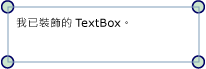

# 裝飾項概觀
裝飾項是特殊類型的 <xref:System.Windows.FrameworkElement>，可用來為使用者提供視覺化提示。  至於其他的用途，裝飾項還可用於將功能控點加入至項目，或提供有關控制項的狀態資訊。  
  
 [!INCLUDE[autoOutline](../Token/autoOutline_md.md)]  
  
   
## 關於裝飾項  
 <xref:System.Windows.Documents.Adorner> 是已繫結至 <xref:System.Windows.UIElement> 的自訂 <xref:System.Windows.FrameworkElement>。  裝飾項會呈現於 <xref:System.Windows.Documents.AdornerLayer> 中，這是個永遠位於已裝飾項目或已裝飾項目集合最上面的呈現介面。  裝飾項的呈現與裝飾項所繫結之 <xref:System.Windows.UIElement> 的呈現無關。  裝飾項的定位通常相對於它所繫結的項目，並採用位於已裝飾項目左上方的標準 2\-D 座標原點。  
  
 裝飾項的一般應用包含：  
  
-   將功能控點加入至 <xref:System.Windows.UIElement>，讓使用者能夠以某種方式操作項目 \(調整大小、旋轉、重新調整位置等\)。  
  
-   提供視覺化回應以表示各種狀態，或回應各種事件。  
  
-   在 <xref:System.Windows.UIElement> 上覆疊視覺化裝飾。  
  
-   以視覺化方式遮蔽或覆寫部分或所有的 <xref:System.Windows.UIElement>。  
  
 [!INCLUDE[TLA#tla_winclient](../../../../includes/tlasharptla-winclient-md.md)] 會提供可供裝飾視覺化項目的基本架構。  下表列出在裝飾物件時使用的主要類型及其目的。  以下是數個使用方式的範例。  
  
|||  
|-|-|  
|<xref:System.Windows.Documents.Adorner>|抽象基底類別，所有具象裝飾項實作都繼承自這個類別。|  
|<xref:System.Windows.Documents.AdornerLayer>|一個類別，表示一個或多個已裝飾項目之裝飾項的轉譯層。|  
|<xref:System.Windows.Documents.AdornerDecorator>|一個類別，能夠讓裝飾項層與項目集合產生關聯。|  
  
   
## 實作自訂裝飾項  
 [!INCLUDE[TLA#tla_winclient](../../../../includes/tlasharptla-winclient-md.md)] 所提供的裝飾項架構主要用於支援自訂裝飾項的建立。  實作繼承自抽象 <xref:System.Windows.Documents.Adorner> 類別的類別，即可建立自訂裝飾項。  
  
> [!NOTE]
>  <xref:System.Windows.Documents.Adorner> 的父代 \(Parent\) 是會呈現 <xref:System.Windows.Documents.Adorner> 的 <xref:System.Windows.Documents.AdornerLayer>，而不是要裝飾的項目。  
  
 下列範例顯示了實作簡單裝飾項的類別。  此範例裝飾項只用圓形來裝飾 <xref:System.Windows.UIElement> 的角落。  
  
 [!code-csharp[Adorners_SimpleCircleAdorner#_SimpleCircleAdornerBody](../../../../samples/snippets/csharp/VS_Snippets_Wpf/Adorners_SimpleCircleAdorner/CSharp/Window1.xaml.cs#_simplecircleadornerbody)]
 [!code-vb[Adorners_SimpleCircleAdorner#_SimpleCircleAdornerBody](../../../../samples/snippets/visualbasic/VS_Snippets_Wpf/Adorners_SimpleCircleAdorner/VisualBasic/Window1.xaml.vb#_simplecircleadornerbody)]  
  
 下列影像顯示已套用至 <xref:System.Windows.Controls.TextBox> 的 SimpleCircleAdorner。  
  
   
  
   
## 裝飾項的呈現行為  
 請特別注意，裝飾項不包含任何繼承呈現行為，以確保裝飾項呈現是裝飾項實作器的職責。  實作呈現行為的常見方式，就是覆寫 <xref:System.Windows.UIElement.OnRender%2A> 方法並視需要使用一個或多個 <xref:System.Windows.Media.DrawingContext> 物件來呈現裝飾項的視覺化項目 \(如上述範例所示\)。  
  
> [!NOTE]
>  任何放在裝飾項層中的項目，都會呈現在其餘您所設定之樣式的上面。  換言之，裝飾項看起來永遠在最上面，而且無法使用[疊置順序](GTMT)加以覆寫。  
  
   
## 事件和點擊測試  
 就像其他 <xref:System.Windows.FrameworkElement> 一樣，裝飾項會接收輸入事件。  因為裝飾項的[疊置順序](GTMT)永遠高於它所裝飾的項目，所以裝飾項會收到輸入事件 \(例如 <xref:System.Windows.UIElement.Drop> 或 <xref:System.Windows.UIElement.MouseMove>\)，這些事件可能主要用於基礎的裝飾項目。  裝飾項可以接聽某些輸入事件，並藉由重新引發事件而將這些輸入事件傳遞到基礎裝飾項目。  
  
 若要啟用裝飾項之下項目的傳遞 \(Pass\-Through\) 點擊測試，請將裝飾項的點擊測試 <xref:System.Windows.UIElement.IsHitTestVisible%2A> 屬性設定為 **false**。  如需點擊測試的詳細資訊，請參閱  
  
 [視覺分層中的點擊測試](../../../../docs/framework/wpf/graphics-multimedia/hit-testing-in-the-visual-layer.md).  
  
   
## 裝飾單一 UIElement  
 若要將裝飾項繫結至特定 <xref:System.Windows.UIElement>，請遵循下列步驟：  
  
1.  呼叫靜態方法 <xref:System.Windows.Documents.AdornerLayer.GetAdornerLayer%2A> 取得 <xref:System.Windows.Documents.AdornerLayer> 物件，以便裝飾 <xref:System.Windows.UIElement>。  <xref:System.Windows.Documents.AdornerLayer.GetAdornerLayer%2A> 會在視覺化樹狀結構中，從指定的 <xref:System.Windows.UIElement> 向上查核，並傳回找到的第一個裝飾項層  \(如果找不到裝飾項層，則方法會傳回 null\)。  
  
2.  呼叫 <xref:System.Windows.Documents.AdornerLayer.Add%2A> 方法，將裝飾項繫結至目標 <xref:System.Windows.UIElement>。  
  
 下列範例會將 SimpleCircleAdorner \(如上所示\) 繫結至名稱為 *myTextBox* 的 <xref:System.Windows.Controls.TextBox>。  
  
 [!code-csharp[Adorners_SimpleCircleAdorner#_AdornSingleElement](../../../../samples/snippets/csharp/VS_Snippets_Wpf/Adorners_SimpleCircleAdorner/CSharp/Window1.xaml.cs#_adornsingleelement)]
 [!code-vb[Adorners_SimpleCircleAdorner#_AdornSingleElement](../../../../samples/snippets/visualbasic/VS_Snippets_Wpf/Adorners_SimpleCircleAdorner/VisualBasic/Window1.xaml.vb#_adornsingleelement)]  
  
> [!NOTE]
>  目前不支援使用[!INCLUDE[TLA#tla_xaml](../../../../includes/tlasharptla-xaml-md.md)] 將裝飾項繫結至另一個項目。  
  
   
## 裝飾面板的子系  
 若要將裝飾項繫結至 <xref:System.Windows.Controls.Panel> 的子系，請遵循下列步驟：  
  
1.  呼叫 `static` 方法 <xref:System.Windows.Documents.AdornerLayer.GetAdornerLayer%2A>，以尋找您要為其子系進行裝飾之項目的裝飾項層。  
  
2.  列舉父項目的所有子系並呼叫 <xref:System.Windows.Documents.AdornerLayer.Add%2A> 方法，將裝飾項繫結至每個子項目。  
  
 下列範例會將 SimpleCircleAdorner \(如上所示\) 繫結至名稱為 *myStackPanel* 之 <xref:System.Windows.Controls.StackPanel> 的子系。  
  
 [!code-csharp[Adorners_SimpleCircleAdorner#_AdornChildren](../../../../samples/snippets/csharp/VS_Snippets_Wpf/Adorners_SimpleCircleAdorner/CSharp/Window1.xaml.cs#_adornchildren)]
 [!code-vb[Adorners_SimpleCircleAdorner#_AdornChildren](../../../../samples/snippets/visualbasic/VS_Snippets_Wpf/Adorners_SimpleCircleAdorner/VisualBasic/Window1.xaml.vb#_adornchildren)]  
  
## 請參閱  
 <xref:System.Windows.Media.AdornerHitTestResult>   
 [WPF 中圖案和基本繪圖概觀](../../../../docs/framework/wpf/graphics-multimedia/shapes-and-basic-drawing-in-wpf-overview.md)   
 [使用影像、繪圖和視覺效果繪製](../../../../docs/framework/wpf/graphics-multimedia/painting-with-images-drawings-and-visuals.md)   
 [繪圖物件概觀](../../../../docs/framework/wpf/graphics-multimedia/drawing-objects-overview.md)   
 [HOW TO 主題](../../../../docs/framework/wpf/controls/adorners-how-to-topics.md)