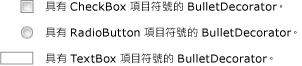

# BulletDecorator
<xref:System.Windows.Controls.Primitives.BulletDecorator> 有兩個內容屬性：<xref:System.Windows.Controls.Primitives.BulletDecorator.Bullet%2A>和<xref:System.Windows.Controls.Decorator.Child%2A>。 <xref:System.Windows.Controls.Primitives.BulletDecorator.Bullet%2A>屬性會定義<xref:System.Windows.UIElement>來做為項目符號。 <xref:System.Windows.Controls.Decorator.Child%2A>屬性會定義<xref:System.Windows.UIElement>以視覺化方式符合項目符號。  
  
 下圖顯示使用控制項的範例<xref:System.Windows.Controls.Primitives.BulletDecorator>。  
  
   
  
## 參考資料  
 <xref:System.Windows.Controls.Primitives.BulletDecorator>
