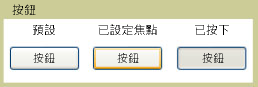

# 按鈕
A<xref:System.Windows.Controls.Button>控制項從滑鼠、 鍵盤、 手寫筆或其他輸入的裝置及引發回應使用者輸入<xref:System.Windows.Controls.Primitives.ButtonBase.Click>事件。 A<xref:System.Windows.Controls.Button>是基本[!INCLUDE[TLA#tla_ui](../../../../includes/tlasharptla-ui-md.md)]元件，可包含簡單內容，例如文字，而且也可以包含複雜的內容，例如影像和<xref:System.Windows.Controls.Panel>控制項。  
  
   
  
## 本節內容  
 [建立具有影像的按鈕](../../../../docs/framework/wpf/controls/how-to-create-a-button-that-has-an-image.md)  
  
## 參考資料  
 <xref:System.Windows.Controls.Button>  
 <xref:System.Windows.Controls.Primitives.ButtonBase>  
 <xref:System.Windows.Controls.RadioButton>  
 <xref:System.Windows.Controls.Primitives.RepeatButton>
