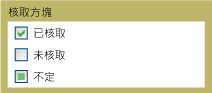

# 核取方塊
您可以使用<xref:System.Windows.Controls.CheckBox>中[!INCLUDE[TLA#tla_ui](../../../../includes/tlasharptla-ui-md.md)]應用程式代表使用者可以選取或清除的選項。 您可以使用單一的核取方塊，或您可以將群組兩個或多個核取方塊。  
  
 下圖顯示之不同狀態的<xref:System.Windows.Controls.CheckBox>。  
  
   
在不同狀態的核取方塊控制項  
  
## 參考資料  
 <xref:System.Windows.Controls.CheckBox>  
  <xref:System.Windows.Controls.RadioButton>  
  <xref:System.Windows.Controls.Primitives.ButtonBase>  
  <xref:System.Windows.Controls.Primitives.RepeatButton>  
  
## 相關章節
