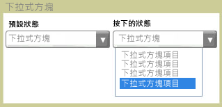

# ComboBox
<xref:System.Windows.Controls.ComboBox>控制向使用者呈現選項的清單。 清單會顯示和隱藏控制項展開和摺疊。 在其預設狀態下，清單會摺疊，顯示只有一個選擇。 使用者按一下按鈕以查看完整的選項清單。  
  
 下圖顯示<xref:System.Windows.Controls.ComboBox>不同狀態。  
  
   
摺疊和展開  
  
## 本節內容  
 [如何： 取得 ComboBoxItem](http://msdn.microsoft.com/en-us/8a0d2622-64b6-41fc-bf80-9669a1eacb53)  
  
## 參考資料  
 <xref:System.Windows.Controls.ComboBox>
