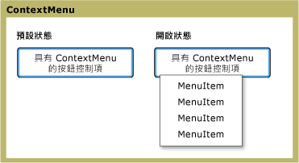

# ContextMenu
<xref:System.Windows.Controls.ContextMenu>可讓控制項以顯示<xref:System.Windows.Controls.Menu>專屬於控制項的內容。 一般而言，<xref:System.Windows.Controls.ContextMenu>中公開[!INCLUDE[TLA#tla_ui](../../../../includes/tlasharptla-ui-md.md)]透過滑鼠按鈕或鍵盤的功能表按鈕。  
  
 下圖說明<xref:System.Windows.Controls.ContextMenu>處於兩種不同的狀態： 預設狀態及開啟狀態。 在預設狀態下，會摺疊控制項。 功能表的父透過按下滑鼠右按鈕時，控制項就會展開，並會顯示功能表項目。  
  
   
ContextMenu 不同狀態  
  
## 本節內容  
 [ContextMenu 概觀](../../../../docs/framework/wpf/controls/contextmenu-overview.md)  
  
## 參考資料  
 <xref:System.Windows.Controls.ContextMenu>  
  
## 相關章節
