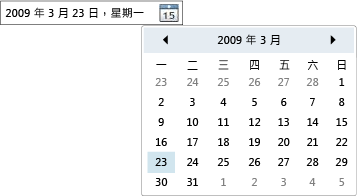

# DatePicker
<xref:System.Windows.Controls.DatePicker> 控制項可讓使用者選取日期，其方式是將它輸入文字欄位中，或是使用下拉式 <xref:System.Windows.Controls.Calendar> 控制項。  
  
 下圖顯示 <xref:System.Windows.Controls.DatePicker>。  
  
   
DatePicker 控制項  
  
 <xref:System.Windows.Controls.DatePicker> 控制項的許多屬性都是用來管理其內建 <xref:System.Windows.Controls.Calendar>，而且功能與 <xref:System.Windows.Controls.Calendar> 中的同等屬性相同。  特別是，<xref:System.Windows.Controls.DatePicker.IsTodayHighlighted%2A?displayProperty=fullName>、<xref:System.Windows.Controls.DatePicker.FirstDayOfWeek%2A?displayProperty=fullName>、<xref:System.Windows.Controls.DatePicker.BlackoutDates%2A?displayProperty=fullName>、<xref:System.Windows.Controls.DatePicker.DisplayDateStart%2A?displayProperty=fullName>、<xref:System.Windows.Controls.DatePicker.DisplayDateEnd%2A?displayProperty=fullName>、<xref:System.Windows.Controls.DatePicker.DisplayDate%2A?displayProperty=fullName> 和 <xref:System.Windows.Controls.DatePicker.SelectedDate%2A?displayProperty=fullName> 屬性的運作方式與其 <xref:System.Windows.Controls.Calendar> 對應項目相同。  如需詳細資訊，請參閱 <xref:System.Windows.Controls.Calendar>。  
  
 使用者可以將日期直接輸入文字欄位中，此欄位會設定 <xref:System.Windows.Controls.DatePicker.Text%2A> 屬性。  如果 <xref:System.Windows.Controls.DatePicker> 無法將輸入的字串轉換成有效的日期，將會引發 <xref:System.Windows.Controls.DatePicker.DateValidationError> 事件。  根據預設，這樣會造成例外狀況 \(Exception\)，但是 <xref:System.Windows.Controls.DatePicker.DateValidationError> 的事件處理常式可以將 <xref:System.Windows.Controls.DatePickerDateValidationErrorEventArgs.ThrowException%2A> 屬性設定為 `false`，並防止例外狀況的引發。  
  
## 請參閱  
 [控制項](../../../../docs/framework/wpf/controls/index.md)   
 [設定樣式和範本](../../../../docs/framework/wpf/controls/styling-and-templating.md)