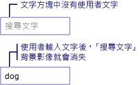

# HOW TO：將浮水印加入至 TextBox
下列範例示範如何協助的可用性<xref:System.Windows.Controls.TextBox>藉由顯示說明的背景映像內<xref:System.Windows.Controls.TextBox>直到使用者輸入文字，此時映像會移除。 此外，背景影像是一次時還原使用者移除他們的意見。 請參閱下圖。  
  
   
  
> [!NOTE]
>  而是，則只需要管理此範例中使用的背景影像的原因<xref:System.Windows.Controls.TextBox.Text%2A>屬性<xref:System.Windows.Controls.TextBox>，是背景映像不會干擾資料繫結。  
  
## 範例  
 [!code-xaml[TextBoxMiscSnippets_snip#TextBoxBackgroundExampleWholePage](~/samples/snippets/csharp/VS_Snippets_Wpf/TextBoxMiscSnippets_snip/csharp/textbox_with_background_image.xaml#textboxbackgroundexamplewholepage)]  
  
 [!code-csharp[TextBoxMiscSnippets_snip#TextBoxBackgroundCodeExampleWholePage](~/samples/snippets/csharp/VS_Snippets_Wpf/TextBoxMiscSnippets_snip/csharp/textbox_with_background_image.xaml.cs#textboxbackgroundcodeexamplewholepage)]
 [!code-vb[TextBoxMiscSnippets_snip#TextBoxBackgroundCodeExampleWholePage](~/samples/snippets/visualbasic/VS_Snippets_Wpf/TextBoxMiscSnippets_snip/visualbasic/textbox_with_background_image.xaml.vb#textboxbackgroundcodeexamplewholepage)]  
  
## 另請參閱
- [TextBox 概觀](textbox-overview.md)
- [RichTextBox 概觀](richtextbox-overview.md)
