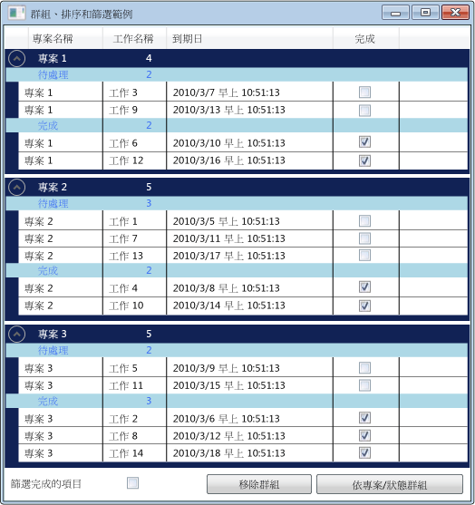

# HOW TO：群組、 排序和 DataGrid 控制項中的篩選資料

通常很有用，檢視中的資料<xref:System.Windows.Controls.DataGrid>以不同的方式，藉由將分組、 排序和篩選資料。 群組、 排序和篩選中的資料<xref:System.Windows.Controls.DataGrid>，將它繫結<xref:System.Windows.Data.CollectionView>支援這些函式。 您可以使用中的資料<xref:System.Windows.Data.CollectionView>而不會影響基礎來源資料。 集合檢視中的變更會反映在<xref:System.Windows.Controls.DataGrid>使用者介面 (UI)。

<xref:System.Windows.Data.CollectionView>類別會提供群組和排序的資料來源會實作功能<xref:System.Collections.IEnumerable>介面。 <xref:System.Windows.Data.CollectionViewSource>類別可讓您設定的屬性<xref:System.Windows.Data.CollectionView>從 XAML。

在此範例中，一堆`Task`物件的繫結至<xref:System.Windows.Data.CollectionViewSource>。 <xref:System.Windows.Data.CollectionViewSource>做為<xref:System.Windows.Controls.ItemsControl.ItemsSource%2A>如<xref:System.Windows.Controls.DataGrid>。 分組、 排序和篩選會對<xref:System.Windows.Data.CollectionViewSource>而且會顯示在<xref:System.Windows.Controls.DataGrid>UI。

 DataGrid 中的群組資料

## 使用 CollectionViewSource ItemsSource

要分組、 排序和篩選中的資料<xref:System.Windows.Controls.DataGrid>控制項，您將繫結<xref:System.Windows.Controls.DataGrid>到<xref:System.Windows.Data.CollectionView>支援這些函式。 在此範例中，<xref:System.Windows.Controls.DataGrid>繫結至<xref:System.Windows.Data.CollectionViewSource>提供的這些函式<xref:System.Collections.Generic.List%601>的`Task`物件。

### 若要將 DataGrid 繫結至 CollectionViewSource

1. 建立資料集合，實作<xref:System.Collections.IEnumerable>介面。

    如果您使用<xref:System.Collections.Generic.List%601>若要建立您的集合，您應該建立新的類別繼承自<xref:System.Collections.Generic.List%601>而不是具現化的執行個體<xref:System.Collections.Generic.List%601>。 這可讓您為資料繫結至 XAML 中的集合。

    > [!NOTE]
    > 集合中的物件必須實作<xref:System.ComponentModel.INotifyPropertyChanged>已變更的介面和<xref:System.ComponentModel.IEditableObject>為了讓介面<xref:System.Windows.Controls.DataGrid>來正確回應屬性變更及編輯。 如需詳細資訊，請參閱[實作屬性變更通知](../data/how-to-implement-property-change-notification.md)。

    [!code-csharp[DataGrid_GroupSortFilter#101](~/samples/snippets/csharp/VS_Snippets_Wpf/DataGrid_GroupSortFilter/CS/MainWindow.xaml.cs#101)]
    [!code-vb[DataGrid_GroupSortFilter#101](~/samples/snippets/visualbasic/VS_Snippets_Wpf/DataGrid_GroupSortFilter/VB/MainWindow.xaml.vb#101)]

2. 在 XAML，請在建立集合類別的執行個體，並設定[X:key 指示詞](../../xaml-services/x-key-directive.md)。

3. 在 XAML 中，建立的執行個體<xref:System.Windows.Data.CollectionViewSource>類別中，將[X:key 指示詞](../../xaml-services/x-key-directive.md)，並設定您的集合類別做為執行個體<xref:System.Windows.Data.CollectionViewSource.Source%2A>。

    [!code-xaml[DataGrid_GroupSortFilter#201](~/samples/snippets/csharp/VS_Snippets_Wpf/DataGrid_GroupSortFilter/CS/WindowSnips1.xaml#201)]

4. 建立的執行個體<xref:System.Windows.Controls.DataGrid>類別，並設定<xref:System.Windows.Controls.ItemsControl.ItemsSource%2A>屬性設<xref:System.Windows.Data.CollectionViewSource>。

    [!code-xaml[DataGrid_GroupSortFilter#002](~/samples/snippets/csharp/VS_Snippets_Wpf/DataGrid_GroupSortFilter/CS/MainWindow.xaml#002)]

5. 若要存取<xref:System.Windows.Data.CollectionViewSource>從您的程式碼中，使用<xref:System.Windows.Data.CollectionViewSource.GetDefaultView%2A>方法來取得參考<xref:System.Windows.Data.CollectionViewSource>。

    [!code-csharp[DataGrid_GroupSortFilter#102](~/samples/snippets/csharp/VS_Snippets_Wpf/DataGrid_GroupSortFilter/CS/MainWindow.xaml.cs#102)]
    [!code-vb[DataGrid_GroupSortFilter#102](~/samples/snippets/visualbasic/VS_Snippets_Wpf/DataGrid_GroupSortFilter/VB/MainWindow.xaml.vb#102)]

## DataGrid 中分組項目

若要指定如何在分組項目<xref:System.Windows.Controls.DataGrid>，您使用<xref:System.Windows.Data.PropertyGroupDescription>類型來分組來源檢視中的項目。

### 使用 XAML 的 DataGrid 中的群組項目

1. 建立<xref:System.Windows.Data.PropertyGroupDescription>，指定要依群組的屬性。 在 XAML 或程式碼中，您可以指定屬性。

   1. 在 XAML 中，設定<xref:System.Windows.Data.PropertyGroupDescription.PropertyName%2A>可依群組屬性的名稱。

   2. 程式碼中，將屬性的名稱傳遞至建構函式的群組。

2. 新增<xref:System.Windows.Data.PropertyGroupDescription>至<xref:System.Windows.Data.CollectionViewSource.GroupDescriptions%2A?displayProperty=nameWithType>集合。

3. 新增的其他執行個體<xref:System.Windows.Data.PropertyGroupDescription>至<xref:System.Windows.Data.CollectionViewSource.GroupDescriptions%2A>来加入多個層級的群組集合。

    [!code-xaml[DataGrid_GroupSortFilter#012](~/samples/snippets/csharp/VS_Snippets_Wpf/DataGrid_GroupSortFilter/CS/MainWindow.xaml#012)]
    [!code-csharp[DataGrid_GroupSortFilter#112](~/samples/snippets/csharp/VS_Snippets_Wpf/DataGrid_GroupSortFilter/CS/MainWindow.xaml.cs#112)]
    [!code-vb[DataGrid_GroupSortFilter#112](~/samples/snippets/visualbasic/VS_Snippets_Wpf/DataGrid_GroupSortFilter/VB/MainWindow.xaml.vb#112)]

4. 若要移除群組，請移除<xref:System.Windows.Data.PropertyGroupDescription>從<xref:System.Windows.Data.CollectionViewSource.GroupDescriptions%2A>集合。

5. 若要移除所有群組，請呼叫<xref:System.Collections.ObjectModel.Collection%601.Clear%2A>方法的<xref:System.Windows.Data.CollectionViewSource.GroupDescriptions%2A>集合。

    [!code-csharp[DataGrid_GroupSortFilter#114](~/samples/snippets/csharp/VS_Snippets_Wpf/DataGrid_GroupSortFilter/CS/MainWindow.xaml.cs#114)]
    [!code-vb[DataGrid_GroupSortFilter#114](~/samples/snippets/visualbasic/VS_Snippets_Wpf/DataGrid_GroupSortFilter/VB/MainWindow.xaml.vb#114)]

當項目會分組放入<xref:System.Windows.Controls.DataGrid>，您可以定義<xref:System.Windows.Controls.GroupStyle>指定每個群組的外觀。 您套用<xref:System.Windows.Controls.GroupStyle>將它加入至<xref:System.Windows.Controls.ItemsControl.GroupStyle%2A>DataGrid 的集合。 如果您有多個層級的群組，您可以套用到每個群組層級的不同的樣式。 樣式定義所在的順序套用。 比方說，如果您定義兩種樣式，第一個會套用到上方的層級資料列群組。 第二個的樣式會套用至第二個層級的所有資料列群組和較低。 <xref:System.Windows.FrameworkElement.DataContext%2A>的<xref:System.Windows.Controls.GroupStyle>是<xref:System.Windows.Data.CollectionViewGroup>群組代表。

### 若要變更資料列群組標頭的外觀

1. 建立<xref:System.Windows.Controls.GroupStyle>，定義資料列群組的外觀。

2. 放<xref:System.Windows.Controls.GroupStyle>內`<DataGrid.GroupStyle>`標記。

    [!code-xaml[DataGrid_GroupSortFilter#003](~/samples/snippets/csharp/VS_Snippets_Wpf/DataGrid_GroupSortFilter/CS/MainWindow.xaml#003)]

## 排序 DataGrid 中的項目

若要指定項目會按照<xref:System.Windows.Controls.DataGrid>，您使用<xref:System.ComponentModel.SortDescription>要排序的來源檢視中的項目型別。

### 若要排序 DataGrid 中的項目

1. 建立<xref:System.ComponentModel.SortDescription>，指定排序所依據的屬性。 在 XAML 或程式碼中，您可以指定屬性。

    1. 在 XAML 中，設定<xref:System.ComponentModel.SortDescription.PropertyName%2A>排序所依據之屬性的名稱。

    2. 在程式碼中，會傳遞要排序之屬性的名稱和<xref:System.ComponentModel.ListSortDirection>建構函式。

2. 新增<xref:System.ComponentModel.SortDescription>至<xref:System.Windows.Data.CollectionViewSource.SortDescriptions%2A?displayProperty=nameWithType>集合。

3. 新增的其他執行個體<xref:System.ComponentModel.SortDescription>至<xref:System.Windows.Data.CollectionViewSource.SortDescriptions%2A>依其他屬性排序的集合。

    [!code-xaml[DataGrid_GroupSortFilter#011](~/samples/snippets/csharp/VS_Snippets_Wpf/DataGrid_GroupSortFilter/CS/MainWindow.xaml#011)]
    [!code-csharp[DataGrid_GroupSortFilter#211](~/samples/snippets/csharp/VS_Snippets_Wpf/DataGrid_GroupSortFilter/CS/WindowSnips1.xaml.cs#211)]
    [!code-vb[DataGrid_GroupSortFilter#211](~/samples/snippets/visualbasic/VS_Snippets_Wpf/DataGrid_GroupSortFilter/VB/MainWindow.xaml.vb#211)]

## 篩選 DataGrid 中的項目

中的篩選器項目<xref:System.Windows.Controls.DataGrid>使用<xref:System.Windows.Data.CollectionViewSource>，您提供的處理常式中的篩選邏輯<xref:System.Windows.Data.CollectionViewSource.Filter?displayProperty=nameWithType>事件。

### 若要篩選的 DataGrid 中的項目

1. 加入的處理常式<xref:System.Windows.Data.CollectionViewSource.Filter?displayProperty=nameWithType>事件。

2. 在 <xref:System.Windows.Data.CollectionViewSource.Filter>事件處理常式，定義篩選的邏輯。

    每次重新整理檢視，將會套用篩選條件。

    [!code-xaml[DataGrid_GroupSortFilter#013](~/samples/snippets/csharp/VS_Snippets_Wpf/DataGrid_GroupSortFilter/CS/MainWindow.xaml#013)]
    [!code-csharp[DataGrid_GroupSortFilter#113](~/samples/snippets/csharp/VS_Snippets_Wpf/DataGrid_GroupSortFilter/CS/MainWindow.xaml.cs#113)]
    [!code-vb[DataGrid_GroupSortFilter#113](~/samples/snippets/visualbasic/VS_Snippets_Wpf/DataGrid_GroupSortFilter/VB/MainWindow.xaml.vb#113)]

或者，您可以在此篩選中的項目<xref:System.Windows.Controls.DataGrid>藉由建立方法，提供篩選邏輯和設定<xref:System.Windows.Data.CollectionView.Filter%2A?displayProperty=nameWithType>將篩選套用到的屬性。 若要查看這個方法的範例，請參閱[檢視中的篩選資料](../data/how-to-filter-data-in-a-view.md)。

## 範例

下列範例示範如何分組、 排序和篩選`Task`中的資料<xref:System.Windows.Data.CollectionViewSource>和顯示分組、 排序和篩選`Task`中的資料<xref:System.Windows.Controls.DataGrid>。 <xref:System.Windows.Data.CollectionViewSource>做為<xref:System.Windows.Controls.ItemsControl.ItemsSource%2A>如<xref:System.Windows.Controls.DataGrid>。 分組、 排序和篩選會對<xref:System.Windows.Data.CollectionViewSource>而且會顯示在<xref:System.Windows.Controls.DataGrid>UI。

若要測試此範例中，您必須調整 DGGroupSortFilterExample 名稱以符合您的專案名稱。 如果您使用 Visual Basic，您必須變更類別名稱<xref:System.Windows.Window>如下。

`<Window x:Class="MainWindow"`

[!code-xaml[DataGrid_GroupSortFilter#000](~/samples/snippets/csharp/VS_Snippets_Wpf/DataGrid_GroupSortFilter/CS/MainWindow.xaml#000)]
[!code-csharp[DataGrid_GroupSortFilter#100](~/samples/snippets/csharp/VS_Snippets_Wpf/DataGrid_GroupSortFilter/CS/MainWindow.xaml.cs#100)]
[!code-vb[DataGrid_GroupSortFilter#100](~/samples/snippets/visualbasic/VS_Snippets_Wpf/DataGrid_GroupSortFilter/VB/MainWindow.xaml.vb#100)]

## 另請參閱

- [資料繫結概觀](../data/data-binding-overview.md)
- [建立和繫結至 ObservableCollection](../data/how-to-create-and-bind-to-an-observablecollection.md)
- [篩選檢視中的資料](../data/how-to-filter-data-in-a-view.md)
- [排序檢視中的資料](../data/how-to-sort-data-in-a-view.md)
- [使用 XAML 中的檢視排序和群組資料](../data/how-to-sort-and-group-data-using-a-view-in-xaml.md)
