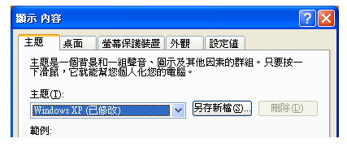

# ThisAddInLabel
<xref:System.Windows.Controls.Label>控制項通常會提供資訊清單中的[!INCLUDE[TLA#tla_ui](../../../../includes/tlasharptla-ui-md.md)]。<xref:System.Windows.Controls.Label> controls usually provide information in the [!INCLUDE[TLA#tla_ui](../../../../includes/tlasharptla-ui-md.md)].  在過去，<xref:System.Windows.Controls.Label>已包含僅限文字，但因為<xref:System.Windows.Controls.Label>隨附[!INCLUDE[TLA#tla_winclient](../../../../includes/tlasharptla-winclient-md.md)]是<xref:System.Windows.Controls.ContentControl>，它可以包含任一個文字或<xref:System.Windows.UIElement>。Historically, a <xref:System.Windows.Controls.Label> has contained only text, but because the <xref:System.Windows.Controls.Label> that ships with [!INCLUDE[TLA#tla_winclient](../../../../includes/tlasharptla-winclient-md.md)] is a <xref:System.Windows.Controls.ContentControl>, it can contain either text or a <xref:System.Windows.UIElement>.  
  
 A<xref:System.Windows.Controls.Label>提供便捷鍵的功能和視覺支援。A <xref:System.Windows.Controls.Label> provides both functional and visual support for access keys. 它經常會用來啟用快速鍵盤存取控制項，例如<xref:System.Windows.Controls.TextBox>。It is frequently used to enable quick keyboard access to controls such as a <xref:System.Windows.Controls.TextBox>. 若要指派<xref:System.Windows.Controls.Label>至<xref:System.Windows.Controls.Control>，將<xref:System.Windows.Controls.Label.Target%2A?displayProperty=nameWithType>控制項取得焦點時使用者按下便捷鍵的屬性。To assign a <xref:System.Windows.Controls.Label> to a <xref:System.Windows.Controls.Control>, set the <xref:System.Windows.Controls.Label.Target%2A?displayProperty=nameWithType> property to the control that should get focus when the user presses the access key.  
  
 下圖顯示<xref:System.Windows.Controls.Label>為目標的 「 主題 」 <xref:System.Windows.Controls.ComboBox>。The following image shows a <xref:System.Windows.Controls.Label> "Themes" that targets a <xref:System.Windows.Controls.ComboBox>.  當使用者按 enter 時，<xref:System.Windows.Controls.ComboBox>接收焦點。When the user presses , the <xref:System.Windows.Controls.ComboBox> receives focus.  如需詳細資訊，請參閱[How to： 設定目標內容的標籤](http://msdn.microsoft.com/en-us/b24c6977-ebcb-4855-a9bb-3fd4435af8f8)。For more information, see [How to: Set the Target Property of a Label](http://msdn.microsoft.com/en-us/b24c6977-ebcb-4855-a9bb-3fd4435af8f8).  
  
   
  
## 本節內容In This Section  
 [操作說明：設定標籤的目標屬性How to: Set the Target Property of a Label](http://msdn.microsoft.com/en-us/b24c6977-ebcb-4855-a9bb-3fd4435af8f8)  
  
## 參考資料Reference  
 <xref:System.Windows.Controls.Label>
