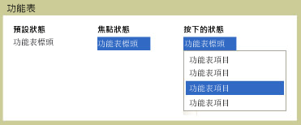

# 功能表
A<xref:System.Windows.Controls.Menu>是控制項可讓命令或事件處理常式相關聯的項目階層式組織。 每個<xref:System.Windows.Controls.Menu>可以包含多個<xref:System.Windows.Controls.MenuItem>控制項。 每個<xref:System.Windows.Controls.MenuItem>可以叫用命令，或叫用`Click`事件處理常式。 A<xref:System.Windows.Controls.MenuItem>也可以有多個<xref:System.Windows.Controls.MenuItem>做為子系，形成子功能表項目。  
  
 下圖顯示的功能表控制項的三種不同狀態。 預設狀態是任何裝置，例如滑鼠指標位於上時<xref:System.Windows.Controls.Menu>。 焦點狀態發生於滑鼠指標停留<xref:System.Windows.Controls.Menu>和透過按下滑鼠按鈕時，就會發生狀態為 pressed <xref:System.Windows.Controls.Menu>。  
  
   
功能表中的不同狀態  
  
## 本節內容  
 [功能表概觀](../../../../docs/framework/wpf/controls/menu-overview.md)  
  
## 參考資料  
 <xref:System.Windows.Controls.Menu>  
  <xref:System.Windows.Controls.MenuItem>  
  <xref:System.Windows.Controls.Primitives.MenuBase>  
  <xref:System.Windows.Controls.ContextMenu>  
  
## 相關章節
