# 快顯功能表放置行為
A<xref:System.Windows.Controls.Primitives.Popup>控制會漂浮在應用程式的另一個視窗，顯示內容。 您可以指定的位置<xref:System.Windows.Controls.Primitives.Popup>相對於控制項、 滑鼠或使用螢幕<xref:System.Windows.Controls.Primitives.Popup.PlacementTarget%2A>， <xref:System.Windows.Controls.Primitives.Popup.Placement%2A>， <xref:System.Windows.Controls.Primitives.Popup.PlacementRectangle%2A>， <xref:System.Windows.Controls.Primitives.Popup.HorizontalOffset%2A>，和<xref:System.Windows.Controls.Primitives.Popup.VerticalOffset%2A>屬性。  這些屬性搭配使用可讓您在指定位置的彈性<xref:System.Windows.Controls.Primitives.Popup>。  
  
> [!NOTE]
>  <xref:System.Windows.Controls.ToolTip>和<xref:System.Windows.Controls.ContextMenu>類別也定義這五個屬性和行為類似。  
  

  
   
## 設定快顯位置  
 位置的<xref:System.Windows.Controls.Primitives.Popup>可以是相對於<xref:System.Windows.UIElement>或整個螢幕。  下列範例會建立四個<xref:System.Windows.Controls.Primitives.Popup>控制項的相對<xref:System.Windows.UIElement>— 在此情況下，映像。 所有的<xref:System.Windows.Controls.Primitives.Popup>控制項有<xref:System.Windows.Controls.Primitives.Popup.PlacementTarget%2A>屬性設定為`image1`，但每個<xref:System.Windows.Controls.Primitives.Popup>有不同的位置屬性的值。  
  
 [!code-xaml[PopupPositionSnippet#3](../../../../samples/snippets/csharp/VS_Snippets_Wpf/PopupPositionSnippet/CS/Window1.xaml#3)]  
  
 下圖顯示映像和<xref:System.Windows.Controls.Primitives.Popup>控制項  
  
   
搭配四個快顯的影像  
  
 這個簡單的範例示範如何設定<xref:System.Windows.Controls.Primitives.Popup.PlacementTarget%2A>和<xref:System.Windows.Controls.Primitives.Popup.Placement%2A>屬性，但使用<xref:System.Windows.Controls.Primitives.Popup.PlacementRectangle%2A>， <xref:System.Windows.Controls.Primitives.Popup.HorizontalOffset%2A>，和<xref:System.Windows.Controls.Primitives.Popup.VerticalOffset%2A>屬性，您有更多控制 where<xref:System.Windows.Controls.Primitives.Popup>位於。  
  
   
## 詞彙定義︰快顯剖析  
 下列詞彙是應該有助於了解如何<xref:System.Windows.Controls.Primitives.Popup.PlacementTarget%2A>， <xref:System.Windows.Controls.Primitives.Popup.Placement%2A>， <xref:System.Windows.Controls.Primitives.Popup.PlacementRectangle%2A>， <xref:System.Windows.Controls.Primitives.Popup.HorizontalOffset%2A>，和<xref:System.Windows.Controls.Primitives.Popup.VerticalOffset%2A>屬性相互關聯和<xref:System.Windows.Controls.Primitives.Popup>:  
  
-   目標物件  
  
-   目標區域  
  
-   目標原點  
  
-   快顯對齊點  
  
 這些授權條款提供便利的方式來參考的各種層面<xref:System.Windows.Controls.Primitives.Popup>以及其相關聯的控制項。  
  
### 目標物件  
 *目標物件*是項目，<xref:System.Windows.Controls.Primitives.Popup>相關聯。 如果<xref:System.Windows.Controls.Primitives.Popup.PlacementTarget%2A>屬性設定，它會指定目標物件。  如果<xref:System.Windows.Controls.Primitives.Popup.PlacementTarget%2A>未設定，而<xref:System.Windows.Controls.Primitives.Popup>具有父代，父代是目標物件。  如果沒有任何<xref:System.Windows.Controls.Primitives.Popup.PlacementTarget%2A>值並沒有父代，沒有目標的物件，而<xref:System.Windows.Controls.Primitives.Popup>相對於螢幕。  
  
 下列範例會建立<xref:System.Windows.Controls.Primitives.Popup>也就是子系<xref:System.Windows.Controls.Canvas>。  此範例不會設定<xref:System.Windows.Controls.Primitives.Popup.PlacementTarget%2A>屬性<xref:System.Windows.Controls.Primitives.Popup>。 預設值為<xref:System.Windows.Controls.Primitives.Popup.Placement%2A>是<xref:System.Windows.Controls.Primitives.PlacementMode.Bottom?displayProperty=nameWithType>，因此<xref:System.Windows.Controls.Primitives.Popup>下方會出現<xref:System.Windows.Controls.Canvas>。  
  
 [!code-xaml[PopupPositionSnippet#1](../../../../samples/snippets/csharp/VS_Snippets_Wpf/PopupPositionSnippet/CS/Window1.xaml#1)]  
  
 下圖顯示<xref:System.Windows.Controls.Primitives.Popup>的相對位置<xref:System.Windows.Controls.Canvas>。  
  
   
沒有 PlacementTarget 的快顯  
  
 下列範例會建立<xref:System.Windows.Controls.Primitives.Popup>也就是子系<xref:System.Windows.Controls.Canvas>，但這次<xref:System.Windows.Controls.Primitives.Popup.PlacementTarget%2A>設`ellipse1`，因此快顯視窗會出現下方<xref:System.Windows.Shapes.Ellipse>。  
  
 [!code-xaml[PopupPositionSnippet#2](../../../../samples/snippets/csharp/VS_Snippets_Wpf/PopupPositionSnippet/CS/Window1.xaml#2)]  
  
 下圖顯示<xref:System.Windows.Controls.Primitives.Popup>的相對位置<xref:System.Windows.Shapes.Ellipse>。  
  
   
具有 PlacementTarget 的快顯  
  
> [!NOTE]
>  如<xref:System.Windows.Controls.ToolTip>的預設值<xref:System.Windows.Controls.Primitives.Popup.Placement%2A>是<xref:System.Windows.Controls.Primitives.PlacementMode.Mouse>。  如<xref:System.Windows.Controls.ContextMenu>的預設值<xref:System.Windows.Controls.Primitives.Popup.Placement%2A>是<xref:System.Windows.Controls.Primitives.PlacementMode.MousePoint>。 稍後在＜屬性如何一起運作＞中會說明這些值。  
  
### 目標區域  
 *目標區域*是在螢幕上的區域，<xref:System.Windows.Controls.Primitives.Popup>相對於。 在上一個範例中，<xref:System.Windows.Controls.Primitives.Popup>對齊界限的目標物件，但在某些情況下，<xref:System.Windows.Controls.Primitives.Popup>對齊其他範圍中，即使<xref:System.Windows.Controls.Primitives.Popup>都有一個目標物件。  如果<xref:System.Windows.Controls.Primitives.Popup.PlacementRectangle%2A>屬性設定，則目標區域是不同於目標物件的界限。  
  
 下列範例會建立兩個<xref:System.Windows.Controls.Canvas>物件，其中包含每個<xref:System.Windows.Shapes.Rectangle>和<xref:System.Windows.Controls.Primitives.Popup>。  在這兩種情況下，目標物件<xref:System.Windows.Controls.Primitives.Popup>是<xref:System.Windows.Controls.Canvas>。 <xref:System.Windows.Controls.Primitives.Popup>在第一個<xref:System.Windows.Controls.Canvas>具有<xref:System.Windows.Controls.Primitives.Popup.PlacementRectangle%2A>設定，以其<xref:System.Windows.Rect.X%2A>， <xref:System.Windows.Rect.Y%2A>， <xref:System.Windows.Rect.Width%2A>，和<xref:System.Windows.Rect.Height%2A>屬性分別設定為 50，50，50，100。 <xref:System.Windows.Controls.Primitives.Popup>中第二個<xref:System.Windows.Controls.Canvas>沒有<xref:System.Windows.Controls.Primitives.Popup.PlacementRectangle%2A>設定。  如此一來，第一個<xref:System.Windows.Controls.Primitives.Popup>放置之下<xref:System.Windows.Controls.Primitives.Popup.PlacementRectangle%2A>，第二個<xref:System.Windows.Controls.Primitives.Popup>放置之下<xref:System.Windows.Controls.Canvas>。 每個<xref:System.Windows.Controls.Canvas>也包含<xref:System.Windows.Shapes.Rectangle>具有相同的範圍為<xref:System.Windows.Controls.Primitives.Popup.PlacementRectangle%2A>第一個<xref:System.Windows.Controls.Primitives.Popup>。  請注意，<xref:System.Windows.Controls.Primitives.Popup.PlacementRectangle%2A>不會建立可見的項目中的應用程式; 此範例會建立<xref:System.Windows.Shapes.Rectangle>來代表<xref:System.Windows.Controls.Primitives.Popup.PlacementRectangle%2A>。  
  
 [!code-xaml[PopupPositionSnippet#4](../../../../samples/snippets/csharp/VS_Snippets_Wpf/PopupPositionSnippet/CS/Window1.xaml#4)]  
  
 下圖顯示上述範例的結果。  
  
   
具有和沒有 PlacementRectangle 的快顯  
  
### 目標原點和快顯對齊點  
 「目標原點」和「快顯對齊點」分別是目標區域和快顯上的參考點，用來進行定位。 您可以使用<xref:System.Windows.Controls.Primitives.Popup.HorizontalOffset%2A>和<xref:System.Windows.Controls.Primitives.Popup.VerticalOffset%2A>位移目標區域從快顯視窗的內容。  <xref:System.Windows.Controls.Primitives.Popup.HorizontalOffset%2A>和<xref:System.Windows.Controls.Primitives.Popup.VerticalOffset%2A>相對於目標原點和快顯對齊點。 值<xref:System.Windows.Controls.Primitives.Popup.Placement%2A>屬性會決定目標原點，並且快顯對齊點的所在位置。  
  
 下列範例會建立<xref:System.Windows.Controls.Primitives.Popup>並設定<xref:System.Windows.Controls.Primitives.Popup.HorizontalOffset%2A>和<xref:System.Windows.Controls.Primitives.Popup.VerticalOffset%2A>到 20 的屬性。  <xref:System.Windows.Controls.Primitives.Popup.Placement%2A>屬性設定為<xref:System.Windows.Controls.Primitives.PlacementMode.Bottom>（預設值），所以目標原點是目標區域的左下角，且快顯對齊點的左上角<xref:System.Windows.Controls.Primitives.Popup>。  
  
 [!code-xaml[PopupPositionSnippet#5](../../../../samples/snippets/csharp/VS_Snippets_Wpf/PopupPositionSnippet/CS/Window1.xaml#5)]  
  
 下圖顯示上述範例的結果。  
  
   
具有 HorizontalOffset 和 VerticalOffset 的快顯  
  
   
## 屬性如何一起運作  
 值<xref:System.Windows.Controls.Primitives.Popup.PlacementTarget%2A>， <xref:System.Windows.Controls.Primitives.Popup.PlacementRectangle%2A>，和<xref:System.Windows.Controls.Primitives.Popup.Placement%2A>一起考量，找出正確的目標區域、 目標原點和快顯對齊點。  例如，如果值<xref:System.Windows.Controls.Primitives.Popup.Placement%2A>是<xref:System.Windows.Controls.Primitives.PlacementMode.Mouse>，沒有目標的物件，<xref:System.Windows.Controls.Primitives.Popup.PlacementRectangle%2A>會被忽略，且目標區域為滑鼠指標的範圍。 相反地，如果<xref:System.Windows.Controls.Primitives.Popup.Placement%2A>是<xref:System.Windows.Controls.Primitives.PlacementMode.Bottom>、<xref:System.Windows.Controls.Primitives.Popup.PlacementTarget%2A>或父判斷目標物件和<xref:System.Windows.Controls.Primitives.Popup.PlacementRectangle%2A>決定目標區域。  
  
 下表描述的目標物件、 目標區域中，目標原點和快顯對齊點，並指出是否<xref:System.Windows.Controls.Primitives.Popup.PlacementTarget%2A>和<xref:System.Windows.Controls.Primitives.Popup.PlacementRectangle%2A>用於每個<xref:System.Windows.Controls.Primitives.PlacementMode>列舉值。  
  
|PlacementMode|目標物件|目標區域|目標原點|快顯對齊點|  
|-------------------|-------------------|-----------------|-------------------|---------------------------|  
|<xref:System.Windows.Controls.Primitives.PlacementMode.Absolute>|不適用。 <xref:System.Windows.Controls.Primitives.Popup.PlacementTarget%2A>已忽略。|畫面上，或<xref:System.Windows.Controls.Primitives.Popup.PlacementRectangle%2A>如果設定。  <xref:System.Windows.Controls.Primitives.Popup.PlacementRectangle%2A>相對於螢幕。|目標區域的左上角。|左上角<xref:System.Windows.Controls.Primitives.Popup>。|  
|<xref:System.Windows.Controls.Primitives.PlacementMode.AbsolutePoint>|不適用。 <xref:System.Windows.Controls.Primitives.Popup.PlacementTarget%2A>已忽略。|畫面上，或<xref:System.Windows.Controls.Primitives.Popup.PlacementRectangle%2A>如果設定。  <xref:System.Windows.Controls.Primitives.Popup.PlacementRectangle%2A>相對於螢幕。|目標區域的左上角。|左上角<xref:System.Windows.Controls.Primitives.Popup>。|  
|<xref:System.Windows.Controls.Primitives.PlacementMode.Bottom>|<xref:System.Windows.Controls.Primitives.Popup.PlacementTarget%2A>或父代。|目標物件，或<xref:System.Windows.Controls.Primitives.Popup.PlacementRectangle%2A>如果設定。  <xref:System.Windows.Controls.Primitives.Popup.PlacementRectangle%2A>相對於目標物件。|目標區域的左下角。|左上角<xref:System.Windows.Controls.Primitives.Popup>。|  
|<xref:System.Windows.Controls.Primitives.PlacementMode.Center>|<xref:System.Windows.Controls.Primitives.Popup.PlacementTarget%2A>或父代。|目標物件，或<xref:System.Windows.Controls.Primitives.Popup.PlacementRectangle%2A>如果設定。  <xref:System.Windows.Controls.Primitives.Popup.PlacementRectangle%2A>相對於目標物件。|目標區域的中央。|中央<xref:System.Windows.Controls.Primitives.Popup>。|  
|<xref:System.Windows.Controls.Primitives.PlacementMode.Custom>|<xref:System.Windows.Controls.Primitives.Popup.PlacementTarget%2A>或父代。|目標物件，或<xref:System.Windows.Controls.Primitives.Popup.PlacementRectangle%2A>如果設定。  <xref:System.Windows.Controls.Primitives.Popup.PlacementRectangle%2A>相對於目標物件。|它是由定義<xref:System.Windows.Controls.Primitives.CustomPopupPlacementCallback>。|它是由定義<xref:System.Windows.Controls.Primitives.CustomPopupPlacementCallback>。|  
|<xref:System.Windows.Controls.Primitives.PlacementMode.Left>|<xref:System.Windows.Controls.Primitives.Popup.PlacementTarget%2A>或父代。|目標物件，或<xref:System.Windows.Controls.Primitives.Popup.PlacementRectangle%2A>如果設定。  <xref:System.Windows.Controls.Primitives.Popup.PlacementRectangle%2A>相對於目標物件。|目標區域的左上角。|右上角<xref:System.Windows.Controls.Primitives.Popup>。|  
|<xref:System.Windows.Controls.Primitives.PlacementMode.Mouse>|不適用。 <xref:System.Windows.Controls.Primitives.Popup.PlacementTarget%2A>已忽略。|滑鼠指標的範圍。 <xref:System.Windows.Controls.Primitives.Popup.PlacementRectangle%2A>已忽略。|目標區域的左下角。|左上角<xref:System.Windows.Controls.Primitives.Popup>。|  
|<xref:System.Windows.Controls.Primitives.PlacementMode.MousePoint>|不適用。 <xref:System.Windows.Controls.Primitives.Popup.PlacementTarget%2A>已忽略。|滑鼠指標的範圍。 <xref:System.Windows.Controls.Primitives.Popup.PlacementRectangle%2A>已忽略。|目標區域的左上角。|左上角<xref:System.Windows.Controls.Primitives.Popup>。|  
|<xref:System.Windows.Controls.Primitives.PlacementMode.Relative>|<xref:System.Windows.Controls.Primitives.Popup.PlacementTarget%2A>或父代。|目標物件，或<xref:System.Windows.Controls.Primitives.Popup.PlacementRectangle%2A>如果設定。  <xref:System.Windows.Controls.Primitives.Popup.PlacementRectangle%2A>相對於目標物件。|目標區域的左上角。|左上角<xref:System.Windows.Controls.Primitives.Popup>。|  
|<xref:System.Windows.Controls.Primitives.PlacementMode.RelativePoint>|<xref:System.Windows.Controls.Primitives.Popup.PlacementTarget%2A>或父代。|目標物件，或<xref:System.Windows.Controls.Primitives.Popup.PlacementRectangle%2A>如果設定。  <xref:System.Windows.Controls.Primitives.Popup.PlacementRectangle%2A>相對於目標物件。|目標區域的左上角。|左上角<xref:System.Windows.Controls.Primitives.Popup>。|  
|<xref:System.Windows.Controls.Primitives.PlacementMode.Right>|<xref:System.Windows.Controls.Primitives.Popup.PlacementTarget%2A>或父代。|目標物件，或<xref:System.Windows.Controls.Primitives.Popup.PlacementRectangle%2A>如果設定。  <xref:System.Windows.Controls.Primitives.Popup.PlacementRectangle%2A>相對於目標物件。|目標區域的右上角。|左上角<xref:System.Windows.Controls.Primitives.Popup>。|  
|<xref:System.Windows.Controls.Primitives.PlacementMode.Top>|<xref:System.Windows.Controls.Primitives.Popup.PlacementTarget%2A>或父代。|目標物件，或<xref:System.Windows.Controls.Primitives.Popup.PlacementRectangle%2A>如果設定。  <xref:System.Windows.Controls.Primitives.Popup.PlacementRectangle%2A>相對於目標物件。|目標區域的左上角。|左下角<xref:System.Windows.Controls.Primitives.Popup>。|  
  
 下列圖例顯示<xref:System.Windows.Controls.Primitives.Popup>，每個點的目標區域、 目標原點和快顯功能表對齊<xref:System.Windows.Controls.Primitives.PlacementMode>值。 在每個圖中，目標區域為黃色，而<xref:System.Windows.Controls.Primitives.Popup>是藍色。  
  
   
Placement 為 Absolute 或 AbsolutePoint  
  
   
Placement 為 Bottom  
  
 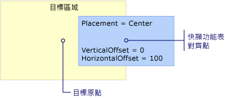  
Placement 為 Center  
  
 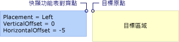  
Placement 為 Left  
  
 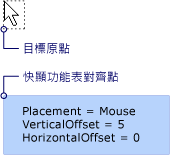  
Placement 為 Mouse  
  
 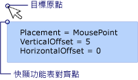  
Placement 為 MousePoint  
  
 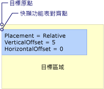  
Placement 為 Relative 或 RelativePoint  
  
 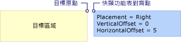  
Placement 為 Right  
  
 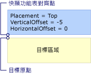  
Placement 為 Top  
  
   
## 當快顯遇到畫面邊緣時  
 基於安全性理由，<xref:System.Windows.Controls.Primitives.Popup>螢幕邊緣無法隱藏。 其中一個下列三種情況發生時<xref:System.Windows.Controls.Primitives.Popup>遇到畫面邊緣：  
  
-   快顯視窗方向上重新對齊本身會遮蔽螢幕邊緣<xref:System.Windows.Controls.Primitives.Popup>。  
  
-   快顯會使用不同的快顯對齊點。  
  
-   快顯會使用不同的目標原點和快顯對齊點。  
  
 本節稍後會進一步說明這些選項。  
  
 行為<xref:System.Windows.Controls.Primitives.Popup>螢幕邊緣時遇到取決於值<xref:System.Windows.Controls.Primitives.Popup.Placement%2A>屬性和其螢幕的邊緣遇到快顯視窗。 下表摘要說明的行為時<xref:System.Windows.Controls.Primitives.Popup>遇到每個畫面邊緣<xref:System.Windows.Controls.Primitives.PlacementMode>值。  
  
|PlacementMode|上邊緣|下邊緣|左邊緣|右邊緣|  
|-------------------|--------------|-----------------|---------------|----------------|  
|<xref:System.Windows.Controls.Primitives.PlacementMode.Absolute>|對齊上邊緣。|對齊下邊緣。|對齊左邊緣。|對齊右邊緣。|  
|<xref:System.Windows.Controls.Primitives.PlacementMode.AbsolutePoint>|對齊上邊緣。|快顯對齊點變更為的左下角<xref:System.Windows.Controls.Primitives.Popup>。|對齊左邊緣。|快顯對齊點變更為的右上角<xref:System.Windows.Controls.Primitives.Popup>。|  
|<xref:System.Windows.Controls.Primitives.PlacementMode.Bottom>|對齊上邊緣。|目標原點變更目標區域的左上角以及左下角的變更快顯對齊點<xref:System.Windows.Controls.Primitives.Popup>。|對齊左邊緣。|對齊右邊緣。|  
|<xref:System.Windows.Controls.Primitives.PlacementMode.Center>|對齊上邊緣。|對齊下邊緣。|對齊左邊緣。|對齊右邊緣。|  
|<xref:System.Windows.Controls.Primitives.PlacementMode.Left>|對齊上邊緣。|對齊下邊緣。|目標原點變更的目標區域右上角並快顯對齊點變更為的左上角<xref:System.Windows.Controls.Primitives.Popup>。|對齊右邊緣。|  
|<xref:System.Windows.Controls.Primitives.PlacementMode.Mouse>|對齊上邊緣。|目標原點變更目標區域 （滑鼠指標的範圍） 的左上角以及左下角的變更快顯對齊點<xref:System.Windows.Controls.Primitives.Popup>。|對齊左邊緣。|對齊右邊緣。|  
|<xref:System.Windows.Controls.Primitives.PlacementMode.MousePoint>|對齊上邊緣。|快顯對齊點變更為的左下角<xref:System.Windows.Controls.Primitives.Popup>。|對齊左邊緣。|快顯對齊點會變更至快顯的右上角。|  
|<xref:System.Windows.Controls.Primitives.PlacementMode.Relative>|對齊上邊緣。|對齊下邊緣。|對齊左邊緣。|對齊右邊緣。|  
|<xref:System.Windows.Controls.Primitives.PlacementMode.RelativePoint>|對齊上邊緣。|快顯對齊點變更為的左下角<xref:System.Windows.Controls.Primitives.Popup>。|對齊左邊緣。|快顯對齊點會變更至快顯的右上角。|  
|<xref:System.Windows.Controls.Primitives.PlacementMode.Right>|對齊上邊緣。|對齊下邊緣。|對齊左邊緣。|目標原點變更目標區域的左上角並快顯對齊點變更為的右上角<xref:System.Windows.Controls.Primitives.Popup>。|  
|<xref:System.Windows.Controls.Primitives.PlacementMode.Top>|目標原點變更目標區域的左下角並快顯對齊點變更為的左上角<xref:System.Windows.Controls.Primitives.Popup>。 實際上，這等同於何時<xref:System.Windows.Controls.Primitives.Popup.Placement%2A>是<xref:System.Windows.Controls.Primitives.PlacementMode.Bottom>。|對齊下邊緣。|對齊左邊緣。|對齊右邊緣。|  
  
### 對齊畫面邊緣  
 A<xref:System.Windows.Controls.Primitives.Popup>可以對齊螢幕的邊緣重新定位本身因此整個<xref:System.Windows.Controls.Primitives.Popup>螢幕上看見。  當發生這種情況時，目標原點，並且快顯對齊點之間的距離可能會與不同的值從<xref:System.Windows.Controls.Primitives.Popup.HorizontalOffset%2A>和<xref:System.Windows.Controls.Primitives.Popup.VerticalOffset%2A>。 當<xref:System.Windows.Controls.Primitives.Popup.Placement%2A>是<xref:System.Windows.Controls.Primitives.PlacementMode.Absolute>， <xref:System.Windows.Controls.Primitives.PlacementMode.Center>，或<xref:System.Windows.Controls.Primitives.PlacementMode.Relative>、<xref:System.Windows.Controls.Primitives.Popup>讓本身對齊的每個螢幕邊緣。  例如，假設<xref:System.Windows.Controls.Primitives.Popup>具有<xref:System.Windows.Controls.Primitives.Popup.Placement%2A>設<xref:System.Windows.Controls.Primitives.PlacementMode.Relative>和<xref:System.Windows.Controls.Primitives.Popup.VerticalOffset%2A>設定為 100。  如果畫面的下邊緣會隱藏所有或部分<xref:System.Windows.Controls.Primitives.Popup>、<xref:System.Windows.Controls.Primitives.Popup>重新定位本身的螢幕和目標原點和快顯視窗之間的垂直距離的下邊緣對齊點是小於 100。 下圖示範這種情況。  
  
 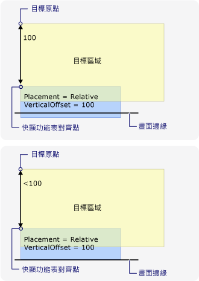  
快顯對齊畫面的邊緣  
  
### 變更快顯對齊點  
 如果<xref:System.Windows.Controls.Primitives.Popup.Placement%2A>是<xref:System.Windows.Controls.Primitives.PlacementMode.AbsolutePoint>， <xref:System.Windows.Controls.Primitives.PlacementMode.RelativePoint>，或<xref:System.Windows.Controls.Primitives.PlacementMode.MousePoint>，快顯對齊點變更時的底部或右邊畫面邊緣，在遇到快顯視窗。  
  
 下圖示範當底部畫面邊緣隱藏所有或部分<xref:System.Windows.Controls.Primitives.Popup>，快顯對齊點是左下角的<xref:System.Windows.Controls.Primitives.Popup>。  
  
 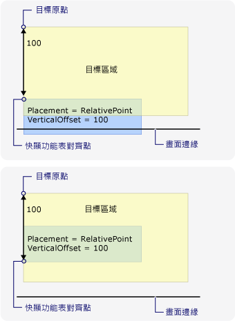  
快顯遇到畫面的下邊緣而變更快顯對齊點  
  
 下圖示範當<xref:System.Windows.Controls.Primitives.Popup>隱藏根據螢幕的右邊緣，快顯對齊點是右上角的<xref:System.Windows.Controls.Primitives.Popup>。  
  
 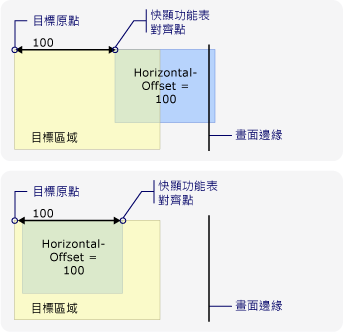  
快顯遇到畫面的右邊緣而變更快顯對齊點  
  
 如果<xref:System.Windows.Controls.Primitives.Popup>遇到下框線和右螢幕邊緣快顯對齊點是的右下角<xref:System.Windows.Controls.Primitives.Popup>。  
  
### 變更目標原點和快顯對齊點  
 當<xref:System.Windows.Controls.Primitives.Popup.Placement%2A>是<xref:System.Windows.Controls.Primitives.PlacementMode.Bottom>， <xref:System.Windows.Controls.Primitives.PlacementMode.Left>， <xref:System.Windows.Controls.Primitives.PlacementMode.Mouse>， <xref:System.Windows.Controls.Primitives.PlacementMode.Right>，或<xref:System.Windows.Controls.Primitives.PlacementMode.Top>，目標原點，並且快顯對齊點變更，如果遇到某些螢幕的邊緣。  畫面邊緣造成變更的位置取決於<xref:System.Windows.Controls.Primitives.PlacementMode>值。  
  
 下圖示範當<xref:System.Windows.Controls.Primitives.Popup.Placement%2A>是<xref:System.Windows.Controls.Primitives.PlacementMode.Bottom>和<xref:System.Windows.Controls.Primitives.Popup>遇到螢幕邊緣，目標原點是目標區域的左上角，快顯對齊點的左下角<xref:System.Windows.Controls.Primitives.Popup>.  
  
 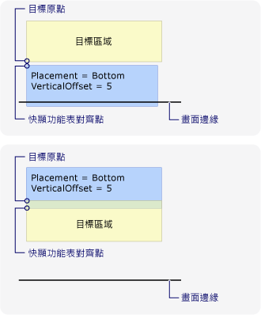  
Placement 為 Bottom 且快顯遇到畫面下邊緣  
  
 下圖示範當<xref:System.Windows.Controls.Primitives.Popup.Placement%2A>是<xref:System.Windows.Controls.Primitives.PlacementMode.Left>和<xref:System.Windows.Controls.Primitives.Popup>遇到左邊的畫面邊緣，目標原點是目標區域的右上角，快顯對齊點的左上角<xref:System.Windows.Controls.Primitives.Popup>.  
  
 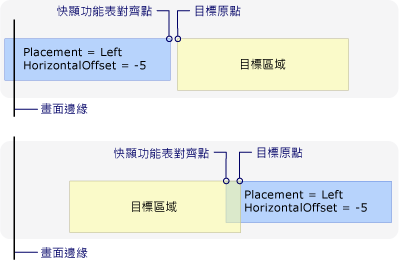  
Placement 為 Left 且快顯遇到畫面左邊緣  
  
 下圖示範當<xref:System.Windows.Controls.Primitives.Popup.Placement%2A>是<xref:System.Windows.Controls.Primitives.PlacementMode.Right>和<xref:System.Windows.Controls.Primitives.Popup>遇到右邊畫面邊緣，目標原點是目標區域的左上角，快顯對齊點的右上角<xref:System.Windows.Controls.Primitives.Popup>.  
  
 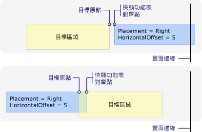  
Placement 為 Right 且快顯遇到畫面右邊緣  
  
 下圖示範當<xref:System.Windows.Controls.Primitives.Popup.Placement%2A>是<xref:System.Windows.Controls.Primitives.PlacementMode.Top>和<xref:System.Windows.Controls.Primitives.Popup>遇到頂端畫面邊緣，目標原點是目標區域的左下角，快顯對齊點的左上角<xref:System.Windows.Controls.Primitives.Popup>.  
  
 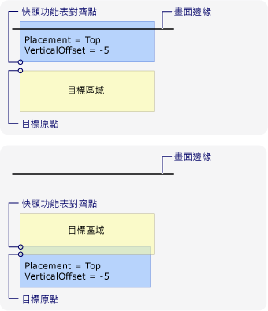  
Placement 為 Top 且快顯遇到畫面上邊緣  
  
 下圖示範當<xref:System.Windows.Controls.Primitives.Popup.Placement%2A>是<xref:System.Windows.Controls.Primitives.PlacementMode.Mouse>和<xref:System.Windows.Controls.Primitives.Popup>遇到螢幕邊緣，目標是目標區域 （滑鼠指標的範圍） 和快顯功能表對齊左上角點是左下角<xref:System.Windows.Controls.Primitives.Popup>。  
  
 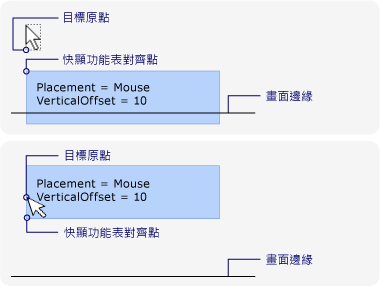  
Placement 為 Mouse 且快顯遇到畫面下邊緣  
  
### 自訂快顯位置  
 您可以設定連線，來自訂目標原點，並且快顯對齊點<xref:System.Windows.Controls.Primitives.Popup.Placement%2A>屬性<xref:System.Windows.Controls.Primitives.PlacementMode.Custom>。 然後定義<xref:System.Windows.Controls.Primitives.CustomPopupPlacementCallback>委派，會傳回一組可能的定位點和 （依喜好設定順序） 的主座標軸的<xref:System.Windows.Controls.Primitives.Popup>。 顯示的最大一部分的點<xref:System.Windows.Controls.Primitives.Popup>已選取。  位置<xref:System.Windows.Controls.Primitives.Popup>會自動調整大小，如果<xref:System.Windows.Controls.Primitives.Popup>隱藏螢幕的邊緣。 如需範例，請參閱[指定自訂快顯位置](../../../../docs/framework/wpf/controls/how-to-specify-a-custom-popup-position.md)。  
  
## 請參閱  
 [快顯位置範例](http://go.microsoft.com/fwlink/?LinkID=160032)
