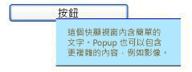

# 快顯Popup
<xref:System.Windows.Controls.Primitives.Popup>控制會漂浮在目前的應用程式視窗的另一個視窗，顯示內容。The <xref:System.Windows.Controls.Primitives.Popup> control displays content in a separate window that floats over the current application window.  
  
 下圖顯示<xref:System.Windows.Controls.Primitives.Popup>位於相對於控制項<xref:System.Windows.Controls.Button>也就是其父代。The following illustration shows a <xref:System.Windows.Controls.Primitives.Popup> control that is positioned with respect to a <xref:System.Windows.Controls.Button> that is its parent.  
  
   
  
## 本節內容In This Section  
 [快顯功能表概觀Popup Overview](../../../../docs/framework/wpf/controls/popup-overview.md)  
 [快顯功能表放置行為Popup Placement Behavior](../../../../docs/framework/wpf/controls/popup-placement-behavior.md)  
 [HOW-TO 主題How-to Topics](../../../../docs/framework/wpf/controls/popup-how-to-topics.md)  
  
## 參考資料Reference  
 <xref:System.Windows.Controls.Primitives.Popup>  
  
## 相關章節Related Sections
