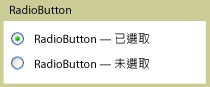

# RadioButtonRadioButton
<xref:System.Windows.Controls.RadioButton> 控制項是通常群組在一起以提供使用者在數個選項之間的單一選項您可以選取一次只能有一個按鈕。<xref:System.Windows.Controls.RadioButton> controls are usually grouped together to offer users a single choice among several options; only one button at a time can be selected.  
  
 下圖顯示的範例<xref:System.Windows.Controls.RadioButton>控制項。The following illustration shows an example of a <xref:System.Windows.Controls.RadioButton> control.  
  
   
典型的 RadioButtonTypical RadioButton  
  
## 參考資料Reference  
 <xref:System.Windows.Controls.Primitives.ToggleButton>  
  
## 相關章節Related Sections
