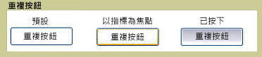

# RepeatButton
<xref:System.Windows.Controls.Primitives.RepeatButton>類似於<xref:System.Windows.Controls.Button>。 不過，<xref:System.Windows.Controls.Primitives.RepeatButton>項目可讓您控制何時以及如何<xref:System.Windows.Controls.Primitives.ButtonBase.Click>就會發生事件。  
  
 下圖顯示這三個狀態重複按鈕控制項、 預設值、 PointerFocused 及按下的範例。 第一個按鈕顯示的預設狀態<xref:System.Windows.Controls.Primitives.RepeatButton>。 第二個顯示如何按鈕的外觀變更時，滑鼠指標停留在按鈕中，使其取得焦點。 最後一個按鈕顯示的外觀<xref:System.Windows.Controls.Primitives.RepeatButton>當使用者在控制項上按滑鼠按鈕。  
  
   
典型的 RepeatButton  
  
## 本節內容  
  
## 參考資料  
 <xref:System.Windows.Controls.Primitives.RepeatButton>  
  
## 相關章節
