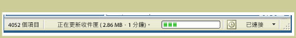

# StatusBar
<xref:System.Windows.Controls.Primitives.StatusBar> 是視窗底部的水平區域，應用程式可以在其中顯示資訊狀態。  
  
 下圖顯示 <xref:System.Windows.Controls.Primitives.StatusBar> 的範例。  
  
   
  
## 在本節中  
  
## 參考  
 <xref:System.Windows.Controls.Primitives.StatusBar>  
 <xref:System.Windows.Controls.Primitives.StatusBarItem>  
  
## 相關章節