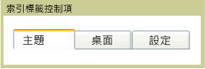

# TabControlTabControl
<xref:System.Windows.Controls.TabControl> 項目，選取適當的索引標籤存取不連續的頁面上顯示內容。每個索引標籤包含<xref:System.Windows.Controls.TabItem>。<xref:System.Windows.Controls.TabControl> elements display content on discrete pages accessed by selecting the appropriate tab. Each tab contains a <xref:System.Windows.Controls.TabItem>.  
  
 下圖顯示<xref:System.Windows.Controls.TabControl>。The following illustration shows a <xref:System.Windows.Controls.TabControl>.  
  
   
典型的 TabControlTypical TabControl  
  
## 參考資料Reference  
 <xref:System.Windows.Controls.TabControl>  
  <xref:System.Windows.Controls.TabItem>  
  
## 相關章節Related Sections
