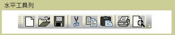
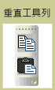

# ToolBarToolBar
<xref:System.Windows.Controls.ToolBar>控制項是一組命令或控制項，其功能通常彼此相關的容器。The <xref:System.Windows.Controls.ToolBar> control is a container for a group of commands or controls that are typically related in their function.  
  
 下列圖例顯示水平和垂直<xref:System.Windows.Controls.ToolBar>控制項。The following illustrations show horizontal and vertical <xref:System.Windows.Controls.ToolBar> controls.  
  
   
水平工具列Horizontal Toolbar  
  
   
垂直工具列Vertical Toolbar  
  
## 本節內容In This Section  
 [ToolBar 概觀ToolBar Overview](toolbar-overview.md)  
  [ToolBar 上的樣式控制項Style Controls on a ToolBar](how-to-style-controls-on-a-toolbar.md)  
  
## 參考資料Reference  
 <xref:System.Windows.Controls.ToolBar>  
  <xref:System.Windows.Controls.ToolBarTray>  
  
## 相關章節Related Sections
