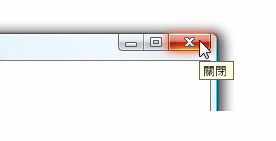

# ToolTip
工具提示是小型的快顯視窗出現時，使用者將滑鼠指標停留在項目，例如為 [過度] <xref:System.Windows.Controls.Button>。  
  
 下圖顯示滑鼠指標的指向**關閉**<xref:System.Windows.Controls.Button>，這會將會顯示其識別<xref:System.Windows.Controls.ToolTip>。  
  
 關閉 按鈕以顯示其工具提示  
  
   
  
## 本節內容  
 [工具提示概觀](../../../../docs/framework/wpf/controls/tooltip-overview.md)  
  [HOW-TO 主題](../../../../docs/framework/wpf/controls/tooltip-how-to-topics.md)  
  
## 參考資料  
 <xref:System.Windows.Controls.ToolTip>  
  <xref:System.Windows.Controls.ToolTipService>  
  <xref:System.Windows.Controls.Primitives.Popup>  
  
## 相關章節  
 [快顯功能表概觀](../../../../docs/framework/wpf/controls/popup-overview.md)  
  [HOW-TO 主題](../../../../docs/framework/wpf/controls/popup-how-to-topics.md)
