# 逐步解說：使用 Microsoft Expression Blend 建立按鈕Walkthrough: Create a Button by Using Microsoft Expression Blend
本逐步解說將引導您完成建立程序[!INCLUDE[TLA2#tla_wpf](../../../../includes/tla2sharptla-wpf-md.md)]使用 Microsoft Expression Blend 的自訂的按鈕。This walkthrough steps you through the process of creating a [!INCLUDE[TLA2#tla_wpf](../../../../includes/tla2sharptla-wpf-md.md)] customized button using Microsoft Expression Blend.  
  
> [!IMPORTANT]
>  Microsoft Expression Blend 的運作方式是產生[!INCLUDE[TLA#tla_xaml](../../../../includes/tlasharptla-xaml-md.md)]，接著會編譯將可執行程式。Microsoft Expression Blend works by generating [!INCLUDE[TLA#tla_xaml](../../../../includes/tlasharptla-xaml-md.md)] that is then compiled to make the executable program. 如果您偏好使用的[!INCLUDE[TLA#tla_xaml](../../../../includes/tlasharptla-xaml-md.md)]直接管理，還有另一個會建立一個使用相同的應用程式的逐步解說[!INCLUDE[TLA#tla_xaml](../../../../includes/tlasharptla-xaml-md.md)]使用 Visual Studio，而不是 Blend。If you would rather work with [!INCLUDE[TLA#tla_xaml](../../../../includes/tlasharptla-xaml-md.md)] directly, there is another walkthrough that creates the same application as this one using [!INCLUDE[TLA#tla_xaml](../../../../includes/tlasharptla-xaml-md.md)] with Visual Studio rather than Blend. 請參閱[建立的按鈕所使用的 XAML](walkthrough-create-a-button-by-using-xaml.md)如需詳細資訊。See [Create a Button by Using XAML](walkthrough-create-a-button-by-using-xaml.md) for more information.  
  
 下圖顯示 [自訂] 按鈕，您將建立。The following illustration shows the customized button that you will create.  
  
   
  
## 將圖形轉換至按鈕Convert a Shape to a Button  
 在本逐步解說的第一個部分中，您建立自訂的自訂按鈕的外觀。In the first part of this walkthrough you create the custom look of the custom button. 若要這樣做，您第一次轉換一個矩形的按鈕。To do this, you first convert a rectangle to a button. 然後您加入其他圖形範本的按鈕，以建立更複雜的 [尋找] 按鈕。You then add additional shapes to the template of the button, creating a more complex looking button. 為什麼不使用一般按鈕啟動以及進行自訂？Why not start with a regular button and customize it? 因為按鈕具有內建功能，您不需要;自訂按鈕，就更輕鬆地開始一個矩形。Because a button has built-in functionality that you do not need; for custom buttons, it is easier to start with a rectangle.  
  
#### 若要在 Expression Blend 中建立新的專案To create a new project in Expression Blend  
  
1. 啟動 Expression Blend。Start Expression Blend. (按一下**開始**，指向**所有程式**，指向**Microsoft Expression**，然後按一下**Microsoft Expression Blend**。)(Click **Start**, point to **All Programs**, point to **Microsoft Expression**, and then click **Microsoft Expression Blend**.)  
  
2. 如有需要最大化應用程式。Maximize the application if needed.  
  
3. 按一下 [檔案] 功能表上的 [新增專案]。On the **File** menu, click **New Project**.  
  
4. 選取 **標準的應用程式 (.exe)**。Select **Standard Application (.exe)**.  
  
5. 將專案命名為`CustomButton`按下 **[確定]**。Name the project `CustomButton` and press **OK**.  
  
 此時您有空白[!INCLUDE[TLA2#tla_wpf](../../../../includes/tla2sharptla-wpf-md.md)]專案。At this point you have a blank [!INCLUDE[TLA2#tla_wpf](../../../../includes/tla2sharptla-wpf-md.md)] project. 您可以按 F5 執行應用程式。You can press F5 to run the application. 如您所料，此應用程式包含空白視窗。As you might expect, the application consists of only a blank window. 接下來，您會建立圓角的矩形，並將它轉換成按鈕。Next, you create a rounded rectangle and convert it into a button.  
  
#### 將矩形的按鈕To convert a Rectangle to a Button  
  
1. **設定為黑色的視窗背景屬性：** 選取的視窗中，按一下**內容 索引標籤**，並將<xref:System.Windows.Controls.Control.Background%2A>屬性設`Black`。**Set the Window Background property to black:** Select the Window, click the **Properties Tab**, and set the <xref:System.Windows.Controls.Control.Background%2A> property to `Black`.  
  
     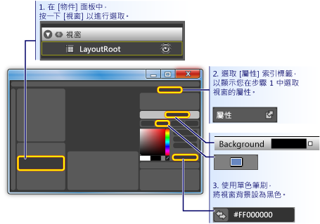  
  
2. **視窗上進行繪製的矩形大約按鈕的大小：** 選取左側的工具面板上的 [矩形] 工具，然後將矩形拖曳到視窗。**Draw a rectangle approximately the size of a button on the Window:** Select the rectangle tool on the left-hand tool panel and drag the rectangle onto the Window.  
  
     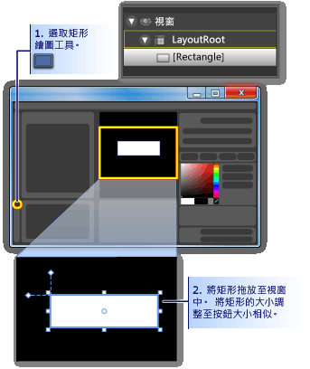  
  
3. **完成的矩形邊角：** 拖曳矩形的控制點，或直接設定<xref:System.Windows.Shapes.Rectangle.RadiusX%2A>和<xref:System.Windows.Shapes.Rectangle.RadiusY%2A>屬性。**Round out the corners of the rectangle:** Either drag the control points of the rectangle or directly set the <xref:System.Windows.Shapes.Rectangle.RadiusX%2A> and <xref:System.Windows.Shapes.Rectangle.RadiusY%2A> properties. 設定的值<xref:System.Windows.Shapes.Rectangle.RadiusX%2A>和<xref:System.Windows.Shapes.Rectangle.RadiusY%2A>為 20。Set the values of <xref:System.Windows.Shapes.Rectangle.RadiusX%2A> and <xref:System.Windows.Shapes.Rectangle.RadiusY%2A> to 20.  
  
     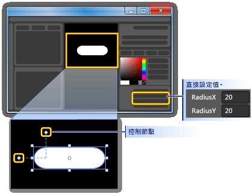  
  
4. **將變更矩形的按鈕：** 選取矩形。**Change the rectangle into a button:** Select the rectangle. 在 **工具**功能表上，按一下**製作按鈕**。On the **Tools** menu, click **Make Button**.  
  
     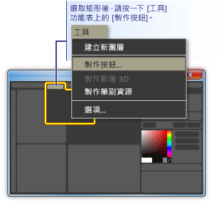  
  
5. **指定樣式/樣板的範圍：** 如下所示的對話方塊隨即出現。**Specify the scope of the style/template:** A dialog box like the following appears.  
  
     ![[建立樣式資源] 對話方塊中](./media/custom-button-blend-makebutton2.gif "custom_button_blend_MakeButton2")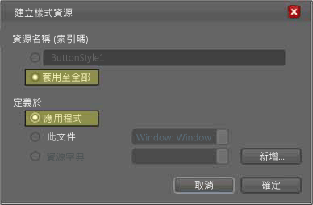  
  
     針對**資源名稱 （索引鍵）**，選取**套用到全部**。For **Resource name (Key)**, select **Apply to all**.  這會讓產生的樣式和 button 範本套用到所有物件的按鈕。This will make the resulting style and button template apply to all objects that are buttons. 針對**定義中**，選取**應用程式**。For **Define in**, select **Application**. 這會讓產生的樣式和 button 範本對整個應用程式的範圍。This will make the resulting style and button template have scope over the entire application. 當您在這兩個箱子中設定的值時，在按鈕樣式和範本套用至整個應用程式內的所有按鈕，和您建立應用程式中的任一個按鈕會根據預設，使用此範本。When you set the values in these two boxes, the button style and template apply to all buttons within the entire application and any button you create in the application will, by default, use this template.  
  
## 編輯按鈕範本Edit the Button Template  
 現在，您會有已變更為按鈕的矩形。You now have a rectangle that has been changed to a button. 在本節中，您將修改按鈕的範本，並進一步自訂其外觀。In this section, you'll modify the template of the button and further customize how it looks.  
  
#### 若要編輯按鈕範本，若要變更按鈕的外觀To edit the button template to change the button appearance  
  
1. **請移至 編輯範本檢視：** 若要進一步自訂按鈕的外觀，我們需要編輯 按鈕 範本。**Go into edit template view:** To further customize the look of our button, we need to edit the button template. 此範本的建立，當我們轉換為按鈕的矩形。This template was created when we converted the rectangle into a button. 若要編輯 按鈕 範本，以滑鼠右鍵按一下  按鈕，然後選取**編輯控制項組件 （範本）** ，然後**編輯範本**。To edit the button template, right-click the button and select **Edit Control Parts (Template)** and then **Edit Template**.  
  
     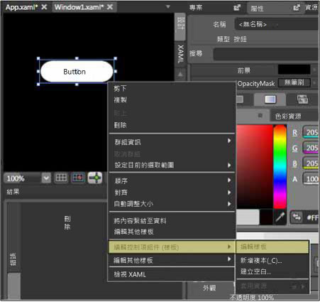  
  
     在範本的編輯器中，請注意，[] 按鈕現在已分成<xref:System.Windows.Shapes.Rectangle>而<xref:System.Windows.Controls.ContentPresenter>。In the template editor, notice that the button is now separated into a <xref:System.Windows.Shapes.Rectangle> and the <xref:System.Windows.Controls.ContentPresenter>. <xref:System.Windows.Controls.ContentPresenter>用來呈現按鈕 （例如字串 「 按鈕 」） 內的內容。The <xref:System.Windows.Controls.ContentPresenter> is used to present content within the button (for example, the string "Button"). 這兩個矩形並<xref:System.Windows.Controls.ContentPresenter>內部的配置<xref:System.Windows.Controls.Grid>。Both the rectangle and <xref:System.Windows.Controls.ContentPresenter> are laid out inside of a <xref:System.Windows.Controls.Grid>.  
  
     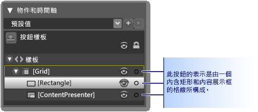  
  
2. **變更範本元件的名稱：** 以滑鼠右鍵按一下範本清查，變更矩形<xref:System.Windows.Shapes.Rectangle>"outerRectangle 」，以名稱"[矩形]"，並將"[ContentPresenter]"變更為"myContentPresenter 」。**Change the names of the template components:** Right-click the rectangle in the template inventory, change the <xref:System.Windows.Shapes.Rectangle> name from "[Rectangle]" to "outerRectangle", and change "[ContentPresenter]" to "myContentPresenter".  
  
     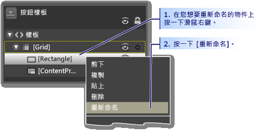  
  
3. **Alter 矩形，使其空白內 （例如甜甜圈）：** 選取  **outerRectangle**並設定<xref:System.Windows.Shapes.Shape.Fill%2A>設為 透明 」 和<xref:System.Windows.Shapes.Shape.StrokeThickness%2A>為 5。**Alter the rectangle so that it is empty inside (like a donut):** Select **outerRectangle** and set <xref:System.Windows.Shapes.Shape.Fill%2A> to "Transparent" and <xref:System.Windows.Shapes.Shape.StrokeThickness%2A> to 5.  
  
     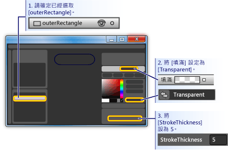  
  
     然後設定<xref:System.Windows.Shapes.Shape.Stroke%2A>的範本將會是任何色彩。Then set the <xref:System.Windows.Shapes.Shape.Stroke%2A> to the color of whatever the template will be. 若要這樣做，請按一下小型的白色方塊旁**筆劃**，選取**CustomExpression**，並在對話方塊中輸入 「 {TemplateBinding 背景} 」。To do this, click the small white box next to **Stroke**, select **CustomExpression**, and type "{TemplateBinding Background}" in the dialog box.  
  
     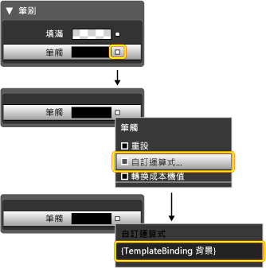  
  
4. **建立內部的矩形：** 現在，建立另一個矩形 （其命名為"innerRectangle 」），並置於內部的對稱**outerRectangle** 。**Create an inner rectangle:** Now, create another rectangle (name it "innerRectangle") and position it symmetrically on the inside of **outerRectangle** . 這類型的工作，您可能要縮放設定編輯區域中的更大的按鈕。For this kind of work, you will probably want to zoom to make the button larger in the editing area.  
  
    > [!NOTE]
    >  您的矩形看起來可能不同於圖中 （例如，它可能會有圓角）。Your rectangle might look different than the one in the figure (for example, it might have rounded corners).  
  
     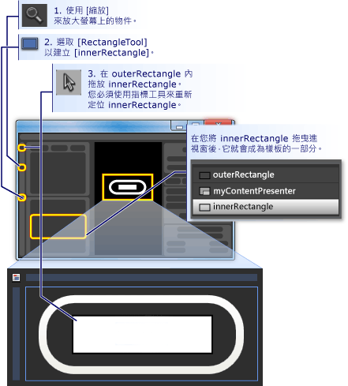  
  
5. **將 ContentPresenter 移至頂端：** 此時，就可以，文字"Button"將不會顯示沒事取這麼長。**Move ContentPresenter to the top:** At this point, it is possible that the text "Button" will not be visible any longer. 如果情況如此，這是因為**innerRectangle**上**myContentPresenter**。If this is so, this is because **innerRectangle** is on top of the **myContentPresenter**. 若要修正此問題，拖曳**myContentPresenter**下方**innerRectangle**。To fix this, drag **myContentPresenter** below **innerRectangle**. 調整矩形的位置並**myContentPresenter**尋找類似下方所示。Reposition rectangles and **myContentPresenter** to look similar to below.  
  
    > [!NOTE]
    >  或者，您也可以定位**myContentPresenter**上按一下滑鼠右鍵，然後按**轉寄傳送**。Alternatively, you can also position **myContentPresenter** on top by right-clicking it and pressing **Send Forward**.  
  
     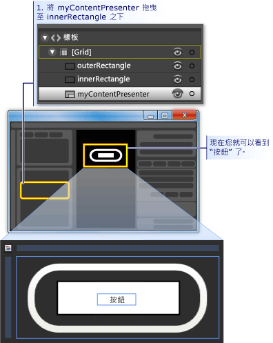  
  
6. **變更 innerRectangle 的外觀：** 設定<xref:System.Windows.Shapes.Rectangle.RadiusX%2A>， <xref:System.Windows.Shapes.Rectangle.RadiusY%2A>，和<xref:System.Windows.Shapes.Shape.StrokeThickness%2A>為 20 的值。**Change the look of innerRectangle:** Set the <xref:System.Windows.Shapes.Rectangle.RadiusX%2A>, <xref:System.Windows.Shapes.Rectangle.RadiusY%2A>, and <xref:System.Windows.Shapes.Shape.StrokeThickness%2A> values to 20. 此外，設定<xref:System.Windows.Shapes.Shape.Fill%2A>到背景工作的範本使用自訂運算式 「 {TemplateBinding 背景} 」)，並設定<xref:System.Windows.Shapes.Shape.Stroke%2A>為 「 透明 」。In addition, set the <xref:System.Windows.Shapes.Shape.Fill%2A> to the background of the template using the custom expression "{TemplateBinding Background}" ) and set <xref:System.Windows.Shapes.Shape.Stroke%2A> to "transparent". 請注意，設定<xref:System.Windows.Shapes.Shape.Fill%2A>並<xref:System.Windows.Shapes.Shape.Stroke%2A>的**innerRectangle**的相反**outerRectangle**。Notice that the settings for the <xref:System.Windows.Shapes.Shape.Fill%2A> and <xref:System.Windows.Shapes.Shape.Stroke%2A> of **innerRectangle** are the opposite of those for **outerRectangle**.  
  
     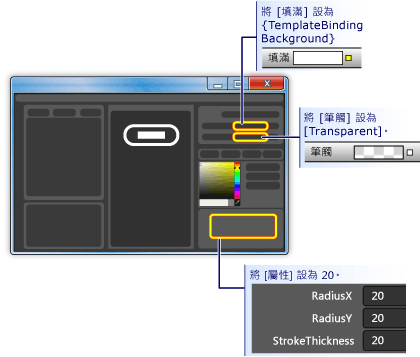  
  
7. **在上面加入半透明效果圖層：** 自訂的按鈕外觀的最後一步是在最上面加入半透明效果圖層。**Add a glass layer on top:** The final piece of customizing the look of the button is to add a glass layer on top. 此半透明效果圖層是由第三個矩形所組成。This glass layer consists of a third rectangle. 因為半透明效果會涵蓋整個按鈕，玻璃矩形的維度，以便類似**outerRectangle**。Because the glass will cover the entire button, the glass rectangle is similar in dimensions to the **outerRectangle**. 因此，只需產生一份建立矩形**outerRectangle**。Therefore, create the rectangle by simply making a copy of the **outerRectangle**. 反白顯示**outerRectangle** ，並使用 CTRL + C 和 CTRL + V 以製作複本。Highlight **outerRectangle** and use CTRL+C and CTRL+V to make a copy. 這個新的矩形"glassCube 」 的名稱。Name this new rectangle "glassCube".  
  
8. **如有必要，請重新定位 glassCube:** 如果**glassCube**是尚未定位，使其涵蓋整個按鈕，將它拖曳到位置。**Reposition glassCube if necessary:** If **glassCube** is not already positioned so that it covers the entire button, drag it into position.  
  
9. **提供 glassCube outerRectangle 以稍有不同於：** 變更的屬性**glassCube**。**Give glassCube a slightly different shape than outerRectangle:** Change the properties of **glassCube**. 藉由變更開始<xref:System.Windows.Shapes.Rectangle.RadiusX%2A>並<xref:System.Windows.Shapes.Rectangle.RadiusY%2A>為 10 的屬性和<xref:System.Windows.Shapes.Shape.StrokeThickness%2A>為 2。Start off by changing the <xref:System.Windows.Shapes.Rectangle.RadiusX%2A> and <xref:System.Windows.Shapes.Rectangle.RadiusY%2A> properties to 10 and the <xref:System.Windows.Shapes.Shape.StrokeThickness%2A> to 2.  
  
     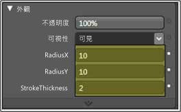  
  
10. **請看起來像玻璃的 glassCube:** 設定<xref:System.Windows.Shapes.Shape.Fill%2A>光滑看使用線形漸層 75%不透明且交替使用的色彩為白色和透明超過 6 大約平均地間距間隔。**Make glassCube look like glass:** Set the <xref:System.Windows.Shapes.Shape.Fill%2A> to a glassy look by  using a linear gradient that is 75% opaque and alternates between the color White and Transparent over 6 approximately evenly spaced intervals. 這是要設定為漸層停駐的項目：This is what to set the gradient stops to:  
  
    - 漸層停駐 1:白色，並且 75%的 Alpha 值Gradient Stop 1: White with Alpha value of 75%  
  
    - 漸層停駐 2:透明Gradient Stop 2: Transparent  
  
    - 漸層停駐 3:白色，並且 75%的 Alpha 值Gradient Stop 3: White with Alpha value of 75%  
  
    - 漸層停駐 4:透明Gradient Stop 4: Transparent  
  
    - 漸層停駐 5:白色，並且 75%的 Alpha 值Gradient Stop 5: White with Alpha value of 75%  
  
    - 漸層停駐 6:透明Gradient Stop 6: Transparent  
  
     這會建立 「 波浪"玻璃外觀。This creates a "wavy" glass look.  
  
     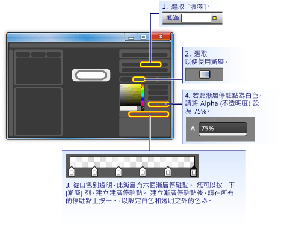  
  
11. **隱藏玻璃圖層：** 現在，您看到光滑層是什麼樣子，請移至**外觀窗格**的 **[屬性] 面板**和不透明度設定為 0%，以將其隱藏。**Hide the glass layer:** Now that you see what the glassy layer looks like, go into the **Appearance pane** of the **Properties panel** and set the Opacity to 0% to hide it. 在繼續進行下面的章節，我們將使用屬性觸發程序和事件來顯示和操作玻璃層。In the sections ahead, we'll use property triggers and events to show and manipulate the glass layer.  
  
     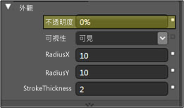  
  
## 自訂按鈕的行為Customize the Button Behavior  
 此時，您已自訂按鈕的呈現方式，藉由編輯其範本，但按鈕不會回應使用者動作為一般的按鈕執行 （例如，變更滑鼠停留時的外觀、 接收焦點，然後按一下。）下面兩個程序示範如何建置到自訂按鈕的這類的行為。At this point, you have customized the presentation of the button by editing its template, but the button does not react to user actions as typical buttons do (for example, changing appearance upon mouse-over, receiving focus, and clicking.) The next two procedures show how to build behaviors like these into the custom button. 我們將開始簡單屬性觸發程序，然後再加入 事件觸發程序和動畫。We'll start with simple property triggers, and then add event triggers and animations.  
  
#### 若要設定屬性觸發程序To set property triggers  
  
1. **建立新的屬性觸發程序：** 具有**glassCube**選取，按一下 **+ 屬性**中**觸發程序**面板 （請參閱圖遵循下一步）。**Create a new property trigger:** With **glassCube** selected, click **+ Property** in the **Triggers** panel (see the figure that follows the next step). 這會建立預設屬性觸發程序的屬性觸發程序。This creates a property trigger with a default property trigger.  
  
2. **請 IsMouseOver 觸發程序所使用的屬性：** 將屬性變更為<xref:System.Windows.UIElement.IsMouseOver%2A>。**Make IsMouseOver the property used by the trigger:** Change the property to <xref:System.Windows.UIElement.IsMouseOver%2A>. 這可讓屬性觸發程序啟動的時機<xref:System.Windows.UIElement.IsMouseOver%2A>屬性是`true`（當使用者指向滑鼠按鈕）。This makes the property trigger activate when the <xref:System.Windows.UIElement.IsMouseOver%2A> property is `true` (when the user points to the button with the mouse).  
  
     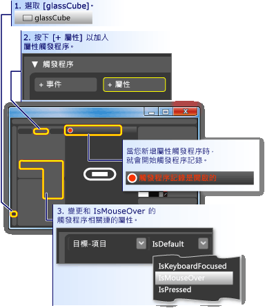  
  
3. **IsMouseOver glasscube 的 100%的觸發程序不透明度：** 請注意，**觸發程序記錄已開啟**（請參閱上圖中）。**IsMouseOver triggers opacity of 100% for glassCube:** Notice that the **Trigger recording is on** (see the preceding figure). 這表示的屬性值變更的任何**glassCube**錄製時將成為動作發生於當<xref:System.Windows.UIElement.IsMouseOver%2A>是`true`。This means that any changes you make to the property values of **glassCube** while recording is on will become an action that takes place when <xref:System.Windows.UIElement.IsMouseOver%2A> is `true`. 錄製時，變更<xref:System.Windows.UIElement.Opacity%2A>的**glassCube**到 100%。While recording, change the <xref:System.Windows.UIElement.Opacity%2A> of **glassCube** to 100%.  
  
     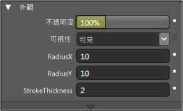  
  
     您現在已建立您第一個屬性觸發程序。You have now created your first property trigger. 請注意，**觸發程序 面板**編輯器的已記錄<xref:System.Windows.UIElement.Opacity%2A>變更為 100%。Notice that the **Triggers panel** of the editor has recorded the <xref:System.Windows.UIElement.Opacity%2A> being changed to 100%.  
  
     ![[觸發程序] 面板](./media/custom-button-blend-propertytriggerinfo.png "custom_button_blend_PropertyTriggerInfo")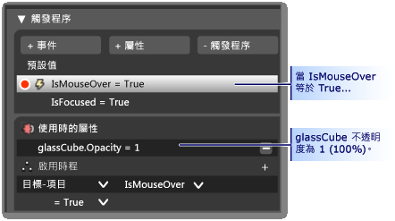  
  
     按下 f5 鍵執行應用程式，並透過並關閉 按鈕，將滑鼠指標。Press F5 to run the application, and move the mouse pointer over and off the button. 您應該會看到出現時，玻璃層您滑鼠經過按鈕和指標離開時，便會消失。You should see the glass layer appear when you mouse-over the button and disappear when the pointer leaves.  
  
4. **IsMouseOver 觸發程序描邊的值變更：** 讓我們建立一些其他動作的關聯<xref:System.Windows.UIElement.IsMouseOver%2A>觸發程序。**IsMouseOver triggers stroke value change:** Let's associate some other actions with the <xref:System.Windows.UIElement.IsMouseOver%2A> trigger. 當錄製繼續發生時，請切換您的選擇，從**glassCube**要**outerRectangle**。While recording continues, switch your selection from **glassCube** to **outerRectangle**. 然後設定<xref:System.Windows.Shapes.Shape.Stroke%2A>的**outerRectangle** "{DynamicResource {x： 靜態 SystemColors.HighlightBrushKey}}"的自訂運算式。Then set the <xref:System.Windows.Shapes.Shape.Stroke%2A> of **outerRectangle** to the custom expression of "{DynamicResource {x:Static SystemColors.HighlightBrushKey}}". 這會設定<xref:System.Windows.Shapes.Shape.Stroke%2A>一般以反白顯示按鈕所使用的色彩。This sets the <xref:System.Windows.Shapes.Shape.Stroke%2A> to the typical highlight color used by buttons. 若要查看效果，當您將滑鼠移至按鈕的按 f5 鍵。Press F5 to see the effect when you mouse over the button.  
  
     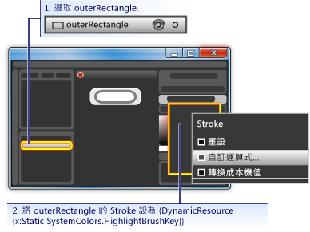  
  
5. **IsMouseOver 觸發模糊的文字：** 讓我們將建立一個動作，以關聯<xref:System.Windows.UIElement.IsMouseOver%2A>屬性觸發程序。**IsMouseOver triggers blurry text:** Let's associate one more action to the <xref:System.Windows.UIElement.IsMouseOver%2A> property trigger. 讓半透明效果會出現在它上面時出現有點模糊按鈕的內容。Make the content of the button appear a little blurry when the glass appears over it. 若要這樣做，我們可以套用模糊<xref:System.Windows.Media.Effects.BitmapEffect>要<xref:System.Windows.Controls.ContentPresenter>(**myContentPresenter**)。To do this, we can apply a blur <xref:System.Windows.Media.Effects.BitmapEffect> to the <xref:System.Windows.Controls.ContentPresenter> (**myContentPresenter**).  
  
     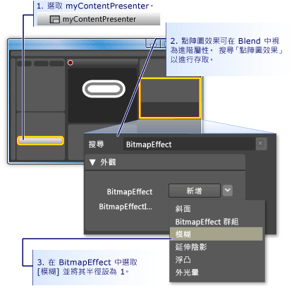  
  
    > [!NOTE]
    >  返回**屬性 面板**成上一步是先搜尋<xref:System.Windows.Media.Effects.BitmapEffect>，清除 從文字**搜尋方塊中**。To return the **Properties panel** back to what it was before you did the search for <xref:System.Windows.Media.Effects.BitmapEffect>, clear the text from the **Search box**.  
  
     到目前為止，我們有屬性觸發程序具有數個相關聯的動作時用來建立醒目提示行為的滑鼠指標進入和離開 按鈕的區域。At this point, we have used a property trigger with several associated actions to create highlighting behavior for when the mouse pointer enters and leaves the button area. 另一個常見的問題，按鈕是以反白顯示具有焦點時 （就按一下它之後）。Another typical behavior for a button is to highlight when it has focus (as after it is clicked). 我們可以加入另一個屬性觸發程序，以便將這類行為<xref:System.Windows.UIElement.IsFocused%2A>屬性。We can add such behavior by adding another property trigger for the <xref:System.Windows.UIElement.IsFocused%2A> property.  
  
6. **建立 IsFocused 屬性觸發程序：** 使用相同的程序，與<xref:System.Windows.UIElement.IsMouseOver%2A>（請參閱本章節的第一個步驟），建立另一個屬性觸發程序<xref:System.Windows.UIElement.IsFocused%2A>屬性。**Create property trigger for IsFocused:** Using the same procedure as for <xref:System.Windows.UIElement.IsMouseOver%2A> (see the first step of this section), create another property trigger for the <xref:System.Windows.UIElement.IsFocused%2A> property. 雖然**觸發程序記錄已開啟**，觸發程序中加入下列動作：While **Trigger recording is on**, add the following actions to the trigger:  
  
    - **glassCube**取得<xref:System.Windows.UIElement.Opacity%2A>100%。**glassCube** gets an <xref:System.Windows.UIElement.Opacity%2A> of 100%.  
  
    - **outerRectangle**取得<xref:System.Windows.Shapes.Shape.Stroke%2A>的"{DynamicResource {x： 靜態 SystemColors.HighlightBrushKey}}"的自訂運算式值。**outerRectangle** gets a <xref:System.Windows.Shapes.Shape.Stroke%2A> custom expression value of "{DynamicResource {x:Static SystemColors.HighlightBrushKey}}".  
  
 在本逐步解說最後一個步驟中，我們將動畫加入按鈕。As the final step in this walkthrough, we will add animations to the button. 事件會觸發這些動畫，具體而言，<xref:System.Windows.UIElement.MouseEnter>和<xref:System.Windows.Controls.Primitives.ButtonBase.Click>事件。These animations will be triggered by events—specifically, the <xref:System.Windows.UIElement.MouseEnter> and <xref:System.Windows.Controls.Primitives.ButtonBase.Click> events.  
  
#### 若要使用事件觸發程序和動畫加入互動功能To use event triggers and animations to add interactivity  
  
1. **建立 MouseEnter 事件觸發程序：** 加入新的事件觸發程序，然後選取<xref:System.Windows.UIElement.MouseEnter>做為觸發程序中使用的事件。**Create a MouseEnter Event Trigger:** Add a new event trigger and select <xref:System.Windows.UIElement.MouseEnter> as the event to use in the trigger.  
  
     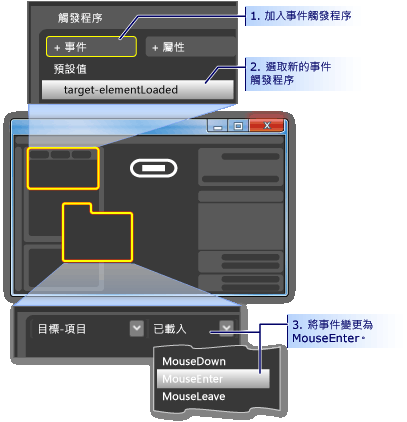  
  
2. **建立動畫時間軸：** 接下來，建立關聯以動畫時間軸<xref:System.Windows.UIElement.MouseEnter>事件。**Create an animation timeline:** Next, associate an animation timeline to the <xref:System.Windows.UIElement.MouseEnter> event.  
  
     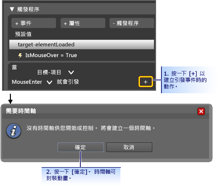  
  
     您按下之後**確定**來建立新的時間軸**時間軸 面板**出現和 「 時間軸記錄已開啟 」 會顯示在設計窗格中。After you press **OK** to create a new timeline, a **Timeline Panel** appears and "Timeline recording is on" is visible in the design panel. 這表示我們可以開始錄製時間表 （以動畫顯示屬性的變更） 中的屬性變更。This means we can start recording property changes in the timeline (animate property changes).  
  
    > [!NOTE]
    >  您可能需要調整大小視窗和 （或） 以查看顯示的面板。You may need to resize your window and/or panels to see the display.  
  
       
  
3. **建立主要畫面格：** 若要建立動畫，請選取您想要建立動畫時間軸，而且可用於這些主要畫面格建立兩個或多個主要畫面格、 設定要之間進行插補的動畫的屬性值的物件。**Create a keyframe:** To create an animation, select the object you want to animate, create two or more keyframes on the timeline, and for those keyframes, set the property values you want the animation to interpolate between. 下圖會引導您完成建立主要畫面格。The following figure guides you through the creation of a keyframe.  
  
     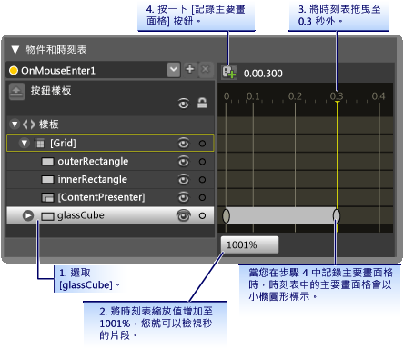  
  
4. **在此主要畫面格的壓縮 glassCube:** 選取的第二個主要畫面格，壓縮的大小**glassCube**使用其完整大小的 90%**大小轉換**。**Shrink glassCube at this keyframe:** With the second keyframe selected, shrink the size of the **glassCube** to 90% of its full size using the **Size Transform**.  
  
       
  
     按 F5 執行應用程式。Press F5 to run the application. 將滑鼠指標移動到按鈕。Move the mouse pointer over the button. 請注意，在按鈕上壓縮的玻璃層。Notice that the glass layer shrinks on top of the button.  
  
5. **建立另一個事件觸發程序，並讓不同的動畫與其產生關聯：** 讓我們加入一個詳細的動畫。**Create another Event Trigger and associate a different animation with it:** Let's add one more animation. 使用類似的程序，您用來建立上一個事件觸發程序動畫：Use a similar procedure to what you used to create the previous event trigger animation:  
  
    1. 建立新的事件觸發程序使用<xref:System.Windows.Controls.Primitives.ButtonBase.Click>事件。Create a new event trigger using the <xref:System.Windows.Controls.Primitives.ButtonBase.Click> event.  
  
    2. 建立新的時間軸，包含關聯<xref:System.Windows.Controls.Primitives.ButtonBase.Click>事件。Associate a new timeline with the <xref:System.Windows.Controls.Primitives.ButtonBase.Click> event.  
  
     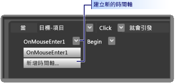  
  
    1. 為這個時刻表，建立兩個主要畫面格，一個 0.0 秒時，第二個在 0.3 的秒數。For this timeline, create two keyframes, one at 0.0 seconds and the second one at 0.3 seconds.  
  
    2. 在 0.3 秒反白顯示的主要畫面格，設定**旋轉轉換角度**到 360 度。With the keyframe at 0.3 seconds highlighted, set the **Rotate Transform Angle** to 360 degrees.  
  
     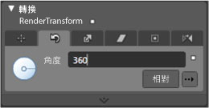  
  
    1. 按 F5 執行應用程式。Press F5 to run the application. 按一下按鈕。Click the button. 請注意，半透明層會旋轉。Notice that the glass layer spins around.  
  
## 結論Conclusion  
 您已完成自訂 按鈕。You have completed a customized button. 您未使用已套用至應用程式中的所有按鈕的按鈕範本。You did this using a button template that was applied to all buttons in the application. 如果您離開編輯模式的範本 （請參閱下圖） 和建立更多按鈕，您會看到它們的外觀和行為類似您自訂的按鈕，而不是像預設按鈕。If you leave the template editing mode (see the following figure) and create more buttons, you will see that they look and behave like your custom button rather than like the default button.  
  
 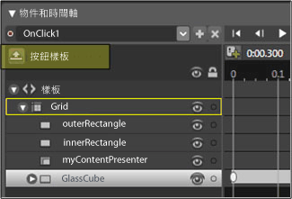  
  
 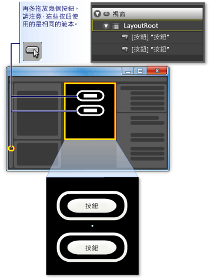  
  
 按 F5 執行應用程式。Press F5 to run the application. 按一下按鈕，並注意它們的行為方式相同。Click the buttons and notice how they all behave the same.  
  
 請記住，雖然您已自訂範本，您設定<xref:System.Windows.Shapes.Shape.Fill%2A>的屬性**innerRectangle**並<xref:System.Windows.Shapes.Shape.Stroke%2A>屬性**outerRectangle**範本背景 （{TemplateBinding 背景}）。Remember that while you were customizing the template, you set the <xref:System.Windows.Shapes.Shape.Fill%2A> property of **innerRectangle** and the <xref:System.Windows.Shapes.Shape.Stroke%2A> property **outerRectangle** to the template background ({TemplateBinding Background}). 基於這個原因，當您設定個別的按鈕的背景色彩的背景您設定將用於其各自的屬性。Because of this, when you set the background color of the individual buttons, the background you set will be used for those respective properties. 嘗試立即變更背景的位置。Try changing the backgrounds now. 在下圖中，會使用不同的漸層。In the following figure, different gradients are used. 因此，雖然適用於像按鈕控制項的整體的自訂範本，使用範本的控制項仍然可以修改尋找彼此不同。Therefore, although a template is useful for overall customization of controls like button, controls with templates can still be modified to look different from each other.  
  
   
  
 總而言之，在過程中自訂按鈕範本已了解如何執行 Microsoft Expression Blend 中的下列功能：In conclusion, in the process of customizing a button template you have learned how to do the following in Microsoft Expression Blend:  
  
- 自訂控制項的外觀。Customize the look of a control.  
  
- 設定屬性觸發程序。Set property triggers. 屬性觸發程序會很有幫助，因為它們可以使用大部分的物件，而不只是控制項。Property triggers are very useful because they can be used on most objects, not just controls.  
  
- 設定事件觸發程序。Set event triggers. 事件觸發程序會很有幫助，因為它們可以使用大部分的物件，而不只是控制項。Event triggers are very useful because they can be used on most objects, not just controls.  
  
- 建立動畫。Create animations.  
  
- 其他： 建立漸層，在其中新增 BitmapEffects，使用轉換，並設定物件的基本屬性。Miscellaneous: create gradients, add BitmapEffects, use transforms, and set basic properties of objects.  
  
## 另請參閱See also

- [使用 XAML 建立按鈕Create a Button by Using XAML](walkthrough-create-a-button-by-using-xaml.md)
- [樣式設定和範本化Styling and Templating](styling-and-templating.md)
- [動畫概觀Animation Overview](../graphics-multimedia/animation-overview.md)
- [使用純色和漸層繪製的概觀Painting with Solid Colors and Gradients Overview](../graphics-multimedia/painting-with-solid-colors-and-gradients-overview.md)
- [點陣圖效果概觀Bitmap Effects Overview](../graphics-multimedia/bitmap-effects-overview.md)
