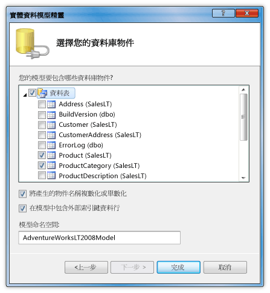
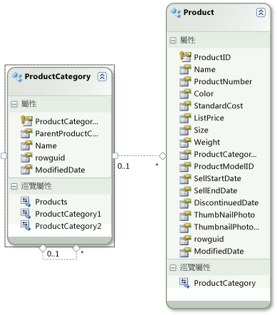

# 逐步解說： 在 DataGrid 控制項中顯示資料從 SQL Server 資料庫

在本逐步解說中，方法，您可以從 SQL Server 資料庫擷取資料，並顯示該資料<xref:System.Windows.Controls.DataGrid>控制項。 您可以使用 ADO.NET Entity Framework 建立的實體類別，代表資料，並使用 LINQ 來撰寫查詢來擷取指定的資料從實體類別。

## 必要條件

您需要下列元件才能完成此逐步解說：

-   Visual Studio。

-   SQL Server 或 SQL Server Express 具有 AdventureWorks 範例資料庫會附加至它的執行個體的存取。 您可以下載的 AdventureWorks 資料庫[GitHub](https://github.com/Microsoft/sql-server-samples/releases)。

## 建立實體類別

1.  在 Visual Basic 或 C# 中，建立新的 WPF 應用程式專案並將它命名`DataGridSQLExample`。

2.  在 [方案總管] 中，以滑鼠右鍵按一下您的專案，指向**新增**，然後選取**新項目**。

     [加入新項目] 對話方塊隨即出現。

3.  在 [已安裝的範本] 窗格中，選取**資料**，然後在範本清單中，選取**ADO.NET 實體資料模型**。

     

4.  將檔案命名`AdventureWorksModel.edmx`，然後按一下 **新增**。

     [實體資料模型精靈] 隨即出現。

5.  在 選擇模型內容 畫面中，選取**資料庫的 EF Designer** ，然後按一下**下一步**。

6.  在 [選擇資料連接] 畫面中，提供您 AdventureWorksLT2008 資料庫的連接。 如需詳細資訊，請參閱 <<c0> [ 選擇您的資料連接對話方塊](https://go.microsoft.com/fwlink/?LinkId=160190)。

    請確定名稱是`AdventureWorksLT2008Entities`且**將實體連接設定儲存在 App.Config 中為** 核取方塊已選取，然後再按**下一步**。

7.  在 [選擇您的資料庫物件] 畫面中，展開 [資料表] 節點，然後選取**產品**並**ProductCategory**資料表。

     您可以產生實體類別，所有的資料表。不過，在此範例中您只能從擷取資料這兩個資料表。

     

8. 按一下 [ **完成**]。

     在 Entity Designer 中，會顯示 Product 和 ProductCategory 實體。

     

## 擷取，並將資料呈現

1.  開啟 MainWindow.xaml 檔案。

2.  設定<xref:System.Windows.FrameworkElement.Width%2A>屬性上的<xref:System.Windows.Window>設為 450。

3.  在 [XAML 編輯器] 中，新增下列<xref:System.Windows.Controls.DataGrid>標記之間`<Grid>`並`</Grid>`要新增的標籤<xref:System.Windows.Controls.DataGrid>名為`dataGrid1`。

     [!code-xaml[DataGrid_SQL_EF_Walkthrough#3](../../../../samples/snippets/csharp/VS_Snippets_Wpf/DataGrid_SQL_EF_Walkthrough/CS/MainWindow.xaml#3)]

     

4.  選取 <xref:System.Windows.Window>。

5.  使用 [屬性] 視窗或 [XAML 編輯器] 中，建立事件處理常式<xref:System.Windows.Window>名為`Window_Loaded`如<xref:System.Windows.FrameworkElement.Loaded>事件。 如需詳細資訊，請參閱 <<c0> [ 如何： 建立簡單的事件處理常式](https://msdn.microsoft.com/library/b1456e07-9dec-4354-99cf-18666b64f480)。

     以下顯示 MainWindow.xaml 的 XAML。

    > [!NOTE]
    > 如果您使用 Visual Basic 中，在 MainWindow.xaml 的第一行中，取代`x:Class="DataGridSQLExample.MainWindow"`與`x:Class="MainWindow"`。

     [!code-xaml[DataGrid_SQL_EF_Walkthrough#1](../../../../samples/snippets/csharp/VS_Snippets_Wpf/DataGrid_SQL_EF_Walkthrough/CS/MainWindow.xaml#1)]

6.  開啟的程式碼後置檔案 （MainWindow.xaml.vb 或 MainWindow.xaml.cs） <xref:System.Windows.Window>。

7.  加入下列程式碼，從聯結的資料表擷取特定的值，並設定<xref:System.Windows.Controls.ItemsControl.ItemsSource%2A>屬性<xref:System.Windows.Controls.DataGrid>查詢的結果。

     [!code-csharp[DataGrid_SQL_EF_Walkthrough#2](../../../../samples/snippets/csharp/VS_Snippets_Wpf/DataGrid_SQL_EF_Walkthrough/CS/MainWindow.xaml.cs#2)]
     [!code-vb[DataGrid_SQL_EF_Walkthrough#2](../../../../samples/snippets/visualbasic/VS_Snippets_Wpf/DataGrid_SQL_EF_Walkthrough/VB/MainWindow.xaml.vb#2)]

8.  執行範例。

     您應該會看到<xref:System.Windows.Controls.DataGrid>顯示資料。

     

## 另請參閱

- <xref:System.Windows.Controls.DataGrid>
- [如何 do i： 開始使用 WPF 應用程式中的 Entity Framework？](https://go.microsoft.com/fwlink/?LinkId=159868)