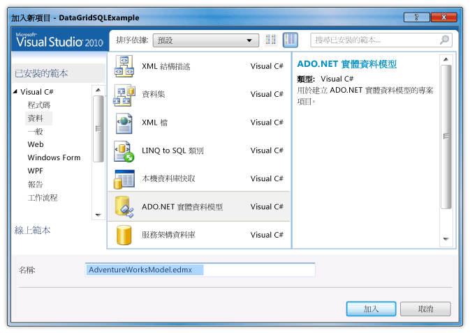
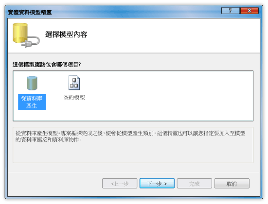
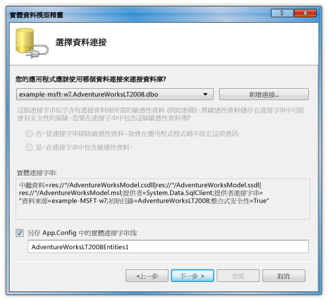

# 逐步解說：在 DataGrid 控制項中顯示來自 SQL Server 資料庫的資料Walkthrough: Display Data from a SQL Server Database in a DataGrid Control
在本逐步解說中，方法，您可以從 SQL Server 資料庫擷取資料，並顯示該資料<xref:System.Windows.Controls.DataGrid>控制項。In this walkthrough, you retrieve data from a SQL Server database and display that data in a <xref:System.Windows.Controls.DataGrid> control. 您可以使用 ADO.NET Entity Framework 建立的實體類別，代表資料，並使用 LINQ 來撰寫查詢來擷取指定的資料從實體類別。You use the ADO.NET Entity Framework to create the entity classes that represent the data, and use LINQ to write a query that retrieves the specified data from an entity class.  
  
## 必要條件Prerequisites  
 您需要下列元件才能完成此逐步解說：You need the following components to complete this walkthrough:  
  
-   [!INCLUDE[vs_dev11_long](../../../../includes/vs-dev11-long-md.md)]..  
  
-   SQL Server 或 SQL Server Express 具有 AdventureWorks 範例資料庫會附加至它的執行個體的存取。Access to a running instance of SQL Server or SQL Server Express that has the AdventureWorks sample database attached to it. 您可以下載的 AdventureWorks 資料庫[GitHub](https://github.com/Microsoft/sql-server-samples/releases)。You can download the AdventureWorks database from the [GitHub](https://github.com/Microsoft/sql-server-samples/releases).  
  
### 若要建立實體類別To create entity classes  
  
1.  在 Visual Basic 或 C# 中，建立新的 WPF 應用程式專案並將它命名`DataGridSQLExample`。Create a new WPF Application project in Visual Basic or C#, and name it `DataGridSQLExample`.  
  
2.  在 [方案總管] 中，以滑鼠右鍵按一下您的專案，指向**新增**，然後選取**新項目**。In Solution Explorer, right-click your project, point to **Add**, and then select **New Item**.  
  
     [加入新項目] 對話方塊隨即出現。The Add New Item dialog box appears.  
  
3.  在 [已安裝的範本] 窗格中，選取**資料**，然後在範本清單中，選取**ADO.NET 實體資料模式**l。In the Installed Templates pane, select **Data** and in the list of templates, select **ADO.NET Entity Data Mode**l.  
  
       
  
4.  將檔案命名`AdventureWorksModel.edmx`，然後按一下 **新增**。Name the file `AdventureWorksModel.edmx` and then click **Add**.  
  
     [實體資料模型精靈] 隨即出現。The Entity Data Model Wizard appears.  
  
5.  在 選擇模型內容 畫面中，選取**從資料庫產生**，然後按一下**下一步**。In the Choose Model Contents screen, select **Generate from database** and then click **Next**.  
  
       
  
6.  在 [選擇資料連接] 畫面中，提供您 AdventureWorksLT2008 資料庫的連接。In the Choose Your Data Connection screen, provide the connection to your AdventureWorksLT2008 database. 如需詳細資訊，請參閱 <<c0> [ 選擇您的資料連接對話方塊](https://go.microsoft.com/fwlink/?LinkId=160190)。For more information, see [Choose Your Data Connection Dialog Box](https://go.microsoft.com/fwlink/?LinkId=160190).  
  
       
  
7.  請確定名稱是`AdventureWorksLT2008Entities`且**將實體連接設定儲存在 App.Config 中為** 核取方塊已選取，然後再按**下一步**。Make sure that the name is `AdventureWorksLT2008Entities` and that the **Save entity connection settings in App.Config as** check box is selected, and then click **Next**.  
  
8.  在 [選擇您的資料庫物件] 畫面中，展開 [資料表] 節點，然後選取**產品**並**ProductCategory**資料表。In the Choose Your Database Objects screen, expand the Tables node, and select the **Product** and **ProductCategory** tables.  
  
     您可以產生實體類別，所有的資料表。不過，在此範例中您只能從擷取資料這兩個資料表。You can generate entity classes for all of the tables; however, in this example you only retrieve data from those two tables.  
  
       
  
9. 按一下 [ **完成**]。Click **Finish**.  
  
     在 Entity Designer 中，會顯示 Product 和 ProductCategory 實體。The Product and ProductCategory entities are displayed in the Entity Designer.  
  
       
  
### 擷取及呈現資料To retrieve and present the data  
  
1.  開啟 MainWindow.xaml 檔案。Open the MainWindow.xaml file.  
  
2.  設定<xref:System.Windows.FrameworkElement.Width%2A>屬性上的<xref:System.Windows.Window>設為 450。Set the <xref:System.Windows.FrameworkElement.Width%2A> property on the <xref:System.Windows.Window> to 450.  
  
3.  在 [XAML 編輯器] 中，新增下列<xref:System.Windows.Controls.DataGrid>標記之間`<Grid>`並`</Grid>`要新增的標籤<xref:System.Windows.Controls.DataGrid>名為`dataGrid1`。In the XAML editor, add the following <xref:System.Windows.Controls.DataGrid> tag between the `<Grid>` and `</Grid>` tags to add a <xref:System.Windows.Controls.DataGrid> named `dataGrid1`.  
  
     [!code-xaml[DataGrid_SQL_EF_Walkthrough#3](../../../../samples/snippets/csharp/VS_Snippets_Wpf/DataGrid_SQL_EF_Walkthrough/CS/MainWindow.xaml#3)]  
  
       
  
4.  選取 <xref:System.Windows.Window>。Select the <xref:System.Windows.Window>.  
  
5.  使用 [屬性] 視窗或 [XAML 編輯器] 中，建立事件處理常式<xref:System.Windows.Window>名為`Window_Loaded`如<xref:System.Windows.FrameworkElement.Loaded>事件。Using the Properties window or XAML editor, create an event handler for the <xref:System.Windows.Window> named `Window_Loaded` for the <xref:System.Windows.FrameworkElement.Loaded> event. 如需詳細資訊，請參閱 <<c0> [ 如何： 建立簡單的事件處理常式](https://msdn.microsoft.com/library/b1456e07-9dec-4354-99cf-18666b64f480)。For more information, see [How to: Create a Simple Event Handler](https://msdn.microsoft.com/library/b1456e07-9dec-4354-99cf-18666b64f480).  
  
     以下顯示 MainWindow.xaml 的 XAML。The following shows the XAML for MainWindow.xaml.  
  
    > [!NOTE]
    >  如果您使用 Visual Basic 中，在 MainWindow.xaml 的第一行中，取代`x:Class="DataGridSQLExample.MainWindow"`與`x:Class="MainWindow"`。If you are using Visual Basic, in the first line of MainWindow.xaml, replace `x:Class="DataGridSQLExample.MainWindow"` with `x:Class="MainWindow"`.  
  
     [!code-xaml[DataGrid_SQL_EF_Walkthrough#1](../../../../samples/snippets/csharp/VS_Snippets_Wpf/DataGrid_SQL_EF_Walkthrough/CS/MainWindow.xaml#1)]  
  
6.  開啟的程式碼後置檔案 （MainWindow.xaml.vb 或 MainWindow.xaml.cs） <xref:System.Windows.Window>。Open the code-behind file (MainWindow.xaml.vb or MainWindow.xaml.cs) for the <xref:System.Windows.Window>.  
  
7.  加入下列程式碼，從聯結的資料表擷取特定的值，並設定<xref:System.Windows.Controls.ItemsControl.ItemsSource%2A>屬性<xref:System.Windows.Controls.DataGrid>查詢的結果。Add the following code to retrieve only specific values from the joined tables and set the <xref:System.Windows.Controls.ItemsControl.ItemsSource%2A> property of the <xref:System.Windows.Controls.DataGrid> to the results of the query.  
  
     [!code-csharp[DataGrid_SQL_EF_Walkthrough#2](../../../../samples/snippets/csharp/VS_Snippets_Wpf/DataGrid_SQL_EF_Walkthrough/CS/MainWindow.xaml.cs#2)]
     [!code-vb[DataGrid_SQL_EF_Walkthrough#2](../../../../samples/snippets/visualbasic/VS_Snippets_Wpf/DataGrid_SQL_EF_Walkthrough/VB/MainWindow.xaml.vb#2)]  
  
8.  執行範例。Run the example.  
  
     您應該會看到<xref:System.Windows.Controls.DataGrid>顯示資料。You should see a <xref:System.Windows.Controls.DataGrid> that displays data.  
  
       
  
## 後續步驟Next Steps  
  
## 另請參閱See Also  
 <xref:System.Windows.Controls.DataGrid>  
 [如何 do i： 開始使用 WPF 應用程式中的 Entity Framework？How Do I: Get Started with Entity Framework in WPF Applications?](https://go.microsoft.com/fwlink/?LinkId=159868)
