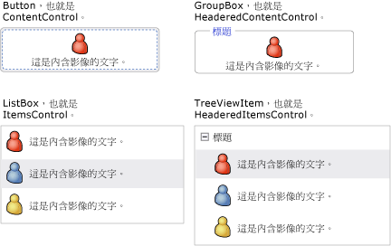
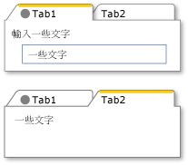
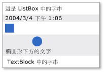
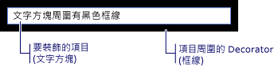

# WPF 內容模型
[!INCLUDE[TLA#tla_winclient](../../../../includes/tlasharptla-winclient-md.md)] 是展示平台，提供許多以顯示不同類型內容為主要目的的控制項和類似控制項的類型。  為了判斷要使用哪一種控制項或從哪一種控制項衍生，您應該了解特定控制項顯示哪些物件的效果最佳。  
  
 本主題摘要說明 [!INCLUDE[TLA2#tla_winclient](../../../../includes/tla2sharptla-winclient-md.md)] 控制項和類似控制項的類型所適用的內容模型。  內容模型描述控制項中可使用的內容。本主題同時列出每一個內容模型的內容屬性。  內容屬性是一種用於儲存物件內容的屬性。  
  
 [!INCLUDE[autoOutline](../Token/autoOutline_md.md)]  
  
   
## 包含任意內容的類別  
 某些控制項可以包含任何類型的物件，例如字串、<xref:System.DateTime> 物件，或是本身為其他項目之容器的 <xref:System.Windows.UIElement>。  例如，<xref:System.Windows.Controls.Button> 可以包含影像和某些文字；或是 <xref:System.Windows.Controls.CheckBox> 可以包含 <xref:System.DateTime.Now%2A?displayProperty=fullName> 的值。  
  
 [!INCLUDE[TLA2#tla_winclient](../../../../includes/tla2sharptla-winclient-md.md)] 有四種可包含任意內容的類別。  下表列出繼承自 <xref:System.Windows.Controls.Control> 的類別。  
  
|包含任意內容的類別|內容|  
|---------------|--------|  
|<xref:System.Windows.Controls.ContentControl>|單一任意物件。|  
|<xref:System.Windows.Controls.HeaderedContentControl>|標頭和單一項目，兩者都是任意物件。|  
|<xref:System.Windows.Controls.ItemsControl>|任意物件的集合。|  
|<xref:System.Windows.Controls.HeaderedItemsControl>|標頭和項目集合，這些全部都是任意物件。|  
  
 繼承自這些類別的控制項可以包含相同類型的內容，並且以相同方式處理內容。  下圖顯示每個內容模型中一個內含影像和某些文字的控制項。  
  
   
  
### 包含單一任意物件的控制項  
 <xref:System.Windows.Controls.ContentControl> 類別包含單獨一項任意內容。  其內容屬性為 <xref:System.Windows.Controls.ContentControl.Content%2A>。  下列控制項繼承自 <xref:System.Windows.Controls.ContentControl> 並且使用其內容模型：  
  
-   <xref:System.Windows.Controls.Button>  
  
-   <xref:System.Windows.Controls.Primitives.ButtonBase>  
  
-   <xref:System.Windows.Controls.CheckBox>  
  
-   <xref:System.Windows.Controls.ComboBoxItem>  
  
-   <xref:System.Windows.Controls.ContentControl>  
  
-   <xref:System.Windows.Controls.Frame>  
  
-   <xref:System.Windows.Controls.GridViewColumnHeader>  
  
-   <xref:System.Windows.Controls.GroupItem>  
  
-   <xref:System.Windows.Controls.Label>  
  
-   <xref:System.Windows.Controls.ListBoxItem>  
  
-   <xref:System.Windows.Controls.ListViewItem>  
  
-   <xref:System.Windows.Navigation.NavigationWindow>  
  
-   <xref:System.Windows.Controls.RadioButton>  
  
-   <xref:System.Windows.Controls.Primitives.RepeatButton>  
  
-   <xref:System.Windows.Controls.ScrollViewer>  
  
-   <xref:System.Windows.Controls.Primitives.StatusBarItem>  
  
-   <xref:System.Windows.Controls.Primitives.ToggleButton>  
  
-   <xref:System.Windows.Controls.ToolTip>  
  
-   <xref:System.Windows.Controls.UserControl>  
  
-   <xref:System.Windows.Window>  
  
 下圖顯示四個按鈕，其 <xref:System.Windows.Controls.ContentControl.Content%2A> 設為字串、<xref:System.DateTime> 物件、<xref:System.Windows.Shapes.Rectangle>，以及包含 <xref:System.Windows.Shapes.Ellipse> 和 <xref:System.Windows.Controls.TextBlock> 的 <xref:System.Windows.Controls.Panel>。  
  
   
這四個按鈕擁有不同類型的內容  
  
 如需如何設定 <xref:System.Windows.Controls.ContentControl.Content%2A> 屬性的範例，請參閱 <xref:System.Windows.Controls.ContentControl>。  
  
### 包含標頭和單一任意物件的控制項  
 <xref:System.Windows.Controls.HeaderedContentControl> 類別繼承自 <xref:System.Windows.Controls.ContentControl>，並且會顯示包含標頭的內容。  它會從 <xref:System.Windows.Controls.ContentControl> 繼承內容屬性 <xref:System.Windows.Controls.ContentControl.Content%2A>，並且定義 <xref:System.Object> 型別的 <xref:System.Windows.Controls.HeaderedContentControl.Header%2A> 屬性，因此兩者都可以是任意物件。  
  
 下列控制項繼承自 <xref:System.Windows.Controls.HeaderedContentControl> 並且使用其內容模型：  
  
-   <xref:System.Windows.Controls.Expander>  
  
-   <xref:System.Windows.Controls.GroupBox>  
  
-   <xref:System.Windows.Controls.TabItem>  
  
 下圖顯示兩個 <xref:System.Windows.Controls.TabItem> 物件。  第一個 <xref:System.Windows.Controls.TabItem> 擁有 <xref:System.Windows.UIElement> 物件做為 <xref:System.Windows.Controls.HeaderedContentControl.Header%2A> 和 <xref:System.Windows.Controls.ContentControl.Content%2A>。  <xref:System.Windows.Controls.HeaderedContentControl.Header%2A> 設定為 <xref:System.Windows.Controls.StackPanel>，其中包含 <xref:System.Windows.Shapes.Ellipse> 和 <xref:System.Windows.Controls.TextBlock>。  <xref:System.Windows.Controls.ContentControl.Content%2A> 設定為 <xref:System.Windows.Controls.StackPanel>，其中包含 <xref:System.Windows.Controls.TextBlock> 和 <xref:System.Windows.Controls.Label>。  第二個 <xref:System.Windows.Controls.TabItem> 在 <xref:System.Windows.Controls.HeaderedContentControl.Header%2A> 中擁有字串，而且在 <xref:System.Windows.Controls.ContentControl.Content%2A> 中擁有 <xref:System.Windows.Controls.TextBlock>。  
  
   
在 Header 屬性中使用不同類型的 TabControl  
  
 如需如何建立 <xref:System.Windows.Controls.TabItem> 物件的範例，請參閱 <xref:System.Windows.Controls.HeaderedContentControl>。  
  
### 包含任意物件集合的控制項  
 <xref:System.Windows.Controls.ItemsControl> 類別繼承自 <xref:System.Windows.Controls.Control>，並且可以包含多個項目 \(Item\)，例如字串、物件或其他項目 \(Element\)。  其內容屬性為 <xref:System.Windows.Controls.ItemsControl.ItemsSource%2A> 和 <xref:System.Windows.Controls.ItemsControl.Items%2A>。  <xref:System.Windows.Controls.ItemsControl.ItemsSource%2A> 通常用來將資料集合填入 <xref:System.Windows.Controls.ItemsControl>。  如果您不想要使用集合填入 <xref:System.Windows.Controls.ItemsControl>，可以使用 <xref:System.Windows.Controls.ItemsControl.Items%2A> 屬性加入項目。  
  
 下列控制項繼承自 <xref:System.Windows.Controls.ItemsControl> 並且使用其內容模型：  
  
-   <xref:System.Windows.Controls.Menu>  
  
-   <xref:System.Windows.Controls.Primitives.MenuBase>  
  
-   <xref:System.Windows.Controls.ContextMenu>  
  
-   <xref:System.Windows.Controls.ComboBox>  
  
-   <xref:System.Windows.Controls.ItemsControl>  
  
-   <xref:System.Windows.Controls.ListBox>  
  
-   <xref:System.Windows.Controls.ListView>  
  
-   <xref:System.Windows.Controls.TabControl>  
  
-   <xref:System.Windows.Controls.TreeView>  
  
-   <xref:System.Windows.Controls.Primitives.Selector>  
  
-   <xref:System.Windows.Controls.Primitives.StatusBar>  
  
 下圖顯示的 <xref:System.Windows.Controls.ListBox> 包含這些類型的項目：  
  
-   字串。  
  
-   <xref:System.DateTime> 物件。  
  
-   <xref:System.Windows.UIElement>。  
  
-   包含 <xref:System.Windows.Shapes.Ellipse> 和 <xref:System.Windows.Controls.TextBlock> 的 <xref:System.Windows.Controls.Panel>。  
  
   
包含多種類型物件的 ListBox  
  
### 包含標頭和任意物件集合的控制項  
 <xref:System.Windows.Controls.HeaderedItemsControl> 類別繼承自 <xref:System.Windows.Controls.ItemsControl>，並且可以包含多個項目 \(Item\)，例如字串、物件或其他項目 \(Element\) 及標題。  它會繼承 <xref:System.Windows.Controls.ItemsControl> 內容屬性、<xref:System.Windows.Controls.ItemsControl.ItemsSource%2A> 和 <xref:System.Windows.Controls.ItemsControl.Items%2A>，並且定義可以是任意物件的 <xref:System.Windows.Controls.HeaderedItemsControl.Header%2A> 屬性。  
  
 下列控制項繼承自 <xref:System.Windows.Controls.HeaderedItemsControl> 並且使用其內容模型：  
  
-   <xref:System.Windows.Controls.MenuItem>  
  
-   <xref:System.Windows.Controls.ToolBar>  
  
-   <xref:System.Windows.Controls.TreeViewItem>  
  
   
## 包含 UIElement 物件集合的類別  
 <xref:System.Windows.Controls.Panel> 類別會定位和排列子 <xref:System.Windows.UIElement> 物件。  其內容屬性為 <xref:System.Windows.Controls.Panel.Children%2A>。  
  
 下列類別繼承自 <xref:System.Windows.Controls.Panel> 類別，並且使用其內容模型：  
  
-   <xref:System.Windows.Controls.Canvas>  
  
-   <xref:System.Windows.Controls.DockPanel>  
  
-   <xref:System.Windows.Controls.Grid>  
  
-   <xref:System.Windows.Controls.Primitives.TabPanel>  
  
-   <xref:System.Windows.Controls.Primitives.ToolBarOverflowPanel>  
  
-   <xref:System.Windows.Controls.Primitives.ToolBarPanel>  
  
-   <xref:System.Windows.Controls.Primitives.UniformGrid>  
  
-   <xref:System.Windows.Controls.StackPanel>  
  
-   <xref:System.Windows.Controls.VirtualizingPanel>  
  
-   <xref:System.Windows.Controls.VirtualizingStackPanel>  
  
-   <xref:System.Windows.Controls.WrapPanel>  
  
 如需詳細資訊，請參閱 [面板概觀](../../../../docs/framework/wpf/controls/panels-overview.md)。  
  
   
## 影響 UIElement 外觀的類別  
 <xref:System.Windows.Controls.Decorator> 類別會將視覺效果套用至單一子 <xref:System.Windows.UIElement> 上或周圍。  其內容屬性為 <xref:System.Windows.Controls.Decorator.Child%2A>。  下列類別繼承自 <xref:System.Windows.Controls.Decorator> 並且使用其內容模型：  
  
-   <xref:System.Windows.Documents.AdornerDecorator>  
  
-   <xref:System.Windows.Controls.Border>  
  
-   <xref:System.Windows.Controls.Primitives.BulletDecorator>  
  
-   <xref:Microsoft.Windows.Themes.ButtonChrome>  
  
-   <xref:Microsoft.Windows.Themes.ClassicBorderDecorator>  
  
-   <xref:System.Windows.Controls.InkPresenter>  
  
-   <xref:Microsoft.Windows.Themes.ListBoxChrome>  
  
-   <xref:Microsoft.Windows.Themes.SystemDropShadowChrome>  
  
-   <xref:System.Windows.Controls.Viewbox>  
  
 下圖顯示周圍有 <xref:System.Windows.Controls.Border> \(以其做為裝飾\) 的 <xref:System.Windows.Controls.TextBox>。  
  
   
擁有框線的 TextBlock  
  
   
## 提供 UIElement 相關視覺化回應的類別  
 <xref:System.Windows.Documents.Adorner> 類別會對使用者提供視覺提示。  例如，使用 <xref:System.Windows.Documents.Adorner> 可將功能控點加入至項目，或提供有關控制項的狀態資訊。  <xref:System.Windows.Documents.Adorner> 類別會提供架構，讓您建立自己的裝飾項。  [!INCLUDE[TLA2#tla_winclient](../../../../includes/tla2sharptla-winclient-md.md)] 不會提供任何實作的裝飾項。  如需詳細資訊，請參閱 [裝飾項概觀](../../../../docs/framework/wpf/controls/adorners-overview.md)。  
  
   
## 可讓使用者輸入文字的類別  
 WPF 提供三種可讓使用者輸入文字的主要控制項。  每一個控制項都會以不同方式顯示文字。  下表列出這三個文字相關控制項、其顯示文字時的功能，以及包含控制項文字的屬性。  
  
|控制項|文字顯示為|內容屬性|  
|---------|-----------|----------|  
|<xref:System.Windows.Controls.TextBox>|純文字|<xref:System.Windows.Controls.TextBox.Text%2A>|  
|<xref:System.Windows.Controls.RichTextBox>|格式化的文字|<xref:System.Windows.Controls.RichTextBox.Document%2A>|  
|<xref:System.Windows.Controls.PasswordBox>|隱藏文字 \(字元會加上遮罩\)|<xref:System.Windows.Controls.PasswordBox.Password%2A>|  
  
   
## 顯示文字的類別  
 有數種類別可用來顯示純文字或格式化文字。  您可以使用 <xref:System.Windows.Controls.TextBlock> 顯示數量較少的文字。  如果您要顯示大量文字，請使用 <xref:System.Windows.Controls.FlowDocumentReader>、<xref:System.Windows.Controls.FlowDocumentPageViewer> 或 <xref:System.Windows.Controls.FlowDocumentScrollViewer> 控制項。  
  
 <xref:System.Windows.Controls.TextBlock> 有兩個內容屬性：<xref:System.Windows.Controls.TextBlock.Text%2A> 和 <xref:System.Windows.Controls.TextBlock.Inlines%2A>。  當您要顯示使用一致格式設定的文字時，<xref:System.Windows.Controls.TextBlock.Text%2A> 屬性常是您最佳的選擇。  如果您打算在整個文字上使用不同的格式設定，請使用 <xref:System.Windows.Controls.TextBlock.Inlines%2A> 屬性。  <xref:System.Windows.Controls.TextBlock.Inlines%2A> 屬性是 <xref:System.Windows.Documents.Inline> 物件的集合，會指定如何格式化文字。  
  
 下表列出 <xref:System.Windows.Controls.FlowDocumentReader>、<xref:System.Windows.Controls.FlowDocumentPageViewer> 及 <xref:System.Windows.Controls.FlowDocumentScrollViewer> 等類別的內容屬性。  
  
|控制項|內容屬性|內容屬性型別|  
|---------|----------|------------|  
|<xref:System.Windows.Controls.FlowDocumentPageViewer>|Document|<xref:System.Windows.Documents.IDocumentPaginatorSource>|  
|<xref:System.Windows.Controls.FlowDocumentReader>|Document|<xref:System.Windows.Documents.FlowDocument>|  
|<xref:System.Windows.Controls.FlowDocumentScrollViewer>|Document|<xref:System.Windows.Documents.FlowDocument>|  
  
 <xref:System.Windows.Documents.FlowDocument> 會實作 <xref:System.Windows.Documents.IDocumentPaginatorSource> 介面；因此這三種類別都可以採用 <xref:System.Windows.Documents.FlowDocument> 做為內容。  
  
   
## 格式化文字的類別  
 <xref:System.Windows.Documents.TextElement> 及其相關類別可讓您格式化文字。  <xref:System.Windows.Documents.TextElement> 物件包含 <xref:System.Windows.Controls.TextBlock> 和 <xref:System.Windows.Documents.FlowDocument> 物件中的文字，並且會將文字格式化。  <xref:System.Windows.Documents.TextElement> 物件的兩種主要型別為 <xref:System.Windows.Documents.Block> 項目和 <xref:System.Windows.Documents.Inline> 項目。  <xref:System.Windows.Documents.Block> 項目表示文字區塊，例如段落或清單。  <xref:System.Windows.Documents.Inline> 項目表示區塊中一部分的文字。  許多 <xref:System.Windows.Documents.Inline> 類別會指定可套用的文字格式。  每個 <xref:System.Windows.Documents.TextElement> 都有自己的內容模型。  如需詳細資訊，請參閱 [TextElement 內容模型概觀](../../../../docs/framework/wpf/advanced/textelement-content-model-overview.md)。  
  
## 請參閱  
 [進階](../../../../docs/framework/wpf/advanced/index.md)