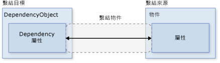
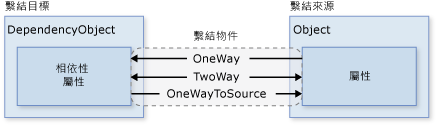
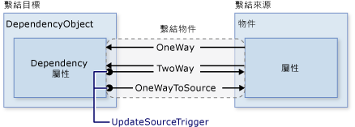
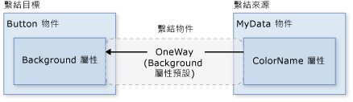
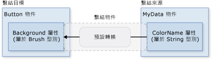
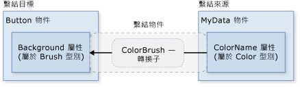
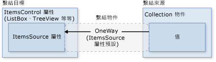

# <a name="data-binding-overview"></a>資料繫結概觀
[!INCLUDE[TLA#tla_winclient](../../../../includes/tlasharptla-winclient-md.md)] 資料繫結在資料的展示和互動上，提供應用程式簡單而一致的方式。 項目可以和各種資料來源的資料繫結，資料的形式可以是 [!INCLUDE[TLA#tla_clr](../../../../includes/tlasharptla-clr-md.md)] 物件和 [!INCLUDE[TLA#tla_xml](../../../../includes/tlasharptla-xml-md.md)]。 <xref:System.Windows.Controls.ContentControl>這類的 s<xref:System.Windows.Controls.Button>並<xref:System.Windows.Controls.ItemsControl>這類的 s<xref:System.Windows.Controls.ListBox>和<xref:System.Windows.Controls.ListView>有內建的功能，可讓彈性的樣式，單一資料項目的集合。 您可以在資料上方產生排序、篩選和群組檢視。  
  
 相較於傳統模型，[!INCLUDE[TLA2#tla_winclient](../../../../includes/tla2sharptla-winclient-md.md)] 中的資料繫結功能具有數個優點，包括本身就支援資料繫結的相當多屬性、資料的彈性 [!INCLUDE[TLA2#tla_ui](../../../../includes/tla2sharptla-ui-md.md)] 表示，以及 [!INCLUDE[TLA2#tla_ui](../../../../includes/tla2sharptla-ui-md.md)] 個別的清楚商務邏輯。  
  
 本主題會先討論基本概念[!INCLUDE[TLA2#tla_winclient](../../../../includes/tla2sharptla-winclient-md.md)]資料繫結，然後再說明使用<xref:System.Windows.Data.Binding>類別和資料繫結的其他功能。  
  
  
<a name="what_is_data_binding"></a>   
## <a name="what-is-data-binding"></a>資料繫結是什麼？  
 資料繫結是指在應用程式 [!INCLUDE[TLA2#tla_ui](../../../../includes/tla2sharptla-ui-md.md)] 與商務邏輯之間建立連接的程序。 如果繫結具有正確的設定而且資料提供了適當的通知，則當資料變更其值時，繫結至資料的元素就會自動反映變更。 資料繫結也代表在元素資料的外部表示變更時，基礎資料也會自動更新以反映變更。 例如，如果使用者編輯中的值<xref:System.Windows.Controls.TextBox>項目，基礎資料值會自動更新以反映該變更。  
  
 一個資料繫結的常見用法是將伺服器或本機組態資料，放入表單或其他 [!INCLUDE[TLA2#tla_ui](../../../../includes/tla2sharptla-ui-md.md)] 控制項中。 [!INCLUDE[TLA2#tla_winclient](../../../../includes/tla2sharptla-winclient-md.md)] 中會擴充這個概念，以包含相當多屬性對各種資料來源的繫結。 在 [!INCLUDE[TLA2#tla_winclient](../../../../includes/tla2sharptla-winclient-md.md)] 中，元素的相依性屬性可以繫結到 [!INCLUDE[TLA2#tla_clr](../../../../includes/tla2sharptla-clr-md.md)] 物件 (包括 [!INCLUDE[TLA#tla_adonet](../../../../includes/tlasharptla-adonet-md.md)] 物件或與 Web 服務和 Web 屬性關聯的物件) 和 [!INCLUDE[TLA2#tla_xml](../../../../includes/tla2sharptla-xml-md.md)] 資料。  
  
 如需資料繫結的範例，請參考下列來自[資料繫結示範](https://go.microsoft.com/fwlink/?LinkID=163703) 的應用程式 [!INCLUDE[TLA2#tla_ui](../../../../includes/tla2sharptla-ui-md.md)]：  
  
   
  
 上面的應用程式 [!INCLUDE[TLA2#tla_ui](../../../../includes/tla2sharptla-ui-md.md)] 會顯示拍賣項目的清單。 應用程式會示範下列資料繫結功能：  
  
-   內容<xref:System.Windows.Controls.ListBox>繫結至的集合*AuctionItem*物件。 *AuctionItem* 物件具有 *Description*、*StartPrice*、*StartDate*、*Category* 和 *SpecialFeatures* 等屬性。  
  
-   資料 (*Specialfeatures*物件) 中顯示<xref:System.Windows.Controls.ListBox>已套用範本，以顯示描述，而且目前的價格為每個項目。 這是使用<xref:System.Windows.DataTemplate>。 除此之外，每個項目的外觀取決於所顯示 *AuctionItem* 的 *SpecialFeatures* 值。 如果 *AuctionItem* 的 *SpecialFeatures* 值是 *Color*，項目就具有藍色框線。 如果值是 *Highlight*，項目就具有橘色框線和星號。 [資料範本化](#data_templating)一節會提供資料範本化的相關資訊。  
  
-   使用者可以分組、 篩選或排序資料使用<xref:System.Windows.Controls.CheckBox>es 提供。 在上圖中，"Group by category"和"Sort by category and date" <xref:System.Windows.Controls.CheckBox>es 已選取。 您可能已經注意到，資料的群組化是依據產品的分類，且分類名稱是以字母順序排列。 雖然在圖中很難辨識，但項目在每個分類內也有以開始日期排序。 這是藉由使用*集合檢視*而達成的。 [繫結至集合](#binding_to_collections)一節會討論集合檢視。  
  
-   當使用者選取項目，<xref:System.Windows.Controls.ContentControl>顯示選取的項目詳細資料。 這稱為*一對多案例*。 [一對多案例](#master_detail_scenario)一節會提供這類型繫結案例的相關資訊。  
  
-   型別*StartDate*屬性是<xref:System.DateTime>，它會傳回包含時間的毫秒數的日期。 這個應用程式中有使用自訂轉換器，因此顯示較短的日期字串。 [資料轉換](#data_conversion)一節會提供轉換器的相關資訊。  
  
 當使用者按一下 [Add Product (加入產品)] 按鈕時，會出現下列表單：  
  
   
  
 使用者可以編輯表單中的欄位、使用簡短預覽和更為詳盡的預覽窗格來預覽產品清單，然後再按一下 [Submit (提交)] 以加入新產品清單。 任何現有的群組、篩選和排序功能會套用到新項目上。 在這種特定情形下，輸入上圖的項目會在 [Computer (電腦)] 分類內顯示為第二個項目。  
  
 不會顯示此映像會在提供的驗證邏輯*Start Date* <xref:System.Windows.Controls.TextBox>。 如果使用者輸入無效的日期 （無效的格式或過去的日期），就會通知使用者，與<xref:System.Windows.Controls.ToolTip>和旁的紅色驚嘆號<xref:System.Windows.Controls.TextBox>。 [資料驗證](#data_validation)一節會討論如何建立驗證邏輯。  
  
 在進入上面概要說明的各種功能之前，下節中我們會先討論對於了解 [!INCLUDE[TLA2#tla_winclient](../../../../includes/tla2sharptla-winclient-md.md)] 資料繫結很重要的基本概念。  
  
## <a name="basic-data-binding-concepts"></a>基本資料繫結概念  
  
 不管您的繫結元素是什麼，也不論資料來源的本質，每個繫結一定會遵循下圖所說明的模型：  
  
   
  
 如上圖所說明，資料繫結基本上是繫結目標和繫結來源間的橋樑。 該圖示範下列基本 [!INCLUDE[TLA2#tla_winclient](../../../../includes/tla2sharptla-winclient-md.md)] 資料繫結概念：  
  
-   一般而言，每個繫結都具有這四個元件：繫結目標物件、目標屬性、繫結來源，以及繫結來源中要使用之值的路徑。 比方說，如果您想要繫結的內容<xref:System.Windows.Controls.TextBox>要*名稱*屬性*員工*物件，您的目標物件是<xref:System.Windows.Controls.TextBox>，目標屬性是<xref:System.Windows.Controls.TextBox.Text%2A>屬性，要使用的值是*名稱*，而且來源物件*員工*物件。  
  
-   目標屬性必須是相依性屬性。 大部分<xref:System.Windows.UIElement>屬性是相依性屬性，而大部分的相依性屬性，唯讀的除了預設支援資料繫結。 (僅<xref:System.Windows.DependencyObject>類型可以定義相依性屬性以及所有<xref:System.Windows.UIElement>均衍生自<xref:System.Windows.DependencyObject>。)  
  
-   雖然圖中未指出，但應該注意的是，繫結來源物件不限於自訂的 [!INCLUDE[TLA2#tla_clr](../../../../includes/tla2sharptla-clr-md.md)] 物件。 [!INCLUDE[TLA2#tla_winclient](../../../../includes/tla2sharptla-winclient-md.md)] 資料繫結支援 [!INCLUDE[TLA2#tla_clr](../../../../includes/tla2sharptla-clr-md.md)] 物件和 [!INCLUDE[TLA2#tla_xml](../../../../includes/tla2sharptla-xml-md.md)] 格式的資料。 若要提供一些範例，可能會繫結來源<xref:System.Windows.UIElement>，任何清單物件、[!INCLUDE[TLA2#tla_clr](../../../../includes/tla2sharptla-clr-md.md)]相關聯的物件[!INCLUDE[TLA#tla_adonet](../../../../includes/tlasharptla-adonet-md.md)]資料或 Web 服務或 XmlNode，其中包含您[!INCLUDE[TLA2#tla_xml](../../../../includes/tla2sharptla-xml-md.md)]資料。 如需詳細資訊，請參閱[繫結來源概觀](../../../../docs/framework/wpf/data/binding-sources-overview.md)。  
  
 當您閱讀其他[!INCLUDE[TLA#tla_sdk](../../../../includes/tlasharptla-sdk-md.md)] 主題時有一點很重要，請記住在建立繫結時，是將繫結目標「繫結到」繫結來源。 例如，如果您要顯示一些基本[!INCLUDE[TLA2#tla_xml](../../../../includes/tla2sharptla-xml-md.md)]中的資料<xref:System.Windows.Controls.ListBox>使用資料繫結，您要繫結您<xref:System.Windows.Controls.ListBox>到[!INCLUDE[TLA2#tla_xml](../../../../includes/tla2sharptla-xml-md.md)]資料。  
  
 若要建立繫結，您使用<xref:System.Windows.Data.Binding>物件。 本主題的其餘部分討論的許多概念與相關聯，以及一些屬性和使用方式<xref:System.Windows.Data.Binding>物件。  
  
<a name="direction_of_data_flow"></a>   
### <a name="direction-of-the-data-flow"></a>資料流程的方向  
 如先前所述，並在上圖中箭頭所指示時，資料流程的繫結可以從繫結目標移至繫結來源 (例如，來源值變更當使用者編輯的值<xref:System.Windows.Controls.TextBox>) 及/或將繫結來源要繫結目標 (例如，您<xref:System.Windows.Controls.TextBox>繫結來源中的變更更新內容，取得) 如果繫結來源提供適當的通知。  
  
 您可能會想讓使用者透過應用程式變更資料，並將變更散佈回來源物件。 或者您可能不希望使用者更新來源資料。 您可以設定來控制這<xref:System.Windows.Data.Binding.Mode%2A>屬性的程式<xref:System.Windows.Data.Binding>物件。 下圖說明不同類型的資料流程：  
  
   
  
-   <xref:System.Windows.Data.BindingMode.OneWay> 繫結會自動更新目標屬性中，[來源] 屬性的變更，但目標屬性的變更不會傳播回來源屬性。 如果要繫結的控制項是隱含唯讀的，這種類型的繫結很適當。 例如，您可以繫結到股票行情即時看板這類的來源，或者目標屬性沒有可供進行變更的控制項介面，例如資料表的資料繫結背景色彩。 如果沒有不需要監視目標屬性的變更，使用<xref:System.Windows.Data.BindingMode.OneWay>繫結模式可以避免的額外負荷<xref:System.Windows.Data.BindingMode.TwoWay>繫結模式。  
  
-   <xref:System.Windows.Data.BindingMode.TwoWay> 繫結會讓來源屬性或要自動更新對方的目標屬性的變更。 這種類型的繫結適合可編輯表單或其他完全互動式的 [!INCLUDE[TLA2#tla_ui](../../../../includes/tla2sharptla-ui-md.md)] 案例。 大部分屬性預設為<xref:System.Windows.Data.BindingMode.OneWay>繫結，但是某些相依性屬性 (通常是屬性的使用者可編輯的控制項，例如<xref:System.Windows.Controls.TextBox.Text%2A>屬性<xref:System.Windows.Controls.TextBox>並<xref:System.Windows.Controls.Primitives.ToggleButton.IsChecked%2A>屬性<xref:System.Windows.Controls.CheckBox>) 預設為<xref:System.Windows.Data.BindingMode.TwoWay>繫結。 判斷相依性屬性預設是否會單向或雙向繫結的程式設計方式是，使用 <xref:System.Windows.DependencyProperty.GetMetadata%2A> 取得屬性的屬性中繼資料，然後檢查 <xref:System.Windows.FrameworkPropertyMetadata.BindsTwoWayByDefault%2A> 屬性的布林值。  
  
-   <xref:System.Windows.Data.BindingMode.OneWayToSource> 是的反向<xref:System.Windows.Data.BindingMode.OneWay>繫結，它會更新來源 屬性的目標屬性變更時。 範例案例之一是當您只需要從 [!INCLUDE[TLA2#tla_ui](../../../../includes/tla2sharptla-ui-md.md)] 重新評估來源值時。  
  
-   圖中未說明為<xref:System.Windows.Data.BindingMode.OneTime>繫結，這會讓來源屬性，來初始化目標屬性，但並不會傳播後續變更。 這代表如果資料內容發生變更或資料內容中的物件有變更，則變更不會反映在目標屬性中。 如果您使用的資料適合使用目前狀態的快照集或資料是真正的靜態，則此類型的繫結很適當。 如果您想要以來源屬性的某些值初始化目標屬性，但無法預先得知資料內容，則此類型的繫結也很有用。 這是基本簡易形式的<xref:System.Windows.Data.BindingMode.OneWay>繫結，提供更佳的效能，在來源值不會變更的情況下。  
  
 請注意，若要偵測來源變更 (適用於<xref:System.Windows.Data.BindingMode.OneWay>並<xref:System.Windows.Data.BindingMode.TwoWay>繫結)，來源必須實作適合的屬性變更通知機制，例如<xref:System.ComponentModel.INotifyPropertyChanged>。 請參閱[實作屬性變更通知](../../../../docs/framework/wpf/data/how-to-implement-property-change-notification.md)如需範例的<xref:System.ComponentModel.INotifyPropertyChanged>實作。  
  
 <xref:System.Windows.Data.Binding.Mode%2A>屬性頁面提供有關繫結模式和如何指定繫結方向的範例的詳細資訊。  
  
<a name="what_triggers_source_updates"></a>   
### <a name="what-triggers-source-updates"></a>觸發來源更新的機制  
 繫結<xref:System.Windows.Data.BindingMode.TwoWay>或<xref:System.Windows.Data.BindingMode.OneWayToSource>接聽目標屬性中的變更，並將它們傳播回來源。 這種情況稱為更新來源。 舉例來說，您可以編輯 TextBox 的文字以變更基礎來源值。 最後一節所述，資料流程的方向由值<xref:System.Windows.Data.Binding.Mode%2A>繫結屬性。  
  
 然而，當您編輯文字時，或者是在完成文字編輯且將滑鼠指標帶離 TextBox 後，來源值是否有更新？ <xref:System.Windows.Data.Binding.UpdateSourceTrigger%2A>繫結的屬性會決定觸發來源更新。 下圖中右箭頭的點說明所扮演的角色<xref:System.Windows.Data.Binding.UpdateSourceTrigger%2A>屬性：  
  
   
  
 如果<xref:System.Windows.Data.Binding.UpdateSourceTrigger%2A>值是<xref:System.Windows.Data.UpdateSourceTrigger.PropertyChanged>，然後值所指向的向右鍵<xref:System.Windows.Data.BindingMode.TwoWay>或<xref:System.Windows.Data.BindingMode.OneWayToSource>取得盡在目標屬性變更更新繫結。 不過，如果<xref:System.Windows.Data.Binding.UpdateSourceTrigger%2A>值是<xref:System.Windows.Data.UpdateSourceTrigger.LostFocus>，則該值時，才取得更新為新值的目標屬性失去焦點。  
  
 類似於<xref:System.Windows.Data.Binding.Mode%2A>屬性，不同的相依性屬性具有不同的預設<xref:System.Windows.Data.Binding.UpdateSourceTrigger%2A>值。 大多數相依性屬性的預設值為 <xref:System.Windows.Data.UpdateSourceTrigger.PropertyChanged>，而 <xref:System.Windows.Controls.TextBox.Text%2A> 屬性具有 <xref:System.Windows.Data.UpdateSourceTrigger.LostFocus> 的預設值。 這表示，來源更新時通常會發生目標屬性變更，並無大礙<xref:System.Windows.Controls.CheckBox>es 和其他簡單控制項。 然而，對於文字欄位而言，在每個按鍵動作後更新會降低效能，並且在提交新值之前拒絕使用者按退格鍵和修正輸入錯誤的一般機會。 這就是為什麼<xref:System.Windows.Controls.TextBox.Text%2A>屬性具有預設值是<xref:System.Windows.Data.UpdateSourceTrigger.LostFocus>而不是<xref:System.Windows.Data.UpdateSourceTrigger.PropertyChanged>。  
  
 請參閱<xref:System.Windows.Data.Binding.UpdateSourceTrigger%2A>如需如何尋找預設的屬性頁<xref:System.Windows.Data.Binding.UpdateSourceTrigger%2A>相依性屬性的值。  
  
 下表提供每個範例案例<xref:System.Windows.Data.Binding.UpdateSourceTrigger%2A>值使用<xref:System.Windows.Controls.TextBox>做為範例：  
  
|UpdateSourceTrigger 值|來源值更新時機|TextBox 的範例案例|  
|-------------------------------|----------------------------------------|----------------------------------|  
|LostFocus (預設值<xref:System.Windows.Controls.TextBox.Text%2A?displayProperty=nameWithType>)|TextBox 控制項失去焦點時|A<xref:System.Windows.Controls.TextBox>相關聯的驗證邏輯 （請參閱資料驗證一節）|  
|PropertyChanged|當您輸入 <xref:System.Windows.Controls.TextBox>|<xref:System.Windows.Controls.TextBox> 聊天室視窗中的控制項|  
|明確|當應用程式呼叫 <xref:System.Windows.Data.BindingExpression.UpdateSource%2A>|<xref:System.Windows.Controls.TextBox> 控制項中可編輯的表單 （僅當使用者按一下 [提交] 按鈕時，才會更新來源值）|  
  
 如需範例，請參閱[控制 TextBox 文字更新來源的時機](../../../../docs/framework/wpf/data/how-to-control-when-the-textbox-text-updates-the-source.md)。  
  
<a name="creating_a_binding"></a>   
## <a name="creating-a-binding"></a>建立繫結。  
  
 若要重現上面幾部分前幾節所討論的概念，您建立繫結使用<xref:System.Windows.Data.Binding>物件，並將每個繫結通常有四個元件： 繫結至要使用的來源值的目標、 目標屬性、 繫結來源和路徑。 本節討論如何設定繫結。  
  
 請考慮下列範例，其中的繫結來源物件是名為 *MyData* 的類別，定義於 *SDKSample* 命名空間中。 為了便於示範，*MyData* 類別的字串屬性名為 *ColorName*，其值設為 "Red"。 因此，本範例會產生具有紅色背景的按鈕。  
  
 [!code-xaml[BindNonTextProperty#1](../../../../samples/snippets/csharp/VS_Snippets_Wpf/BindNonTextProperty/CS/Page1.xaml#1)]  
  
 如需繫結宣告語法的詳細資訊，以及如何在程式碼中設定繫結的範例，請參閱[繫結宣告概觀](../../../../docs/framework/wpf/data/binding-declarations-overview.md)。  
  
 如果將這個範例套用到我們的基本圖表，結果會類似下圖。 這是<xref:System.Windows.Data.BindingMode.OneWay>繫結，因為 Background 屬性支援<xref:System.Windows.Data.BindingMode.OneWay>預設繫結。  
  
   
  
 您可能納悶，為什麼看起來雖然*ColorName*屬性是字串類型時<xref:System.Windows.Controls.Control.Background%2A>屬性的類型是<xref:System.Windows.Media.Brush>。 這是因為預設型別轉換的作用，在[資料轉換](#data_conversion)一節中會討論到。  
  
<a name="specifying_the_binding_source"></a>   
### <a name="specifying-the-binding-source"></a>指定繫結來源  
 請注意在上述範例中，指定繫結來源是藉由設定<xref:System.Windows.FrameworkElement.DataContext%2A>屬性上的<xref:System.Windows.Controls.DockPanel>項目。 <xref:System.Windows.Controls.Button>接著會繼承<xref:System.Windows.FrameworkElement.DataContext%2A>值從<xref:System.Windows.Controls.DockPanel>，這是其父項目。 再重複聲明一次，繫結來源物件是繫結的四個必要元件之一。 因此，沒有指定繫結來源物件，就無法進行繫結。  
  
 有數種方式可以指定繫結來源物件。 使用<xref:System.Windows.FrameworkElement.DataContext%2A>父項目上的屬性時，您會將多個屬性繫結至相同的來源。 然而，有時候在個別的繫結宣告上指定繫結來源可能比較恰當。 如上述範例中，而不是使用<xref:System.Windows.FrameworkElement.DataContext%2A>屬性，您可以藉由設定指定繫結來源<xref:System.Windows.Data.Binding.Source%2A>屬性直接在繫結宣告上的按鈕，如下列範例所示：  
  
 [!code-xaml[BindNonTextProperty#BackgroundBindingCompact](../../../../samples/snippets/csharp/VS_Snippets_Wpf/BindNonTextProperty/CS/Page2.xaml#backgroundbindingcompact)]  
  
 以外的其他設定<xref:System.Windows.FrameworkElement.DataContext%2A>屬性的項目直接繼承<xref:System.Windows.FrameworkElement.DataContext%2A>值從祖系 （例如在第一個範例中按鈕），並明確指定設定的 繫結來源<xref:System.Windows.Data.Binding.Source%2A>上的屬性<xref:System.Windows.Data.Binding>（例如按鈕的最後一個範例），您也可以使用<xref:System.Windows.Data.Binding.ElementName%2A>屬性或<xref:System.Windows.Data.Binding.RelativeSource%2A>屬性來指定繫結來源。 <xref:System.Windows.Data.Binding.ElementName%2A>屬性是很有用，當您在您的應用程式，例如當您使用滑桿調整按鈕的寬度的繫結至其他項目。 <xref:System.Windows.Data.Binding.RelativeSource%2A>屬性時，在指定的繫結<xref:System.Windows.Controls.ControlTemplate>或<xref:System.Windows.Style>。 如需詳細資訊，請參閱[指定繫結來源](../../../../docs/framework/wpf/data/how-to-specify-the-binding-source.md)。  
  
<a name="specifying_the_path_to_the_value"></a>   
### <a name="specifying-the-path-to-the-value"></a>指定值的路徑  
 繫結來源是物件，如果您使用<xref:System.Windows.Data.Binding.Path%2A>屬性來指定要用於您的繫結的值。 如果您要繫結[!INCLUDE[TLA2#tla_xml](../../../../includes/tla2sharptla-xml-md.md)]資料，您使用<xref:System.Windows.Data.Binding.XPath%2A>屬性指定的值。 在某些情況下，可能會使用適用於<xref:System.Windows.Data.Binding.Path%2A>屬性，即使您的資料是[!INCLUDE[TLA2#tla_xml](../../../../includes/tla2sharptla-xml-md.md)]。 例如，如果您想要存取傳回 XmlNode （由於 XPath 查詢） 的名稱屬性，您應該使用<xref:System.Windows.Data.Binding.Path%2A>屬性，除了<xref:System.Windows.Data.Binding.XPath%2A>屬性。  
  
 如需語法資訊和範例，請參閱 <<c0> <xref:System.Windows.Data.Binding.Path%2A> 和<xref:System.Windows.Data.Binding.XPath%2A>屬性頁。  
  
 請注意，雖然這裡強調，<xref:System.Windows.Data.Binding.Path%2A>来使用的值為其中一個繫結，在您想要繫結至整個物件的案例中的四個必要元件，要使用的值會繫結來源物件相同。 在這些情況下，它會指定適用於<xref:System.Windows.Data.Binding.Path%2A>。 參考下列範例：  
  
 [!code-xaml[MasterDetail#EmptyBinding](../../../../samples/snippets/csharp/VS_Snippets_Wpf/MasterDetail/CSharp/Page1.xaml#emptybinding)]  
  
 上述範例使用空白繫結語法：{Binding}。 在此情況下，<xref:System.Windows.Controls.ListBox>繼承 DataContext，從父 DockPanel 元素 （在此範例中未顯示）。 沒有指定路徑時，預設會繫結到整個物件。 換句話說，在此範例中，路徑已經省略因為我們要繫結<xref:System.Windows.Controls.ItemsControl.ItemsSource%2A>到整個物件的屬性。 (如需深入討論，請參閱[繫結至集合](#binding_to_collections)一節)。  
  
 除了繫結到集合之外，當您要繫結到整個物件而非只是物件的單一屬性時，這個案例也很好用。 舉例來說，如果來源物件的型別是字串，而您只是要繫結到字串本身時。 另一個常用案例是當您要將元素繫結到具有許多屬性的物件時。  
  
 請注意，您可能必須套用自訂邏輯，如此資料對於繫結目標屬性來說才有意義。 自訂邏輯的型式可以是自訂轉換器 (如果沒有預設型別轉換)。 如需轉換器的詳細資訊，請參閱[資料轉換](#data_conversion)。  
  
<a name="binding_bindingexpression"></a>   
### <a name="binding-and-bindingexpression"></a>繫結和 BindingExpression  
 進入其他功能和資料繫結的使用方式，是很有用來導入<xref:System.Windows.Data.BindingExpression>類別。 當您在先前章節中，所見<xref:System.Windows.Data.Binding>類別是繫結; 宣告的高階類別<xref:System.Windows.Data.Binding>類別提供許多屬性，可讓您指定的繫結的特性。 相關的類別， <xref:System.Windows.Data.BindingExpression>，基礎的物件會維護來源與目標之間的連線。 繫結包含可以跨數種繫結運算式共用的所有資訊。 A<xref:System.Windows.Data.BindingExpression>是不能共用執行個體運算式，包含的所有執行個體資訊<xref:System.Windows.Data.Binding>。  
  
 例如，請考慮下列項目，其中*myDataObject*的執行個體*MyData*類別*myBinding*來源<xref:System.Windows.Data.Binding>物件，而*MyData*類別是定義的類別，其中包含字串屬性，名為*MyDataProperty*。 此範例會繫結的文字內容*mytext*，執行個體<xref:System.Windows.Controls.TextBlock>至*MyDataProperty*。  
  
 [!code-csharp[CodeOnlyBinding#1](../../../../samples/snippets/csharp/VS_Snippets_Wpf/CodeOnlyBinding/CSharp/binding.cs#1)]
 [!code-vb[CodeOnlyBinding#1](../../../../samples/snippets/visualbasic/VS_Snippets_Wpf/CodeOnlyBinding/VisualBasic/App.vb#1)]  
  
 您可以使用相同的 *myBinding* 物件建立其他繫結。 舉例來說，您可以使用 *myBinding* 物件將核取方塊的文字內容繫結到 *MyDataProperty*。 在此情況下，會有兩個執行個體<xref:System.Windows.Data.BindingExpression>共用*myBinding*物件。  
  
 A<xref:System.Windows.Data.BindingExpression>物件可以透過呼叫的傳回值取得<xref:System.Windows.Data.BindingOperations.GetBindingExpression%2A>資料繫結物件上。 下列主題會示範一些使用方式<xref:System.Windows.Data.BindingExpression>類別：  
  
-   [從繫結的目標屬性取得繫結物件](../../../../docs/framework/wpf/data/how-to-get-the-binding-object-from-a-bound-target-property.md)  
  
-   [控制 TextBox 文字更新來源的時機](../../../../docs/framework/wpf/data/how-to-control-when-the-textbox-text-updates-the-source.md)  
  
<a name="data_conversion"></a>   
## <a name="data-conversion"></a>資料轉換  
 在上述範例中，按鈕是紅色因為其<xref:System.Windows.Controls.Control.Background%2A>屬性繫結至值為"Red"的字串屬性。 這是因為型別轉換子存在於上<xref:System.Windows.Media.Brush>字串值轉換成的型別<xref:System.Windows.Media.Brush>。  
  
 若要將這項資訊加入到[建立繫結](#creating_a_binding)一節的圖中，則圖表看起來會像這樣：  
  
   
  
 然而，如果而不需要將繫結來源物件的字串類型的屬性*色彩*型別的屬性<xref:System.Windows.Media.Color>嗎？ 在此情況下，為了讓繫結，搭配您必須先將*色彩*成屬性值，<xref:System.Windows.Controls.Control.Background%2A>屬性可以接受。 您必須建立自訂轉換子實作<xref:System.Windows.Data.IValueConverter>介面，如下列範例所示：  
  
 [!code-csharp[ColorPicker_snip#16](../../../../samples/snippets/csharp/VS_Snippets_Wpf/ColorPicker_snip/CSharp/ColorPickerLib/ColorPicker.cs#16)]
 [!code-vb[ColorPicker_snip#16](../../../../samples/snippets/visualbasic/VS_Snippets_Wpf/ColorPicker_snip/visualbasic/colorpickerlib/colorpicker.vb#16)]  
  
 <xref:System.Windows.Data.IValueConverter>參考頁面會提供詳細的資訊。  
  
 現在是使用自訂轉換器來代替預設轉換，圖表如下圖所示：  
  
   
  
 再重複聲明一次，預設轉換也可以使用，因為要繫結的型別中存在型別轉換器。 這個行為會取決於目標中提供的型別轉換器。 如果有疑問，請建立自己的轉換器。  
  
 下列是適合實作資料轉換器的一些常見案例：  
  
-   依據文化特性的不同，您的資料顯示方式會有所不同。 例如，依據特定文化特性所使用的值或標準，您可能會想要實作貨幣轉換器或日曆日期/時間轉換器。  
  
-   要使用的資料不見得是要變更屬性的文字值，但有可能是改為變更某些其他值，例如影像的來源，或者是顯示文字的色彩或樣式。 在這個情況下可能的轉換器使用方式，是藉由將可能不適合的屬性繫結轉換，例如將文字欄位繫結到表格儲存格的 Background 屬性。  
  
-   一個以上的控制項或者是控制項的多個屬性，會繫結到相同資料。 在這個情況下，主要繫結可能只是顯示文字，而其他繫結會處理特定顯示問題，但仍然使用相同的繫結做為來源資訊。  
  
-   到目前為止我們有尚未討論到<xref:System.Windows.Data.MultiBinding>，而且目標屬性都有繫結的集合。 若是<xref:System.Windows.Data.MultiBinding>，您使用自訂<xref:System.Windows.Data.IMultiValueConverter>來產生最終的值從繫結的值。 舉例來說，顏色可以由紅藍綠的值計算而來，而這些值可以來自相同或不同的繫結來源物件。 請參閱<xref:System.Windows.Data.MultiBinding>取得相關範例和資訊的 [類別] 頁面。  
  
<a name="binding_to_collections"></a>   
## <a name="binding-to-collections"></a>繫結至集合  
  
 繫結來源物件可以視為其屬性包含資料的單一物件，或是通常會群組在一起的多型物件的資料集合 (例如資料庫查詢的結果)。 目前為止，我們只討論到單一物件的繫結，然而，繫結到資料集合是常見的案例。 例如，常見的案例是使用<xref:System.Windows.Controls.ItemsControl>這類<xref:System.Windows.Controls.ListBox>， <xref:System.Windows.Controls.ListView>，或<xref:System.Windows.Controls.TreeView>來顯示資料集合，例如應用程式中所示[資料繫結是什麼？](#what_is_data_binding)一節。  
  
 所幸，我們的基本圖表仍然適用。 如果您要繫結<xref:System.Windows.Controls.ItemsControl>至集合中，圖表看起來像這樣：  
  
   
  
 如圖表所示，要繫結<xref:System.Windows.Controls.ItemsControl>給集合的物件，<xref:System.Windows.Controls.ItemsControl.ItemsSource%2A>屬性是要使用的屬性。 您可以想像<xref:System.Windows.Controls.ItemsControl.ItemsSource%2A>屬性的內容當做<xref:System.Windows.Controls.ItemsControl>。 請注意，繫結<xref:System.Windows.Data.BindingMode.OneWay>因為<xref:System.Windows.Controls.ItemsControl.ItemsSource%2A>屬性支援<xref:System.Windows.Data.BindingMode.OneWay>預設繫結。  
  
<a name="how_to_implement_collections"></a>   
### <a name="how-to-implement-collections"></a>如何實作集合  
 您可以列舉實作任何集合<xref:System.Collections.IEnumerable>介面。 不過，若要設定動態繫結，以便插入或刪除集合中的更新[!INCLUDE[TLA2#tla_ui](../../../../includes/tla2sharptla-ui-md.md)]自動執行，則集合必須實作<xref:System.Collections.Specialized.INotifyCollectionChanged>介面。 這個介面會公開每次基礎集合變更時必須引發的事件。  
  
 [!INCLUDE[TLA2#tla_winclient](../../../../includes/tla2sharptla-winclient-md.md)] 提供<xref:System.Collections.ObjectModel.ObservableCollection%601>類別，這是公開的資料集合的內建實作<xref:System.Collections.Specialized.INotifyCollectionChanged>介面。 請注意，若要完全支援從來源物件傳輸的資料值，對目標，您的支援可繫結的屬性集合中每個物件必須也實作<xref:System.ComponentModel.INotifyPropertyChanged>介面。 如需詳細資訊，請參閱[繫結來源概觀](../../../../docs/framework/wpf/data/binding-sources-overview.md)。  
  
 在之前實作您自己的集合，請考慮使用<xref:System.Collections.ObjectModel.ObservableCollection%601>或其中一個現有的集合類別，例如<xref:System.Collections.Generic.List%601>， <xref:System.Collections.ObjectModel.Collection%601>，和<xref:System.ComponentModel.BindingList%601>，還有其他更多。 如果您在進階案例，並想要實作您自己的集合，請考慮使用<xref:System.Collections.IList>，它提供非泛型集合的索引，因此最佳的效能可個別存取的物件。  
  
<a name="collection_views"></a>   
### <a name="collection-views"></a>集合檢視  
 一旦您<xref:System.Windows.Controls.ItemsControl>繫結至資料集合，您可能想要排序、 篩選或群組資料。 若要這樣做，您可以使用集合檢視，也就是類別可實作<xref:System.ComponentModel.ICollectionView>介面。  
  
  
#### <a name="what-are-collection-views"></a>集合檢視是什麼  
 集合檢視是以繫結來源集合為基礎的一層，可以讓您依據排序、篩選和群組查詢來巡覽和顯示來源集合，而不需要變更基礎來源集合本身。 集合檢視也會保留集合中目前項目的指標。 如果來源集合實作<xref:System.Collections.Specialized.INotifyCollectionChanged>介面，所引發的變更<xref:System.Collections.Specialized.INotifyCollectionChanged.CollectionChanged>事件傳播至檢視。  
  
 因為檢視不會變更基礎來源集合，每個來源集合可以有多個相關聯的檢視。 舉例來說，您可以有一個 *Task* 物件集合。 使用檢視時，您可以不同方式顯示相同資料。 舉例來說，在頁面左方您可以顯示依優先順序排序的工作，右方顯示依區域分組的工作。  
  
<a name="how_to_create_a_view"></a>   
#### <a name="how-to-create-a-view"></a>如何建立檢視  
 建立和使用檢視的方法之一，是直接具現化檢視物件，然後將它做為繫結來源使用。 例如，以[資料繫結是什麼](#what_is_data_binding)一節中顯示的[資料繫結示範](https://go.microsoft.com/fwlink/?LinkID=163703)應用程式為例。 在實作應用程式使得<xref:System.Windows.Controls.ListBox>繫結至檢視資料收集，而不是資料集合透過直接。 下列範例擷取自[資料繫結示範](https://go.microsoft.com/fwlink/?LinkID=163703)應用程式。 <xref:System.Windows.Data.CollectionViewSource>類別是[!INCLUDE[TLA#tla_xaml](../../../../includes/tlasharptla-xaml-md.md)]類別繼承自 proxy <xref:System.Windows.Data.CollectionView>。 在此範例中，<xref:System.Windows.Data.CollectionViewSource.Source%2A>檢視會繫結至*AuctionItems*集合 (型別<xref:System.Collections.ObjectModel.ObservableCollection%601>) 目前的應用程式物件。  
  
 [!code-xaml[DataBindingLab#WindowResources1](../../../../samples/snippets/csharp/VS_Snippets_Wpf/DataBindingLab/CSharp/MainWindow.xaml#windowresources1)]  
[!code-xaml[DataBindingLab#CollectionViewSource](../../../../samples/snippets/csharp/VS_Snippets_Wpf/DataBindingLab/CSharp/MainWindow.xaml#collectionviewsource)]  
[!code-xaml[DataBindingLab#WindowResources2](../../../../samples/snippets/csharp/VS_Snippets_Wpf/DataBindingLab/CSharp/MainWindow.xaml#windowresources2)]  
  
 資源*listingDataView*接著會做為繫結來源的項目，在應用程式，例如<xref:System.Windows.Controls.ListBox>:  
  
 [!code-xaml[DataBindingLab#Master1](../../../../samples/snippets/csharp/VS_Snippets_Wpf/DataBindingLab/CSharp/MainWindow.xaml#master1)]  
[!code-xaml[DataBindingLab#Master2](../../../../samples/snippets/csharp/VS_Snippets_Wpf/DataBindingLab/CSharp/MainWindow.xaml#master2)]  
  
 若要建立另一個檢視相同的集合，您可以建立另一個<xref:System.Windows.Data.CollectionViewSource>執行個體，並為它提供不同`x:Key`名稱。  
  
 下表顯示哪些檢視資料類型會建立為預設集合檢視，或藉由<xref:System.Windows.Data.CollectionViewSource>根據來源集合型別。  
  
|來源集合型別|集合檢視型別|注意|  
|----------------------------|--------------------------|-----------|  
|<xref:System.Collections.IEnumerable>|根據內部型別 <xref:System.Windows.Data.CollectionView>|無法群組項目。|  
|<xref:System.Collections.IList>|<xref:System.Windows.Data.ListCollectionView>|最快。|  
|<xref:System.ComponentModel.IBindingList>|<xref:System.Windows.Data.BindingListCollectionView>||  
  
##### <a name="using-a-default-view"></a>使用預設檢視  
 指定集合檢視做為繫結來源是建立和使用集合檢視的方式之一。 WPF 也會為做為繫結來源使用的每個集合建立預設集合檢視。 如果您直接繫結至集合，WPF 會繫結至它的預設檢視。 請注意，此預設檢視是由相同集合的所有繫結所共用，因此若其中一個繫結控制項或程式碼 (例如排序或變更目前的項目指標，這會在稍後討論) 變更預設檢視，此變更會反映在相同集合的所有其他繫結中。  
  
 若要取得的預設檢視，您使用<xref:System.Windows.Data.CollectionViewSource.GetDefaultView%2A>方法。 如需範例，請參閱[取得資料集合的預設檢視](../../../../docs/framework/wpf/data/how-to-get-the-default-view-of-a-data-collection.md)。  
  
##### <a name="collection-views-with-adonet-datatables"></a>包含 ADO.NET DataTables 的集合檢視  
 為了改善效能，集合檢視 ado.net<xref:System.Data.DataTable>或是<xref:System.Data.DataView>排序和篩選，將委派物件<xref:System.Data.DataView>。 這會使得資料來源的所有集合檢視共用排序和篩選。 若要啟用獨立排序和篩選每個集合檢視，初始化每個集合檢視自己<xref:System.Data.DataView>物件。  
  
#### <a name="sorting"></a>排序  
 如先前所述，檢視可以將排序順序套用到集合上。 當資料存在於基礎集合中時，資料本身可能有也可能沒有相關的順序。 對集合的檢視可以讓您依據所提供的比較準則，安排順序或變更預設順序。 因為是資料的用戶端檢視，常見的案例是使用者會想要針對資料行對應的值，而排序表格式資料的資料行。 藉由使用檢視，就可以套用這個使用者驅動的排序，同樣不需要對基礎集合進行任何變更，或甚至不需要重新查詢集合內容。 如需範例，請參閱[在按一下標頭時排序 GridView 資料行](../../../../docs/framework/wpf/controls/how-to-sort-a-gridview-column-when-a-header-is-clicked.md)。  
  
 下列範例顯示"Sort by category and date"的排序邏輯<xref:System.Windows.Controls.CheckBox>應用程式[!INCLUDE[TLA2#tla_ui](../../../../includes/tla2sharptla-ui-md.md)]中[的資料繫結是什麼？](#what_is_data_binding)區段：  
  
 [!code-csharp[DataBindingLab#8](../../../../samples/snippets/csharp/VS_Snippets_Wpf/DataBindingLab/CSharp/MainWindow.xaml.cs#8)]
 [!code-vb[DataBindingLab#8](../../../../samples/snippets/visualbasic/VS_Snippets_Wpf/DataBindingLab/VisualBasic/MainWindow.xaml.vb#8)]  
  
#### <a name="filtering"></a>篩選  
 檢視也可以對集合套用篩選。 這代表雖然項目是存在於集合中的，這個特別的檢視可以只顯示完整集合的部分子集。 您可以對資料篩選條件。 比方說，在應用程式完成一樣[資料繫結是什麼？](#what_is_data_binding)區段中，"Show only bargains"<xref:System.Windows.Controls.CheckBox>包含邏輯來篩選出成本 $25 以上的項目。 若要設定執行下列程式碼*ShowOnlyBargainsFilter*作為<xref:System.Windows.Data.CollectionViewSource.Filter>事件處理常式時，<xref:System.Windows.Controls.CheckBox>選取：  
  
 [!code-csharp[DataBindingLab#10](../../../../samples/snippets/csharp/VS_Snippets_Wpf/DataBindingLab/CSharp/MainWindow.xaml.cs#10)]
 [!code-vb[DataBindingLab#10](../../../../samples/snippets/visualbasic/VS_Snippets_Wpf/DataBindingLab/VisualBasic/MainWindow.xaml.vb#10)]  
  
 *ShowOnlyBargainsFilter* 事件處理常式實作如下：  
  
 [!code-csharp[DataBindingLab#5](../../../../samples/snippets/csharp/VS_Snippets_Wpf/DataBindingLab/CSharp/MainWindow.xaml.cs#5)]
 [!code-vb[DataBindingLab#5](../../../../samples/snippets/visualbasic/VS_Snippets_Wpf/DataBindingLab/VisualBasic/MainWindow.xaml.vb#5)]  
  
 如果您使用其中一個<xref:System.Windows.Data.CollectionView>直接而不是類別<xref:System.Windows.Data.CollectionViewSource>，您會使用<xref:System.Windows.Data.CollectionView.Filter%2A>屬性，以指定的回呼。 如需範例，請參閱[篩選檢視中的資料](../../../../docs/framework/wpf/data/how-to-filter-data-in-a-view.md)。  
  
#### <a name="grouping"></a>群組  
 除了內部類別，以檢視<xref:System.Collections.IEnumerable>集合，所有集合檢視都支援分組，可讓使用者能夠為邏輯群組的 [集合] 檢視中的集合分割的功能。 群組可以是明確的，由使用者提供群組清單，或者是隱含的，讓群組依據資料動態產生。  
  
 下列範例顯示"Group by category"的邏輯<xref:System.Windows.Controls.CheckBox>:  
  
 [!code-csharp[DataBindingLab#6](../../../../samples/snippets/csharp/VS_Snippets_Wpf/DataBindingLab/CSharp/MainWindow.xaml.cs#6)]
 [!code-vb[DataBindingLab#6](../../../../samples/snippets/visualbasic/VS_Snippets_Wpf/DataBindingLab/VisualBasic/MainWindow.xaml.vb#6)]  
  
 如需另一個群組範例，請參閱[實作 GridView 的 ListView 中的群組項目](../../../../docs/framework/wpf/controls/how-to-group-items-in-a-listview-that-implements-a-gridview.md)。  
  
#### <a name="current-item-pointers"></a>目前項目指標  
 檢視也支援目前項目的概念。 您可以在集合檢視中逐一巡覽物件。 當您巡覽時，移動項目指標可以讓您擷取集合中存在該特定位置的物件。 如需範例，請參閱[透過資料 CollectionView 中的物件巡覽](../../../../docs/framework/wpf/data/how-to-navigate-through-the-objects-in-a-data-collectionview.md)。  
  
 由於 WPF 只使用檢視 (可能是您指定的檢視或集合的預設檢視) 繫結至集合，因此集合的所有繫結都有目前項目指標。 當繫結至檢視時，`Path` 值中的斜線 ("/") 字元會指定檢視的目前項目。 在下列範例中，資料內容是集合檢視。 第一行繫結至集合。 第二行繫結至集合中的目前項目。 第三行繫結至集合中目前項目的 `Description` 屬性。  
  
```xaml  
<Button Content="{Binding }" />  
<Button Content="{Binding Path=/}" />  
<Button Content="{Binding Path=/Description}" />   
```  
  
 斜線和屬性語法也可以堆疊來周遊集合的階層架構。 下列範例繫結至名為 `Offices` 之集合的目前項目，此集合是來源集合目前項目的屬性。  
  
```xaml  
<Button Content="{Binding /Offices/}" />  
```  
  
 目前項目指標可能會受套用至集合的任何排序或篩選所影響。 排序會將目前項目指標保留在最後選取的項目上，但現在集合檢視已在其周圍重組結構。 (或許選取的項目先前是在清單的開頭，但現在選取的項目可能是在中間的某處)。如果該選取內容在篩選之後仍然在檢視範圍中，篩選就會保留選取的項目。 否則，目前項目指標會設定在篩選集合檢視的第一個項目。  
  
<a name="master_detail_scenario"></a>   
#### <a name="master-detail-binding-scenario"></a>主從式繫結案例  
 目前項目的概念不但對巡覽集合項目很有用，也能應用在主從式繫結案例。 請再回想[資料繫結是什麼](#what_is_data_binding)一節中的應用程式 [!INCLUDE[TLA2#tla_ui](../../../../includes/tla2sharptla-ui-md.md)]。 在應用程式中選取項目內<xref:System.Windows.Controls.ListBox>中顯示的內容會決定<xref:System.Windows.Controls.ContentControl>。 若要將它放在另一種方式，當<xref:System.Windows.Controls.ListBox>選取項目，<xref:System.Windows.Controls.ContentControl>顯示選取項目的詳細資料。  
  
 您可以實作主從式案例，只要藉由讓兩或多個控制項繫結到相同檢視即可。 下列範例中的[資料繫結示範](https://go.microsoft.com/fwlink/?LinkID=163703)顯示的標記<xref:System.Windows.Controls.ListBox>而<xref:System.Windows.Controls.ContentControl>您的應用程式，請參閱[!INCLUDE[TLA2#tla_ui](../../../../includes/tla2sharptla-ui-md.md)]中[資料繫結是什麼？](#what_is_data_binding)區段：  
  
 [!code-xaml[DataBindingLab#Master1](../../../../samples/snippets/csharp/VS_Snippets_Wpf/DataBindingLab/CSharp/MainWindow.xaml#master1)]  
[!code-xaml[DataBindingLab#Master2](../../../../samples/snippets/csharp/VS_Snippets_Wpf/DataBindingLab/CSharp/MainWindow.xaml#master2)]  
[!code-xaml[DataBindingLab#Detail](../../../../samples/snippets/csharp/VS_Snippets_Wpf/DataBindingLab/CSharp/MainWindow.xaml#detail)]  
  
 請注意，這兩個控制項都繫結到相同來源：*listingDataView* 靜態資源 (請參閱[如何建立檢視](#how_to_create_a_view)一節中這個資源的定義)。 這是因為當單一物件 (<xref:System.Windows.Controls.ContentControl>在此情況下) 會繫結到集合檢視，它會自動繫結至<xref:System.Windows.Data.CollectionView.CurrentItem%2A>的檢視。 請注意，<xref:System.Windows.Data.CollectionViewSource>物件會自動同步化貨幣和選取項目。 如果您的清單控制項未繫結至<xref:System.Windows.Data.CollectionViewSource>如同此範例中，物件，則您必須設定其<xref:System.Windows.Controls.Primitives.Selector.IsSynchronizedWithCurrentItem%2A>屬性設`true`才能運作。  
  
 如需其他範例，請參閱[繫結至集合並根據選取項目顯示資訊](../../../../docs/framework/wpf/data/how-to-bind-to-a-collection-and-display-information-based-on-selection.md)和[使用含階層式資料的主從式模式](../../../../docs/framework/wpf/data/how-to-use-the-master-detail-pattern-with-hierarchical-data.md)。  
  
 您可能已經注意到上述範例有使用範本。 事實上，資料可能不會顯示我們想要不使用範本的方式 (所使用的明確<xref:System.Windows.Controls.ContentControl>及所使用的隱含<xref:System.Windows.Controls.ListBox>)。 現在，下節中要說明資料範本化。  
  
<a name="data_templating"></a>   
## <a name="data-templating"></a>資料範本化  
 沒有使用資料範本的話，[資料繫結是什麼](#what_is_data_binding)一節中的應用程式 [!INCLUDE[TLA2#tla_ui](../../../../includes/tla2sharptla-ui-md.md)] 看起來會類似下圖：  
  
   
  
 上一節中的範例所示同時<xref:System.Windows.Controls.ListBox>控制項和<xref:System.Windows.Controls.ContentControl>繫結至整個集合物件 （或更具體來說，集合物件的檢視） 的*AuctionItem*s。 如何顯示資料收集的特定指示沒有<xref:System.Windows.Controls.ListBox>顯示基礎集合中每個物件的字串表示，<xref:System.Windows.Controls.ContentControl>顯示繫結至物件的字串表示。  
  
 若要解決這個問題，該應用程式定義<xref:System.Windows.DataTemplate>s。 上一節中的範例所示<xref:System.Windows.Controls.ContentControl>明確地使用*detailsProductListingTemplate*<xref:System.Windows.DataTemplate>。 <xref:System.Windows.Controls.ListBox>控制項會隱含使用下列<xref:System.Windows.DataTemplate>顯示時*AuctionItem*集合中的物件：  
  
 [!code-xaml[DataBindingLab#AuctionItemDataTemplate](../../../../samples/snippets/csharp/VS_Snippets_Wpf/DataBindingLab/CSharp/DataBindingLabApp.xaml#auctionitemdatatemplate)]  
  
 藉由使用這兩個<xref:System.Windows.DataTemplate>s，產生的 UI 是中所示[資料繫結是什麼？](#what_is_data_binding)一節。 您可以看到該螢幕擷取畫面中，除了讓您將資料放在您的控制項， <xref:System.Windows.DataTemplate>s 可讓您定義引人注目的視覺效果，為您的資料。 比方說，<xref:System.Windows.DataTrigger>使用上述<xref:System.Windows.DataTemplate>以便*AuctionItem*向*Auctionitem*的值*反白顯示*會顯示與橘色框線和星號。  
  
 如需資料範本的詳細資訊，請參閱[資料範本化概觀](../../../../docs/framework/wpf/data/data-templating-overview.md)。  
  
<a name="data_validation"></a>   
## <a name="data-validation"></a>資料驗證  
  
 接受使用者輸入的大部分應用程式都需要驗證邏輯，以確保使用者輸入的是預期的資訊。 驗證會依據類型、範圍、格式或其他應用程式特定的需求而進行檢查。 本節討論 [!INCLUDE[TLA2#tla_winclient](../../../../includes/tla2sharptla-winclient-md.md)] 中的資料驗證運作方式。  
  
### <a name="associating-validation-rules-with-a-binding"></a>建立驗證規則與繫結的關聯  
 [!INCLUDE[TLA2#tla_winclient](../../../../includes/tla2sharptla-winclient-md.md)]資料繫結模型可讓您將建立關聯<xref:System.Windows.Data.Binding.ValidationRules%2A>與您<xref:System.Windows.Data.Binding>物件。 例如，下列範例會繫結<xref:System.Windows.Controls.TextBox>屬性，名為`StartPrice`，並將<xref:System.Windows.Controls.ExceptionValidationRule>物件<xref:System.Windows.Data.Binding.ValidationRules%2A?displayProperty=nameWithType>屬性。  
  
 [!code-xaml[DataBindingLab#DefaultValidation](../../../../samples/snippets/csharp/VS_Snippets_Wpf/DataBindingLab/CSharp/AddProductWindow.xaml#defaultvalidation)]  
  
 A<xref:System.Windows.Controls.ValidationRule>物件會檢查屬性的值是否有效。 [!INCLUDE[TLA2#tla_winclient](../../../../includes/tla2sharptla-winclient-md.md)] 有下列兩種內建類型<xref:System.Windows.Controls.ValidationRule>物件：  
  
-   A<xref:System.Windows.Controls.ExceptionValidationRule>會檢查是否有繫結來源屬性更新期間擲回例外狀況。 在上面的範例中，`StartPrice` 的型別為整數。 當使用者輸入的值無法轉換為整數時，就會擲回例外狀況，造成繫結標記為無效。 設定的替代語法<xref:System.Windows.Controls.ExceptionValidationRule>明確設定為<xref:System.Windows.Data.Binding.ValidatesOnExceptions%2A>屬性設`true`上您<xref:System.Windows.Data.Binding>或<xref:System.Windows.Data.MultiBinding>物件。  
  
-   A<xref:System.Windows.Controls.DataErrorValidationRule>物件會實作的物件所引發的錯誤檢查<xref:System.ComponentModel.IDataErrorInfo>介面。 如需使用這項驗證規則的範例，請參閱<xref:System.Windows.Controls.DataErrorValidationRule>。 設定的替代語法<xref:System.Windows.Controls.DataErrorValidationRule>明確設定為<xref:System.Windows.Data.Binding.ValidatesOnDataErrors%2A>屬性設`true`上您<xref:System.Windows.Data.Binding>或<xref:System.Windows.Data.MultiBinding>物件。  
  
 您也可以建立您自己的驗證規則，藉由衍生自<xref:System.Windows.Controls.ValidationRule>類別，並實作<xref:System.Windows.Controls.ValidationRule.Validate%2A>方法。 下列範例示範所使用的規則*Add Product Listing* "Start Date"<xref:System.Windows.Controls.TextBox>從[資料繫結是什麼？](#what_is_data_binding)區段：  
  
 [!code-csharp[DataBindingLab#2](../../../../samples/snippets/csharp/VS_Snippets_Wpf/DataBindingLab/CSharp/FutureDateRule.cs#2)]
 [!code-vb[DataBindingLab#2](../../../../samples/snippets/visualbasic/VS_Snippets_Wpf/DataBindingLab/VisualBasic/FutureDateRule.vb#2)]  
  
 *StartDateEntryForm* <xref:System.Windows.Controls.TextBox>會使用此*FutureDateRule*，如下列範例所示：  
  
 [!code-xaml[DataBindingLab#CustomValidation](../../../../samples/snippets/csharp/VS_Snippets_Wpf/DataBindingLab/CSharp/AddProductWindow.xaml#customvalidation)]  
  
 請注意，因為<xref:System.Windows.Data.Binding.UpdateSourceTrigger%2A>值是<xref:System.Windows.Data.UpdateSourceTrigger.PropertyChanged>，繫結引擎會更新每個按鍵動作，這表示它也檢查的來源值中的每個規則<xref:System.Windows.Data.Binding.ValidationRules%2A>上每個按鍵動作的集合。 我們將在＜驗證程序＞一節進一步討論這個部分。  
  
<a name="invalidation_feedback"></a>   
### <a name="providing-visual-feedback"></a>提供視覺化回應  
 如果使用者輸入無效值，您可能會想要在應用程式 [!INCLUDE[TLA2#tla_ui](../../../../includes/tla2sharptla-ui-md.md)] 中提供一些關於錯誤的回應。 其中一種方式來提供這類回應是將<xref:System.Windows.Controls.Validation.ErrorTemplate%2A?displayProperty=nameWithType>附加屬性設定為自訂<xref:System.Windows.Controls.ControlTemplate>。 如先前小節中，所示*StartDateEntryForm* <xref:System.Windows.Controls.TextBox>會使用<xref:System.Windows.Controls.Validation.ErrorTemplate%2A>呼叫*validationTemplate*。 下列範例顯示 *validationTemplate* 的定義：  
  
 [!code-xaml[DataBindingLab#1](../../../../samples/snippets/csharp/VS_Snippets_Wpf/DataBindingLab/CSharp/AddProductWindow.xaml#1)]  
  
 <xref:System.Windows.Controls.AdornedElementPlaceholder>項目會指定應放置要裝飾的控制項。  
  
 此外，您也可以使用<xref:System.Windows.Controls.ToolTip>以顯示錯誤訊息。 這兩個*StartDateEntryForm*並*StartPriceEntryForm*<xref:System.Windows.Controls.TextBox>使用樣式*textStyleTextBox*，這會建立<xref:System.Windows.Controls.ToolTip>，顯示錯誤訊息。 下列範例顯示 *textStyleTextBox* 的定義。 附加的屬性<xref:System.Windows.Controls.Validation.HasError%2A?displayProperty=nameWithType>是`true`一或多個繫結的繫結項目屬性何時發生錯誤。  
  
 [!code-xaml[DataBindingLab#14](../../../../samples/snippets/csharp/VS_Snippets_Wpf/DataBindingLab/CSharp/DataBindingLabApp.xaml#14)]  
  
 以自訂<xref:System.Windows.Controls.Validation.ErrorTemplate%2A>而<xref:System.Windows.Controls.ToolTip>，則*StartDateEntryForm* <xref:System.Windows.Controls.TextBox>驗證錯誤時，看起來會如下所示：  
  
   
  
 如果您<xref:System.Windows.Data.Binding>有相關聯的驗證規則，但您不指定<xref:System.Windows.Controls.Validation.ErrorTemplate%2A>繫結控制項，也就是預設值上<xref:System.Windows.Controls.Validation.ErrorTemplate%2A>將用來驗證錯誤時，通知使用者。 預設值<xref:System.Windows.Controls.Validation.ErrorTemplate%2A>是控制項範本定義的裝飾項層的紅色外框。 預設值<xref:System.Windows.Controls.Validation.ErrorTemplate%2A>和<xref:System.Windows.Controls.ToolTip>，則[!INCLUDE[TLA2#tla_ui](../../../../includes/tla2sharptla-ui-md.md)]的*StartPriceEntryForm* <xref:System.Windows.Controls.TextBox>驗證錯誤時，看起來會如下所示：  
  
   
  
 如需如何提供邏輯以驗證對話方塊中所有控制項的範例，請參閱[對話方塊概觀](../../../../docs/framework/wpf/app-development/dialog-boxes-overview.md)中的＜自訂對話方塊＞一節。  
  
### <a name="validation-process"></a>驗證程序  
 通常驗證發生的時機，是將目標的值傳輸到繫結來源屬性的時候。 這會發生<xref:System.Windows.Data.BindingMode.TwoWay>和<xref:System.Windows.Data.BindingMode.OneWayToSource>繫結。 再次提醒您，造成來源更新的原因而定的值<xref:System.Windows.Data.Binding.UpdateSourceTrigger%2A>屬性中所述[觸發來源更新](#what_triggers_source_updates)一節。  
  
 以下描述「驗證」程序。 請注意，如果在此程序執行期間發生驗證錯誤或其他型別錯誤，程序就會中止。  
  
1.  繫結引擎會檢查是否有任何自訂<xref:System.Windows.Controls.ValidationRule>物件定義其<xref:System.Windows.Controls.ValidationRule.ValidationStep%2A>設為<xref:System.Windows.Controls.ValidationStep.RawProposedValue>該<xref:System.Windows.Data.Binding>，它會在此情況下呼叫<xref:System.Windows.Controls.ValidationRule.Validate%2A>方法，在每個<xref:System.Windows.Controls.ValidationRule>直到其中一個執行時發生錯誤或直到它們全部都通過之後。  
  
2.  接著，繫結引擎就會在有轉換器的情況下呼叫轉換器。  
  
3.  如果轉換器成功，繫結引擎會檢查是否有任何自訂<xref:System.Windows.Controls.ValidationRule>物件定義其<xref:System.Windows.Controls.ValidationRule.ValidationStep%2A>設為<xref:System.Windows.Controls.ValidationStep.ConvertedProposedValue>該<xref:System.Windows.Data.Binding>，它會在此情況下呼叫<xref:System.Windows.Controls.ValidationRule.Validate%2A>方法，在每個<xref:System.Windows.Controls.ValidationRule>具有<xref:System.Windows.Controls.ValidationRule.ValidationStep%2A>設定為<xref:System.Windows.Controls.ValidationStep.ConvertedProposedValue>直到其中一個會遇到錯誤，或直到它們全部都通過之後。  
  
4.  繫結引擎會設定來源屬性。  
  
5.  繫結引擎會檢查是否有任何自訂<xref:System.Windows.Controls.ValidationRule>物件定義其<xref:System.Windows.Controls.ValidationRule.ValidationStep%2A>設為<xref:System.Windows.Controls.ValidationStep.UpdatedValue>該<xref:System.Windows.Data.Binding>，它會在此情況下呼叫<xref:System.Windows.Controls.ValidationRule.Validate%2A>方法，在每個<xref:System.Windows.Controls.ValidationRule>具有<xref:System.Windows.Controls.ValidationRule.ValidationStep%2A>設為<xref:System.Windows.Controls.ValidationStep.UpdatedValue>直到其中一個會遇到錯誤，或直到它們全部都通過之後。 如果<xref:System.Windows.Controls.DataErrorValidationRule>相關聯的繫結及其<xref:System.Windows.Controls.ValidationRule.ValidationStep%2A>設為預設值， <xref:System.Windows.Controls.ValidationStep.UpdatedValue>，則<xref:System.Windows.Controls.DataErrorValidationRule>此時檢查。 這也是點時擁有的繫結<xref:System.Windows.Data.Binding.ValidatesOnDataErrors%2A>設定為`true`會檢查。  
  
6.  繫結引擎會檢查是否有任何自訂<xref:System.Windows.Controls.ValidationRule>物件定義其<xref:System.Windows.Controls.ValidationRule.ValidationStep%2A>設為<xref:System.Windows.Controls.ValidationStep.CommittedValue>該<xref:System.Windows.Data.Binding>，它會在此情況下呼叫<xref:System.Windows.Controls.ValidationRule.Validate%2A>方法，在每個<xref:System.Windows.Controls.ValidationRule>具有<xref:System.Windows.Controls.ValidationRule.ValidationStep%2A>設為<xref:System.Windows.Controls.ValidationStep.CommittedValue>直到其中一個會遇到錯誤，或直到它們全部都通過之後。  
  
 如果<xref:System.Windows.Controls.ValidationRule>未通過此程序期間的任何時間，在繫結引擎會建立<xref:System.Windows.Controls.ValidationError>物件，並將它加入至<xref:System.Windows.Controls.Validation.Errors%2A?displayProperty=nameWithType>繫結元素的集合。 之前的繫結引擎會執行<xref:System.Windows.Controls.ValidationRule>物件在任何給定的步驟中，它會移除任何<xref:System.Windows.Controls.ValidationError>已加入至<xref:System.Windows.Controls.Validation.Errors%2A?displayProperty=nameWithType>該步驟期間，連接繫結項目的屬性。 例如，如果<xref:System.Windows.Controls.ValidationRule>其<xref:System.Windows.Controls.ValidationRule.ValidationStep%2A>設為<xref:System.Windows.Controls.ValidationStep.UpdatedValue>失敗，發生驗證程序，繫結引擎會移除，在下一次<xref:System.Windows.Controls.ValidationError>立即之前呼叫任何<xref:System.Windows.Controls.ValidationRule>具有<xref:System.Windows.Controls.ValidationRule.ValidationStep%2A>設為<xref:System.Windows.Controls.ValidationStep.UpdatedValue>.  
  
 當<xref:System.Windows.Controls.Validation.Errors%2A?displayProperty=nameWithType>不是空的<xref:System.Windows.Controls.Validation.HasError%2A?displayProperty=nameWithType>附加的屬性的項目設為`true`。 此外，如果<xref:System.Windows.Data.Binding.NotifyOnValidationError%2A>的屬性<xref:System.Windows.Data.Binding>設為`true`，然後繫結引擎會引發<xref:System.Windows.Controls.Validation.Error?displayProperty=nameWithType>附加項目上的事件。  
  
 另外請注意，在任一方向 （目標至來源或來源至目標） 傳輸有效值清除<xref:System.Windows.Controls.Validation.Errors%2A?displayProperty=nameWithType>附加屬性。  
  
 如果繫結是可能含有<xref:System.Windows.Controls.ExceptionValidationRule>與其相關聯，或具有<xref:System.Windows.Data.Binding.ValidatesOnExceptions%2A>屬性設定為`true`和繫結引擎設定來源時擲回例外狀況，繫結引擎會檢查是否有<xref:System.Windows.Data.Binding.UpdateSourceExceptionFilter%2A>。 您可以選擇使用<xref:System.Windows.Data.Binding.UpdateSourceExceptionFilter%2A>提供自訂的處理常式處理例外狀況的回呼。 如果<xref:System.Windows.Data.Binding.UpdateSourceExceptionFilter%2A>中未指定<xref:System.Windows.Data.Binding>，則繫結引擎會建立<xref:System.Windows.Controls.ValidationError>發生例外狀況並將它加入<xref:System.Windows.Controls.Validation.Errors%2A?displayProperty=nameWithType>繫結元素的集合。  
  
## <a name="debugging-mechanism"></a>偵錯機制  
 您可以設定附加的屬性<xref:System.Diagnostics.PresentationTraceSources.TraceLevel%2A?displayProperty=nameWithType>上繫結相關的物件，以接收特定繫結的相關狀態資訊。  
  
## <a name="see-also"></a>另請參閱  
 <xref:System.Windows.Controls.DataErrorValidationRule>  
 [WPF 第 4.5 版的新功能](../../../../docs/framework/wpf/getting-started/whats-new.md)  
 [繫結至 LINQ 查詢的結果](../../../../docs/framework/wpf/data/how-to-bind-to-the-results-of-a-linq-query.md)  
 [資料繫結](../../../../docs/framework/wpf/advanced/optimizing-performance-data-binding.md)  
 [資料繫結示範](https://go.microsoft.com/fwlink/?LinkID=163703)  
 [HOW-TO 主題](../../../../docs/framework/wpf/data/data-binding-how-to-topics.md)  
 [繫結至 ADO.NET 資料來源](../../../../docs/framework/wpf/data/how-to-bind-to-an-ado-net-data-source.md)
