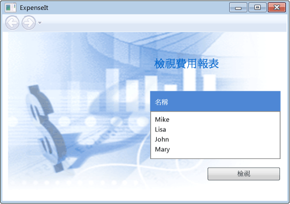
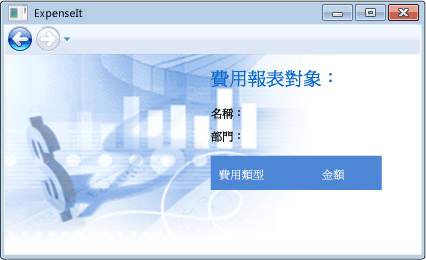
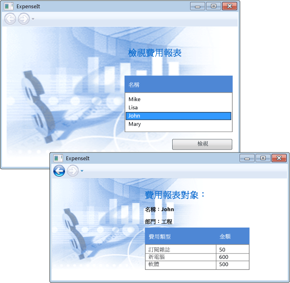

# <a name="walkthrough-my-first-wpf-desktop-application"></a>逐步解說：我的第一個 WPF 桌面應用程式

這篇文章會示範如何開發簡單的 Windows Presentation Foundation (WPF) 應用程式，其中包含大部分的 WPF 應用程式通用的項目： Extensible Application Markup Language (XAML) 標記、 程式碼後置、 應用程式定義控制項、 版面配置、 資料繫結和樣式。

本逐步解說包含下列步驟：

- 您可以使用 XAML 來設計應用程式的使用者介面 (UI) 的外觀。

- 撰寫程式碼來建置應用程式的行為。

- 建立應用程式定義來管理應用程式。

- 新增控制項並建立要撰寫應用程式 UI 的配置。

- 建立一致的外觀，整個應用程式的 UI 的樣式。

- 將 UI 繫結到資料填入資料的 UI 和保留的資料和同步處理的 UI。

本逐步解說結束時，您將會建置一個獨立的 Windows 應用程式，可讓使用者檢視所選取人員經費支出報表。 應用程式是由數個在瀏覽器樣式的視窗中裝載的 WPF 頁面所組成。

> [!TIP]
> 用來建立這個逐步解說的範例程式碼是適用於 Visual Basic 和 C#[建置 WPF 應用程式簡介](https://go.microsoft.com/fwlink/?LinkID=160008)。

## <a name="prerequisites"></a>必要條件

- Visual Studio 2012 或更新版本

如需有關如何安裝最新版的 Visual Studio 的詳細資訊，請參閱 <<c0> [ 安裝 Visual Studio](/visualstudio/install/install-visual-studio)。

## <a name="create-the-application-project"></a>建立應用程式專案

第一個步驟是建立應用程式基礎結構，包括應用程式定義、 兩個頁面，以及映像。

1. 在 Visual Basic 或 Visual C# 中名為建立新的 WPF 應用程式專案**`ExpenseIt`**:

   1. 開啟 Visual Studio，然後選取**檔案** > **新增** > **專案**。

      **新的專案** 對話方塊隨即開啟。

   2. 底下**已安裝**分類中，展開**Visual C#** 或**Visual Basic**節點，然後再選取**Windows 傳統桌面**。

   3. 選取  **WPF 應用程式 (.NET Framework)** 範本。 輸入名稱**`ExpenseIt`** ，然後選取**確定**。

      ![與所選的 WPF 應用程式的 [新增專案] 對話方塊](media/new-project-dialog.png)

      Visual Studio 會建立專案並開啟名為預設應用程式視窗的設計工具**MainWindow.xaml**。

   > [!NOTE]
   > 本逐步解說使用<xref:System.Windows.Controls.DataGrid>可在.NET Framework 4 及更新版本的控制項。 為確定您的專案目標.NET Framework 4 或更新版本。 如需詳細資訊，請參閱[如何：以 .NET Framework 版本為目標](/visualstudio/ide/how-to-target-a-version-of-the-dotnet-framework)。

2. 開啟*Application.xaml* (Visual Basic) 或*App.xaml* (C#)。

    此 XAML 檔案定義 WPF 應用程式和任何應用程式資源。 您也使用此檔案來指定 UI 會自動顯示時，應用程式啟動;在此情況下， *MainWindow.xaml*。

    在 Visual Basic 中，您的 XAML 應該看起來如下：

    [!code-xaml[ExpenseIt#1_A](../../../../samples/snippets/visualbasic/VS_Snippets_Wpf/ExpenseIt/VB/ExpenseIt1_A/Application.xaml#1_a)]

    或在 C# 中如下所示：

    [!code-xaml[ExpenseIt#1](../../../../samples/snippets/csharp/VS_Snippets_Wpf/ExpenseIt/CSharp/ExpenseIt/App.xaml#1)]

3. 開啟*MainWindow.xaml*。

    此 XAML 檔案是您的應用程式的主視窗，並顯示在頁面中建立的內容。 <xref:System.Windows.Window>類別定義的屬性視窗中，例如其標題、 大小或圖示，並處理例如關閉或隱藏的事件。

4. 變更<xref:System.Windows.Window>項目<xref:System.Windows.Navigation.NavigationWindow>，如下列 XAML 所示：

   ```xaml
   <NavigationWindow x:Class="ExpenseIt.MainWindow"
        xmlns="http://schemas.microsoft.com/winfx/2006/xaml/presentation"
        xmlns:x="http://schemas.microsoft.com/winfx/2006/xaml"
        ...
   </NavigationWindow>
   ```

   此應用程式瀏覽至不同的內容，根據使用者輸入而定。 這就是為什麼主要<xref:System.Windows.Window>變更為需要<xref:System.Windows.Navigation.NavigationWindow>。 <xref:System.Windows.Navigation.NavigationWindow> 繼承的所有屬性<xref:System.Windows.Window>。 <xref:System.Windows.Navigation.NavigationWindow> XAML 檔案中的項目建立的執行個體<xref:System.Windows.Navigation.NavigationWindow>類別。 如需詳細資訊，請參閱 <<c0> [ 巡覽概觀](../../../../docs/framework/wpf/app-development/navigation-overview.md)。

5. 在變更下列屬性<xref:System.Windows.Navigation.NavigationWindow>項目：

    - 設定<xref:System.Windows.Window.Title%2A>屬性，以 「`ExpenseIt`"。

    - 設定<xref:System.Windows.FrameworkElement.Width%2A>為 500 像素的屬性。

    - 設定<xref:System.Windows.FrameworkElement.Height%2A>350 像素為單位的屬性。

    - 移除<xref:System.Windows.Controls.Grid>之間的項目<xref:System.Windows.Navigation.NavigationWindow>標記。

    在 Visual Basic 中，您的 XAML 應該看起來如下：

    [!code-xaml[ExpenseIt#2_A](../../../../samples/snippets/visualbasic/VS_Snippets_Wpf/ExpenseIt/VB/ExpenseIt/MainWindow.xaml#2_a)]

    或在 C# 中如下所示：

    [!code-xaml[ExpenseIt#2](../../../../samples/snippets/csharp/VS_Snippets_Wpf/ExpenseIt/CSharp/ExpenseIt/MainWindow.xaml#2)]

6. 開啟*MainWindow.xaml.vb*或是*MainWindow.xaml.cs*。

    這個檔案是包含程式碼來處理中所宣告事件的程式碼後置檔案*MainWindow.xaml*。 這個檔案包含 XAML 中定義之視窗的部分類別。

7. 如果您使用的 C#，變更`MainWindow`類別來衍生自<xref:System.Windows.Navigation.NavigationWindow>。 （在 Visual Basic 中，這會自動變更 XAML 中的視窗。）

   您的程式碼看起來應該像這樣：

   [!code-csharp[ExpenseIt#3](../../../../samples/snippets/csharp/VS_Snippets_Wpf/ExpenseIt/CSharp/ExpenseIt/MainWindow.xaml.cs#3)]
   [!code-vb[ExpenseIt#3](../../../../samples/snippets/visualbasic/VS_Snippets_Wpf/ExpenseIt/VB/ExpenseIt1_A/MainWindow.xaml.vb#3)]

   > [!TIP]
   > 您可以切換之間 C# 和 Visual Basic 中的範例程式碼的程式碼語言**語言**這篇文章的右上方的下拉式清單。

## <a name="add-files-to-the-application"></a>將檔案新增至應用程式

在本節中，您要在應用程式中加入兩頁網頁和一個影像。

1. 將新的 WPF 頁面新增至專案，並將它命名*`ExpenseItHome.xaml`*:

   1. 在 [**方案總管] 中**，以滑鼠右鍵按一下**`ExpenseIt`** 專案節點，然後選擇**新增** > **頁面**。

   1. 在 [**加入新項目**] 對話方塊中，**頁面 (WPF)** 已選取範本。 輸入名稱**`ExpenseItHome`**，然後選取**新增**。

    此頁面是應用程式啟動時顯示的第一頁。 它會顯示一份可供選取，以顯示其費用報表的人員。

2. 開啟*`ExpenseItHome.xaml`*。

3. 設定<xref:System.Windows.Controls.Page.Title%2A>到 「`ExpenseIt - Home`"。

    在 Visual Basic 中，您的 XAML 應該看起來如下：

    [!code-xaml[ExpenseIt#6_A](../../../../samples/snippets/visualbasic/VS_Snippets_Wpf/ExpenseIt/VB/ExpenseIt1_A/ExpenseItHome.xaml#6_a)]

    或在 C# 中如下所示：

    [!code-xaml[ExpenseIt#6](../../../../samples/snippets/csharp/VS_Snippets_Wpf/ExpenseIt/CSharp/ExpenseIt2/ExpenseItHome.xaml#6)]

4. 開啟*MainWindow.xaml*。

5. 設定<xref:System.Windows.Navigation.NavigationWindow.Source%2A>上的屬性<xref:System.Windows.Navigation.NavigationWindow>到 「`ExpenseItHome.xaml`"。

    這會設定*`ExpenseItHome.xaml`* 是第一頁開啟 應用程式啟動時。 在 Visual Basic 中，您的 XAML 應該看起來如下：

    [!code-xaml[ExpenseIt#7_A](../../../../samples/snippets/visualbasic/VS_Snippets_Wpf/ExpenseIt/VB/ExpenseIt1_A/MainWindow.xaml#7_a)]

    或在 C# 中如下所示：

    [!code-xaml[ExpenseIt#7](../../../../samples/snippets/csharp/VS_Snippets_Wpf/ExpenseIt/CSharp/ExpenseIt2/MainWindow.xaml#7)]

   > [!TIP]
   > 您也可以設定**來源**中的屬性**其他**分類**屬性**視窗。
   >
   > ![在 [屬性] 視窗中的 [來源] 屬性](media/properties-source.png)

6. 將另一個新的 WPF 頁面新增至專案，並將它命名*ExpenseReportPage.xaml*::

   1. 在 [**方案總管] 中**，以滑鼠右鍵按一下**`ExpenseIt`** 專案節點，然後選擇**新增** > **頁面**。

   1. 在 [**加入新項目**] 對話方塊中，**頁面 (WPF)** 已選取範本。 輸入名稱**ExpenseReportPage**，然後選取**新增**。

    此頁面會顯示在所選取之人員的費用報表**`ExpenseItHome`** 頁面。

7. 開啟 *ExpenseReportPage.xaml*。

8. 設定<xref:System.Windows.Controls.Page.Title%2A>到 「`ExpenseIt - View Expense`"。

    在 Visual Basic 中，您的 XAML 應該看起來如下：

    [!code-xaml[ExpenseIt#4_A](../../../../samples/snippets/visualbasic/VS_Snippets_Wpf/ExpenseIt/VB/ExpenseIt1_A/ExpenseReportPage.xaml#4_a)]

    或在 C# 中如下所示：

    [!code-xaml[ExpenseIt#4](../../../../samples/snippets/csharp/VS_Snippets_Wpf/ExpenseIt/CSharp/ExpenseIt/ExpenseReportPage.xaml#4)]

9. 開啟*ExpenseItHome.xaml.vb*並*ExpenseReportPage.xaml.vb*，或*ExpenseItHome.xaml.cs*並*ExpenseReportPage.xaml.cs*.

    當您建立新的分頁檔時，Visual Studio 會自動建立*程式碼後置*檔案。 這些程式碼後置檔案會處理用於回應使用者輸入的邏輯。

    您的程式碼應該看起來像這樣的**`ExpenseItHome`**:

    [!code-csharp[ExpenseIt#2_5](../../../../samples/snippets/csharp/VS_Snippets_Wpf/ExpenseIt/CSharp/ExpenseIt2/ExpenseItHome.xaml.cs#2_5)]
    [!code-vb[ExpenseIt#2_5](../../../../samples/snippets/visualbasic/VS_Snippets_Wpf/ExpenseIt/VB/ExpenseIt1_A/ExpenseItHome.xaml.vb#2_5)]

    與此項目，例如**ExpenseReportPage**:

    [!code-csharp[ExpenseIt#5](../../../../samples/snippets/csharp/VS_Snippets_Wpf/ExpenseIt/CSharp/ExpenseIt/ExpenseReportPage.xaml.cs#5)]
    [!code-vb[ExpenseIt#5](../../../../samples/snippets/visualbasic/VS_Snippets_Wpf/ExpenseIt/VB/ExpenseIt1_A/ExpenseReportPage.xaml.vb#5)]

10. 加入名為影像*watermark.png*至專案。 您可以建立自己的映像、 將檔案複製範例程式碼，或取得它[此處](https://github.com/dotnet/docs/blob/master/docs/framework/wpf/getting-started/media/watermark.png)。

   1. 以滑鼠右鍵按一下專案節點，然後選取**新增** > **現有項目**，或按**Shift**+**Alt**+ **A**。

   2. 在 **加入現有項目** 對話方塊中，瀏覽至您想要使用此項目，然後選取 映像檔案**新增**。

## <a name="build-and-run-the-application"></a>建立和執行應用程式

1. 若要建置並執行應用程式，請按**F5**或選取**開始偵錯**從**偵錯**功能表。

    下圖顯示應用程式與<xref:System.Windows.Navigation.NavigationWindow>按鈕：

    

2. 關閉應用程式，若要返回 Visual Studio。

## <a name="create-the-layout"></a>建立版面配置

版面配置會按照順序放置 UI 項目，並也會管理的大小和位置，這些元件的 UI 調整大小時。 您通常會建立具有下列其中一個版面配置控制項的版面配置：

- <xref:System.Windows.Controls.Canvas>
- <xref:System.Windows.Controls.DockPanel>
- <xref:System.Windows.Controls.Grid>
- <xref:System.Windows.Controls.StackPanel>
- <xref:System.Windows.Controls.VirtualizingStackPanel>
- <xref:System.Windows.Controls.WrapPanel>

這些版面配置控制項都支援其子元素的特殊版面配置類型。 `ExpenseIt` 頁面可以調整大小，以及每個頁面都有會水平和垂直排列沿著其他元素的元素。 因此，<xref:System.Windows.Controls.Grid>為應用程式的理想的版面配置項目。

> [!TIP]
> 如需詳細資訊<xref:System.Windows.Controls.Panel>項目，請參閱[面板概觀](../../../../docs/framework/wpf/controls/panels-overview.md)。 如需有關配置的詳細資訊，請參閱[版面配置](../../../../docs/framework/wpf/advanced/layout.md)。

在區段中，您建立單欄資料表具有三個資料列和 10 個像素邊界添加資料行和資料列的定義，以便<xref:System.Windows.Controls.Grid>中*`ExpenseItHome.xaml`*。

1. 開啟*`ExpenseItHome.xaml`*。

2. 設定<xref:System.Windows.FrameworkElement.Margin%2A>屬性上的<xref:System.Windows.Controls.Grid>"10,0,10,10 」，其對應到左、 上、 右和下邊界的項目：

   ```xaml
   <Grid Margin="10,0,10,10">
   ```

   > [!TIP]
   > 您也可以設定**邊界**中的值**屬性**視窗下方**配置**類別：
   >
   > ![在 [屬性] 視窗中的邊界值](media/properties-margin.png)

3. 加入下列 XAML 之間<xref:System.Windows.Controls.Grid>標籤來建立的資料列和資料行定義：

    [!code-xaml[ExpenseIt#8](../../../../samples/snippets/csharp/VS_Snippets_Wpf/ExpenseIt/CSharp/ExpenseIt3/ExpenseItHome.xaml#8)]

    <xref:System.Windows.Controls.RowDefinition.Height%2A>兩個資料列設<xref:System.Windows.GridLength.Auto%2A>，也就是說，資料列的大小調整的基礎資料列中的內容。 預設值<xref:System.Windows.Controls.RowDefinition.Height%2A>是<xref:System.Windows.GridUnitType.Star>調整大小，這表示資料列高度的可用空間的加權的比例。 例如，如果兩個資料列有<xref:System.Windows.Controls.RowDefinition.Height%2A>的 「 * 」，它們都各自具有的高度都是可用空間的一半。

    您<xref:System.Windows.Controls.Grid>現在看起來應該像下列 XAML:

    [!code-xaml[ExpenseIt#9](../../../../samples/snippets/csharp/VS_Snippets_Wpf/ExpenseIt/CSharp/ExpenseIt3/ExpenseItHome.xaml#9)]

## <a name="add-controls"></a>加入控制項

在本節中，您會更新 UI，讓使用者可以從選取以顯示費用報表的人員清單中的 [首頁] 頁面。 控制項是可讓使用者與您應用程式互動的 UI 物件。 如需詳細資訊，請參閱 [控制項](../../../../docs/framework/wpf/controls/index.md)。

若要建立此 UI，您會新增下列項目，來*`ExpenseItHome.xaml`*:

- <xref:System.Windows.Controls.ListBox> （適用於的人員清單）。
- <xref:System.Windows.Controls.Label> （適用於清單標頭）。
- <xref:System.Windows.Controls.Button> （可以按一下清單中選取的人員檢視費用報表）。

每個控制項都會在資料列<xref:System.Windows.Controls.Grid>藉由設定<xref:System.Windows.Controls.Grid.Row%2A?displayProperty=nameWithType>附加屬性。 如需有關附加屬性的詳細資訊，請參閱[附加屬性概觀](../../../../docs/framework/wpf/advanced/attached-properties-overview.md)。

1. 開啟*`ExpenseItHome.xaml`*。

2. 加入下列 XAML 某處之間<xref:System.Windows.Controls.Grid>標記：

   [!code-xaml[ExpenseIt#10](../../../../samples/snippets/csharp/VS_Snippets_Wpf/ExpenseIt/CSharp/ExpenseIt4/ExpenseItHome.xaml#10)]

   > [!TIP]
   > 您也可以從建立控制項**工具箱**視窗拖曳至 [設計] 視窗和中，然後設定其屬性**屬性**視窗。

3. 建置並執行應用程式。

下圖將顯示您剛才建立的控制項：


## <a name="add-an-image-and-a-title"></a>新增影像和標題

在本節中，您將使用影像和網頁標題更新在首頁 UI。

1. 開啟*`ExpenseItHome.xaml`*。

2. 新增另一個資料行<xref:System.Windows.Controls.Grid.ColumnDefinitions%2A>具有固定<xref:System.Windows.Controls.ColumnDefinition.Width%2A>230 像素的：

    [!code-xaml[ExpenseIt#11](../../../../samples/snippets/csharp/VS_Snippets_Wpf/ExpenseIt/CSharp/ExpenseIt5/ExpenseItHome.xaml#11)]

3. 新增另一個資料列<xref:System.Windows.Controls.Grid.RowDefinitions%2A>，總共四個資料列：

    [!code-xaml[ExpenseIt#11b](../../../../samples/snippets/csharp/VS_Snippets_Wpf/ExpenseIt/CSharp/ExpenseIt5/ExpenseItHome.xaml#11b)]

4. 將控制項移到第二個資料行中，藉由設定<xref:System.Windows.Controls.Grid.Column%2A?displayProperty=nameWithType>屬性設為 1，在每個三個控制項 （框線、 清單方塊中和按鈕）。

5. 下移資料列中的每個控制項，遞增其<xref:System.Windows.Controls.Grid.Row%2A?displayProperty=nameWithType>值加 1。

   三個控制項的 XAML 現在看起來像這樣：

    [!code-xaml[ExpenseIt#12](../../../../samples/snippets/csharp/VS_Snippets_Wpf/ExpenseIt/CSharp/ExpenseIt5/ExpenseItHome.xaml#12)]

6. 設定<xref:System.Windows.Controls.Panel.Background%2A>的<xref:System.Windows.Controls.Grid>要*watermark.png*映像檔案中的，新增下列 XAML 某處之間`<Grid>`和`</Grid>`標記：

    [!code-xaml[ExpenseIt#14](../../../../samples/snippets/csharp/VS_Snippets_Wpf/ExpenseIt/CSharp/ExpenseIt5/ExpenseItHome.xaml#14)]

7. 再<xref:System.Windows.Controls.Border>項目，新增<xref:System.Windows.Controls.Label>以"View Expense Report"的內容。 這是頁面的標題。

    [!code-xaml[ExpenseIt#13](../../../../samples/snippets/csharp/VS_Snippets_Wpf/ExpenseIt/CSharp/ExpenseIt5/ExpenseItHome.xaml#13)]

8. 建置並執行應用程式。

下圖顯示您剛才加入的結果：



## <a name="add-code-to-handle-events"></a>加入程式碼來處理事件

1. 開啟*`ExpenseItHome.xaml`*。

2. 新增<xref:System.Windows.Controls.Primitives.ButtonBase.Click>事件處理常式來<xref:System.Windows.Controls.Button>項目。 如需詳細資訊，請參閱 <<c0> [ 如何： 建立簡單的事件處理常式](https://msdn.microsoft.com/library/b1456e07-9dec-4354-99cf-18666b64f480)。

    [!code-xaml[ExpenseIt#15](../../../../samples/snippets/csharp/VS_Snippets_Wpf/ExpenseIt/CSharp/ExpenseIt6/ExpenseItHome.xaml#15)]

3. 開啟*`ExpenseItHome.xaml.vb`* 或是*`ExpenseItHome.xaml.cs`*。

4. 將下列程式碼加入`ExpenseItHome`類別加入的按鈕 click 事件處理常式。 事件處理常式會開啟**ExpenseReportPage**頁面。

    [!code-csharp[ExpenseIt#16](../../../../samples/snippets/csharp/VS_Snippets_Wpf/ExpenseIt/CSharp/ExpenseIt6/ExpenseItHome.xaml.cs#16)]
    [!code-vb[ExpenseIt#16](../../../../samples/snippets/visualbasic/VS_Snippets_Wpf/ExpenseIt/VB/ExpenseIt6/ExpenseItHome.xaml.vb#16)]

## <a name="create-the-ui-for-expensereportpage"></a>建立 ExpenseReportPage 的 UI

*ExpenseReportPage.xaml*上選取的人員顯示的經費支出報表**`ExpenseItHome`** 頁面。 在本節中，您將建立的 UI **ExpenseReportPage**。 您也將新增的背景和填滿色彩，以各種不同的 UI 項目。

1. 開啟 *ExpenseReportPage.xaml*。

2. 加入下列 XAML 之間<xref:System.Windows.Controls.Grid>標記：

    [!code-xaml[ExpenseIt#17](../../../../samples/snippets/csharp/VS_Snippets_Wpf/ExpenseIt/CSharp/ExpenseIt6/ExpenseReportPage.xaml#17)]

    此 UI 很類似*`ExpenseItHome.xaml`*，但報表資料會顯示在<xref:System.Windows.Controls.DataGrid>。

3. 建置並執行應用程式。

    > [!NOTE]
    > 如果您收到錯誤指出<xref:System.Windows.Controls.DataGrid>找不到或不存在，請確定您的專案目標.NET Framework 4 或更新版本。 如需詳細資訊，請參閱[如何：以 .NET Framework 版本為目標](/visualstudio/ide/how-to-target-a-version-of-the-dotnet-framework)。

4. 選取 [**檢視**] 按鈕。

    報表頁面隨即出現。 也請注意，會啟用 [向後巡覽] 按鈕。

下圖顯示加入至 UI 項目*ExpenseReportPage.xaml*。



## <a name="style-controls"></a>樣式控制項

各種元素外觀通常是相同的 UI 中相同類型的所有項目。 使用 UI[樣式](../../../../docs/framework/wpf/controls/styling-and-templating.md)讓跨多個元素的可重複使用外觀。 樣式的重複使用性有助於簡化 XAML 建立與管理。 本節會將先前步驟中定義的個別元素屬性 (Attribute) 取代為樣式。

1. 開啟*Application.xaml*或是*App.xaml*。

2. 加入下列 XAML 之間<xref:System.Windows.Application.Resources%2A?displayProperty=nameWithType>標記：

    [!code-xaml[ExpenseIt#18](../../../../samples/snippets/csharp/VS_Snippets_Wpf/ExpenseIt/CSharp/ExpenseIt7/App.xaml#18)]

    這個 XAML 會加入下列樣式：

    - `headerTextStyle`：格式化頁面標題 <xref:System.Windows.Controls.Label>。

    - `labelStyle`：格式化 <xref:System.Windows.Controls.Label> 控制項。

    - `columnHeaderStyle`：格式化 <xref:System.Windows.Controls.Primitives.DataGridColumnHeader>。

    - `listHeaderStyle`：格式化清單標頭 <xref:System.Windows.Controls.Border> 控制項。

    - `listHeaderTextStyle`： 若要格式化清單標頭<xref:System.Windows.Controls.Label>。

    - `buttonStyle`： 用來格式化<xref:System.Windows.Controls.Button>上`ExpenseItHome.xaml`。

    請注意，樣式是資源和子系<xref:System.Windows.Application.Resources%2A?displayProperty=nameWithType>屬性項目。 在這裡，樣式會套用至應用程式中的所有元素。 如需在.NET Framework 應用程式中使用資源的範例，請參閱[使用應用程式資源](../../../../docs/framework/wpf/advanced/how-to-use-application-resources.md)。

3. 開啟*`ExpenseItHome.xaml`*。

4. 取代之間的所有內容<xref:System.Windows.Controls.Grid>具有下列的 XAML 項目：

    [!code-xaml[ExpenseIt#19](../../../../samples/snippets/csharp/VS_Snippets_Wpf/ExpenseIt/CSharp/ExpenseIt7/ExpenseItHome.xaml#19)]

    套用樣式會移除並取代諸如 <xref:System.Windows.VerticalAlignment> 和 <xref:System.Windows.Media.FontFamily> 這類會定義每個控制項外觀的屬性。 例如，`headerTextStyle`套用至"View Expense Report" <xref:System.Windows.Controls.Label>。

5. 開啟 *ExpenseReportPage.xaml*。

6. 取代之間的所有內容<xref:System.Windows.Controls.Grid>具有下列的 XAML 項目：

    [!code-xaml[ExpenseIt#20](../../../../samples/snippets/csharp/VS_Snippets_Wpf/ExpenseIt/CSharp/ExpenseIt7/ExpenseReportPage.xaml#20)]

    這樣會將樣式加入 <xref:System.Windows.Controls.Label> 和 <xref:System.Windows.Controls.Border> 項目。

## <a name="bind-data-to-a-control"></a>將資料繫結至控制項

在本節中，您將建立 XML 資料繫結至不同的控制項。

1. 開啟*`ExpenseItHome.xaml`*。

2. 在開啟之後<xref:System.Windows.Controls.Grid>項目，加入下列 XAML 來建立<xref:System.Windows.Data.XmlDataProvider>包含的每個人資料：

    [!code-xaml[ExpenseIt#21](../../../../samples/snippets/csharp/VS_Snippets_Wpf/ExpenseIt/CSharp/ExpenseIt8/ExpenseItHome.xaml#21)]
    [!code-xaml[ExpenseIt#23](../../../../samples/snippets/csharp/VS_Snippets_Wpf/ExpenseIt/CSharp/ExpenseIt8/ExpenseItHome.xaml#23)]
    [!code-xaml[ExpenseIt#22](../../../../samples/snippets/csharp/VS_Snippets_Wpf/ExpenseIt/CSharp/ExpenseIt8/ExpenseItHome.xaml#22)]

    資料會建立為<xref:System.Windows.Controls.Grid>資源。 這通常會載入為檔案，但為求簡化會內嵌資料。

3. 內`<Grid.Resources>`項目，新增下列<xref:System.Windows.DataTemplate>，其定義如何顯示資料的<xref:System.Windows.Controls.ListBox>:

    [!code-xaml[ExpenseIt#21](../../../../samples/snippets/csharp/VS_Snippets_Wpf/ExpenseIt/CSharp/ExpenseIt8/ExpenseItHome.xaml#21)]
    [!code-xaml[ExpenseIt#24](../../../../samples/snippets/csharp/VS_Snippets_Wpf/ExpenseIt/CSharp/ExpenseIt8/ExpenseItHome.xaml#24)]
    [!code-xaml[ExpenseIt#22](../../../../samples/snippets/csharp/VS_Snippets_Wpf/ExpenseIt/CSharp/ExpenseIt8/ExpenseItHome.xaml#22)]

    如需有關資料範本的詳細資訊，請參閱[資料範本化概觀](../../../../docs/framework/wpf/data/data-templating-overview.md)。

4. 取代現有<xref:System.Windows.Controls.ListBox>與下列 XAML:

    [!code-xaml[ExpenseIt#25](../../../../samples/snippets/csharp/VS_Snippets_Wpf/ExpenseIt/CSharp/ExpenseIt8/ExpenseItHome.xaml#25)]

    此 XAML 會將繫結<xref:System.Windows.Controls.ItemsControl.ItemsSource%2A>的屬性<xref:System.Windows.Controls.ListBox>資料來源，並套用資料範本，做為<xref:System.Windows.Controls.ItemsControl.ItemTemplate%2A>。

## <a name="connect-data-to-controls"></a>連接至控制項的資料

接下來，您要在其中加入程式碼，以擷取名稱上選取**`ExpenseItHome`** 頁面上，並將它傳遞給建構函式**ExpenseReportPage**。 **ExpenseReportPage**設定其資料內容，與傳遞的項目，它是由控制項的定義中*ExpenseReportPage.xaml*繫結至。

1. 開啟 *ExpenseReportPage.xaml.vb* 或 *ExpenseReportPage.xaml.cs*。

2. 加入一個可接受物件的建構函式，如此您就可以傳遞選取之人員的費用報表資料。

    [!code-csharp[ExpenseIt#26](../../../../samples/snippets/csharp/VS_Snippets_Wpf/ExpenseIt/CSharp/ExpenseIt8/ExpenseReportPage.xaml.cs#26)]
    [!code-vb[ExpenseIt#26](../../../../samples/snippets/visualbasic/VS_Snippets_Wpf/ExpenseIt/VB/ExpenseIt8/ExpenseReportPage.xaml.vb#26)]

3. 開啟*`ExpenseItHome.xaml.vb`* 或是*`ExpenseItHome.xaml.cs`*。

4. 變更<xref:System.Windows.Controls.Primitives.ButtonBase.Click>事件處理常式呼叫新的建構函式傳遞所選人員的費用報表資料。

    [!code-csharp[ExpenseIt#27](../../../../samples/snippets/csharp/VS_Snippets_Wpf/ExpenseIt/CSharp/ExpenseIt8/ExpenseItHome.xaml.cs#27)]
    [!code-vb[ExpenseIt#27](../../../../samples/snippets/visualbasic/VS_Snippets_Wpf/ExpenseIt/VB/ExpenseIt8/ExpenseItHome.xaml.vb#27)]

## <a name="style-data-with-data-templates"></a>樣式的資料，使用資料範本

在本節中，您將使用資料範本更新的 UI 資料繫結清單中的每個項目。

1. 開啟 *ExpenseReportPage.xaml*。

2. 「 名稱 」 和 「 部門 」 的內容繫結<xref:System.Windows.Controls.Label>項目至適當的資料來源屬性。 如需有關資料繫結的詳細資訊，請參閱 <<c0> [ 資料繫結概觀](../../../../docs/framework/wpf/data/data-binding-overview.md)。

    [!code-xaml[ExpenseIt#31](../../../../samples/snippets/csharp/VS_Snippets_Wpf/ExpenseIt/CSharp/ExpenseIt9/ExpenseReportPage.xaml#31)]

3. 在開啟之後<xref:System.Windows.Controls.Grid>項目，新增下列資料範本，定義顯示費用報表資料的方式：

    [!code-xaml[ExpenseIt#30](../../../../samples/snippets/csharp/VS_Snippets_Wpf/ExpenseIt/CSharp/ExpenseIt9/ExpenseReportPage.xaml#30)]

4. 取代<xref:System.Windows.Controls.DataGridTextColumn>項目<xref:System.Windows.Controls.DataGridTemplateColumn>下方<xref:System.Windows.Controls.DataGrid>項目並將範本套用至它們。

    [!code-xaml[ExpenseIt#32](../../../../samples/snippets/csharp/VS_Snippets_Wpf/ExpenseIt/CSharp/ExpenseIt9/ExpenseReportPage.xaml#32)]

5. 建置並執行應用程式。

6. 選取 人員，然後選取**檢視** 按鈕。

下圖顯示的兩個頁面`ExpenseIt`應用程式與控制項、 版面配置、 樣式、 資料繫結及套用資料範本：



> [!NOTE]
> 此範例示範 WPF 的特定功能，並不是採用像是安全性、 當地語系化和協助工具的所有最佳作法。 如的 WPF 和.NET Framework 應用程式開發的最佳做法的完整涵蓋範圍，請參閱下列主題：
>
> - [協助工具選項](../../../../docs/framework/ui-automation/accessibility-best-practices.md)
>
> - [安全性](../../../../docs/framework/wpf/security-wpf.md)
>
> - [WPF 全球化和當地語系化](../../../../docs/framework/wpf/advanced/wpf-globalization-and-localization-overview.md)
>
> - [WPF 效能](../../../../docs/framework/wpf/advanced/optimizing-wpf-application-performance.md)

## <a name="next-steps"></a>後續步驟

在本逐步解說，您學到一些技巧可以用於建立使用 Windows Presentation Foundation (WPF) UI 的內容。 您現在應該有基本的了解資料繫結的.NET Framework 應用程式的建置組塊。 如需 WPF 架構和程式設計模型的詳細資訊，請參閱下列主題：

- [WPF 架構](../../../../docs/framework/wpf/advanced/wpf-architecture.md)
- [XAML 概觀 (WPF)](../../../../docs/framework/wpf/advanced/xaml-overview-wpf.md)
- [相依性屬性概觀](../../../../docs/framework/wpf/advanced/dependency-properties-overview.md)
- [版面配置](../../../../docs/framework/wpf/advanced/layout.md)

如需建立應用程式的詳細資訊，請參閱下列主題：

- [應用程式開發](../../../../docs/framework/wpf/app-development/index.md)
- [控制項](../../../../docs/framework/wpf/controls/index.md)
- [資料繫結概觀](../../../../docs/framework/wpf/data/data-binding-overview.md)
- [圖形和多媒體](../../../../docs/framework/wpf/graphics-multimedia/index.md)
- [WPF 中的文件](../../../../docs/framework/wpf/advanced/documents-in-wpf.md)

## <a name="see-also"></a>另請參閱

- [面板概觀](../../../../docs/framework/wpf/controls/panels-overview.md)
- [資料範本化概觀](../../../../docs/framework/wpf/data/data-templating-overview.md)
- [建置 WPF 應用程式](../../../../docs/framework/wpf/app-development/building-a-wpf-application-wpf.md)
- [樣式和範本](../../../../docs/framework/wpf/controls/styles-and-templates.md)
