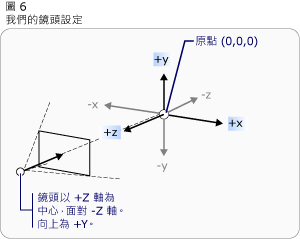
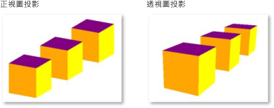

# 立體圖形概觀
 [!INCLUDE[TLA#tla_winclient](../../../../includes/tlasharptla-winclient-md.md)] 中的[!INCLUDE[TLA2#tla_3d](../../../../includes/tla2sharptla-3d-md.md)]功能可讓開發人員以標記和程序性程式碼繪製、轉換立體圖形，以及建立立體圖形的動畫。  開發人員可以結合 [!INCLUDE[TLA#tla_2d](../../../../includes/tlasharptla-2d-md.md)] 和[!INCLUDE[TLA2#tla_3d](../../../../includes/tla2sharptla-3d-md.md)]圖形建立出豐富的控制項、提供複雜的資料示範，或增強使用者對應用程式介面的體驗。[!INCLUDE[TLA2#tla_winclient](../../../../includes/tla2sharptla-winclient-md.md)] 中的[!INCLUDE[TLA2#tla_3d](../../../../includes/tla2sharptla-3d-md.md)]支援並不是設計來做為全功能的遊戲開發平台。本主題概要說明 [!INCLUDE[TLA2#tla_winclient](../../../../includes/tla2sharptla-winclient-md.md)] 圖形系統中的[!INCLUDE[TLA#tla_3d](../../../../includes/tlasharptla-3d-md.md)]功能。  
  
   
  
   
## 2\-D 容器中的立體  
 [!INCLUDE[TLA2#tla_winclient](../../../../includes/tla2sharptla-winclient-md.md)] 中的[!INCLUDE[TLA2#tla_3d](../../../../includes/tla2sharptla-3d-md.md)]圖形內容是封裝在項目 <xref:System.Windows.Controls.Viewport3D> 中，這個項目可以參與二維項目結構。  圖形系統會將 <xref:System.Windows.Controls.Viewport3D> 視為二維視覺化項目，就和 [!INCLUDE[TLA2#tla_winclient](../../../../includes/tla2sharptla-winclient-md.md)] 中的其他項目一樣。  <xref:System.Windows.Controls.Viewport3D> 的運作方式與視窗 \(檢視區 \(Viewport\)\) 相同，但是使用的是三維場景。  較正確地說，它是投影[!INCLUDE[TLA2#tla_3d](../../../../includes/tla2sharptla-3d-md.md)]場景的平面。  
  
 在傳統 [!INCLUDE[TLA2#tla_2d](../../../../includes/tla2sharptla-2d-md.md)] 應用程式中，當您想要使用另一個容器項目 \(像「格線」或「畫布」\) 時，請使用 <xref:System.Windows.Controls.Viewport3D>。  雖然您可以在相同場景圖形中搭配使用 <xref:System.Windows.Controls.Viewport3D> 與其他 [!INCLUDE[TLA2#tla_2d](../../../../includes/tla2sharptla-2d-md.md)] 繪圖物件，但是無法貫穿 <xref:System.Windows.Controls.Viewport3D> 內的 [!INCLUDE[TLA2#tla_2d](../../../../includes/tla2sharptla-2d-md.md)] 和[!INCLUDE[TLA2#tla_3d](../../../../includes/tla2sharptla-3d-md.md)]物件。  本主題著重在如何於 <xref:System.Windows.Controls.Viewport3D> 內繪製[!INCLUDE[TLA2#tla_3d](../../../../includes/tla2sharptla-3d-md.md)]圖形。  
  
   
## 立體座標空間  
 [!INCLUDE[TLA2#tla_2d](../../../../includes/tla2sharptla-2d-md.md)] 圖形的 [!INCLUDE[TLA2#tla_winclient](../../../../includes/tla2sharptla-winclient-md.md)] 座標系統會將原點放在呈現區域 \(一般是螢幕\) 的左上角。  在 [!INCLUDE[TLA2#tla_2d](../../../../includes/tla2sharptla-2d-md.md)] 系統中，正 X 軸值是朝向右邊，而正 Y 軸值是朝向下方。  然而，在[!INCLUDE[TLA2#tla_3d](../../../../includes/tla2sharptla-3d-md.md)]座標系統中，原點是位在呈現區域的中央，而正 X 軸值是朝向右邊，但是正 Y 軸值是改為朝向上方，而正 Z 軸值是從原點往外，但朝向檢視器。  
  
   
傳統 2D 和 3D 座標系統表示  
  
 透過這些軸定義的空間是 [!INCLUDE[TLA2#tla_winclient](../../../../includes/tla2sharptla-winclient-md.md)] 之[!INCLUDE[TLA2#tla_3d](../../../../includes/tla2sharptla-3d-md.md)]物件的參考靜態畫面格。  如果在這個空間建置 \(Build\) 模型，並建立光源和鏡頭來檢視模型，則在將轉換套用至模型時，這有助於區分這個靜態參考畫面格 \(或「全局空間」\) 與針對每個模型建立的本機參考畫面格。  也請記住，全局空間中的物件可能看起來會完全不同，或根本看不到 \(取決於光源和鏡頭設定\)，但是鏡頭的位置並不會變更物件在全局空間中的位置。  
  
   
## 鏡頭和投影  
 使用 [!INCLUDE[TLA2#tla_2d](../../../../includes/tla2sharptla-2d-md.md)] 的開發人員習慣將繪圖基本型別定位在二維螢幕上。  當您建立[!INCLUDE[TLA2#tla_3d](../../../../includes/tla2sharptla-3d-md.md)]場景時，重要的是要記住實際建立[!INCLUDE[TLA2#tla_3d](../../../../includes/tla2sharptla-3d-md.md)]物件的 [!INCLUDE[TLA2#tla_2d](../../../../includes/tla2sharptla-2d-md.md)] 表示。  因為[!INCLUDE[TLA2#tla_3d](../../../../includes/tla2sharptla-3d-md.md)]場景的外觀會根據觀看者的觀點而不同，所以必須指定該觀點。  <xref:System.Windows.Media.Media3D.Camera> 類別可讓您針對[!INCLUDE[TLA2#tla_3d](../../../../includes/tla2sharptla-3d-md.md)]檢視場景指定這個觀點。  
  
 另一種了解如何在 [!INCLUDE[TLA2#tla_2d](../../../../includes/tla2sharptla-2d-md.md)] 表面上呈現[!INCLUDE[TLA2#tla_3d](../../../../includes/tla2sharptla-3d-md.md)]場景的方式是將場景當成投影描述在檢視表面上。  <xref:System.Windows.Media.Media3D.ProjectionCamera> 可讓您指定不同投影及其屬性，以變更觀看者查看[!INCLUDE[TLA2#tla_3d](../../../../includes/tla2sharptla-3d-md.md)]模型的方式。  <xref:System.Windows.Media.Media3D.PerspectiveCamera> 指定依透視法縮短場景的投影。  換句話說，<xref:System.Windows.Media.Media3D.PerspectiveCamera> 提供消失點透視圖。  您可以在場景座標空間中指定鏡頭位置、鏡頭方向和視野，以及在場景中定義「往上」方向的向量。  下圖說明 <xref:System.Windows.Media.Media3D.PerspectiveCamera> 的投影。  
  
 <xref:System.Windows.Media.Media3D.ProjectionCamera> 的 <xref:System.Windows.Media.Media3D.ProjectionCamera.NearPlaneDistance%2A> 和 <xref:System.Windows.Media.Media3D.ProjectionCamera.FarPlaneDistance%2A> 屬性可限制鏡頭的投影範圍。  因為鏡頭可以位在場景的任何位置，所以鏡頭可能實際定位在模型內或十分靠近模型，因此很難正確分辨物件。  <xref:System.Windows.Media.Media3D.ProjectionCamera.NearPlaneDistance%2A> 可讓您指定與鏡頭的最短距離，超過這個距離就不會繪製物件。  相反地，<xref:System.Windows.Media.Media3D.ProjectionCamera.FarPlaneDistance%2A> 可讓您指定與鏡頭的距離，超過這個距離就不會繪製物件，以確保太遠而無法辨識的物件未併入場景中。  
  
   
鏡頭位置  
  
 <xref:System.Windows.Media.Media3D.OrthographicCamera> 可將[!INCLUDE[TLA2#tla_3d](../../../../includes/tla2sharptla-3d-md.md)]模型的垂直投影指定給 [!INCLUDE[TLA2#tla_2d](../../../../includes/tla2sharptla-2d-md.md)] 視覺化介面。  它與其他鏡頭一樣，都可指定位置、檢視方向和「向上」方向。  不過，不同於 <xref:System.Windows.Media.Media3D.PerspectiveCamera>，<xref:System.Windows.Media.Media3D.OrthographicCamera> 會描述不包含透視圖的投影。  換句話說，<xref:System.Windows.Media.Media3D.OrthographicCamera> 描述側邊平行的檢視方塊，而不是側邊會在鏡頭的某一點會合的檢視方塊。  下列影像顯示的模型與使用 <xref:System.Windows.Media.Media3D.PerspectiveCamera> 和 <xref:System.Windows.Media.Media3D.OrthographicCamera> 檢視的模型相同。  
  
   
透視圖和正視圖投影  
  
 下列程式碼顯示一些典型鏡頭設定。  
  
 [!code-csharp[3dgallery_procedural_snip#Basic3DShapeCodeExampleInline1](../../../../samples/snippets/csharp/VS_Snippets_Wpf/3DGallery_procedural_snip/CSharp/Basic3DShapeExample.cs#basic3dshapecodeexampleinline1)]
 [!code-vb[3dgallery_procedural_snip#Basic3DShapeCodeExampleInline1](../../../../samples/snippets/visualbasic/VS_Snippets_Wpf/3DGallery_procedural_snip/visualbasic/basic3dshapeexample.vb#basic3dshapecodeexampleinline1)]  
  
   
## 模型和網狀結構基本型別  
 <xref:System.Windows.Media.Media3D.Model3D> 是表示泛型[!INCLUDE[TLA2#tla_3d](../../../../includes/tla2sharptla-3d-md.md)]物件的抽象基底類別。  若要建置[!INCLUDE[TLA2#tla_3d](../../../../includes/tla2sharptla-3d-md.md)]場景，則需要檢視一些物件，而組成該場景圖形的物件是衍生自 <xref:System.Windows.Media.Media3D.Model3D>。  目前，[!INCLUDE[TLA2#tla_winclient](../../../../includes/tla2sharptla-winclient-md.md)] 支援使用 <xref:System.Windows.Media.Media3D.GeometryModel3D> 的模型幾何。  這個模型的 <xref:System.Windows.Media.Media3D.GeometryModel3D.Geometry%2A> 屬性採用網狀結構基本型別。  
  
 若要建置模型，請開始建置基本型別或網狀結構。  [!INCLUDE[TLA2#tla_3d](../../../../includes/tla2sharptla-3d-md.md)]基本型別是形成單一[!INCLUDE[TLA2#tla_3d](../../../../includes/tla2sharptla-3d-md.md)]實體 \(Entity\) 的頂點集合。  大部分[!INCLUDE[TLA2#tla_3d](../../../../includes/tla2sharptla-3d-md.md)]系統可提供在最簡單封閉圖形 \(透過三個頂點定義的三角形\) 建立模型的基本型別。  因為三角形的三個點是平面，所以可以繼續加入三角形，以建立較複雜的圖案 \(稱為網狀結構\)。  
  
 [!INCLUDE[TLA2#tla_winclient](../../../../includes/tla2sharptla-winclient-md.md)] [!INCLUDE[TLA2#tla_3d](../../../../includes/tla2sharptla-3d-md.md)]系統目前提供 <xref:System.Windows.Media.Media3D.MeshGeometry3D> 類別，可讓您指定任何幾何。但目前不支援球形與立方體這類預先定義的[!INCLUDE[TLA2#tla_3d](../../../../includes/tla2sharptla-3d-md.md)]基本型別。  開始建立 <xref:System.Windows.Media.Media3D.MeshGeometry3D>，方式是將三角形頂點清單指定為它的 <xref:System.Windows.Media.Media3D.MeshGeometry3D.Positions%2A> 屬性。  而每個頂點都是指定為 <xref:System.Windows.Media.Media3D.Point3D> \(在[!INCLUDE[TLA#tla_xaml](../../../../includes/tlasharptla-xaml-md.md)] 中，會將這個屬性指定為三個一組的數字清單，代表每個頂點的座標\)。 根據它的幾何，網狀結構可能是由多個三角形所組成，部分三角形會共用相同的角落 \(頂點\)。  若要正確繪製網狀結構，則 [!INCLUDE[TLA2#tla_winclient](../../../../includes/tla2sharptla-winclient-md.md)] 需要哪些三角形共用哪些頂點的詳細資訊。  請使用 <xref:System.Windows.Media.Media3D.MeshGeometry3D.TriangleIndices%2A> 屬性指定三角形索引清單，以提供這個資訊。  這個清單指定的順序，就是 <xref:System.Windows.Media.Media3D.MeshGeometry3D.Positions%2A> 清單中所指定點決定三角形的順序。  
  
 [!code-xml[basic3d#Basic3DXAML3DN3](../../../../samples/snippets/xaml/VS_Snippets_Wpf/Basic3D/XAML/Window1.xaml#basic3dxaml3dn3)]  
  
 在前一個範例中，<xref:System.Windows.Media.Media3D.MeshGeometry3D.Positions%2A> 清單指定八個頂點來定義立方體形狀的網狀結構。  <xref:System.Windows.Media.Media3D.MeshGeometry3D.TriangleIndices%2A> 屬性可指定由三個索引組成之十二個群組的清單。  清單中的每個數字指的是 <xref:System.Windows.Media.Media3D.MeshGeometry3D.Positions%2A> 清單中的位移 \(Offset\)。  例如，<xref:System.Windows.Media.Media3D.MeshGeometry3D.Positions%2A> 清單指定的前三個頂點是 \(1,1,0\)、\(0,1,0\) 和 \(0,0,0\)。  而 <xref:System.Windows.Media.Media3D.MeshGeometry3D.TriangleIndices%2A> 清單指定的前三個索引是 0、2 和 1，這對應於 <xref:System.Windows.Media.Media3D.MeshGeometry3D.Positions%2A> 清單中的第一個、第三個和第二個點。  因此，組成立方體模型的第一個三角形會是依序從 \(1,1,0\) 到 \(0,1,0\) 再到 \(0,0,0\) 所組成，其餘十一個三角形也是以類似方式決定。  
  
 您可以指定 <xref:System.Windows.Media.Media3D.MeshGeometry3D.Normals%2A> 和 <xref:System.Windows.Media.Media3D.MeshGeometry3D.TextureCoordinates%2A> 屬性的值，以繼續定義模型。  為了呈現模型的表面，圖形系統需要表面在任何指定三角形上面對的方向的詳細資訊。  它使用這個資訊來計算模型的燈光：直接面向燈光的面會比角度偏離燈光的面還要亮。  雖然 [!INCLUDE[TLA2#tla_winclient](../../../../includes/tla2sharptla-winclient-md.md)] 可以使用位置座標來決定預設一般向量，但是您也可以將不同的一般向量指定為接近曲線表面的外觀。  
  
 <xref:System.Windows.Media.Media3D.MeshGeometry3D.TextureCoordinates%2A> 屬性可指定 <xref:System.Windows.Point> 的集合，用以告知圖形系統如何對應座標，而這些座標決定如何將紋理繪製至網狀結構的頂點。  <xref:System.Windows.Media.Media3D.MeshGeometry3D.TextureCoordinates%2A> 是指定為 0 \(含\) 與 1 \(含\) 之間的值。  與使用 <xref:System.Windows.Media.Media3D.MeshGeometry3D.Normals%2A> 屬性相同，圖形系統可以計算預設紋理座標，但是您可以選擇設定不同的紋理座標，以控制包含重複圖樣部分的紋理對應。  在後續的主題或 Managed Direct3D SDK 中可以找到紋理座標的詳細資訊。  
  
 下列範例顯示如何以程序性程式碼建立立方體模型的一個面。  請注意，您可以將整個立方體繪製為單一 GeometryModel3D；這個範例會將立方體的面繪製為個別模型，稍後再將不同紋理套用至每個面。  
  
 [!code-csharp[3doverview#3DOverview3DN6](../../../../samples/snippets/csharp/VS_Snippets_Wpf/3DOverview/CSharp/Window1.xaml.cs#3doverview3dn6)]
 [!code-vb[3doverview#3DOverview3DN6](../../../../samples/snippets/visualbasic/VS_Snippets_Wpf/3DOverview/visualbasic/window1.xaml.vb#3doverview3dn6)]  
  
 [!code-csharp[3doverview#3DOverview3DN7](../../../../samples/snippets/csharp/VS_Snippets_Wpf/3DOverview/CSharp/Window1.xaml.cs#3doverview3dn7)]
 [!code-vb[3doverview#3DOverview3DN7](../../../../samples/snippets/visualbasic/VS_Snippets_Wpf/3DOverview/visualbasic/window1.xaml.vb#3doverview3dn7)]  
  
   
## 將材質套用至模型  
 若要讓網狀結構看起來像三維物件，則它必須要有套用的紋理，才能涵蓋透過頂點和三角形所定義的表面，讓鏡頭點亮並投影至表面。  在 [!INCLUDE[TLA2#tla_2d](../../../../includes/tla2sharptla-2d-md.md)] 中，是使用 <xref:System.Windows.Media.Brush> 類別將色彩、圖樣、漸層或其他視覺化內容套用至螢幕區域。  然而，[!INCLUDE[TLA2#tla_3d](../../../../includes/tla2sharptla-3d-md.md)] 物件的外觀是燈光模型的功能，而不只是套用至物件的色彩或圖樣。  真實物件會根據物件表面的質地反射不同的燈光：光滑和晶亮表面看起來與粗糙或暗淡表面不同，而且有些物件看起來會吸收光源，有些物件則會發亮。  所有可套用至 [!INCLUDE[TLA2#tla_2d](../../../../includes/tla2sharptla-2d-md.md)] 物件的相同筆刷都能套用至[!INCLUDE[TLA2#tla_3d](../../../../includes/tla2sharptla-3d-md.md)]物件，但是不可以直接套用它們。  
  
 為了定義模型表面的特性，[!INCLUDE[TLA2#tla_winclient](../../../../includes/tla2sharptla-winclient-md.md)] 使用 <xref:System.Windows.Media.Media3D.Material> 抽象類別 \(Abstract Class\)。  Material 的具象子類別 \(Subclass\) 決定模型表面的部分外觀特性，而且每個具象子類別也都會提供可以傳遞 SolidColorBrush、TileBrush 或 VisualBrush 的 Brush 屬性。  
  
-   <xref:System.Windows.Media.Media3D.DiffuseMaterial> 指定將筆刷套用至模型，讓光線以漫射方式照亮該模型。  使用 DiffuseMaterial 十分類似將筆刷直接用於 [!INCLUDE[TLA2#tla_2d](../../../../includes/tla2sharptla-2d-md.md)] 模型，模型不會反射光源但表面晶亮。  
  
-   <xref:System.Windows.Media.Media3D.SpecularMaterial> 指定將筆刷套用至模型，使模型的表面堅硬或晶亮，可以反射強光。  您可以指定 <xref:System.Windows.Media.Media3D.SpecularMaterial.SpecularPower%2A> 屬性的值，以設定此紋理代表的反射質地程度 \(或「發亮」程度\)。  
  
-   <xref:System.Windows.Media.Media3D.EmissiveMaterial> 可讓您指定套用紋理，讓模型發射出的光線相當於筆刷的色彩。  這不會讓模型變成光源；然而，如果使用 DiffuseMaterial 或 SpecularMaterial 加上紋理，則會以不同方式產生陰影。  
  
 為了獲得較佳的效果，<xref:System.Windows.Media.Media3D.GeometryModel3D> 的背面表面 \(從鏡頭看過去，位在模型背面因而不在檢視範圍內的那些表面\) 會從場景中消除。  若要指定 <xref:System.Windows.Media.Media3D.Material> 以套用至模型的背面表面 \(如平面\)，請設定模型的 <xref:System.Windows.Media.Media3D.GeometryModel3D.BackMaterial%2A> 屬性。  
  
 為了達到某些表面質地 \(例如發光或反射效果\)，您可以將數個不同的筆刷連續套用至模型。  使用 <xref:System.Windows.Media.Media3D.MaterialGroup> 類別，就可以套用並重複使用多個 Material。  MaterialGroup 的子項會套用多個呈現動作中的第一個項目到最後一個項目。  
  
 下列程式碼範例顯示如何將純色和繪圖以筆刷形式套用至[!INCLUDE[TLA2#tla_3d](../../../../includes/tla2sharptla-3d-md.md)]模型。  
  
 [!code-xml[basic3d#Basic3DXAML3DN5](../../../../samples/snippets/xaml/VS_Snippets_Wpf/Basic3D/XAML/Window1.xaml#basic3dxaml3dn5)]  
  
 [!code-xml[3doverview#3DOverview3DN9](../../../../samples/snippets/csharp/VS_Snippets_Wpf/3DOverview/CSharp/app.xaml#3doverview3dn9)]  
  
 [!code-csharp[3doverview#3DOverview3DN8](../../../../samples/snippets/csharp/VS_Snippets_Wpf/3DOverview/CSharp/Window1.xaml.cs#3doverview3dn8)]
 [!code-vb[3doverview#3DOverview3DN8](../../../../samples/snippets/visualbasic/VS_Snippets_Wpf/3DOverview/visualbasic/window1.xaml.vb#3doverview3dn8)]  
  
   
## 場景照明  
 [!INCLUDE[TLA2#tla_3d](../../../../includes/tla2sharptla-3d-md.md)] 圖形中的燈光和真實世界中的燈光作用一樣：讓表面可以被看到。  甚至，燈光可決定投影中要包含場景的哪個部分。  [!INCLUDE[TLA2#tla_winclient](../../../../includes/tla2sharptla-winclient-md.md)] 中的燈光物件會建立各種燈光及陰影效果，並根據各種真實光源的行為來建立模型。  您至少必須在場景中包含一個燈光，否則會看不到模型。  
  
 下列燈光衍生自基底類別 <xref:System.Windows.Media.Media3D.Light>：  
  
-   <xref:System.Windows.Media.Media3D.AmbientLight>：提供環境光源，無論各物件的位置或方向為何，都可均勻照亮所有物件。  
  
-   <xref:System.Windows.Media.Media3D.DirectionalLight>：以遠端光源進行照明。  方向燈光的 <xref:System.Windows.Media.Media3D.DirectionalLight.Direction%2A> 指定為 Vector3D，但是未指定位置。  
  
-   <xref:System.Windows.Media.Media3D.PointLight>：以近端光源進行照明。  PointLights 有位置，並從該位置投射光線。  場景中的物件會根據其位置以及與光源的距離照明。  <xref:System.Windows.Media.Media3D.PointLightBase> 會公開 <xref:System.Windows.Media.Media3D.PointLightBase.Range%2A> 屬性，該屬性決定光源不會照到模型的距離。  PointLight 也會公開衰減屬性，決定光線強度如何隨著距離而減少。  您可以針對光源衰減指定常數、線性插補或二次插補。  
  
-   <xref:System.Windows.Media.Media3D.SpotLight>：繼承自 <xref:System.Windows.Media.Media3D.PointLight>。  Spotlight 的照明與 PointLight 類似，而且同時具有位置和方向。  它會將燈光投影至 <xref:System.Windows.Media.Media3D.SpotLight.InnerConeAngle%2A> 和 <xref:System.Windows.Media.Media3D.SpotLight.OuterConeAngle%2A> 屬性 \(指定單位是度數\) 設定的圓錐形區域。  
  
 燈光是 <xref:System.Windows.Media.Media3D.Model3D> 物件，因此您可以轉換燈光屬性並建立燈光屬性的動畫 \(包含位置、色彩、方向和範圍\)。  
  
 [!code-xml[hittest3d#HitTest3D3DN6](../../../../samples/snippets/csharp/VS_Snippets_Wpf/HitTest3D/CSharp/Window1.xaml#hittest3d3dn6)]  
  
 [!code-csharp[basic3d#Basic3D3DN11](../../../../samples/snippets/csharp/VS_Snippets_Wpf/Basic3D/CSharp/Window1.xaml.cs#basic3d3dn11)]
 [!code-vb[basic3d#Basic3D3DN11](../../../../samples/snippets/visualbasic/VS_Snippets_Wpf/Basic3D/visualbasic/window1.xaml.vb#basic3d3dn11)]  
  
 [!code-csharp[basic3d#Basic3D3DN12](../../../../samples/snippets/csharp/VS_Snippets_Wpf/Basic3D/CSharp/Window1.xaml.cs#basic3d3dn12)]
 [!code-vb[basic3d#Basic3D3DN12](../../../../samples/snippets/visualbasic/VS_Snippets_Wpf/Basic3D/visualbasic/window1.xaml.vb#basic3d3dn12)]  
  
 [!code-csharp[basic3d#Basic3D3DN13](../../../../samples/snippets/csharp/VS_Snippets_Wpf/Basic3D/CSharp/Window1.xaml.cs#basic3d3dn13)]
 [!code-vb[basic3d#Basic3D3DN13](../../../../samples/snippets/visualbasic/VS_Snippets_Wpf/Basic3D/visualbasic/window1.xaml.vb#basic3d3dn13)]  
  
   
## 轉換模型  
 當您建立模型時，模型在場景中會有特定位置。  若要在場景中移動模型以進行旋轉，或變更那些模型的大小，則變更用於定義模型本身的頂點並不實用。  只需要如同 [!INCLUDE[TLA2#tla_2d](../../../../includes/tla2sharptla-2d-md.md)] 中的做法，將轉換套用至模型。  
  
 每個模型物件都有 <xref:System.Windows.Media.Media3D.Model3D.Transform%2A> 屬性，使用這個屬性可以移動模型、重設模型的方向或調整模型的大小。  套用轉換時，可以根據轉換指定的向量或值，有效率地位移模型的所有點。  換句話說，您已轉換在其中定義模型的座標空間 \(模型空間\)，但是未變更以整個場景的座標系統組成模型幾何的值 \(全局空間\)。  
  
 如需轉換模型的詳細資訊，請參閱[立體轉換概觀](../../../../docs/framework/wpf/graphics-multimedia/3-d-transformations-overview.md)。  
  
   
## 建立模型的動畫  
 [!INCLUDE[TLA2#tla_winclient](../../../../includes/tla2sharptla-winclient-md.md)] [!INCLUDE[TLA2#tla_3d](../../../../includes/tla2sharptla-3d-md.md)]實作會參與 [!INCLUDE[TLA2#tla_2d](../../../../includes/tla2sharptla-2d-md.md)] 圖形的相同計時和動畫系統。  換句話說，若要建立立體場景的動畫，請建立其模型屬性的動畫。  您可以直接建立基本型別之屬性的動畫，但是建立轉換動畫然後用以變更模型的位置或外觀，通常會比較簡單。  因為轉換可以套用至 <xref:System.Windows.Media.Media3D.Model3DGroup> 物件以及個別模型，所以可以將一組動畫套用至 Model3DGroup 的子項，並將另一組動畫套用至子物件群組。  而建立場景光源之屬性的動畫，也可以達到各種視覺效果。  最後，您可能會選擇建立鏡頭位置或視野，以建立投影本身的動畫。  如需 [!INCLUDE[TLA2#tla_winclient](../../../../includes/tla2sharptla-winclient-md.md)] 計時及動畫系統的背景資訊，請參閱[動畫概觀](../../../../docs/framework/wpf/graphics-multimedia/animation-overview.md)、[腳本概觀](../../../../docs/framework/wpf/graphics-multimedia/storyboards-overview.md)和 [Freezable 物件概觀](../../../../docs/framework/wpf/advanced/freezable-objects-overview.md)主題。  
  
 若要在 [!INCLUDE[TLA2#tla_winclient](../../../../includes/tla2sharptla-winclient-md.md)] 中建立物件的動畫，請建立時間表、定義動畫 \(實際是某個屬性值在不同時間的變更\)，以及指定要套用動畫的屬性。  因為[!INCLUDE[TLA2#tla_3d](../../../../includes/tla2sharptla-3d-md.md)]場景中的所有物件都是 <xref:System.Windows.Controls.Viewport3D> 的子項，所以任何想要套用至場景之動畫的目標屬性都是 Viewport3D 屬性的屬性。  
  
 假設您想要讓模型在該處搖擺。  您可能會選擇將 <xref:System.Windows.Media.Media3D.RotateTransform3D> 套用至模型，並建立從某個向量到另一個向量的旋轉軸之動畫。  下列程式碼範例示範將 Vector3DAnimation 套用至轉換之 Rotation3D 的 Axis 屬性，但前提是 RotateTransform3D 是使用 TransformGroup 套用至模型的其中一個轉換。  
  
 [!code-csharp[3doverview#3DOverview3DN1](../../../../samples/snippets/csharp/VS_Snippets_Wpf/3DOverview/CSharp/Window1.xaml.cs#3doverview3dn1)]
 [!code-vb[3doverview#3DOverview3DN1](../../../../samples/snippets/visualbasic/VS_Snippets_Wpf/3DOverview/visualbasic/window1.xaml.vb#3doverview3dn1)]  
  
 [!code-csharp[3doverview#3DOverview3DN3](../../../../samples/snippets/csharp/VS_Snippets_Wpf/3DOverview/CSharp/Window1.xaml.cs#3doverview3dn3)]
 [!code-vb[3doverview#3DOverview3DN3](../../../../samples/snippets/visualbasic/VS_Snippets_Wpf/3DOverview/visualbasic/window1.xaml.vb#3doverview3dn3)]  
  
 [!code-csharp[3doverview#3DOverview3DN4](../../../../samples/snippets/csharp/VS_Snippets_Wpf/3DOverview/CSharp/Window1.xaml.cs#3doverview3dn4)]
 [!code-vb[3doverview#3DOverview3DN4](../../../../samples/snippets/visualbasic/VS_Snippets_Wpf/3DOverview/visualbasic/window1.xaml.vb#3doverview3dn4)]  
  
 [!code-csharp[3doverview#3DOverview3DN5](../../../../samples/snippets/csharp/VS_Snippets_Wpf/3DOverview/CSharp/Window1.xaml.cs#3doverview3dn5)]
 [!code-vb[3doverview#3DOverview3DN5](../../../../samples/snippets/visualbasic/VS_Snippets_Wpf/3DOverview/visualbasic/window1.xaml.vb#3doverview3dn5)]  
  
   
## 將立體內容加入至視窗  
 若要呈現場景，請將模型和燈光加入至 <xref:System.Windows.Media.Media3D.Model3DGroup>，然後將 <xref:System.Windows.Media.Media3D.Model3DGroup> 設定為 <xref:System.Windows.Media.Media3D.ModelVisual3D> 的 <xref:System.Windows.Media.Media3D.ModelVisual3D.Content%2A>。  然後將 <xref:System.Windows.Media.Media3D.ModelVisual3D> 加入至 <xref:System.Windows.Controls.Viewport3D> 的 <xref:System.Windows.Controls.Viewport3D.Children%2A> 集合。  並將鏡頭加入至 <xref:System.Windows.Controls.Viewport3D>，方法是設定它的 <xref:System.Windows.Controls.Viewport3D.Camera%2A> 屬性。  
  
 最後，再將 <xref:System.Windows.Controls.Viewport3D> 加入至視窗。  當 <xref:System.Windows.Controls.Viewport3D> 併入為 Canvas 這類配置項目的內容時，請設定 Viewport3D 之 <xref:System.Windows.FrameworkElement.Height%2A> 和 <xref:System.Windows.FrameworkElement.Width%2A> 屬性 \(繼承自 <xref:System.Windows.FrameworkElement>\)，以指定 Viewport3D 的大小。  
  
 [!code-xml[hostingwpfusercontrolinwf#1](../../../../samples/snippets/csharp/VS_Snippets_Wpf/HostingWpfUserControlInWf/CSharp/HostingWpfUserControlInWf/ConeControl.xaml#1)]  
  
## 請參閱  
 <xref:System.Windows.Controls.Viewport3D>   
 <xref:System.Windows.Media.Media3D.PerspectiveCamera>   
 <xref:System.Windows.Media.Media3D.DirectionalLight>   
 <xref:System.Windows.Media.Media3D.Material>   
 [立體轉換概觀](../../../../docs/framework/wpf/graphics-multimedia/3-d-transformations-overview.md)   
 [最大化 WPF 3D 效能](../../../../docs/framework/wpf/graphics-multimedia/maximize-wpf-3d-performance.md)   
 [HOW TO 主題](../../../../docs/framework/wpf/graphics-multimedia/3-d-graphics-how-to-topics.md)   
 [WPF 中圖案和基本繪圖概觀](../../../../docs/framework/wpf/graphics-multimedia/shapes-and-basic-drawing-in-wpf-overview.md)   
 [使用影像、繪圖和視覺效果繪製](../../../../docs/framework/wpf/graphics-multimedia/painting-with-images-drawings-and-visuals.md)