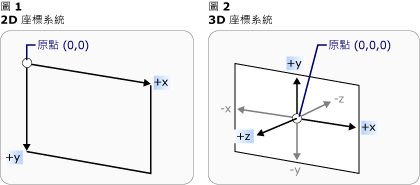
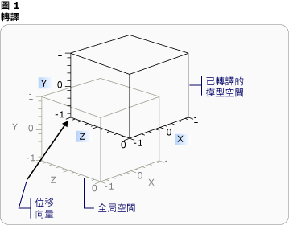
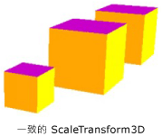
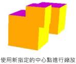
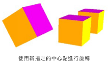
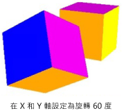

# 立體轉換概觀3-D Transformations Overview
本主題說明如何對 [!INCLUDE[TLA#tla_winclient](../../../../includes/tlasharptla-winclient-md.md)] 圖形系統中的 3D 模型套用轉換。This topic describes how to apply transformations to 3-D models in the [!INCLUDE[TLA#tla_winclient](../../../../includes/tlasharptla-winclient-md.md)] graphics system. 轉換可讓開發人員重新置放模型、調整模型大小，以及調整模型方向，而不需要變更定義模型的基底值。Transformations allow the developer to reposition, resize, and reorient models without changing the base values that define them.  
  

  
## 3D 座標空間3-D Coordinate Space  
 3d 圖形中的內容[!INCLUDE[TLA#tla_winclient](../../../../includes/tlasharptla-winclient-md.md)]封裝在一個項目， <xref:System.Windows.Controls.Viewport3D>，可參與二維元素結構。3-D graphics content in [!INCLUDE[TLA#tla_winclient](../../../../includes/tlasharptla-winclient-md.md)] is encapsulated in an element, <xref:System.Windows.Controls.Viewport3D>, that can participate in the two-dimensional element structure. 圖形系統會將 Viewport3D 視為二維的視覺元素，就像 [!INCLUDE[TLA#tla_winclient](../../../../includes/tlasharptla-winclient-md.md)] 中許多其他元素一樣。The graphics system treats Viewport3D as a two-dimensional visual element like many others in [!INCLUDE[TLA#tla_winclient](../../../../includes/tlasharptla-winclient-md.md)]. Viewport3D 運作的方式就像視窗 (檢視區) 一樣，但是是在三維的場景。Viewport3D functions as a window—a viewport—into a three-dimensional scene. 更精確來說，是一種 3D 場景投射到的表面。More accurately, it is a surface on which a 3-D scene is projected.  雖然您可以在相同的場景圖形中使用 Viewport3D 搭配其他 2D 繪圖物件，但是您不能在 Viewport3D 內貫穿 2D 和 3D 物件。Although you can use Viewport3D with other 2-D drawing objects in the same scene graph, you cannot interpenetrate 2-D and 3-D objects within a Viewport3D. 在以下討論中所描述的座標空間都包含在 Viewport3D 元素中。In the following discussion, the coordinate space described is contained by the Viewport3D element.  
  
 2D 圖形的 [!INCLUDE[TLA#tla_winclient](../../../../includes/tlasharptla-winclient-md.md)] 座標系統將原點置於轉譯表面 (通常是螢幕) 的左上角。The [!INCLUDE[TLA#tla_winclient](../../../../includes/tlasharptla-winclient-md.md)] coordinate system for 2-D graphics locates the origin in the upper left of the rendering surface (typically the screen). 在 2D 系統中，x 軸的正值是往右，y 軸的正值則是往下。In the 2-D system, positive x-axis values proceed to the right and positive y-axis values proceed downward. 不過在 3D 座標系統中，原點是位於螢幕的中心，x 軸的正值是往右，但 y 軸的正值是往上，而 z 軸的正值是從原點朝向檢視器往外。In the 3-D coordinate system, however, the origin is located in the center of the screen, with positive x-axis values proceeding to the right but positive y-axis values proceeding upward instead, and positive z-axis values proceeding outward from the origin, toward the viewer.  
  
   
座標系統比較Coordinate System Comparison  
  
 這些軸所定義的空間是針對 [!INCLUDE[TLA#tla_winclient](../../../../includes/tlasharptla-winclient-md.md)] 中 3D 物件的靜態參考座標系。The space defined by these axes is the stationary frame of reference for 3-D objects in [!INCLUDE[TLA#tla_winclient](../../../../includes/tlasharptla-winclient-md.md)]. 當您在此空間中建置模型，並建立光線和觀景窗來檢視這些模型時，有助於區分此靜態參考座標系 (或稱為「世界空間」) 與您為每個模型套用轉換時建立的當地參考座標系。As you build models in this space and create lights and cameras to view them, it's helpful to distinguish this stationary frame of reference, or "world space," from the local frame of reference you create for each model when you apply transformations to it. 也請記住，在世界空間中的物件取決於光線和觀景窗設定，可能看起來完全不同，或者完全無法看見，但觀景窗的位置不會改變世界空間中物件的位置。Remember also that objects in world space might look entirely different, or not be visible at all, depending on light and camera settings, but the position of the camera does not change the location of objects in world space.  
  
## 轉換模型Transforming Models  
 當您建立模型時，模型在場景中有特定的位置。When you create models, they have a particular location in the scene. 若要在場景中四處移動模型、旋轉模型，或變更模型的大小，變更定義模型的頂點本身並不實用。To move those models around in the scene, to rotate them, or to change their size, it's not practical to change the vertices that define the models themselves. 而是要像在 2D 一樣，對模型套用轉換。Instead, just as in 2-D, you apply transformations to models.  
  
 每個模型物件都<xref:System.Windows.Media.Media3D.Model3D.Transform%2A>與移動、 重新導向，或調整模型大小的屬性。Each model object has a <xref:System.Windows.Media.Media3D.Model3D.Transform%2A> property with which you can move, re-orient, or resize the model. 當您套用轉換時，可以透過轉換所指定的任何向量或值，有效率地位移模型的所有點。When you apply a transform, you effectively offset all the points of the model by whatever vector or value is specified by the transform. 換句話說，您已經轉換定義模型所在的座標空間 (「模型空間」)，但尚未變更在整個場景的座標系統 (「世界空間」) 中組成模型幾何的值。In other words, you've transformed the coordinate space in which the model is defined ("model space"), but you haven't changed the values that make up the model's geometry in the coordinate system of the entire scene ("world space").  
  
## 平移轉換Translation Transformations  
 3d 轉換繼承自抽象基底類別<xref:System.Windows.Media.Media3D.Transform3D>; 其中包括仿射轉換類別<xref:System.Windows.Media.Media3D.TranslateTransform3D>， <xref:System.Windows.Media.Media3D.ScaleTransform3D>，和<xref:System.Windows.Media.Media3D.RotateTransform3D>。3-D transformations inherit from the abstract base class <xref:System.Windows.Media.Media3D.Transform3D>; these include the affine transform classes <xref:System.Windows.Media.Media3D.TranslateTransform3D>, <xref:System.Windows.Media.Media3D.ScaleTransform3D>, and <xref:System.Windows.Media.Media3D.RotateTransform3D>. [!INCLUDE[TLA#tla_winclient](../../../../includes/tlasharptla-winclient-md.md)] 3d 系統也提供<xref:System.Windows.Media.Media3D.MatrixTransform3D>類別，可讓您更精確的矩陣作業中指定相同的轉換。The [!INCLUDE[TLA#tla_winclient](../../../../includes/tlasharptla-winclient-md.md)] 3-D system also provides a <xref:System.Windows.Media.Media3D.MatrixTransform3D> class that lets you specify the same transformations in more concise matrix operations.  
  
 <xref:System.Windows.Media.Media3D.TranslateTransform3D> 將所有資料點移動 model3d 中您使用指定的位移向量的方向<xref:System.Windows.Media.Media3D.TranslateTransform3D.OffsetX%2A>， <xref:System.Windows.Media.Media3D.TranslateTransform3D.OffsetY%2A>，和<xref:System.Windows.Media.Media3D.TranslateTransform3D.OffsetZ%2A>屬性。<xref:System.Windows.Media.Media3D.TranslateTransform3D> moves all the points in the Model3D in the direction of the offset vector you specify with the <xref:System.Windows.Media.Media3D.TranslateTransform3D.OffsetX%2A>, <xref:System.Windows.Media.Media3D.TranslateTransform3D.OffsetY%2A>, and <xref:System.Windows.Media.Media3D.TranslateTransform3D.OffsetZ%2A> properties. 例如，(2,2,2) 有一個立方體的頂點，(0,1.6,1) 的位移向量會將該頂點 (2,2,2) 移動到 (2,3.6,3)。For example, given one vertex of a cube at (2,2,2), an offset vector of (0,1.6,1) would move that vertex (2,2,2) to (2,3.6,3). 立方體的頂點還是在模型空間中的 (2,2,2)，但現在該模型空間已變更它與世界空間的關聯性，因此模型空間中的 (2,2,2) 就是世界空間中的 (2,3.6,3)。The cube's vertex is still (2,2,2) in model space, but now that model space has changed its relationship to world space so that (2,2,2) in model space is (2,3.6,3) in world space.  
  
   
使用位移的平移Translation with Offset  
  
 下列程式碼範例示範如何套用平移。The following code examples show how to apply a translation.  
  
 [!code-xaml[animation3dgallery_snip#Translation3DAnimationExampleWholePage](../../../../samples/snippets/csharp/VS_Snippets_Wpf/Animation3DGallery_snip/CS/Translation3DAnimationExample.xaml#translation3danimationexamplewholepage)]  
  
## 縮放轉換Scale Transformations  
 <xref:System.Windows.Media.Media3D.ScaleTransform3D> 變更模型的縮放中心點指定的縮放向量。<xref:System.Windows.Media.Media3D.ScaleTransform3D> changes the model's scale by a specified scale vector with reference to a center point. 指定統一的縮放比例，會將模型沿著 X、Y 和 Z 軸縮放相同的值，以便依比例變更模型的大小。Specify a uniform scale, which scales the model by the same value in the X, Y, and Z axes, to change the model's size proportionally. 例如，設定轉換<xref:System.Windows.Media.ScaleTransform.ScaleX%2A>， <xref:System.Windows.Media.ScaleTransform.ScaleY%2A>，和<xref:System.Windows.Media.Media3D.ScaleTransform3D.ScaleZ%2A>屬性為 0.5 一半模型的大小; 將相同的屬性設定為 2 會加倍在所有三個軸。For example, setting the transform's <xref:System.Windows.Media.ScaleTransform.ScaleX%2A>, <xref:System.Windows.Media.ScaleTransform.ScaleY%2A>, and <xref:System.Windows.Media.Media3D.ScaleTransform3D.ScaleZ%2A> properties to 0.5 halves the size of the model; setting the same properties to 2 doubles its scale in all three axes.  
  
   
ScaleVector 範例ScaleVector Example  
  
 指定不一致的縮放變換 (X、 Y 和 Z 值並非全都相同的縮放變換)，您可以讓模型在一或兩個維度伸長或收縮，而不影響其他維度。By specifying a non-uniform scale transformation—a scale transformation whose X, Y, and Z values are not all the same—you can cause a model to stretch or contract in one or two dimensions without affecting the others. 例如，設定<xref:System.Windows.Media.ScaleTransform.ScaleX%2A>設為 1，<xref:System.Windows.Media.ScaleTransform.ScaleY%2A>為 2，和<xref:System.Windows.Media.Media3D.ScaleTransform3D.ScaleZ%2A>為 1 會讓轉換的模型高度加倍，但會保持不變，沿著 X 軸和 Z 軸。For example, setting <xref:System.Windows.Media.ScaleTransform.ScaleX%2A> to 1, <xref:System.Windows.Media.ScaleTransform.ScaleY%2A> to 2, and <xref:System.Windows.Media.Media3D.ScaleTransform3D.ScaleZ%2A> to 1 would cause the transformed model to double in height but remain unchanged along the X and Z axes.  
  
 ScaleTransform3D 預設會讓頂點相對於原點 (0,0,0) 展開或收縮。By default, ScaleTransform3D causes vertices to expand or contract about the origin (0,0,0). 不過如果您想要轉換的模型不是從原點繪製，從原點縮放模型將不會「就地」縮放模型。If the model you want to transform is not drawn from the origin, however, scaling the model from the origin will not scale the model "in place." 而是當模型的頂點乘上縮放向量時，縮放作業將會有平移模型，同時縮放模型的效果。Instead, when the model's vertices are multiplied by the scale vector, the scale operation will have the effect of translating the model as well as scaling it.  
  
   
縮放中心範例Scale Center Example  
  
 若要調整 「 就地 」 模型，來指定模型的中心設定 ScaleTransform3D 的<xref:System.Windows.Media.ScaleTransform.CenterX%2A>， <xref:System.Windows.Media.ScaleTransform.CenterY%2A>，和<xref:System.Windows.Media.Media3D.ScaleTransform3D.CenterZ%2A>屬性。To scale a model "in place," specify the center of the model by setting the ScaleTransform3D's <xref:System.Windows.Media.ScaleTransform.CenterX%2A>, <xref:System.Windows.Media.ScaleTransform.CenterY%2A>, and <xref:System.Windows.Media.Media3D.ScaleTransform3D.CenterZ%2A> properties. 這可確保圖形系統縮放模型空間，然後將它置中指定轉譯<xref:System.Windows.Media.Media3D.Point3D>。This ensures that the graphics system scales the model space and then translates it to center on the specified <xref:System.Windows.Media.Media3D.Point3D>. 但是如果您已經先根據原點建置模型，再指定不同的中心點，則會看到模型偏離原點。Conversely, if you've built the model about the origin and specify a different center point, expect to see the model translated away from the origin.  
  
## 旋轉轉換Rotation Transformations  
 您可以使用幾種不同的方式旋轉 3D 模型。You can rotate a model in 3-D in several different ways. 一般旋轉轉換是指定一個軸，以及繞著該軸旋轉的角度。A typical rotation transformation specifies an axis and an angle of rotation around that axis. <xref:System.Windows.Media.Media3D.RotateTransform3D>類別可讓您定義<xref:System.Windows.Media.Media3D.Rotation3D>具有其<xref:System.Windows.Media.Media3D.RotateTransform3D.Rotation%2A>屬性。The <xref:System.Windows.Media.Media3D.RotateTransform3D> class allows you to define a <xref:System.Windows.Media.Media3D.Rotation3D> with its <xref:System.Windows.Media.Media3D.RotateTransform3D.Rotation%2A> property. 接著您可以指定<xref:System.Windows.Media.Media3D.AxisAngleRotation3D.Axis%2A>及<xref:System.Windows.Media.Media3D.AxisAngleRotation3D.Angle%2A>屬性，在此情況下的在 Rotation3D 上<xref:System.Windows.Media.Media3D.AxisAngleRotation3D>，來定義轉換。You then specify <xref:System.Windows.Media.Media3D.AxisAngleRotation3D.Axis%2A> and <xref:System.Windows.Media.Media3D.AxisAngleRotation3D.Angle%2A> properties on the Rotation3D, in this case an <xref:System.Windows.Media.Media3D.AxisAngleRotation3D>, to define the transformation. 下列範例會將模型繞著 Y 軸旋轉 60 度。The following examples rotate a model by 60 degrees around the Y axis.  
  
 [!code-xaml[animation3dgallery_snip#Rotate3DUsingAxisAngleRotation3DExampleWholePage](../../../../samples/snippets/csharp/VS_Snippets_Wpf/Animation3DGallery_snip/CS/Rotat3DUsingAxisAngleRotation3DExample.xaml#rotate3dusingaxisanglerotation3dexamplewholepage)]  
  
 注意︰[!INCLUDE[TLA#tla_winclient](../../../../includes/tlasharptla-winclient-md.md)] 3D 是右手系統，這表示旋轉的正角度值會繞著軸以逆時針方向旋轉。Note:[!INCLUDE[TLA#tla_winclient](../../../../includes/tlasharptla-winclient-md.md)] 3-D is a right-handed system, which means that a positive angle value for a rotation results in a counter-clockwise rotation about the axis.  
  
 如果未指定值，軸角度旋轉會假設對於原點旋轉<xref:System.Windows.Media.Media3D.RotateTransform3D.CenterX%2A>， <xref:System.Windows.Media.Media3D.RotateTransform3D.CenterY%2A>，和<xref:System.Windows.Media.Media3D.RotateTransform3D.CenterZ%2A>RotateTransform3D 上的屬性。Axis-angle rotations assume rotation about the origin if a value is not specified for the <xref:System.Windows.Media.Media3D.RotateTransform3D.CenterX%2A>, <xref:System.Windows.Media.Media3D.RotateTransform3D.CenterY%2A>, and <xref:System.Windows.Media.Media3D.RotateTransform3D.CenterZ%2A> properties on RotateTransform3D. 若使用縮放比例，最好記住旋轉會轉換模型的整個座標空間。As with scaling, it's helpful to remember that the rotation transforms the model's entire coordinate space. 如果模型不是相對於原點建立，或先前已平移，則可能會「以原點為中心」旋轉而不是就地旋轉。If the model was not created about the origin, or has been translated previously, the rotation might "pivot" about the origin instead of rotating in place.  
  
   
以指定的新中心進行的旋轉Rotation with new center specified  
  
 若要「就地」旋轉模型，請指定模型真正的中心做為旋轉的中心。To rotate the model "in place," specify the model's actual center as the center of rotation. 因為幾何通常是以原點開始建立，所以您可以先調整模型的大小 (縮放模型)，然後設定模型的方向 (旋轉模型)，最後將模型移到想要的位置 (平移模型)，通常都能在一組轉換之後得到預期的結果。Because geometry is typically modeled about the origin, you can most often get the expected result of a set of transformations by first sizing the model (scaling it), then setting its orientation (rotating it), and finally moving it to the desired location (translating it).  
  
   
旋轉範例Rotation Example  
  
 軸角度旋轉適用於靜態轉換和一些動畫。Axis-angle rotations work well for static transformations and some animations. 不過，如果考慮讓立方體模型繞著 X 軸旋轉 60 度，然後繞著 Z 軸旋轉 45 度。However, consider rotating a cube model 60 degrees around the X axis, then 45 degrees around the Z axis. 您可以將這個轉換描述為兩個不連續的仿射轉換，或描述為矩陣。You can describe this transformation as two discrete affine transformations, or as a matrix. 不過，要順利以動畫顯示此種方式定義的旋轉很困難。However, it might be difficult to smoothly animate a rotation defined this way. 雖然以兩種方法計算的模型開始位置和結束位置都相同，但是模型所採取的中間位置則是具有計算不確定性。Although the beginning and ending positions of the model computed by either approach are the same, the intermediate positions taken by the model are computationally uncertain. 四元數是一種用來計算旋轉開始和結束之間插補的替代方法。Quaternions represent an alternative way to compute the interpolation between the start and end of a rotation.  
  
 一個四元數代表 3D 空間中的一個軸和繞著該軸的旋轉。A quaternion represents an axis in 3-D space and a rotation around that axis. 例如，某個四元數可能代表 (1,1,2) 軸和 50 度的旋轉。For example, a quaternion might represent a (1,1,2) axis and a rotation of 50 degrees. 四元數在定義旋轉的威力在於您可以對四元數執行兩個操作︰合成和插補。Quaternions’ power in defining rotations comes from the two operations that you can perform on them: composition and interpolation. 套用至幾何的兩個四元數合成表示「將幾何繞著 axis2 旋轉 rotation2，然後繞著 axis1 旋轉 rotation1」。The composition of two quaternions applied to a geometry means "rotate the geometry around axis2 by rotation2, then rotate it around axis1 by rotation1." 使用合成，則可以結合幾何上的兩個旋轉來取得代表結果的單一四元數。By using composition, you can combine the two rotations on the geometry to get a single quaternion that represents the result. 因為四元數插補可以計算兩個軸與方向之間的平滑合理路徑，所以可以在原始的四元數與合成的四元數之間進行插補，以達到兩個四元數之間的平滑轉換，讓您以動畫顯示轉換。Because quaternion interpolation can calculate a smooth and reasonable path from one axis and orientation to another, you can interpolate from the original to the composed quaternion to achieve a smooth transition from one to the other, enabling you to animate the transformation. 針對您想要以動畫顯示的模型，您可以指定的目的地<xref:System.Windows.Media.Media3D.Quaternion>使用旋轉<xref:System.Windows.Media.Media3D.QuaternionRotation3D>如<xref:System.Windows.Media.Media3D.RotateTransform3D.Rotation%2A>屬性。For models that you want to animate, you can specify a destination <xref:System.Windows.Media.Media3D.Quaternion> for the rotation by using a <xref:System.Windows.Media.Media3D.QuaternionRotation3D> for the <xref:System.Windows.Media.Media3D.RotateTransform3D.Rotation%2A> property.  
  
## 使用轉換集合Using Transformation Collections  
 建立場景時，常會對模型套用多個轉換。When building a scene, it's common to apply more than one transformation to a model. 新增轉換<xref:System.Windows.Media.Media3D.Transform3DGroup.Children%2A>的集合<xref:System.Windows.Media.Media3D.Transform3DGroup>類別來分組方便將轉換為套用到場景中的各種模型。Add transforms to the <xref:System.Windows.Media.Media3D.Transform3DGroup.Children%2A> collection of the <xref:System.Windows.Media.Media3D.Transform3DGroup> class to group transforms conveniently to apply to various models in the scene. 重複使用多個不同群組中的轉換通常很方便，因此您可以對每個執行個體套用一組不同的轉換來重複使用模型。It's often convenient to reuse a transformation in several different groups, in much the way that you can reuse a model by applying a different set of transforms to each instance. 請注意，在集合中新增轉換的順序非常重要︰集合中的轉換會從第一個套用至最後一個。Note that order in which the transformations are added to the collection is significant: transforms in the collection are applied from first to last.  
  
## 以動畫顯示轉換Animating Transformations  
 [!INCLUDE[TLA#tla_winclient](../../../../includes/tlasharptla-winclient-md.md)] 3D 實作參與和 2D 圖形相同的計時和動畫系統。The [!INCLUDE[TLA#tla_winclient](../../../../includes/tlasharptla-winclient-md.md)] 3-D implementation participates in the same timing and animation system as 2-D graphics. 換句話說，若要以動畫顯示 3D 場景，就要以動畫顯示其模型的屬性。In other words, to animate a 3-D scene, animate the properties of its models. 您可以直接以動畫顯示基元的屬性，但是以動畫顯示變更模型位置或外觀的轉換通常更容易。It's possible to animate properties of primitives directly, but it's typically easier to animate transformations that change the position or appearance of models. 因為轉換可以套用至<xref:System.Windows.Media.Media3D.Model3DGroup>物件以及個別模型，它就 Model3Dgroup 的子系和另一組一整組物件的動畫套用一組動畫。Because transformations can be applied to <xref:System.Windows.Media.Media3D.Model3DGroup> objects as well as individual models, it's possible to apply one set of animations to the children of a Model3Dgroup and another set of animations to a group of objects.  如需 [!INCLUDE[TLA#tla_winclient](../../../../includes/tlasharptla-winclient-md.md)] 計時和動畫系統的背景資訊，請參閱[動畫概觀](../../../../docs/framework/wpf/graphics-multimedia/animation-overview.md)和[分鏡腳本概觀](../../../../docs/framework/wpf/graphics-multimedia/storyboards-overview.md)。For background information on the [!INCLUDE[TLA#tla_winclient](../../../../includes/tlasharptla-winclient-md.md)] timing and animation system, see [Animation Overview](../../../../docs/framework/wpf/graphics-multimedia/animation-overview.md) and [Storyboards Overview](../../../../docs/framework/wpf/graphics-multimedia/storyboards-overview.md).  
  
 若要以動畫顯示 [!INCLUDE[TLA#tla_winclient](../../../../includes/tlasharptla-winclient-md.md)] 中的物件，請建立時間軸、定義動畫 (這實際上是某些屬性值隨時間的變化)，並指定要套用動畫的屬性。To animate an object in [!INCLUDE[TLA#tla_winclient](../../../../includes/tlasharptla-winclient-md.md)], create a timeline, define an animation (which is really a change in some property value over time), and specify the property to which to apply the animation. 這個屬性必須是 FrameworkElement 的屬性。This property must be a property of a FrameworkElement. 因為在 3D 場景中所有物件都是 Viewport3D 的子系，所以您想要套用至場景之任何動畫的目標屬性都是 Viewport3D 之屬性的屬性。Because all the objects in a 3-D scene are children of Viewport3D, the properties targeted by any animation you want to apply to the scene are properties of properties of Viewport3D. 請務必小心處理動畫的屬性路徑，因為語法可能很冗長。It's important to work out the property path for the animation carefully, because the syntax can be verbose.  
  
 假設您想要就地旋轉物件，但是也想要套用擺動運動，讓物件更多部分供人檢視。Suppose you want to rotate an object in place, but also to apply a swinging motion to expose more of the object to view. 您可以選擇對模型套用 RotateTransform3D，然後讓其旋轉軸從一個向量到另一個向量以動畫顯示。You might choose to apply a RotateTransform3D to the model, and animate the axis of its rotation from one vector to another. 下列程式碼範例示範套用<xref:System.Windows.Media.Animation.Vector3DAnimation>的轉換的 Rotation3D 的 Axis 屬性，假設 RotateTransform3D 是數個轉換套用至具有模型的其中一個要<xref:System.Windows.Media.TransformGroup>。The following code example demonstrates applying a <xref:System.Windows.Media.Animation.Vector3DAnimation> to the Axis property of the transformation's Rotation3D, assuming the RotateTransform3D to be one of several transforms applied to the model with a <xref:System.Windows.Media.TransformGroup>.  
  
 [!code-csharp[3doverview#3DOverview3DN1](../../../../samples/snippets/csharp/VS_Snippets_Wpf/3DOverview/CSharp/Window1.xaml.cs#3doverview3dn1)]
 [!code-vb[3doverview#3DOverview3DN1](../../../../samples/snippets/visualbasic/VS_Snippets_Wpf/3DOverview/visualbasic/window1.xaml.vb#3doverview3dn1)]  
  
 [!code-csharp[3doverview#3DOverview3DN3](../../../../samples/snippets/csharp/VS_Snippets_Wpf/3DOverview/CSharp/Window1.xaml.cs#3doverview3dn3)]
 [!code-vb[3doverview#3DOverview3DN3](../../../../samples/snippets/visualbasic/VS_Snippets_Wpf/3DOverview/visualbasic/window1.xaml.vb#3doverview3dn3)]  
  
 您可以針對其他轉換屬性使用類似的語法來移動或縮放物件。Use a similar syntax to target other transformation properties to move or scale the object.  例如，您可以套用<xref:System.Windows.Media.Animation.Point3DAnimation>擴展轉換，以讓模型順暢地扭曲圖形上的 ScaleCenter 屬性。For example, you might apply a <xref:System.Windows.Media.Animation.Point3DAnimation> to the ScaleCenter property on a scale transform to cause a model to smoothly distort its shape.  
  
 雖然上述範例是轉換的屬性<xref:System.Windows.Media.Media3D.GeometryModel3D>，也是可以轉換場景中其他模型的屬性。Although the preceding examples transform the properties of <xref:System.Windows.Media.Media3D.GeometryModel3D>, it’s also possible to transform the properties of other models in the scene.  例如以動畫顯示套用至 Light 物件的平移，您可以建立能大幅變更模型外觀的移動光線和陰影效果。By animating translations applied to Light objects, for example, you can create moving light and shadow effects that can dramatically change the appearance of your models.  
  
 因為觀景窗也是模型，所以同樣可以轉換觀景窗屬性。Because cameras are also models, it’s possible to transform camera properties as well.  雖然您可以轉換觀景窗位置或平面距離來變更場景的外觀 (實際上是轉換整個場景投影)，但請注意，以這種方式達成的許多效果就觀者的「視覺感受」來說，會比對場景中的模型位置套用轉換來得少。While you can certainly change the appearance of the scene by transforming the camera location or plane distances—in effect, transforming the entire scene projection—note that many of the effects you achieve this way may not make as much "visual sense" to the viewer as transformations applied to the location or position of the models in the scene.  
  
## 另請參閱See Also  
 [立體圖形概觀3-D Graphics Overview](../../../../docs/framework/wpf/graphics-multimedia/3-d-graphics-overview.md)  
 [轉換概觀Transforms Overview](../../../../docs/framework/wpf/graphics-multimedia/transforms-overview.md)  
 [2D 轉換範例2-D Transforms Sample](https://go.microsoft.com/fwlink/?LinkID=158252)
