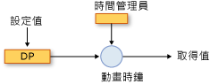
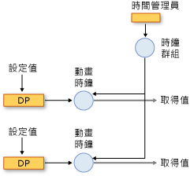
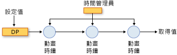

# 動畫和計時系統概觀
本主題描述如何計時系統使用動畫， <xref:System.Windows.Media.Animation.Timeline>，和<xref:System.Windows.Media.Animation.Clock>以動畫方式顯示屬性的類別。  
  
   
## 必要條件  
 若要了解本主題，您可以如[動畫概觀](../../../../docs/framework/wpf/graphics-multimedia/animation-overview.md)中所述，使用 [!INCLUDE[TLA2#tla_winclient](../../../../includes/tla2sharptla-winclient-md.md)] 動畫來以動畫顯示屬性。 這也有助於熟悉相依性屬性。如需詳細資訊，請參閱[相依性屬性概觀](../../../../docs/framework/wpf/advanced/dependency-properties-overview.md)。  
  
   
## 時間軸和時鐘  
 [動畫概觀](../../../../docs/framework/wpf/graphics-multimedia/animation-overview.md)所述方式<xref:System.Windows.Media.Animation.Timeline>代表一段時間和動畫是一種<xref:System.Windows.Media.Animation.Timeline>，會產生輸出值。 單獨使用時， <xref:System.Windows.Media.Animation.Timeline>，不執行任何動作不是只說明一段時間。 它是時間軸的<xref:System.Windows.Media.Animation.Clock>從事實際作業的物件。 同樣地，動畫不會實際建立屬性的動畫： 動畫類別描述輸出值應如何計算，但卻<xref:System.Windows.Media.Animation.Clock>所建立的磁碟機的動畫的輸出並將其套用至屬性的動畫。  
  
 A<xref:System.Windows.Media.Animation.Clock>是特殊類型的物件會維護與時間有關執行階段狀態<xref:System.Windows.Media.Animation.Timeline>。 它提供必要的動畫和計時系統資訊的三個位元： <xref:System.Windows.Media.Animation.Clock.CurrentTime%2A>， <xref:System.Windows.Media.Animation.Clock.CurrentProgress%2A>，和<xref:System.Windows.Media.Animation.Clock.CurrentState%2A>。 A<xref:System.Windows.Media.Animation.Clock>判斷其目前的時間、 進度與狀態描述的計時行為，透過其<xref:System.Windows.Media.Animation.Timeline>: <xref:System.Windows.Media.Animation.Timeline.Duration%2A>， <xref:System.Windows.Media.Animation.Timeline.RepeatBehavior%2A>， <xref:System.Windows.Media.Animation.Timeline.AutoReverse%2A>，依此類推。  
  
 在大部分情況下，<xref:System.Windows.Media.Animation.Clock>時刻表自動建立。 當您使用動畫顯示<xref:System.Windows.Media.Animation.Storyboard>或<xref:System.Windows.Media.Animation.Animatable.BeginAnimation%2A>方法中，時鐘的自動建立時間表的動畫並套用至其目標屬性。 您也可以建立<xref:System.Windows.Media.Animation.Clock>明確地使用<xref:System.Windows.Media.Animation.Timeline.CreateClock%2A>方法您<xref:System.Windows.Media.Animation.Timeline>。 <xref:System.Windows.Media.MediaTimeline.CreateClock%2A?displayProperty=nameWithType>方法會建立適當類型的時鐘<xref:System.Windows.Media.Animation.Timeline>它為呼叫的目標。 如果<xref:System.Windows.Media.Animation.Timeline>包含子時間表，它會建立<xref:System.Windows.Media.Animation.Clock>以及它們的物件。 產生<xref:System.Windows.Media.Animation.Clock>物件會在符合的結構的樹狀目錄中排列<xref:System.Windows.Media.Animation.Timeline>所建立的物件樹狀結構。  
  
 不同類型的時間軸有不同類型的時鐘。 下表顯示<xref:System.Windows.Media.Animation.Clock>對應至一些不同的型別<xref:System.Windows.Media.Animation.Timeline>型別。  
  
|時間軸型別|時鐘類型|時鐘用途|  
|-------------------|----------------|-------------------|  
|動畫 (繼承自<xref:System.Windows.Media.Animation.AnimationTimeline>)|<xref:System.Windows.Media.Animation.AnimationClock>|產生相依性屬性的輸出值。|  
|<xref:System.Windows.Media.MediaTimeline>|<xref:System.Windows.Media.MediaClock>|處理媒體檔案。|  
|<xref:System.Windows.Media.Animation.ParallelTimeline>|<xref:System.Windows.Media.Animation.ClockGroup>|分組，並控制它的子系<xref:System.Windows.Media.Animation.Clock>物件|  
|<xref:System.Windows.Media.Animation.Storyboard>|<xref:System.Windows.Media.Animation.ClockGroup>|分組，並控制它的子系<xref:System.Windows.Media.Animation.Clock>物件|  
  
 您可以套用任何<xref:System.Windows.Media.Animation.AnimationClock>物件使用建立相容的相依性屬性<xref:System.Windows.Media.Animation.IAnimatable.ApplyAnimationClock%2A>方法。  
  
 需要大量效能的情況下，例如動畫執行大量的類似物件，管理您自己<xref:System.Windows.Media.Animation.Clock>使用可以提供的效能優勢。  
  
   
## 時鐘和時間管理員  
 當您製作物件動畫中[!INCLUDE[TLA2#tla_winclient](../../../../includes/tla2sharptla-winclient-md.md)]，它是時間管理員管理<xref:System.Windows.Media.MediaPlayer.Clock%2A>針對時間表建立的物件。 時間管理員為 <xref:System.Windows.Media.MediaPlayer.Clock%2A> 物件樹狀目錄的根目錄，並控制該樹狀目錄中的時間流程。  系統會為每一個 [!INCLUDE[TLA2#tla_winclient](../../../../includes/tla2sharptla-winclient-md.md)] 應用程式自動建立時間管理員，而且應用程式開發人員看不到時間管理員。 時間管理員每一秒都會「滴答」許多次，每一秒發生的實際滴答數目會視可用的系統資源而有所不同。 時間管理員會在每個這些刻度期間計算所有的狀態<xref:System.Windows.Media.Animation.ClockState.Active><xref:System.Windows.Media.Animation.Clock>時間樹狀結構中的物件。  
  
 下圖顯示時間管理員之間的關聯性和<xref:System.Windows.Media.Animation.AnimationClock>，和執行動畫相依性屬性。  
  
   
以動畫顯示屬性  
  
 當時間管理員刻度時，它會更新的時間的每個<xref:System.Windows.Media.Animation.ClockState.Active><xref:System.Windows.Media.Animation.Clock>應用程式中。 如果<xref:System.Windows.Media.Animation.Clock>是<xref:System.Windows.Media.Animation.AnimationClock>，它會使用<xref:System.Windows.Media.Animation.AnimationTimeline.GetCurrentValue%2A>方法<xref:System.Windows.Media.Animation.AnimationTimeline>從建立它時所要計算其目前輸出值。 <xref:System.Windows.Media.Animation.AnimationClock>提供<xref:System.Windows.Media.Animation.AnimationTimeline>與目前的當地時間、 輸入的值，通常是屬性的基底值和預設目的地值。 當您擷取的動態值屬性使用<xref:System.Windows.DependencyObject.GetValue%2A>方法或其 CLR 存取子，您會得到的輸出及其<xref:System.Windows.Media.Animation.AnimationClock>。  
  
#### 時鐘群組  
 上一節中所述方式沒有不同類型的<xref:System.Windows.Media.Animation.Clock>時間軸的不同類型的物件。 下圖顯示時間管理員之間的關聯性<xref:System.Windows.Media.Animation.ClockGroup>、 <xref:System.Windows.Media.Animation.AnimationClock>，和執行動畫相依性屬性。 A<xref:System.Windows.Media.Animation.ClockGroup>建立的群組，例如其他時間軸的時間軸<xref:System.Windows.Media.Animation.Storyboard>類別以分組動畫和其他砸下大筆花費。  
  
   
ClockGroup  
  
#### 組合  
 您可以將多個時鐘與單一屬性進行關聯，此時每個時鐘都使用上述時鐘的輸出值做為其基底值。 下圖顯示三個<xref:System.Windows.Media.Animation.AnimationClock>物件套用至相同的屬性。 Clock1 使用動畫屬性的基底值做為輸入，並使用它來產生輸出。 Clock2 會採用從 Clock1 的輸出做為輸入，並使用它來產生輸出。 Clock3 會採用從 Clock2 的輸出做為輸入，並使用它來產生輸出。 當多個時鐘同時影響同一個屬性時，就可以說是形成一個組合鏈結。  
  
   
組合鏈結  
  
 請注意，雖然輸入和輸出之間建立關聯性<xref:System.Windows.Media.Animation.AnimationClock>組合鏈結中的物件及其計時行為不受影響;<xref:System.Windows.Media.Animation.Clock>物件 (包括<xref:System.Windows.Media.Animation.AnimationClock>物件) 具有其父代階層式相依性<xref:System.Windows.Media.Animation.Clock>物件。  
  
 若要將多個時鐘套用至相同的屬性，使用<xref:System.Windows.Media.Animation.HandoffBehavior.Compose><xref:System.Windows.Media.Animation.HandoffBehavior>套用時<xref:System.Windows.Media.Animation.Storyboard>，動畫，或<xref:System.Windows.Media.Animation.AnimationClock>。  
  
#### 滴答和事件彙總  
 除了計算輸出值，時間管理員也會在每次滴答時執行其他工作︰它會判斷每個時鐘的狀態並引發適當的事件。  
  
 雖然滴答經常發生，但在滴答之間有可能會發生很多事。 例如，<xref:System.Windows.Media.Animation.Clock>可能會停止、 啟動，而且在此情況下，停止其<xref:System.Windows.Media.Animation.Clock.CurrentState%2A>值將變更三次。 理論上來說，<xref:System.Windows.Media.Animation.Clock.CurrentStateInvalidated>事件無法在單一刻度中引發多次; 但是，時間引擎會彙總事件，以便<xref:System.Windows.Media.Animation.Clock.CurrentStateInvalidated>可以一次引發事件，每個刻度。 這適用於所有的計時事件： 都會引發最多一個事件的每個型別指定<xref:System.Windows.Media.Animation.Clock>物件。  
  
 當<xref:System.Windows.Media.Animation.Clock>切換狀態，並傳回其原始狀態刻度之間 (例如變更從<xref:System.Windows.Media.Animation.ClockState.Active>至<xref:System.Windows.Media.Animation.ClockState.Stopped>再回到<xref:System.Windows.Media.Animation.ClockState.Active>)，相關聯的事件還是會發生。  
  
 如需計時事件的詳細資訊，請參閱[計時事件概觀](../../../../docs/framework/wpf/graphics-multimedia/timing-events-overview.md)。  
  
   
## 屬性的目前值和基底值  
 可動畫的屬性可以有兩個值︰基底值和目前值。 當您將使用其 CLR 存取子的屬性或<xref:System.Windows.DependencyObject.SetValue%2A>方法，設定其基底值。 當屬性未以動畫顯示時，其基底值和目前值都相同。  
  
 當您以動畫顯示屬性，<xref:System.Windows.Media.Animation.AnimationClock>設定的屬性*目前*值。 擷取透過其 CLR 存取子屬性的值或<xref:System.Windows.DependencyObject.GetValue%2A>方法傳回的輸出<xref:System.Windows.Media.Animation.AnimationClock>時<xref:System.Windows.Media.Animation.AnimationClock>是<xref:System.Windows.Media.Animation.ClockState.Active>或<xref:System.Windows.Media.Animation.ClockState.Filling>。 您可以使用來擷取屬性的基底值<xref:System.Windows.Media.Animation.IAnimatable.GetAnimationBaseValue%2A>方法。  
  
## 另請參閱  
 [動畫概觀](../../../../docs/framework/wpf/graphics-multimedia/animation-overview.md)  
 [計時事件概觀](../../../../docs/framework/wpf/graphics-multimedia/timing-events-overview.md)  
 [計時行為概觀](../../../../docs/framework/wpf/graphics-multimedia/timing-behaviors-overview.md)
