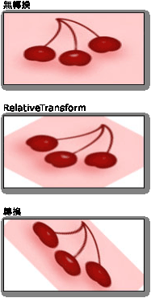

# 筆刷轉換概觀Brush Transformation Overview
Brush 類別提供兩個轉換屬性：<xref:System.Windows.Media.Brush.Transform%2A>和<xref:System.Windows.Media.Brush.RelativeTransform%2A>。The Brush class provides two transformation properties: <xref:System.Windows.Media.Brush.Transform%2A> and <xref:System.Windows.Media.Brush.RelativeTransform%2A>. 上述屬性可讓您旋轉、縮放、扭曲及平移筆刷的內容。The properties enable you to rotate, scale, skew, and translate a brush's contents. 本主題說明這兩種屬性之間的差異並提供使用方式範例。This topic describes the differences between these two properties and provides examples of their usage.  
  
   
## 必要條件Prerequisites  
 若要了解本主題，您應該了解您要轉換的筆刷功能。To understand this topic, you should understand the features of the brush that you are transforming. 針對<xref:System.Windows.Media.LinearGradientBrush>並<xref:System.Windows.Media.RadialGradientBrush>，請參閱[使用純色和漸層概觀繪製](painting-with-solid-colors-and-gradients-overview.md)。For <xref:System.Windows.Media.LinearGradientBrush> and <xref:System.Windows.Media.RadialGradientBrush>, see the [Painting with Solid Colors and Gradients Overview](painting-with-solid-colors-and-gradients-overview.md). 針對<xref:System.Windows.Media.ImageBrush>， <xref:System.Windows.Media.DrawingBrush>，或<xref:System.Windows.Media.VisualBrush>，請參閱[使用影像、 繪圖和視覺效果繪製](painting-with-images-drawings-and-visuals.md)。For <xref:System.Windows.Media.ImageBrush>, <xref:System.Windows.Media.DrawingBrush>, or <xref:System.Windows.Media.VisualBrush>, see  [Painting with Images, Drawings, and Visuals](painting-with-images-drawings-and-visuals.md). 您也應該熟悉[轉換概觀](transforms-overview.md)中所述的 2D 轉換。You should also be familiar with the 2D transforms described in the  [Transforms Overview](transforms-overview.md).  
  
   
## Transform 和 RelativeTransform 屬性之間的差異Differences between the Transform and RelativeTransform Properties  
 當您將轉換套用至筆刷的<xref:System.Windows.Media.Brush.Transform%2A>屬性，您必須知道繪製區域的大小，如果您想要轉換的筆刷內容，繞著中心。When you apply a transform to a brush's <xref:System.Windows.Media.Brush.Transform%2A> property, you need to know the size of the painted area if you want to transform the brush contents about its center. 假設繪製的區域寬度為 200 裝置獨立像素且高度為 150。Suppose the painted area is 200 device independent pixels wide and 150 tall.  如果您使用<xref:System.Windows.Media.RotateTransform>旋轉筆刷的輸出其中心點的 45 度，並會提供<xref:System.Windows.Media.RotateTransform><xref:System.Windows.Media.RotateTransform.CenterX%2A>為 100 和<xref:System.Windows.Media.RotateTransform.CenterY%2A>的 75。If you used a <xref:System.Windows.Media.RotateTransform> to rotate the brush's output 45 degrees about its center, you'd give the <xref:System.Windows.Media.RotateTransform> a <xref:System.Windows.Media.RotateTransform.CenterX%2A> of 100 and a <xref:System.Windows.Media.RotateTransform.CenterY%2A> of 75.  
  
 當您將轉換套用至筆刷的<xref:System.Windows.Media.Brush.RelativeTransform%2A>屬性，其輸出會對應到繪製區域之前，該轉換會套用到筆刷。When you apply a transform to a brush's <xref:System.Windows.Media.Brush.RelativeTransform%2A> property, that transform is applied to the brush before its output is mapped to the painted area. 下列清單說明筆刷內容的處理和轉換順序。The following list describes the order in which a brush’s contents are processed and transformed.  
  
1. 處理筆刷的內容。Process the brush’s contents. 針對<xref:System.Windows.Media.GradientBrush>，這表示決定漸層停駐區域。For a <xref:System.Windows.Media.GradientBrush>, this means determining the gradient area. 針對<xref:System.Windows.Media.TileBrush>，則<xref:System.Windows.Media.TileBrush.Viewbox%2A>對應至<xref:System.Windows.Media.TileBrush.Viewport%2A>。For a <xref:System.Windows.Media.TileBrush>, the <xref:System.Windows.Media.TileBrush.Viewbox%2A> is mapped to the <xref:System.Windows.Media.TileBrush.Viewport%2A>. 這會成為筆刷的輸出。This becomes the brush’s output.  
  
2. 將筆刷的輸出投影至 1 x 1 轉換矩形。Project the brush’s output onto the 1 x 1 transformation rectangle.  
  
3. 套用筆刷的<xref:System.Windows.Media.Brush.RelativeTransform%2A>，如果有的話。Apply the brush’s <xref:System.Windows.Media.Brush.RelativeTransform%2A>, if it has one.  
  
4. 將轉換後的輸出投影至要繪製的區域。Project the transformed output onto the area to paint.  
  
5. 套用筆刷的<xref:System.Windows.Media.Transform>，如果有的話。Apply the brush’s <xref:System.Windows.Media.Transform>, if it has one.  
  
 因為<xref:System.Windows.Media.Brush.RelativeTransform%2A>套用時將筆刷的輸出會對應到 1x1 矩形，轉換中心點和位移的值似乎有相對關係。Because the <xref:System.Windows.Media.Brush.RelativeTransform%2A> is applied while the brush’s output is mapped to a 1 x 1 rectangle, transform center and offset values appear to be relative. 比方說，如果您使用<xref:System.Windows.Media.RotateTransform>旋轉筆刷的輸出其中心點的 45 度，並會提供<xref:System.Windows.Media.RotateTransform><xref:System.Windows.Media.RotateTransform.CenterX%2A>為 0.5 和<xref:System.Windows.Media.RotateTransform.CenterY%2A>為 0.5。For example, if you used a <xref:System.Windows.Media.RotateTransform> to rotate the brush's output 45 degrees about its center, you'd give the <xref:System.Windows.Media.RotateTransform> a <xref:System.Windows.Media.RotateTransform.CenterX%2A> of 0.5 and a <xref:System.Windows.Media.RotateTransform.CenterY%2A> of 0.5.  
  
 下圖顯示具有已旋轉 45 度使用的數個筆刷的輸出<xref:System.Windows.Media.Brush.RelativeTransform%2A>和<xref:System.Windows.Media.Brush.Transform%2A>屬性。The following illustration shows the output of several brushes that have been rotated by 45 degrees using the <xref:System.Windows.Media.Brush.RelativeTransform%2A> and <xref:System.Windows.Media.Brush.Transform%2A> properties.  
  
   
  
   
## 搭配 TileBrush 使用 RelativeTransformUsing RelativeTransform with a TileBrush  
 拼貼筆刷會比其他筆刷更為複雜，因為套用<xref:System.Windows.Media.Brush.RelativeTransform%2A>其中一個可能會產生非預期的結果。Because tile brushes are more complex than other brushes, applying a <xref:System.Windows.Media.Brush.RelativeTransform%2A> to one might produce unexpected results. 例如，使用下列影像。For example, take the following image.  
  
   
  
 下列範例會使用<xref:System.Windows.Media.ImageBrush>來繪製的矩形區域，以前面的影像。The following example uses an <xref:System.Windows.Media.ImageBrush> to paint a rectangular area with the preceding image. 它會套用<xref:System.Windows.Media.RotateTransform>要<xref:System.Windows.Media.ImageBrush>物件的<xref:System.Windows.Media.Brush.RelativeTransform%2A>屬性，並設定其<xref:System.Windows.Media.TileBrush.Stretch%2A>屬性設<xref:System.Windows.Media.Stretch.UniformToFill>，自動縮放以完全填滿矩形時，它應該保留影像的外觀比例。It applies a <xref:System.Windows.Media.RotateTransform> to the <xref:System.Windows.Media.ImageBrush> object's <xref:System.Windows.Media.Brush.RelativeTransform%2A> property, and sets its <xref:System.Windows.Media.TileBrush.Stretch%2A> property to <xref:System.Windows.Media.Stretch.UniformToFill>, which should preserve the image's aspect ratio when it is stretched to completely fill the rectangle.  
  
 [!code-xaml[BrushOverviewExamples_snip#GraphicsMMRelativeTransformExample2Inline](~/samples/snippets/xaml/VS_Snippets_Wpf/BrushOverviewExamples_snip/XAML/RelativeTransformIllustration.xaml#graphicsmmrelativetransformexample2inline)]  
  
 這個範例會產生下列輸出：This example produces the following output:  
  
   
  
 請注意，影像會扭曲，即使筆刷<xref:System.Windows.Media.TileBrush.Stretch%2A>已設為<xref:System.Windows.Media.Stretch.UniformToFill>。Notice that the image is distorted, even though the brush's <xref:System.Windows.Media.TileBrush.Stretch%2A> was set to <xref:System.Windows.Media.Stretch.UniformToFill>. 這是因為套用相對轉換後的筆刷<xref:System.Windows.Media.TileBrush.Viewbox%2A>對應至其<xref:System.Windows.Media.TileBrush.Viewport%2A>。That's because the relative transform is applied after the brush's <xref:System.Windows.Media.TileBrush.Viewbox%2A> is mapped to its <xref:System.Windows.Media.TileBrush.Viewport%2A>. 下列清單描述程序的每個步驟︰The following list describes each step of the process:  
  
1. 專案 筆刷的內容 (<xref:System.Windows.Media.TileBrush.Viewbox%2A>) 到其基底的並排顯示 (<xref:System.Windows.Media.TileBrush.Viewport%2A>) 使用筆刷的<xref:System.Windows.Media.TileBrush.Stretch%2A>設定。Project the brush's contents (<xref:System.Windows.Media.TileBrush.Viewbox%2A>) onto its base tile (<xref:System.Windows.Media.TileBrush.Viewport%2A>) using the brush's <xref:System.Windows.Media.TileBrush.Stretch%2A> setting.  
  
       
  
2. 將基底的並排顯示投影至 1 x 1 轉換矩形。Project the base tile onto the 1 x 1 transformation rectangle.  
  
       
  
3. 套用<xref:System.Windows.Media.RotateTransform>。Apply the <xref:System.Windows.Media.RotateTransform>.  
  
       
  
4. 將轉換後基底的並排顯示投影至要繪製的區域。Project the transformed base tile onto the area to paint.  
  
       
  
   
## 範例：旋轉 ImageBrush 45 度Example: Rotate an ImageBrush 45 Degrees  
 下列範例會套用<xref:System.Windows.Media.RotateTransform>要<xref:System.Windows.Media.Brush.RelativeTransform%2A>屬性<xref:System.Windows.Media.ImageBrush>。The following example applies a <xref:System.Windows.Media.RotateTransform> to the <xref:System.Windows.Media.Brush.RelativeTransform%2A> property of an <xref:System.Windows.Media.ImageBrush>. <xref:System.Windows.Media.RotateTransform>物件的<xref:System.Windows.Media.RotateTransform.CenterX%2A>和<xref:System.Windows.Media.RotateTransform.CenterY%2A>屬性都設為 0.5，相對座標內容中心點。The <xref:System.Windows.Media.RotateTransform> object's <xref:System.Windows.Media.RotateTransform.CenterX%2A> and <xref:System.Windows.Media.RotateTransform.CenterY%2A> properties are both set to 0.5, the relative coordinates of the content's center point. 如此一來，會以筆刷內容的中心為中心點旋轉。As a result, the brush's contents are rotated about its center.  
  
 [!code-csharp[BrushesIntroduction_snip#ImageBrushRelativeTransformExample](~/samples/snippets/csharp/VS_Snippets_Wpf/BrushesIntroduction_snip/CSharp/BrushTransformExample.cs#imagebrushrelativetransformexample)]
 [!code-vb[BrushesIntroduction_snip#ImageBrushRelativeTransformExample](~/samples/snippets/visualbasic/VS_Snippets_Wpf/BrushesIntroduction_snip/visualbasic/brushtransformexample.vb#imagebrushrelativetransformexample)]
 [!code-xaml[BrushesIntroduction_snip#ImageBrushRelativeTransformExample](~/samples/snippets/xaml/VS_Snippets_Wpf/BrushesIntroduction_snip/XAML/BrushTransformExample.xaml#imagebrushrelativetransformexample)]  
  
 下一個範例也適用於<xref:System.Windows.Media.RotateTransform>要<xref:System.Windows.Media.ImageBrush>，但會使用<xref:System.Windows.Media.Brush.Transform%2A>屬性而非<xref:System.Windows.Media.Brush.RelativeTransform%2A>屬性。The next example also applies a <xref:System.Windows.Media.RotateTransform> to an <xref:System.Windows.Media.ImageBrush>, but uses the <xref:System.Windows.Media.Brush.Transform%2A> property instead of the <xref:System.Windows.Media.Brush.RelativeTransform%2A> property. 若要旋轉筆刷的中心，<xref:System.Windows.Media.RotateTransform>物件的<xref:System.Windows.Media.RotateTransform.CenterX%2A>和<xref:System.Windows.Media.RotateTransform.CenterY%2A>必須設為絕對座標。To rotate the brush about its center, the <xref:System.Windows.Media.RotateTransform> object's <xref:System.Windows.Media.RotateTransform.CenterX%2A> and <xref:System.Windows.Media.RotateTransform.CenterY%2A> must be set to absolute coordinates. 因為使用筆刷繪製的矩形為 175 x 90 像素，所以其中心點為 (87.5, 45)。Because the rectangle being painted by the brush is 175 by 90 pixels, its center point is (87.5, 45).  
  
 [!code-csharp[BrushesIntroduction_snip#ImageBrushTransformExample](~/samples/snippets/csharp/VS_Snippets_Wpf/BrushesIntroduction_snip/CSharp/BrushTransformExample.cs#imagebrushtransformexample)]
 [!code-vb[BrushesIntroduction_snip#ImageBrushTransformExample](~/samples/snippets/visualbasic/VS_Snippets_Wpf/BrushesIntroduction_snip/visualbasic/brushtransformexample.vb#imagebrushtransformexample)]
 [!code-xaml[BrushesIntroduction_snip#ImageBrushTransformExample](~/samples/snippets/xaml/VS_Snippets_Wpf/BrushesIntroduction_snip/XAML/BrushTransformExample.xaml#imagebrushtransformexample)]  
  
 下圖顯示沒有轉換，將轉換套用至筆刷<xref:System.Windows.Media.Brush.RelativeTransform%2A>屬性，以及將轉換套用至<xref:System.Windows.Media.Brush.Transform%2A>屬性。The following illustration shows the brush without a transform, with the transform applied to the <xref:System.Windows.Media.Brush.RelativeTransform%2A> property, and with the transform applied to the <xref:System.Windows.Media.Brush.Transform%2A> property.  
  
   
  
 這個範例是某完整範例的一部分。This example is part of a larger sample. 如需完整的範例，請參閱 [Brush 範例](https://go.microsoft.com/fwlink/?LinkID=159973)。For the complete sample, see the [Brushes Sample](https://go.microsoft.com/fwlink/?LinkID=159973). 如需筆刷的詳細資訊，請參閱 [WPF 筆刷概觀](wpf-brushes-overview.md)。For more information about brushes, see the  [WPF Brushes Overview](wpf-brushes-overview.md).  
  
## 另請參閱See also

- <xref:System.Windows.Media.Brush.Transform%2A>
- <xref:System.Windows.Media.Brush.RelativeTransform%2A>
- <xref:System.Windows.Media.Transform>
- <xref:System.Windows.Media.Brush>
- [使用純色和漸層繪製的概觀Painting with Solid Colors and Gradients Overview](painting-with-solid-colors-and-gradients-overview.md)
- [使用影像、繪圖和視覺效果繪製Painting with Images, Drawings, and Visuals](painting-with-images-drawings-and-visuals.md)
- [轉換概觀Transforms Overview](transforms-overview.md)
