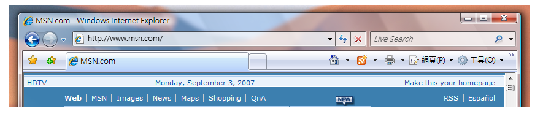

# <a name="extend-glass-frame-into-a-wpf-application"></a><span data-ttu-id="baeea-102">將玻璃框架擴充至 WPF 應用程式中</span><span class="sxs-lookup"><span data-stu-id="baeea-102">Extend Glass Frame Into a WPF Application</span></span>
<span data-ttu-id="baeea-103">本主題示範如何擴充[!INCLUDE[TLA#tla_winvista](../../../../includes/tlasharptla-winvista-md.md)]至 Windows Presentation Foundation (WPF) 應用程式的工作區的玻璃框架。</span><span class="sxs-lookup"><span data-stu-id="baeea-103">This topic demonstrates how to extend the [!INCLUDE[TLA#tla_winvista](../../../../includes/tlasharptla-winvista-md.md)] glass frame into the client area of a Windows Presentation Foundation (WPF) application.</span></span>  
  
> [!NOTE]
>  <span data-ttu-id="baeea-104">此範例只能在執行桌面視窗管理員 (DWM) 且已啟用玻璃效果的 [!INCLUDE[TLA2#tla_winvista](../../../../includes/tla2sharptla-winvista-md.md)] 機器上使用。</span><span class="sxs-lookup"><span data-stu-id="baeea-104">This example will only work on a [!INCLUDE[TLA2#tla_winvista](../../../../includes/tla2sharptla-winvista-md.md)] machine running the Desktop Window Manager (DWM) with glass enabled.</span></span> [!INCLUDE[TLA2#tla_winvista](../../../../includes/tla2sharptla-winvista-md.md)]<span data-ttu-id="baeea-105"> 家用入門版不支援透明的玻璃效果。</span><span class="sxs-lookup"><span data-stu-id="baeea-105"> Home Basic edition does not support the transparent glass effect.</span></span> <span data-ttu-id="baeea-106">在 [!INCLUDE[TLA2#tla_winvista](../../../../includes/tla2sharptla-winvista-md.md)] 其他版本上通常以透明玻璃效果呈現的區域會呈現不透明。</span><span class="sxs-lookup"><span data-stu-id="baeea-106">Areas that would typically render with the transparent glass effect on other editions of [!INCLUDE[TLA2#tla_winvista](../../../../includes/tla2sharptla-winvista-md.md)] are rendered opaque.</span></span>  
  
## <a name="example"></a><span data-ttu-id="baeea-107">範例</span><span class="sxs-lookup"><span data-stu-id="baeea-107">Example</span></span>  
 <span data-ttu-id="baeea-108">下圖顯示將玻璃框架擴充至 Internet Explorer 7 的網址列。</span><span class="sxs-lookup"><span data-stu-id="baeea-108">The following image illustrates the glass frame extended into the address bar of Internet Explorer 7.</span></span>  
  
 <span data-ttu-id="baeea-109">**Internet Explorer 在網址列後面使用擴充的玻璃框架。**</span><span class="sxs-lookup"><span data-stu-id="baeea-109">**Internet Explorer with extended glass frame behind address bar.**</span></span>  
  
 <span data-ttu-id="baeea-110"></span><span class="sxs-lookup"><span data-stu-id="baeea-110"></span></span>  
  
 <span data-ttu-id="baeea-111">若要在 [!INCLUDE[TLA2#tla_wpf](../../../../includes/tla2sharptla-wpf-md.md)] 應用程式上擴充玻璃框架，請視需要存取 Unmanaged [!INCLUDE[TLA#tla_api](../../../../includes/tlasharptla-api-md.md)]。</span><span class="sxs-lookup"><span data-stu-id="baeea-111">To extend the glass frame on a [!INCLUDE[TLA2#tla_wpf](../../../../includes/tla2sharptla-wpf-md.md)] application, access to unmanaged [!INCLUDE[TLA#tla_api](../../../../includes/tlasharptla-api-md.md)] is needed.</span></span> <span data-ttu-id="baeea-112">下列程式碼範例針對所需的兩個 [!INCLUDE[TLA2#tla_api](../../../../includes/tla2sharptla-api-md.md)] 執行平台叫用 (pinvoke)，將框架擴充到工作區。</span><span class="sxs-lookup"><span data-stu-id="baeea-112">The following code example does a Platform Invoke (pinvoke) for the two [!INCLUDE[TLA2#tla_api](../../../../includes/tla2sharptla-api-md.md)] needed to extend the frame into the client area.</span></span> <span data-ttu-id="baeea-113">這些 [!INCLUDE[TLA2#tla_api](../../../../includes/tla2sharptla-api-md.md)] 每一個都會在名為 **NonClientRegionAPI** 的類別中宣告。</span><span class="sxs-lookup"><span data-stu-id="baeea-113">Each of these [!INCLUDE[TLA2#tla_api](../../../../includes/tla2sharptla-api-md.md)] are declared in a class called **NonClientRegionAPI**.</span></span>  
  
```csharp  
[StructLayout(LayoutKind.Sequential)]  
public struct MARGINS  
{  
    public int cxLeftWidth;      // width of left border that retains its size  
    public int cxRightWidth;     // width of right border that retains its size  
    public int cyTopHeight;      // height of top border that retains its size  
    public int cyBottomHeight;   // height of bottom border that retains its size  
};  
  
[DllImport("DwmApi.dll")]  
public static extern int DwmExtendFrameIntoClientArea(  
    IntPtr hwnd,  
    ref MARGINS pMarInset);  
```  
  
```vb  
<StructLayout(LayoutKind.Sequential)>  
        Public Structure MARGINS  
            Public cxLeftWidth As Integer ' width of left border that retains its size  
            Public cxRightWidth As Integer ' width of right border that retains its size  
            Public cyTopHeight As Integer ' height of top border that retains its size  
            Public cyBottomHeight As Integer ' height of bottom border that retains its size  
        End Structure  
  
        <DllImport("DwmApi.dll")>  
        Public Shared Function DwmExtendFrameIntoClientArea(ByVal hwnd As IntPtr, ByRef pMarInset As MARGINS) As Integer  
        End Function  
```  
  
 <span data-ttu-id="baeea-114">[DwmExtendFrameIntoClientArea](/windows/desktop/api/dwmapi/nf-dwmapi-dwmextendframeintoclientarea) 是會將框架擴充至工作區的 DWM 函式。</span><span class="sxs-lookup"><span data-stu-id="baeea-114">[DwmExtendFrameIntoClientArea](/windows/desktop/api/dwmapi/nf-dwmapi-dwmextendframeintoclientarea) is the DWM function that extends the frame into the client area.</span></span> <span data-ttu-id="baeea-115">它接受兩個參數：視窗控制代碼和 [MARGINS](/windows/desktop/api/uxtheme/ns-uxtheme-_margins) 結構。</span><span class="sxs-lookup"><span data-stu-id="baeea-115">It takes two parameters; a window handle and a [MARGINS](/windows/desktop/api/uxtheme/ns-uxtheme-_margins) structure.</span></span> <span data-ttu-id="baeea-116">[MARGINS](/windows/desktop/api/uxtheme/ns-uxtheme-_margins) 是用來告知 DWM 應該額外將多少框架擴充至工作區。</span><span class="sxs-lookup"><span data-stu-id="baeea-116">[MARGINS](/windows/desktop/api/uxtheme/ns-uxtheme-_margins) is used to tell the DWM how much extra the frame should be extended into the client area.</span></span>  
  
## <a name="example"></a><span data-ttu-id="baeea-117">範例</span><span class="sxs-lookup"><span data-stu-id="baeea-117">Example</span></span>  
 <span data-ttu-id="baeea-118">若要使用 [DwmExtendFrameIntoClientArea](/windows/desktop/api/dwmapi/nf-dwmapi-dwmextendframeintoclientarea) 函式，必須取得視窗控制代碼。</span><span class="sxs-lookup"><span data-stu-id="baeea-118">To use the [DwmExtendFrameIntoClientArea](/windows/desktop/api/dwmapi/nf-dwmapi-dwmextendframeintoclientarea) function, a window handle must be obtained.</span></span> <span data-ttu-id="baeea-119">在  [!INCLUDE[TLA2#tla_wpf](../../../../includes/tla2sharptla-wpf-md.md)]，可從取得視窗控制代碼<xref:System.Windows.Interop.HwndSource.Handle%2A>屬性<xref:System.Windows.Interop.HwndSource>。</span><span class="sxs-lookup"><span data-stu-id="baeea-119">In [!INCLUDE[TLA2#tla_wpf](../../../../includes/tla2sharptla-wpf-md.md)], the window handle can be obtained from the <xref:System.Windows.Interop.HwndSource.Handle%2A> property of an <xref:System.Windows.Interop.HwndSource>.</span></span> <span data-ttu-id="baeea-120">在下列範例中，將框架擴充到工作區上<xref:System.Windows.FrameworkElement.Loaded>視窗的事件。</span><span class="sxs-lookup"><span data-stu-id="baeea-120">In the following example, the frame is extended into the client area on the <xref:System.Windows.FrameworkElement.Loaded> event of the window.</span></span>  
  
```csharp  
void OnLoaded(object sender, RoutedEventArgs e)  
{  
   try  
   {  
      // Obtain the window handle for WPF application  
      IntPtr mainWindowPtr = new WindowInteropHelper(this).Handle;  
      HwndSource mainWindowSrc = HwndSource.FromHwnd(mainWindowPtr);  
      mainWindowSrc.CompositionTarget.BackgroundColor = Color.FromArgb(0, 0, 0, 0);  
  
      // Get System Dpi  
      System.Drawing.Graphics desktop = System.Drawing.Graphics.FromHwnd(mainWindowPtr);  
      float DesktopDpiX = desktop.DpiX;  
      float DesktopDpiY = desktop.DpiY;  
  
      // Set Margins  
      NonClientRegionAPI.MARGINS margins = new NonClientRegionAPI.MARGINS();  
  
      // Extend glass frame into client area  
      // Note that the default desktop Dpi is 96dpi. The  margins are  
      // adjusted for the system Dpi.  
      margins.cxLeftWidth = Convert.ToInt32(5 * (DesktopDpiX / 96));  
      margins.cxRightWidth = Convert.ToInt32(5 * (DesktopDpiX / 96));  
      margins.cyTopHeight = Convert.ToInt32(((int)topBar.ActualHeight + 5) * (DesktopDpiX / 96));  
      margins.cyBottomHeight = Convert.ToInt32(5 * (DesktopDpiX / 96));  
  
      int hr = NonClientRegionAPI.DwmExtendFrameIntoClientArea(mainWindowSrc.Handle, ref margins);  
      //  
      if (hr < 0)  
      {  
         //DwmExtendFrameIntoClientArea Failed  
      }  
   }  
   // If not Vista, paint background white.  
   catch (DllNotFoundException)  
   {  
      Application.Current.MainWindow.Background = Brushes.White;  
   }  
}  
```  
  
## <a name="example"></a><span data-ttu-id="baeea-121">範例</span><span class="sxs-lookup"><span data-stu-id="baeea-121">Example</span></span>  
 <span data-ttu-id="baeea-122">下列範例示範將框架擴充至工作區的簡單視窗。</span><span class="sxs-lookup"><span data-stu-id="baeea-122">The following example shows a simple window in which the frame is extended into the client area.</span></span> <span data-ttu-id="baeea-123">包含兩個的上框線後面擴充框架<xref:System.Windows.Controls.TextBox>物件。</span><span class="sxs-lookup"><span data-stu-id="baeea-123">The frame is extended behind the top border that contains the two <xref:System.Windows.Controls.TextBox> objects.</span></span>  
  
```xaml  
<Window x:Class="SDKSample.Window1"  
    xmlns="http://schemas.microsoft.com/winfx/2006/xaml/presentation"  
    xmlns:x="http://schemas.microsoft.com/winfx/2006/xaml"  
    Title="Extended Glass in WPF" Height="300" Width="400"   
    Loaded="OnLoaded" Background="Transparent"  
    >  
  <Grid ShowGridLines="True">  
    <DockPanel Name="mainDock">  
      <!-- The border is used to compute the rendered height with margins.  
           topBar contents will be displayed on the extended glass frame.-->  
      <Border Name="topBar" DockPanel.Dock="Top" >  
        <Grid Name="grid">  
          <Grid.ColumnDefinitions>  
            <ColumnDefinition MinWidth="100" Width="*"/>  
            <ColumnDefinition Width="Auto"/>  
          </Grid.ColumnDefinitions>  
          <TextBox Grid.Column="0" MinWidth="100" Margin="0,0,10,5">Path</TextBox>  
          <TextBox Grid.Column="1" MinWidth="75" Margin="0,0,0,5">Search</TextBox>  
        </Grid>  
      </Border>  
      <Grid DockPanel.Dock="Top" >  
        <Grid.ColumnDefinitions>  
          <ColumnDefinition/>  
        </Grid.ColumnDefinitions>  
        <TextBox Grid.Column="0" AcceptsReturn="True"/>  
      </Grid>  
    </DockPanel>  
  </Grid>  
</Window>  
```  
  
 <span data-ttu-id="baeea-124">下圖顯示將玻璃框架擴充至 [!INCLUDE[TLA2#tla_wpf](../../../../includes/tla2sharptla-wpf-md.md)] 應用程式。</span><span class="sxs-lookup"><span data-stu-id="baeea-124">The following image illustrates the glass frame extended into a [!INCLUDE[TLA2#tla_wpf](../../../../includes/tla2sharptla-wpf-md.md)] application.</span></span>  
  
 <span data-ttu-id="baeea-125">**擴充至**   [!INCLUDE[TLA2#tla_wpf](../../../../includes/tla2sharptla-wpf-md.md)]   **應用程式中的玻璃框架。**</span><span class="sxs-lookup"><span data-stu-id="baeea-125">**Glass Frame Extended into a**  [!INCLUDE[TLA2#tla_wpf](../../../../includes/tla2sharptla-wpf-md.md)]  **Application.**</span></span>  
  
 <span data-ttu-id="baeea-126"></span><span class="sxs-lookup"><span data-stu-id="baeea-126"></span></span>  
  
## <a name="see-also"></a><span data-ttu-id="baeea-127">另請參閱</span><span class="sxs-lookup"><span data-stu-id="baeea-127">See Also</span></span>  
 [<span data-ttu-id="baeea-128">桌面視窗管理員概觀</span><span class="sxs-lookup"><span data-stu-id="baeea-128">Desktop Window Manager Overview</span></span>](/windows/desktop/dwm/dwm-overview)  
 [<span data-ttu-id="baeea-129">桌面視窗管理員模糊概觀</span><span class="sxs-lookup"><span data-stu-id="baeea-129">Desktop Window Manager Blur Overview</span></span>](/windows/desktop/dwm/blur-ovw)  
 [<span data-ttu-id="baeea-130">DwmExtendFrameIntoClientArea</span><span class="sxs-lookup"><span data-stu-id="baeea-130">DwmExtendFrameIntoClientArea</span></span>](/windows/desktop/api/dwmapi/nf-dwmapi-dwmextendframeintoclientarea)
