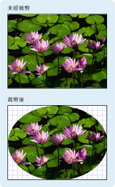

# 幾何概觀Geometry Overview
本概觀說明如何使用[!INCLUDE[TLA#tla_winclient](../../../../includes/tlasharptla-winclient-md.md)]<xref:System.Windows.Media.Geometry>類別來描繪圖形。This overview describes how to use the [!INCLUDE[TLA#tla_winclient](../../../../includes/tlasharptla-winclient-md.md)] <xref:System.Windows.Media.Geometry> classes to describe shapes. 本主題也會對照之間的差異<xref:System.Windows.Media.Geometry>物件和<xref:System.Windows.Shapes.Shape>項目。This topic also contrasts the differences between <xref:System.Windows.Media.Geometry> objects and <xref:System.Windows.Shapes.Shape> elements.  

   
## 什麼是幾何？What Is a Geometry?  
 <xref:System.Windows.Media.Geometry>類別和類別衍生，例如<xref:System.Windows.Media.EllipseGeometry>， <xref:System.Windows.Media.PathGeometry>，和<xref:System.Windows.Media.CombinedGeometry>，讓您描繪 2d 圖形的幾何。The <xref:System.Windows.Media.Geometry> class and the classes which derive from it, such as <xref:System.Windows.Media.EllipseGeometry>, <xref:System.Windows.Media.PathGeometry>, and <xref:System.Windows.Media.CombinedGeometry>, enable you to describe the geometry of a 2-D shape. 這些幾何描繪有許多用途，像是定義圖形來繪製到螢幕或定義點擊測試和裁剪區域。These geometric descriptions have many uses, such defining a shape to paint to the screen or defining hit-test and clip regions. 您甚至可以使用幾何來定義動畫路徑。You can even use a geometry to define an animation path.  
  
 <xref:System.Windows.Media.Geometry> 物件可以簡單，例如矩形和圓形或複合，建立從兩個或多個 geometry 物件。<xref:System.Windows.Media.Geometry> objects can be simple, such as rectangles and circles, or composite, created from two or more geometry objects.  使用也可以建立更複雜的幾何<xref:System.Windows.Media.PathGeometry>和<xref:System.Windows.Media.StreamGeometry>類別，可讓您描繪弧線和曲線。More complex geometries can be created by using the <xref:System.Windows.Media.PathGeometry> and <xref:System.Windows.Media.StreamGeometry> classes, which enable you to describe arcs and curves.  
  
 因為<xref:System.Windows.Media.Geometry>是一種<xref:System.Windows.Freezable>，<xref:System.Windows.Media.Geometry>物件提供數個特殊功能︰ 它們可以宣告為[資源](../advanced/xaml-resources.md)、 多個物件，成為唯讀，以改善效能，複製，在共用和變更為安全執行緒。Because a <xref:System.Windows.Media.Geometry> is a type of <xref:System.Windows.Freezable>, <xref:System.Windows.Media.Geometry> objects provide several special features: they can be declared as [resources](../advanced/xaml-resources.md), shared among multiple objects, made read-only to improve performance, cloned, and made thread-safe. 如需詳細資訊，所提供的不同功能的相關<xref:System.Windows.Freezable>物件，請參閱[Freezable 物件概觀](../advanced/freezable-objects-overview.md)。For more information about the different features provided by <xref:System.Windows.Freezable> objects, see the [Freezable Objects Overview](../advanced/freezable-objects-overview.md).  
  
   
## 幾何與圖形Geometries vs. Shapes  
 <xref:System.Windows.Media.Geometry>並<xref:System.Windows.Shapes.Shape>在於兩者都描繪 2d 圖形類別看起來很類似 (比較<xref:System.Windows.Media.EllipseGeometry>和<xref:System.Windows.Shapes.Ellipse>例如)，但有重要的差異。The <xref:System.Windows.Media.Geometry> and <xref:System.Windows.Shapes.Shape> classes seem similar in that they both describe 2-D shapes (compare <xref:System.Windows.Media.EllipseGeometry> and <xref:System.Windows.Shapes.Ellipse> for example), but there are important differences.  
  
 第一，<xref:System.Windows.Media.Geometry>類別繼承自<xref:System.Windows.Freezable>類別同時<xref:System.Windows.Shapes.Shape>類別繼承自<xref:System.Windows.FrameworkElement>。For one, the <xref:System.Windows.Media.Geometry> class inherits from the <xref:System.Windows.Freezable> class while the <xref:System.Windows.Shapes.Shape> class inherits from <xref:System.Windows.FrameworkElement>. 因為它們是項目，<xref:System.Windows.Shapes.Shape>物件可轉譯本身，並參與版面配置系統，而<xref:System.Windows.Media.Geometry>物件則否。Because they are elements, <xref:System.Windows.Shapes.Shape> objects can render themselves and participate in the layout system, while <xref:System.Windows.Media.Geometry> objects cannot.  
  
 雖然<xref:System.Windows.Shapes.Shape>物件會更容易使用比<xref:System.Windows.Media.Geometry>物件，<xref:System.Windows.Media.Geometry>物件具有更多功能。Although <xref:System.Windows.Shapes.Shape> objects are more readily usable than <xref:System.Windows.Media.Geometry> objects, <xref:System.Windows.Media.Geometry> objects are more versatile. 雖然<xref:System.Windows.Shapes.Shape>物件用來轉譯 2d 圖形<xref:System.Windows.Media.Geometry>物件可用來定義 2d 圖形的幾何區域、 定義裁剪區域或定義的區域進行點擊測試，例如。While a <xref:System.Windows.Shapes.Shape> object is used to render 2-D graphics, a <xref:System.Windows.Media.Geometry> object can be used to define the geometric region for 2-D graphics, define a region for clipping, or define a region for hit testing, for example.  
  
### 路徑圖形The Path Shape  
 一<xref:System.Windows.Shapes.Shape>，則<xref:System.Windows.Shapes.Path>類別，實際上會使用<xref:System.Windows.Media.Geometry>來描述其內容。One <xref:System.Windows.Shapes.Shape>, the <xref:System.Windows.Shapes.Path> class, actually uses a <xref:System.Windows.Media.Geometry> to describe its contents. 藉由設定<xref:System.Windows.Shapes.Path.Data%2A>屬性<xref:System.Windows.Shapes.Path>具有<xref:System.Windows.Media.Geometry>並設定其<xref:System.Windows.Shapes.Shape.Fill%2A>並<xref:System.Windows.Shapes.Shape.Stroke%2A>屬性，您可以轉譯<xref:System.Windows.Media.Geometry>。By setting the <xref:System.Windows.Shapes.Path.Data%2A> property of the <xref:System.Windows.Shapes.Path> with a <xref:System.Windows.Media.Geometry> and setting its <xref:System.Windows.Shapes.Shape.Fill%2A> and <xref:System.Windows.Shapes.Shape.Stroke%2A> properties, you can render a <xref:System.Windows.Media.Geometry>.  
  
   
## 採用幾何的通用屬性Common Properties That Take a Geometry  
 如前幾節所述，Geometry 物件可以與其他物件一起用於許多用途，例如繪製圖形、動畫以及裁剪。The preceding sections mentioned that Geometry objects can be used with other objects for a variety of purposes, such as drawing shapes, animating, and clipping. 下表列出數個類別具有採用屬性<xref:System.Windows.Media.Geometry>物件。The following table lists several classes that have properties that take a <xref:System.Windows.Media.Geometry> object.  
  
|類型Type|屬性Property|  
|----------|--------------|  
|<xref:System.Windows.Media.Animation.DoubleAnimationUsingPath>|<xref:System.Windows.Media.Animation.DoubleAnimationUsingPath.PathGeometry%2A>|  
|<xref:System.Windows.Media.DrawingGroup>|<xref:System.Windows.Media.DrawingGroup.ClipGeometry%2A>|  
|<xref:System.Windows.Media.GeometryDrawing>|<xref:System.Windows.Media.GeometryDrawing.Geometry%2A>|  
|<xref:System.Windows.Shapes.Path>|<xref:System.Windows.Shapes.Path.Data%2A>|  
|<xref:System.Windows.UIElement>|<xref:System.Windows.UIElement.Clip%2A>|  
  
   
## 簡單幾何類型Simple Geometry Types  
 所有幾何的基底類別是抽象類別<xref:System.Windows.Media.Geometry>。The base class for all geometries is the abstract class <xref:System.Windows.Media.Geometry>.  衍生自類別<xref:System.Windows.Media.Geometry>類別可大致分為三個類別： 簡單的幾何、 路徑幾何及複合幾何。The classes which derive from the <xref:System.Windows.Media.Geometry> class can be roughly grouped into three categories: simple geometries, path geometries, and composite geometries.  
  
 簡單幾何類別包括<xref:System.Windows.Media.LineGeometry>， <xref:System.Windows.Media.RectangleGeometry>，和<xref:System.Windows.Media.EllipseGeometry>，並用來建立基本的幾何圖形，例如線條、 矩形和圓形。Simple geometry classes include <xref:System.Windows.Media.LineGeometry>, <xref:System.Windows.Media.RectangleGeometry>, and <xref:System.Windows.Media.EllipseGeometry> and are used to create basic geometric shapes, such as lines, rectangles, and circles.  
  
- A<xref:System.Windows.Media.LineGeometry>定義藉由指定列和結束點的起始點。A <xref:System.Windows.Media.LineGeometry> is defined by specifying the start point of the line and the end point.  
  
- A<xref:System.Windows.Media.RectangleGeometry>定義<xref:System.Windows.Rect>結構，指定其相對位置及其高度和寬度。A <xref:System.Windows.Media.RectangleGeometry> is defined with a <xref:System.Windows.Rect> structure which specifies its relative position and its height and width. 您可以設定來建立圓角的矩形<xref:System.Windows.Media.RectangleGeometry.RadiusX%2A>和<xref:System.Windows.Media.RectangleGeometry.RadiusY%2A>屬性。You can create a rounded rectangle by setting the <xref:System.Windows.Media.RectangleGeometry.RadiusX%2A> and <xref:System.Windows.Media.RectangleGeometry.RadiusY%2A> properties.  
  
- <xref:System.Windows.Media.EllipseGeometry>由中心點、 x 半徑和 y 半徑。An <xref:System.Windows.Media.EllipseGeometry> is defined by a center point, an x-radius and a y-radius.  下列範例示範如何建立簡單的幾何以用於轉譯和裁剪。The following examples show how to create simple geometries for rendering and for clipping.  
  
 這些相同的圖形，以及更複雜的圖形，您可以使用建立<xref:System.Windows.Media.PathGeometry>或藉由合併幾何物件，但這些類別提供簡單的方式來產生這些基本的幾何圖形。These same shapes, as well as more complex shapes, can be created using a <xref:System.Windows.Media.PathGeometry> or by combining geometry objects together, but these classes provide a simpler means for producing these basic geometric shapes.  
  
 下列範例示範如何建立和轉譯<xref:System.Windows.Media.LineGeometry>。The following example shows how to create and render a <xref:System.Windows.Media.LineGeometry>.  如先前所述<xref:System.Windows.Media.Geometry>物件是無法繪製本身，所以此範例會使用<xref:System.Windows.Shapes.Path>圖形來轉譯線條。As noted previously, a <xref:System.Windows.Media.Geometry> object is unable to draw itself, so the example uses a <xref:System.Windows.Shapes.Path> shape to render the line.  由於線條沒有不含區域，設定<xref:System.Windows.Shapes.Shape.Fill%2A>的屬性<xref:System.Windows.Shapes.Path>會有任何作用; 相反地，只有<xref:System.Windows.Shapes.Shape.Stroke%2A>和<xref:System.Windows.Shapes.Shape.StrokeThickness%2A>指定屬性。Because a line has no area, setting the <xref:System.Windows.Shapes.Shape.Fill%2A> property of the <xref:System.Windows.Shapes.Path> would have no effect; instead, only the <xref:System.Windows.Shapes.Shape.Stroke%2A> and <xref:System.Windows.Shapes.Shape.StrokeThickness%2A> properties are specified. 下圖顯示範例的輸出。The following illustration shows the output from the example.  
  
   
從 (10,20) 繪製到 (100,130) 的 LineGeometryA LineGeometry drawn from (10,20) to (100,130)  
  
 [!code-xaml[GeometryOverviewSamples_snip#GraphicsMMLineGeometryExample](~/samples/snippets/csharp/VS_Snippets_Wpf/GeometryOverviewSamples_snip/CS/GeometryExamples.xaml#graphicsmmlinegeometryexample)]  
  
 [!code-csharp[GeometryOverviewSamples_procedural_snip#GraphicsMMLineGeometryExample](~/samples/snippets/csharp/VS_Snippets_Wpf/GeometryOverviewSamples_procedural_snip/CSharp/GeometryExamples.cs#graphicsmmlinegeometryexample)]
 [!code-vb[GeometryOverviewSamples_procedural_snip#GraphicsMMLineGeometryExample](~/samples/snippets/visualbasic/VS_Snippets_Wpf/GeometryOverviewSamples_procedural_snip/visualbasic/geometryexamples.vb#graphicsmmlinegeometryexample)]  
  
 下一個範例示範如何建立和轉譯<xref:System.Windows.Media.EllipseGeometry>。The next example shows how to create and render an <xref:System.Windows.Media.EllipseGeometry>.  範例集合<xref:System.Windows.Media.EllipseGeometry.Center%2A>的<xref:System.Windows.Media.EllipseGeometry>設為點`50,50`和半徑 x 和 y 半徑都設定為`50`，可建立直徑為 100 的圓形。The examples sets the <xref:System.Windows.Media.EllipseGeometry.Center%2A> of the <xref:System.Windows.Media.EllipseGeometry> is set to the point `50,50` and the x-radius and the y-radius are both set to `50`, which creates a circle with a diameter of 100.  在此情況下將值指派給路徑元素的填滿屬性，用於繪製橢圓形內部<xref:System.Windows.Media.Brushes.Gold%2A>。The interior of the ellipse is painted by assigning a value to the Path element's Fill property, in this case <xref:System.Windows.Media.Brushes.Gold%2A>. 下圖顯示範例的輸出。The following illustration shows the output from the example.  
  
   
在 (50,50) 繪製的 EllipseGeometryAn EllipseGeometry drawn at (50,50)  
  
 [!code-xaml[GeometryOverviewSamples_snip#GraphicsMMEllipseGeometryExample](~/samples/snippets/csharp/VS_Snippets_Wpf/GeometryOverviewSamples_snip/CS/GeometryExamples.xaml#graphicsmmellipsegeometryexample)]  
  
 [!code-csharp[GeometryOverviewSamples_procedural_snip#GraphicsMMEllipseGeometryExample](~/samples/snippets/csharp/VS_Snippets_Wpf/GeometryOverviewSamples_procedural_snip/CSharp/GeometryExamples.cs#graphicsmmellipsegeometryexample)]
 [!code-vb[GeometryOverviewSamples_procedural_snip#GraphicsMMEllipseGeometryExample](~/samples/snippets/visualbasic/VS_Snippets_Wpf/GeometryOverviewSamples_procedural_snip/visualbasic/geometryexamples.vb#graphicsmmellipsegeometryexample)]  
  
 下列範例示範如何建立和轉譯<xref:System.Windows.Media.RectangleGeometry>。The following example shows how to create and render a <xref:System.Windows.Media.RectangleGeometry>.  所定義的位置和維度的矩形<xref:System.Windows.Rect>結構。The position and the dimensions of the rectangle are defined by a <xref:System.Windows.Rect> structure. 這個位置是`50,50`，而高度和寬度都是 `25`，可建立一個正方形。The position is `50,50` and the height and width are both `25`, which creates a square. 下圖顯示範例的輸出。The following illustration shows the output from the example.  
  
   
在 50,50 繪製的 RectangleGeometryA RectangleGeometry drawn at 50,50  
  
 [!code-xaml[GeometryOverviewSamples_snip#GraphicsMMRectangleGeometryExample](~/samples/snippets/csharp/VS_Snippets_Wpf/GeometryOverviewSamples_snip/CS/GeometryExamples.xaml#graphicsmmrectanglegeometryexample)]  
  
 [!code-csharp[GeometryOverviewSamples_procedural_snip#GraphicsMMRectangleGeometryExample](~/samples/snippets/csharp/VS_Snippets_Wpf/GeometryOverviewSamples_procedural_snip/CSharp/GeometryExamples.cs#graphicsmmrectanglegeometryexample)]
 [!code-vb[GeometryOverviewSamples_procedural_snip#GraphicsMMRectangleGeometryExample](~/samples/snippets/visualbasic/VS_Snippets_Wpf/GeometryOverviewSamples_procedural_snip/visualbasic/geometryexamples.vb#graphicsmmrectanglegeometryexample)]  
  
 下列範例示範如何使用<xref:System.Windows.Media.EllipseGeometry>為影像的裁剪區域。The following example shows how to use an <xref:System.Windows.Media.EllipseGeometry> as the clip region for an image.  <xref:System.Windows.Controls.Image>物件定義的<xref:System.Windows.FrameworkElement.Width%2A>為 200 和<xref:System.Windows.FrameworkElement.Height%2A>150 個。An <xref:System.Windows.Controls.Image> object is defined with a <xref:System.Windows.FrameworkElement.Width%2A> of 200 and a <xref:System.Windows.FrameworkElement.Height%2A> of 150.  <xref:System.Windows.Media.EllipseGeometry>具有<xref:System.Windows.Media.EllipseGeometry.RadiusX%2A>值為 100，<xref:System.Windows.Media.EllipseGeometry.RadiusY%2A>值為 75，和<xref:System.Windows.Media.EllipseGeometry.Center%2A>100,75 的值設定為<xref:System.Windows.UIElement.Clip%2A>映像的屬性。An <xref:System.Windows.Media.EllipseGeometry> with a <xref:System.Windows.Media.EllipseGeometry.RadiusX%2A> value of 100, a <xref:System.Windows.Media.EllipseGeometry.RadiusY%2A> value of 75, and a <xref:System.Windows.Media.EllipseGeometry.Center%2A> value of 100,75 is set to the <xref:System.Windows.UIElement.Clip%2A> property of the image.  只有橢圓形區域內的影像部分才會顯示。Only the part of the image that is within the area of the ellipse will be displayed. 下圖顯示範例的輸出。The following illustration shows the output from the example.  
  
   
用來裁剪影像控制項的 EllipseGeometryAn EllipseGeometry used to clip an Image control  
  
 [!code-xaml[GeometryOverviewSamples_snip#GraphicsMMImageClipGeometryExample](~/samples/snippets/csharp/VS_Snippets_Wpf/GeometryOverviewSamples_snip/CS/GeometryExamples.xaml#graphicsmmimageclipgeometryexample)]  
  
 [!code-csharp[GeometryOverviewSamples_procedural_snip#GraphicsMMImageClipGeometryExample](~/samples/snippets/csharp/VS_Snippets_Wpf/GeometryOverviewSamples_procedural_snip/CSharp/GeometryExamples.cs#graphicsmmimageclipgeometryexample)]
 [!code-vb[GeometryOverviewSamples_procedural_snip#GraphicsMMImageClipGeometryExample](~/samples/snippets/visualbasic/VS_Snippets_Wpf/GeometryOverviewSamples_procedural_snip/visualbasic/geometryexamples.vb#graphicsmmimageclipgeometryexample)]  
  
   
## 路徑幾何Path Geometries  
 <xref:System.Windows.Media.PathGeometry>類別和其輕量級對等項目，<xref:System.Windows.Media.StreamGeometry>類別中，提供方法來描繪多個複雜形狀組成的弧線、 曲線和線條。The <xref:System.Windows.Media.PathGeometry> class and its light-weight equivalent, the <xref:System.Windows.Media.StreamGeometry> class, provide the means to describe multiple complex figures composed of arcs, curves, and lines.  
  
 核心<xref:System.Windows.Media.PathGeometry>是一堆<xref:System.Windows.Media.PathFigure>物件，如此命名是因為每個圖表都會描述中的特定圖形<xref:System.Windows.Media.PathGeometry>。At the heart of a <xref:System.Windows.Media.PathGeometry> is a collection of <xref:System.Windows.Media.PathFigure> objects, so named because each figure describes a discrete shape in the <xref:System.Windows.Media.PathGeometry>. 每個<xref:System.Windows.Media.PathFigure>本身包含一或多個<xref:System.Windows.Media.PathSegment>物件，其中每個描述圖的區段。Each <xref:System.Windows.Media.PathFigure> is itself comprised of one or more <xref:System.Windows.Media.PathSegment> objects, each of which describes a segment of the figure.  
  
 區段的類型繁多。There are many types of segments.  
  
|區段類型Segment Type|描述Description|範例Example|  
|------------------|-----------------|-------------|  
|<xref:System.Windows.Media.ArcSegment>|在兩個點之間建立橢圓形弧線。Creates an elliptical arc between two points.|[建立橢圓形弧線](how-to-create-an-elliptical-arc.md)。[Create an Elliptical Arc](how-to-create-an-elliptical-arc.md).|  
|<xref:System.Windows.Media.BezierSegment>|在兩個點之間建立三次方貝茲曲線。Creates a cubic Bezier curve between two points.|[建立三次方貝茲曲線](how-to-create-a-cubic-bezier-curve.md)。[Create a Cubic Bezier Curve](how-to-create-a-cubic-bezier-curve.md).|  
|<xref:System.Windows.Media.LineSegment>|在兩個點之間建立線條。Creates a line between two points.|[在 PathGeometry 中建立 LineSegmentCreate a LineSegment in a PathGeometry](how-to-create-a-linesegment-in-a-pathgeometry.md)|  
|<xref:System.Windows.Media.PolyBezierSegment>|建立一系列三次方貝茲曲線。Creates a series of cubic Bezier curves.|請參閱<xref:System.Windows.Media.PolyBezierSegment>類型 頁面。See the <xref:System.Windows.Media.PolyBezierSegment> type page.|  
|<xref:System.Windows.Media.PolyLineSegment>|建立一系列的線條。Creates a series of lines.|請參閱<xref:System.Windows.Media.PolyLineSegment>類型 頁面。See the <xref:System.Windows.Media.PolyLineSegment> type page.|  
|<xref:System.Windows.Media.PolyQuadraticBezierSegment>|建立一系列二次方貝茲曲線。Creates a series of quadratic Bezier curves.|請參閱<xref:System.Windows.Media.PolyQuadraticBezierSegment>頁面。See the <xref:System.Windows.Media.PolyQuadraticBezierSegment> page.|  
|<xref:System.Windows.Media.QuadraticBezierSegment>|建立二次方貝茲曲線。Creates a quadratic Bezier curve.|[建立二次方貝茲曲線](how-to-create-a-quadratic-bezier-curve.md)。[Create a Quadratic Bezier Curve](how-to-create-a-quadratic-bezier-curve.md).|  
  
 內的區段<xref:System.Windows.Media.PathFigure>會結合成單一幾何圖形，每個區段的下一個區段的起始點的結束點。The segments within a <xref:System.Windows.Media.PathFigure> are combined into a single geometric shape with the end point of each segment being the start point of the next segment. <xref:System.Windows.Media.PathFigure.StartPoint%2A>屬性<xref:System.Windows.Media.PathFigure>指定從中繪製的第一個區段的點。The <xref:System.Windows.Media.PathFigure.StartPoint%2A> property of a <xref:System.Windows.Media.PathFigure> specifies the point from which the first segment is drawn. 每個後續區段都會從前一個區段的結束點開始。Each subsequent segment starts at the end point of the previous segment. 比方說，從垂直線`10,50`要`10,150`可以藉由設定定義<xref:System.Windows.Media.PathFigure.StartPoint%2A>屬性設`10,50`並建立<xref:System.Windows.Media.LineSegment>與<xref:System.Windows.Media.LineSegment.Point%2A>屬性設定`10,150`。For example, a vertical line from `10,50` to `10,150` can be defined by setting the <xref:System.Windows.Media.PathFigure.StartPoint%2A> property to `10,50` and creating a <xref:System.Windows.Media.LineSegment> with a <xref:System.Windows.Media.LineSegment.Point%2A> property setting of `10,150`.  
  
 下列範例會建立簡易<xref:System.Windows.Media.PathGeometry>組成單一<xref:System.Windows.Media.PathFigure>具有<xref:System.Windows.Media.LineSegment>，並顯示使用<xref:System.Windows.Shapes.Path>項目。The following example creates a simple <xref:System.Windows.Media.PathGeometry> comprised of a single <xref:System.Windows.Media.PathFigure> with a <xref:System.Windows.Media.LineSegment> and displays it using a <xref:System.Windows.Shapes.Path> element. <xref:System.Windows.Media.PathFigure>物件的<xref:System.Windows.Media.PathFigure.StartPoint%2A>設為`10,20`並<xref:System.Windows.Media.LineSegment>的結束點定義`100,130`。The <xref:System.Windows.Media.PathFigure> object's <xref:System.Windows.Media.PathFigure.StartPoint%2A> is set to `10,20` and a <xref:System.Windows.Media.LineSegment> is defined with an end point of `100,130`. 下圖顯示<xref:System.Windows.Media.PathGeometry>此範例所建立。The following illustration shows the <xref:System.Windows.Media.PathGeometry> created by this example.  
  
   
包含單一 LineSegment 的 PathGeometryA PathGeometry that contains a single LineSegment  
  
 [!code-xaml[GeometryOverviewSamples_snip#GraphicsMMPathGeometryLineExample](~/samples/snippets/csharp/VS_Snippets_Wpf/GeometryOverviewSamples_snip/CS/GeometryExamples.xaml#graphicsmmpathgeometrylineexample)]  
  
 [!code-csharp[GeometryOverviewSamples_procedural_snip#GraphicsMMPathGeometryLineExample](~/samples/snippets/csharp/VS_Snippets_Wpf/GeometryOverviewSamples_procedural_snip/CSharp/GeometryExamples.cs#graphicsmmpathgeometrylineexample)]
 [!code-vb[GeometryOverviewSamples_procedural_snip#GraphicsMMPathGeometryLineExample](~/samples/snippets/visualbasic/VS_Snippets_Wpf/GeometryOverviewSamples_procedural_snip/visualbasic/geometryexamples.vb#graphicsmmpathgeometrylineexample)]  
  
 值得對照此範例中的使用上述<xref:System.Windows.Media.LineGeometry>範例。It is worth contrasting this example with the preceding <xref:System.Windows.Media.LineGeometry> example.  所使用的語法<xref:System.Windows.Media.PathGeometry>會比使用簡單的更詳細<xref:System.Windows.Media.LineGeometry>，並可能比較合理使用<xref:System.Windows.Media.LineGeometry>類別，在此情況下，但冗長的語法的<xref:System.Windows.Media.PathGeometry>允許非常錯綜複雜又複雜幾何區域。The syntax used for a <xref:System.Windows.Media.PathGeometry> is much more verbose than that used for a simple <xref:System.Windows.Media.LineGeometry>, and it may make more sense to use the <xref:System.Windows.Media.LineGeometry> class in this case, but the verbose syntax of the <xref:System.Windows.Media.PathGeometry> allows for extremely intricate and complex geometric regions.  
  
 可以使用的組合來建立更複雜的幾何<xref:System.Windows.Media.PathSegment>物件。More complex geometries can be created by using a combination of <xref:System.Windows.Media.PathSegment> objects.  
  
 下一個範例會使用<xref:System.Windows.Media.BezierSegment>，則<xref:System.Windows.Media.LineSegment>，和<xref:System.Windows.Media.ArcSegment>來建立圖形。The next example uses a <xref:System.Windows.Media.BezierSegment>, a <xref:System.Windows.Media.LineSegment>, and an <xref:System.Windows.Media.ArcSegment> to create shape. 此範例首先會建立三次方貝茲曲線是藉由定義四個點： 起始點，也就是上一個區段，也就是結束點的結束點 (<xref:System.Windows.Media.BezierSegment.Point3%2A>)，和兩個控制點 (<xref:System.Windows.Media.BezierSegment.Point1%2A>和<xref:System.Windows.Media.BezierSegment.Point2%2A>)。The example first creates a cubic Bezier curve is by defining four points: a start point, which is the end point of the previous segment, an end point (<xref:System.Windows.Media.BezierSegment.Point3%2A>), and two control points (<xref:System.Windows.Media.BezierSegment.Point1%2A> and <xref:System.Windows.Media.BezierSegment.Point2%2A>).  三次方貝茲曲線的兩個控制點作用類似磁鐵，吸引原本為直線的部分，產生曲線。The two control points of a cubic Bezier curve behave like magnets, attracting portions of what would otherwise be a straight line towards themselves, producing a curve. 第一個控制點<xref:System.Windows.Media.BezierSegment.Point1%2A>，會影響開頭曲線部分; 第二個控制點， <xref:System.Windows.Media.BezierSegment.Point2%2A>，會影響曲線的結束部分。The first control point, <xref:System.Windows.Media.BezierSegment.Point1%2A>, affects the beginning portion of the curve; the second control point, <xref:System.Windows.Media.BezierSegment.Point2%2A>, affects the ending portion of the curve.  
  
 範例接著會新增<xref:System.Windows.Media.LineSegment>，其中前一個結束點之間繪製<xref:System.Windows.Media.BezierSegment>，以指定的點前面有其<xref:System.Windows.Media.LineSegment>屬性。The example then adds a <xref:System.Windows.Media.LineSegment>, which is drawn between the end point of the preceding <xref:System.Windows.Media.BezierSegment> that preceded it to the point specified by its <xref:System.Windows.Media.LineSegment> property.  
  
 範例接著會新增<xref:System.Windows.Media.ArcSegment>，這會從先前的結束點繪製<xref:System.Windows.Media.LineSegment>所指定的點至其<xref:System.Windows.Media.ArcSegment.Point%2A>屬性。The example then adds an <xref:System.Windows.Media.ArcSegment>, which is drawn from the end point of the preceding <xref:System.Windows.Media.LineSegment> to the point specified by its <xref:System.Windows.Media.ArcSegment.Point%2A> property. 此範例也會指定弧線的 x 半徑和 y-(<xref:System.Windows.Media.ArcSegment.Size%2A>)，旋轉角度 (<xref:System.Windows.Media.ArcSegment.RotationAngle%2A>)、 旗標，指出所產生弧線角度應該多大 (<xref:System.Windows.Media.ArcSegment.IsLargeArc%2A>)，以及指出繪製弧形方向的值 (<xref:System.Windows.Media.ArcSegment.SweepDirection%2A>).The example also specifies the arc's x- and y-radius (<xref:System.Windows.Media.ArcSegment.Size%2A>), a rotation angle (<xref:System.Windows.Media.ArcSegment.RotationAngle%2A>), a flag indicating how large the angle of the resulting arc should be (<xref:System.Windows.Media.ArcSegment.IsLargeArc%2A>), and a value indicating in which direction the arc is drawn (<xref:System.Windows.Media.ArcSegment.SweepDirection%2A>). 下圖顯示此範例所建立的圖形。The following illustration shows the shape created by this example.  
  
   
PathGeometryA PathGeometry  
  
 [!code-xaml[GeometryOverviewSamples_snip#GraphicsMMPathGeometryComplexExample](~/samples/snippets/csharp/VS_Snippets_Wpf/GeometryOverviewSamples_snip/CS/GeometryExamples.xaml#graphicsmmpathgeometrycomplexexample)]  
  
 [!code-csharp[GeometryOverviewSamples_procedural_snip#GraphicsMMPathGeometryComplexExample](~/samples/snippets/csharp/VS_Snippets_Wpf/GeometryOverviewSamples_procedural_snip/CSharp/GeometryExamples.cs#graphicsmmpathgeometrycomplexexample)]
 [!code-vb[GeometryOverviewSamples_procedural_snip#GraphicsMMPathGeometryComplexExample](~/samples/snippets/visualbasic/VS_Snippets_Wpf/GeometryOverviewSamples_procedural_snip/visualbasic/geometryexamples.vb#graphicsmmpathgeometrycomplexexample)]  
  
 使用多個也可以建立更複雜的幾何<xref:System.Windows.Media.PathFigure>物件內<xref:System.Windows.Media.PathGeometry>。Even more complex geometries can be created by using multiple <xref:System.Windows.Media.PathFigure> objects within a <xref:System.Windows.Media.PathGeometry>.  
  
 下列範例會建立<xref:System.Windows.Media.PathGeometry>具有兩個<xref:System.Windows.Media.PathFigure>物件，其中每一個包含多個<xref:System.Windows.Media.PathSegment>物件。The following example creates a <xref:System.Windows.Media.PathGeometry> with two <xref:System.Windows.Media.PathFigure> objects, each of which contains multiple <xref:System.Windows.Media.PathSegment> objects.  <xref:System.Windows.Media.PathFigure>從上述範例中，<xref:System.Windows.Media.PathFigure>具有<xref:System.Windows.Media.PolyLineSegment>和<xref:System.Windows.Media.QuadraticBezierSegment>使用。The <xref:System.Windows.Media.PathFigure> from the above example and a <xref:System.Windows.Media.PathFigure> with a <xref:System.Windows.Media.PolyLineSegment> and a <xref:System.Windows.Media.QuadraticBezierSegment> are used.  A<xref:System.Windows.Media.PolyLineSegment>定義的點陣列和<xref:System.Windows.Media.QuadraticBezierSegment>定義一個控制點和結束點。A <xref:System.Windows.Media.PolyLineSegment> is defined with an array of points and the <xref:System.Windows.Media.QuadraticBezierSegment> is defined with a control point and an end point. 下圖顯示此範例所建立的圖形。The following illustration shows the shape created by this example.  
  
   
有多個圖形的 PathGeometryA PathGeometry with multiple figures  
  
 [!code-xaml[GeometryOverviewSamples_snip#GraphicsMMPathGeometryComplexMultiExample](~/samples/snippets/csharp/VS_Snippets_Wpf/GeometryOverviewSamples_snip/CS/GeometryExamples.xaml#graphicsmmpathgeometrycomplexmultiexample)]  
  
 [!code-csharp[GeometryOverviewSamples_procedural_snip#GraphicsMMPathGeometryComplexMultiExample](~/samples/snippets/csharp/VS_Snippets_Wpf/GeometryOverviewSamples_procedural_snip/CSharp/GeometryExamples.cs#graphicsmmpathgeometrycomplexmultiexample)]
 [!code-vb[GeometryOverviewSamples_procedural_snip#GraphicsMMPathGeometryComplexMultiExample](~/samples/snippets/visualbasic/VS_Snippets_Wpf/GeometryOverviewSamples_procedural_snip/visualbasic/geometryexamples.vb#graphicsmmpathgeometrycomplexmultiexample)]  
  
### StreamGeometryStreamGeometry  
 像是<xref:System.Windows.Media.PathGeometry>類別，<xref:System.Windows.Media.StreamGeometry>定義可能包含曲線、 弧線和線條的複雜幾何圖形。Like the <xref:System.Windows.Media.PathGeometry> class, a <xref:System.Windows.Media.StreamGeometry> defines a complex geometric shape that may contain curves, arcs, and lines. 不同於<xref:System.Windows.Media.PathGeometry>，內容<xref:System.Windows.Media.StreamGeometry>不支援資料繫結、 動畫或修改。Unlike a <xref:System.Windows.Media.PathGeometry>, the contents of a  <xref:System.Windows.Media.StreamGeometry> do not support data binding, animation, or modification. 使用<xref:System.Windows.Media.StreamGeometry>當您需要描繪複雜幾何，但不是想資料繫結、 動畫或修改的額外負荷。Use a <xref:System.Windows.Media.StreamGeometry> when you need to describe a complex geometry but do not want the overhead of supporting data binding, animation, or modification. 其效率，因為<xref:System.Windows.Media.StreamGeometry>類別是不錯的選擇來描繪裝飾項。Because of its efficiency, the <xref:System.Windows.Media.StreamGeometry> class is a good choice for describing adorners.  
  
 如需範例，請參閱[使用 StreamGeometry 建立圖形](how-to-create-a-shape-using-a-streamgeometry.md)。For an example, see [Create a Shape Using a StreamGeometry](how-to-create-a-shape-using-a-streamgeometry.md).  
  
### 路徑標記語法Path Markup Syntax  
 <xref:System.Windows.Media.PathGeometry>並<xref:System.Windows.Media.StreamGeometry>類型支援[!INCLUDE[TLA#tla_xaml](../../../../includes/tlasharptla-xaml-md.md)]屬性語法使用特殊的一系列移動和繪製命令。The <xref:System.Windows.Media.PathGeometry> and <xref:System.Windows.Media.StreamGeometry> types support a [!INCLUDE[TLA#tla_xaml](../../../../includes/tlasharptla-xaml-md.md)] attribute syntax using a special series of move and draw commands. 如需詳細資訊，請參閱[路徑標記語法](path-markup-syntax.md)。For more information, see [Path Markup Syntax](path-markup-syntax.md).  
  
   
## 複合幾何Composite Geometries  
 複合幾何物件可以使用建立<xref:System.Windows.Media.GeometryGroup>，則<xref:System.Windows.Media.CombinedGeometry>，或藉由呼叫靜態<xref:System.Windows.Media.Geometry>方法<xref:System.Windows.Media.Geometry.Combine%2A>。Composite geometry objects can be created using a <xref:System.Windows.Media.GeometryGroup>, a <xref:System.Windows.Media.CombinedGeometry>, or by calling the static <xref:System.Windows.Media.Geometry> method <xref:System.Windows.Media.Geometry.Combine%2A>.  
  
- <xref:System.Windows.Media.CombinedGeometry>物件和<xref:System.Windows.Media.Geometry.Combine%2A>方法執行布林作業來結合兩個幾何所定義的區域。The <xref:System.Windows.Media.CombinedGeometry> object and the <xref:System.Windows.Media.Geometry.Combine%2A> method performs a Boolean operation to combine the area defined by two geometries. <xref:System.Windows.Media.Geometry> 不含任何區域的物件會被捨棄。<xref:System.Windows.Media.Geometry> objects that have no area are discarded. 只有兩個<xref:System.Windows.Media.Geometry>（雖然這兩個幾何也可能是複合幾何），就可以合併物件。Only two <xref:System.Windows.Media.Geometry> objects can be combined (although these two geometries may also be composite geometries).  
  
- <xref:System.Windows.Media.GeometryGroup>類別會建立，就可以合併<xref:System.Windows.Media.Geometry>物件包含不需要合併其區域。The <xref:System.Windows.Media.GeometryGroup> class creates an amalgamation of the <xref:System.Windows.Media.Geometry> objects it contains without combining their area. 任意數目的<xref:System.Windows.Media.Geometry>可以將物件加入至<xref:System.Windows.Media.GeometryGroup>。Any number of <xref:System.Windows.Media.Geometry> objects can be added to a <xref:System.Windows.Media.GeometryGroup>. 如需範例，請參閱[建立複合圖案](how-to-create-a-composite-shape.md)。For an example, see [Create a Composite Shape](how-to-create-a-composite-shape.md).  
  
 由於它們不會執行合併作業，使用<xref:System.Windows.Media.GeometryGroup>物件提供的效能優於<xref:System.Windows.Media.CombinedGeometry>物件或<xref:System.Windows.Media.Geometry.Combine%2A>方法。Because they do not perform a combine operation, using <xref:System.Windows.Media.GeometryGroup> objects provides performance benefits over using <xref:System.Windows.Media.CombinedGeometry> objects or the <xref:System.Windows.Media.Geometry.Combine%2A> method.  
  
   
## 合併幾何Combined Geometries  
 上一節所述<xref:System.Windows.Media.CombinedGeometry>物件和<xref:System.Windows.Media.Geometry.Combine%2A>方法合併其包含的幾何所定義的區域。The preceding section mentioned the <xref:System.Windows.Media.CombinedGeometry> object and the <xref:System.Windows.Media.Geometry.Combine%2A> method combine the area defined by the geometries they contain. <xref:System.Windows.Media.GeometryCombineMode>列舉會指定如何合併幾何。The <xref:System.Windows.Media.GeometryCombineMode> enumeration specifies how the geometries are combined. 可能值<xref:System.Windows.Media.CombinedGeometry.GeometryCombineMode%2A>屬性： <xref:System.Windows.Media.GeometryCombineMode.Union>， <xref:System.Windows.Media.GeometryCombineMode.Intersect>， <xref:System.Windows.Media.GeometryCombineMode.Exclude>，和<xref:System.Windows.Media.GeometryCombineMode.Xor>。The possible values for the <xref:System.Windows.Media.CombinedGeometry.GeometryCombineMode%2A> property are: <xref:System.Windows.Media.GeometryCombineMode.Union>, <xref:System.Windows.Media.GeometryCombineMode.Intersect>, <xref:System.Windows.Media.GeometryCombineMode.Exclude>, and <xref:System.Windows.Media.GeometryCombineMode.Xor>.  
  
 在下列範例中，<xref:System.Windows.Media.CombinedGeometry>定義使用 Union 合併模式。In the following example, a <xref:System.Windows.Media.CombinedGeometry> is defined with a combine mode of Union.  兩者<xref:System.Windows.Media.CombinedGeometry.Geometry1%2A>而<xref:System.Windows.Media.CombinedGeometry.Geometry2%2A>定義為圓形的半徑相同，但中心位移 50。Both <xref:System.Windows.Media.CombinedGeometry.Geometry1%2A> and the <xref:System.Windows.Media.CombinedGeometry.Geometry2%2A> are defined as circles of the same radius, but with centers offset by 50.  
  
 [!code-xaml[GeometrySample#23](~/samples/snippets/csharp/VS_Snippets_Wpf/GeometrySample/CS/combininggeometriesexample.xaml#23)]  
  
   
  
 在下列範例中，<xref:System.Windows.Media.CombinedGeometry>定義的合併模式<xref:System.Windows.Media.GeometryCombineMode.Xor>。In the following example, a <xref:System.Windows.Media.CombinedGeometry> is defined with a combine mode of <xref:System.Windows.Media.GeometryCombineMode.Xor>.  兩者<xref:System.Windows.Media.CombinedGeometry.Geometry1%2A>而<xref:System.Windows.Media.CombinedGeometry.Geometry2%2A>定義為圓形的半徑相同，但中心位移 50。Both <xref:System.Windows.Media.CombinedGeometry.Geometry1%2A> and the <xref:System.Windows.Media.CombinedGeometry.Geometry2%2A> are defined as circles of the same radius, but with centers offset by 50.  
  
 [!code-xaml[GeometrySample#24](~/samples/snippets/csharp/VS_Snippets_Wpf/GeometrySample/CS/combininggeometriesexample.xaml#24)]  
  
   
  
 如需其他範例，請參閱[建立複合圖案](how-to-create-a-composite-shape.md)和[建立合併幾何](how-to-create-a-combined-geometry.md)。For additional examples, see [Create a Composite Shape](how-to-create-a-composite-shape.md) and [Create a Combined Geometry](how-to-create-a-combined-geometry.md).  
  
   
## Freezable 功能Freezable Features  
 因為它繼承自<xref:System.Windows.Freezable>類別，<xref:System.Windows.Media.Geometry>類別提供數個特殊功能︰<xref:System.Windows.Media.Geometry>物件可以宣告為[XAML 資源](../advanced/xaml-resources.md)、 多個物件，成為唯讀，以改善在共用效能、 複製，並變更為安全執行緒。Because it inherits from the <xref:System.Windows.Freezable> class, the <xref:System.Windows.Media.Geometry> class  provide several special features: <xref:System.Windows.Media.Geometry> objects can be declared as [XAML Resources](../advanced/xaml-resources.md), shared among multiple objects, made read-only to improve performance, cloned, and made thread-safe. 如需詳細資訊，所提供的不同功能的相關<xref:System.Windows.Freezable>物件，請參閱[Freezable 物件概觀](../advanced/freezable-objects-overview.md)。For more information about the different features provided by <xref:System.Windows.Freezable> objects, see the [Freezable Objects Overview](../advanced/freezable-objects-overview.md).  
  
   
## 其他幾何功能Other Geometry Features  
 <xref:System.Windows.Media.Geometry>類別也會提供實用的公用程式方法，如下所示：The <xref:System.Windows.Media.Geometry> class also provides useful utility methods, such as the following:  
  
- <xref:System.Windows.Media.Geometry.GetArea%2A> -取得區域<xref:System.Windows.Media.Geometry>。<xref:System.Windows.Media.Geometry.GetArea%2A> - Gets the area of the <xref:System.Windows.Media.Geometry>.  
  
- <xref:System.Windows.Media.Geometry.FillContains%2A> -判斷幾何是否包含另一個<xref:System.Windows.Media.Geometry>。<xref:System.Windows.Media.Geometry.FillContains%2A> - Determines whether the Geometry contains another <xref:System.Windows.Media.Geometry>.  
  
- <xref:System.Windows.Media.Geometry.StrokeContains%2A> -決定是否筆劃的<xref:System.Windows.Media.Geometry>包含指定的點。<xref:System.Windows.Media.Geometry.StrokeContains%2A> - Determines whether the stroke of a <xref:System.Windows.Media.Geometry> contains a specified point.  
  
 請參閱<xref:System.Windows.Media.Geometry>類別及其方法的完整清單。See the <xref:System.Windows.Media.Geometry> class for a complete listing of its methods.  
  
## 另請參閱See also

- <xref:System.Windows.Media.Geometry>
- <xref:System.Windows.Media.PathGeometry>
- <xref:System.Windows.Shapes.Path>
- <xref:System.Windows.Media.GeometryDrawing>
- [2D 圖形和影像處理2D Graphics and Imaging](../advanced/optimizing-performance-2d-graphics-and-imaging.md)
- [路徑標記語法Path Markup Syntax](path-markup-syntax.md)
- [HOW-TO 主題How-to Topics](geometries-how-to-topics.md)
- [動畫概觀Animation Overview](animation-overview.md)
- [WPF 中圖案和基本繪圖概觀Shapes and Basic Drawing in WPF Overview](shapes-and-basic-drawing-in-wpf-overview.md)
- [繪圖物件概觀Drawing Objects Overview](drawing-objects-overview.md)
