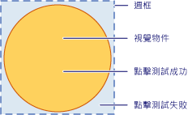
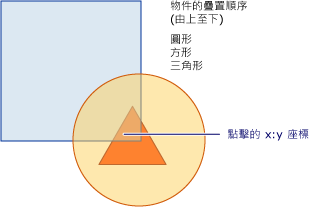

# 視覺分層中的點擊測試
本主題概要說明視覺分層所提供的點擊測試 \(Hit Testing\) 功能。  點擊測試支援可讓您判斷幾何圖案或點值是否在 <xref:System.Windows.Media.Visual> 的呈現內容範圍內，使您可以實作使用者介面行為 \(例如選取矩形\) 來選取多個物件。  
  
   
  
   
## 點擊測試案例  
 <xref:System.Windows.UIElement> 類別提供 <xref:System.Windows.UIElement.InputHitTest%2A> 方法，使您可以使用指定的座標值對項目進行點擊測試。  在許多情況下，<xref:System.Windows.UIElement.InputHitTest%2A> 方法都可提供實作項目點擊測試所需的功能。  不過，在某些案例中，您可能必須在視覺分層上實作點擊測試。  
  
-   對非 <xref:System.Windows.UIElement> 物件執行點擊測試：如果您對非 <xref:System.Windows.UIElement> 物件 \(例如 <xref:System.Windows.Media.DrawingVisual> 或圖形物件\) 進行點擊測試，便適用這種情況。  
  
-   使用幾何進行點擊測試：如果您需要使用幾何物件而非點座標值進行點擊測試，便適用這種情況。  
  
-   對多個物件執行點擊測試：當您需要對多個物件 \(例如重疊的物件\) 進行點擊測試時，便適用這種情況。  您可以取得與幾何或點交集之所有視覺項目的結果，而不只是第一個視覺項目。  
  
-   忽略 <xref:System.Windows.UIElement> 點擊測試原則：當您需要忽略 <xref:System.Windows.UIElement> 點擊測試原則時，便適用這種情況；此原則會考量項目是否已停用或不可見之類的因素。  
  
> [!NOTE]
>  如需說明視覺分層點擊測試的完整程式碼範例，請參閱[使用 DrawingVisual 進行點擊測試範例](http://go.microsoft.com/fwlink/?LinkID=159994) \(英文\) 和[使用 Win32 互通性進行點擊測試範例](http://go.microsoft.com/fwlink/?LinkID=159995) \(英文\)。  
  
   
## 點擊測試支援  
 在 <xref:System.Windows.Media.VisualTreeHelper> 類別中，<xref:System.Windows.Media.VisualTreeHelper.HitTest%2A> 方法的目的是要判斷幾何或點座標值是否在指定之物件 \(如控制項或圖形項目\) 的呈現內容範圍內。  例如，您可以使用點擊測試判斷，在物件的週框 \(Bounding Rectangle\) 內按一下滑鼠是否會落在圓形的幾何範圍內。  您也可以選擇覆寫點擊測試的預設實作，以執行自己的點擊測試計算。  
  
 下圖顯示非矩形物件之區域與其週框之間的關係。  
  
   
有效點擊測試區域的圖表  
  
   
## 點擊測試和疊置順序  
 [!INCLUDE[TLA#tla_winclient](../../../../includes/tlasharptla-winclient-md.md)] 視覺分層支援點或幾何圖形下所有物件的點擊測試，而不只是最上層的物件。  結果是按[疊置順序](GTMT) \(Z\-order\) 傳回。  不過，您當做 <xref:System.Windows.Media.VisualTreeHelper.HitTest%2A> 方法參數傳遞的視覺物件，則決定了[視覺化樹狀結構](GTMT)的哪個部分要進行點擊測試。  您可以對整個視覺化樹狀結構或其任何部分進行點擊測試。  
  
 在下圖中，圓形物件位於方形和三角形兩個物件上面。  如果您只想對 [z\-order](GTMT) 值在最上面的視覺物件進行點擊測試，可以將視覺化點擊測試列舉型別設定成從 <xref:System.Windows.Media.HitTestResultCallback> 傳回 <xref:System.Windows.Media.HitTestResultBehavior>，以便在第一個項目完成之後停止點擊測試周遊。  
  
   
視覺化樹狀結構疊置順序的圖表  
  
 如果要列舉特定點或幾何圖案底下的所有視覺物件，請從 <xref:System.Windows.Media.HitTestResultCallback> 傳回 <xref:System.Windows.Media.HitTestResultBehavior>。  這表示您可以針對其他物件下面的視覺物件進行點擊測試，即使其他物件完全遮蔽了這些物件也沒有關係。  如需詳細資訊，請參閱＜使用點擊測試結果回呼＞一節中的範例程式碼。  
  
> [!NOTE]
>  透明的視覺物件也可以進行點擊測試。  
  
   
## 使用預設點擊測試  
 您可以使用 <xref:System.Windows.Media.VisualTreeHelper.HitTest%2A> 方法指定要測試的視覺物件和點座標值，以識別某個點是否在視覺物件的幾何範圍內。  視覺物件參數可識別視覺化樹狀結構中要進行點擊測試搜尋的起點。  如果在視覺化樹狀結構中找到視覺物件，而物件的幾何包含座標，便會將該視覺物件設定成 <xref:System.Windows.Media.HitTestResult> 物件的 <xref:System.Windows.Media.HitTestResult.VisualHit%2A> 屬性。  接著再從 <xref:System.Windows.Media.VisualTreeHelper.HitTest%2A> 方法傳回 <xref:System.Windows.Media.HitTestResult>。  如果該點未包含在點擊測試的視覺化子樹狀結構中，<xref:System.Windows.Media.VisualTreeHelper.HitTest%2A> 便會傳回 `null`。  
  
> [!NOTE]
>  預設點擊測試一定會依[疊置順序](GTMT)傳回最上層的物件。  若要識別所有的視覺物件，包括可能有一部分或全部被遮住的視覺物件，請使用點擊測試結果回呼 \(Callback\)。  
  
 做為 <xref:System.Windows.Media.VisualTreeHelper.HitTest%2A> 方法參數傳遞的座標值，必須相對於您要進行點擊測試之視覺物件的座標空間 \(Coordinate Space\)。  例如，如果您將巢狀視覺物件定義在父代 \(Parent\) 之座標空間中的 \(100, 100\)，則對位於 \(0, 0\) 的子視覺項目進行點擊測試，相當於在父代座標空間的 \(100, 100\) 進行點擊測試。  
  
 下列程式碼示範如何設定 <xref:System.Windows.UIElement> 物件的滑鼠事件處理常式 \(Event Handler\)，以擷取用於點測擊測試的事件。  
  
 [!code-csharp[HitTestingOverview#100](../../../../samples/snippets/csharp/VS_Snippets_Wpf/HitTestingOverview/CSharp/Window1.xaml.cs#100)]
 [!code-vb[HitTestingOverview#100](../../../../samples/snippets/visualbasic/VS_Snippets_Wpf/HitTestingOverview/visualbasic/window1.xaml.vb#100)]  
  
### 視覺化樹狀結構對點擊測試的影響  
 視覺化樹狀結構中的起點決定了物件點擊測試列舉期間傳回的物件。  如果您想對多個物件進行點擊測試，則在視覺化樹狀結構中做為起點的視覺物件，必須是所有相關物件的通用上限。  例如，如果您想同時對下圖中的按鈕項目和繪圖視覺項目進行點擊測試，您必須將視覺化樹狀結構中的起點設定為兩者的通用祖系。  在這個案例中，畫布項目是按鈕項目和繪圖視覺項目的通用祖系。  
  
   
視覺化樹狀結構階層的圖表  
  
> [!NOTE]
>  <xref:System.Windows.UIElement.IsHitTestVisible%2A> 屬性會取得或設定值，用以宣告是否可以從其呈現內容的某個部分，傳回 <xref:System.Windows.UIElement> 衍生的物件以做為點擊測試結果。  這可讓您選擇性地更改視覺化樹狀結構，以確定參與點擊測試的視覺物件。  
  
   
## 使用點擊測試結果回呼  
 您可以列舉視覺化樹狀結構中，其幾何中包含指定之座標值的所有視覺物件。  這可讓您識別所有的視覺物件，包括其他視覺物件可能遮蔽其部分或全部的視覺物件。  若要列舉視覺化樹狀結構中的視覺物件，請搭配使用 <xref:System.Windows.Media.VisualTreeHelper.HitTest%2A> 方法和點擊測試回呼函式。  當您指定的座標值包含在視覺物件中時，系統便會呼叫點擊測試回呼函式。  
  
 在點擊測試結果列舉期間，您應該避免執行修改視覺化樹狀結構的任何作業。  在正在周遊的視覺化樹狀結構中加入或移除物件可能會產生無法預期的行為。  在 <xref:System.Windows.Media.VisualTreeHelper.HitTest%2A> 方法傳回之後，您可以安心地修改視覺化樹狀結構。  您可能需要提供在點擊測試結果列舉期間用來儲存值的資料結構，例如 <xref:System.Collections.ArrayList>。  
  
 [!code-csharp[HitTestingOverview#101](../../../../samples/snippets/csharp/VS_Snippets_Wpf/HitTestingOverview/CSharp/Window1.xaml.cs#101)]
 [!code-vb[HitTestingOverview#101](../../../../samples/snippets/visualbasic/VS_Snippets_Wpf/HitTestingOverview/visualbasic/window1.xaml.vb#101)]  
  
 點擊測試回呼方法定義在視覺樹狀結構中的特定視覺物件上識別點擊測試時，您所執行的動作。  執行這些動作之後，您會傳回 <xref:System.Windows.Media.HitTestResultBehavior> 值，以決定是否要繼續列舉其他任何視覺物件。  
  
 [!code-csharp[HitTestingOverview#102](../../../../samples/snippets/csharp/VS_Snippets_Wpf/HitTestingOverview/CSharp/Window1.xaml.cs#102)]
 [!code-vb[HitTestingOverview#102](../../../../samples/snippets/visualbasic/VS_Snippets_Wpf/HitTestingOverview/visualbasic/window1.xaml.vb#102)]  
  
> [!NOTE]
>  點擊視覺物件的列舉順序是採用[疊置順序](GTMT)。  位於[疊置順序](GTMT)最上層的視覺物件是列舉的第一個物件。  列舉的其他所有視覺物件則按遞減[疊置順序](GTMT)層級排列。  這個列舉順序對應於視覺化項目的呈現順序。  
  
 您可以透過傳回 <xref:System.Windows.Media.HitTestResultBehavior>，隨時在點擊測試回呼函式中停止列舉視覺物件。  
  
 [!code-csharp[HitTestingOverview#103](../../../../samples/snippets/csharp/VS_Snippets_Wpf/HitTestingOverview/CSharp/Window1.xaml.cs#103)]
 [!code-vb[HitTestingOverview#103](../../../../samples/snippets/visualbasic/VS_Snippets_Wpf/HitTestingOverview/visualbasic/window1.xaml.vb#103)]  
  
   
## 使用點擊測試篩選回呼  
 您可以使用選擇性 \(Optional\) 的點擊測試篩選條件，限制傳遞至點擊測試結果的物件。  這可讓您在處理點擊測試結果時，忽略自己不感興趣的視覺化樹狀結構部分。  若要實作點擊測試篩選條件，您可以定義點擊測試篩選回呼函式，並在呼叫 <xref:System.Windows.Media.VisualTreeHelper.HitTest%2A> 方法時傳遞該回呼函式，以做為參數值。  
  
 [!code-csharp[HitTestingOverview#104](../../../../samples/snippets/csharp/VS_Snippets_Wpf/HitTestingOverview/CSharp/Window1.xaml.cs#104)]
 [!code-vb[HitTestingOverview#104](../../../../samples/snippets/visualbasic/VS_Snippets_Wpf/HitTestingOverview/visualbasic/window1.xaml.vb#104)]  
  
 如果不想提供選擇性的點擊測試篩選回呼函式，請針對 <xref:System.Windows.Media.VisualTreeHelper.HitTest%2A> 方法傳遞 `null` 值，做為其參數。  
  
 [!code-csharp[HitTestingOverview#105](../../../../samples/snippets/csharp/VS_Snippets_Wpf/HitTestingOverview/CSharp/Window1.xaml.cs#105)]
 [!code-vb[HitTestingOverview#105](../../../../samples/snippets/visualbasic/VS_Snippets_Wpf/HitTestingOverview/visualbasic/window1.xaml.vb#105)]  
  
   
清除視覺化樹狀結構  
  
 點擊測試篩選回呼函式可讓您列舉呈現內容中包含指定之座標的所有視覺項目。  不過，您可能想在處理點擊測試結果回呼函式時，忽略視覺化樹狀結構中您不感覺興趣的某些分支。  點擊測試篩選回呼函數的傳回值，可以判斷視覺物件的列舉應該採取的動作類型。  例如，如果傳回的值是 <xref:System.Windows.Media.HitTestFilterBehavior>，您可以從點擊測試結果列舉中移除目前的視覺物件及其子系。  這表示點擊測試結果回呼函式不會在其列舉中看到這些物件。  清除物件的視覺化樹狀結構可減少點擊測試列舉傳遞期間的處理量。  在下列程式碼範例中，篩選條件會略過標籤 \(Label\) 及其子代，並對其餘所有項目進行點擊測試。  
  
 [!code-csharp[HitTestingOverview#106](../../../../samples/snippets/csharp/VS_Snippets_Wpf/HitTestingOverview/CSharp/Window1.xaml.cs#106)]
 [!code-vb[HitTestingOverview#106](../../../../samples/snippets/visualbasic/VS_Snippets_Wpf/HitTestingOverview/visualbasic/window1.xaml.vb#106)]  
  
> [!NOTE]
>  在未呼叫點擊測試結果回呼的情況下，有時候會呼叫點擊測試篩選回呼。  
  
   
## 覆寫預設點擊測試  
 您可藉由覆寫 <xref:System.Windows.Media.Visual.HitTestCore%2A> 方法，覆寫視覺物件的預設點擊測試支援。  這表示當您叫用 \(Invoke\) <xref:System.Windows.Media.VisualTreeHelper.HitTest%2A> 方法時，將會呼叫已覆寫的 <xref:System.Windows.Media.Visual.HitTestCore%2A> 實作。  當點擊測試落在視覺物件的週框內時，即使座標落在視覺物件的呈現內容外面，也會呼叫您已覆寫的方法。  
  
 [!code-csharp[HitTestingOverview#107](../../../../samples/snippets/csharp/VS_Snippets_Wpf/HitTestingOverview/CSharp/Window1.xaml.cs#107)]
 [!code-vb[HitTestingOverview#107](../../../../samples/snippets/visualbasic/VS_Snippets_Wpf/HitTestingOverview/visualbasic/window1.xaml.vb#107)]  
  
 在某些情形下，您可能需要同時對視覺物件的週框和呈現內容進行點擊測試。  使用您已覆寫之 <xref:System.Windows.Media.Visual.HitTestCore%2A> 方法的 `PointHitTestParameters` 參數值做為基底方法 <xref:System.Windows.Media.Visual.HitTestCore%2A> 的參數，您可以執行以視覺物件週框點擊做為基礎的動作，然後再對視覺物件的呈現內容執行第二次點擊測試。  
  
 [!code-csharp[HitTestingOverview#108](../../../../samples/snippets/csharp/VS_Snippets_Wpf/HitTestingOverview/CSharp/Window1.xaml.cs#108)]
 [!code-vb[HitTestingOverview#108](../../../../samples/snippets/visualbasic/VS_Snippets_Wpf/HitTestingOverview/visualbasic/window1.xaml.vb#108)]  
  
## 請參閱  
 <xref:System.Windows.Media.VisualTreeHelper.HitTest%2A>   
 <xref:System.Windows.Media.HitTestResult>   
 <xref:System.Windows.Media.HitTestResultCallback>   
 <xref:System.Windows.Media.HitTestFilterCallback>   
 <xref:System.Windows.UIElement.IsHitTestVisible%2A>   
 [使用 DrawingVisuals 進行點擊測試範例](http://go.microsoft.com/fwlink/?LinkID=159994)   
 [使用 Win32 互通性進行點擊測試範例](http://go.microsoft.com/fwlink/?LinkID=159995)   
 [對 Visual 中的幾何進行點擊測試](../../../../docs/framework/wpf/graphics-multimedia/how-to-hit-test-geometry-in-a-visual.md)   
 [使用 Win32 裝載容器進行點擊測試](../../../../docs/framework/wpf/graphics-multimedia/how-to-hit-test-using-a-win32-host-container.md)