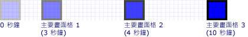
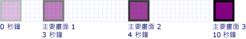
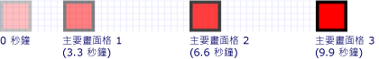
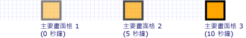

# HOW TO：控制主要畫面格動畫執行時間
此範例示範如何控制主要畫面格動畫中的主要畫面格的時間。 如同其他動畫，主要畫面格動畫也有<xref:System.Windows.Media.Animation.Timeline.Duration%2A>屬性。 除了指定動畫的持續時間，您必須指定這段期間的哪個部分配置給每個主要畫面格。 若要配置的時間，您指定<xref:System.Windows.Media.Animation.KeyTime>動畫中的每個主要畫面格。  
  
 <xref:System.Windows.Media.Animation.KeyTime>時的主要畫面格結束 （它未指定主要畫面格播放的時間長度），指定每個主要畫面格。 您可以指定<xref:System.Windows.Media.Animation.KeyTime>作為<xref:System.TimeSpan>值，以百分比表示，或作為<xref:System.Windows.Media.Animation.KeyTime.Uniform%2A>或<xref:System.Windows.Media.Animation.KeyTime.Paced%2A>特殊值。  
  
## 範例  
 下列範例會使用<xref:System.Windows.Media.Animation.DoubleAnimationUsingKeyFrames>來建立矩形動畫在螢幕上。 主要畫面格的關鍵時間會以設定<xref:System.TimeSpan>值。  
  
 [!code-csharp[keyframes_snip#KeyTimesTimeSpanExample](~/samples/snippets/csharp/VS_Snippets_Wpf/keyframes_snip/CSharp/KeyTimesExample.cs#keytimestimespanexample)]
 [!code-vb[keyframes_snip#KeyTimesTimeSpanExample](~/samples/snippets/visualbasic/VS_Snippets_Wpf/keyframes_snip/visualbasic/keytimesexample.vb#keytimestimespanexample)]
 [!code-xaml[keyframes_snip#KeyTimesTimeSpanExample](~/samples/snippets/xaml/VS_Snippets_Wpf/keyframes_snip/XAML/KeyTimesExample.xaml#keytimestimespanexample)]  
  
 下圖顯示當達到每個主要畫面格的值。  
  
   
  
 下一個範例顯示的完全相同，不同之處在於主要畫面格的關鍵時間會以百分比值來設定的動畫。  
  
 [!code-csharp[keyframes_snip#KeyTimesPercentageExample](~/samples/snippets/csharp/VS_Snippets_Wpf/keyframes_snip/CSharp/KeyTimesExample.cs#keytimespercentageexample)]
 [!code-vb[keyframes_snip#KeyTimesPercentageExample](~/samples/snippets/visualbasic/VS_Snippets_Wpf/keyframes_snip/visualbasic/keytimesexample.vb#keytimespercentageexample)]
 [!code-xaml[keyframes_snip#KeyTimesPercentageExample](~/samples/snippets/xaml/VS_Snippets_Wpf/keyframes_snip/XAML/KeyTimesExample.xaml#keytimespercentageexample)]  
  
 下圖顯示當達到每個主要畫面格的值。  
  
   
  
 下一個範例使用<xref:System.Windows.Media.Animation.KeyTime.Uniform%2A>索引鍵時間值。  
  
 [!code-csharp[keyframes_snip#KeyTimesUniformExample](~/samples/snippets/csharp/VS_Snippets_Wpf/keyframes_snip/CSharp/KeyTimesExample.cs#keytimesuniformexample)]
 [!code-vb[keyframes_snip#KeyTimesUniformExample](~/samples/snippets/visualbasic/VS_Snippets_Wpf/keyframes_snip/visualbasic/keytimesexample.vb#keytimesuniformexample)]
 [!code-xaml[keyframes_snip#KeyTimesUniformExample](~/samples/snippets/xaml/VS_Snippets_Wpf/keyframes_snip/XAML/KeyTimesExample.xaml#keytimesuniformexample)]  
  
 下圖顯示當達到每個主要畫面格的值。  
  
   
  
 最後一個範例會使用<xref:System.Windows.Media.Animation.KeyTime.Paced%2A>索引鍵時間值。  
  
 [!code-csharp[keyframes_snip#KeyTimesPacedExample](~/samples/snippets/csharp/VS_Snippets_Wpf/keyframes_snip/CSharp/KeyTimesExample.cs#keytimespacedexample)]
 [!code-vb[keyframes_snip#KeyTimesPacedExample](~/samples/snippets/visualbasic/VS_Snippets_Wpf/keyframes_snip/visualbasic/keytimesexample.vb#keytimespacedexample)]
 [!code-xaml[keyframes_snip#KeyTimesPacedExample](~/samples/snippets/xaml/VS_Snippets_Wpf/keyframes_snip/XAML/KeyTimesExample.xaml#keytimespacedexample)]  
  
 下圖顯示當達到每個主要畫面格的值。  
  
   
  
 為了簡單起見，此範例使用本機動畫的程式碼版本不分鏡腳本，因為只有單一動畫套用至單一屬性，但範例可以修改成改為使用分鏡腳本。 如需示範如何宣告在程式碼中的分鏡腳本的範例，請參閱[使用分鏡腳本建立屬性的動畫](how-to-animate-a-property-by-using-a-storyboard.md)。  
  
 如需完整的範例，請參閱[主要畫面格動畫範例](https://go.microsoft.com/fwlink/?LinkID=160012)。 如需有關主要畫面格動畫的詳細資訊，請參閱[主要畫面格動畫概觀](key-frame-animations-overview.md)。  
  
## 另請參閱
- [主要畫面格動畫概觀](key-frame-animations-overview.md)
- [動畫概觀](animation-overview.md)
- [HOW-TO 主題](animation-and-timing-how-to-topics.md)
