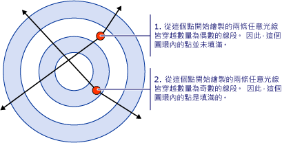
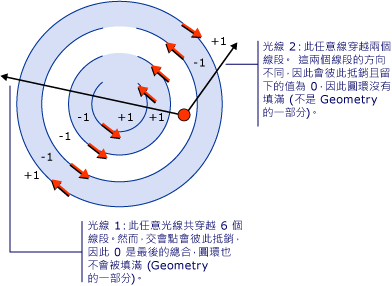
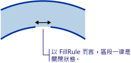

# 如何：控制複合圖案的填色
<xref:System.Windows.Media.GeometryGroup.FillRule%2A>屬性<xref:System.Windows.Media.GeometryGroup>或<xref:System.Windows.Media.PathGeometry>，指定 「 規則 」 複合圖案用它來判斷指定的點是幾何的一部分。 有兩個可能的值，如<xref:System.Windows.Media.FillRule>: <xref:System.Windows.Media.FillRule>和<xref:System.Windows.Media.FillRule>。 下列各節將說明如何使用這兩個規則。  
  
 **EvenOdd:**此規則會判斷某個點是否填滿區域中，從該點畫光線往任何方向，並計算給定圖案射線內的路徑線段數目。 如果這個數字是奇數，該點即是在區域內；如為偶數，該點即在區域外。  
  
 例如，以下的 XAML 會建立一系列的同心環 （目標） 所組成的複合圖案<xref:System.Windows.Media.GeometryGroup.FillRule%2A>設<xref:System.Windows.Media.FillRule>。  
  
 [!code-xml[GeometriesMiscSnippets_snip#FillRuleEvenOddValue](../../../../samples/snippets/xaml/VS_Snippets_Wpf/GeometriesMiscSnippets_snip/XAML/FillRuleExample.xaml#fillruleevenoddvalue)]  
  
 下圖顯示在上述範例中所建立的圖案。  
  
   
  
 在上圖中，請注意不填入 置中與第 3 個信號。 這是因為來自兩個環內任何點光線通過偶數數目的區段。 請參閱下圖︰  
  
   
  
 **NonZero:**此規則會判斷某個點是否在路徑的填滿區域中，往任何方向繪製從該點的光線，然後檢查圖案線段與光線的交叉位置。 開頭為零，計數加一次射線光跡從左到右和減一次路徑線段由右至左射線。 計算交會後，如果結果為零，則點即在路徑外。 否則就在路徑內。  
  
 [!code-xml[GeometriesMiscSnippets_snip#FillRuleNonZeroValueEllipseGeometry](../../../../samples/snippets/xaml/VS_Snippets_Wpf/GeometriesMiscSnippets_snip/XAML/FillRuleExample.xaml#fillrulenonzerovalueellipsegeometry)]  
  
 使用上述的值範例<xref:System.Windows.Media.FillRule>的<xref:System.Windows.Media.GeometryGroup.FillRule%2A>因此提供下圖︰  
  
   
  
 如您所見，所有環形都將會填滿。 這是因為所有區段都相同的方向都執行，所以從任何點繪製光線相交的其中一個或多個區段和交叉的總和不會等於零。 例如下, 圖中，紅色箭號代表區段繪製的方向和白色箭號表示從最裡面環點的任意射線。 開始值是零，相交，每個區段的值為&1; 會新增因為線段射線從左到右。  
  
   
  
 若要進一步示範的行為<xref:System.Windows.Media.FillRule>規則更複雜的形狀，以執行不同方向的區段是必要。 下列 XAML 程式碼會建立與前一個範例形狀相似之處在於它會透過<xref:System.Windows.Media.PathGeometry>而非<xref:System.Windows.Media.EllipseGeometry>這樣就可以建立四個同心圓弧形而不是完全關閉同心圓。  
  
 [!code-xml[GeometriesMiscSnippets_snip#FillRuleNonZeroValuePathGeometry](../../../../samples/snippets/xaml/VS_Snippets_Wpf/GeometriesMiscSnippets_snip/XAML/FillRuleExample.xaml#fillrulenonzerovaluepathgeometry)]  
  
 下圖顯示在上述範例中所建立的圖案。  
  
   
  
 請注意，第三個弧形中心不會填滿。 下圖顯示為什麼會這樣。 在圖中，紅色箭號代表區段繪製的方向。 兩個白色箭號代表兩條任意射線移出的 「 未填滿 」 區域中的點。 從圖中可以看出，給定的光線跨越其路徑中的區段中的值總和為零。 如以上的定義，總合為零表示點不是幾何 （非填滿的一部分） 的一部分時是總和*不*零，包括為負值，是幾何的一部分。  
  
   
  
 **注意︰**目的<xref:System.Windows.Media.FillRule>，所有圖形都視為封閉式。 如果沒有區段中的有間隔，繪製虛構的線，將它關閉。 在上述範例中，有小型間隙鈴響幾次。 如此一來，其中一個可能預期透過不同的結果缺口的射線，然後執行另一個方向的光線。 以下是其中一個這些漏洞及 「 虛數區段 」 的放大的圖 (區段繪製以供套用<xref:System.Windows.Media.FillRule>)，就會關閉它。  
  
   
  
## 範例  
  
## 另請參閱  
 [建立複合圖案](../../../../docs/framework/wpf/graphics-multimedia/how-to-create-a-composite-shape.md)   
 [幾何概觀](../../../../docs/framework/wpf/graphics-multimedia/geometry-overview.md)