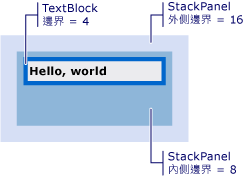

# 如何：取得 Visual 的位移
這些範例會示範如何擷取相對於其父代，或任何上階或下階的視覺物件的位移的值。  
  
## 範例  
 下列標記範例所示<xref:System.Windows.Controls.TextBlock>定義與<xref:System.Windows.FrameworkElement.Margin%2A>4 的值。  
  
 [!code-xaml[VisualSnippets#VisualSnippet1](../../../../samples/snippets/csharp/VS_Snippets_Wpf/VisualSnippets/CSharp/Window1.xaml#visualsnippet1)]  
  
 下列程式碼範例示範如何使用<xref:System.Windows.Media.VisualTreeHelper.GetOffset%2A>方法來擷取的位移<xref:System.Windows.Controls.TextBlock>。 位移的值包含在傳回<xref:System.Windows.Vector>值。  
  
 [!code-csharp[VisualSnippets#VisualSnippet2](../../../../samples/snippets/csharp/VS_Snippets_Wpf/VisualSnippets/CSharp/Window1.xaml.cs#visualsnippet2)]
 [!code-vb[VisualSnippets#VisualSnippet2](../../../../samples/snippets/visualbasic/VS_Snippets_Wpf/VisualSnippets/visualbasic/window1.xaml.vb#visualsnippet2)]  
  
 位移會考量<xref:System.Windows.FrameworkElement.Margin%2A>值。 在此情況下，<xref:System.Windows.Vector.X%2A>為 4，和<xref:System.Windows.Vector.Y%2A>為 4。  
  
 傳回的位移的值是相對於父系的<xref:System.Windows.Media.Visual>。 如果您想要傳回的位移的值不是相對於父系的<xref:System.Windows.Media.Visual>，使用<xref:System.Windows.Media.Visual.TransformToAncestor%2A>方法。  
  
## 取得相對於上階的位移  
 下列標記範例所示<xref:System.Windows.Controls.TextBlock>的巢狀在兩個<xref:System.Windows.Controls.StackPanel>物件。  
  
 [!code-xaml[VisualSnippets#VisualSnippet7](../../../../samples/snippets/csharp/VS_Snippets_Wpf/VisualSnippets/CSharp/Window2.xaml#visualsnippet7)]  
  
 下圖顯示標記的結果。  
  
   
巢狀方式置於兩個 StackPanels TextBlock  
  
 下列程式碼範例示範如何使用<xref:System.Windows.Media.Visual.TransformToAncestor%2A>方法來擷取的位移<xref:System.Windows.Controls.TextBlock>相對於包含<xref:System.Windows.Window>。 位移的值包含在傳回<xref:System.Windows.Media.GeneralTransform>值。  
  
 [!code-csharp[VisualSnippets#VisualSnippet5](../../../../samples/snippets/csharp/VS_Snippets_Wpf/VisualSnippets/CSharp/Window1.xaml.cs#visualsnippet5)]
 [!code-vb[VisualSnippets#VisualSnippet5](../../../../samples/snippets/visualbasic/VS_Snippets_Wpf/VisualSnippets/visualbasic/window1.xaml.vb#visualsnippet5)]  
  
 位移會考量<xref:System.Windows.FrameworkElement.Margin%2A>內包含的所有物件的值<xref:System.Windows.Window>。 在此情況下，<xref:System.Windows.Vector.X%2A>為 28 (16 + 8 + 4)，和<xref:System.Windows.Vector.Y%2A>為 28。  
  
 傳回的位移的值是相對於上階<xref:System.Windows.Media.Visual>。 如果您想要傳回相對於之下階的位移的值<xref:System.Windows.Media.Visual>，使用<xref:System.Windows.Media.Visual.TransformToDescendant%2A>方法。  
  
## 取得相對於其下階位移  
 下列標記範例所示<xref:System.Windows.Controls.TextBlock>內包含之<xref:System.Windows.Controls.StackPanel>物件。  
  
 [!code-xaml[VisualSnippets#VisualSnippet4](../../../../samples/snippets/csharp/VS_Snippets_Wpf/VisualSnippets/CSharp/Window1.xaml#visualsnippet4)]  
  
 下列程式碼範例示範如何使用<xref:System.Windows.Media.Visual.TransformToDescendant%2A>方法來擷取的位移<xref:System.Windows.Controls.StackPanel>相對於它的子系<xref:System.Windows.Controls.TextBlock>。 位移的值包含在傳回<xref:System.Windows.Media.GeneralTransform>值。  
  
 [!code-csharp[VisualSnippets#VisualSnippet9](../../../../samples/snippets/csharp/VS_Snippets_Wpf/VisualSnippets/CSharp/Window1.xaml.cs#visualsnippet9)]
 [!code-vb[VisualSnippets#VisualSnippet9](../../../../samples/snippets/visualbasic/VS_Snippets_Wpf/VisualSnippets/visualbasic/window1.xaml.vb#visualsnippet9)]  
  
 位移會考量<xref:System.Windows.FrameworkElement.Margin%2A>所有物件的值。 在此情況下，<xref:System.Windows.Vector.X%2A>為-4，和<xref:System.Windows.Vector.Y%2A>為-4。 位移的值是負值，因為父物件的位移負相對於它的子物件。  
  
## 另請參閱  
 <xref:System.Windows.Media.Visual>  
 <xref:System.Windows.Media.VisualTreeHelper>  
 [WPF 圖形轉譯概觀](../../../../docs/framework/wpf/graphics-multimedia/wpf-graphics-rendering-overview.md)
