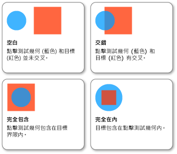

# HOW TO：使用幾何當做參數進行點擊測試How to: Hit Test Using Geometry as a Parameter
此範例示範如何在視覺物件使用執行點擊的測試<xref:System.Windows.Media.Geometry>做為點擊測試參數。This example shows how to perform a hit test on a visual object using a <xref:System.Windows.Media.Geometry> as a hit test parameter.  
  
## 範例Example  
 下列範例示範如何設定點擊的測試，使用<xref:System.Windows.Media.GeometryHitTestParameters>針對<xref:System.Windows.Media.VisualTreeHelper.HitTest%2A>方法。The following example shows how to set up a hit test using <xref:System.Windows.Media.GeometryHitTestParameters> for the <xref:System.Windows.Media.VisualTreeHelper.HitTest%2A> method. <xref:System.Windows.Point>值傳遞給`OnMouseDown`方法來建立<xref:System.Windows.Media.Geometry>以延伸點擊測試的範圍的物件。The <xref:System.Windows.Point> value that is passed to the `OnMouseDown` method is used to create a <xref:System.Windows.Media.Geometry> object in order to expand the range of the hit test.  
  
 [!code-csharp[HitTestingOverview#HitTestingOverviewSnippet10](~/samples/snippets/csharp/VS_Snippets_Wpf/HitTestingOverview/CSharp/GeometryHitTest.cs#hittestingoverviewsnippet10)]
 [!code-vb[HitTestingOverview#HitTestingOverviewSnippet10](~/samples/snippets/visualbasic/VS_Snippets_Wpf/HitTestingOverview/visualbasic/geometryhittest.vb#hittestingoverviewsnippet10)]  
  
 <xref:System.Windows.Media.GeometryHitTestResult.IntersectionDetail%2A>的屬性<xref:System.Windows.Media.GeometryHitTestResult>提供的使用點擊測試結果的相關資訊<xref:System.Windows.Media.Geometry>做為點擊測試參數。The <xref:System.Windows.Media.GeometryHitTestResult.IntersectionDetail%2A> property of <xref:System.Windows.Media.GeometryHitTestResult> provides information about the results of a hit test that uses a <xref:System.Windows.Media.Geometry> as a hit test parameter. 下圖顯示點擊測試幾何 (藍色圓形) 和目標視覺物件呈現內容 (紅色矩形) 之間的關係。The following illustration shows the relationship between the hit test geometry (the blue circle) and the rendered content of the target visual object (the red square).  
  
   
點擊測試幾何和目標視覺物件之間的交集Intersection between hit test geometry and target visual object  
  
 下列範例示範如何實作點擊的測試回呼時<xref:System.Windows.Media.Geometry>做為點擊的測試參數。The following example shows how to implement a hit test callback when a <xref:System.Windows.Media.Geometry> is used as a hit test parameter. `result`參數會轉換成<xref:System.Windows.Media.GeometryHitTestResult>若要擷取的值<xref:System.Windows.Media.GeometryHitTestResult.IntersectionDetail%2A>屬性。The `result` parameter is cast to a <xref:System.Windows.Media.GeometryHitTestResult> in order to retrieve the value of the <xref:System.Windows.Media.GeometryHitTestResult.IntersectionDetail%2A> property. 屬性值可讓您判斷如果<xref:System.Windows.Media.Geometry>點擊的測試參數完全或部分包含在點擊的測試目標呈現內容。The property value allows you to determine if the <xref:System.Windows.Media.Geometry> hit test parameter is fully or partially contained within the rendered content of the hit test target. 在此情況下，範例程式碼僅將點擊測試結果加入至完全包含在目標範圍內之視覺效果的清單中。In this case, the sample code is only adding hit test results to the list for visuals that are fully contained within the target boundary.  
  
 [!code-csharp[HitTestingOverview#HitTestingOverviewSnippet11](~/samples/snippets/csharp/VS_Snippets_Wpf/HitTestingOverview/CSharp/GeometryHitTest.cs#hittestingoverviewsnippet11)]
 [!code-vb[HitTestingOverview#HitTestingOverviewSnippet11](~/samples/snippets/visualbasic/VS_Snippets_Wpf/HitTestingOverview/visualbasic/geometryhittest.vb#hittestingoverviewsnippet11)]  
  
> [!NOTE]
>  <xref:System.Windows.Media.HitTestResult>交集詳細資料時，應該不會呼叫回呼<xref:System.Windows.Media.IntersectionDetail.Empty>。The <xref:System.Windows.Media.HitTestResult> callback should not be called when the intersection detail is <xref:System.Windows.Media.IntersectionDetail.Empty>.  
  
## 另請參閱See also
- [視覺分層中的點擊測試Hit Testing in the Visual Layer](hit-testing-in-the-visual-layer.md)
- [對 Visual 中的幾何進行點擊測試Hit Test Geometry in a Visual](how-to-hit-test-geometry-in-a-visual.md)
