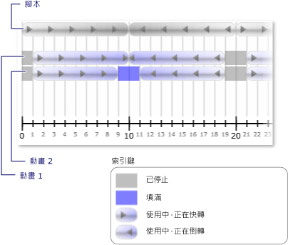

# 如何：時鐘的狀態變更時接收通知
當時鐘的 <xref:System.Windows.Media.Animation.Clock.CurrentState%2A> 無效時，例如時鐘啟動或停止時，就會發生時鐘的 <xref:System.Windows.Media.Animation.Clock.CurrentStateInvalidated> 事件。  您可以直接使用 <xref:System.Windows.Media.Animation.Clock> 註冊這個事件，或是使用 <xref:System.Windows.Media.Animation.Timeline> 進行註冊。  
  
 下列範例會使用一個 <xref:System.Windows.Media.Animation.Storyboard> 和兩個 <xref:System.Windows.Media.Animation.DoubleAnimation> 物件來建立兩個矩形寬度的動畫。  <xref:System.Windows.Media.Animation.Timeline.CurrentStateInvalidated> 事件用於接聽時鐘狀態的變更。  
  
## 範例  
 [!code-xml[timingbehaviors_snip#_graphicsmm_StateExampleMarkupWholePage](../../../../samples/snippets/csharp/VS_Snippets_Wpf/timingbehaviors_snip/CSharp/StateExample.xaml#_graphicsmm_stateexamplemarkupwholepage)]  
  
 [!code-csharp[timingbehaviors_snip#_graphicsmm_StateEventHandlers](../../../../samples/snippets/csharp/VS_Snippets_Wpf/timingbehaviors_snip/CSharp/StateExample.xaml.cs#_graphicsmm_stateeventhandlers)]
 [!code-vb[timingbehaviors_snip#_graphicsmm_StateEventHandlers](../../../../samples/snippets/visualbasic/VS_Snippets_Wpf/timingbehaviors_snip/visualbasic/stateexample.xaml.vb#_graphicsmm_stateeventhandlers)]  
  
 下圖顯示隨著父項目時間表 \(*Storyboard*\) 進行時動畫進入的不同狀態。  
  
   
  
 下表顯示引發 *Animation1* 的 <xref:System.Windows.Media.Animation.Timeline.CurrentStateInvalidated> 事件的時間點：  
  
||||||||  
|-|-|-|-|-|-|-|  
|時間 \(秒\)|1|10|19|21|30|39|  
|狀態|Active|Active|已停止|Active|Active|已停止|  
  
 下表顯示引發 *Animation2* 的 <xref:System.Windows.Media.Animation.Timeline.CurrentStateInvalidated> 事件的時間點：  
  
||||||||||  
|-|-|-|-|-|-|-|-|-|  
|時間 \(秒\)|1|9|11|19|21|29|31|39|  
|狀態|Active|填入中|Active|已停止|Active|填入中|Active|已停止|  
  
 請注意，*Animation1* 的 <xref:System.Windows.Media.Animation.Timeline.CurrentStateInvalidated> 事件在第 10 秒引發，即使狀態維持在 <xref:System.Windows.Media.Animation.ClockState>。  這是因為它的狀態在第 10 秒變更，但是在同一秒間從 <xref:System.Windows.Media.Animation.ClockState> 變更為 <xref:System.Windows.Media.Animation.ClockState>，並變更回 <xref:System.Windows.Media.Animation.ClockState>。