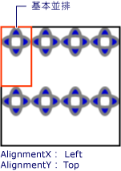
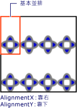

# 操作說明：設定 TileBrush 的水平和垂直對齊
本範例示範如何控制並排顯示中內容的水平和垂直對齊。 若要控制的水平和垂直對齊方式<xref:System.Windows.Media.TileBrush>，使用其<xref:System.Windows.Media.TileBrush.AlignmentX%2A>和<xref:System.Windows.Media.TileBrush.AlignmentY%2A>屬性。  
  
 <xref:System.Windows.Media.TileBrush.AlignmentX%2A>和<xref:System.Windows.Media.TileBrush.AlignmentY%2A>屬性<xref:System.Windows.Media.TileBrush>用其中一種下列情況為真時：  
  
-   <xref:System.Windows.Media.TileBrush.Stretch%2A>屬性是<xref:System.Windows.Media.Stretch.Uniform>或<xref:System.Windows.Media.Stretch.UniformToFill>和<xref:System.Windows.Media.TileBrush.Viewbox%2A>和<xref:System.Windows.Media.TileBrush.Viewport%2A>有不同的外觀比例。  
  
-   <xref:System.Windows.Media.TileBrush.Stretch%2A>屬性是<xref:System.Windows.Media.Stretch.None>和<xref:System.Windows.Media.TileBrush.Viewbox%2A>和<xref:System.Windows.Media.TileBrush.Viewport%2A>大小不同。  
  
## 範例  
 下列範例將對齊的內容<xref:System.Windows.Media.DrawingBrush>，這是一種<xref:System.Windows.Media.TileBrush>，其磚的左上角。 若要對齊的內容中，範例會設定<xref:System.Windows.Media.TileBrush.AlignmentX%2A>屬性<xref:System.Windows.Media.DrawingBrush>至<xref:System.Windows.Media.AlignmentX.Left>和<xref:System.Windows.Media.TileBrush.AlignmentY%2A>屬性<xref:System.Windows.Media.AlignmentY.Top>。 此範例會產生下列輸出。  
  
   
內容對齊左上角的 TileBrush  
  
 [!code-csharp[brushoverviewexamples_snip#TileBrushTopLeftAlignmentInline](../../../../samples/snippets/csharp/VS_Snippets_Wpf/BrushOverviewExamples_snip/CSharp/TileBrushAlignmentExample.cs#tilebrushtopleftalignmentinline)]
 [!code-vb[brushoverviewexamples_snip#TileBrushTopLeftAlignmentInline](../../../../samples/snippets/visualbasic/VS_Snippets_Wpf/BrushOverviewExamples_snip/visualbasic/tilebrushalignmentexample.vb#tilebrushtopleftalignmentinline)]
 [!code-xaml[brushoverviewexamples_snip#TileBrushTopLeftAlignmentInline](../../../../samples/snippets/xaml/VS_Snippets_Wpf/BrushOverviewExamples_snip/XAML/TileBrushAlignmentExample.xaml#tilebrushtopleftalignmentinline)]  
  
## 範例  
 下一個範例將對齊的內容<xref:System.Windows.Media.DrawingBrush>藉由設定其磚的右下角<xref:System.Windows.Media.TileBrush.AlignmentX%2A>屬性<xref:System.Windows.Media.AlignmentX.Right>和<xref:System.Windows.Media.TileBrush.AlignmentY%2A>屬性<xref:System.Windows.Media.AlignmentY.Bottom>。 這個範例會產生下列輸出。  
  
   
內容對齊右下角的 TileBrush  
  
 [!code-csharp[brushoverviewexamples_snip#TileBrushBottomRightAlignmentInline](../../../../samples/snippets/csharp/VS_Snippets_Wpf/BrushOverviewExamples_snip/CSharp/TileBrushAlignmentExample.cs#tilebrushbottomrightalignmentinline)]
 [!code-vb[brushoverviewexamples_snip#TileBrushBottomRightAlignmentInline](../../../../samples/snippets/visualbasic/VS_Snippets_Wpf/BrushOverviewExamples_snip/visualbasic/tilebrushalignmentexample.vb#tilebrushbottomrightalignmentinline)]
 [!code-xaml[brushoverviewexamples_snip#TileBrushBottomRightAlignmentInline](../../../../samples/snippets/xaml/VS_Snippets_Wpf/BrushOverviewExamples_snip/XAML/TileBrushAlignmentExample.xaml#tilebrushbottomrightalignmentinline)]  
  
## 範例  
 下一個範例將對齊的內容<xref:System.Windows.Media.DrawingBrush>藉由設定其磚的左上角<xref:System.Windows.Media.TileBrush.AlignmentX%2A>屬性<xref:System.Windows.Media.AlignmentX.Left>和<xref:System.Windows.Media.TileBrush.AlignmentY%2A>屬性<xref:System.Windows.Media.AlignmentY.Top>。 它也會設定<xref:System.Windows.Media.TileBrush.Viewport%2A>和<xref:System.Windows.Media.TileBrush.TileMode%2A>的<xref:System.Windows.Media.DrawingBrush>產生並排顯示模式。 這個範例會產生下列輸出。  
  
   
內容對齊基底並排中左上角的並排顯示模式  
  
 上圖將其中一個基底並排醒目提示，讓您能了解其內容的對齊方式。 請注意，<xref:System.Windows.Media.TileBrush.AlignmentX%2A>設定沒有任何作用，因為內容<xref:System.Windows.Media.DrawingBrush>完全填滿基底的並排顯示水平。  
  
 [!code-csharp[brushoverviewexamples_snip#TileBrushTopLeftAlignmentTiledInline](../../../../samples/snippets/csharp/VS_Snippets_Wpf/BrushOverviewExamples_snip/CSharp/TileBrushAlignmentExample.cs#tilebrushtopleftalignmenttiledinline)]
 [!code-vb[brushoverviewexamples_snip#TileBrushTopLeftAlignmentTiledInline](../../../../samples/snippets/visualbasic/VS_Snippets_Wpf/BrushOverviewExamples_snip/visualbasic/tilebrushalignmentexample.vb#tilebrushtopleftalignmenttiledinline)]
 [!code-xaml[brushoverviewexamples_snip#TileBrushTopLeftAlignmentTiledInline](../../../../samples/snippets/xaml/VS_Snippets_Wpf/BrushOverviewExamples_snip/XAML/TileBrushAlignmentExample.xaml#tilebrushtopleftalignmenttiledinline)]  
  
## 範例  
 最後一個範例將對齊的並排顯示內容<xref:System.Windows.Media.DrawingBrush>藉由設定其基底磚右下<xref:System.Windows.Media.TileBrush.AlignmentX%2A>屬性<xref:System.Windows.Media.AlignmentX.Right>和<xref:System.Windows.Media.TileBrush.AlignmentY%2A>屬性<xref:System.Windows.Media.AlignmentY.Bottom>。 這個範例會產生下列輸出。  
  
   
內容對齊基底並排中右下角的並排顯示模式  
  
 同樣地，<xref:System.Windows.Media.TileBrush.AlignmentX%2A>設定沒有任何作用，因為內容<xref:System.Windows.Media.DrawingBrush>完全填滿基底的並排顯示水平。  
  
 [!code-csharp[brushoverviewexamples_snip#TileBrushBottomRightAlignmentInline](../../../../samples/snippets/csharp/VS_Snippets_Wpf/BrushOverviewExamples_snip/CSharp/TileBrushAlignmentExample.cs#tilebrushbottomrightalignmentinline)]
 [!code-vb[brushoverviewexamples_snip#TileBrushBottomRightAlignmentInline](../../../../samples/snippets/visualbasic/VS_Snippets_Wpf/BrushOverviewExamples_snip/visualbasic/tilebrushalignmentexample.vb#tilebrushbottomrightalignmentinline)]
 [!code-xaml[brushoverviewexamples_snip#TileBrushBottomRightAlignmentInline](../../../../samples/snippets/xaml/VS_Snippets_Wpf/BrushOverviewExamples_snip/XAML/TileBrushAlignmentExample.xaml#tilebrushbottomrightalignmentinline)]  
  
 範例會使用<xref:System.Windows.Media.DrawingBrush>物件來示範如何<xref:System.Windows.Media.TileBrush.AlignmentX%2A>和<xref:System.Windows.Media.TileBrush.AlignmentY%2A>可用屬性。 這些屬性的行為即會相同拼貼筆刷： <xref:System.Windows.Media.DrawingBrush>， <xref:System.Windows.Media.ImageBrush>，和<xref:System.Windows.Media.VisualBrush>。 如需拼貼筆刷的詳細資訊，請參閱[使用影像、繪圖和視覺效果繪製](../../../../docs/framework/wpf/graphics-multimedia/painting-with-images-drawings-and-visuals.md)。  
  
## 另請參閱  
 <xref:System.Windows.Media.DrawingBrush>  
 <xref:System.Windows.Media.ImageBrush>  
 <xref:System.Windows.Media.VisualBrush>  
 [使用影像、繪圖和視覺效果繪製](../../../../docs/framework/wpf/graphics-multimedia/painting-with-images-drawings-and-visuals.md)
