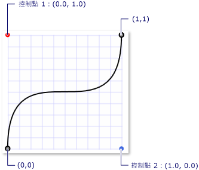

# 主要畫面格動畫概觀Key-Frame Animations Overview
本主題介紹主要畫面格動畫。This topic introduces you to key-frame animations. 主要畫面格動畫可讓您使用兩個以上的目標值來建立動畫，並且控制動畫的插補方法。Key-frame animations enable you to animate using more than two target values, and control an animation's interpolation method.  
  
   
## 必要條件Prerequisites  
 若要了解本概觀，您應該熟悉 [!INCLUDE[TLA#tla_winclient](../../../../includes/tlasharptla-winclient-md.md)] 動畫和時間軸。To understand this overview, you should be familiar with [!INCLUDE[TLA#tla_winclient](../../../../includes/tlasharptla-winclient-md.md)] animations and timelines. 如需動畫的簡介，請參閱[動畫概觀](animation-overview.md)。For an introduction to animations, see the [Animation Overview](animation-overview.md). 它也有助於熟悉 From/To/By 動畫。It also helps to be familiar with From/To/By animations. 如需詳細資訊，請參閱 From/To/By 動畫概觀。For more information, see the From/To/By Animations Overview.  
  
   
## 什麼是主要畫面格動畫？What is a Key-Frame Animation?  
 就像 From/To/By 動畫一樣，主要畫面格動畫會以目標屬性的值產生動畫。Like a From/To/By animation, a key-frame animation animates the value of a target property. 它透過建立目標值間的轉換其<xref:System.Windows.Media.Animation.Timeline.Duration%2A>。It creates a transition among its target values over its <xref:System.Windows.Media.Animation.Timeline.Duration%2A>. 不過，不像 From/To/By 動畫只能建立兩個值之間的轉換，單一畫面格動畫可以建立任意數目目標值之間的轉換。However, while a From/To/By animation creates a transition between two values, a single key-frame animation can create transitions among any number of target values. 不同於 From/To/By 動畫，主要畫面格動畫沒有 From、To 或 By 屬性可供設定目標值。Unlike a From/To/By animation, a key frame animation has no From, To, or By properties with which to set its target values. 主要畫面格動畫的目標值是以主要畫面格物件來描述 (因此有「主要畫面格動畫」一詞)。A key-frame animation's target values are described using key frames objects (hence the term, "key-frame animation"). 若要指定動畫的目標值，方法，您可以建立主要畫面格物件，並將它們加入至動畫的<xref:System.Windows.Media.Animation.DoubleAnimationUsingKeyFrames.KeyFrames%2A>集合。To specify the animation's target values, you create key frame objects and add them to the animation's <xref:System.Windows.Media.Animation.DoubleAnimationUsingKeyFrames.KeyFrames%2A> collection. 動畫執行時，就會在您指定的畫面格之間轉換。When the animation runs, it transitions between the frames you specified.  
  
 除了支援多個目標值之外，某些主要畫面格方法甚至支援多種插補方法。In addition to supporting multiple target values, some key-frame methods even support multiple interpolation methods. 動畫的插補方法定義了動畫如何從某個值轉換成下一個值。An animation's interpolation method defines how it transitions from one value to the next. 插補有以下三種類型：離散、線性和曲線。There are three types of interpolations: discrete, linear, and splined.  
  
 若要以主要畫面格動畫建立動畫，您必須完成下列步驟。To animate with a key-frame animation, you complete the following steps.  
  
-   宣告動畫並指定其<xref:System.Windows.Media.Animation.Timeline.Duration%2A>，就像您一樣的 from/to/by 動畫。Declare the animation and specify its <xref:System.Windows.Media.Animation.Timeline.Duration%2A>, just like you would for a from/to/by animation.  
  
-   每個目標值，建立適當型別的主要畫面格，請將其值和<xref:System.Windows.Media.Animation.KeyTime>，並將它加入至動畫的<xref:System.Windows.Media.Animation.DoubleAnimationUsingKeyFrames.KeyFrames%2A>集合。For each target value, create a key frame of the appropriate type, set its value and <xref:System.Windows.Media.Animation.KeyTime>, and add it to the animation's <xref:System.Windows.Media.Animation.DoubleAnimationUsingKeyFrames.KeyFrames%2A> collection.  
  
-   如同 From/To/By 動畫，建立動畫與屬性的關聯。Associate the animation with a property, just like you would with a From/To/By animation. 如需使用分鏡腳本將動畫套用至屬性的詳細資訊，請參閱[分鏡腳本概觀](storyboards-overview.md)。For more information about applying an animation to a property using a storyboard, see [Storyboards Overview](storyboards-overview.md).  
  
 下列範例會使用<xref:System.Windows.Media.Animation.DoubleAnimationUsingKeyFrames>來以動畫顯示<xref:System.Windows.Shapes.Rectangle>四個不同位置的項目。The following example uses a <xref:System.Windows.Media.Animation.DoubleAnimationUsingKeyFrames> to animate a <xref:System.Windows.Shapes.Rectangle> element to four different locations.  
  
 [!code-xaml[keyframes_ovw_snippet#BasicKeyFrameExampleWholePage](~/samples/snippets/csharp/VS_Snippets_Wpf/keyframes_ovw_snippet/CS/KeyFramesIntroduction.xaml#basickeyframeexamplewholepage)]  
  
 像 From/To/By 動畫，主要畫面格動畫可以藉由套用至屬性<xref:System.Windows.Media.Animation.Storyboard>標記和程式碼或使用<xref:System.Windows.Media.Animation.Animatable.BeginAnimation%2A>在程式碼中的方法。Like a From/To/By animation, a key-frame animation can be applied to a property by using a <xref:System.Windows.Media.Animation.Storyboard> in markup and code or by using the <xref:System.Windows.Media.Animation.Animatable.BeginAnimation%2A> method in code. 您也可以使用主要畫面格動畫建立<xref:System.Windows.Media.Animation.AnimationClock>並將它套用至一或多個屬性。You may also use a key-frame animation to create an <xref:System.Windows.Media.Animation.AnimationClock> and apply it to one or more properties. 如需套用動畫之不同方法的詳細資訊，請參閱[屬性動畫技術概觀](property-animation-techniques-overview.md)。For more information about the different methods for applying animations, see the [Property Animation Techniques Overview](property-animation-techniques-overview.md).  
  
   
## 主要畫面格動畫型別Key-Frame Animation Types  
 由於動畫會產生屬性值，因此針對不同的屬性類型會有不同的動畫類型。Because animations generate property values, there are different animation types for different property types. 若要動畫顯示採用的屬性<xref:System.Double>(例如項目的<xref:System.Windows.FrameworkElement.Width%2A>屬性)，您使用會產生動畫<xref:System.Double>值。To animate a property that takes a <xref:System.Double> (such as an element's <xref:System.Windows.FrameworkElement.Width%2A> property), you use an animation that produces <xref:System.Double> values. 若要動畫顯示採用的屬性<xref:System.Windows.Point>，您使用會產生動畫<xref:System.Windows.Point>值，並依此類推。To animate a property that takes a <xref:System.Windows.Point>, you use an animation that produces <xref:System.Windows.Point> values, and so on.  
  
 主要畫面格動畫類別屬於<xref:System.Windows.Media.Animation>命名空間，並遵循下列命名慣例：The key-frame animation classes belong to the <xref:System.Windows.Media.Animation> namespace and adhere to the following naming convention:  
  
 *\<Type>\<Type>* `AnimationUsingKeyFrames`  
  
 其中 *\<Type>* 是該類別建立動畫的值類型。Where *\<Type>* is the type of value that the class animates.  
  
 [!INCLUDE[TLA2#tla_winclient](../../../../includes/tla2sharptla-winclient-md.md)] 提供下列主要畫面格動畫類別。provides the following key-frame animation classes.  
  
|屬性類型Property type|對應 from/to/by 動畫類別Corresponding from/to/by animation class|支援的插補方法Interpolation methods supported|  
|-------------------|------------------------------------------------|-------------------------------------|  
|<xref:System.Boolean>|<xref:System.Windows.Media.Animation.BooleanAnimationUsingKeyFrames>|離散Discrete|  
|<xref:System.Byte>|<xref:System.Windows.Media.Animation.ByteAnimationUsingKeyFrames>|離散、線性、曲線Discrete, Linear, Splined|  
|<xref:System.Windows.Media.Color>|<xref:System.Windows.Media.Animation.ColorAnimationUsingKeyFrames>|離散、線性、曲線Discrete, Linear, Splined|  
|<xref:System.Decimal>|<xref:System.Windows.Media.Animation.DecimalAnimationUsingKeyFrames>|離散、線性、曲線Discrete, Linear, Splined|  
|<xref:System.Double>|<xref:System.Windows.Media.Animation.DoubleAnimationUsingKeyFrames>|離散、線性、曲線Discrete, Linear, Splined|  
|<xref:System.Int16>|<xref:System.Windows.Media.Animation.Int16AnimationUsingKeyFrames>|離散、線性、曲線Discrete, Linear, Splined|  
|<xref:System.Int32>|<xref:System.Windows.Media.Animation.Int32AnimationUsingKeyFrames>|離散、線性、曲線Discrete, Linear, Splined|  
|<xref:System.Int64>|<xref:System.Windows.Media.Animation.Int64AnimationUsingKeyFrames>|離散、線性、曲線Discrete, Linear, Splined|  
|<xref:System.Windows.Media.Matrix>|<xref:System.Windows.Media.Animation.MatrixAnimationUsingKeyFrames>|離散Discrete|  
|<xref:System.Object>|<xref:System.Windows.Media.Animation.ObjectAnimationUsingKeyFrames>|離散Discrete|  
|<xref:System.Windows.Point>|<xref:System.Windows.Media.Animation.PointAnimationUsingKeyFrames>|離散、線性、曲線Discrete, Linear, Splined|  
|<xref:System.Windows.Media.Media3D.Quaternion>|<xref:System.Windows.Media.Animation.QuaternionAnimationUsingKeyFrames>|離散、線性、曲線Discrete, Linear, Splined|  
|<xref:System.Windows.Rect>|<xref:System.Windows.Media.Animation.RectAnimationUsingKeyFrames>|離散、線性、曲線Discrete, Linear, Splined|  
|<xref:System.Windows.Media.Media3D.Rotation3D>|<xref:System.Windows.Media.Animation.Rotation3DAnimationUsingKeyFrames>|離散、線性、曲線Discrete, Linear, Splined|  
|<xref:System.Single>|<xref:System.Windows.Media.Animation.SingleAnimationUsingKeyFrames>|離散、線性、曲線Discrete, Linear, Splined|  
|<xref:System.String>|<xref:System.Windows.Media.Animation.StringAnimationUsingKeyFrames>|離散Discrete|  
|<xref:System.Windows.Size>|<xref:System.Windows.Media.Animation.SizeAnimationUsingKeyFrames>|離散、線性、曲線Discrete, Linear, Splined|  
|<xref:System.Windows.Thickness>|<xref:System.Windows.Media.Animation.ThicknessAnimationUsingKeyFrames>|離散、線性、曲線Discrete, Linear, Splined|  
|<xref:System.Windows.Media.Media3D.Vector3D>|<xref:System.Windows.Media.Animation.Vector3DAnimationUsingKeyFrames>|離散、線性、曲線Discrete, Linear, Splined|  
|<xref:System.Windows.Vector>|<xref:System.Windows.Media.Animation.VectorAnimationUsingKeyFrames>|離散、線性、曲線Discrete, Linear, Splined|  
  
   
## 目標值 (主要畫面格) 和關鍵時間Target Values (key frames) and Key Times  
 就如同不同型別的主要畫面格動畫適用於不同屬性型別的動畫，主要畫面格物件也有不同型別：每種主要畫面格物件各適用於一種值的動畫，且各支援一種插補方法。Just as there are different types of key-frame animations for animating different property types, there are also different types of key frame objects: one for each type of value animated and interpolation method supported. 主要畫面格型別會遵循下列命名慣例：Key frame types adhere to the following naming convention:  
  
 *\<InterpolationMethod>\<Type>\<InterpolationMethod>\<Type>* `KeyFrame`  
  
 其中 *\<InterpolationMethod>* 是主要畫面格使用的插補方法，而 *\<Type>* 是該類別建立動畫的值類型。Where *\<InterpolationMethod>* is the interpolation method the key frame uses and *\<Type>* is the type of value that the class animates. 支援所有三種插補方法的主要畫面格動畫，會有三種主要畫面格型別可供您使用。A key-frame animation that supports all three interpolation methods will have three key frame types that you can use. 例如，您可以使用三個主要畫面格類型及其<xref:System.Windows.Media.Animation.DoubleAnimationUsingKeyFrames>: <xref:System.Windows.Media.Animation.DiscreteDoubleKeyFrame>， <xref:System.Windows.Media.Animation.LinearDoubleKeyFrame>，和<xref:System.Windows.Media.Animation.SplineDoubleKeyFrame>。For example, you can use three key frame types with a <xref:System.Windows.Media.Animation.DoubleAnimationUsingKeyFrames>: <xref:System.Windows.Media.Animation.DiscreteDoubleKeyFrame>, <xref:System.Windows.Media.Animation.LinearDoubleKeyFrame>, and <xref:System.Windows.Media.Animation.SplineDoubleKeyFrame>. (稍後的章節會詳述插補方法。)(Interpolation methods are described in detail in a later section.)  
  
 主要畫面格的主要目的是指定<xref:System.Windows.Media.Animation.IKeyFrame.KeyTime%2A>和<xref:System.Windows.Media.Animation.IKeyFrame.Value%2A>。The primary purpose of a key frame is to specify a <xref:System.Windows.Media.Animation.IKeyFrame.KeyTime%2A> and a <xref:System.Windows.Media.Animation.IKeyFrame.Value%2A>. 每個主要畫面格型別都提供下列兩個屬性。Every key frame type provides these two properties.  
  
-   <xref:System.Windows.Media.Animation.IKeyFrame.Value%2A>屬性會指定該主要畫面格的目標值。The <xref:System.Windows.Media.Animation.IKeyFrame.Value%2A> property specifies the target value for that key-frame.  
  
-   <xref:System.Windows.Media.Animation.IKeyFrame.KeyTime%2A>屬性會指定何時 (在動畫<xref:System.Windows.Media.Animation.Timeline.Duration%2A>) 主要畫面格的<xref:System.Windows.Media.Animation.IKeyFrame.Value%2A>為止。The <xref:System.Windows.Media.Animation.IKeyFrame.KeyTime%2A> property specifies when (within the animation's <xref:System.Windows.Media.Animation.Timeline.Duration%2A>) a key frame's <xref:System.Windows.Media.Animation.IKeyFrame.Value%2A> is reached.  
  
 主要畫面格動畫開始時，逐一查看主要畫面格所定義的順序及其<xref:System.Windows.Media.Animation.IKeyFrame.KeyTime%2A>屬性。When a key frame animation begins, iterates through its key frames in the order defined by their <xref:System.Windows.Media.Animation.IKeyFrame.KeyTime%2A> properties.  
  
-   如果在時間 0 有沒有主要畫面格動畫可建立目標屬性的目前值之間的轉換和<xref:System.Windows.Media.Animation.IKeyFrame.Value%2A>的第一個主要畫面格; 否則動畫的輸出值會變成第一個主要畫面格的值。If there is no key frame at time 0, the animation creates a transition between the target property's current value and the <xref:System.Windows.Media.Animation.IKeyFrame.Value%2A> of the first key frame; otherwise, the animation's output value becomes the value of the first key frame.  
  
-   動畫建立之間的轉換<xref:System.Windows.Media.Animation.IKeyFrame.Value%2A>第一個和第二個主要畫面格使用指定的第二個主要畫面格的插補方法。The animation creates a transition between the <xref:System.Windows.Media.Animation.IKeyFrame.Value%2A> of the first and second key frames using the interpolation method specified by the second key frame. 在轉換開始第一個主要畫面格的<xref:System.Windows.Media.Animation.IKeyFrame.KeyTime%2A>時結束，第二個主要畫面格的<xref:System.Windows.Media.Animation.IKeyFrame.KeyTime%2A>為止。The transition starts at the first key frame's <xref:System.Windows.Media.Animation.IKeyFrame.KeyTime%2A> and ends when the second key frame's <xref:System.Windows.Media.Animation.IKeyFrame.KeyTime%2A> is reached.  
  
-   動畫會繼續在後續每個主要畫面格與其前一個主要畫面格之間建立轉換。The animation continues, creating transitions between each subsequent key frame and its preceding key frame.  
  
-   最後，主要畫面格的最大的索引鍵時間，動畫會轉換成的值就等於或小於動畫的<xref:System.Windows.Media.Animation.Timeline.Duration%2A>。Finally, the animation transitions to the value of the key frame with the greatest key time that is equal to or smaller than the animation's <xref:System.Windows.Media.Animation.Timeline.Duration%2A>.  
  
 如果動畫<xref:System.Windows.Media.Animation.Timeline.Duration%2A>已<xref:System.Windows.Duration.Automatic%2A>或其<xref:System.Windows.Media.Animation.Timeline.Duration%2A>等於最後一個主要畫面格，在動畫結束時間。If the animation's <xref:System.Windows.Media.Animation.Timeline.Duration%2A> is <xref:System.Windows.Duration.Automatic%2A> or its <xref:System.Windows.Media.Animation.Timeline.Duration%2A> is equal to the time of the last key frame, the animation ends. 否則，如果動畫<xref:System.Windows.Duration>大於最後一個主要畫面格，主要畫面格的值，直到它到達結尾動畫保存的關鍵時間其<xref:System.Windows.Duration>。Otherwise, if the animation's <xref:System.Windows.Duration> is greater than the key time of the last key frame, the animation holds the key frame value until it reaches the end of its <xref:System.Windows.Duration>. 如同所有動畫，主要畫面格動畫會使用其<xref:System.Windows.Media.Animation.Timeline.FillBehavior%2A>屬性來判斷是否它會保留其最終值到達它的作用期結束時。Like all animations, a key-frame animation uses its <xref:System.Windows.Media.Animation.Timeline.FillBehavior%2A> property to determine whether it holds it final value when it reaches the end of its active period. 如需詳細資訊，請參閱[計時行為概觀](timing-behaviors-overview.md)。For more information, see the [Timing Behaviors Overview](timing-behaviors-overview.md).  
  
 下列範例會使用<xref:System.Windows.Media.Animation.DoubleAnimationUsingKeyFrames>物件，定義在上述範例中示範如何<xref:System.Windows.Media.Animation.IKeyFrame.Value%2A>和<xref:System.Windows.Media.Animation.IKeyFrame.KeyTime%2A>屬性運作。The following example uses the <xref:System.Windows.Media.Animation.DoubleAnimationUsingKeyFrames> object defined in the preceding example to demonstrate how the <xref:System.Windows.Media.Animation.IKeyFrame.Value%2A> and <xref:System.Windows.Media.Animation.IKeyFrame.KeyTime%2A> properties work.  
  
-   第一個主要畫面格會立即將動畫的輸出值設定為 0。The first key frame immediately sets the animation's output value to 0.  
  
-   第二個主要畫面格會從 0 展示動畫至 350。The second key frame animates from 0 to 350. 它會在第一個主要畫面格結束 (時間等於 0 秒) 後開始播放 2 秒，並且在時間等於 0:0:2 時結束。It starts after the first key frame ends (at time = 0 seconds) and plays for 2 seconds, ending at time = 0:0:2.  
  
-   第三個主要畫面格會從 350 展示動畫至 50。The third key frame animates from 350 to 50. 它會在第二個主要畫面格結束 (時間等於 2 秒) 時開始播放 5 秒，並且在時間等於 0:0:7 時結束。It starts when the second key frame ends (at time = 2 seconds) and plays for 5 seconds, ending at time = 0:0:7.  
  
-   第四個主要畫面格會從 50 展示動畫至 200。The fourth key frame animates from 50 to 200. 它會在第三個主要畫面格結束 (時間等於 7 秒) 時開始播放 1 秒，並且在時間等於 0:0:8 時結束。It starts when the third key frame ends (at time = 7 seconds) and plays for 1 second, ending at time = 0:0:8.  
  
-   因為<xref:System.Windows.Media.Animation.Timeline.Duration%2A>動畫的屬性設定為 10 秒，則動畫會保留其最終的值為兩秒，然後結束時間等於 0:0:10。Because the <xref:System.Windows.Media.Animation.Timeline.Duration%2A> property of the animation was set to 10 seconds, the animation holds its final value for two seconds before ending at time = 0:0:10.  
  
 [!code-xaml[keyframes_ovw_snippet#BasicKeyFrameExampleWholePage](~/samples/snippets/csharp/VS_Snippets_Wpf/keyframes_ovw_snippet/CS/KeyFramesIntroduction.xaml#basickeyframeexamplewholepage)]  
  
   
## 插補方法Interpolation Methods  
 前面幾節曾提到有些主要畫面格動畫可以支援多種插補方法。The preceding sections mentioned that some key-frame animations support multiple interpolation methods. 動畫的插補描述了動畫如何在其持續期間內進行值之間的轉換。An animation's interpolation describes how an animation transitions between values over its duration. 選取動畫所要使用的主要畫面格型別，即可定義該主要畫面格區段的插補方法。By selecting which key frame type you use with your animation, you can define the interpolation method for that key frame segment. 插補方法有三種不同類型：線性、離散和曲線。There are three different types of interpolation methods: linear, discrete, and splined.  
  
### 線性插補Linear Interpolation  
 使用線性插補，動畫在區段的持續時間會以不變的速率進行。With linear interpolation, the animation progresses at a constant rate of the segment duration. 例如，如果主要畫面格區段在 5 秒的持續期間從 0 轉換為 10，動畫將會於指定的時間輸出下列值：For example, if a key frame segment transitions from 0 to 10 over a duration of 5 seconds, the animation will output the following values at the specified times:  
  
|時間Time|輸出值Output value|  
|----------|------------------|  
|00|00|  
|11|22|  
|22|44|  
|33|66|  
|44|88|  
|4.254.25|8.58.5|  
|4.54.5|99|  
|55|1010|  
  
### 離散插補Discrete Interpolation  
 使用離散插補，動畫功能會從某個值跳到下個值而不使用插補。With discrete interpolation, the animation function jumps from one value to the next without interpolation. 如果主要畫面格區段在 5 秒的持續期間從 0 轉換為 10，動畫將會於指定的時間輸出下列值：If a key frame segment transitions from 0 to 10 over a duration of 5 seconds, the animation will output the following values at the specified times:  
  
|時間Time|輸出值Output value|  
|----------|------------------|  
|00|00|  
|11|00|  
|22|00|  
|33|00|  
|44|00|  
|4.254.25|00|  
|4.54.5|00|  
|55|1010|  
  
 請注意，在區段持續期間結束之前，動畫不會變更其輸出值。Notice how the animation does not change its output value until the very end of the segment duration.  
  
 曲線插補更為複雜。Splined interpolation is more complex. 下一節將加以說明。It is described in the next section.  
  
   
### 曲線插補Splined Interpolation  
 曲線插補可用來達成更逼真的時間效果。Splined interpolation can be used to achieve more realistic timing effects. 因為動畫經常用來模擬真實世界中發生的效果，因此開發人員需要精確控制物件的加速和減速情形，並且仔細操控時間區段。Because animations are so often used to imitate effects that occur in the real world, developers might need fine control of the acceleration and deceleration of objects, and close manipulation of timing segments. 曲線主要畫面格可讓您使用曲線插補來建立動畫。Spline key frames enable you to animate with splined interpolation. 使用其他主要畫面格，您指定<xref:System.Windows.Media.Animation.IKeyFrame.Value%2A>和<xref:System.Windows.Media.Animation.IKeyFrame.KeyTime%2A>。With other key frames, you specify a <xref:System.Windows.Media.Animation.IKeyFrame.Value%2A> and <xref:System.Windows.Media.Animation.IKeyFrame.KeyTime%2A>. 使用曲線主要畫面格，您也指定<xref:System.Windows.Media.Animation.SplineDoubleKeyFrame.KeySpline%2A>。With a spline key frame, you also specify a <xref:System.Windows.Media.Animation.SplineDoubleKeyFrame.KeySpline%2A>. 下列範例顯示的單一曲線主要畫面格<xref:System.Windows.Media.Animation.DoubleAnimationUsingKeyFrames>。The following example shows a single spline key frame for a <xref:System.Windows.Media.Animation.DoubleAnimationUsingKeyFrames>. 請注意<xref:System.Windows.Media.Animation.KeySpline>屬性; 就是讓曲線主要畫面格不同於其他類型的主要畫面格。Notice the <xref:System.Windows.Media.Animation.KeySpline> property; that's what makes a spline key frame different from the other types of key frames.  
  
 [!code-xaml[keyframes_ovw_snippet#SingleSplineKeyFrameExample](~/samples/snippets/csharp/VS_Snippets_Wpf/keyframes_ovw_snippet/CS/InterpolationMethodsExample.xaml#singlesplinekeyframeexample)]  
  
 三次方貝茲曲線是由一個起始點、一個結束點和兩個控制點所定義。A cubic Bezier curve is defined by a start point, an end point, and two control points. <xref:System.Windows.Media.Animation.KeySpline>的曲線主要畫面格的屬性會定義從 (0，0) 延伸至 (1，1) 之貝茲曲線的兩個控制點。The <xref:System.Windows.Media.Animation.KeySpline> property of a spline key frame defines the two control point of a Bezier curve that extends from (0,0) to (1,1). 第一個控制點控制貝茲曲線前半段的曲率，第二個控制點則控制貝茲線段後半段的曲率。The first control point controls the curve factor of the first half of the Bezier curve, and the second control point controls the curve factor of the second half of the Bezier segment. 產生的曲線即描述該曲線主要畫面格的變化速率。The resulting curve describes the rate of change for that spline key frame. 曲線越陡峭，主要畫面格變更值的速度就越快。The steeper the curve, the faster the key frame changes its values. 曲線越平滑，主要畫面格變更值的速度就越慢。As the curve gets flatter, the key frame changes its values more slowly.  
  
 您可以使用<xref:System.Windows.Media.Animation.KeySpline>來模擬實體滴下，例如切換 water 或彈跳球，或將其他 「 加速 」 與 「 減速 」 效果套用至移動動畫。You might use <xref:System.Windows.Media.Animation.KeySpline> to simulate physical trajectories like falling water or bouncing balls, or apply other "ease in" and "ease out" effects to motion animations. 至於使用者互動效果 (像是背景淡出或控制按鈕彈回)，您可以套用曲線插補，以特定方式加速或減慢動畫的變化速率。For user interaction effects like background fades or control button rebound, you might apply splined interpolation to speed up or slow down the rate of change for an animation in a specific way.  
  
 下列範例會指定<xref:System.Windows.Media.Animation.KeySpline>的 0，1 1，這會建立下列貝茲曲線，0。The following example specifies a <xref:System.Windows.Media.Animation.KeySpline> of 0,1 1,0, which creates the following Bezier curve.  
  
   
控制點位於 (0.0, 1.0) 和 (1.0, 0.0) 的主要曲線A key spline with control points (0.0, 1.0) and (1.0, 0.0)  
  
 [!code-xaml[keyframes_ovw_snippet#SingleSplineKeyFrameExample](~/samples/snippets/csharp/VS_Snippets_Wpf/keyframes_ovw_snippet/CS/InterpolationMethodsExample.xaml#singlesplinekeyframeexample)]  
  
 這個主要畫面格在開始時會急速顯示動畫，而後減慢，然後在結束之前再次加速。This key frame animates rapidly when it begins, slows down, and then speeds up again before it ends.  
  
 下列範例會指定<xref:System.Windows.Media.Animation.KeySpline>的 0.5,0.25 0.75,1.0，這會建立下列貝茲曲線。The following example specifies a <xref:System.Windows.Media.Animation.KeySpline> of 0.5,0.25 0.75,1.0, which creates the following Bezier curve.  
  
   
控制點位於 (0.25, 0.5) 和 (0.75, 1.0) 的主要曲線A key spline with control points (0.25, 0.5) and (0.75, 1.0)  
  
 [!code-xaml[keyframes_ovw_snippet#SingleSplineKeyFrameExampleInline3](~/samples/snippets/csharp/VS_Snippets_Wpf/keyframes_ovw_snippet/CS/InterpolationMethodsExample.xaml#singlesplinekeyframeexampleinline3)]  
  
 因為貝茲曲線的曲率變化很小，所以這個主要畫面格幾乎是以不變的速率顯示動畫；它在結束之前會稍微減慢。Because the curvature of the Bezier curve changes very little, this key frame animates at an almost constant rate; it slows down somewhat toward its very end.  
  
 下列範例會使用<xref:System.Windows.Media.Animation.DoubleAnimationUsingKeyFrames>以動畫顯示矩形的位置。The following example uses a <xref:System.Windows.Media.Animation.DoubleAnimationUsingKeyFrames> to animate the position of rectangle. 因為<xref:System.Windows.Media.Animation.DoubleAnimationUsingKeyFrames>使用<xref:System.Windows.Media.Animation.SplineDoubleKeyFrame>物件，每個主要畫面格值之間的轉換使用曲線插補。Because the <xref:System.Windows.Media.Animation.DoubleAnimationUsingKeyFrames> uses <xref:System.Windows.Media.Animation.SplineDoubleKeyFrame> objects, the transition between each key frame value uses splined interpolation.  
  
 [!code-xaml[keyframes_ovw_snippet#SplinedInterpolationExample](~/samples/snippets/csharp/VS_Snippets_Wpf/keyframes_ovw_snippet/CS/InterpolationMethodsExample.xaml#splinedinterpolationexample)]  
  
 曲線插補的概念可能不好理解；試試不同的設定會有所幫助。Splined interpolation can be difficult to understand; experimenting with different settings can help. [主要曲線動畫範例 (英文)](https://go.microsoft.com/fwlink/?LinkID=160011) 可讓您變更主要曲線值，並查看它在動畫上的效果。The [Key Spline Animation Sample](https://go.microsoft.com/fwlink/?LinkID=160011) enables you to change key spline values and see the result it has on an animation.  
  
   
### 結合插補方法Combining Interpolation Methods  
 在單一主要畫面格動畫中，您可以使用主要畫面格搭配不同的插補類型。You can use key frames with different interpolation types in a single key frame animation. 當具有不同插補的兩個主要畫面格動畫彼此相隨時，第二個主要畫面格的插補方法會用來建立第一個值到第二個值的轉換。When two key frame animations with different interpolations follow each other, the interpolation method of the second key frame is used to create the transition from the first value to the second.  
  
 在下列範例中，<xref:System.Windows.Media.Animation.DoubleAnimationUsingKeyFrames>會建立該使用線性、 曲線和離散插補。In the following example, a <xref:System.Windows.Media.Animation.DoubleAnimationUsingKeyFrames> is created that uses linear, splined, and discrete interpolation.  
  
 [!code-xaml[keyframes_ovw_snippet#ComboInterpolationExample](~/samples/snippets/csharp/VS_Snippets_Wpf/keyframes_ovw_snippet/CS/InterpolationMethodsExample.xaml#combointerpolationexample)]  
  
   
## 深入了解持續期間和關鍵時間More about Duration and Key Times  
 如同其他動畫，主要畫面格動畫也有<xref:System.Windows.Duration>屬性。Like other animations, key-frame animations have a <xref:System.Windows.Duration> property. 除了指定動畫的<xref:System.Windows.Duration>，您必須指定這段期間的哪個部分提供給每個主要畫面格。In addition to specifying the animation's <xref:System.Windows.Duration>, you need to specify what portion of that duration is given to each key frame. 您可以透過描述<xref:System.Windows.Media.Animation.IKeyFrame.KeyTime%2A>針對每個動畫的主要畫面格。You do so by describing a   <xref:System.Windows.Media.Animation.IKeyFrame.KeyTime%2A> for each of the animation's key frames. 每個主要畫面格的<xref:System.Windows.Media.Animation.IKeyFrame.KeyTime%2A>指定該主要畫面格的結束時。Each key frame's <xref:System.Windows.Media.Animation.IKeyFrame.KeyTime%2A> specifies when that key frame ends.  
  
 <xref:System.Windows.Media.Animation.IKeyFrame.KeyTime%2A>屬性不會指定多久的關鍵時間播放。The <xref:System.Windows.Media.Animation.IKeyFrame.KeyTime%2A> property does not specify how long the key time plays. 主要畫面格的播放時間量取決於主要畫面格的結束時間、前一個主要畫面格的結束時間，以及動畫的持續期間。The amount of time a key frame plays is determined by when the key frame ends, when the previous key frame ended, and the animation's duration. 可能指定關鍵時間，做為時間值，而百分比，或做為特殊值<xref:System.Windows.Media.Animation.KeyTime.Uniform%2A>或<xref:System.Windows.Media.Animation.KeyTime.Paced%2A>。Key times may be specified as a time value, a percentage, or as the special values <xref:System.Windows.Media.Animation.KeyTime.Uniform%2A> or <xref:System.Windows.Media.Animation.KeyTime.Paced%2A>.  
  
 下列清單說明指定關鍵時間的幾種不同方式。The following list describes the different ways of specifying key times.  
  
### TimeSpan 值TimeSpan Values  
 您可以使用<xref:System.TimeSpan>值來指定<xref:System.Windows.Media.Animation.KeyTime>。You may use <xref:System.TimeSpan> values to specify a <xref:System.Windows.Media.Animation.KeyTime>. 此值應該大於或等於 0，並且小於或等於動畫的持續期間。The value should be greater than or equal to 0 and less than or equal to the animation's duration. 下列範例顯示的動畫具有 10 秒的持續期間和四個主要畫面格，其中每個主要畫面格的關鍵時間都是以時間值指定。The following example shows an animation with a duration of 10 seconds and four key frames whose key times are specified as time values.  
  
-   第一個主要畫面格會在前 3 秒顯示從基底值至 100 的動畫，並且在時間等於 0:0:03 時結束。The first key frame animates from the base value to 100 over the first 3 seconds, ending at time = 0:0:03.  
  
-   第二個主要畫面格會從 100 展示動畫至 200。The second key frame animates from 100 to 200. 它會在第一個主要畫面格結束 (時間等於 3 秒) 後開始播放 5 秒，並且在時間等於 0:0:8 時結束。It starts after the first key frame ends (at time = 3 seconds) and plays for 5 seconds, ending at time = 0:0:8.  
  
-   第三個主要畫面格會從 200 展示動畫至 500。The third key frame animates from 200 to 500. 它會在第二個主要畫面格結束 (時間等於 8 秒) 時開始播放 1 秒，並且在時間等於 0:0:9 時結束。It starts when the second key frame ends (at time = 8 seconds) and plays for 1 second, ending at time = 0:0:9.  
  
-   第四個主要畫面格會從 500 展示動畫至 600。The fourth key frame animates from 500 to 600. 它會在第三個主要畫面格結束 (時間等於 9 秒) 時開始播放 1 秒，並且在時間等於 0:0:10 時結束。It starts when the third key frame ends (at time = 9 seconds) and plays for 1 second, ending at time = 0:0:10.  
  
 [!code-xaml[keyframes_ovw_snippet#TimeSpanKeyTimeExample](~/samples/snippets/csharp/VS_Snippets_Wpf/keyframes_ovw_snippet/CS/KeyTimesExample.xaml#timespankeytimeexample)]  
  
### 百分比值Percentage Values  
 百分比值，指定主要畫面格結尾的動畫的某個百分比<xref:System.Windows.Media.Animation.Timeline.Duration%2A>。A percentage value specifies that the key frame ends at some percentage of the animation's <xref:System.Windows.Media.Animation.Timeline.Duration%2A>. 在 [!INCLUDE[TLA2#tla_xaml](../../../../includes/tla2sharptla-xaml-md.md)] 中，百分比的指定方式為在數字後面加上 `%` 符號。In [!INCLUDE[TLA2#tla_xaml](../../../../includes/tla2sharptla-xaml-md.md)], you specify the percentage as a number followed by the `%` symbol. 在程式碼中，您會使用<xref:System.Windows.Media.Animation.KeyTime.FromPercent%2A>方法並將它傳遞<xref:System.Double>指出的百分比。In code, you use the <xref:System.Windows.Media.Animation.KeyTime.FromPercent%2A> method and pass it a <xref:System.Double> indicating the percentage. 值必須大於或等於 0 且小於或等於 100%。The value must be greater than or equal to 0 and less than or equal to 100 percent. 下列範例顯示的動畫具有 10 秒的持續期間和四個主要畫面格，其中每個主要畫面格的關鍵時間都是以百分比指定。The following example shows an animation with a duration of 10 seconds and four key frames whose key times are specified as percentages.  
  
-   第一個主要畫面格會在前 3 秒顯示從基底值至 100 的動畫，並且在時間等於 0:0:3 時結束。The first key frame animates from the base value to 100 over the first 3 seconds, ending at time = 0:0:3.  
  
-   第二個主要畫面格會從 100 展示動畫至 200。The second key frame animates from 100 to 200. 它會在第一個主要畫面格結束 (時間等於 3 秒) 後開始播放 5 秒，並且在時間等於 0:0:8 (0.8 \* 10 = 8) 時結束。It starts after the first key frame ends (at time = 3 seconds) and plays for 5 seconds, ending at time = 0:0:8 (0.8 \* 10 = 8).  
  
-   第三個主要畫面格會從 200 展示動畫至 500。The third key frame animates from 200 to 500. 它會在第二個主要畫面格結束 (時間等於 8 秒) 時開始播放 1 秒，並且在時間等於 0:0:9 (0.9 \* 10 = 9) 時結束。It starts when the second key frame ends (at time = 8 seconds) and plays for 1 second, ending at time = 0:0:9 (0.9 \* 10 = 9).  
  
-   第四個主要畫面格會從 500 展示動畫至 600。The fourth key frame animates from 500 to 600. 它會在第三個主要畫面格結束 (時間等於 9 秒) 時開始播放 1 秒，並且在時間等於 0:0:10 (1 \* 10 = 10) 時結束。It starts when the third key frame ends (at time = 9 seconds) and plays for 1 second, ending at time = 0:0:10 (1 \* 10 = 10).  
  
 [!code-xaml[keyframes_ovw_snippet#PercentageKeyTimeExample](~/samples/snippets/csharp/VS_Snippets_Wpf/keyframes_ovw_snippet/CS/KeyTimesExample.xaml#percentagekeytimeexample)]  
  
### 特殊值 UniformSpecial Value, Uniform  
 使用<xref:System.Windows.Media.Animation.KeyTime.Uniform%2A>逾時要採取相同的時間量的每個主要畫面格。Use <xref:System.Windows.Media.Animation.KeyTime.Uniform%2A> timing when you want each key frame to take the same amount of time.  
  
 A<xref:System.Windows.Media.Animation.KeyTime.Uniform%2A>關鍵時間將可用時間平均除以來判斷每個主要畫面格的結束時間的主要畫面格數目。A <xref:System.Windows.Media.Animation.KeyTime.Uniform%2A> key time divides the available time equally by the number of key frames to determine the end time of each key frame. 下列範例顯示的動畫具有 10 秒的持續時間，並指定為索引鍵時間的四個主要畫面格<xref:System.Windows.Media.Animation.KeyTime.Uniform%2A>。The following example shows an animation with a duration of 10 seconds and four key frames whose key times are specified as <xref:System.Windows.Media.Animation.KeyTime.Uniform%2A>.  
  
-   第一個主要畫面格會在前 2.5 秒顯示從基底值至 100 的動畫，並且在時間等於 0:0:2.5 時結束。The first key frame animates from the base value to 100 over the first 2.5 seconds, ending at time = 0:0:2.5.  
  
-   第二個主要畫面格會從 100 展示動畫至 200。The second key frame animates from 100 to 200. 它會在第一個主要畫面格結束 (時間等於 2.5 秒) 後開始播放 2.5 秒，並且在時間等於 0:0:5 時結束。It starts after the first key frame ends (at time = 2.5 seconds) and plays for approximately 2.5 seconds, ending at time = 0:0:5.  
  
-   第三個主要畫面格會從 200 展示動畫至 500。The third key frame animates from 200 to 500. 它會在第二個主要畫面格結束 (時間等於 5 秒) 時開始播放 2.5 秒，並且在時間等於 0:0:7.5 時結束。It starts when the second key frame ends (at time = 5 seconds) and plays for 2.5 seconds, ending at time = 0:0:7.5.  
  
-   第四個主要畫面格會從 500 展示動畫至 600。The fourth key frame animates from 500 to 600. 它會在第二個主要畫面格結束 (時間等於 7.5 秒) 時開始播放 2.5 秒，並且在時間等於 0:0:1 時結束。It starts when the second key frame ends (at time = 7.5 seconds) and plays for 2.5 seconds, ending at time = 0:0:1.  
  
 [!code-xaml[keyframes_ovw_snippet#UniformKeyTimeExample](~/samples/snippets/csharp/VS_Snippets_Wpf/keyframes_ovw_snippet/CS/KeyTimesExample.xaml#uniformkeytimeexample)]  
  
### 特殊值 PacedSpecial Value, Paced  
 使用<xref:System.Windows.Media.Animation.KeyTime.Paced%2A>逾時您想要以動畫顯示變的速率。Use <xref:System.Windows.Media.Animation.KeyTime.Paced%2A> timing when you want to animate at a constant rate.  
  
 A<xref:System.Windows.Media.Animation.KeyTime.Paced%2A>關鍵時間會配置可用的時間，根據每個主要畫面格，以判斷每個畫面格的持續時間的長度。A <xref:System.Windows.Media.Animation.KeyTime.Paced%2A> key time allocates the available time according to the length of each of the key frames to determine the duration of each frame.  這樣會使動畫的速度或步調維持不變。This will provide the behavior that the velocity or pace of the animation remains constant.  下列範例顯示的動畫具有 10 秒的持續時間，並指定為索引鍵時間的三個主要畫面格<xref:System.Windows.Media.Animation.KeyTime.Paced%2A>。The following example shows an animation with a duration of 10 seconds and three key frames whose key times are specified as <xref:System.Windows.Media.Animation.KeyTime.Paced%2A>.  
  
 [!code-xaml[keyframes_ovw_snippet#PacedKeyTimeExample](~/samples/snippets/csharp/VS_Snippets_Wpf/keyframes_ovw_snippet/CS/KeyTimesExample.xaml#pacedkeytimeexample)]  
  
 請注意，如果最後一個主要畫面格的關鍵時間<xref:System.Windows.Media.Animation.KeyTime.Paced%2A>或<xref:System.Windows.Media.Animation.KeyTime.Uniform%2A>，其解析後的關鍵時間將會設定為 100%。Note that, if the last key frame's key time is <xref:System.Windows.Media.Animation.KeyTime.Paced%2A> or <xref:System.Windows.Media.Animation.KeyTime.Uniform%2A>, its resolved key time will be set to 100 percent. 如果多格動畫中的第一個主要畫面格已設定速度，其解析後的關鍵時間將會設定 0。If the first key frame in a multiframe animation is paced, its resolved key time will be set to 0. (如果主要畫面格集合僅包含單一主要畫面格，而且是已設定速度的主要畫面格，其解析後的關鍵時間將會設定為 100%。)(If the key frame collection contains only a single key frame and it is a paced key frame, its resolved key time will be set to 100 percent.)  
  
 單一主要畫面格動畫中的不同主要畫面格可以使用不同的主要畫面格型別。Different key frames within a single key frame animation may use different key time types.  
  
   
## 合併關鍵時間、不按順序的主要畫面格Combining Key Times, Out-Of-Order Key Frames  
 您可以使用主要畫面格具有不同<xref:System.Windows.Media.Animation.KeyTime>實值型別，在相同的動畫。You can use key frames with different <xref:System.Windows.Media.Animation.KeyTime> value types in the same animation. 而且，雖然建議您依播放順序加入主要畫面格，但這不是必要的。And, although it's recommended that you add key frames in the order in which they should play, it's not necessary. 動畫和計時系統能夠解析不按順序的主要畫面格。The animation and timing system is capable of resolving out of order key frames. 系統會忽略具有無效關鍵時間的主要畫面格。Key frames with invalid key times are ignored.  
  
 下列清單說明在主要畫面格動畫中，解析主要畫面格關鍵時間的程序。The following list describes the procedure by which key times are resolved for a key-frame animation's key frames.  
  
1.  解決<xref:System.TimeSpan><xref:System.Windows.Media.Animation.KeyTime>值。Resolve <xref:System.TimeSpan> <xref:System.Windows.Media.Animation.KeyTime> values.  
  
2.  決定動畫的「總插補時間」，也就是主要畫面格動畫用於完成向前逐一查看的總時間。Determine the animation’s *total interpolation time*, the total time it takes the key-frame animation to complete a forward iteration.  
  
    1.  如果動畫<xref:System.Windows.Media.Animation.Timeline.Duration%2A>不是<xref:System.Windows.Duration.Automatic%2A>或是<xref:System.Windows.Duration.Forever%2A>，總插補時間為動畫的<xref:System.Windows.Media.Animation.Timeline.Duration%2A>屬性。If the animation's <xref:System.Windows.Media.Animation.Timeline.Duration%2A> is not <xref:System.Windows.Duration.Automatic%2A> or <xref:System.Windows.Duration.Forever%2A>, the total interpolation time is the value of the animation's <xref:System.Windows.Media.Animation.Timeline.Duration%2A> property.  
  
    2.  否則，總插補時間是最大<xref:System.TimeSpan><xref:System.Windows.Media.Animation.KeyTime>如果有的話，在其主要畫面中，指定的值。Otherwise, the total interpolation time is the largest <xref:System.TimeSpan> <xref:System.Windows.Media.Animation.KeyTime> value specified among its key frames, if any exist.  
  
    3.  否則，總插補時間為 1 秒。Otherwise, the total interpolation time is 1 second.  
  
3.  使用總插補時間值來解決<xref:System.Windows.Media.Animation.KeyTimeType.Percent><xref:System.Windows.Media.Animation.KeyTime>值。Use the total interpolation time value to resolve <xref:System.Windows.Media.Animation.KeyTimeType.Percent> <xref:System.Windows.Media.Animation.KeyTime> values.  
  
4.  如果尚未在先前步驟中解析最後一個主要畫面格，則加以解析。Resolve last key frame, if it wasn't already resolved in the previous steps. 如果<xref:System.Windows.Media.Animation.KeyTime>之最後一個是主要畫面格<xref:System.Windows.Media.Animation.KeyTime.Uniform%2A>或<xref:System.Windows.Media.Animation.KeyTime.Paced%2A>，其解析後的時間將會等於總插補時間。If the <xref:System.Windows.Media.Animation.KeyTime> of the last key frame is <xref:System.Windows.Media.Animation.KeyTime.Uniform%2A> or <xref:System.Windows.Media.Animation.KeyTime.Paced%2A>, its resolved time will be equal to the total interpolation time.  
  
     如果<xref:System.Windows.Media.Animation.KeyTime>的第一個主要畫面格是<xref:System.Windows.Media.Animation.KeyTime.Paced%2A>這個動畫有多個主要畫面格，在解決和其<xref:System.Windows.Media.Animation.KeyTime>值為零; 如果只有一個主要畫面格並將其<xref:System.Windows.Media.Animation.KeyTime>值是<xref:System.Windows.Media.Animation.KeyTime.Paced%2A>，它會解析成總計插補時間，在上一個步驟中所述。If the <xref:System.Windows.Media.Animation.KeyTime> of the first key frame is <xref:System.Windows.Media.Animation.KeyTime.Paced%2A> and this animation has more than on key frames, resolve its <xref:System.Windows.Media.Animation.KeyTime> value to zero; if there is only one key frame and its <xref:System.Windows.Media.Animation.KeyTime> value is <xref:System.Windows.Media.Animation.KeyTime.Paced%2A>, it is resolved to the total interpolation time, as described in the preceding step.  
  
5.  解析剩餘<xref:System.Windows.Media.Animation.KeyTime.Uniform%2A><xref:System.Windows.Media.Animation.KeyTime>值： 每個授與他們為平均共用可用的時間。Resolve remaining <xref:System.Windows.Media.Animation.KeyTime.Uniform%2A> <xref:System.Windows.Media.Animation.KeyTime> values: they are each given an equal share of the available time.  在此過程中，無法解析<xref:System.Windows.Media.Animation.KeyTime.Paced%2A><xref:System.Windows.Media.Animation.KeyTime>值會暫時視為<xref:System.Windows.Media.Animation.KeyTime.Uniform%2A><xref:System.Windows.Media.Animation.KeyTime>值，以及取得暫時的解決時間。During this process, unresolved <xref:System.Windows.Media.Animation.KeyTime.Paced%2A> <xref:System.Windows.Media.Animation.KeyTime> values  are temporarily treated as <xref:System.Windows.Media.Animation.KeyTime.Uniform%2A> <xref:System.Windows.Media.Animation.KeyTime> values, and get a temporary resolved time.  
  
6.  解決<xref:System.Windows.Media.Animation.KeyTime>使用的主要畫面格的值未指定關鍵時間，使用主要畫面格宣告最接近解決<xref:System.Windows.Media.Animation.KeyTime>值。Resolve the <xref:System.Windows.Media.Animation.KeyTime> values of key frames with unspecified key times by using the key frames declared nearest them that have resolved <xref:System.Windows.Media.Animation.KeyTime> values.  
  
7.  解析剩餘<xref:System.Windows.Media.Animation.KeyTime.Paced%2A><xref:System.Windows.Media.Animation.KeyTime>值。Resolve remaining <xref:System.Windows.Media.Animation.KeyTime.Paced%2A> <xref:System.Windows.Media.Animation.KeyTime> values. <xref:System.Windows.Media.Animation.KeyTime.Paced%2A> <xref:System.Windows.Media.Animation.KeyTime> 使用<xref:System.Windows.Media.Animation.KeyTime>鄰近的值索引鍵來判斷其解析後的時間的畫面格。use the <xref:System.Windows.Media.Animation.KeyTime> values of the neighboring key frames to determine their resolved time.  這是為了確保動畫的速度維持在此主要畫面格的解析時間。The goal is to ensure that the velocity of the animation is constant around this key frame's resolved time.  
  
8.  也就是排序主要畫面格的解決時間 （主索引鍵） 的順序和宣告 （次要索引鍵） 的順序，請使用穩定的排序根據已解析的主要畫面格<xref:System.Windows.Media.Animation.KeyTime>值。Sort key frames in order of resolved time (primary key), and order of declaration (secondary key), i.e., use a stable sort based on the resolved key frame <xref:System.Windows.Media.Animation.KeyTime> values.  
  
## 另請參閱See also

- <xref:System.Windows.Media.Animation.KeyTime>
- <xref:System.Windows.Media.Animation.KeySpline>
- <xref:System.Windows.Media.Animation.Timeline>
- [主要曲線動畫範例Key Spline Animation Sample](https://go.microsoft.com/fwlink/?LinkID=160011)
- [主要畫面格動畫範例KeyFrame Animation Sample](https://go.microsoft.com/fwlink/?LinkID=160012)
- [動畫概觀Animation Overview](animation-overview.md)
- [分鏡腳本概觀Storyboards Overview](storyboards-overview.md)
- [關於主要畫面格操作說明的主題Key-Frame How-to Topics](key-frame-animation-how-to-topics.md)
- [計時行為概觀Timing Behaviors Overview](timing-behaviors-overview.md)
