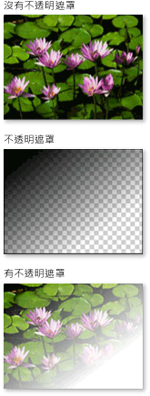
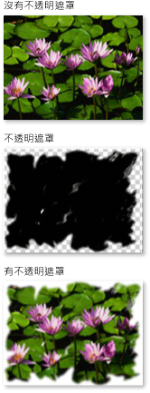
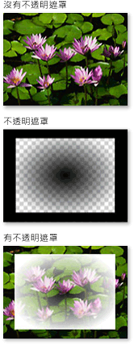

# 不透明遮罩概觀
不透明遮罩可以讓您將部分項目變成透明或部分透明的視覺物件。  若要建立不透明遮罩，請將 <xref:System.Windows.Media.Brush> 套用至項目或 <xref:System.Windows.Media.Visual> 的 <xref:System.Windows.UIElement.OpacityMask%2A> 屬性。  筆刷會對應至項目或視覺物件，而每個筆刷像素的不透明值會決定項目或視覺物件的每個對應像素的不透明結果。  
  
 本主題包含下列章節。  
  
   
-   [必要條件](#prereqs)  
  
-   [使用不透明遮罩建立視覺效果](#opacitymasks)  
  
-   [建立不透明遮罩](#creatingopacitymasks)  
  
-   [使用漸層做為不透明遮罩](#creatingopacitymaskswithgradients)  
  
-   [指定不透明遮罩的漸層停駐點](#specifyinggradientcolors)  
  
-   [使用影像做為不透明遮罩](#usingimageasopacitymask)  
  
-   [從繪圖建立不透明遮罩](#drawingbrushasopacitymask)  
  
-   [相關主題](#seeAlsoToggle)  
  
   
## 必要條件  
 本概觀假設您已熟悉 <xref:System.Windows.Media.Brush> 物件。  如需使用筆刷的簡介，請參閱[使用純色和漸層繪製的概觀](../../../../docs/framework/wpf/graphics-multimedia/painting-with-solid-colors-and-gradients-overview.md)。  如需 <xref:System.Windows.Media.ImageBrush> 和 <xref:System.Windows.Media.DrawingBrush> 的詳細資訊，請參閱[使用影像、繪圖和視覺效果繪製](../../../../docs/framework/wpf/graphics-multimedia/painting-with-images-drawings-and-visuals.md)。  
  
   
## 使用不透明遮罩建立視覺效果  
 不透明遮罩的原理是將其內容對應至項目或視覺物件，  然後使用筆刷中每個像素的 [Alpha 色頻](GTMT)決定項目或視覺物件中對應像素的不透明結果，筆刷的實際色彩則會被忽略。  如果筆刷的某個部分是透明的，項目或視覺物件中的對應部分會變成透明。  如果筆刷的某個部分是不透明的，項目或視覺物件中的對應部分維持不變。  不透明遮罩指定的不透明會與項目或視覺物件中存在的不透明設定結合。  例如，如果項目是 25 % 不透明，而不透明遮罩套用從完全不透明到完全透明的轉換，則項目的結果會從 25 % 不透明轉換成完全透明。  
  
> [!NOTE]
>  雖然本概觀中的範例會示範在影像項目上使用不透明遮罩的情形，但是不透明遮罩可以套用至任何項目或 <xref:System.Windows.Media.Visual>，包括面板和控制項。  
  
 不透明遮罩可以建立有趣的視覺效果，例如建立從檢視中淡出的影像或按鈕、加入紋理至項目，或是合併漸層以產生類似玻璃的表面。  下圖示範使用不透明遮罩的情形。  棋盤式背景會用來顯示遮罩的透明部分。  
  
   
不透明遮罩範例  
  
   
## 建立不透明遮罩  
 若要建立不透明遮罩，請建立 <xref:System.Windows.Media.Brush> 並套用至項目或視覺物件的 <xref:System.Windows.UIElement.OpacityMask%2A> 屬性。  您可以使用任何型別的 <xref:System.Windows.Media.Brush> 做為不透明遮罩的情形。  
  
-   <xref:System.Windows.Media.LinearGradientBrush>, <xref:System.Windows.Media.RadialGradientBrush>：用以製作從檢視淡出的項目或視覺物件。  
  
     下圖顯示使用 <xref:System.Windows.Media.LinearGradientBrush> 做為不透明遮罩的情形。  
  
       
LinearGradientBrush 不透明遮罩範例  
  
-   <xref:System.Windows.Media.ImageBrush>：用以建立紋理和柔邊或撕裂邊的效果。  
  
     下圖顯示使用 <xref:System.Windows.Media.ImageBrush> 做為不透明遮罩的情形。  
  
       
LinearGradientBrush 不透明遮罩範例  
  
-   <xref:System.Windows.Media.DrawingBrush>：用以根據圖案、影像和漸層模式建立複雜的不透明遮罩。  
  
     下圖顯示使用 <xref:System.Windows.Media.DrawingBrush> 做為不透明遮罩的情形。  
  
       
DrawingBrush 不透明遮罩範例  
  
 漸層筆刷 \(<xref:System.Windows.Media.LinearGradientBrush> 和 <xref:System.Windows.Media.RadialGradientBrush>\) 特別適合做為不透明遮罩。  <xref:System.Windows.Media.SolidColorBrush> 會以統一的色彩填滿區域，所以不適合做為不透明遮罩。使用 <xref:System.Windows.Media.SolidColorBrush> 相當於設定項目或視覺物件的 <xref:System.Windows.UIElement.OpacityMask%2A> 屬性。  
  
   
## 使用漸層做為不透明遮罩  
 若要建立漸層填滿，請指定兩個以上的漸層停駐點。  每個漸層停駐點都包含色彩和位置的描述 \(如需建立和使用漸層的詳細資訊，請參閱[使用純色和漸層繪製的概觀](../../../../docs/framework/wpf/graphics-multimedia/painting-with-solid-colors-and-gradients-overview.md)\)。  使用漸層做為不透明遮罩的程序相同，除了不透明遮罩漸層混合的不是色彩，而是 Alpha 色頻值。  所以漸層內容的實際色彩就無關緊要，重要的是每個色彩的 Alpha 色頻或不透明度。  以下是範例。  
  
 [!code-xml[OpacityMasksExample#LinearGradientOpacityMaskonImage](../../../../samples/snippets/csharp/VS_Snippets_Wpf/OpacityMasksExample/CS/GradientBrushExample.xaml#lineargradientopacitymaskonimage)]
 [!code-xml[OpacityMasksExample#LinearGradientOpacityMaskonImage](../../../../samples/snippets/xaml/VS_Snippets_Wpf/OpacityMasksExample/XAML/GradientBrushExample.xaml#lineargradientopacitymaskonimage)]  
  
   
## 指定不透明遮罩的漸層停駐點  
 在上一個範例中，系統定義的色彩 <xref:System.Windows.Media.Colors.Black%2A> 會做為漸層的開始色彩。  因為 <xref:System.Windows.Media.Colors> 類別中的所有色彩 \(<xref:System.Windows.Media.Colors.Transparent%2A> 除外\) 是完全不透明的，所以可以直接用於定義漸層不透明遮罩的開始色彩。  
  
 如需在定義不透明遮罩時對 Alpha 值進行其他控制，您可以在標記中使用 [!INCLUDE[TLA#tla_argb](../../../../includes/tlasharptla-argb-md.md)] 十六進位標記法或者使用 <xref:System.Windows.Media.Color.FromScRgb%2A?displayProperty=fullName> 方法，指定色彩的 Alpha 色頻。  
  
   
### 在 "XAML" 中指定色彩不透明度  
 在 [!INCLUDE[TLA#tla_xaml](../../../../includes/tlasharptla-xaml-md.md)] 中，您可以使用 [!INCLUDE[TLA2#tla_argb](../../../../includes/tla2sharptla-argb-md.md)] 十六進位標記法指定個別色彩的不透明度。  [!INCLUDE[TLA2#tla_argb](../../../../includes/tla2sharptla-argb-md.md)] 十六進位標記法則使用下列語法：  
  
 `#`**aa** *rrggbb*  
  
 上一行中的 *aa* 代表兩個位數的十六進位值，用來指定色彩的不透明度。  *rr*、*gg* 和 *bb* 分別代表兩個位數的十六進位值，用來指定紅色、綠色及藍色的數量。  每個十六進位位數的值可以是 0\-9 或 A\-F。  0 是最小的值，F 是最大的值。  Alpha 值 00 指定色彩為完全透明，而 FF Alpha 值則會建立完全不透明的色彩。  在下列範例中，會使用十六進位 [!INCLUDE[TLA2#tla_argb](../../../../includes/tla2sharptla-argb-md.md)] 標記法指定兩個色彩。  第一個色彩完全不透明，第二個色彩則是完全透明。  
  
 [!code-xml[OpacityMasksExample#AARRGGBBValueonOpacityMask](../../../../samples/snippets/csharp/VS_Snippets_Wpf/OpacityMasksExample/CS/GradientBrushExample.xaml#aarrggbbvalueonopacitymask)]
 [!code-xml[OpacityMasksExample#AARRGGBBValueonOpacityMask](../../../../samples/snippets/xaml/VS_Snippets_Wpf/OpacityMasksExample/XAML/GradientBrushExample.xaml#aarrggbbvalueonopacitymask)]  
  
   
## 使用影像做為不透明遮罩  
 影像也可以做為不透明遮罩。  下圖顯示範例。  棋盤式背景會用來顯示遮罩的透明部分。  
  
   
不透明遮罩範例  
  
 若要使用影像做為不透明遮罩，請使用 <xref:System.Windows.Media.ImageBrush> 來包含影像。  建立影像做為不透明遮罩時，請以支援多個透明層級的格式儲存影像，例如 [!INCLUDE[TLA#tla_png](../../../../includes/tlasharptla-png-md.md)]。  下列範例顯示用以建立上方插圖的程式碼。  
  
 [!code-xml[OpacityMasksExample#UIElementOpacityMask](../../../../samples/snippets/csharp/VS_Snippets_Wpf/OpacityMasksExample/CS/ImageBrushExample.xaml#uielementopacitymask)]
 [!code-xml[OpacityMasksExample#UIElementOpacityMask](../../../../samples/snippets/xaml/VS_Snippets_Wpf/OpacityMasksExample/XAML/ImageBrushExample.xaml#uielementopacitymask)]  
  
   
### 使用並排影像做為不透明遮罩  
 在下列範例中，會對相同的影像使用另一個 <xref:System.Windows.Media.ImageBrush>，但是會使用筆刷的並排功能產生 50x50 個像素的影像的並排。  
  
 [!code-xml[OpacityMasksExample#TiledImageasOpacityMask](../../../../samples/snippets/csharp/VS_Snippets_Wpf/OpacityMasksExample/CS/ImageBrushExample.xaml#tiledimageasopacitymask)]
 [!code-xml[OpacityMasksExample#TiledImageasOpacityMask](../../../../samples/snippets/xaml/VS_Snippets_Wpf/OpacityMasksExample/XAML/ImageBrushExample.xaml#tiledimageasopacitymask)]  
  
   
## 從繪圖建立不透明遮罩  
 繪圖可以做為不透明遮罩。  繪圖中包含的圖案本身可以用漸層、純色、影像或其他繪圖填滿。  下圖顯示使用繪圖做為不透明遮罩的範例。  棋盤式背景會用來顯示遮罩的透明部分。  
  
   
DrawingBrush 不透明遮罩範例  
  
 若要使用繪圖做為不透明遮罩，請使用 <xref:System.Windows.Media.DrawingBrush> 來包含繪圖。  下列範例顯示用以建立上方插圖的程式碼：  
  
 [!code-xml[OpacityMasksExample#OpacityMaskfromDrawing](../../../../samples/snippets/csharp/VS_Snippets_Wpf/OpacityMasksExample/CS/DrawingBrushExample.xaml#opacitymaskfromdrawing)]
 [!code-xml[OpacityMasksExample#OpacityMaskfromDrawing](../../../../samples/snippets/xaml/VS_Snippets_Wpf/OpacityMasksExample/XAML/DrawingBrushExample.xaml#opacitymaskfromdrawing)]  
  
   
### 使用並排繪圖做為不透明遮罩  
 如同 <xref:System.Windows.Media.ImageBrush>，<xref:System.Windows.Media.DrawingBrush> 也可以並排其繪圖。  在下列範例中，會使用繪圖筆刷建立並排的不透明遮罩。  
  
 [!code-xml[OpacityMasksExample#TiledDrawingasOpacityMask](../../../../samples/snippets/csharp/VS_Snippets_Wpf/OpacityMasksExample/CS/DrawingBrushExample.xaml#tileddrawingasopacitymask)]
 [!code-xml[OpacityMasksExample#TiledDrawingasOpacityMask](../../../../samples/snippets/xaml/VS_Snippets_Wpf/OpacityMasksExample/XAML/DrawingBrushExample.xaml#tileddrawingasopacitymask)]  
  
## 請參閱  
 [使用影像、繪圖和視覺效果繪製](../../../../docs/framework/wpf/graphics-multimedia/painting-with-images-drawings-and-visuals.md)   
 [使用純色和漸層繪製的概觀](../../../../docs/framework/wpf/graphics-multimedia/painting-with-solid-colors-and-gradients-overview.md)