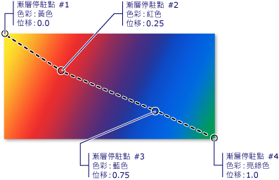
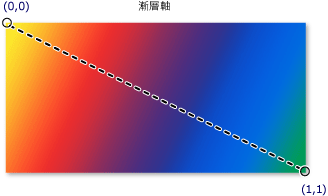
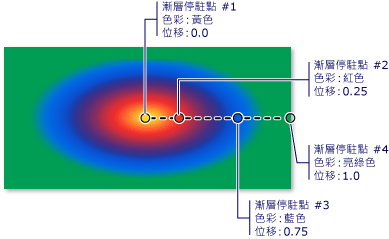

# 使用純色和漸層繪製的概觀
本主題描述如何使用<xref:System.Windows.Media.SolidColorBrush>， <xref:System.Windows.Media.LinearGradientBrush>，和<xref:System.Windows.Media.RadialGradientBrush>來使用純色，線性漸層和放射狀漸層繪製的物件。  
  

  
   
## 使用純色繪製區域  
 其中一個最常見的作業，在任何平台是使用純色繪製區域<xref:System.Windows.Media.Color>。 若要完成這項工作，[!INCLUDE[TLA#tla_winclient](../../../../includes/tlasharptla-winclient-md.md)]提供<xref:System.Windows.Media.SolidColorBrush>類別。 下列章節將說明不同的方式繪製<xref:System.Windows.Media.SolidColorBrush>。  
  
   
### 在 "XAML" 中使用 SolidColorBrush  
 若要在 [!INCLUDE[TLA2#tla_xaml](../../../../includes/tla2sharptla-xaml-md.md)] 中使用純色繪製區域，請使用下列其中一個選項。  
  
-   依據名稱選取預先定義的單色筆刷。  例如，您可以設定按鈕的<xref:System.Windows.Controls.Control.Background%2A>"Red"或"MediumBlue"。  另一份預先定義的純色筆刷，請參閱的靜態屬性<xref:System.Windows.Media.Brushes>類別。 下列為範例。  
  
     [!code-xaml[BrushOverviewExamples_snip#SolidColorBrushNamedColor1XAML](../../../../samples/snippets/xaml/VS_Snippets_Wpf/BrushOverviewExamples_snip/XAML/SolidColorBrushExample.xaml#solidcolorbrushnamedcolor1xaml)]  
  
-   選擇 32 位元色板的其中一個色彩，方法是指定紅色、綠色及藍色的量來混合成單一純色。  指定 32 位元色板中其中一個色彩的格式為 "*#rrggbb*"，其中 *rr* 是指定紅色相對量的兩位數十六進位數字、*gg* 指定綠色的量，而 *bb* 則指定藍色的量。  此外，色彩可以指定為 "#*aarrggbb*"，其中 *aa* 指定色彩的 *alpha* 值 (也就是透明度)。 這個方法可以讓您建立部分透明的色彩。  在下列範例中，<xref:System.Windows.Controls.Control.Background%2A>的<xref:System.Windows.Controls.Button>設定為完全不透明紅色使用十六進位表示法。  
  
     [!code-xaml[BrushOverviewExamples_snip#SolidColorBrushHex1XAML](../../../../samples/snippets/xaml/VS_Snippets_Wpf/BrushOverviewExamples_snip/XAML/SolidColorBrushExample.xaml#solidcolorbrushhex1xaml)]  
  
-   使用屬性標記的語法來描述<xref:System.Windows.Media.SolidColorBrush>。 這個語法比較複雜，但是可以讓您指定額外設定，例如筆刷的不透明度。 在下列範例中，<xref:System.Windows.Controls.Control.Background%2A>兩個屬性<xref:System.Windows.Controls.Button>元素設為完全不透明紅色。 第一個筆刷的色彩是用預先定義的色彩名稱來描述。 第二個筆刷的色彩則是用十六進位標記法來描述。  
  
     [!code-xaml[BrushOverviewExamples_snip#SolidColorBrushPropertyTag1XAML](../../../../samples/snippets/xaml/VS_Snippets_Wpf/BrushOverviewExamples_snip/XAML/SolidColorBrushExample.xaml#solidcolorbrushpropertytag1xaml)]  
  
   
### 在程式碼中使用 SolidColorBrush 繪製  
 若要在程式碼中使用純色繪製區域，請使用下列其中一個選項。  
  
-   使用其中一個預先定義所提供的筆刷<xref:System.Windows.Media.Brushes>類別。 在下列範例中，<xref:System.Windows.Controls.Control.Background%2A>的<xref:System.Windows.Controls.Button>設<xref:System.Windows.Media.Brushes.Red%2A>。  
  
     [!code-csharp[BrushOverviewExamples_snip#SolidColorBrushPredefinedBrush1CSharp](../../../../samples/snippets/csharp/VS_Snippets_Wpf/BrushOverviewExamples_snip/CSharp/SolidColorBrushExample.cs#solidcolorbrushpredefinedbrush1csharp)]  
  
-   建立<xref:System.Windows.Media.SolidColorBrush>並設定其<xref:System.Windows.Media.SolidColorBrush.Color%2A>屬性使用<xref:System.Windows.Media.Color>結構。 您可以使用預先定義的色彩<xref:System.Windows.Media.Colors>類別，或者您可以建立<xref:System.Windows.Media.Color>使用靜態<xref:System.Windows.Media.Color.FromArgb%2A>方法。  
  
     下列範例示範如何設定<xref:System.Windows.Media.SolidColorBrush.Color%2A>屬性<xref:System.Windows.Media.SolidColorBrush>使用預先定義的色彩。  
  
     [!code-csharp[BrushOverviewExamples_snip#SolidColorBrushPredefinedColor1CSharp](../../../../samples/snippets/csharp/VS_Snippets_Wpf/BrushOverviewExamples_snip/CSharp/SolidColorBrushExample.cs#solidcolorbrushpredefinedcolor1csharp)]  
  
 靜態<xref:System.Windows.Media.Color.FromArgb%2A>可讓您指定的色彩 alpha、 紅色、 綠色和藍色值。 這些值的範圍通常都是 0-255。 例如，Alpha 值為 0 時表示色彩是完全透明的，而值為 255 時表示色彩是完全不透明的。 同樣地，紅色值為 0 時表示色彩中沒有紅色，而值為 255 時表示色彩中具有最大量的紅色。  在下列範例中，筆刷色彩是透過指定 Alpha、紅色、綠色及藍色值來加以描述。  
  
 [!code-csharp[BrushOverviewExamples_snip#SolidColorBrushfromArgbExample1CSharp](../../../../samples/snippets/csharp/VS_Snippets_Wpf/BrushOverviewExamples_snip/CSharp/SolidColorBrushExample.cs#solidcolorbrushfromargbexample1csharp)]  
  
 如需其他方式指定色彩，請參閱<xref:System.Windows.Media.Color>參考主題。  
  
   
## 使用漸層繪製區域  
 漸層筆刷會使用多種色彩繪製區域，這些色彩會沿著某個軸逐漸相互融合。 您可以使用它們來建立光影效果，讓控制項有立體的感覺。 您也可以使用它們來模擬玻璃、金屬、水和其他平滑表面。  [!INCLUDE[TLA2#tla_winclient](../../../../includes/tla2sharptla-winclient-md.md)] 提供兩種漸層筆刷類型：<xref:System.Windows.Media.LinearGradientBrush>和<xref:System.Windows.Media.RadialGradientBrush>。  
  
   
## 線形漸層  
 A<xref:System.Windows.Media.LinearGradientBrush>線條，定義漸層繪製區域*漸層軸*。  您指定之漸層色彩和其位置的漸層軸使用沿著<xref:System.Windows.Media.GradientStop>物件。  您也可以修改漸層軸，這可讓您建立水平和垂直漸層，以及反轉漸層方向。 漸層軸會在下一節中說明。 預設會建立對角線的漸層。  
  
 下列範例顯示能建立由四個色彩組成之線形漸層的程式碼。  
  
 [!code-xaml[GradientBrushExamples_snip#DiagonalGradient1XAML](../../../../samples/snippets/xaml/VS_Snippets_Wpf/GradientBrushExamples_snip/XAML/LinearGradientBrushExample.xaml#diagonalgradient1xaml)]  
  
 [!code-csharp[GradientBrushExamples_snip#DiagonalGradient1CSharp](../../../../samples/snippets/csharp/VS_Snippets_Wpf/GradientBrushExamples_snip/CSharp/LinearGradientBrushExample.cs#diagonalgradient1csharp)]  
  
 這個程式碼會產生下列漸層：  
  
   
  
 **注意：**本主題中的漸層範例會使用預設座標系統來設定起始點和結束點。 預設座標系統是相對於週框方塊：0 表示週框方塊的 0%，而 1 表示週框方塊的 100%。 您可以設定來變更座標系統<xref:System.Windows.Media.GradientBrush.MappingMode%2A>屬性設為值<xref:System.Windows.Media.BrushMappingMode.Absolute>。 絕對座標系統不會相對於週框方塊。 值會直接在本機空間中解譯。  
  
 <xref:System.Windows.Media.GradientStop>是漸層筆刷的基本建置組塊。  指定漸層停駐<xref:System.Windows.Media.GradientStop.Color%2A>在<xref:System.Windows.Media.GradientStop.Offset%2A>漸層軸上。  
  
-   漸層停駐的<xref:System.Windows.Media.GradientStop.Color%2A>屬性會指定漸層停駐點的色彩。 您可能會設定使用預先定義的色彩的色彩 (所提供<xref:System.Windows.Media.Colors>類別) 或藉由指定 ScRGB 或 ARGB 值。 在 [!INCLUDE[TLA2#tla_xaml](../../../../includes/tla2sharptla-xaml-md.md)] 中，您也可以使用十六進位標記法來描述色彩。 如需詳細資訊，請參閱<xref:System.Windows.Media.Color>結構。  
  
-   漸層停駐的<xref:System.Windows.Media.GradientStop.Offset%2A>屬性會指定位置的漸層停駐的色彩漸層軸上。 位移是<xref:System.Double>，範圍從 0 到 1。 漸層停駐點的位移值越接近 0，色彩就越接近漸層起始點。 漸層的位移值越接近 1，色彩就越接近漸層結束點。  
  
 漸層停駐點之間每個點的色彩，是以線性方式插入為兩個相鄰漸層停駐點所指定之色彩的組合。 下圖將上一個範例中的漸層停駐點醒目提示。 圓圈標記出漸層停駐點的位置，虛線則表示漸層軸。  
  
   
  
 第一個漸層停駐點在位移 `0.0` 處指定黃色的色彩。  第二個漸層停駐點在位移 `0.25` 處指定紅色的色彩。  沿著漸層軸從左移到右時，這兩個停駐點之間的點會逐漸從黃色變成紅色。  第三個漸層停駐點在位移 `0.75` 處指定藍色的色彩。  第二個和第三個漸層停駐點之間的點會逐漸從紅色變成藍色。 第四個漸層停駐點在位移 `1.0` 處指定淡黃綠色的色彩。 第三個和第四個漸層停駐點之間的點會逐漸從藍色變成淡黃綠色。  
  
   
### 漸層軸  
 如同之前所說明的，線性漸層筆刷的漸層停駐點會落在沿著線條 (漸層軸) 的位置上。 您可以變更的方向和使用筆刷的大小<xref:System.Windows.Media.LinearGradientBrush.StartPoint%2A>和<xref:System.Windows.Media.LinearGradientBrush.EndPoint%2A>屬性。 藉由操作的筆刷<xref:System.Windows.Media.LinearGradientBrush.StartPoint%2A>和<xref:System.Windows.Media.LinearGradientBrush.EndPoint%2A>、 您可以建立水平及垂直漸層反轉漸層的方向，縮合漸層的模式，以及其他更多。  
  
 根據預設，線性漸層筆刷的<xref:System.Windows.Media.LinearGradientBrush.StartPoint%2A>和<xref:System.Windows.Media.LinearGradientBrush.EndPoint%2A>相對於所繪製的區域。 點 (0,0) 表示要繪製之區域的左上角，而 (1,1) 則表示要繪製之區域的右下角。 預設值<xref:System.Windows.Media.LinearGradientBrush.StartPoint%2A>的<xref:System.Windows.Media.LinearGradientBrush>為 (0，0)，和其預設<xref:System.Windows.Media.LinearGradientBrush.EndPoint%2A>是 (1，1)，這樣就可以建立的對角線漸層開始左上角和右下角正在繪製之區域的擴充。 下圖顯示預設值的線性漸層筆刷的漸層軸<xref:System.Windows.Media.LinearGradientBrush.StartPoint%2A>和<xref:System.Windows.Media.LinearGradientBrush.EndPoint%2A>。  
  
   
  
 下列範例示範如何建立在水平漸層藉由指定的筆刷<xref:System.Windows.Media.LinearGradientBrush.StartPoint%2A>和<xref:System.Windows.Media.LinearGradientBrush.EndPoint%2A>。 請注意，漸層停駐點與前一個範例中，相同只要變更<xref:System.Windows.Media.LinearGradientBrush.StartPoint%2A>和<xref:System.Windows.Media.LinearGradientBrush.EndPoint%2A>，所使用漸層已從對角線變更為水平。  
  
 [!code-xaml[GradientBrushExamples_snip#HorizontalGradient1XAML](../../../../samples/snippets/xaml/VS_Snippets_Wpf/GradientBrushExamples_snip/XAML/LinearGradientBrushExample.xaml#horizontalgradient1xaml)]  
  
 [!code-csharp[GradientBrushExamples_snip#HorizontalGradient1CSharp](../../../../samples/snippets/csharp/VS_Snippets_Wpf/GradientBrushExamples_snip/CSharp/LinearGradientBrushExample.cs#horizontalgradient1csharp)]  
  
 下圖顯示建立的漸層。 漸層軸以虛線標示，而漸層停駐點則以圓圈標示。  
  
   
  
 下一個範例顯示如何建立垂直漸層。  
  
 [!code-xaml[GradientBrushExamples_snip#VerticalGradient1XAML](../../../../samples/snippets/xaml/VS_Snippets_Wpf/GradientBrushExamples_snip/XAML/LinearGradientBrushExample.xaml#verticalgradient1xaml)]  
  
 [!code-csharp[GradientBrushExamples_snip#VerticalGradient1CSharp](../../../../samples/snippets/csharp/VS_Snippets_Wpf/GradientBrushExamples_snip/CSharp/LinearGradientBrushExample.cs#verticalgradient1csharp)]  
  
 下圖顯示建立的漸層。 漸層軸以虛線標示，而漸層停駐點則以圓圈標示。  
  
   
  
   
## 放射狀漸層  
 像<xref:System.Windows.Media.LinearGradientBrush>、<xref:System.Windows.Media.RadialGradientBrush>繪製區域的色彩混合在一起沿座標軸。 前述範例顯示線性漸層筆刷的軸是條直線。 放射狀漸層筆刷的軸則是由圓圈定義，其色彩會從其原點向外「放射」。  
  
 在下列範例中，會使用放射狀漸層筆刷來繪製矩形的內部。  
  
 [!code-xaml[GradientBrushExamples_snip#RadialGradient1XAML](../../../../samples/snippets/xaml/VS_Snippets_Wpf/GradientBrushExamples_snip/XAML/RadialGradientBrushExample.xaml#radialgradient1xaml)]  
  
 [!code-csharp[GradientBrushExamples_snip#RadialGradient1CSharp](../../../../samples/snippets/csharp/VS_Snippets_Wpf/GradientBrushExamples_snip/CSharp/RadialGradientBrushExample.cs#radialgradient1csharp)]  
  
 下圖顯示在上一個範例中建立的漸層。 其中已將筆刷的漸層停駐點醒目提示。 請注意，雖然結果不同，但是這個範例中的漸層停駐點與先前線性漸層筆刷範例中的漸層停駐點是相同的。  
  
   
  
 <xref:System.Windows.Media.RadialGradientBrush.GradientOrigin%2A>指定放射狀漸層筆刷的漸層軸的起始點。 漸層軸會從漸層原點放射至漸層圓圈。 筆刷的漸層的圓形由定義其<xref:System.Windows.Media.RadialGradientBrush.Center%2A>， <xref:System.Windows.Media.RadialGradientBrush.RadiusX%2A>，和<xref:System.Windows.Media.RadialGradientBrush.RadiusY%2A>屬性。  
  
 下圖顯示數個不同的放射狀漸層<xref:System.Windows.Media.RadialGradientBrush.GradientOrigin%2A>， <xref:System.Windows.Media.RadialGradientBrush.Center%2A>， <xref:System.Windows.Media.RadialGradientBrush.RadiusX%2A>，和<xref:System.Windows.Media.RadialGradientBrush.RadiusY%2A>設定。  
  
   
具有不同 GradientOrigin、Center、RadiusX 及 RadiusY 設定的 RadialGradientBrush。  
  
   
## 指定透明或部分透明的漸層停駐點  
 因為漸層停駐點不會提供不透明屬性，您必須指定使用的色彩的 alpha 色板[!INCLUDE[TLA#tla_argb](../../../../includes/tlasharptla-argb-md.md)]標記中使用十六進位表示法來<xref:System.Windows.Media.Color.FromScRgb%2A?displayProperty=nameWithType>方法來建立透明或透明部分的漸層停駐點。 下列各節會說明如何使用 [!INCLUDE[TLA2#tla_xaml](../../../../includes/tla2sharptla-xaml-md.md)] 和程式碼建立部分透明的漸層停駐點。  
  
   
### 在 "XAML" 中指定色彩不透明度  
 在 [!INCLUDE[TLA2#tla_xaml](../../../../includes/tla2sharptla-xaml-md.md)] 中，您會使用 [!INCLUDE[TLA2#tla_argb](../../../../includes/tla2sharptla-argb-md.md)] 十六進位標記法來指定個別色彩的不透明度。 [!INCLUDE[TLA2#tla_argb](../../../../includes/tla2sharptla-argb-md.md)] 十六進位標記法使用下列語法：  
  
 `#` **aa** *rrggbb*  
  
 上一行中的 *aa* 代表用來指定色彩不透明度的兩位數十六進位值。 *rr*、*gg* 和 *bb* 分別代表用來指定色彩中紅色、綠色及藍色量的兩位數十六進位值。 每個十六進位位數的值可以是 0-9 或 A-F。 0 是最小的值，F 是最大的值。 Alpha 值為 00 時會指定完全透明的色彩，而 Alpha 值為 FF 時則會建立完全不透明的色彩。  在下列範例中，會使用十六進位 [!INCLUDE[TLA2#tla_argb](../../../../includes/tla2sharptla-argb-md.md)] 標記法指定兩個色彩。 第一個為部分透明 (具有 x20 的 Alpha 值)，而第二個則是完全不透明。  
  
 [!code-xaml[GradientBrushExamples_snip#TransparentGradientStopExample1XAML](../../../../samples/snippets/xaml/VS_Snippets_Wpf/GradientBrushExamples_snip/XAML/GradientStopsExample.xaml#transparentgradientstopexample1xaml)]  
  
   
### 在程式碼中指定色彩不透明度  
 使用程式碼中，靜態時<xref:System.Windows.Media.Color.FromArgb%2A>方法可讓您指定的 alpha 值建立色彩。 此方法採用四個參數的型別<xref:System.Byte>。 第一個參數會指定色彩的 Alpha 色板，其他三個參數則會指定色彩的紅色、綠色及藍色值。 每個值都應介於 0 到 255 之間 (含 0 和 255)。 Alpha 值為 0 時會指定色彩為完全透明，而 Alpha 值為 255 時則指定色彩為完全不透明。 在下列範例中，<xref:System.Windows.Media.Color.FromArgb%2A>方法用來產生兩種色彩。 第一個色彩為部分透明 (具有 32 的 Alpha 值)，而第二個色彩則是完全不透明。  
  
 [!code-csharp[GradientBrushExamples_snip#TransparentGradientStopExample1CSharp](../../../../samples/snippets/csharp/VS_Snippets_Wpf/GradientBrushExamples_snip/CSharp/GradientStopsExample.cs#transparentgradientstopexample1csharp)]  
  
 或者，您可能使用<xref:System.Windows.Media.Color.FromScRgb%2A>方法，可讓您使用 ScRGB 值建立色彩。  
  
   
## 使用影像、繪圖、視覺效果及圖樣繪製  
 <xref:System.Windows.Media.ImageBrush><xref:System.Windows.Media.DrawingBrush>，和<xref:System.Windows.Media.VisualBrush>類別可讓您使用影像、 繪圖、 或視覺效果繪製區域。 如需使用影像、繪圖及圖樣繪製的相關資訊，請參閱[使用影像、繪圖和視覺效果繪製](../../../../docs/framework/wpf/graphics-multimedia/painting-with-images-drawings-and-visuals.md)。  
  
## 另請參閱  
 <xref:System.Windows.Media.Brush>  
 <xref:System.Windows.Media.SolidColorBrush>  
 <xref:System.Windows.Media.LinearGradientBrush>  
 <xref:System.Windows.Media.RadialGradientBrush>  
 [使用影像、繪圖和視覺效果繪製](../../../../docs/framework/wpf/graphics-multimedia/painting-with-images-drawings-and-visuals.md)  
 [筆刷轉換概觀](../../../../docs/framework/wpf/graphics-multimedia/brush-transformation-overview.md)  
 [圖形轉譯層](../../../../docs/framework/wpf/advanced/graphics-rendering-tiers.md)
