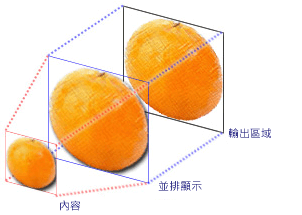
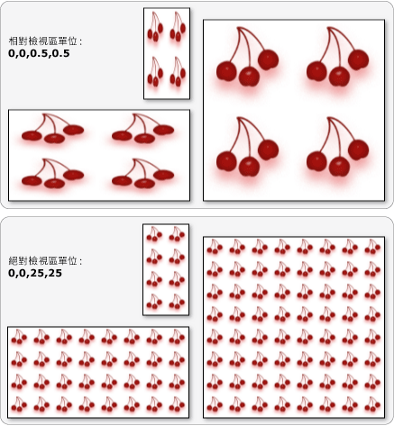

# TileBrush 概觀TileBrush Overview
<xref:System.Windows.Media.TileBrush> 物件可讓您充分掌控使用影像，繪製區域的足夠<xref:System.Windows.Media.Drawing>，或<xref:System.Windows.Media.Visual>。<xref:System.Windows.Media.TileBrush> objects provide you with a great deal of control over how an area is painted with an image, <xref:System.Windows.Media.Drawing>, or <xref:System.Windows.Media.Visual>. 本主題描述如何使用<xref:System.Windows.Media.TileBrush>功能以獲得更充分掌控如何<xref:System.Windows.Media.ImageBrush>， <xref:System.Windows.Media.DrawingBrush>，或<xref:System.Windows.Media.VisualBrush>繪製區域。This topic describes how to use <xref:System.Windows.Media.TileBrush> features to gain more control over how an <xref:System.Windows.Media.ImageBrush>, <xref:System.Windows.Media.DrawingBrush>, or <xref:System.Windows.Media.VisualBrush> paints an area.  
  
  
   
## 必要條件Prerequisites  
 若要了解本主題，最好先了解如何使用的基本功能<xref:System.Windows.Media.ImageBrush>， <xref:System.Windows.Media.DrawingBrush>，或<xref:System.Windows.Media.VisualBrush>類別。To understand this topic, it's helpful to understand how to use the basic features of the <xref:System.Windows.Media.ImageBrush>, <xref:System.Windows.Media.DrawingBrush>, or <xref:System.Windows.Media.VisualBrush> class. 如需這些類型的簡介，請參閱[使用影像、 繪圖和視覺效果繪製](../../../../docs/framework/wpf/graphics-multimedia/painting-with-images-drawings-and-visuals.md)。For an introduction to these types, see the [Painting with Images, Drawings, and Visuals](../../../../docs/framework/wpf/graphics-multimedia/painting-with-images-drawings-and-visuals.md).  
  
   
## 以並排顯示繪製區域Painting an Area with Tiles  
 <xref:System.Windows.Media.ImageBrush><xref:System.Windows.Media.DrawingBrush>，會<xref:System.Windows.Media.VisualBrush>種<xref:System.Windows.Media.TileBrush>物件。<xref:System.Windows.Media.ImageBrush>, <xref:System.Windows.Media.DrawingBrush>, are <xref:System.Windows.Media.VisualBrush> are types of <xref:System.Windows.Media.TileBrush> objects. 拼貼筆刷讓您對使用影像、繪圖或視覺效果繪製區域的方式擁有更多的控制。Tile brushes provide you with a great deal of control over how an area is painted with an image, drawing, or visual. 例如，您可以用構成圖樣的一系列影像並排顯示來繪製區域，而不是只以單一自動縮放的影像來繪製區域。For example, instead of just painting an area with a single stretched image, you can paint an area with a series of image tiles that create a pattern.  
  
 使用拼貼筆刷繪製區域會牽涉到三個元件：內容、基底並排顯示及輸出區域。Painting an area with a tile brush involves three components: content, the base tile, and the output area.  
  
   
具有單一並排顯示之 TileBrush 的元件Components of a TileBrush with a single tile  
  
   
TileMode 為 Tile 之 TileBrush 的元件Components of a TileBrush with a TileMode of Tile  
  
 輸出區域就是要繪製的區域，例如<xref:System.Windows.Shapes.Shape.Fill%2A>的<xref:System.Windows.Shapes.Ellipse>或<xref:System.Windows.Controls.Control.Background%2A>的<xref:System.Windows.Controls.Button>。The output area is the area being painted, such as the <xref:System.Windows.Shapes.Shape.Fill%2A> of an <xref:System.Windows.Shapes.Ellipse> or the <xref:System.Windows.Controls.Control.Background%2A> of a <xref:System.Windows.Controls.Button>. 下一節中描述的其他兩個元件<xref:System.Windows.Media.TileBrush>。The next sections describe the other two components of a <xref:System.Windows.Media.TileBrush>.  
  
   
## 筆刷內容Brush Content  
 有三種不同類型的<xref:System.Windows.Media.TileBrush>和每個繪製不同類型的內容。There are three different types of <xref:System.Windows.Media.TileBrush> and each paints with a different type of content.  
  
-   如果筆刷<xref:System.Windows.Media.ImageBrush>，此內容是映像<xref:System.Windows.Media.ImageBrush.ImageSource%2A>屬性指定的內容<xref:System.Windows.Media.ImageBrush>。If the brush is an <xref:System.Windows.Media.ImageBrush>, this content is an image The <xref:System.Windows.Media.ImageBrush.ImageSource%2A> property specifies the contents of the <xref:System.Windows.Media.ImageBrush>.  
  
-   如果筆刷是<xref:System.Windows.Media.DrawingBrush>，此內容為繪圖。If the brush is a <xref:System.Windows.Media.DrawingBrush>, this content is a drawing. <xref:System.Windows.Media.DrawingBrush.Drawing%2A>屬性指定的內容<xref:System.Windows.Media.DrawingBrush>。The <xref:System.Windows.Media.DrawingBrush.Drawing%2A> property specifies the contents of the <xref:System.Windows.Media.DrawingBrush>.  
  
-   如果筆刷是<xref:System.Windows.Media.VisualBrush>，此內容為視覺物件。If the brush is a <xref:System.Windows.Media.VisualBrush>, this content is a visual. <xref:System.Windows.Media.VisualBrush.Visual%2A>屬性指定的內容<xref:System.Windows.Media.VisualBrush>。The <xref:System.Windows.Media.VisualBrush.Visual%2A> property specifies the content of the <xref:System.Windows.Media.VisualBrush>.  
  
 您可以指定的位置和維度<xref:System.Windows.Media.TileBrush>使用內容<xref:System.Windows.Media.TileBrush.Viewbox%2A>屬性，雖然它會保留<xref:System.Windows.Media.TileBrush.Viewbox%2A>設為其預設值。You can specify the position and dimensions of <xref:System.Windows.Media.TileBrush> content by using the <xref:System.Windows.Media.TileBrush.Viewbox%2A> property, although it is common to leave the <xref:System.Windows.Media.TileBrush.Viewbox%2A> set to its default value. 根據預設，<xref:System.Windows.Media.TileBrush.Viewbox%2A>設定為完整包含筆刷的內容。By default, the <xref:System.Windows.Media.TileBrush.Viewbox%2A> is configured to completely contain the brush's contents. 如需設定的詳細資訊<xref:System.Windows.Controls.Viewbox>，請參閱<xref:System.Windows.Controls.Viewbox>屬性頁。For more information about configuring the <xref:System.Windows.Controls.Viewbox>, see the <xref:System.Windows.Controls.Viewbox> property page.  
  
   
## 基底並排顯示The Base Tile  
 A<xref:System.Windows.Media.TileBrush>其內容投影基底的並排顯示。A <xref:System.Windows.Media.TileBrush> projects its content onto a base tile. <xref:System.Windows.Media.TileBrush.Stretch%2A>屬性會控制如何<xref:System.Windows.Media.TileBrush>內容會縮放以填滿基底的並排顯示。The <xref:System.Windows.Media.TileBrush.Stretch%2A> property controls how <xref:System.Windows.Media.TileBrush> content is stretched to fill the base tile. <xref:System.Windows.Media.TileBrush.Stretch%2A>屬性可以接受下列值所定義<xref:System.Windows.Media.Stretch>列舉型別：The <xref:System.Windows.Media.TileBrush.Stretch%2A> property accepts the following values, defined by the <xref:System.Windows.Media.Stretch> enumeration:  
  
-   <xref:System.Windows.Media.Stretch.None>： 筆刷的內容不會縮放以填滿並排顯示。<xref:System.Windows.Media.Stretch.None>: The brush's content is not stretched to fill the tile.  
  
-   <xref:System.Windows.Media.Stretch.Fill>： 將筆刷的內容會縮放以符合並排顯示。<xref:System.Windows.Media.Stretch.Fill>: The brush's content is scaled to fit the tile. 因為內容的高度和寬度會分開縮放，所以可能不會保留內容的原始外觀比例。Because the content's height and width are scaled independently, the original aspect ratio of the content might not be preserved. 也就是說，筆刷的內容可能會變形以完全填滿輸出並排顯示。That is, the brush's content might be warped in order to completely fill the output tile.  
  
-   <xref:System.Windows.Media.Stretch.Uniform>： 筆刷的內容會縮放，以完全符合並排顯示。<xref:System.Windows.Media.Stretch.Uniform>: The brush's content is scaled so that it fits completely within the tile. 這會維持內容的外觀比例。The content's aspect ratio is preserved.  
  
-   <xref:System.Windows.Media.Stretch.UniformToFill>： 筆刷的內容會縮放，讓它完全填滿輸出區域，同時維持原始外觀比例的內容。<xref:System.Windows.Media.Stretch.UniformToFill>: The brush's content is scaled so that it completely fills the output area while preserving the content's original aspect ratio.  
  
 下圖說明不同<xref:System.Windows.Media.TileBrush.Stretch%2A>設定。The following image illustrates the different <xref:System.Windows.Media.TileBrush.Stretch%2A> settings.  
  
   
  
 在下列範例中，內容<xref:System.Windows.Media.ImageBrush>設定，使它不會自動縮放以填滿輸出區域。In the following example, the content of an <xref:System.Windows.Media.ImageBrush> is set so that it does not stretch to fill the output area.  
  
 [!code-xaml[BrushOverviewExamples_snip#GraphicsMMNoStretchExample](../../../../samples/snippets/xaml/VS_Snippets_Wpf/BrushOverviewExamples_snip/XAML/StretchExample.xaml#graphicsmmnostretchexample)]  
  
 [!code-csharp[BrushOverviewExamples_procedural_snip#GraphicsMMNoStretchExample](../../../../samples/snippets/csharp/VS_Snippets_Wpf/BrushOverviewExamples_procedural_snip/CSharp/StretchExample.cs#graphicsmmnostretchexample)]
 [!code-vb[BrushOverviewExamples_procedural_snip#GraphicsMMNoStretchExample](../../../../samples/snippets/visualbasic/VS_Snippets_Wpf/BrushOverviewExamples_procedural_snip/visualbasic/stretchexample.vb#graphicsmmnostretchexample)]  
  
 根據預設，<xref:System.Windows.Media.TileBrush>會產生單一並排顯示 （基底的並排顯示），並會自動縮放該並排顯示以完全填滿輸出區域。By default, a <xref:System.Windows.Media.TileBrush> generates a single tile (the base tile) and stretches that tile to completely fill the output area. 您可以藉由設定變更的大小和位置的基底的並排<xref:System.Windows.Media.TileBrush.Viewport%2A>和<xref:System.Windows.Media.TileBrush.ViewportUnits%2A>屬性。You can change the size and position of the base tile by setting the <xref:System.Windows.Media.TileBrush.Viewport%2A> and <xref:System.Windows.Media.TileBrush.ViewportUnits%2A> properties.  
  
   
### 基底並排顯示大小Base Tile Size  
 <xref:System.Windows.Media.TileBrush.Viewport%2A>屬性會決定的大小和位置的基底的並排顯示，而<xref:System.Windows.Media.TileBrush.ViewportUnits%2A>屬性會決定是否<xref:System.Windows.Media.TileBrush.Viewport%2A>指定使用絕對或相對座標。The <xref:System.Windows.Media.TileBrush.Viewport%2A> property determines the size and position of the base tile, and the <xref:System.Windows.Media.TileBrush.ViewportUnits%2A> property determines whether the <xref:System.Windows.Media.TileBrush.Viewport%2A> is specified using absolute or relative coordinates. 如果是相對座標，則它們會相對於輸出區域的大小。If the coordinates are relative, they are relative to the size of the output area. (0,0) 這個點表示輸出區域的左上角，而 (1,1) 則表示輸出區域的右下角。The point (0,0) represents the top left corner of the output area, and (1,1) represents the bottom right corner of the output area. 若要指定<xref:System.Windows.Media.TileBrush.Viewport%2A>屬性使用絕對座標，請將<xref:System.Windows.Media.TileBrush.ViewportUnits%2A>屬性設<xref:System.Windows.Media.BrushMappingMode.Absolute>。To specify that the <xref:System.Windows.Media.TileBrush.Viewport%2A> property uses absolute coordinates, set the <xref:System.Windows.Media.TileBrush.ViewportUnits%2A> property to <xref:System.Windows.Media.BrushMappingMode.Absolute>.  
  
 下圖顯示在輸出之間的差異<xref:System.Windows.Media.TileBrush>使用相對與絕對<xref:System.Windows.Media.TileBrush.ViewportUnits%2A>。The following illustration shows the difference in output between a <xref:System.Windows.Media.TileBrush> with relative versus absolute <xref:System.Windows.Media.TileBrush.ViewportUnits%2A>. 請注意，每個圖例都會顯示並排顯示圖樣，下一節會說明如何指定並排顯示圖樣。Notice that the illustrations each show a tiled pattern; the next section describes how to specify tile pattern.  
  
   
  
 在下列範例中，會使用影像建立 50% 寬度和高度的並排顯示。In the following example, an image is used to create a tile that has a width and height of 50%. 基底並排顯示位於輸出區域的 (0,0)。The base tile is located at (0,0) of the output area.  
  
 [!code-xaml[BrushOverviewExamples_snip#GraphicsMMRelativeViewportUnitsExample1](../../../../samples/snippets/xaml/VS_Snippets_Wpf/BrushOverviewExamples_snip/XAML/TileSizeExample.xaml#graphicsmmrelativeviewportunitsexample1)]  
  
 [!code-csharp[BrushOverviewExamples_procedural_snip#GraphicsMMRelativeViewportUnitsExample1](../../../../samples/snippets/csharp/VS_Snippets_Wpf/BrushOverviewExamples_procedural_snip/CSharp/TileSizeExample.cs#graphicsmmrelativeviewportunitsexample1)]
 [!code-vb[BrushOverviewExamples_procedural_snip#GraphicsMMRelativeViewportUnitsExample1](../../../../samples/snippets/visualbasic/VS_Snippets_Wpf/BrushOverviewExamples_procedural_snip/visualbasic/tilesizeexample.vb#graphicsmmrelativeviewportunitsexample1)]  
  
 下一個範例中設定的圖格<xref:System.Windows.Media.ImageBrush>25 乘以 25 個裝置獨立像素。The next example sets the tiles of an <xref:System.Windows.Media.ImageBrush> to 25 by 25 device independent pixels. 因為<xref:System.Windows.Media.TileBrush.ViewportUnits%2A>是絕對的<xref:System.Windows.Media.ImageBrush>圖格都是 25 乘以 25 個像素，不論要繪製之區域的大小。Because the <xref:System.Windows.Media.TileBrush.ViewportUnits%2A> are absolute, the <xref:System.Windows.Media.ImageBrush> tiles are always 25 by 25 pixels, regardless of the size of the area being painted.  
  
 [!code-xaml[BrushOverviewExamples_snip#GraphicsMMAbsoluteViewportUnitsExample1](../../../../samples/snippets/xaml/VS_Snippets_Wpf/BrushOverviewExamples_snip/XAML/TileSizeExample.xaml#graphicsmmabsoluteviewportunitsexample1)]  
  
 [!code-csharp[BrushOverviewExamples_procedural_snip#GraphicsMMAbsoluteViewportUnitsExample1](../../../../samples/snippets/csharp/VS_Snippets_Wpf/BrushOverviewExamples_procedural_snip/CSharp/TileSizeExample.cs#graphicsmmabsoluteviewportunitsexample1)]
 [!code-vb[BrushOverviewExamples_procedural_snip#GraphicsMMAbsoluteViewportUnitsExample1](../../../../samples/snippets/visualbasic/VS_Snippets_Wpf/BrushOverviewExamples_procedural_snip/visualbasic/tilesizeexample.vb#graphicsmmabsoluteviewportunitsexample1)]  
  
   
### 並排顯示行為Tiling Behavior  
 A<xref:System.Windows.Media.TileBrush>其基底的並排顯示不完全填滿輸出區域和並排顯示模式以外時，會產生並排顯示的圖樣<xref:System.Windows.Media.TileMode.None>指定。A <xref:System.Windows.Media.TileBrush> produces a tiled pattern when its base tile does not completely fill the output area and a tiling mode other then <xref:System.Windows.Media.TileMode.None> is specified. 拼貼筆刷的並排顯示不完全填滿輸出區域中，當其<xref:System.Windows.Media.TileBrush.TileMode%2A>屬性指定是否應該重複來填滿輸出區域的基底的並排顯示而且若是如此，基底的並排顯示應重複。When a tile brush's tile does not completely fill the output area, its <xref:System.Windows.Media.TileBrush.TileMode%2A> property specifies whether the base tile should be duplicated to fill the output area and, if so, how the base tile should be duplicated. <xref:System.Windows.Media.TileBrush.TileMode%2A>屬性可以接受下列值所定義<xref:System.Windows.Media.TileMode>列舉型別：The <xref:System.Windows.Media.TileBrush.TileMode%2A> property accepts the following values, defined by the <xref:System.Windows.Media.TileMode> enumeration:  
  
-   <xref:System.Windows.Media.TileMode.None>： 只基底的並排顯示繪製。<xref:System.Windows.Media.TileMode.None>: Only the base tile is drawn.  
  
-   <xref:System.Windows.Media.TileMode.Tile>： 繪製基底的並排顯示，並重複基底的並排顯示，因此一個圖格的右邊緣相鄰的左邊緣的 [下一步]，並同樣地上下填滿剩餘的區域。<xref:System.Windows.Media.TileMode.Tile>: The base tile is drawn and the remaining area is filled by repeating the base tile such that the right edge of one tile is adjacent to the left edge of the next, and similarly for bottom and top.  
  
-   <xref:System.Windows.Media.TileMode.FlipX>： 與相同<xref:System.Windows.Media.TileMode.Tile>，但是替代的資料行的圖格會以水平翻轉。<xref:System.Windows.Media.TileMode.FlipX>: The same as <xref:System.Windows.Media.TileMode.Tile>, but alternate columns of tiles are flipped horizontally.  
  
-   <xref:System.Windows.Media.TileMode.FlipY>： 與相同<xref:System.Windows.Media.TileMode.Tile>，但會以垂直方式翻轉磚的替代資料列。<xref:System.Windows.Media.TileMode.FlipY>: The same as <xref:System.Windows.Media.TileMode.Tile>, but alternate rows of tiles are flipped vertically.  
  
-   <xref:System.Windows.Media.TileMode.FlipXY>： 的組合<xref:System.Windows.Media.TileMode.FlipX>和<xref:System.Windows.Media.TileMode.FlipY>。<xref:System.Windows.Media.TileMode.FlipXY>: A combination of <xref:System.Windows.Media.TileMode.FlipX> and <xref:System.Windows.Media.TileMode.FlipY>.  
  
 下列影像說明不同的並排顯示模式。The following image illustrates the different tiling modes.  
  
   
  
 在下列範例中，會使用影像繪製 100 像素寬及 100 像素高的矩形。In the following example, an image is used to paint a rectangle that is 100 pixels wide and 100 pixels tall. 藉由設定筆刷的<xref:System.Windows.Media.TileBrush.Viewport%2A>byla nastavena 0,0,0.25,0.25，到筆刷的基底的並排顯示設為 1/4 的輸出區域。By setting the brush's <xref:System.Windows.Media.TileBrush.Viewport%2A> has been set to 0,0,0.25,0.25, the brush's base tile is made to be 1/4 of the output area. 筆刷<xref:System.Windows.Media.TileBrush.TileMode%2A>設為<xref:System.Windows.Media.TileMode.FlipXY>。The brush's <xref:System.Windows.Media.TileBrush.TileMode%2A> is set to <xref:System.Windows.Media.TileMode.FlipXY>. 所以會以並排顯示列填滿矩形。so that it fills the rectangle with rows of tiles.  
  
 [!code-xaml[BrushOverviewExamples_snip#GraphicsMMFlipXYExample](../../../../samples/snippets/xaml/VS_Snippets_Wpf/BrushOverviewExamples_snip/XAML/TilingExample.xaml#graphicsmmflipxyexample)]  
  
 [!code-csharp[BrushOverviewExamples_procedural_snip#GraphicsMMFlipXYExample](../../../../samples/snippets/csharp/VS_Snippets_Wpf/BrushOverviewExamples_procedural_snip/CSharp/TilingExample.cs#graphicsmmflipxyexample)]
 [!code-vb[BrushOverviewExamples_procedural_snip#GraphicsMMFlipXYExample](../../../../samples/snippets/visualbasic/VS_Snippets_Wpf/BrushOverviewExamples_procedural_snip/visualbasic/tilingexample.vb#graphicsmmflipxyexample)]  
  
## 另請參閱See Also  
 <xref:System.Windows.Media.ImageBrush>  
 <xref:System.Windows.Media.DrawingBrush>  
 <xref:System.Windows.Media.VisualBrush>  
 <xref:System.Windows.Media.TileBrush>  
 [使用影像、繪圖和視覺效果繪製Painting with Images, Drawings, and Visuals](../../../../docs/framework/wpf/graphics-multimedia/painting-with-images-drawings-and-visuals.md)  
 [HOW-TO 主題How-to Topics](../../../../docs/framework/wpf/graphics-multimedia/brushes-how-to-topics.md)  
 [Freezable 物件概觀Freezable Objects Overview](../../../../docs/framework/wpf/advanced/freezable-objects-overview.md)  
 [ImageBrush 範例ImageBrush Sample](https://go.microsoft.com/fwlink/?LinkID=160005)  
 [VisualBrush 範例VisualBrush Sample](https://go.microsoft.com/fwlink/?LinkID=160049)
